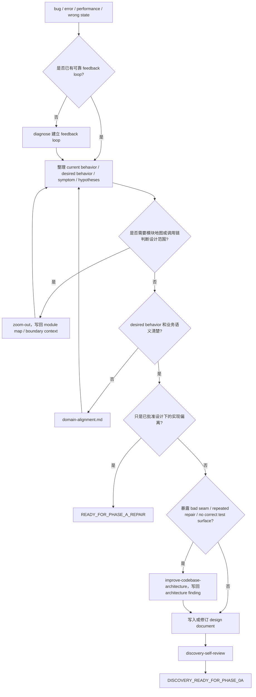
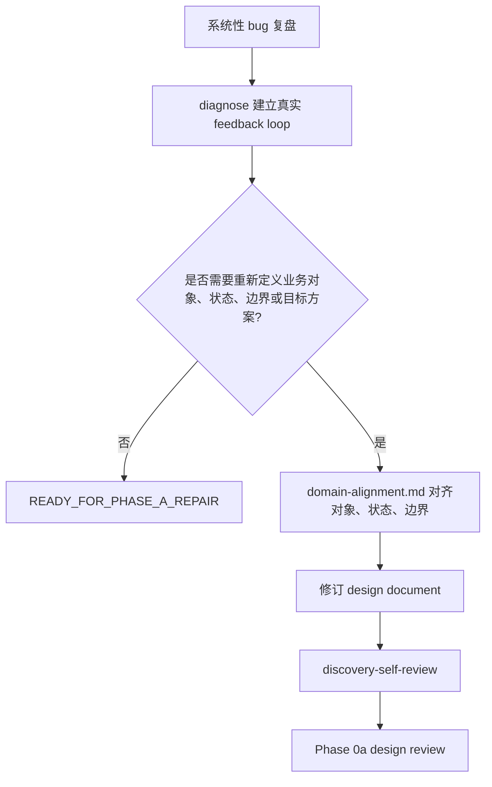

# Bug Input

用于 bug、报错、wrong state、performance regression 和系统性 bug 复盘。目标是把 bug 输入整理成 design document 所需事实，判断是修订设计，还是返回 Phase A repair；不负责 bug execution workflow。

## 规则

- 缺 feedback loop 时先用 `diagnose`。
- `diagnose` 必须产出 current behavior、desired behavior、reproduction / observable symptom、falsifiable hypotheses、key interfaces、regression check。
- 如果无法构建 feedback loop，设计文档必须记录已尝试的复现路径、缺失环境或需要用户提供的 artifact。
- desired behavior、业务术语、UI target、permission、billing、lifecycle 不清时，读取 `domain-alignment.md`。
- 出现 bad seam、shallow module、caller leakage、single-adapter interface、repeated repair、无正确测试面时，使用 `improve-codebase-architecture`，并把 architecture finding 写回设计文档。
- 需要模块地图或调用链才能判断设计范围时，使用 `zoom-out`。
- 如果 bug 只是已批准 design / mockup / acceptance 下的实现偏离，返回 `READY_FOR_PHASE_A_REPAIR`，不新建设计文档。
- 如果修复会改变正式行为、对象状态、权限、合同、UI target 或验收口径，必须产出或修订 design document。

## 写入 design document

- Current behavior
- Desired behavior
- Reproduction / symptom
- Confirmed / rejected hypotheses
- Root cause or suspected boundary
- Regression check
- User-visible target behavior
- Contract / UI / permission / billing impact
- Out of scope

## Bug 流程图

## 系统性 bug 复盘流程图

