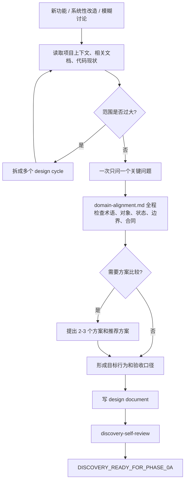

# Conversation To Design

用于普通新功能、系统性改造、模糊想法、产品讨论和设计讨论。目标是把还没有完全成形的想法讨论成 design document；不执行实现，不生成 plan，不拆 issue。

## 规则

- 先读项目上下文、相关文档、相关代码和近期变更。
- 需求过大时先拆成多个 design cycle。
- 一次只问一个会改变设计的问题。
- 可从文档和代码确认的事实先查证，不问用户。
- 优先问目的、约束、成功标准、用户场景、边界、验收。
- 必要时提出 2-3 个方案，说明 trade-off，并给推荐方案。
- 推荐方案必须解释为什么更适合当前项目。
- 分段确认设计；用户否定时修订设计，不进入实现。
- 简单需求也要有明确设计，只是文档可以短。
- 涉及视觉判断时才使用 mockup / diagram / browser companion；必须把视觉结论转成可验收页面状态、viewport、交互和允许偏差。
- 设计获得足够确认后写入 design document，再进入 self-review。

## 讨论维度

- 用户是谁。
- 用户现在遇到什么问题。
- 完成后用户能做什么。
- 系统需要新增或改变什么行为。
- 哪些对象、状态、权限、生命周期参与。
- 成功、失败、空状态、重复提交、权限不足、并发或回滚怎么处理。
- 哪些属于本次范围。
- 哪些明确不属于本次范围。
- 如何验证完成。

## 流程图

