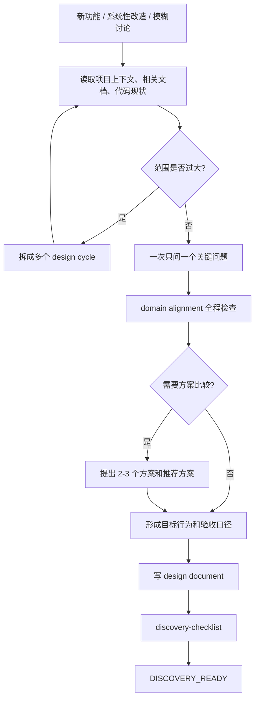
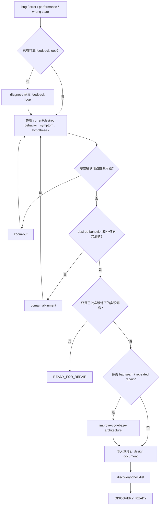
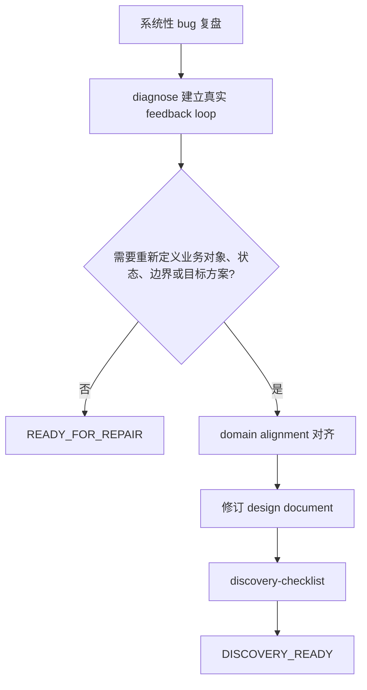
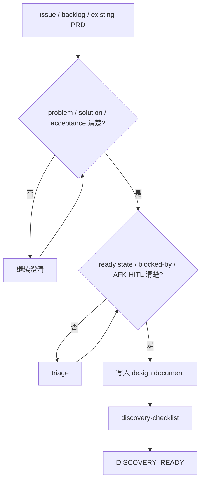
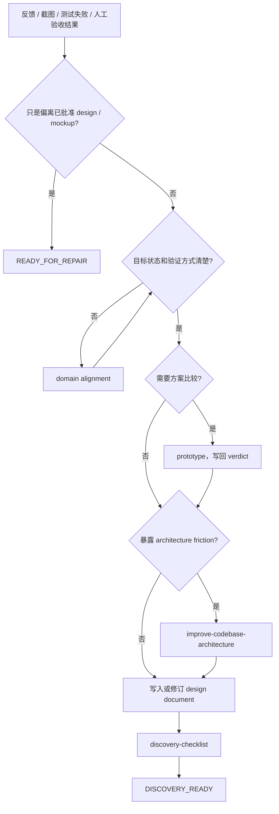
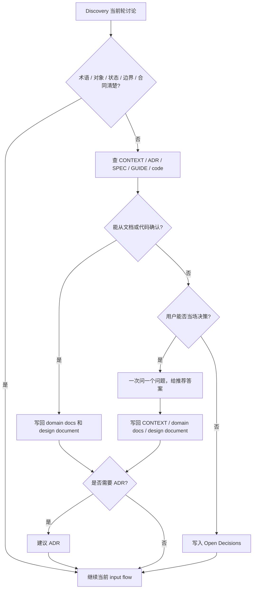

# Discovery Input

按输入类型执行对应章节。所有类型共享同一流程结构：定位材料 → domain alignment → 判断是否需要 upstream skill → 写 design document。

## 通用规则

- 先读项目上下文、相关文档、相关代码和近期变更。
- 一次只问一个会改变设计的问题；能从文档和代码确认的事实先查证，不问用户。
- 优先问目的、约束、成功标准、用户场景、边界、验收。
- 必要时提出 2-3 个方案，说明 trade-off，并给推荐方案；推荐方案必须解释为什么更适合当前项目。
- 分段确认设计；用户否定时修订设计，不进入实现。
- 简单需求也要有明确设计，只是文档可以短。
- 涉及视觉判断时才使用 mockup / diagram / browser companion；必须把视觉结论转成可验收页面状态、viewport、交互和允许偏差。
- 信息足够后按 `design-document-contract.md` 写 design document。

## 输入类型

### 新功能 / 系统性改造 / 模糊讨论

讨论维度：

- 用户是谁。
- 用户现在遇到什么问题。
- 完成后用户能做什么。
- 系统需要新增或改变什么行为。
- 哪些对象、状态、权限、生命周期参与。
- 成功、失败、空状态、重复提交、权限不足、并发或回滚怎么处理。
- 哪些属于本次范围。
- 哪些明确不属于本次范围。
- 如何验证完成。

需求过大时先拆成多个 design cycle。

### Bug / wrong state / performance regression

写入 design document 的字段：current behavior、desired behavior、reproduction / symptom、confirmed / rejected hypotheses、root cause or suspected boundary、regression check、user-visible target behavior、contract / UI / permission / billing impact、out of scope。

规则：

- 缺 feedback loop → 先用 `diagnose` 建立反馈环和事实记录。
- Discovery 只消费 `diagnose` 产出的 current behavior、desired behavior、reproduction / observable symptom、falsifiable hypotheses、key interfaces、regression check；修复交给 Direct Repair 或 Phase A。
- 如果无法构建 feedback loop，设计文档必须记录已尝试的复现路径、缺失环境或需要用户提供的 artifact。
- desired behavior、业务术语、UI target、permission、billing、lifecycle 不清时，按 Domain Alignment 处理。
- 出现 bad seam、shallow module、caller leakage、single-adapter interface、repeated repair、无正确测试面 → 使用 `improve-codebase-architecture`，把 architecture finding 写回设计文档。
- 需要模块地图或调用链 → 使用 `zoom-out`。
- 只是已批准 design 下的实现偏离 → 返回 `READY_FOR_REPAIR`，不新建 design。
- 修复会改变正式行为、对象状态、权限、合同、UI target 或验收口径 → 必须产出或修订 design document。

#### 系统性 bug 复盘

### Issue / backlog / existing PRD

写入 design document 的字段：source issue / PRD / backlog path or identifier、problem、solution、user stories、acceptance criteria、dependencies / blocked-by、AFK / HITL、open decisions、out of scope。

规则：

- issue / existing PRD 是 source material，不是独立设计生成流程。
- 如果已有 problem、solution、acceptance、dependencies、AFK / HITL，可以直接写入 design document。
- 如果 source intent、acceptance、blocked-by、ready state、AFK / HITL 不清，使用 `triage` 或继续 Discovery 提问；Discovery 只消费 triage state 和 issue brief，tracker 写入交给 Orchestrate parent 的 Scope / Issue recording target。
- 如果业务目标、用户场景、验收标准不清，按"新功能"章节继续澄清。
- Phase 0a 通过后，由 Orchestrate 使用 `to-issues` 拆 vertical large issues 和 vertical small issues。

### UI / UX / 截图 / 验收反馈

写入 design document 的字段：feedback source / screenshot / test / human acceptance note、target state、role / viewport / copy / interaction、visual or DOM verification、acceptance criteria、permission / billing / lifecycle implications、prototype verdict if used、out of scope。

规则：

- 主观反馈必须转成可验证行为、UI state、copy、interaction、viewport、acceptance 或 verification anchor。
- target state、role、copy、interaction、permission、billing、lifecycle 不清时，按 Domain Alignment 处理。
- 需要 UI / state / interface 方案比较 → 使用 `prototype`；prototype verdict 写回设计文档。
- 暴露 architecture friction → 使用 `improve-codebase-architecture`。
- 只是偏离已批准 design / mockup / acceptance → 返回 `READY_FOR_REPAIR`，不进入新 Discovery。
- 反馈暴露 source design 缺口 → 修订 design document，再进入 Phase 0a。

## Domain Alignment

全程横向检查，不是独立阶段。

### 触发条件

- 术语模糊、过载或与项目 glossary 冲突。
- 同一个词在用户语境和代码 / 文档语境中含义不同。
- 新对象 / 新状态 / 新角色 / 新 lifecycle。
- 对象 owner / writer / reader / verifier / cleanup responsibility 不清。
- UI role / permission / billing / state transition / sync ownership / runtime boundary 不清。
- 用户说法和代码 / CONTEXT / ADR / SPEC / GUIDE 冲突。
- 后续 `to-issues` 或 `plan-writing` 会因术语或边界不清而拆错。
- 某个决定 hard-to-reverse + surprising without context + real trade-off 同时成立，可能需要 ADR。
- 设计文档里出现"先这样""后面再看""临时""大概"等会让 future agent 无法执行的说法。

### 提问规则

- 一次只问一个问题。
- 每个问题给推荐答案。
- 能从代码 / 文档确认的先查证，不问用户。
- 用具体场景挑战边界，而不是问抽象偏好。
- 问题必须能改变设计文档、domain docs 或验收标准。
- 如果用户无法当场决定，写入 design document 的 Open Decisions，不假装已解决。

### 写回规则

- 稳定术语、对象关系、角色、状态 → 写入 `CONTEXT.md` 或项目指定 domain docs。
- 功能行为、UI 状态、接口合同、失败场景、验收 → 写入 design document。
- 架构取舍满足 ADR 条件 → 建议 ADR；用户确认后写 ADR。
- 未解决事项 → 写入 design document 的 Open Decisions。
- 所有写回必须自足，不能依赖当前聊天记录。

需要深度对齐时使用 `grill-with-docs`；结论必须写回 domain docs 和 design document，再回到当前 input flow。

