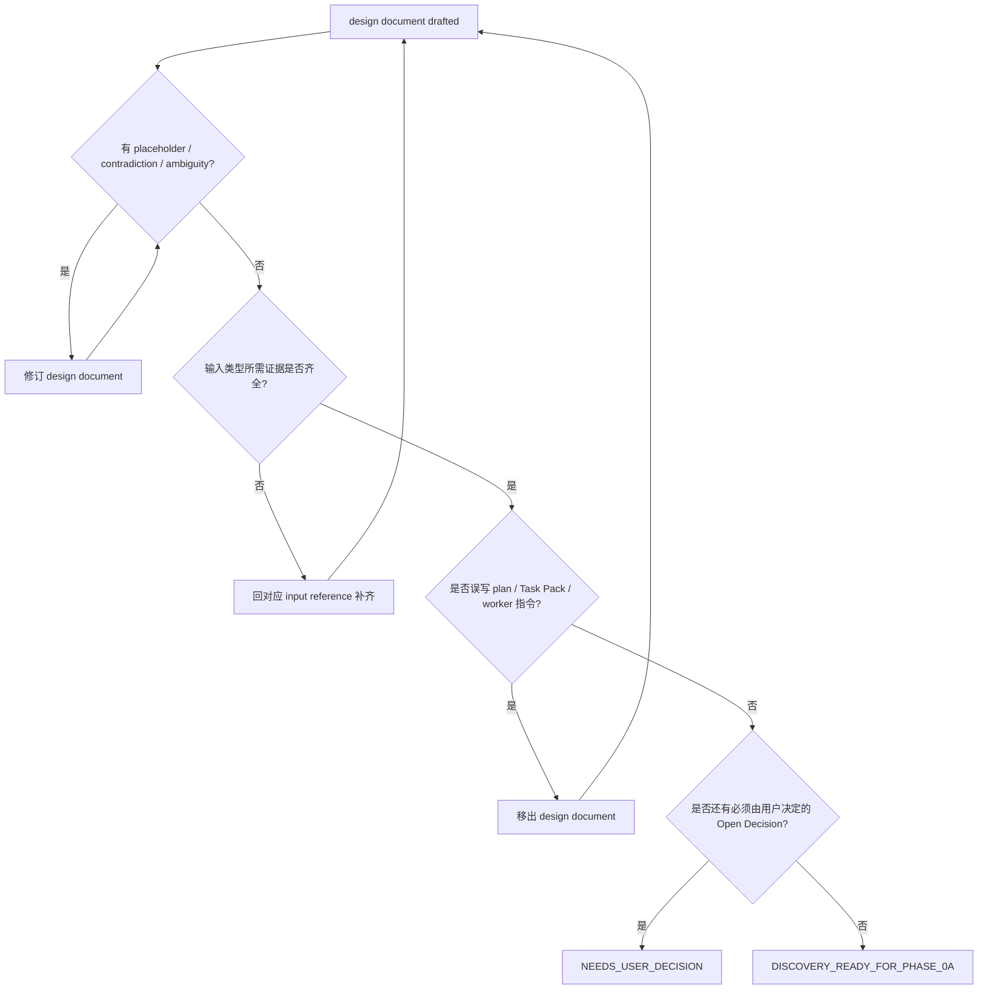

# Discovery Self Review

写完 design document 后加载。检查并修正文档，不进入实现。

## 检查项

- 是否存在 TODO / TBD / placeholder / vague wording。
- 是否和 `CONTEXT.md`、PROJECT、SPEC、ADR、GUIDE、代码事实冲突。
- 是否每个目标行为都能转成验收或测试。
- 是否有对象 / 状态 / 合同缺 owner、writer、reader、verifier。
- 是否有 UI / UX 输入但缺 mockup path、viewport、states、interaction 或 visual verification。
- 是否有 bug 输入但缺 current behavior、desired behavior、reproduction / symptom、regression check。
- 是否有 issue 输入但缺 source、acceptance、dependencies、AFK / HITL。
- 是否有 feedback 输入但缺 target state、role、copy、interaction 或 verification anchor。
- 是否把多个独立系统塞进一个 design document。
- 是否出现 implementation plan、Task Pack 或 worker instructions；有则移出。
- 是否可以进入 Phase 0a；不能则返回 `NEEDS_USER_DECISION` 或继续 Discovery。

## 流程图

