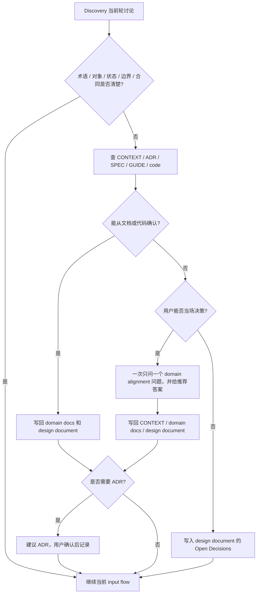

# Domain Alignment

Discovery 全程领域对齐。它不是新入口，不是新阶段，而是所有输入 reference 都会按需调用的横向规则。

## 触发条件

- 用户使用模糊、过载或与项目 glossary 冲突的术语。
- 出现新对象、新状态、新角色、新 lifecycle。
- 对象 owner、writer、reader、verifier、cleanup responsibility 不清。
- UI role、permission、billing、state transition、sync ownership、runtime boundary 不清。
- 用户说法和现有代码 / CONTEXT / ADR / SPEC / GUIDE 冲突。
- 同一个词在用户语境和代码 / 文档语境中含义不同。
- 后续 `to-issues` 或 `orchestrate-plan-writing` 会因为术语或边界不清而拆错。
- 某个决定 hard-to-reverse、surprising without context、real trade-off 同时成立，可能需要 ADR。
- 设计文档里出现“先这样”“后面再看”“临时”“大概”等会让 future agent 无法执行的说法。

## 提问规则

- 一次只问一个问题。
- 每个问题给推荐答案。
- 能从代码 / 文档确认的先查证，不问用户。
- 用具体场景挑战边界，而不是问抽象偏好。
- 问题必须能改变设计文档、domain docs 或验收标准。
- 如果用户无法当场决定，写入 design document 的 Open Decisions，不假装已解决。

## 写回规则

- 稳定术语、对象关系、角色、状态：写入 `CONTEXT.md` 或项目指定 domain docs。
- 功能行为、UI 状态、接口合同、失败场景、验收：写入 design document。
- 架构取舍满足 ADR 条件时，建议 ADR；用户确认后写 ADR。
- 未解决事项写入 design document 的 Open Decisions。
- 所有写回必须自足，不能依赖当前聊天记录。

## 返回主线

```text
domain alignment
  -> clarified context
  -> 更新 CONTEXT / domain docs
  -> 更新 design document
  -> 回到当前 input reference
  -> 继续 Discovery
```

## 流程图


