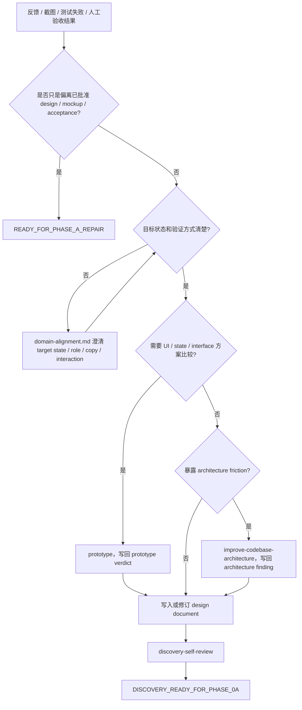

# Feedback Input

用于 UI / UX 反馈、截图标注、人工验收反馈、测试反馈和主观体验反馈。目标是把反馈转成可验证设计要求，或判断它只是 Phase A repair；不负责执行 repair。

## 规则

- 主观反馈必须转成可验证行为、UI state、copy、interaction、viewport、acceptance 或 verification anchor。
- target state、role、copy、interaction、permission、billing、lifecycle 不清时，读取 `domain-alignment.md`。
- state machine、interface shape 或 UI 方向需要比较时，使用 `prototype`；prototype verdict 写回设计文档。
- architecture friction 暴露时，使用 `improve-codebase-architecture`。
- 如果只是实现偏离已批准 design / mockup / acceptance，返回 `READY_FOR_PHASE_A_REPAIR`，不进入新 Discovery。
- 如果反馈暴露 source design 缺口，修订 design document，再进入 Phase 0a。

## 写入 design document

- Feedback source / screenshot / test / human acceptance note
- Target state
- Role / viewport / copy / interaction
- Visual or DOM verification
- Acceptance criteria
- Permission / billing / lifecycle implications
- Prototype verdict if used
- Out of scope

## 流程图

