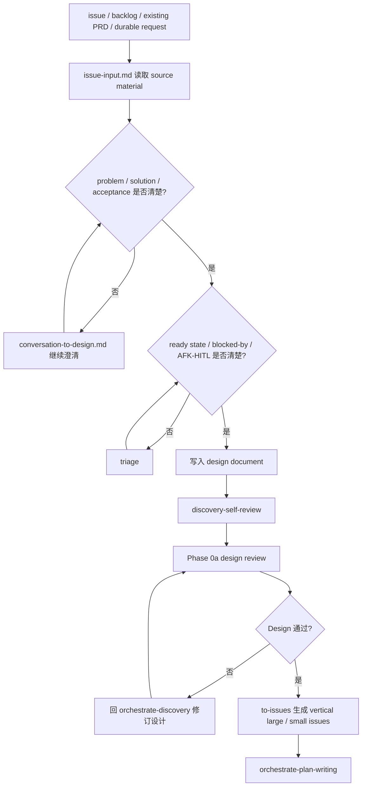

# Issue Input

用于 issue、backlog、existing PRD、durable request 和跨会话任务。目标是把 issue / backlog / existing PRD 转成 design document 的 source material；不把 PRD 当作另一条 workflow，不调用外部 PRD 生成技能，不在 Discovery 内调用 `to-issues`。

## 规则

- issue / existing PRD 是 source material，不是独立设计生成流程。
- 如果已有 problem、solution、acceptance、dependencies、AFK / HITL，可以直接写入 design document。
- 如果 source intent、acceptance、blocked-by、ready state、AFK / HITL 不清，使用 `triage` 或继续 Discovery 提问。
- 如果业务目标、用户场景、验收标准不清，读取 `conversation-to-design.md` 和 `domain-alignment.md`。
- Phase 0a 通过后，由 Orchestrate 使用 `to-issues` 拆 vertical large issues 和 vertical small issues。

## 写入 design document

- Source issue / PRD / backlog path or identifier
- Problem
- Solution
- User stories
- Acceptance criteria
- Dependencies / blocked-by
- AFK / HITL
- Open decisions
- Out of scope

## 流程图

