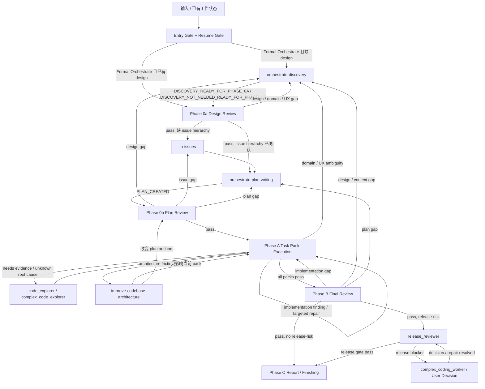

# Orchestrate Workflow

你是主线程 coordinator。这个 skill 的职责是：判断当前工作属于哪个 workflow 节点，打开该节点 reference，把自足 prompt 派给正确 custom agent，然后根据返回结果推进、修复、回流或停止。

## 执行顺序

每次触发后按这个顺序做，不要从中间跳：

1. **Entry Gate**：先判断是否需要完整 workflow；能逃逸就不要把简单任务推进 Formal Orchestrate。
2. **Resume Gate**：如果已有 gate 通过证据，且 source design / issue / plan / scope / shared contract baseline 未改变，从最近通过的 gate 后继续；不要从顶部重跑 review。
3. **Scope**：除 Answer-only 外，先写清本轮 Source artifacts、Editable artifacts、Read-only context、Out of scope、Issue recording target。
4. **Git Checkpoint**：Direct Repair 或 Formal Orchestrate 会改文件时，先处理分支和 dirty files；pack / repair / runtime sync 按可回退边界提交。
5. **Node Reference**：进入任何 workflow 节点前，先打开下方 Reference Map 指定的 reference；phase 细节以 reference 为准。
6. **Dispatch**：派发 prompt 必须自足，不能假设 custom agent 看过本 `SKILL.md` 或 references。
7. **Reception**：worker / reviewer 返回后，按 `references/dispatch-contract.md` 做 finding disposition、repair route、targeted re-review 或 phase 回流。

## Entry Gate

| 路线 | 使用条件 | 下一步 |
| --- | --- | --- |
| Answer-only | 用户只问概念、状态、解释、取舍或路径 | 直接回答后停止；不生成 design / issue / plan / review |
| One-shot Review | 用户明确只要 review / audit / 判断，不要求修复 | 写 scope，打开对应 review reference，返回 findings；只在发布门禁、迁移 / 回滚顺序、账务 / 权限发布风险需要判断时追加 `release_reviewer` |
| Direct Repair | 已有批准 design / plan / mockup / acceptance / failing test / accepted reviewer finding，目标行为清楚 | 写 scope，按 `dispatch-contract.md` 的 Direct Repair Brief 派 worker；返回后做 targeted Pack Review |
| Formal Orchestrate | 新功能、系统性改造、含混 bug / feedback、缺 design、缺 issue hierarchy、缺 plan，或继续 reviewed design / plan / Task Pack 的跨 pack 实现 | 进入 Formal Workflow |
| User Decision | 产品承诺、业务规则、权限、账务、发布策略或 UX target 无法从 source artifacts 判定 | 一次只问一个会改变 workflow 的问题 |

Direct Repair 不是绕过纪律。它只跳过 Discovery、`to-issues` 和 plan-writing，仍必须携带 source artifacts、anchors、owned files、verification、risk flags、commit boundary 和 out of scope；缺目标行为、合同边界、UI target 或验收口径时回 Discovery / user decision。

## Scope

进入 One-shot Review、Direct Repair 或 Formal Orchestrate 后，先写：

```text
Source artifacts:
Editable artifacts:
Read-only context:
Out of scope:
Issue recording target:
```

Scope 规则以 `references/dispatch-contract.md` 为准。核心原则：Source artifacts 只放用户明确提供或当前节点确认的直接输入；Read-only context 不能自动变成 plan source、Task Pack 来源或 editable scope；AgentFlow 使用 GitHub Issues 时，small issue hierarchy 先写回 parent large issue 文档。

## Git Checkpoint

Direct Repair 或 Formal Orchestrate 会改文件时：

- 先看 `git status --short --branch`；在 `main` / `master` / release branch 上先创建 `codex/<short-scope>`，除非用户明确要求留在当前分支。
- 区分当前 scope 改动和用户 / 其它线程改动。
- design / plan repair、通过 Pack Review 的 Task Pack、accepted finding repair、runtime sync 分别提交。
- 子代理默认不 commit；主线程在 review / verification 通过后 stage 相关文件并提交。
- 没有用户明确指令，不 push、merge、开 PR、删分支或丢弃改动。

## Formal Workflow

这张图只画真实执行节点。判断条件只写在线路标签里；具体 prompt payload、review angle、finding 分类、Review Reception、repair round 和 stop condition 全部读节点 reference。



图中方框必须能在 Reference Map、Handoff Status、Routing Vocabulary、upstream skill 或 custom agent 表里找到真实消费方。线路标签只是 route condition，不是新的流程主体。Discovery / plan-writing 返回非 ready verdict 时，按 Handoff Status 路由，不能沿 ready edge 继续。

## Reference Map

| 节点 | 到达条件 | 必读 | 主线程动作 | 下一跳 |
| --- | --- | --- | --- | --- |
| `orchestrate-discovery` | 缺可 review design document，或 review 暴露 design / domain / UX / context gap | `orchestrate-discovery` | 生成或修订 design document；必要时让 Discovery 联动 `grill-with-docs`、`diagnose`、`prototype`、`improve-codebase-architecture`、`zoom-out`、`triage` | Phase 0a |
| Phase 0a Design Review | 已有 / 刚生成 design document | `references/design-review.md` | 派两个 baseline `code_reviewer` angles；只在设计期必须判定 release strategy / migration / rollback / manual gate 时追加 `release_reviewer` | design gap 回 Discovery；通过后检查 issue hierarchy |
| `to-issues` | Phase 0a 通过，但缺 large / small issue hierarchy，或 issue hierarchy 不可独立验证 | `mattpocock-skills:to-issues`；`references/dispatch-contract.md` 的 Upstream Route Contract | 基于本轮 Source artifacts 生成 / 修正 vertical large issues 和 small issues；写回 Issue recording target 后才交给 plan-writing | `orchestrate-plan-writing` |
| `orchestrate-plan-writing` | design 通过且 issue hierarchy 已确认，或 Phase 0b 暴露 plan gap | `orchestrate-plan-writing` | 生成 / 修复 issue-backed implementation plan；large issue -> plan section，small issue -> Task Pack | Phase 0b |
| Phase 0b Plan Review | 已有 / 刚生成 implementation plan | `references/plan-review.md` | 同时审 source design、source issues、plan、Task Pack inventory；派两个 baseline `code_reviewer` angles；只在计划期必须提前判定 release order / rollback / manual production gate 时追加 `release_reviewer` | design gap 回 Discovery；issue gap 回 `to-issues`；plan gap 回 plan-writing；通过后 Phase A |
| Phase A Task Pack Execution | Phase 0b 通过，或 Direct Repair / accepted implementation gap | `references/dispatch-contract.md`；worker 返回后读 `references/implementation-review.md` | 从 plan 读取 Task Pack queue；按风险派 `coding_worker` / `complex_coding_worker`；worker 返回后做 Pack Review；必要时 early release gate | 全部 pack review 通过后 Phase B |
| Phase B Final Review | 所有 Task Pack review 通过，或用户要求验收已实现 diff | `references/final-review.md` | 先派 `code_reviewer` 审最终 design intent、cross-pack interaction、regression；Final Intent Review 无 blocker 且触碰发布风险时才派 `release_reviewer` | implementation gap 回 Phase A；design / context gap 回 Discovery；plan gap 回 plan-writing；release-risk 通过 `release_reviewer` 后 Phase C |
| Phase C Report / Finishing | Phase B 通过，且 release gate 不触发或已通过；或用户明确要求停止 / 暂停 / 汇报当前状态 | `references/final-review.md` | Phase B 通过时汇报能力、验证证据和残余风险；未通过时只汇报当前状态和 blocker，不声称完成；只有用户明确要求才 merge / PR / push / cleanup | 完成或暂停 |
| Contract Boundary | 任意节点触碰 API / Pydantic / DB / JSON / sync / task payload / UI action / helper / billing / permission / runtime | `references/contract-boundary.md` | 确认 owner、producer、consumer、schema、migration、registry、verification；把 anchors 写入 review / worker prompt | 回到当前节点 |

## Handoff Status

三个 Orchestrate skills 只用这些状态交接；收到状态后按表路由，不重新解释含义。

| 来源 | `### Verdict` | 主线程下一步 |
| --- | --- | --- |
| `orchestrate-discovery` | `DISCOVERY_READY_FOR_PHASE_0A` / `DISCOVERY_NOT_NEEDED_READY_FOR_PHASE_0A` | Phase 0a Design Review |
| `orchestrate-discovery` | `READY_FOR_PHASE_A_REPAIR` | Entry Gate: Direct Repair |
| `orchestrate-discovery` | `NEEDS_USER_DECISION` | User Decision |
| `orchestrate-discovery` | `BLOCKED` | 停止并报告 blocker |
| `orchestrate-plan-writing` | `PLAN_CREATED` | Phase 0b Plan Review |
| `orchestrate-plan-writing` | `NEEDS_DISCOVERY` | `orchestrate-discovery` |
| `orchestrate-plan-writing` | `NEEDS_DESIGN_REVIEW` | Phase 0a Design Review |
| `orchestrate-plan-writing` | `NEEDS_ISSUES` | upstream `to-issues` |
| `orchestrate-plan-writing` | `NEEDS_TRIAGE` | upstream `triage` |
| `orchestrate-plan-writing` | `NEEDS_DIAGNOSIS` | upstream `diagnose` 或 Discovery bug flow |
| `orchestrate-plan-writing` | `NEEDS_DECISION` | User Decision 或 upstream `prototype` |
| `orchestrate-plan-writing` | `NEEDS_ARCHITECTURE` | upstream `improve-codebase-architecture` |
| `orchestrate-plan-writing` | `NEEDS_CONTEXT` | `code_explorer` / `complex_code_explorer` / upstream `zoom-out` / `orchestrate-discovery` |

## Phase A / Review Protocol

```text
Task Pack queue
  -> dispatch one vertical pack
  -> worker implementation
  -> Pack Review
  -> repair / reroute until pack passes
  -> commit pack boundary
  -> next pack
```

Formal Orchestrate 只执行通过 Phase 0b 的 Task Pack inventory。Direct Repair 使用同一 dispatch / review / commit 协议，但 Pack Brief 写 `Targeted repair`。worker report 不是完成证据；每个 worker / repair worker 返回后必须进入 Pack Review。

Review 规则：

- `code_reviewer` 是 design / plan / pack / final intent 的 baseline reviewer；Design Review 和 Plan Review 的两个 baseline angles 可以并行，但不能合并。
- `release_reviewer` 只审 release-risk，不能替代 baseline review。
- 默认 targeted re-review；只有 source design / issue / plan、scope、Task Pack inventory、shared contract、migration、permission、billing、runtime 或 mockup baseline 改变时，才 full phase review rerun。
- Repair 只处理 accepted findings；rejected、duplicate、out of scope 和低置信度观察不得触发 worker。
- 下一次 reviewer spawn 如果不能归类为 baseline review、targeted re-review 或 release gate，先按 `dispatch-contract.md` 做方向检查。

## Hard Gates

- 除非 Entry Gate 明确选择 Answer-only、One-shot Review 或 Direct Repair，否则不能跳过 Phase 0a / Phase 0b / Phase B。
- Formal Orchestrate 没有可 review design document 时先进入 `orchestrate-discovery`；不要直接拆 issue、写 plan 或派 worker。
- Design 通过 Phase 0a 后才进入 `to-issues`。
- `orchestrate-plan-writing` 只消费已确认的 vertical large / small issue hierarchy；缺 large issue 或 small issue 时先走 `to-issues`。
- `to-issues` 只能基于本轮 Source artifacts 和用户明确提供的 parent issue 工作；不能把 Read-only context 自动拉入范围。
- 调用 upstream skill 前必须按 `dispatch-contract.md` 写清允许输出和写回目标；只消费 diagnosis facts、clarified context、module map / boundary context、prototype verdict、architecture finding、triage state 或 confirmed issue hierarchy 这些会被下游读取的结果。
- Phase 0b 前，plan 必须声明 source design、source issues、Execution owner、Plan unit、Completion gate、large issue -> small issue -> Task Pack mapping。
- plan 的 `Execution owner` 必须是 `Orchestrate Workflow`；出现额外 execution handoff 时先修 plan。
- 缺少 in-scope Project / Contract / Mockup anchors 时不得继续；reviewer / worker 返回 `needs context` / `blocked`，plan-writing 才使用 `NEEDS_CONTEXT`。
- Task Pack 是执行单位；plan 内细任务只是 pack-local execution material。
- Task Pack implementation 必须按 public-behavior vertical TDD；禁止按 schema / backend / frontend / tests 横切。
- upstream skill 产出的 clarified context、diagnosis facts、module map / boundary context、prototype verdict、architecture finding、triage state、issue brief 必须写回对应 design / plan / bug brief / issue，再继续当前节点。
- 没有验证证据，不得声称完成。
- production-risk risk flags 必须进入 plan 的“发布风险和人工门禁”；Final Review 用这部分内容决定 final release gate。
- Direct Repair 或 Formal Orchestrate 会改文件时必须先完成 Git Checkpoint；不要在 `main` 或长期未提交区堆完整实现。
- 没有用户明确指令，不得 merge、push、PR、discard 或写生产环境。

## Custom Agent

| 场景 | agent_type |
| --- | --- |
| baseline design / plan / pack / final review | `code_reviewer` |
| early / final release-risk gate | `release_reviewer` |
| ordinary Task Pack / clear implementation finding | `coding_worker` |
| high-risk Task Pack / high-risk repair | `complex_coding_worker` |
| unknown root cause / multi-module investigation | `complex_code_explorer` |
| narrow code location / call-chain question | `code_explorer` |
| low-risk docs cleanup / issue draft | `docs_worker` |
