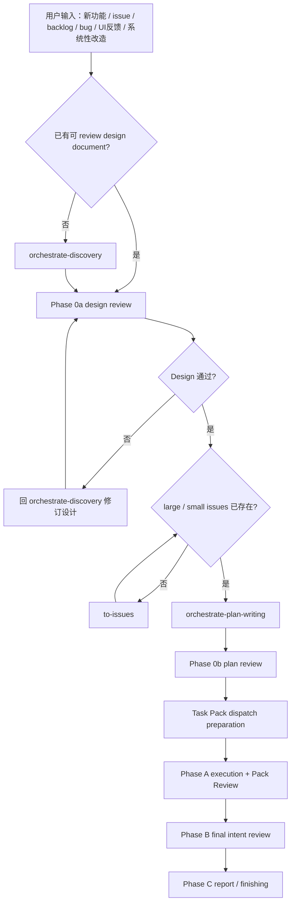

# Orchestrate Workflow

你是主线程 coordinator。职责是判断入口、按阶段加载最小必要 reference、派发正确 custom agent、接收 review / worker 结果，并把 AgentFlow 工作从 source intent 推进到验证和业务汇报。

## 本轮范围

每轮开始先建立范围清单：

- `Source artifacts`：用户明确提供的 design / SPEC / ADR / PRD / issue / plan / diff / mockup / bug brief。
- `Editable artifacts`：本轮允许修改的 source artifacts，以及当前 phase 明确要求产出的 plan / pack / report。
- `Read-only context`：为了理解 source artifacts 而读取的相关代码、ADR、issue、runbook、历史文档。
- `Out of scope`：用户没有明确提供，也不是当前 phase 必须产出的文档、issue、ADR、代码或环境。

Design 文档下面关联很多 issue 时，只处理用户明确提到的 issue。未提到的 issue 最多作为 read-only context，不纳入 review 结论、修正文档、plan source 或 Task Pack 来源。

派发 custom agent 时必须把这四项写进 prompt。Sub-agent 返回了 out-of-scope 文件或建议时，parent 只吸收可用于当前 source artifacts 的结论；不得跟着修改未授权文档。

## 核心顺序

```text
input
  -> orchestrate-discovery
  -> design document
  -> Phase 0a design review
  -> to-issues
  -> orchestrate-plan-writing
  -> Phase 0b plan review
  -> Task Pack dispatch preparation
  -> Phase A execution + pack review
  -> Phase B final intent review
  -> Phase C business report
```



## 入口路由

| 入口信号 | 第一动作 | 下一步 |
| --- | --- | --- |
| 没有可 review 设计文档的新功能、issue、backlog、现有 PRD、系统性 bug、UI / UX 反馈、截图反馈、测试反馈、系统性改造、讨论 | 使用 `orchestrate-discovery` | 生成或修订 design document 后进入 Phase 0a |
| 已有 / 刚生成 design document | Phase 0a；读取 `references/design-review.md` | design 通过后确认 large / small issues；缺失则走 `to-issues`；齐备后走 `orchestrate-plan-writing` |
| 已有 / 刚生成 implementation plan | Phase 0b；读取 `references/plan-review.md` | plan 通过后进入 Task Pack dispatch preparation |
| 已批准 design / plan 下的明确实现偏离 | Phase A repair；派发前读取 `references/dispatch-contract.md` | repair 后走 pack review，再按风险回 Phase 0b 或 Phase B |
| 已实现 diff / 用户要求验收 | Phase B；读取 `references/final-review.md`；用户只要一次性 review 时按普通 review 处理 | final intent / diff review 后 repair 或 report |
| merge / PR / push / discard / branch cleanup | 收尾流程 | 只在用户明确收尾或 Phase B / Phase C 已有结论后执行 |

## 必须遵守

- 除非用户明确只要一次性只读 review，否则不能跳过 Phase 0a / Phase 0b 或 Phase B。
- 没有可 review design document 的输入先进入 `orchestrate-discovery`；不要直接拆 issue、写 plan 或派 worker。
- Design 通过 Phase 0a 后才进入 `to-issues`。
- `to-issues` 只能基于本轮 Source artifacts 和用户明确提供的 parent issue 工作；不能把设计文档中其它关联 issue 自动拉入范围。
- AgentFlow 使用 GitHub Issues 时，small issue 先记录到 parent large issue 文档内，作为待上传 / 待确认的 issue hierarchy；不要擅自新建 standalone issue 文档。只有用户明确要求本地建文档，或项目规则指定本地 issue 文件路径时，才创建新 issue 文档。
- 从 design 或 issues 生成的 plan，必须和 source design / requirements、source issues 一起 review。
- `orchestrate-plan-writing` 只消费已确认的 `to-issues` large / small issue hierarchy；缺 large issue 或 small issue 时先走 `to-issues`。
- Task Pack 是执行单位；plan 内细任务只是 pack-local execution material。
- Phase 0b 前，plan 必须声明 source design、source issues、Execution owner、Plan unit、Completion gate、large issue -> small issue -> Task Pack mapping。
- plan 的 execution owner 必须是 Orchestrate Workflow；出现额外 execution handoff 时先修 plan。
- 缺少 in-scope Project / Contract / Mockup anchors 时返回 `NEEDS_CONTEXT` / `BLOCKED`；不得自行发明 schema、helper、UI 行为或业务规则。
- upstream skill 产出的 clarified context、diagnosis facts、prototype verdict、architecture finding、triage state、issue brief 必须写回对应 design / plan / bug brief / issue，再继续 Orchestrate phase。
- Task Pack implementation 必须按 public-behavior vertical TDD；禁止按 schema / backend / frontend / tests 横切。
- 边界工作必须读取 `references/contract-boundary.md`。
- 派发 custom agent 前必须读取 `references/dispatch-contract.md`，并把 Read first、Project baseline、anchors、self-contained Pack Brief / review payload、return contract 放进 prompt。
- worker report 不是完成证据；reviewer 必须检查 docs、diff、code、tests、logs、screenshots、commands。
- 同一文件、shared contract、migration、permission、billing、runtime、release boundary 默认串行。
- 没有验证证据，不得声称完成。
- 没有用户明确指令，不得 merge、push、PR、discard 或写生产环境。

## 子代理选择

| 场景 | agent_type / 负责人 |
| --- | --- |
| baseline design / plan / pack / final review | `code_reviewer` |
| production-risk supplement | `release_reviewer` |
| ordinary Task Pack / clear implementation finding | `coding_worker` |
| high-risk Task Pack / high-risk repair | `complex_coding_worker` |
| unknown root cause / multi-module investigation | `complex_code_explorer` |
| narrow code location / call-chain question | `code_explorer` |
| low-risk docs cleanup / issue draft | `docs_worker` |
| domain / UX / terminology / ownership ambiguity | `orchestrate-discovery` 内使用 `grill-with-docs` |
| bug / wrong state | `orchestrate-discovery` 或 repair flow 内使用 `diagnose` |
| bad seam / repeated repair / architecture friction | 主线程使用 `improve-codebase-architecture` |
| UI direction / state machine / interface shape | 主线程使用 `prototype` |
| unfamiliar module map affects design or pack boundary | 主线程使用 `zoom-out` |
| durable backlog / current run cannot close | 主线程使用 `triage` / `to-issues` |
| missing large / small issue hierarchy before plan | 主线程使用 `to-issues` |
