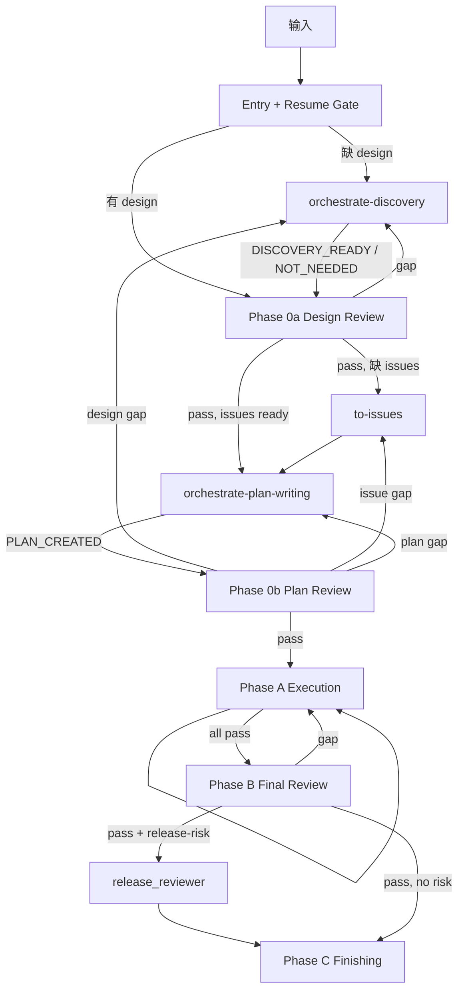
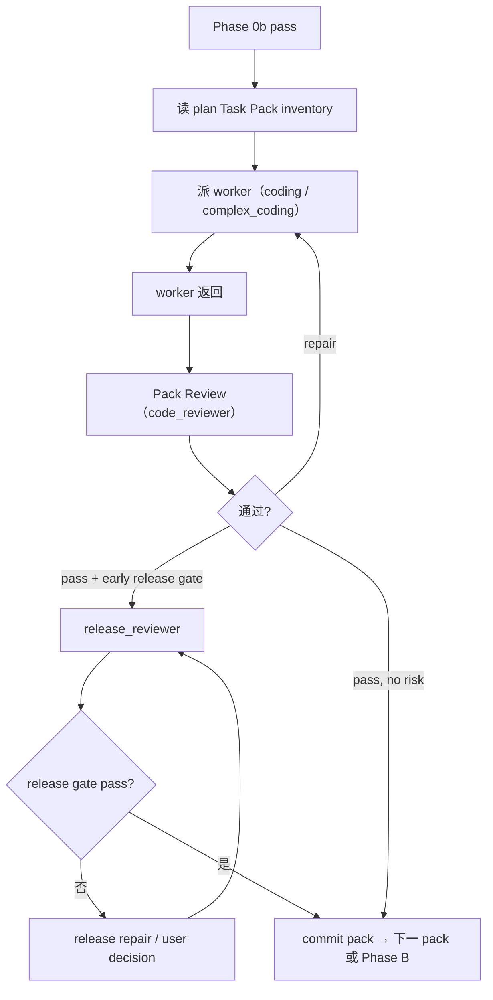

# Orchestrate Workflow

主线程 coordinator。职责：判断 workflow 节点 → 读节点 reference → 构建自足 dispatch prompt → 派 custom agent → 根据返回推进、修复、回流或停止。

## 执行顺序

每次触发：

1. **Entry Gate** → 判断走哪条路线。
2. **Resume Gate** → 已有 gate 通过且 source 未变时，从最近通过 gate 后继续。
3. **Scope** → 写清 Source artifacts / Editable artifacts / Read-only context / Out of scope / Issue recording target。
4. **Git Checkpoint** → 会改文件时处理分支和 dirty files。
5. **Node Reference** → 进入节点前先打开 Reference Map 指定的 reference。
6. **Dispatch** → prompt 必须自足，sub-agent 看不到本 SKILL.md 和 references。
7. **Reception** → 按 `references/dispatch-contract.md` 做 finding disposition 和路由。

## Entry Gate

| 路线 | 条件 | 下一步 |
| --- | --- | --- |
| Answer-only | 只问概念/状态/解释 | 回答后停止 |
| One-shot Review | 只要 review，不要修复 | 写 scope，按对应 review reference 审查 |
| Direct Repair | 已有批准 design/plan/mockup/acceptance/failing test，目标行为清楚 | 按 `dispatch-contract.md` 派 worker，完成后按风险分级决定 review 方式 |
| Formal Orchestrate | 新功能、系统性改造、含混 bug/feedback、缺 design/issue/plan | 进入 Formal Workflow |
| User Decision | 产品/业务/权限/账务/发布策略无法判定 | 一次只问一个问题 |

## Formal Workflow



## Reference Map

| 节点 | 必读 reference | 主要动作 |
| --- | --- | --- |
| Discovery | `orchestrate-discovery/SKILL.md` | 生成/修订 design document |
| Phase 0a | `references/design-review.md` | 派 2 baseline `code_reviewer` |
| to-issues | `dispatch-contract.md` Upstream Route | 生成 vertical issue hierarchy |
| Plan Writing | `orchestrate-plan-writing/SKILL.md` | 生成 issue-backed plan |
| Phase 0b | `references/plan-review.md` | 派 2 baseline `code_reviewer` |
| Phase A | `references/dispatch-contract.md` + `references/implementation-review.md` | 逐 pack 派 worker → Pack Review |
| Phase B | `references/final-review.md` | Final Intent Review + release gate |
| Phase C | — | 汇报 + 收尾 |
| 合同边界 | `references/contract-boundary.md` | 任意节点触碰 API/DB/billing/permission 时 |

## Handoff Status

| 来源 | Verdict | 下一步 |
| --- | --- | --- |
| discovery | `DISCOVERY_READY` / `DISCOVERY_NOT_NEEDED` | Phase 0a |
| discovery | `READY_FOR_REPAIR` | Direct Repair |
| discovery | `NEEDS_USER_DECISION` | User Decision |
| discovery | `BLOCKED` | 停止 |
| plan-writing | `PLAN_CREATED` | Phase 0b |
| plan-writing | `NEEDS_DISCOVERY` | discovery |
| plan-writing | `NEEDS_DESIGN_REVIEW` | Phase 0a |
| plan-writing | `NEEDS_ISSUES` | to-issues |
| plan-writing | `NEEDS_TRIAGE` | triage |
| plan-writing | `NEEDS_DIAGNOSIS` | diagnose / discovery |
| plan-writing | `NEEDS_DECISION` | user / prototype |
| plan-writing | `NEEDS_ARCHITECTURE` | improve-codebase-architecture |
| plan-writing | `NEEDS_CONTEXT` | code_explorer / zoom-out |
| review | `pass` | 下一 phase |
| review | `needs repair` | 修复后 targeted re-review |
| review | `needs context` | explorer / discovery |
| review | `blocked` | 停止 |

## Custom Agents

| 场景 | agent |
| --- | --- |
| baseline review (design/plan/pack/final) | `code_reviewer` |
| release-risk gate | `release_reviewer` |
| 普通 Task Pack / 普通 repair | `coding_worker` |
| 高风险 Task Pack / 高风险 repair | `complex_coding_worker` |
| 多模块调查 / unknown root cause | `complex_code_explorer` |
| 窄范围代码问题 | `code_explorer` |
| 低风险文档整理 | `docs_worker` |

## Hard Gates

- 没有验证证据，不得声称完成。
- 没有用户明确指令，不得 merge / push / PR / discard / 写生产环境。
- Formal Orchestrate 没有可 review 的 design document 时先进 Discovery，不跳到 plan / worker。
- Phase 0a / Phase 0b / Phase B 不可跳过（除非 Entry Gate 选择了 Answer-only / One-shot Review / Direct Repair）。
- upstream skill 结论必须写回 design / plan / bug brief，再继续当前节点。

## Phase A 执行循环



## Scope 模板

```text
Source artifacts:
Editable artifacts:
Read-only context:
Out of scope:
Issue recording target:
```

## Git Checkpoint

- 在 main/master/release branch 上先创建 `codex/<short-scope>`。
- worker 不 commit；主线程在 review 通过后 stage 并提交。
- pack/repair/runtime sync 分别提交。
- 不 push/merge/PR/删分支，除非用户明确要求。
