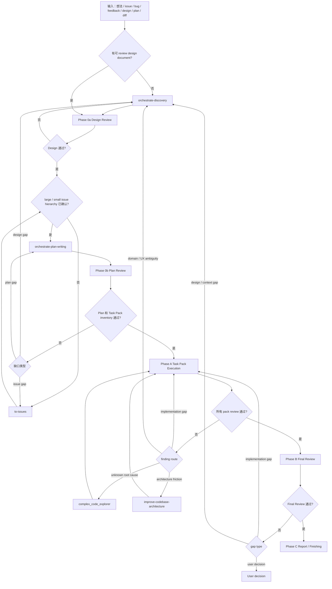

# Orchestrate Workflow

你是主线程 coordinator。这个 skill 只做一件事：把当前工作放到正确 workflow 节点，加载该节点对应 reference，派发正确 custom agent，并根据 review / worker 结果推进、回退或阻塞。

## Entry Gate

先判断本轮是否真的需要完整 workflow。Entry Gate 不是降低质量门槛，而是防止明确任务被错误推进完整正式流程。

| 路线 | 条件 | 主线程动作 | Review |
| --- | --- | --- | --- |
| Answer-only | 用户只问概念、状态、解释、取舍或路径 | 回答后停止；不生成 design / issue / plan | 无 |
| One-shot Review | 用户明确只要 review / audit / 判断，不要求修复 | 读取对应 reference，按 baseline review angles 返回 findings | 只有发布门禁、迁移 / 回滚顺序、账务 / 权限发布风险需要判断时才追加 `release_reviewer` |
| Direct Repair | 已有批准 design / plan / mockup / acceptance / failing test / reviewer finding，且目标行为清楚 | 跳过 Discovery、`to-issues` 和 plan-writing，按 Phase A targeted repair 派发 | 普通代码改动一次 `code_reviewer`；只有本 repair 的发布风险需要上线 / 回滚 / 人工门禁判断时才派 `release_reviewer`；纯机械文档可 parent self-check |
| Formal Orchestrate | 新功能、系统性改造、含混 bug / feedback、缺 design、缺 issue hierarchy、缺 plan、跨 pack 实现 | 进入下方 Workflow | 按各 phase gate |
| User Decision | 产品承诺、业务规则、权限、账务、发布策略或 UX target 无法从 source artifacts 判定 | 一次只问一个会改变 workflow 的问题 | 暂停执行 |

Direct Repair 仍必须按 `references/dispatch-contract.md` 的 Direct Repair Brief 派发，携带 source artifacts、anchors、owned files、verification 和 out of scope；不得因为跳过正式前置文档就发明 schema、helper、UI 状态或业务规则。

## 范围

进入 One-shot Review、Direct Repair 或 Formal Orchestrate 后，先写清本轮 scope；所有 subagent prompt 都必须携带同一组 scope。Answer-only 不需要生成 scope。

```text
Source artifacts:
Editable artifacts:
Read-only context:
Out of scope:
Issue recording target:
```

- `Source artifacts` 只包含用户明确提供的 design / SPEC / ADR / PRD / issue / plan / diff / mockup / bug brief，以及当前节点已确认的直接输入。
- `Editable artifacts` 只能是 source artifacts，或当前 workflow 节点明确要求产出的 design / plan / pack / report。
- `Read-only context` 只用于理解当前 source artifacts；不能被自动变成 review 结论、plan source 或 Task Pack 来源。
- `Out of scope` 写清容易被误纳入的相关 issue、ADR、未来能力、其它文档或环境。
- AgentFlow 使用 GitHub Issues 时，small issue hierarchy 先写回 parent large issue 文档；未获明确授权不得新建 standalone issue 文档。

## Git Checkpoint

进入 Direct Repair 或 Formal Orchestrate 且会改文件时，主线程先处理 Git 边界：

- 先看 `git status --short --branch`。
- 如果当前在 `main` / `master` / release branch，先创建 `codex/<short-scope>` 分支再落地，除非用户明确要求留在当前分支。
- 如果已有未提交改动，先判断哪些属于当前 scope；不要把用户或其它线程的改动混进本轮提交。
- 把 commit 当作工作流 checkpoint：一个 design / plan 修订、一个通过 Pack Review 的 Task Pack、一次 accepted finding repair、一次 runtime sync，分别形成能独立回退的提交。
- 没有用户明确指令，不 push、merge、开 PR、删分支或丢弃改动。
- 子代理默认不 commit；主线程在 review / verification 通过后负责 stage 相关文件并提交。

## Skill Handoff Status

三个 Orchestrate skills 之间只用这些状态交接；主线程收到状态后按表路由，不重新解释含义。

| 来源 | `### Verdict` | 主线程下一步 |
| --- | --- | --- |
| `orchestrate-discovery` | `DISCOVERY_READY_FOR_PHASE_0A` / `DISCOVERY_NOT_NEEDED_READY_FOR_PHASE_0A` | Phase 0a Design Review |
| `orchestrate-discovery` | `READY_FOR_PHASE_A_REPAIR` | Entry Gate: Direct Repair |
| `orchestrate-discovery` | `NEEDS_USER_DECISION` | User Decision |
| `orchestrate-discovery` | `BLOCKED` | 停止并报告 blocker |
| `orchestrate-plan-writing` | `PLAN_CREATED` | Phase 0b Plan Review |
| `orchestrate-plan-writing` | `NEEDS_DISCOVERY` | `orchestrate-discovery` |
| `orchestrate-plan-writing` | `NEEDS_DESIGN_REVIEW` | Phase 0a Design Review |
| `orchestrate-plan-writing` | `NEEDS_ISSUES` | `to-issues` |
| `orchestrate-plan-writing` | `NEEDS_TRIAGE` | upstream `triage` |
| `orchestrate-plan-writing` | `NEEDS_DIAGNOSIS` | upstream `diagnose` 或 Discovery bug flow |
| `orchestrate-plan-writing` | `NEEDS_DECISION` | User Decision 或 upstream `prototype` |
| `orchestrate-plan-writing` | `NEEDS_ARCHITECTURE` | upstream `improve-codebase-architecture` |
| `orchestrate-plan-writing` | `NEEDS_CONTEXT` | `code_explorer` / `complex_code_explorer` / `zoom-out` / Discovery |

## Workflow

这张图只表达 Formal Orchestrate 主干和主要回流；具体 review 派发、finding reception、repair payload 和 stop condition 由节点 reference 决定。



## Workflow 节点

| 节点 | 何时到达 | 必读 reference / skill | 主线程动作 | 下一跳 |
| --- | --- | --- | --- | --- |
| `orchestrate-discovery` | 输入缺少可 review design document，或 review 暴露 design / domain / UX / context gap | `orchestrate-discovery` | 生成或修订 design document；必要时让 Discovery 内部联动 `grill-with-docs`、`diagnose`、`prototype`、`improve-codebase-architecture`、`zoom-out`、`triage` | Phase 0a |
| Phase 0a Design Review | 已有 / 刚生成 design document | `references/design-review.md` | 派 `code_reviewer` 做 design content review 和 project alignment review；只有 release strategy / migration / rollback / manual gate 必须在设计期判定时才追加 `release_reviewer` | design gap 回 Discovery；通过后检查 issue hierarchy |
| `to-issues` | Phase 0a 通过，但缺 large / small issue hierarchy，或 issue hierarchy 不可独立验证 | `mattpocock-skills:to-issues` | 基于本轮 source artifacts 生成 / 修正 vertical large issues 和 small issues | `orchestrate-plan-writing` |
| `orchestrate-plan-writing` | design 通过且 issue hierarchy 已确认，或 Phase 0b 暴露 plan gap | `orchestrate-plan-writing` | 生成 / 修复 issue-backed implementation plan；large issue -> plan section，small issue -> Task Pack | Phase 0b |
| Phase 0b Plan Review | 已有 / 刚生成 implementation plan | `references/plan-review.md` | 同时审 source design、source issues、plan、Task Pack inventory；派两个 baseline `code_reviewer` angles；只有 release order / rollback / manual production gate 必须在计划期判定时才追加 `release_reviewer` | design gap 回 Discovery；issue gap 回 `to-issues`；plan gap 回 plan-writing；通过后 Phase A |
| Phase A Task Pack Execution | Phase 0b 通过，或已批准 design / plan 下的 implementation gap | `references/dispatch-contract.md`，worker 返回后 `references/implementation-review.md` | 从 plan 读取 Task Pack queue；按风险派 `coding_worker` / `complex_coding_worker`；worker 返回后派 `code_reviewer` 做 Pack Review；按 early release gate 判断是否需要 `release_reviewer`；按 Review Reception 路由 repair / explorer / Discovery / architecture | 全部 pack review 通过后 Phase B |
| Phase B Final Review | 所有 Task Pack review 通过，或用户要求验收已实现 diff | `references/final-review.md` | 先派 `code_reviewer` 审最终 design intent、cross-pack interaction、regression；Final Intent Review 无 blocker 后，触碰发布风险才派 `release_reviewer` | implementation gap 回 Phase A；design / context gap 回 Discovery；通过后 Phase C |
| Phase C Report / Finishing | Phase B 通过，或用户明确要求收尾 | `references/final-review.md` | 用业务语言汇报能力、验证证据、残余风险和需要用户决策的事项；只有用户明确要求才 merge / PR / push / cleanup | 完成 |
| Contract Boundary | 任意节点触碰 API / Pydantic / DB / JSON / sync / task payload / UI action / helper / billing / permission / runtime | `references/contract-boundary.md` | 确认 owner、producer、consumer、schema、migration、registry、verification；把 anchors 写入 review / worker prompt | 回到当前节点 |

进入任何节点时，第一步必须打开该节点列出的 reference。`SKILL.md` 只负责选节点和 reference；phase-specific 检查项、prompt payload、finding classification、Review Reception 和 stop condition 以 reference 为准。

## Phase A 定义

Phase A 不是单个 worker，也不是“开始实现”的口号。Phase A 只表示：

```text
Task Pack queue
  -> dispatch one vertical pack
  -> worker implementation
  -> Pack Review
  -> repair / reroute until pack passes
  -> next pack
```

Phase A 的派发、Pack Brief、Return Contract、Review Reception 都由 `references/dispatch-contract.md` 管；Pack Review 的检查项由 `references/implementation-review.md` 管。`SKILL.md` 不在这里重复这些细节。

## 硬门禁

- 除非 Entry Gate 明确选择 Answer-only、One-shot Review 或 Direct Repair，否则不能跳过 Phase 0a / Phase 0b / Phase B。
- Formal Orchestrate 没有可 review design document 时先进入 `orchestrate-discovery`；不要直接拆 issue、写 plan 或派 worker。
- Design 通过 Phase 0a 后才进入 `to-issues`。
- `to-issues` 只能基于本轮 Source artifacts 和用户明确提供的 parent issue 工作；不能把 read-only context 自动拉入范围。
- `orchestrate-plan-writing` 只消费已确认的 vertical large / small issue hierarchy；缺 large issue 或 small issue 时先走 `to-issues`。
- Task Pack 是执行单位；plan 内细任务只是 pack-local execution material。
- Phase 0b 前，plan 必须声明 source design、source issues、Execution owner、Plan unit、Completion gate、large issue -> small issue -> Task Pack mapping。
- production-risk risk flags 必须进入 plan 的“发布风险和人工门禁”；Final Review 用这部分内容决定 final release gate。
- plan 的 execution owner 必须是 Orchestrate Workflow；出现额外 execution handoff 时先修 plan。
- 缺少 in-scope Project / Contract / Mockup anchors 时不得继续；reviewer / worker 返回 `needs context` / `blocked`，plan-writing 才使用 `NEEDS_CONTEXT`。
- upstream skill 产出的 clarified context、diagnosis facts、prototype verdict、architecture finding、triage state、issue brief 必须写回对应 design / plan / bug brief / issue，再继续当前节点。
- Task Pack implementation 必须按 public-behavior vertical TDD；禁止按 schema / backend / frontend / tests 横切。
- worker report 不是完成证据；每个 worker / repair worker 返回后必须进入 Pack Review。
- Direct Repair 或 Formal Orchestrate 会改文件时必须先完成 Git Checkpoint；不要在 `main` 或长期未提交区堆完整实现。
- 没有验证证据，不得声称完成。
- 没有用户明确指令，不得 merge、push、PR、discard 或写生产环境。
- 不同 review angles 不能合并。追加 reviewer 只允许发生在 evidence conflict、连续 targeted repair 后同类风险仍复现、满足 early / final release gate，或用户明确要求时。
- Repair 只处理 accepted findings。默认 targeted re-review；只有 source design / issue / plan 变更、scope 扩大或 shared contract / migration / permission / billing / runtime surface 改变时，才重跑整个 phase review。

## Custom Agent

| 场景 | agent_type |
| --- | --- |
| baseline design / plan / pack / final review | `code_reviewer` |
| early / final release-risk gate | `release_reviewer` |
| ordinary Task Pack / clear implementation finding | `coding_worker` |
| high-risk Task Pack / high-risk repair | `complex_coding_worker` |
| unknown root cause / multi-module investigation | `complex_code_explorer` |
| narrow code location / call-chain question | `code_explorer` |
| low-risk docs cleanup / issue draft | `docs_worker` |
