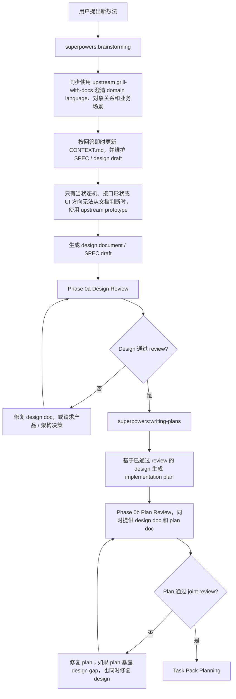
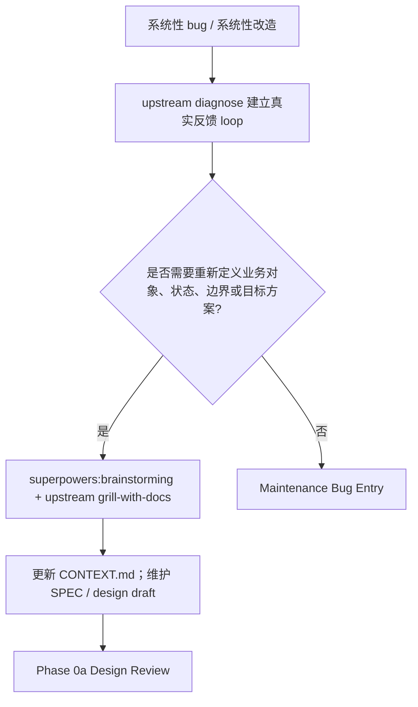
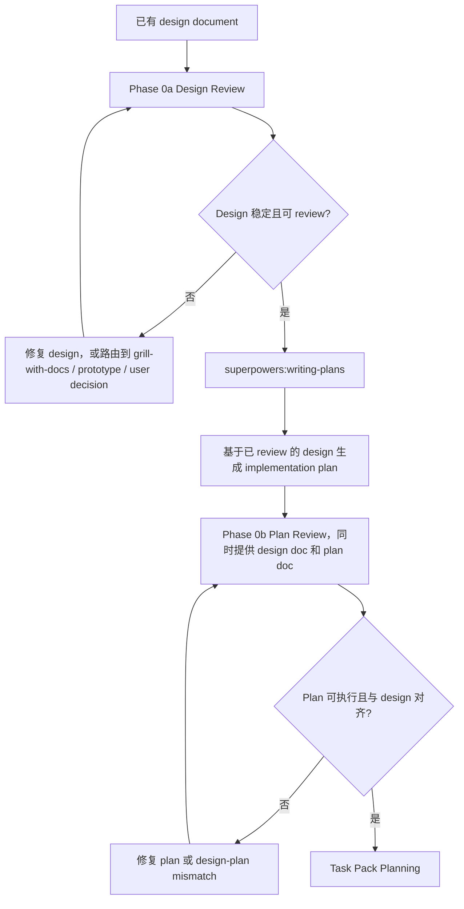
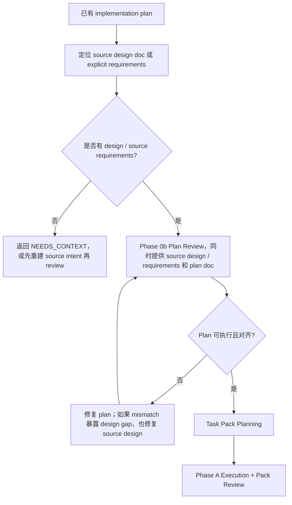
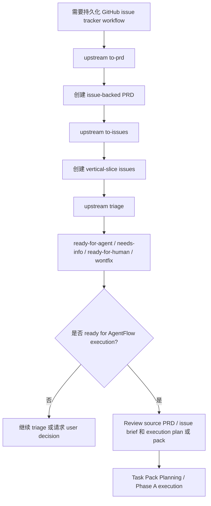

# Orchestrate Workflow

你是主线程 coordinator。负责把 AgentFlow 的设计、计划、实现、review、修复、最终验收和业务汇报串成闭环；外部 skills 提供方法，本 skill 决定入口、phase、anchors、Task Pack、sub-agent dispatch、review reception、release risk 和 completion gate。

## 1. Ownership

| 能力 | 权威来源 |
| --- | --- |
| 从零想法澄清 / design 生成 | `superpowers:brainstorming` |
| 业务讨论同步沉淀 `CONTEXT.md` + SPEC 初稿 | `superpowers:brainstorming` + upstream `grill-with-docs` |
| implementation plan 写作 | `superpowers:writing-plans` |
| 完成前证据纪律 | `superpowers:verification-before-completion` |
| branch / PR / merge / discard 收尾 | `superpowers:finishing-a-development-branch` |
| TDD / vertical slice | upstream `tdd` |
| root-cause diagnosis | upstream `diagnose` |
| domain / docs challenge | upstream `grill-with-docs` |
| architecture improvement | upstream `improve-codebase-architecture` |
| prototype gate | upstream `prototype` |
| PRD / issue / triage workflow | upstream `to-prd` / `to-issues` / `triage` |
| unfamiliar module map | upstream `zoom-out` |
| VM / Win-PC / ECS / release / local evidence | AgentFlow repo-local ops skills |
| phase coordination / pack / review / routing / report | Orchestrate Workflow |

Escalation gate 命中时先调用表内 upstream skill；把 clarified context、prototype verdict、bug brief、architecture finding 或 issue brief 写回 design / plan / bug brief / issue，再进入对应 Orchestrate phase。

## 2. Entry Router

| 入口信号 | 第一动作 | 必须产物 | 下一步 |
| --- | --- | --- | --- |
| 全新功能、系统性 bug 复盘、系统性改造、用户要边讨论边沉淀上下文 | Discovery Capture Gate | updated `CONTEXT.md`、SPEC / design draft、open decisions、acceptance criteria、source requirements | Phase 0a |
| 已有 / 刚生成 design doc | Phase 0a Design Review | review findings disposition；通过后的 design | writing-plans 或 Phase 0b |
| 已有 / 刚生成 implementation plan | Phase 0b Plan Review | normalized plan、source design / requirements、Task Pack candidates | Task Pack Planning |
| bug、报错、性能退化、状态错乱 | upstream `diagnose` | feedback loop、真实症状、hypotheses、bug brief、回归验证方式 | Maintenance 或 Phase 0 |
| UI / UX 反馈、截图标注、人工验收反馈 | Feedback / UI UX Entry | implementation divergence / context ambiguity / prototype question / architecture friction / issue candidate 分类 | repair、grill、prototype、architecture 或 issue |
| 已实现 diff | Phase B；若用户只要一次性 review，按普通 review 请求处理 | final intent / diff review findings | repair 或 report |
| GitHub PRD / issue workflow | upstream `to-prd` / `to-issues` / `triage` | issue-backed PRD、vertical-slice issues、ready state | Phase 0b 或 Task Pack Planning |

Skip：从零写 plan 用 `superpowers:writing-plans`；merge / PR / push / discard / branch cleanup 用 `superpowers:finishing-a-development-branch`。全新功能讨论留在 Discovery Capture Gate 内调用 `brainstorming`，不要跳出 Orchestrate。

## 3. Lifecycle Flows

### New Idea



### Systemic Bug / Systemic Refactor



### Existing Design



### Existing Plan



### Issue Workflow



## 4. Global Gates

### Discovery Capture

Use for new feature discussion, systemic bug recap, systemic refactor, or explicit “discuss and capture context” work.

- Use `superpowers:brainstorming` for product / solution exploration and upstream `grill-with-docs` discipline for domain language.
- Ask one question at a time; prefer questions that clarify business intent, domain language, object relationships, states, boundaries, and acceptance.
- If code or existing docs can answer a question, inspect first and ask only for remaining decisions.
- Update `CONTEXT.md` immediately for stable terms, object relationships, roles, states, recurring ambiguities; keep it to glossary / relationships / example dialogue / flagged ambiguities.
- Update SPEC / design draft immediately for feature promises, user scenarios, system behavior, UI states, interface contracts, acceptance criteria, rollout boundaries.
- End with updated context, SPEC / design draft, open decisions, acceptance criteria, source requirements, then enter Phase 0a.

### Matt Escalation

| 信号 | 先走 | 带回 |
| --- | --- | --- |
| bug / error / performance / wrong state | `diagnose` | feedback loop、symptom、hypotheses、bug brief、regression check |
| systemic bug / refactor needs new object, state, boundary, target | `brainstorming` + `grill-with-docs` | updated `CONTEXT.md`、SPEC draft、source requirements、acceptance |
| desired behavior / term / owner / permission / billing / lifecycle unclear | `grill-with-docs` | resolved terms、doc updates、acceptance |
| subjective UI / UX feedback or unclear role / state / copy / hierarchy / interaction | `grill-with-docs` | target states、role、viewport、interaction、allowed deviations、visual verification |
| state machine / interface shape / UI direction needs alternatives | `prototype` | question、verdict、accepted decision、delete-or-absorb plan |
| bad seam / repeated repair / single-adapter interface / caller leaks implementation | `improve-codebase-architecture` | architecture finding、blocker status、seam / adapter / module direction |
| unfamiliar module map affects pack boundary | `zoom-out` | module map、callers、risk areas、anchors |
| durable backlog / cannot close current run | `triage` / `to-prd` / `to-issues` | issue / PRD / brief、labels、ready state、blocked reason |
| new feature or fix enters implementation | `tdd` | public-behavior test slice、RED / GREEN evidence、refactor-after-GREEN |

### Anchors

| Anchor | Required content |
| --- | --- |
| Project | root `AGENTS.md`, `PROJECT.md`, `ENGINEERING-RULES.md`, relevant SPEC / ADR / GUIDE / plan / runbook / issue / branch note, nearest `AGENTS.override.md` / `agents.overrides.md` |
| Mockup | UI / UX mockup, screenshot, HTML prototype, page reference; target page, role, viewport, states, interaction, visual hierarchy, allowed deviations, visual verification |
| Contract | API, Pydantic, DB, JSON, sync, task payload, billing, permission, runtime, capability, UI action, helper boundary; owner, provider, consumer, verifier, model, schema_version, registry / migration / catalog, repository / read model, tests / release gate, forbidden shortcuts |

Missing in-scope anchors -> `NEEDS_CONTEXT` / `BLOCKED`; do not invent schemas, helpers, UI behavior, or business rules.

### Hard Stops

- Do not skip Phase 0 or Phase B unless user explicitly asks for one-off read-only review.
- A plan generated from design must be reviewed with the source design / requirements.
- Normalize `superpowers:writing-plans` handoff before Phase 0b: replace `subagent-driven-development` / `executing-plans` instructions with Orchestrate ownership; keep useful tasks, snippets, commands, acceptance.
- Task Pack is the execution unit; plan tasks are raw material.
- Dispatch prompts must include `Read first`, `Project baseline`, `Contract anchors`, `Mockup anchors` when relevant.
- Worker report is not proof; reviewers inspect docs, diff, code, tests, logs, screenshots, commands.
- Boundary work reads `references/contract-boundary.md`; no bare dict, route-local schema, temporary helper, silent unknown-field drop, wrong migration tree, unregistered JSON, unsynced consumer.
- Serial by default: same file, shared contract, migration, permission, billing, runtime, release boundary.
- No completion claim without verification evidence.
- No merge, push, PR, discard, or production write without explicit user instruction.
- `sandbox_mode = "read-only"` in reviewer / explorer TOMLs is intent, not enforced isolation; use role instructions, narrow scope, parent diff checks.

## 5. Phase Gates

| Phase | Entry | Required actions | Pass / route |
| --- | --- | --- | --- |
| 0a Design Review | design doc or Discovery Capture output | Read `references/design-review.md`; read `contract-boundary.md` for API / Pydantic / DB / JSON / helper boundaries; dispatch two `code_reviewer`s for Design Content and Project Alignment; add `release_reviewer` after baseline reviews for production risk; parent repairs technical doc gaps; product / business / UX / release / architecture trade-off gaps route to user or grill; prototype unresolved state machine / UI / interface shape | No Critical design finding; intent verifiable; failure / permission / duplicate / rollback explainable; new object / state / contract has owner / writer / reader / verifier / cleanup; anchors clear. Max 2 repair rounds. If no plan, run `writing-plans`, then 0b. |
| 0b Plan Review | implementation plan plus source design / requirements | Locate source design / explicit requirements; normalize legacy handoff; read `references/plan-review.md` + `task-pack-contract.md`; read `contract-boundary.md` for boundary work; dispatch three independent `code_reviewer`s: Coverage, Compliance / Verification, Second Opinion; add `release_reviewer` for production risk; parent repairs stale paths, fictional helpers, missing tests, override gaps, invalid pack boundaries, design-plan mismatch | Design intent covered; tasks executable; existing paths / functions / fixtures / commands verified; each task has verification; contract consumer / registry / migration / catalog clear; vertical packs possible. Max 2 repair rounds. |
| Task Pack Planning | plan passed 0b | Read `references/task-pack-contract.md`; recut unfinished tasks by independently verifiable behavior; same file / contract / migration / permission / billing / runtime in same or serial packs; parallel only if independent; each pack states goal behavior, owned scope, anchors, acceptance, verification, risk, AFK / HITL, dependencies, parallel safety, out of scope | Invalid packs are repaired before dispatch. |
| Phase A Execution + Pack Review | valid Task Pack | Dispatch `coding_worker`; use `complex_coding_worker` for high risk. Prompt includes Pack Brief, anchors, verification, risk, no unauthorized revert, return envelope. Parse worker return, then read `implementation-review.md`; read `contract-boundary.md` for boundary work; dispatch `code_reviewer`; add `release_reviewer` for production risk. Review spec compliance before code quality. | Clear implementation finding -> original worker; unknown root cause -> `complex_code_explorer`; high-risk tight repair -> `complex_coding_worker`; business scope change -> user. Pass requires spec / quality pass, focused verification, visual evidence for UI / UX, public-behavior tests, closed contract boundary, no Critical / High. Max 3 repair rounds per pack, each with changed method. |
| Maintenance Bug Entry | bug without full plan | Use `diagnose`; build feedback loop before patching; produce bug brief with current behavior, desired behavior, reproduction, hypotheses, key interfaces, acceptance, out of scope. If desired behavior / term / UI target / permission / billing / lifecycle unclear, run `grill-with-docs`. If bad seam / shallow module / caller leakage appears, run `improve-codebase-architecture`. Parallel investigation only for independent failures. Risky runtime / billing / migration / permission / API / DB / JSON / shared contract / deploy / multi-module work requires plan and 0b / A. | Small local fix can stay in parent; otherwise route through packs. |
| Feedback / UI UX Entry | testing feedback, manual acceptance, screenshot mark, reviewer UI / UX finding | Classify before code change: implementation divergence, context ambiguity, prototype question, architecture friction, persistent issue. | Divergence -> Phase A repair with screenshot / DOM / viewport evidence; ambiguity -> `grill-with-docs` and update design / plan / issue; prototype question -> `prototype`; architecture friction -> `improve-codebase-architecture`; persistent issue -> `triage` / `to-prd` / `to-issues`. Never translate subjective feedback into worker patch without target state and verification. |
| Review Reception Gate | every reviewer finding | Verify evidence with docs, code, tests, diff, logs, screenshots, command output; classify valid / invalid / needs clarification / user decision; judge conflicts by evidence quality, not reviewer count. | valid implementation -> worker; unclear root cause -> `complex_code_explorer`; production risk -> `release_reviewer`; domain / UX / terminology / ownership ambiguity -> `grill-with-docs`; bad seam -> `improve-codebase-architecture`; UI / state / interface direction -> `prototype`; low-confidence / wrong-context -> push back with evidence. |
| Phase B Final Intent / Release Review | all packs passed | Read `references/final-review.md`; read `contract-boundary.md` for boundary work. With design: dispatch one final intent `code_reviewer` and one independent diff `code_reviewer`. Without design: review `git diff <starting_commit>..HEAD`. Add `release_reviewer` for production risk. | Implementation Gap -> worker; Design Gap -> user / doc repair; Code-level Critical -> worker; Release Blocker -> fix or manual gate. Pass requires verifiable intent, closed contract boundary / producer / consumer / registry / migration / read model / release gate, no blocker, real verification. Max 2 rounds per gap; Phase B dispatch cap 15. |
| Phase C Business Report | Phase B passed or blocked with clear disposition | Report delivered product capability, changed scope, review loops / repairs, verification commands + results, manual gates / decisions, bounded residual risk. | Use business language; do not bury missing verification. |

## 6. Dispatch Contract

### Document Layers

| Layer | Reader | Responsibility |
| --- | --- | --- |
| `SKILL.md` | parent coordinator | Owns phase routing, escalation gates, dispatch rules, review reception, and the single top-level sub-agent return envelope. |
| `references/*.md` | parent coordinator | Owns phase-specific checks, pack rules, prompt payloads, and finding classification. References do not define a competing top-level output protocol. |
| `codex/agents/*.toml` | custom sub-agent | Owns role discipline, local skill routing, project overlay, and how that role fills the universal envelope. Agent TOMLs do not redefine Orchestrate phases. |

Parent dispatch combines these layers: read the relevant reference, choose the custom agent, send phase / anchors / pack or review payload, and require the universal return envelope. Sub-agents follow their TOML while honoring the dispatch payload.

### Agent Routing

| 场景 | agent_type / owner |
| --- | --- |
| baseline design / plan / pack / final review | `code_reviewer` |
| production-risk supplement | `release_reviewer` |
| ordinary Task Pack / clear implementation finding | `coding_worker` |
| high-risk Task Pack / high-risk repair | `complex_coding_worker` |
| unknown root cause / multi-module investigation | `complex_code_explorer` |
| narrow code location / call-chain question | `code_explorer` |
| low-risk docs cleanup / PRD / issue draft | `docs_worker` |
| domain / UX / terminology / ownership ambiguity | parent runs `grill-with-docs` |
| bad test seam / architecture friction / repeated repair | parent runs `improve-codebase-architecture` |
| UI direction / state machine / interface shape | parent runs `prototype` |
| issue-backed durable workflow | parent runs `triage` / `to-prd` / `to-issues` |

Custom agent TOMLs own role-level skill selection. Orchestrate supplies phase, source docs, anchors, verification, risk flags, and the universal envelope; high-risk prompts may include exact `SKILL.md` paths.

### Universal Return Envelope

Every worker / explorer / reviewer / docs dispatch must include:

```text
### Verdict
pass / blocked / needs repair / needs context

### Evidence
- Files / docs / tests / commands / screenshots actually inspected
- Key facts, with locators where useful

### Result
- What was changed, found, reviewed, or confirmed

### Verification
- Commands or checks run, with result
- Checks not run, with reason

### Open Items
- Questions, risks, gaps, or decisions the parent must handle

### Routing
- Suggested next owner: parent / original worker / coding_worker / complex_coding_worker / complex_code_explorer / code_reviewer / release_reviewer / upstream grill-with-docs / upstream diagnose / upstream prototype / upstream improve-codebase-architecture / upstream triage-to-issues / user decision
```

Findings use:

```text
- severity:
  confidence:
  locator:
  evidence:
  impact:
  remediation:
  routing:
```

References and agent TOMLs may define role-specific payload headings inside `### Result`, but they must not replace `### Verdict`, `### Evidence`, `### Result`, `### Verification`, `### Open Items`, or `### Routing`.

## 7. Direction Check

After multiple packs, review rounds, repair loops, or context compaction, restate:

- current phase / pack;
- remaining packs / phases;
- source design intent;
- cumulative findings and disposition;
- plan checkbox progress.

Then continue from the next unblocked phase.
