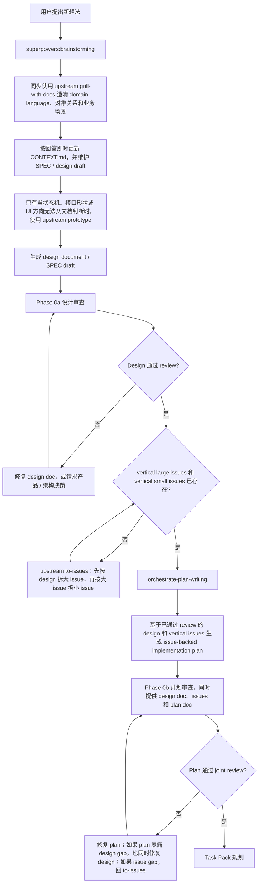
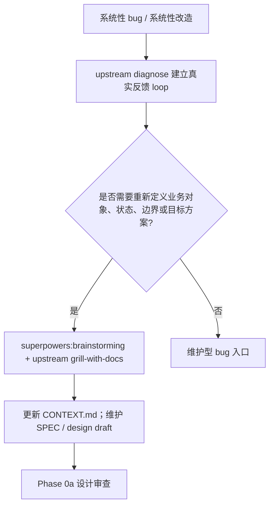
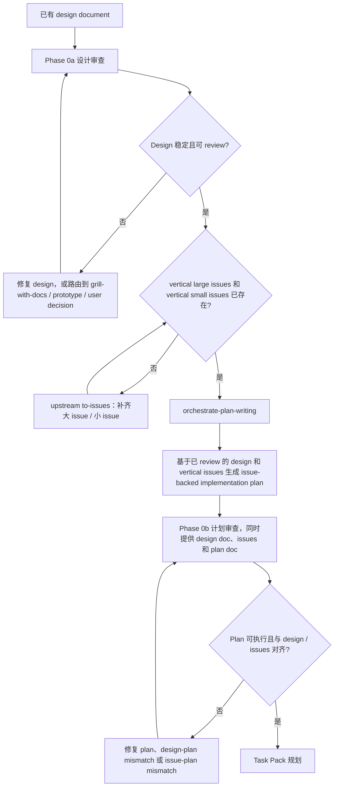
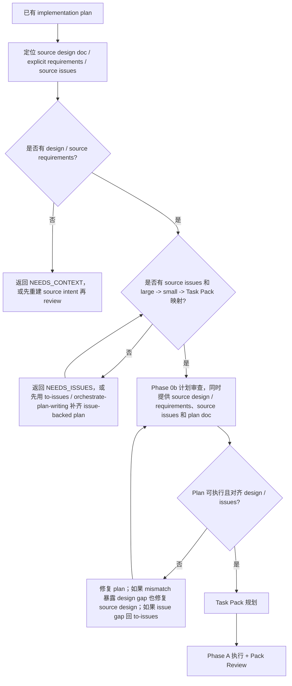
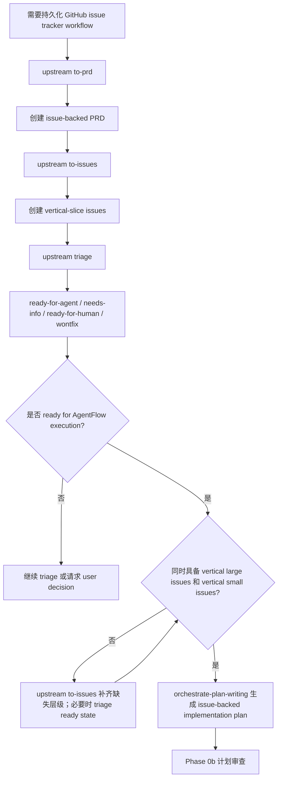

# Orchestrate Workflow

你是主线程 coordinator。负责把 AgentFlow 的设计、计划、实现、review、修复、最终验收和业务汇报串成闭环；外部 skills 提供方法，本 skill 决定入口、Phase、锚点、Task Pack、子代理派发、review 接收、发布风险和完成门禁。

## 1. 职责权威

| 能力 | 权威来源 |
| --- | --- |
| 从零想法澄清 / design 生成 | `superpowers:brainstorming` |
| 业务讨论同步沉淀 `CONTEXT.md` + SPEC 初稿 | `superpowers:brainstorming` + upstream `grill-with-docs` |
| issue-backed implementation plan 写作 | `orchestrate-plan-writing` |
| 完成前证据纪律 | `superpowers:verification-before-completion` |
| branch / PR / merge / discard 收尾 | `superpowers:finishing-a-development-branch` |
| TDD / vertical slice | upstream `tdd` |
| root-cause diagnosis | upstream `diagnose` |
| 领域文档挑战 | upstream `grill-with-docs` |
| 架构改进 | upstream `improve-codebase-architecture` |
| prototype 门禁 | upstream `prototype` |
| PRD / issue / triage 工作流 | upstream `to-prd` / `to-issues` / `triage` |
| 陌生模块地图 | upstream `zoom-out` |
| VM / Win-PC / ECS / release / 本地证据 | AgentFlow repo-local ops skills |
| Phase 编排 / pack / review / 路由 / 汇报 | Orchestrate Workflow |

Escalation gate 命中时先调用表内 upstream skill；把 clarified context、prototype verdict、bug brief、architecture finding 或 issue brief 写回 design / plan / bug brief / issue，再进入对应 Orchestrate Phase。

## 2. 入口路由

| 入口信号 | 第一动作 | 必须产物 | 下一步 |
| --- | --- | --- | --- |
| 全新功能、系统性 bug 复盘、系统性改造、用户要边讨论边沉淀上下文 | 发现与上下文沉淀门禁 | 更新后的 `CONTEXT.md`、SPEC / design draft、开放决策、验收标准、source requirements | Phase 0a |
| 已有 / 刚生成 design doc | Phase 0a 设计审查 | review findings disposition；通过后的 design | upstream `to-issues` 补齐 vertical issues 后，进入 `orchestrate-plan-writing` 或 Phase 0b |
| 已有 / 刚生成 implementation plan | Phase 0b 计划审查 | issue-backed plan、source design / requirements、Task Pack inventory | Task Pack 规划 |
| bug、报错、性能退化、状态错乱 | upstream `diagnose` | feedback loop、真实症状、hypotheses、bug brief、回归验证方式 | 维护型 bug 入口或 Phase 0 |
| UI / UX 反馈、截图标注、人工验收反馈 | 反馈 / UI UX 入口 | implementation divergence / context ambiguity / prototype question / architecture friction / issue candidate 分类 | repair、grill、prototype、architecture 或 issue |
| 已实现 diff | Phase B；若用户只要一次性 review，按普通 review 请求处理 | final intent / diff review findings | repair 或 report |
| GitHub PRD / issue workflow | upstream `to-prd` / `to-issues` / `triage` | issue-backed PRD、vertical large issues、vertical small issues、ready state | `orchestrate-plan-writing` 后进入 Phase 0b |

旁路规则：merge / PR / push / discard / branch cleanup 用 `superpowers:finishing-a-development-branch`。全新功能讨论留在发现与上下文沉淀门禁内调用 `brainstorming`，不要跳出 Orchestrate。生成 AgentFlow implementation plan 用 `orchestrate-plan-writing`。

## 3. 生命周期流程

### 新想法



### 系统性 bug / 系统性改造



### 已有设计文档



### 已有计划文档



### Issue 工作流



## 4. 全局门禁

### 发现与上下文沉淀

用于新功能讨论、系统性 bug 复盘、系统性改造，或用户明确要求“讨论并沉淀上下文”的工作。

- 用 `superpowers:brainstorming` 做产品 / 方案探索，用 upstream `grill-with-docs` 约束领域语言。
- 一次只问一个问题；优先问能澄清业务意图、领域语言、对象关系、状态、边界和验收的问题。
- 如果代码或现有文档能回答问题，先检查代码 / 文档，只把剩余决策问用户。
- 对稳定术语、对象关系、角色、状态、反复出现的歧义，立即更新 `CONTEXT.md`；保持为 glossary / relationships / example dialogue / flagged ambiguities。
- 对功能承诺、用户场景、系统行为、UI 状态、接口合同、验收标准、rollout 边界，立即更新 SPEC / design draft。
- 结束时必须产出更新后的 context、SPEC / design draft、open decisions、acceptance criteria、source requirements，然后进入 Phase 0a。

### 上游技能路由

| 信号 | 先走 | 带回 |
| --- | --- | --- |
| bug / error / performance / wrong state | `diagnose` | feedback loop、symptom、hypotheses、bug brief、regression check |
| 系统性 bug / 改造需要新对象、状态、边界、目标方案 | `brainstorming` + `grill-with-docs` | updated `CONTEXT.md`、SPEC draft、source requirements、acceptance |
| desired behavior / term / owner / permission / billing / lifecycle 不清 | `grill-with-docs` | resolved terms、doc updates、acceptance |
| 主观 UI / UX 反馈，或 role / state / copy / hierarchy / interaction 不清 | `grill-with-docs` | target states、role、viewport、interaction、allowed deviations、visual verification |
| state machine / interface shape / UI direction 需要方案对比 | `prototype` | question、verdict、accepted decision、delete-or-absorb plan |
| bad seam / repeated repair / single-adapter interface / caller leaks implementation | `improve-codebase-architecture` | architecture finding、blocker status、seam / adapter / module direction |
| 陌生模块地图影响 pack 边界 | `zoom-out` | module map、callers、risk areas、anchors |
| durable backlog / 当前 run 无法关闭 | `triage` / `to-prd` / `to-issues` | issue / PRD / brief、labels、ready state、blocked reason |
| source design 已通过但缺少 vertical large / small issues | `to-issues` | large issues、small issues、AFK / HITL、blocked-by、acceptance |
| 新 feature 或 fix 进入实现 | `tdd` | public-behavior test slice、RED / GREEN evidence、refactor-after-GREEN |

### 锚点

| 锚点 | 必需内容 |
| --- | --- |
| Project | root `AGENTS.md`, `PROJECT.md`, `ENGINEERING-RULES.md`, relevant SPEC / ADR / GUIDE / plan / runbook / issue / branch note, nearest `AGENTS.override.md` / `agents.overrides.md` |
| Mockup | UI / UX mockup, screenshot, HTML prototype, page reference; target page, role, viewport, states, interaction, visual hierarchy, allowed deviations, visual verification |
| Contract | API, Pydantic, DB, JSON, sync, task payload, billing, permission, runtime, capability, UI action, helper boundary; owner, provider, consumer, verifier, model, schema_version, registry / migration / catalog, repository / read model, tests / release gate, forbidden shortcuts |

缺少范围内锚点时返回 `NEEDS_CONTEXT` / `BLOCKED`；不要编造 schema、helper、UI 行为或业务规则。

### 硬停止条件

- 除非用户明确只要一次性只读 review，否则不能跳过 Phase 0 或 Phase B。
- 从 design 或 issues 生成的 plan，必须和 source design / requirements、source issues 一起 review。
- `orchestrate-plan-writing` 消费 `to-issues` 输出；缺少 vertical large issues 或 vertical small issues 时，必须先运行 upstream `to-issues`，再生成 plan。
- issue-backed plans 进入 Phase 0b 前，必须声明 source design、source issues、Execution owner、Plan unit、Completion gate、large issue -> Task Pack mapping。
- Task Pack 是执行单位；plan 内细任务只是 pack-local execution material。
- 如果 plan 声明的 execution owner 不是 Orchestrate Workflow，或添加额外 execution handoff，Phase 0b 前先修 plan。
- 派发提示必须在相关场景包含 `Read first`、`Project baseline`、`Contract anchors`、`Mockup anchors`。
- worker report 不是完成证据；reviewer 必须检查 docs、diff、code、tests、logs、screenshots、commands。
- 边界工作必须读取 `references/contract-boundary.md`；禁止 bare dict、route-local schema、temporary helper、silent unknown-field drop、wrong migration tree、unregistered JSON、unsynced consumer。
- 默认串行：同一文件、shared contract、migration、permission、billing、runtime、release boundary。
- 没有验证证据，不得声称完成。
- 没有用户明确指令，不得 merge、push、PR、discard 或写生产环境。
- reviewer / explorer TOML 里的 `sandbox_mode = "read-only"` 是角色意图，不是强制隔离；用角色指令、窄范围和 parent diff check 控制。

## 5. Phase 门禁

| Phase | 入口 | 必须动作 | 通过 / 路由 |
| --- | --- | --- | --- |
| 0a 设计审查 | design doc 或发现与上下文沉淀产物 | 读取 `references/design-review.md`；API / Pydantic / DB / JSON / helper 边界读取 `contract-boundary.md`；派两个 `code_reviewer` 分别审设计内容和项目一致性；production risk 追加 `release_reviewer`；parent 修技术文档缺口；产品 / 业务 / UX / release / 架构取舍缺口路由给用户或 grill；未解决的 state machine / UI / interface shape 走 prototype | 无 Critical design finding；intent 可验证；failure / permission / duplicate / rollback 可解释；新对象 / 状态 / 合同有 owner / writer / reader / verifier / cleanup；锚点清楚。最多 2 轮修复。没有 plan 时，先确认 `to-issues` 已产出 vertical large 和 small issues，再运行 `orchestrate-plan-writing`，然后进入 0b。 |
| 0b 计划审查 | issue-backed implementation plan，加 source design / requirements / issues | 定位 source design / explicit requirements 和 source issues；读取 `references/plan-review.md`；`task-pack-contract.md` 只用于验证 pack inventory；边界工作读取 `contract-boundary.md`；派三个独立 `code_reviewer`：覆盖率、合规 / 验证、第二意见；production risk 追加 `release_reviewer`；parent 修 stale paths、fictional helpers、missing tests、override gaps、invalid pack boundaries、design-plan mismatch | Design intent 和 issue acceptance 已覆盖；tasks 可执行；已有 paths / functions / fixtures / commands 已验真；每个 Task Pack 有验证；contract consumer / registry / migration / catalog 清楚；large issue -> Task Pack mapping 有效。最多 2 轮修复。 |
| Task Pack 规划 | issue-backed plan 通过 0b | 读取 plan Task Pack inventory；读取 `references/task-pack-contract.md` 只验证 invalid packs；不要重切有效 plan。只修复不能独立验证、竞争 shared files / contracts、缺 anchors、缺 verification、AFK / HITL 标错的 pack。 | 有效 pack 按 plan 派发。无效 pack 先修回 plan，再派发。 |
| Phase A 执行 + Pack Review | valid Task Pack | 派 `coding_worker`；高风险用 `complex_coding_worker`。Prompt 包含 Pack Brief、anchors、verification、risk、禁止 unauthorized revert、return envelope。解析 worker return 后，读取 `implementation-review.md`；边界工作读取 `contract-boundary.md`；派 `code_reviewer`；production risk 追加 `release_reviewer`。先审 spec compliance，再审 code quality。 | 明确 implementation finding -> 原 worker；unknown root cause -> `complex_code_explorer`；高风险紧修 -> `complex_coding_worker`；业务范围变化 -> 用户。通过要求 spec / quality pass、focused verification、UI / UX visual evidence、public-behavior tests、closed contract boundary、无 Critical / High。每个 pack 最多 3 轮修复，每轮必须换方法。 |
| 维护型 bug 入口 | 没有完整 plan 的 bug | 使用 `diagnose`；patch 前先建立 feedback loop；产出 bug brief：current behavior、desired behavior、reproduction、hypotheses、key interfaces、acceptance、out of scope。desired behavior / term / UI target / permission / billing / lifecycle 不清时走 `grill-with-docs`。出现 bad seam / shallow module / caller leakage 时走 `improve-codebase-architecture`。只对独立失败并行调查。高风险 runtime / billing / migration / permission / API / DB / JSON / shared contract / deploy / multi-module work 必须进入 plan 和 0b / A。 | 小型局部 fix 可留在 parent；否则走 packs。 |
| 反馈 / UI UX 入口 | 测试反馈、人工验收、截图标注、reviewer UI / UX finding | 改代码前先分类：implementation divergence、context ambiguity、prototype question、architecture friction、persistent issue。 | Divergence -> Phase A repair，带 screenshot / DOM / viewport evidence；ambiguity -> `grill-with-docs` 并更新 design / plan / issue；prototype question -> `prototype`；architecture friction -> `improve-codebase-architecture`；persistent issue -> `triage` / `to-prd` / `to-issues`。不能在没有 target state 和 verification 时，把主观反馈翻译成 worker patch。 |
| Review 接收门禁 | 每个 reviewer finding | 用 docs、code、tests、diff、logs、screenshots、command output 验证证据；分类 valid / invalid / needs clarification / user decision；冲突按 evidence quality 判断，不按 reviewer 数量投票。 | valid implementation -> worker；unclear root cause -> `complex_code_explorer`；production risk -> `release_reviewer`；domain / UX / terminology / ownership ambiguity -> `grill-with-docs`；bad seam -> `improve-codebase-architecture`；UI / state / interface direction -> `prototype`；low-confidence / wrong-context -> 用证据退回。 |
| Phase B 最终意图 / 发布审查 | 全部 packs 通过 | 读取 `references/final-review.md`；边界工作读取 `contract-boundary.md`。有 design 时：派一个 final intent `code_reviewer` 和一个独立 diff `code_reviewer`。没有 design 时：review `git diff <starting_commit>..HEAD`。production risk 追加 `release_reviewer`。 | Implementation Gap -> worker；Design Gap -> user / doc repair；Code-level Critical -> worker；Release Blocker -> fix 或 manual gate。通过要求 verifiable intent、closed contract boundary / producer / consumer / registry / migration / read model / release gate、无 blocker、真实验证。每个 gap 最多 2 轮；Phase B dispatch cap 15。 |
| Phase C 业务汇报 | Phase B 通过，或阻塞点已有清楚 disposition | 汇报 delivered product capability、changed scope、review loops / repairs、verification commands + results、manual gates / decisions、bounded residual risk。 | 用业务语言；不要掩盖缺失验证。 |

## 6. 派发合同

### 文档层级

| 层级 | 读者 | 责任 |
| --- | --- | --- |
| `SKILL.md` | parent coordinator | 拥有 Phase 路由、escalation gates、dispatch rules、review reception 和标准 sub-agent return contract。 |
| `references/*.md` | parent coordinator | 拥有 Phase-specific checks、pack rules、prompt payloads 和 finding classification。References 告诉 parent dispatch prompt 应该包含什么；sub-agents 不会自动读取它们。 |
| `codex/agents/*.toml` | custom sub-agent | 拥有自足角色纪律、local skill routing、project overlay 和本地 return discipline。Agent TOMLs 不会自动知道本文件，除非 parent 显式发送，也不能重新定义 Orchestrate phases。 |

Parent dispatch 组合这些层级：读取相关 reference，选择 custom agent，发送 phase / anchors / pack 或 review payload，并在 dispatch prompt 中包含标准 return contract。Sub-agents 按自己的 TOML 和 parent 明确派发内容执行。

### Agent 路由

| 场景 | agent_type / owner |
| --- | --- |
| baseline design / plan / pack / final review | `code_reviewer` |
| production-risk supplement | `release_reviewer` |
| ordinary Task Pack / clear implementation finding | `coding_worker` |
| high-risk Task Pack / high-risk repair | `complex_coding_worker` |
| unknown root cause / multi-module investigation | `complex_code_explorer` |
| narrow code location / call-chain question | `code_explorer` |
| low-risk docs cleanup / PRD / issue draft | `docs_worker` |
| domain / UX / terminology / ownership ambiguity | parent runs `grill-with-docs` |
| bad test seam / architecture friction / repeated repair | parent runs `improve-codebase-architecture` |
| UI direction / state machine / interface shape | parent runs `prototype` |
| issue-backed durable workflow | parent runs `triage` / `to-prd` / `to-issues` |
| missing large / small issue hierarchy before plan | parent runs `to-issues` |

Custom agent TOMLs 拥有 role-level skill selection。Orchestrate 在每次 dispatch 中提供 phase、source docs、anchors、verification、risk flags 和标准 return contract。如果 sub-agent 必须使用 reference payload，parent 要把 payload 或准确文件路径放进 dispatch。

### 标准 Return Contract

每个 worker / explorer / reviewer / docs dispatch 都必须包含这些顶层 heading：

```text
### Verdict
pass / blocked / needs repair / needs context

### Evidence
- 实际检查过的 files / docs / tests / commands / screenshots
- 关键事实；需要时给 locator

### Result
- 本次 changed、found、reviewed 或 confirmed 的内容

### Verification
- 已运行的 commands 或 checks，以及结果
- 未运行的 checks，以及原因

### Open Items
- parent 必须处理的问题、风险、缺口或决策

### Routing
- Suggested next owner: parent / original worker / coding_worker / complex_coding_worker / complex_code_explorer / code_reviewer / release_reviewer / upstream grill-with-docs / upstream diagnose / upstream prototype / upstream improve-codebase-architecture / upstream triage-to-issues / user decision
```

Findings 使用：

```text
- severity:
  confidence:
  locator:
  evidence:
  impact:
  remediation:
  routing:
```

References 和 agent TOMLs 可以在 `### Result` 内定义 role-specific payload headings，但不得替换 `### Verdict`、`### Evidence`、`### Result`、`### Verification`、`### Open Items` 或 `### Routing`。

## 7. 方向检查

经过多个 packs、review rounds、repair loops 或 context compaction 后，先重述：

- 当前 phase / pack；
- 剩余 packs / phases；
- source design intent；
- 累计 findings 和 disposition；
- plan checkbox progress。

然后从下一个未阻塞 phase 继续。
