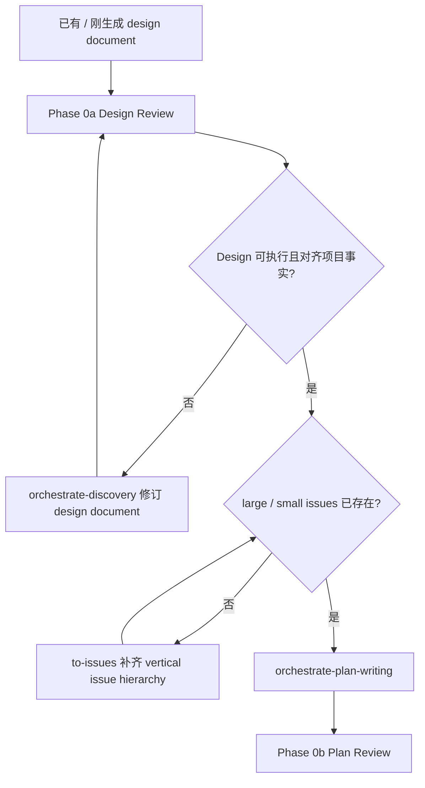

# Design Review 合同

Phase 0a 审 design document。目标是确认设计能被 issue 拆分、plan、Task Pack、实现和最终验证承接。它不做文字润色，不派 worker，不写 implementation plan。

## Phase Contract

输入必须包含：

- Scope：Source artifacts、Editable artifacts、Read-only context、Out of scope、Issue recording target。
- Design document 或等价 SPEC / ADR / PRD source。
- 相关 UI / UX mockup、截图、prototype 或 acceptance feedback。
- 根 `AGENTS.md`，相关 `PROJECT.md` / `ENGINEERING-RULES.md` / SPEC / ADR / GUIDE / CONTEXT。
- 如果触碰 API / Pydantic / DB / JSON / sync / task payload / UI action / helper / billing / permission / runtime，附 `contract-boundary.md` 的 Contract anchors。

Pass condition：

- Design Content Review 通过。
- Project Alignment Review 通过。
- accepted release blocker 已关闭。
- 没有 Critical design finding。

Repair limit：Phase 0a 最多 2 个 repair rounds。这里的 round 按 `dispatch-contract.md` 定义，不授权反复重跑完整 review。

## Flow



## Dispatch

默认派两个 baseline `code_reviewer` angles，可以并行，不能合并：

- Design Content Review：审 design 自身是否完整、可测试、可被后续执行。
- Project Alignment Review：审 design 是否符合项目事实、边界、不变量和生产约束。

`release_reviewer` 只在本文件 Release Gate 触发时追加，不能替代 baseline review。

### Baseline 1：Design Content Review

关注设计自身，不审代码实现。

Prompt 必须包含：

- Scope。
- Read first：design doc、相关 UI / UX mockup、根 `AGENTS.md`、相关 `PROJECT.md` / `ENGINEERING-RULES.md` / SPEC / ADR / GUIDE / CONTEXT。
- Project baseline：本设计最相关的业务对象、数据权威、模块边界和验收不变量。
- Contract anchors：owner、provider、consumer、model、schema_version、registry / migration / catalog、verification。

检查：

- 业务术语、对象 owner、UI role、页面状态、lifecycle 是否清楚且一致。
- 用户旅程是否覆盖起点、操作、结果、异常路径。
- 每条目标行为是否能被命令、API、UI 操作或手工步骤验证。
- UI / UX 设计是否明确引用 mockup path、页面、role、viewport、states、interaction、允许偏差。
- 跨模块、API、DB、JSON、sync、task payload 或 UI action 是否有正式 Contract anchors。
- 至少挑战 happy path 以外的失败、空状态、权限不足、重复提交、并发或回滚场景。
- 是否混入未来需求、未提及 issue、read-only context，或遗漏本阶段必须承诺的能力。

Critical：

- 核心意图不可测试。
- 目标行为、业务术语、对象 owner、UI target state 或验收口径含混，导致 plan / worker 必须自行决定。
- UI / UX 任务有 mockup，但 design 没把 mockup 转成可验收页面状态、交互和视觉约束。
- API / Pydantic / DB / JSON / helper 边界缺 Contract anchors，或把 bare dict / 临时 helper 当长期合同。
- 文档内部矛盾会导致 plan 写错。
- 关键业务场景缺失。
- 新对象、新状态、新合同缺 owner / writer / reader / verifier / cleanup responsibility，并影响验收。

### Baseline 2：Project Alignment Review

关注项目事实和约束，不重复审 design 文案。

Prompt 必须包含：

- Scope。
- Read first：design doc、相关 UI / UX mockup、根 `AGENTS.md`、相关 `PROJECT.md` / `ENGINEERING-RULES.md` / SPEC / ADR / GUIDE / CONTEXT。
- Project baseline：项目北极星、不变量、数据权威、模块边界、contract wall、测试路由、发布 / 回滚约束。
- Contract anchors：API、Pydantic、DB、JSON、task、sync、catalog、capability、helper 边界。

检查：

- domain language 是否使用项目正式术语；术语漂移、对象边界不清或业务关系冲突 route 给 `orchestrate-discovery`。
- 数据权威源、模块边界和依赖方向是否正确。
- contract wall、LINEAGE、billing four-state、local-first / cloud-authority 等项目不变量是否被破坏。
- 新端口、命令、收费动作、迁移、JSONB / SQLite JSON 字段、后台任务是否写明注册位置、正式 contract、producer / consumer 和验证方式。
- 数据库字段是否写明 migration tree、repository / read model、rollback 或 backfill。
- helper 是否属于 domain service、repository、adapter 或 shared contract，而不是 route / host / page action 临时 helper。
- 设计是否依赖项目中不存在的基础设施、外部 API 或运行环境。
- hard-to-reverse、without context surprising、real trade-off 三者同时成立时，是否需要 ADR / SPEC / GUIDE 更新。

Critical：

- 违反项目北极星、不变量、权威源或模块边界。
- 设计依赖不存在的基础设施。
- 跨服务合同缺 producer / consumer / verification。
- 新 API / DB / JSON / task / sync payload 绕过 Pydantic contract、JSON registry、migration tree 或 catalog。
- 生产数据、权限、账务、迁移或回滚风险未设计。

## Release Gate

设计期 `release_reviewer` 只在 release strategy、migration / deploy order、rollback 或 manual production gate 必须提前判定时追加。普通 production-risk 由 baseline reviewers 转成 design anchors 和 risk flags。

## Reception

Coordinator 收到 findings 后按 `dispatch-contract.md` 做 disposition：

- `accepted` document repair：coordinator 或 `docs_worker` 修 design。
- `accepted` domain / UX / terminology / ownership ambiguity：交 `orchestrate-discovery`，并把 clarified context 写回 design / domain docs。
- `accepted` issue gap：Phase 0a 通过后再 route 给 upstream `to-issues`，不要在 design review 中直接拆 pack。
- `rejected` / `out of scope` / `duplicate` finding：记录证据，不 repair，不触发 targeted re-review。

修复后只 targeted re-review changed sections、相关 anchors 和受影响 angle。只有 design intent、contract boundary、mockup target、scope 或 project invariant 被改动时，才 full phase review rerun。

## Result Payload

Coordinator 派发必须要求标准顶层 headings；下列内容放在 `### Result` 下。顶层 `### Verdict` 只使用 `pass / blocked / needs repair / needs context`。

```text
Review: 设计文档 - <Design Content Review / Project Alignment Review>
Phase summary: 通过 / 阻塞
Critical:
Important:
低置信度观察:
Disposition required:
```

每条 finding 必须使用统一 shape：severity、confidence、locator、evidence、impact、remediation、routing。Design finding 默认 route 给 `parent` 或 `docs_worker` 做 document repair；domain / UX / ownership / target-state ambiguity route 给 `orchestrate-discovery`；产品承诺、业务规则、UX、发布策略、架构 trade-off 无法从 source artifacts 判定时 route 给 `user decision` 或 `orchestrate-discovery`。
