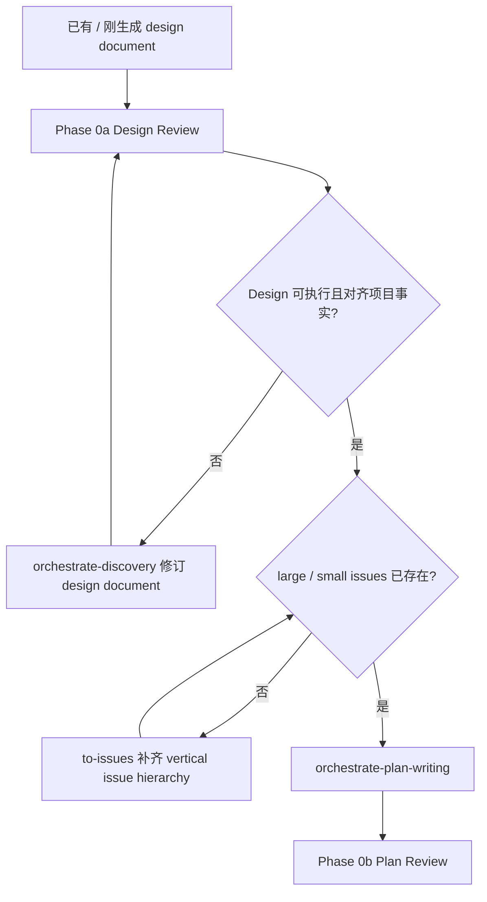

# Design Review 合同

Phase 0a 审 design doc。检查设计能否被计划、实现和最终验证承接；不做文字润色审查。新想法产生 design doc 后必须立刻进入本 review，通过后才允许生成 implementation plan。

## Review Architecture

所有 review reference 都按同一骨架工作：明确输入和通过条件 -> 派 baseline review angle -> 判断 release gate -> 做 Review Budget -> 做 Review Reception -> 用 Result Payload 返回可执行 findings。Design Review 的差异只在于 review 对象是 design document，finding 默认修文档或回 Discovery，不派 worker。

Pass condition：Design Content Review 和 Project Alignment Review 都通过；accepted release blocker 已关闭；没有 Critical design finding。

## 入口流程图



Phase 0a 最多 2 轮文档修复；这里的“轮”按 `dispatch-contract.md` 的 `repair round` 计算。仍有 Critical design finding 时，不生成 plan。

Design Content Review 和 Project Alignment Review 是两个不同角度，可以并行派发，但不能合并成一个 review。

## Baseline Review 1：Design Content Review

派 `code_reviewer`。让 reviewer 专注设计自身，不审代码实现。

Prompt 必须包含：

- Scope：Source artifacts、Editable artifacts、Read-only context、Out of scope、Issue recording target。
- Read first：design doc、相关 UI / UX mockup、根 `AGENTS.md`、相关 `PROJECT.md` / `ENGINEERING-RULES.md` / SPEC / ADR / GUIDE。
- Project baseline：本设计最相关的业务对象、数据权威、模块边界和验收不变量。
- Contract anchors：如果设计触碰 API / Pydantic / DB / JSON / sync / task payload / UI action / helper 边界，按 `contract-boundary.md` 写清 owner、provider、consumer、model、schema_version、registry / migration / catalog 和验证方式。

检查：

- domain language、业务对象、UI role、页面状态或 lifecycle 是否与 `CONTEXT.md` / PROJECT / SPEC / ADR 一致；不一致或含混时，finding route 给 `orchestrate-discovery`，不要让 plan author 自行解释。
- 完整性：是否有 TODO / TBD / 空节；用户旅程是否覆盖起点、操作、结果、异常路径。
- 可测试性：每条“用户应该能 X / 系统应该 Y”能否写出命令、API、UI 操作或手工验收步骤。
- Mockup 对齐：UI / UX 设计是否明确引用 mockup 路径、目标页面、角色、viewport、关键状态、交互和允许偏差。
- Contract Boundary：跨模块、API、DB、JSON、sync、task payload 或 UI action 是否明确正式 Pydantic contract、producer / consumer、schema version、error / retry / idempotency、compatibility 和删除期限。
- 场景挑战：至少一个 happy path，加一个失败、空状态、权限不足、重复提交、并发或回滚场景。
- 内部一致性：术语、状态、数据流、责任边界是否前后一致。
- 范围纪律：是否把未来假想需求、未提及 issue、read-only context 或 reviewer 顺手关联的 ADR / issue 混进本阶段，或遗漏本阶段必须承诺的能力。

Critical：

- 核心意图不可测试。
- 业务术语、对象 owner、UI role、页面状态或验收口径含混，导致 plan / worker 只能自行决定目标行为。
- UI / UX 任务有 mockup 但 design 没有把 mockup 转成可验收页面状态、交互和视觉约束。
- API / Pydantic / DB / JSON / helper 边界没有 Contract anchors，或设计默认用 bare dict / 临时 helper 作为长期合同。
- 文档内部矛盾会导致 plan 写错。
- 关键业务场景缺失。
- 新对象、新状态、新合同缺 owner / writer / reader / verifier / cleanup responsibility，并且影响验收。

`### Result` 内的 payload：

```text
Review: 设计文档 - 内容与逻辑审查
Phase summary: 通过 / 阻塞
Critical:
Important:
低置信度观察:
Disposition required:
```

Coordinator 派发必须包含标准顶层 return headings。本 payload 放在 `### Result` 下。顶层 `### Verdict` 只使用 `pass / blocked / needs repair / needs context`；中文结论只作为 `### Result` 内的 phase summary。每条 finding 必须使用统一 shape：severity、confidence、locator、evidence、impact、remediation、routing。Design finding 默认 route 给 `parent` 或 `docs_worker` 做 document repair；domain language、业务对象、UI / UX target state、验收口径不清 route 给 `orchestrate-discovery`；产品承诺、业务规则、UX、发布策略、架构 trade-off 无法由文档和代码判断时 route 给 `user decision` 或 `orchestrate-discovery`。

## Baseline Review 2：Project Alignment Review

派 `code_reviewer`。`release_reviewer` 只在本文件 Review Budget 定义的 early release gate 中追加，不能替代本节审查。

Prompt 必须包含：

- Scope：Source artifacts、Editable artifacts、Read-only context、Out of scope、Issue recording target。
- Read first：design doc、相关 UI / UX mockup、根 `AGENTS.md`、相关 `PROJECT.md` / `ENGINEERING-RULES.md` / SPEC / ADR / GUIDE。
- Project baseline：本设计最相关的项目北极星、不变量、数据权威、模块边界、contract wall、测试路由、发布 / 回滚约束。
- Contract anchors：本设计触碰的 API、Pydantic、DB、JSON、task、sync、catalog、capability、helper 边界。

检查：

- domain language 和 `CONTEXT.md` glossary 是否一致；发现术语漂移、对象边界不清或业务关系冲突时，route 给 `orchestrate-discovery`。
- domain language 是否使用项目正式术语。
- 数据权威源是否正确，例如 Gateway / Collection / Local Agent 的 owner 是否混乱。
- 模块边界和依赖方向是否正确。
- contract wall、LINEAGE、billing four-state、local-first / cloud-authority 等不变量是否被破坏。
- 新端口、命令、收费动作、迁移、JSONB / SQLite JSON 字段、后台任务是否写明注册位置、正式 contract、producer / consumer 和验证方式。
- 数据库字段是否写明 Gateway / Collection 权威源、migration tree、repository / read model、rollback 或 backfill。
- helper 是否属于 domain service、repository、adapter 或 shared contract；是否避免塞进 route、host、page action 的临时 helper。
- 设计是否依赖项目中不存在的基础设施、外部 API 或运行环境。
- hard-to-reverse、without context surprising、real trade-off 三者同时成立时，是否需要 ADR / SPEC / GUIDE 更新。

Critical：

- 违反项目北极星、不变量、权威源或模块边界。
- 设计依赖不存在的基础设施。
- 跨服务合同缺 producer / consumer / verification。
- 新 API / DB / JSON / task / sync payload 绕过 Pydantic contract、JSON registry、migration tree 或 catalog。
- 生产数据、权限、账务、迁移或回滚风险未设计。

`### Result` 内的 payload：

```text
Review: 设计文档 - 项目对齐审查
Phase summary: 通过 / 阻塞
Critical:
Important:
低置信度观察:
Disposition required:
```

Coordinator 派发必须包含标准顶层 return headings。本 payload 放在 `### Result` 下。顶层 `### Verdict` 只使用 `pass / blocked / needs repair / needs context`；中文结论只作为 `### Result` 内的 phase summary。Phase 0 finding 返回 coordinator。主线程修文档；不派 worker 写代码。

## Release Gate

设计期 `release_reviewer` 只在 release strategy、migration / deploy order、rollback 或 manual production gate 必须被提前判定时追加；普通 production-risk 由 baseline reviewers 转成 design anchors 和 risk flags。

## Review Budget

- 默认只派两个 baseline `code_reviewer`：Design Content Review、Project Alignment Review。
- Phase 0a 的 repair round 只处理 accepted findings；repair 后默认 targeted re-review 受影响 angle，不重跑两个 baseline reviews。
- 只有两个 baseline findings 证据冲突、连续 targeted repair 后同类 Critical gap 仍复现、release gate 和设计边界互相影响，或用户明确要求时，才追加针对性 review；prompt 只审冲突点或改动点。

## Review Reception

Coordinator 收到 findings 后按 `dispatch-contract.md` 做 disposition：

- `accepted` document repair：coordinator 或 `docs_worker` 修 design。
- `accepted` domain / UX / terminology / ownership ambiguity：交 `orchestrate-discovery`，并把 clarified context 写回 design / domain docs。
- `accepted` issue gap：Phase 0a 通过后再 route 给 upstream `to-issues`，不要在 design review 中直接拆 pack。
- `rejected` / `out of scope` / `duplicate` finding：记录证据，不进入 repair，不触发 targeted re-review。

修复后只 targeted re-review changed sections、相关 anchors 和受影响的 review angle。只有 design intent、contract boundary、mockup target、scope 或 project invariant 被改动时，才做 full phase review rerun。

## Result Payload

两个 baseline angles 使用上文各自的 `### Result` payload，但必须共享标准顶层 headings、finding shape、disposition 和 routing vocabulary。Design Review 的 finding 不直接派 worker；accepted implementation implication 先写回 design，再由后续 Plan Review / Phase A 承接。
