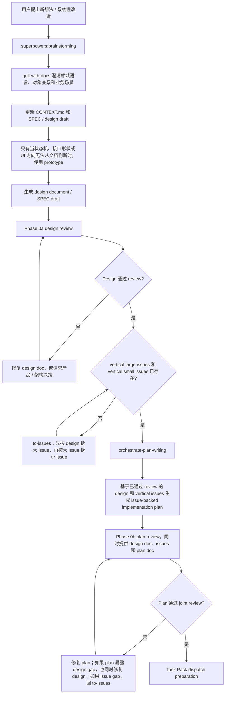
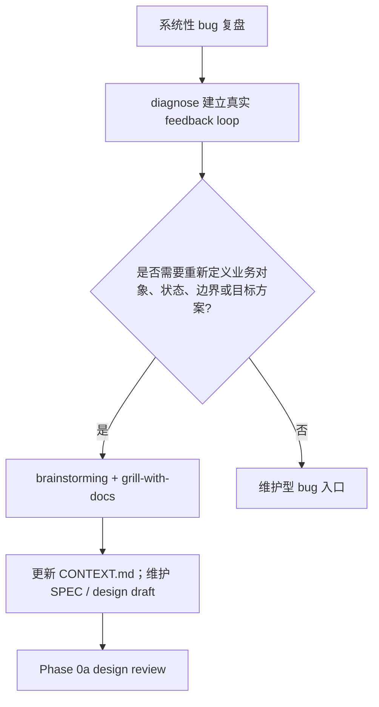

# Discovery 路由

用于全新功能、系统性改造，或用户要求边讨论边沉淀上下文的入口。系统性 bug 复盘先走 `diagnose`；如果诊断后需要重新定义对象、状态、边界或目标方案，再进入本文件。

## 步骤

1. 使用 `brainstorming` 探索产品意图、用户场景、目标行为和验收口径。
2. 使用 `grill-with-docs` 对齐领域语言、对象 owner、状态、边界、合同和现有文档。
3. 能从代码或文档确认的问题，先查证；只把剩余业务决策交给用户。
4. 稳定术语、对象关系、角色和状态写回 `CONTEXT.md` 或项目规则指定的上下文文档。
5. 功能承诺、UI 状态、接口合同、失败场景、rollout 边界和 acceptance 写入 SPEC / design draft。
6. state machine、interface shape 或 UI 方向需要比较时，先走 `prototype`，再把结论写回 design。
7. source requirements 成形后进入 Phase 0a。

## 流程图

### 新想法 / 系统性改造

### 系统性 bug 复盘

## 交付物

- updated context / domain notes
- SPEC / design draft
- open decisions
- acceptance criteria
- source requirements
