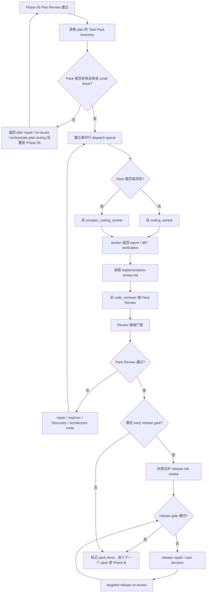

# Dispatch 合同

本文件只在即将派发 custom agent、接收 reviewer / worker 结果、或跨上下文恢复方向时读取。

## 文档层级

| 层级 | 读者 | 责任 |
| --- | --- | --- |
| `SKILL.md` | parent coordinator | Phase 路由、escalation gates、reference selection。 |
| `references/*.md` | parent coordinator | phase-specific checks、pack rules、prompt payloads、finding classification。 |
| `codex/agents/*.toml` | custom sub-agent | 自足角色纪律、local skill routing、project overlay、return discipline。 |

References 告诉 parent dispatch prompt 应该包含什么；sub-agents 不会自动读取 references。Parent 必须把 phase、source docs、anchors、pack / review payload、verification、risk flags 和 return contract 写进 dispatch prompt。

## Review Budget And Release Gate

Baseline review 和 release-risk review 分开：

- `code_reviewer` 是 design / plan / pack / final intent 的 baseline reviewer；两个明确 angles 可以并行，但不能合并。
- `release_reviewer` 只审 release-risk，不审普通代码质量、设计完整性或 plan coverage。
- `production-risk` risk flag 先进入 plan 的“发布风险和人工门禁”；真正的 dispatch trigger 是 early release gate 或 final release gate。
- Early release gate 只在这些情况触发：迁移 / deploy order / rollback / manual production gate 必须在实现前决定；baseline finding 暴露的问题必须先判定 release strategy 才能修；等待 Phase B 才审会造成不可逆数据、权限、账务或 runtime 风险；用户明确要求。
- 多个相邻 high-risk packs 属于同一发布风险面时，默认合并成一次 release-risk review，而不是每个 pack 各派一次。
- Final release gate 在 Phase B 执行：Final Intent Review 没有 implementation / design blocker 后，如果最终 diff 触碰 migration、billing、permission、runtime、cross-service contract、deploy order、rollback 或 manual production dependency，才派 `release_reviewer`。
- release blocker 修复后只做 targeted release re-review；不重跑 baseline review，除非修复改变 source design / plan / shared contract / migration / permission / billing / runtime baseline。
- 每次 spawn reviewer 前先数清本 phase 已经派过的 baseline reviews、targeted re-reviews 和 release gates；如果下一次 spawn 不属于这三类，先做方向检查，不用 review 填补不确定感。

## Scope Contract

每次 dispatch 前，parent 必须写清：

```text
Scope:
Source artifacts:
Editable artifacts:
Read-only context:
Out of scope:
Issue recording target:
```

规则：

- `Source artifacts` 只包含用户明确提供的文档 / tracker refs / diff，以及当前 phase 已确认的直接输入。
- `Editable artifacts` 只能是 source artifacts 或当前 phase 明确要求产出的 plan / pack / report。
- `Read-only context` 可以包含相关 issue、ADR、代码或 runbook，但 sub-agent 只能用来判断当前 source artifacts，不得把它们变成交付范围。
- `Out of scope` 必须明确列出容易被误纳入的相关 issue、ADR、未来能力、其它文档或环境。
- `Issue recording target` 说明 small issue hierarchy 写回哪里。AgentFlow 使用 GitHub Issues 时，先写入 parent large issue 文档；未获明确授权不得新建 standalone issue 文档。

收到 sub-agent 结果后，parent 必须过滤越界建议：out-of-scope 文件不能因为 reviewer 提到就被修改、纳入 plan source 或作为 Task Pack 来源。

## Phase A Task Pack Execution



Phase A 只执行已通过 Phase 0b 的 Task Pack inventory。不要按聊天记忆、文件类型或 reviewer 现场建议重切 pack。

## Pack Brief

派 worker 时不要只发 pack 标题。Prompt 至少包含：

```text
Pack:
Issue:
Scope:
Goal behavior:
Implementation tasks:
Owned files / responsibilities:
Read first:
Contract anchors:
Mockup anchors:
Acceptance criteria:
Verification commands:
Risk flags:
发布风险:
AFK / HITL:
Dependencies:
Parallel safety:
Out of scope:
Return contract:
```

Formal Orchestrate 的 Pack Brief 必须来自已通过 Phase 0b 的 plan。无效 pack 先修回 plan，不在 dispatch prompt 里临场重切。

Direct Repair 只能来自 Entry Gate，使用同一组字段作为 Direct Repair Brief：

- `Pack` 写 `Targeted repair`。
- `Issue` 写 accepted reviewer finding、failing test、批准 design / plan / mockup / acceptance 的 locator，或用户明确给出的 repair brief。
- `Implementation tasks` 只写修复 accepted finding 或 failing behavior 所需步骤；不要临场扩展 issue hierarchy。
- `Contract anchors`、`Mockup anchors`、`Verification commands`、`Risk flags` 和 `Out of scope` 仍必须自足。
- 缺目标行为、合同边界、UI target 或验收口径时，返回 Discovery / user decision，不让 worker 自行决定。

Direct Repair worker 返回后仍进入 `implementation-review.md` 的 targeted Pack Review；只有本 repair 的发布风险需要上线 / 回滚 / 人工门禁判断时才追加 `release_reviewer`。

## 执行规则

步骤：

1. 为每个 pack 确认 source issue、goal behavior、owned scope、anchors、verification 和 dependency。
2. 标出串并行关系。同一文件、同一 shared contract、migration、permission、billing、runtime、release boundary 默认串行。
3. 选择 worker：
   - 普通 Task Pack -> `coding_worker`；
   - migration、billing、auth、permission、runtime、shared contract、release boundary、高风险 repair -> `complex_coding_worker`。
4. 把 self-contained Pack Brief、标准 Return Contract、Read first、Project baseline、Contract anchors、Mockup anchors 和 verification commands 写进 dispatch prompt。
5. worker 返回后，parent 立即读取 `implementation-review.md`，派 `code_reviewer` 做 Pack Review；只在满足 early release gate 时派或合并 `release_reviewer`。release gate 失败时只做 release repair 和 targeted release re-review，除非修复改变 pack baseline。
6. Pack Review 通过前，pack 不算完成；review finding 按 Review 接收门禁处理。

## 标准 Return Contract

每个 worker / explorer / reviewer / docs dispatch 都必须包含这些顶层 heading：

```text
### Verdict
pass / blocked / needs repair / needs context

### Evidence
- 实际检查过的 files / docs / tests / commands / screenshots
- 关键事实；需要时给 locator

### Result
- 本次 changed、found、reviewed 或 confirmed 的内容

### Verification
- 已运行的 commands 或 checks，以及结果
- 未运行的 checks，以及原因

### Open Items
- parent 必须处理的问题、风险、缺口或决策

### Routing
- Suggested next owner: parent / original worker / coding_worker / complex_coding_worker / code_explorer / complex_code_explorer / code_reviewer / release_reviewer / docs_worker / orchestrate-discovery / orchestrate-plan-writing / upstream diagnose / upstream prototype / upstream improve-codebase-architecture / upstream triage / upstream to-issues / user decision
```

References 和 agent TOMLs 可以在 `### Result` 内定义 role-specific payload headings，但不得替换标准顶层 headings。

## Routing Vocabulary

所有 reviewer、worker、explorer 和 docs worker 只使用这组 owner 名称；parent dispatch 也复用同一组：

| owner | 使用条件 |
| --- | --- |
| `parent` | coordinator 归并证据、更新进度、继续下一 phase |
| `original worker` | accepted implementation finding 明确属于刚返回的 worker scope |
| `coding_worker` | 普通 repair / implementation，改动范围清楚 |
| `complex_coding_worker` | migration、billing、auth、permission、runtime、shared contract、release boundary 或高风险 repair |
| `code_explorer` | 窄范围文件、符号、调用链、测试入口问题 |
| `complex_code_explorer` | unknown root cause、多模块调查、历史行为或迁移链路 |
| `code_reviewer` | baseline design / plan / pack / final review，或 targeted re-review |
| `release_reviewer` | early / final release-risk gate；不能替代 baseline review |
| `docs_worker` | parent 明确授权的低风险文档整理或 issue 文案草稿 |
| `orchestrate-discovery` | design / domain / UX / terminology / ownership / target-state ambiguity |
| `orchestrate-plan-writing` | reviewed design 和 confirmed issue hierarchy 已存在，但 plan 自身需要生成或修复 |
| `upstream diagnose` | 缺 feedback loop、复现、hypothesis 或 regression target |
| `upstream prototype` | 状态行为、interface shape 或 UI direction 需要 throwaway proof |
| `upstream improve-codebase-architecture` | bad seam、single-adapter interface、repeated repair、weak test surface |
| `upstream triage` | issue ready state、AFK / HITL、blocked-by 或 label/status 不清 |
| `upstream to-issues` | large / small issue hierarchy 缺失或 small issue 不能独立验证 |
| `user decision` | 产品、业务、账务、权限、UX 或发布决策无法从 source artifacts 判定 |

不要返回自由 owner 名称。需要组合路线时写主要 owner，并在 `### Open Items` 说明 parent 应携带的 payload。

## Finding Shape

Review findings 使用：

```text
- severity:
  confidence:
  locator:
  evidence:
  impact:
  remediation:
  routing:
```

## Review 接收门禁

收到 reviewer finding 后，parent 必须用 docs、code、tests、diff、logs、screenshots、command output 验证证据，并逐条给 disposition。没有 disposition 的 finding 不能进入 repair。

先统一三个词：

- `repair round`：只针对 accepted findings 的闭环，一轮等于 disposition -> repair -> targeted re-review。
- `targeted re-review`：只重审 accepted findings、repair diff、受影响 source artifacts、contract surface、mockup anchors 和 verification。
- `full phase review rerun`：重新派发该 phase 的 baseline review angles；只有 source design / issue / plan、scope、Task Pack inventory、shared contract、migration、permission、billing、runtime 或 mockup baseline 改变时才允许。

各 phase 写的“最多 N 轮修复”只限制 `repair round`，不是要求或授权反复重跑完整 review。没有 accepted finding，或 finding 被判为 rejected / out of scope / duplicate，就不进入 repair，也不触发 targeted re-review。

| disposition | parent 动作 |
| --- | --- |
| `accepted` | 转成 repair / doc / issue / upstream payload；写明 route、owner、affected artifacts 和 targeted re-review scope |
| `rejected` | 记录反证；不派 repair，不让同一 finding 反复进入 review |
| `needs evidence` | 派 `code_explorer` / `complex_code_explorer` 或让 reviewer 补证据；补证前不 repair |
| `duplicate / already covered` | 链到已有 finding、pack、commit、test 或文档；不新增路线 |
| `out of scope` | 从当前 scope 移出；只有用户授权或项目规则要求时才写 durable issue |
| `user decision` | 停止执行，一次只问一个会改变设计、计划或发布策略的问题 |

冲突按 evidence quality 判断，不按 reviewer 数量投票。

accepted finding 路由：

- implementation finding -> `original worker`；
- unknown root cause -> `complex_code_explorer`；
- high-risk repair -> `complex_coding_worker`；
- 满足 early / final release gate -> `release_reviewer`；
- accepted release blocker -> `complex_coding_worker` 或 `user decision`；修复后只做 targeted release re-review；
- domain / UX / terminology / ownership ambiguity -> `orchestrate-discovery`；
- bad seam -> `upstream improve-codebase-architecture`；
- UI / state / interface direction -> `upstream prototype`；
- low-confidence / wrong-context -> 用证据退回。

Repair prompt 只携带 accepted findings，不夹带 rejected、out-of-scope 或 low-confidence observations。Repair 返回后默认只做 targeted re-review。只有 source design / issue / plan 被修改、scope 扩大、shared contract / migration / permission / billing / runtime surface 改变，或 targeted review 发现新 blocker 时，才做 full phase review rerun。

## Durable Handoff Brief

跨会话交接、导出为 issue、或留给以后 agent 处理时，用 durable brief，不要只保存当前文件行号。

```text
Current behavior:
Desired behavior:
Key interfaces:
Acceptance criteria:
Out of scope:
Risk flags:
AFK / HITL:
```

写行为合同，不写“去某文件第 N 行改 X”。UI / UX durable brief 必须保留 mockup path、目标 viewport、关键 states 和允许偏差。如果 durable brief 来自 Discovery domain alignment、prototype 或 architecture review，写明 resolved context、prototype verdict 或 architecture finding。

## 方向检查

经过多个 packs、review rounds、repair loops 或 context compaction 后，先重述：

- 当前 phase / pack；
- 剩余 packs / phases；
- source design intent；
- 累计 findings 和 disposition；
- plan checkbox progress。

触发条件：

- 同一 finding 已经经历 2 个 repair rounds。
- 同一 phase 需要追加不属于 release gate 的非 baseline reviewer。
- 下一次 reviewer spawn 的目的无法写成 baseline review、targeted re-review 或 release gate。
- reviewer findings 互相冲突，且无法用 evidence quality 直接判定。

方向检查只决定下一步 owner 和 scope；不要把它写成新审查。下一步明确时直接继续，不把显然该执行的 repair / targeted re-review 推回给用户。
