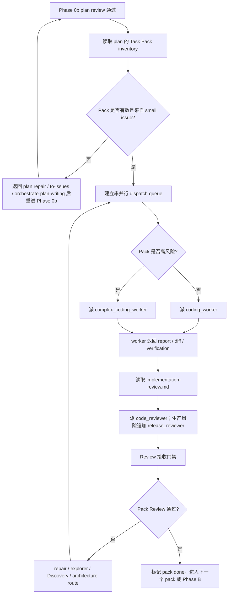

# Dispatch 合同

本文件只在即将派发 custom agent、接收 reviewer / worker 结果、或跨上下文恢复方向时读取。

## 文档层级

| 层级 | 读者 | 责任 |
| --- | --- | --- |
| `SKILL.md` | parent coordinator | Phase 路由、escalation gates、reference selection。 |
| `references/*.md` | parent coordinator | phase-specific checks、pack rules、prompt payloads、finding classification。 |
| `codex/agents/*.toml` | custom sub-agent | 自足角色纪律、local skill routing、project overlay、return discipline。 |

References 告诉 parent dispatch prompt 应该包含什么；sub-agents 不会自动读取 references。Parent 必须把 phase、source docs、anchors、pack / review payload、verification、risk flags 和 return contract 写进 dispatch prompt。

## Scope Contract

每次 dispatch 前，parent 必须写清：

```text
Scope:
Source artifacts:
Editable artifacts:
Read-only context:
Out of scope:
Issue recording target:
```

规则：

- `Source artifacts` 只包含用户明确提供的文档 / tracker refs / diff，以及当前 phase 已确认的直接输入。
- `Editable artifacts` 只能是 source artifacts 或当前 phase 明确要求产出的 plan / pack / report。
- `Read-only context` 可以包含相关 issue、ADR、代码或 runbook，但 sub-agent 只能用来判断当前 source artifacts，不得把它们变成交付范围。
- `Out of scope` 必须明确列出容易被误纳入的相关 issue、ADR、未来能力、其它文档或环境。
- `Issue recording target` 说明 small issue hierarchy 写回哪里。AgentFlow 使用 GitHub Issues 时，先写入 parent large issue 文档；未获明确授权不得新建 standalone issue 文档。

收到 sub-agent 结果后，parent 必须过滤越界建议：out-of-scope 文件不能因为 reviewer 提到就被修改、纳入 plan source 或作为 Task Pack 来源。

## 派发流程图



## Pack Brief

派 worker 时不要只发 pack 标题。Prompt 至少包含：

```text
Pack:
Issue:
Scope:
Goal behavior:
Implementation tasks:
Owned files / responsibilities:
Read first:
Contract anchors:
Mockup anchors:
Acceptance criteria:
Verification commands:
Risk flags:
AFK / HITL:
Dependencies:
Parallel safety:
Out of scope:
Return contract:
```

Pack Brief 必须来自已通过 Phase 0b 的 plan。无效 pack 先修回 plan，不在 dispatch prompt 里临场重切。

## Task Pack Dispatch Procedure

Phase 0b 通过后，parent 用 plan 里的 Task Pack inventory 建立 dispatch queue。不要按聊天记忆、文件类型或 reviewer 现场建议重切 pack。

步骤：

1. 为每个 pack 确认 source issue、goal behavior、owned scope、anchors、verification 和 dependency。
2. 标出串并行关系。同一文件、同一 shared contract、migration、permission、billing、runtime、release boundary 默认串行。
3. 选择 worker：
   - 普通 Task Pack -> `coding_worker`；
   - migration、billing、auth、permission、runtime、shared contract、release boundary、高风险 repair -> `complex_coding_worker`。
4. 把 self-contained Pack Brief、标准 Return Contract、Read first、Project baseline、Contract anchors、Mockup anchors 和 verification commands 写进 dispatch prompt。
5. worker 返回后，parent 立即读取 `implementation-review.md`，派 `code_reviewer` 做 Pack Review；production-risk pack 追加 `release_reviewer`。
6. Pack Review 通过前，pack 不算完成；review finding 按 Review 接收门禁处理。

## 标准 Return Contract

每个 worker / explorer / reviewer / docs dispatch 都必须包含这些顶层 heading：

```text
### Verdict
pass / blocked / needs repair / needs context

### Evidence
- 实际检查过的 files / docs / tests / commands / screenshots
- 关键事实；需要时给 locator

### Result
- 本次 changed、found、reviewed 或 confirmed 的内容

### Verification
- 已运行的 commands 或 checks，以及结果
- 未运行的 checks，以及原因

### Open Items
- parent 必须处理的问题、风险、缺口或决策

### Routing
- Suggested next owner: parent / original worker / coding_worker / complex_coding_worker / complex_code_explorer / code_reviewer / release_reviewer / orchestrate-discovery / upstream diagnose / upstream prototype / upstream improve-codebase-architecture / upstream triage-to-issues / user decision
```

References 和 agent TOMLs 可以在 `### Result` 内定义 role-specific payload headings，但不得替换标准顶层 headings。

## Finding Shape

Review findings 使用：

```text
- severity:
  confidence:
  locator:
  evidence:
  impact:
  remediation:
  routing:
```

## Review 接收门禁

收到 reviewer finding 后，parent 必须用 docs、code、tests、diff、logs、screenshots、command output 验证证据，并分类：

- `valid`；
- `invalid`；
- `needs clarification`；
- `user decision`。

冲突按 evidence quality 判断，不按 reviewer 数量投票。

路由：

- valid implementation finding -> original worker；
- unknown root cause -> `complex_code_explorer`；
- high-risk repair -> `complex_coding_worker`；
- production risk -> `release_reviewer`；
- domain / UX / terminology / ownership ambiguity -> `orchestrate-discovery`；
- bad seam -> `improve-codebase-architecture`；
- UI / state / interface direction -> `prototype`；
- low-confidence / wrong-context -> 用证据退回。

## Durable Handoff Brief

跨会话交接、导出为 issue、或留给以后 agent 处理时，用 durable brief，不要只保存当前文件行号。

```text
Current behavior:
Desired behavior:
Key interfaces:
Acceptance criteria:
Out of scope:
Risk flags:
AFK / HITL:
```

写行为合同，不写“去某文件第 N 行改 X”。UI / UX durable brief 必须保留 mockup path、目标 viewport、关键 states 和允许偏差。如果 durable brief 来自 Discovery domain alignment、prototype 或 architecture review，写明 resolved context、prototype verdict 或 architecture finding。

## 方向检查

经过多个 packs、review rounds、repair loops 或 context compaction 后，先重述：

- 当前 phase / pack；
- 剩余 packs / phases；
- source design intent；
- 累计 findings 和 disposition；
- plan checkbox progress。

然后从下一个未阻塞 phase 继续。
