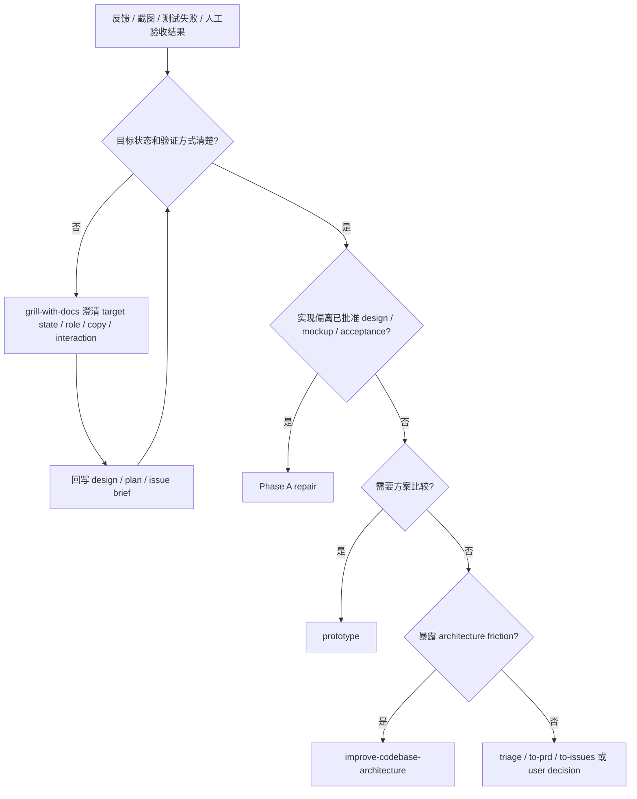

# Feedback 路由

反馈、截图、测试失败或人工验收结果进入代码前先分类。

## 分类

| 信号 | route |
| --- | --- |
| 实现偏离已批准 design / mockup / acceptance | Phase A repair |
| target state、role、copy、interaction、permission、billing、lifecycle 不清 | `grill-with-docs` |
| state machine、interface shape 或 UI 方向需要比较 | `prototype` |
| bad seam、repeated repair、single-adapter interface、caller leaks implementation | `improve-codebase-architecture` |
| 需要跨会话跟踪或暂时不能关闭 | `triage` / `to-prd` / `to-issues` |

## 门禁

- 没有 target state，不派 worker。
- 没有 verification anchor，不派 worker。
- 主观反馈必须先转成可验证行为、UI state、copy、interaction 或 acceptance。
- 反馈暴露 source design 缺口时，先修 design，再回到 Phase 0a / Phase 0b。

## 流程图

