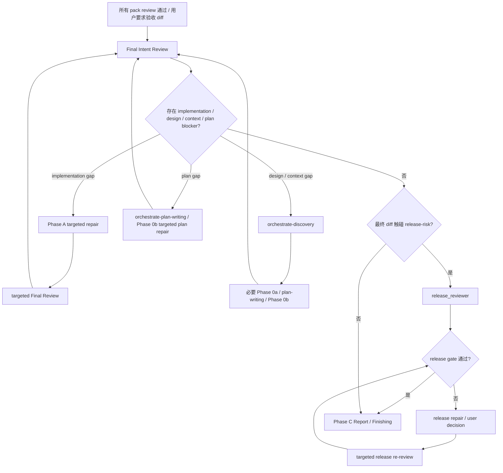

# Final Review 合同

Phase B 验证所有 pack 合并后是否满足 design intent，并确认没有 release blocker。它不重新拆 pack，不把 release-risk review 当成 baseline review。

## Phase Contract

输入必须包含：

- Scope。
- Design doc / source requirements。
- Implementation plan 和 pack completion summary。
- starting commit、current diff、changed files。
- 相关 UI / UX mockup。
- validation commands 和已运行结果。
- 发布风险和人工门禁。
- 根 `AGENTS.md`，相关 `PROJECT.md` / `ENGINEERING-RULES.md` / SPEC / ADR / GUIDE / CONTEXT，changed files 涉及目录的 `AGENTS.override.md` / `agents.overrides.md`。
- Contract baseline：最终 diff 涉及的 API、Pydantic、DB、JSON、task、sync、catalog、capability、helper 边界，以及 producer / consumer / verifier。

Pass condition：

- Final Intent Review 通过。
- plan 中需要 Phase B 判定的发布风险已通过 release-risk gate，或明确为 non-blocking manual gate。
- 没有 implementation / design / context blocker。

Repair limit：每个 final gap 最多 2 个 repair rounds。超过修复轮次，或下一次 reviewer spawn 目的不清时，按 `dispatch-contract.md` 做方向检查。

## Flow



## Dispatch

默认派一次 baseline `code_reviewer` 做 Final Intent Review。Final Intent Review 仍 blocked 时，不先派 release-risk review；先处理 accepted implementation / design / context / plan blockers。

Prompt 必须包含：

- Read first：design doc、plan、相关 UI / UX mockup、根 `AGENTS.md`、相关 `PROJECT.md` / `ENGINEERING-RULES.md` / SPEC / ADR / GUIDE / CONTEXT、changed files 涉及目录的 `AGENTS.override.md` / `agents.overrides.md`。
- Project baseline：最终验收必须满足的设计意图、项目不变量、数据权威、模块边界、contract wall、测试路由和发布 / 回滚约束。
- Contract baseline。
- Mockup baseline：mockup path、目标 viewport、关键 states、interaction、信息架构和允许偏差。
- design doc、plan、starting commit、current diff、pack completion summary、发布风险和人工门禁、validation commands。

## Final Intent Review

步骤：

1. 从 design doc 和 mockup 提取每条可验证 intent。
2. 为每条 intent 写出验证方法：pytest、curl、CLI、UI、browser、screenshot、DOM scan、VM、manual checklist。
3. 实际运行能运行的验证；不能运行时说明环境缺口。
4. 对每条 intent 判定：pass / implementation gap / design gap / context gap / unverifiable。
5. 跑 changed-files 相关回归检查。
6. 涉及合同边界时，逐项确认 Pydantic model、schema_version、registry、migration、repository、read model、catalog、producer / consumer 和 release gate。
7. 做跨 pack 代码交叉审查。
8. UI / UX 任务必须对照 mockup 检查最终页面，不接受只读代码推断。

Gap 分类：

- Implementation Gap：设计合理，代码没做到；mockup 的关键页面状态、交互、视觉层级或响应式行为没做到；需要 acceptance test 或复现检查；route 给 worker。
- Design Gap：设计承诺不可实现、遗漏项目约束，或设计假设与当前系统不成立；route 给用户决策或文档修正。
- Context Gap：最终反馈需要业务术语、对象 owner、UI target state、验收口径或项目文档确认；route 给 `orchestrate-discovery`。
- Unverifiable：当前环境、账号、数据、生产 gate 或人工验收缺失；写清本地已验证证据、缺失 artifact、manual gate owner 和是否阻塞 Phase C。

如果最终验收反馈暴露 desired behavior、domain term、UI role、target state、copy、interaction 或 verification method 不清，route 给 `orchestrate-discovery`，不要把它归为普通 implementation gap。

## Release Gate

Final Intent Review 没有 implementation / design / context / plan blocker 后，以下情况必须派 `release_reviewer`：

- database migration；
- billing / wallet / settlement；
- permissions / auth / tenant isolation；
- runtime / scheduler / browser takeover；
- deploy order / rollback；
- cross-service contract；
- API / Pydantic / DB / JSON / sync / task payload compatibility；
- production dependency / manual gate。

`release_reviewer` 只审 release-risk，不能替代 Final Intent Review。Prompt 必须额外写清 migration / deploy / rollback / manual gate / online verification 事实。

Release blocker：

- 数据丢失或无法回滚。
- 权限绕过或授权状态漂移。
- 账务 hold / settle / release / auto_release 不一致。
- producer / consumer 合同字段未同步。
- Pydantic contract、JSON registry、DB migration、repository / read model 或 catalog 没有闭合。
- 部署顺序会让现役客户端或服务 401 / 500。
- release gate 或 manual production dependency 没有验证证据。

## Architecture After-Effects

Final Review 可以记录架构后效应，但不能随意把架构摩擦升级成 blocker。

如果需要判断 module、interface、seam、adapter、depth、locality、deletion test 或 dependency category，使用 upstream `improve-codebase-architecture` 作为方法来源。Orchestrate 只定义 blocker threshold：architecture after-effect 只有造成 production risk、data risk、permission risk、billing risk、rollback failure 或当前验收不成立时，才成为 blocker；否则通过 upstream `triage` / `to-issues` 记录为 bounded issue candidate。

## Reception

Coordinator 收到 findings 后按 `dispatch-contract.md` 做 disposition：

- `accepted` implementation gap：回 Phase A targeted repair；repair prompt 只带 accepted findings、affected files、contract / mockup anchors 和 verification。
- `accepted` design / context gap：交 `orchestrate-discovery`；修订 design 后回到必要的 Phase 0a / plan-writing / Phase 0b。
- `accepted` plan gap：交 `orchestrate-plan-writing` 或 Phase 0b targeted plan repair。
- `accepted` release blocker：交 `complex_coding_worker` 或 `user decision`；修复后只做 targeted release re-review。
- `rejected` / `out of scope` / `duplicate` finding：记录证据，不 repair，不触发 targeted re-review。

修复后只 targeted re-review accepted findings、affected files、contract / mockup anchors 和 verification。只有 source design、plan、Task Pack inventory、shared contract、migration、permission、billing、runtime 或 mockup baseline 改动时，才 full phase review rerun。

## Result Payload

Coordinator 派发必须要求标准顶层 headings；下列内容放在 `### Result` 下。顶层 `### Verdict` 只使用 `pass / blocked / needs repair / needs context`。

```text
Final Intent Review:
通过: X / Y
Implementation Gaps:
Design Gaps:
Context Gaps:
Unverifiable:

Regression / Cross-Pack Review:
Critical:
Important:

Release Risk:
Blockers:
Manual verification:
Rollback concerns:

Phase Summary:
可以完成 / 阻塞
Disposition required:
```

每条 finding 必须使用统一 shape：severity、confidence、locator、evidence、impact、remediation、routing。Final review result 必须能被主线程执行 Review Reception Gate。
