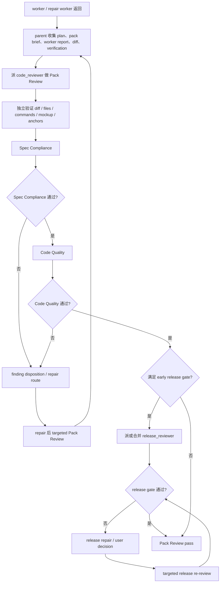

# Implementation Review 合同

Phase A 中每个 worker / repair worker 返回后，parent 立即读取本文件并派 Pack Review。目标是独立确认 Task Pack 是否真实完成；worker self-report 不能作为通过证据。

## Phase Contract

输入必须包含：

- Scope。
- Source design / requirements、plan、pack brief。
- Worker report。
- base SHA 或 diff scope。
- changed files。
- verification commands 和已运行结果。
- 相关 UI / UX mockup。
- 根 `AGENTS.md`，相关 `PROJECT.md` / `ENGINEERING-RULES.md` / SPEC / ADR / GUIDE / CONTEXT，changed files 涉及目录的 `AGENTS.override.md` / `agents.overrides.md`。
- risk flags、发布风险、Contract anchors、Mockup anchors。

Pass condition：

- Spec Compliance 通过。
- Code Quality 没有当前验收 blocker。
- accepted release blocker 已关闭。
- pack-local verification 能证明 public behavior。

Repair limit：每个 pack 最多 3 个 repair rounds。每轮 repair 必须改变方法、证据或边界，不能重复同一种修补。这里的 round 按 `dispatch-contract.md` 定义。

## Flow



## Dispatch

默认派一个 baseline `code_reviewer`。同一个 reviewer 先做独立验证和 Spec Compliance；Spec Compliance 通过后才做 Code Quality。

`release_reviewer` 只在 `dispatch-contract.md` 的 early release gate 触发；通常 baseline Pack Review 通过后再派。多个相邻 high-risk packs 属于同一发布风险面时，合并一次 release-risk review。

Prompt 必须包含：

- Read first：plan、pack 相关 design / SPEC / ADR / GUIDE、相关 UI / UX mockup、根 `AGENTS.md`、相关 `PROJECT.md` / `ENGINEERING-RULES.md`、changed files 涉及目录的 `AGENTS.override.md` / `agents.overrides.md`。
- Project baseline：本 pack 必须遵守的数据权威、模块边界、contract wall、测试路由、日志规则和风险约束。
- Contract anchors 和 Mockup anchors。
- plan path、pack brief、worker report、base SHA 或 diff scope、verification commands、changed files、risk flags、发布风险。

## Independent Verification

Reviewer 不信任 worker self-report，必须：

1. 读取 `git diff <base>..HEAD` 或当前 diff。
2. 读取变更文件。
3. 跑相关 focused verification，或说明为什么无法运行。
4. UI / UX pack 必须打开实现或检查截图 / DOM / CSS，和 mockup anchors 对照。
5. 涉及合同边界时，按 `contract-boundary.md` 检查正式 contract、registry、migration、repository、read model、catalog 和 producer / consumer。
6. 对照 pack brief 逐 task 审查。

## Phase 1：Spec Compliance

先审 spec compliance。有 Critical 时停止，不进入 Code Quality。

检查：

- pack 要求的功能是否已实现，是否做错行为或漏掉关键路径。
- UI / UX task 是否按 mockup 实现对应页面状态、信息架构、布局、组件状态和交互。
- UI / UX finding 是否有明确目标；目标含混时 route 给 `orchestrate-discovery`，不要要求 worker 自行改。
- 错误路径、权限、空状态、重复提交、并发、回滚是否覆盖。
- API / Pydantic / DB / JSON / helper 边界是否按 Contract anchors 实现，没有让 worker 自创临时结构。
- 是否做了未要求的 scope creep。
- pack 内多个 task 是否互相兼容。
- 安全问题无论 spec 是否要求，默认 Critical。

Critical：

- 功能缺失或做错。
- mockup 中关键 UI / UX 状态未落地，或实现与 mockup 的信息架构、交互、视觉层级明显不一致。
- UI / UX 目标含混却已被 worker 自行落成新行为，导致验收标准不可追溯。
- 安全漏洞、权限绕过、敏感数据泄漏。
- 新 API / DB / JSON / task / sync payload 绕过 Pydantic contract、JSON registry、migration tree、catalog 或 consumer 同步。
- 违反项目不变量或跨服务合同。

## Phase 2：Code Quality

仅 Spec Compliance 通过后执行。

检查：

- 逻辑错误、空值处理、类型不匹配、资源泄漏、竞态条件。
- 项目规则：logger、contract wall、模块边界、单一权威源、registry、`AGENTS.override.md` / `agents.overrides.md`。
- 合同质量：`schema_version`、`extra=forbid`、typed public return、unknown-field handling、producer / consumer 同步、DB migration / repository / read model 闭合。
- helper placement：新增 helper 是否属于 domain service、repository、adapter 或 shared contract；route / host / page action 的一次性 helper 默认可疑。
- 测试质量：public behavior、真实边界、no internal mocks、正确 seam；不要断言 private helper、内部调用次数、内部调用顺序或临时数据结构。
- UI / UX 证据：browser screenshot、DOM key scan、responsive viewport check、manual checklist 或视觉回归检查是否覆盖 mockup 关键状态。
- Mock 边界：第三方 API、系统时间、随机数、文件系统、不可控进程可以 mock；当前仓库内部业务模块、业务规则、要验证的 collaborator 默认不 mock。
- Interface testability：为了可测性暴露 private seam、引入 single-adapter interface、或让 caller 学会过多 implementation detail 时，记录 architecture finding。
- Architecture routing：bad seam、single-adapter interface、repeated repair loop、隐藏 coupling 或测试只能断言内部细节时，route 给 upstream `improve-codebase-architecture`。
- 文件健康：不必要重复、过早抽象、临时 instrumentation、死代码。

Refactor 只在 GREEN 后允许。reviewer 可以建议 refactor，但不能用普通整洁偏好阻塞 pack；只有影响 correctness、test seam、项目规则或当前验收时才升级。

## Release Gate

`release_reviewer` 只在 early release gate 触发；多个相邻 high-risk packs 属于同一发布风险面时合并一次 release-risk review。Pack Review 只确认当前 pack 的实现和风险输入是否可进入该 gate。

## Reception

Coordinator 收到 findings 后先按 `dispatch-contract.md` 做 disposition。只有 accepted findings 进入 repair；rejected、duplicate、out of scope 和低置信度观察不得触发 worker。

Routing 判断：

- 能说清楚改哪里改什么：`original worker` / `coding_worker` / `complex_coding_worker`。
- 问题存在但根因不明：`complex_code_explorer`。
- desired behavior、UI target、business term 或 object ownership 不清：`orchestrate-discovery`。
- bad seam、repeated repair、single-adapter interface 或 weak test surface：upstream `improve-codebase-architecture`。
- 满足 early release gate：`release_reviewer`。
- accepted release blocker：`complex_coding_worker` 或 `user decision`；修复后只做 targeted release re-review。
- 改变产品范围或业务规则：`user decision`。

repair 后默认 targeted Pack Review，只重审 accepted findings、repair diff、受影响 contract / mockup anchors 和 verification。pack scope、source plan、shared contract 或 high-risk surface 改变时才 full phase review rerun。

## Result Payload

Coordinator 派发必须要求标准顶层 headings；下列内容放在 `### Result` 下。顶层 `### Verdict` 只使用 `pass / blocked / needs repair / needs context`。

```text
Spec Compliance:
Phase summary: 通过 / 阻塞
Critical:
Important:

Code Quality:
Phase summary: 通过 / 阻塞 / 未执行
Critical:
Important:

Verification summary:
命令:
结果:

Routing summary:
```

每条 finding 必须使用统一 shape：severity、confidence、locator、evidence、impact、remediation、routing。Review result 不能只返回自由文本结论。
