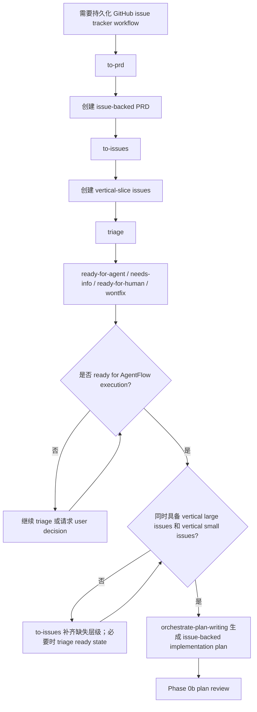

# Issue Workflow 路由

用于 PRD、issue、triage 或 backlog 入口。

## 步骤

1. 缺 source PRD / requirements 时，使用 `to-prd` 或 `grill-with-docs` 生成 source requirements。
2. 缺 vertical large issues 时，使用 `to-issues` 从 source requirements 拆出 tracer-bullet large issues。
3. large issue 下缺 vertical small issues 时，继续使用 `to-issues` 拆到 small issue 层级。
4. issue ready state、AFK / HITL、blocked-by 或 label 不清时，使用 `triage`。
5. large / small issue hierarchy 齐备后，使用 `orchestrate-plan-writing` 生成 issue-backed implementation plan。
6. plan 生成后进入 Phase 0b。

## 流程图

## Ready 条件

- 每个 large issue 都能成为 plan section。
- 每个 small issue 都能成为一个可验证 Task Pack。
- 每个 issue 有 source、acceptance、blocked-by / dependencies、AFK / HITL 判断。
- 不能把未确认的 suggested slice 直接当成 Task Pack。
