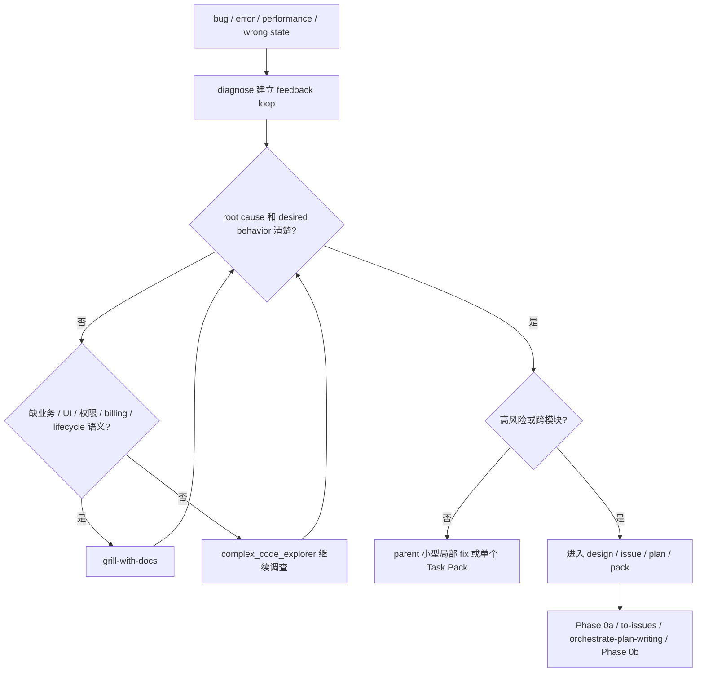

# 维护型 Bug 路由

用于 bug、报错、性能退化、状态错乱，或系统性 bug 复盘的入口。进入本文件前先用 `diagnose` 建立 feedback loop。

## 必须带回

- current behavior；
- desired behavior；
- reproduction 或可观察症状；
- falsifiable hypotheses；
- key interfaces；
- acceptance / regression check；
- out of scope。

desired behavior、业务术语、UI target、permission、billing 或 lifecycle 不清时，先走 `grill-with-docs`。出现 bad seam、shallow module、caller leakage、single-adapter interface 或 repeated repair 时，先走 `improve-codebase-architecture`。

## 流程图

## 路由

- 小型局部 fix：parent 可直接修，但仍要保留 regression check。
- 单个可验证行为：形成一个 Task Pack，走 Phase A + Pack Review。
- runtime、billing、migration、permission、API、DB、JSON、shared contract、deploy 或 multi-module work：必须进入 plan 和 Phase 0b。
- 只对独立失败并行调查；共享状态、共享合同或同一复现 loop 默认串行。
