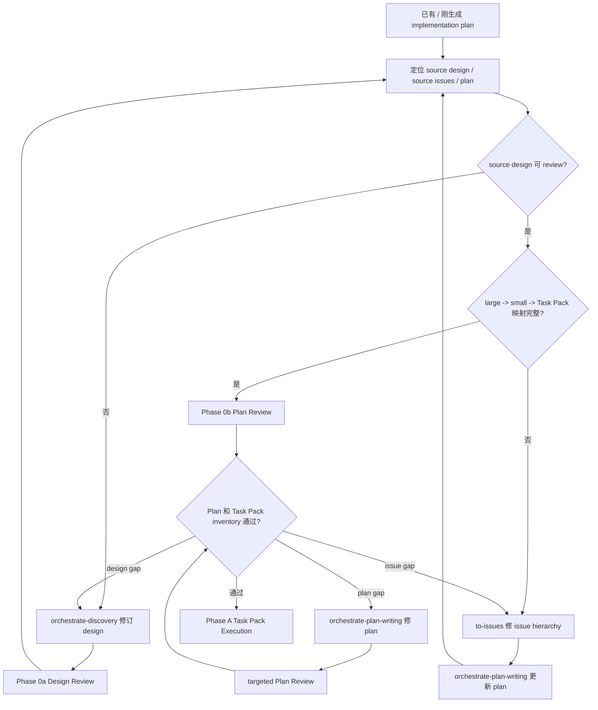

# Plan Review 合同

Phase 0b 审 issue-backed implementation plan。目标是确认 plan 完整承接 source design / requirements 和 `to-issues` 产出的 source issues，并且 Task Pack inventory 可以直接进入 Orchestrate dispatch。

## Phase Contract

输入必须包含：

- Scope：Source artifacts、Editable artifacts、Read-only context、Out of scope、Issue recording target。
- Source design / requirements：reviewed design document、SPEC、ADR、PRD source 或 bug brief。
- Source issues：已确认的 vertical large issues 和 vertical small issues。
- Implementation plan。
- 相关 UI / UX mockup、截图、prototype 或 acceptance feedback。
- 根 `AGENTS.md`，相关 `PROJECT.md` / `ENGINEERING-RULES.md` / SPEC / ADR / GUIDE / CONTEXT，触碰目录的 `AGENTS.override.md` / `agents.overrides.md`。
- 涉及合同边界时，附 `contract-boundary.md` 的 Contract anchors。

没有 source design 或 source issues 时返回 `needs context`，route 给 `orchestrate-discovery` 或 upstream `to-issues`，不要审一份孤立 plan。

Pass condition：

- Coverage And Task Quality 通过。
- Compliance And Verification 通过。
- 发布风险和人工门禁能被 Phase A / Phase B 消费。
- 没有 invalid pack、source mismatch、虚构路径、缺 anchors 或缺 verification。

Repair limit：Phase 0b 最多 2 个 repair rounds。这里的 round 按 `dispatch-contract.md` 定义，不授权反复重跑完整 review。

## Flow



## Plan Entry Gate

进入 baseline review 前，coordinator 先确认 plan 包含：

- `Source design`。
- `Source issues`，且只包含用户明确提供或 Orchestrate parent 明确确认的 issue。
- `Execution owner: Orchestrate Workflow`。
- `Plan unit`。
- `Completion gate`。
- `发布风险和人工门禁`，覆盖 production-risk / billing / permission / migration / runtime / manual gate。
- large issue -> small issue -> Task Pack mapping。
- source issues 来自 `to-issues` 或等价垂直 issue workflow。
- GitHub Issues 项目中，small issue hierarchy 已先记录到 parent large issue 文档。
- 每个 Task Pack 的 issue source、goal behavior、owned files / responsibilities、read first、Contract anchors、Mockup anchors、acceptance criteria、verification commands、risk flags、发布风险、Commit boundary、AFK / HITL、dependencies、parallel safety、out of scope。

如果 plan 声明非 Orchestrate Workflow 的 execution owner，或添加额外 execution handoff，返回 `needs repair`，由主线程修 plan，不进入 Phase A。

如果 plan 声称 issue-backed 但缺 vertical large issues 或 vertical small issues，返回 `needs context`，routing 指向 upstream `to-issues`。

## Task Pack Inventory Gate

Task Pack 边界来自 `orchestrate-plan-writing` 生成的 issue-backed plan；Phase 0b 只验证和修复 invalid pack，不临场重切 pack。

每个 Task Pack 必须满足：

- 对应一个已确认 vertical small issue，不能只是候选 slice。
- 是 vertical slice，完成后能 demo 或 independently verify。
- 有用户可见行为、公开接口行为或可检查系统效果。
- 有 owned files / responsibilities。
- 涉及 API / Pydantic / DB / JSON / sync / task payload / UI action / helper 时，有 Contract anchors。
- UI / UX pack 有 mockup anchors：路径、页面区域、viewport、states、interaction、visual verification。
- Bug / UI / UX feedback 的 desired behavior、role、state、copy、interaction 和 verification method 已由 source design / bug brief / domain alignment result 明确。
- 有 acceptance criteria、verification commands 或 manual gate、risk flags、AFK / HITL、dependencies、parallel safety、out of scope。
- 有 Commit boundary，且 commit boundary 和 pack scope 一致。
- 依赖关系是真阻塞，不是“可能有关”。

以下 pack 不进入 Phase A：

- 按技术层横切：all tests、all schema、all templates、endpoint shell、implementation。
- 前端 / 后端 / 测试分层后不能单独验证。
- UI / UX 工作只写“实现 mockup”，没有页面状态、交互、viewport 或视觉证据。
- 测试反馈或 UI / UX 反馈目标含混，需要 worker 自行决定 desired behavior、文案语义、视觉层级或交互意图。
- 缺 owned files / responsibilities、验证命令、Contract anchors、Mockup anchors 或 Commit boundary。
- 多个 worker 会同时写同一文件、同一 migration、同一 shared contract。
- 同一 Pydantic model、DB column、JSON registry、capability、chargeable action、port / command catalog 被拆给多个 worker 并行。
- 只写“新增 helper / dict shape / schema”，没有 owner、consumer、正式 contract 和 public behavior verification。
- 需要产品、账号、真实环境、人工验收或权限决策，却标成 AFK。

分包修复规则：

- 同一文件、shared contract、migration、repository、capability、chargeable action、runtime boundary 放同一 pack 或串行 pack。
- migration、billing、auth、permissions、runtime、browser takeover、shared contract、release boundary 默认串行。
- 一个 pack 太大时，按可验证行为交回 `to-issues` 拆 small issue；不要按文件层拆。
- UI / UX pack 按用户可见状态拆，例如 empty / loading / success / error / permission / responsive viewport；不要按 CSS / JS / template 横切。
- task 太小但共享上下文时，和相邻 task 合并。

## Pack Brief Contract

Pack Brief 必须来自 plan，不由 parent 临场重写。派发给 worker 时至少包含：

```text
Pack:
Issue:
Goal behavior:
Implementation tasks:
Owned files / responsibilities:
Read first:
Contract anchors:
Mockup anchors:
Acceptance criteria:
Verification commands:
Risk flags:
发布风险:
Commit boundary:
AFK / HITL:
Dependencies:
Parallel safety:
Out of scope:
Return contract:
```

不要只发 pack 标题。`Return contract` 必须自足，包含标准顶层 headings；worker-specific details 放在 `### Result`。

Durable handoff brief 只用于跨会话交接、导出为 issue 或留给以后 agent 处理。它写行为合同，不写“去某文件第 N 行改 X”：

```text
Current behavior:
Desired behavior:
Key interfaces:
Acceptance criteria:
Out of scope:
Risk flags:
AFK / HITL:
```

UI / UX durable brief 必须保留 mockup path、目标 viewport、关键 states 和允许偏差。如果 durable brief 来自 Discovery domain alignment、prototype 或 architecture review，写明 resolved context、prototype verdict 或 architecture finding。

## Dispatch

默认派两个 baseline `code_reviewer` angles，可以并行，不能合并：

- Coverage And Task Quality：审 plan 是否覆盖 source design / issues，Task Pack 是否可执行。
- Compliance And Verification：审路径、命令、合同、项目规则和验证计划是否真实。

`release_reviewer` 只在本文件 Release Gate 触发时追加，不能替代 baseline review。

### Baseline 1：Coverage And Task Quality

Prompt 必须包含：

- Scope。
- Read first：source design / requirements、source issues、plan、相关 UI / UX mockup、根 `AGENTS.md`、相关 `PROJECT.md` / `ENGINEERING-RULES.md` / SPEC / ADR / GUIDE / CONTEXT。
- Project baseline：design intent、issue acceptance、项目不变量、模块边界和验收门槛。
- Contract anchors。

检查：

- source design / requirements 的每条 intent 是否至少有 large issue section 或 Task Pack 覆盖。
- source issue acceptance criteria 是否进入 Task Pack acceptance criteria，或有明确 out of scope 依据。
- large issue section 是否对应 vertical large issue；Task Pack 是否对应 vertical small issue。
- plan 是否把 read-only context、未提及 issue 或 reviewer 顺手关联的文档纳入 Source issues / Task Pack。
- UI / UX mockup 的页面状态、关键交互、viewport 和组件状态是否进入 Task Pack 和验收证据。
- desired behavior、业务术语、UI target state、role、视觉层级、交互意图或验收口径含混时，route 给 `orchestrate-discovery`。
- scope creep、过度设计、预建未来能力、过早抽象、大段实现代码。
- 设计不足：缺 failure state、合同 owner / consumer、UI states、billing / permission / runtime anchors、pack-local verification。
- pack 内细 task 是否能在短反馈循环内完成。
- 依赖关系是否真实、是否有循环依赖。
- 分组是否符合 source issue 边界、shared files、shared contracts、dependency order。
- 每个高风险区域是否标出验证方式和人工 gate。

Critical：

- design intent 或 issue acceptance 无 Task Pack 覆盖。
- source intent / UI target state / business context 不清，却计划直接进入实现。
- Task Pack 描述无法执行，worker 必须自行决定目标行为。
- 依赖顺序错误会导致实现失败。
- plan 缺 Task Pack inventory、核心验证方式或 confirmed small issue。
- UI / UX mockup 未转成 Task Pack、viewport 检查或 visual / DOM 验收。
- 合同边界任务没有 Contract anchors，worker 必须自创 dict / helper 才能执行。

### Baseline 2：Compliance And Verification

Prompt 必须包含：

- Scope。
- Read first：source design / requirements、source issues、plan、相关 UI / UX mockup、根 `AGENTS.md`、相关 `PROJECT.md` / `ENGINEERING-RULES.md` / SPEC / ADR / GUIDE / CONTEXT、计划涉及目录的 `AGENTS.override.md` / `agents.overrides.md`。
- Project baseline：项目规则、数据权威、contract wall、测试路由、迁移 / 发布 / 回滚约束。
- Contract anchors。

逐条验真：

- 已有文件路径、mockup / screenshot / HTML prototype、函数、类、fixture、配置项、环境变量、命令和脚本入口是否存在。
- 新建文件是否明确标注为 Create。
- 涉及目录如有 `AGENTS.override.md` / `agents.overrides.md`，是否安排同步更新。
- 数据库变更是否说明 migration tree。
- 新端口 / 命令 / 收费动作 / 合同字段 / capability 是否安排注册位置。
- Pydantic contract 是否安排 `schema_version`、`extra=forbid`、兼容策略和 consumer 同步。
- JSONB / SQLite JSON 是否安排 registry、validator 和 unknown-field 测试。
- 数据库字段是否安排 migration、repository 写入、read model、API / contract 同步和回归测试。
- public API / client / service 是否计划返回 typed contract，而不是把 `dict[str, Any]` 传给上游。
- helper 是否落到 domain service、repository、adapter 或 shared contract，而不是 route / host / page 临时层。

Critical：

- 引用不存在的路径、函数、类、fixture 或命令。
- 引用不存在或版本不明的 UI / UX mockup，却把它当作实现标准。
- 违反项目规则、不变量、权威源、模块边界。
- 计划允许 bare dict、route-local schema、临时 helper、silent unknown-field drop 或错误 migration tree 进入实现。
- 高风险变更缺迁移、兼容、回滚或人工验证任务。

## Release Gate

计划期 `release_reviewer` 只在 release order、rollback、manual production gate 或跨服务上线顺序必须提前判定时追加。普通 production-risk 由 baseline reviewers 转成 plan risk flags、pack dependencies、发布风险和人工门禁、final release gate 输入。

## Review Budget

- 默认只派两个 baseline `code_reviewer` angles：Coverage And Task Quality、Compliance And Verification。
- Phase 0b 的 repair round 只处理 accepted findings；repair 后默认 targeted re-review changed sections、affected packs、anchors 和 verification，并只重审受影响 angle。
- 只有两个 baseline findings 证据冲突、连续 targeted repair 后同类缺口仍复现、release gate 和设计 / 计划边界互相影响，或用户明确要求时，才追加针对性 review；prompt 只审冲突点或改动点。

## Reception

Coordinator 收到 findings 后按 `dispatch-contract.md` 做 disposition：

- `accepted` plan repair：交 `orchestrate-plan-writing` 或 coordinator 修 plan。
- `accepted` source design gap / context ambiguity：交 `orchestrate-discovery`；Discovery 修改 design 后必须重进 Phase 0a，再回 plan-writing / Phase 0b。
- `accepted` issue-plan mismatch 或 missing small issue：交 upstream `to-issues` 修 issue hierarchy，再由 `orchestrate-plan-writing` 更新 plan。
- `accepted` architecture friction：交 upstream `improve-codebase-architecture` 形成 architecture finding；回写 design / plan 后 targeted re-review。
- `rejected` / `out of scope` / `duplicate` finding：记录证据，不 repair，不触发 targeted re-review。

修复后只 targeted re-review changed sections、affected packs、anchors 和 verification，并只重审受影响 angle。只有 plan source、Task Pack inventory、shared contract、mockup target、scope 或 dependency graph 改动时，才 full phase review rerun。

## Result Payload

Coordinator 派发必须要求标准顶层 headings；下列内容放在 `### Result` 下。顶层 `### Verdict` 只使用 `pass / blocked / needs repair / needs context`。

```text
Review: 计划文档审查 - <Coverage And Task Quality / Compliance And Verification>
Phase summary: 可执行 / 需修正
设计与 issue 覆盖:
Grep / rg 验真:
Task Pack inventory:
Critical:
Important:
低置信度观察:
Disposition required:
```

每条 finding 必须使用统一 shape：severity、confidence、locator、evidence、impact、remediation、routing。Plan finding 必须说明是 plan 自身问题、design-plan mismatch、source design gap、issue-plan mismatch、context ambiguity，还是 architecture friction；source design gap 和 context ambiguity route 给 `orchestrate-discovery`，architecture friction route 给 upstream `improve-codebase-architecture`。Phase 0 plan findings 返回 coordinator；不派 worker 写代码。
