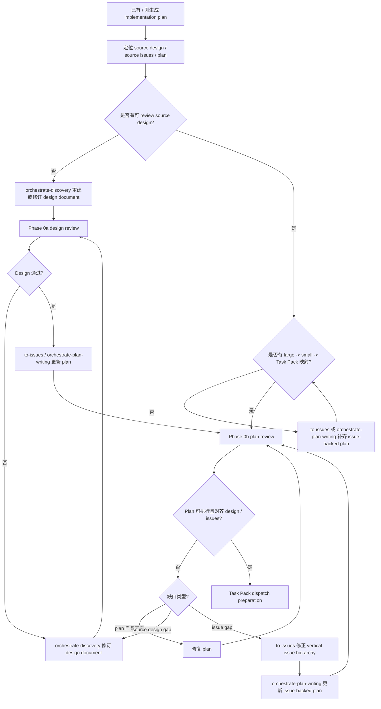

# Plan Review 合同

Phase 0b 审 issue-backed implementation plan。目标是确认计划覆盖 source design / requirements 和 `to-issues` 产出的 source issues，且 plan 中的 Task Pack inventory 可以直接进入 Orchestrate dispatch。Plan Review 必须同时读取 source design / requirements、source issues 和 plan；如果只有 plan，没有 source intent 或 issue source，返回 `NEEDS_DISCOVERY` 或 `NEEDS_ISSUES`，由主线程补齐 source design / issue source 后再审。

## 入口流程图



Phase 0b 最多 2 轮修复。仍有 invalid pack、design-plan mismatch、issue-plan mismatch、虚构路径、缺验证或缺 anchors 时，不进入 Phase A。

## Plan 入口要求

进入 review 前，主线程必须确认 plan 包含：

- `Source design`；
- `Source issues`，且只包含用户明确提供或 Orchestrate parent 明确确认的 issue；
- `Execution owner: Orchestrate Workflow`；
- `Plan unit`；
- `Completion gate`；
- large issue -> Task Pack mapping；
- source issues 来自 `to-issues` 或等价垂直 issue workflow；
- GitHub Issues 项目中，small issue hierarchy 已先记录到 parent large issue 文档；未记录前不能作为正式 Task Pack 来源；
- 每个 Task Pack 的 issue source、goal behavior、owned files / responsibilities、read first、Contract anchors、Mockup anchors、acceptance criteria、verification commands、risk flags、AFK / HITL、dependencies、parallel safety、out of scope。

如果 plan 声明非 Orchestrate Workflow 的 execution owner，或添加额外 execution handoff，返回 `needs repair`，由主线程修 plan，不进入 Phase A。

如果 plan 声称 issue-backed，但缺少 vertical large issues 或 vertical small issues，返回 `needs context`，routing 指向 upstream `to-issues`。

## Task Pack Inventory 校验

Phase 0b 同时是 Task Pack inventory 的权威校验点。Task Pack 边界来自 `orchestrate-plan-writing` 生成的 issue-backed plan；Phase 0b 只验证和修复 invalid pack，不重新发明 pack 边界。

每个 Task Pack 必须同时满足：

- 对应一个已确认 vertical small issue，不能只是候选 slice。
- 是 vertical slice，完成后能 demo 或 independently verify。
- 有用户可见行为、公开接口行为或可检查系统效果。
- 有 owned files / responsibilities。
- 涉及 API / Pydantic / DB / JSON / sync / task payload / UI action / helper 时，有 Contract anchors：owner、provider、consumer、model、schema_version、registry / migration / catalog、repository / read model、verification。
- UI / UX pack 有 mockup anchors：路径、页面区域、viewport、states、interaction、visual verification。
- Bug / UI / UX feedback 的 desired behavior、role、state、copy、interaction 和 verification method 已由 source design / bug brief / domain alignment result 明确。
- 有 acceptance criteria、verification commands 或 manual gate、risk flags、AFK / HITL、dependencies、parallel safety、out of scope。
- 依赖关系是真阻塞，不是“可能有关”。

以下 pack 不进入 Phase A；主线程先修 plan：

- 按技术层横切：all tests、all schema、all templates、endpoint shell、implementation。
- 按前端 / 后端 / 测试分层，但完成后不能单独验证。
- UI / UX 工作只写“实现 mockup”，没有页面状态、交互、viewport 或视觉证据。
- 测试反馈或 UI / UX 反馈目标含混，需要 worker 自行决定 desired behavior、文案语义、视觉层级或交互意图。
- 没有 owned files / responsibilities、验证命令、Contract anchors 或 Mockup anchors。
- 多个 worker 会同时写同一文件、同一 migration、同一 shared contract。
- 同一 Pydantic model、DB column、JSON registry、capability、chargeable action、port / command catalog 被拆给多个 worker 并行。
- 只写“新增 helper / dict shape / schema”，没有 owner、consumer、正式 contract 和 public behavior verification。
- 需要产品、账号、真实环境、人工验收或权限决策，却标成 AFK。

分包修复规则：

- 触碰同一文件或同一合同的 tasks 放同一 pack，或明确串行依赖。
- migration、billing、auth、permissions、runtime、browser takeover、shared contract、release boundary 默认串行。
- 如果一个 pack 太大，按可验证行为重新交回 `to-issues` 拆 small issue；不要按文件层拆。
- UI / UX pack 按用户可见状态拆，例如 empty / loading / success / error / permission / responsive viewport；不要按 CSS / JS / template 横切。
- 如果一个 task 太小但共享上下文，和相邻 task 合并。

Pack Brief 必须来自 plan，不由 parent 临场重写。派发给 worker 时至少包含：

```text
Pack:
Issue:
Goal behavior:
Implementation tasks:
Owned files / responsibilities:
Read first:
Contract anchors:
Mockup anchors:
Acceptance criteria:
Verification commands:
Risk flags:
AFK / HITL:
Dependencies:
Parallel safety:
Out of scope:
Return contract:
```

不要只发 pack 标题。`Return contract` 必须自足，包含标准顶层 headings；worker-specific details 放在 `### Result`。

Durable handoff brief 只用于跨会话交接、导出为 issue 或留给以后 agent 处理。它写行为合同，不写“去某文件第 N 行改 X”：

```text
Current behavior:
Desired behavior:
Key interfaces:
Acceptance criteria:
Out of scope:
Risk flags:
AFK / HITL:
```

UI / UX durable brief 必须保留 mockup path、目标 viewport、关键 states 和允许偏差。如果 durable brief 来自 Discovery domain alignment、prototype 或 architecture review，写明 resolved context、prototype verdict 或 architecture finding。需要文件范围用于立即执行时，把它放在 Pack Brief 的 owned files 中，不放进 durable contract 的核心语义。

## 派发 1：Coverage And Task Quality

派 `code_reviewer`。

Prompt 必须包含：

- Scope：Source artifacts、Editable artifacts、Read-only context、Out of scope、Issue recording target。
- Read first：source design / requirements、source issues、plan、相关 UI / UX mockup、根 `AGENTS.md`、相关 `PROJECT.md` / `ENGINEERING-RULES.md` / SPEC / ADR / GUIDE。
- Project baseline：本计划必须承接的 design intent、issue acceptance、项目不变量、模块边界和验收门槛。
- Contract anchors：如果计划触碰 API / Pydantic / DB / JSON / sync / task payload / UI action / helper 边界，列出 owner、provider、consumer、model、schema_version、registry / migration / catalog、repository / read model 和验证方式。

检查：

- 逐条提取 source design / requirements 的 intent，确认每条 intent 至少有一个 large issue section 或 Task Pack 覆盖。
- 逐条提取 source issue acceptance criteria，确认每条 criteria 进入 Task Pack acceptance criteria，或有明确 out of scope 依据。
- large issue section 是否对应 vertical large issue；Task Pack 是否对应 vertical small issue。候选 small issue 不能进入 Phase A。
- 确认 plan 没有把 read-only context、未提及 issue 或 reviewer 顺手关联的文档纳入 Source issues / Task Pack。
- 如果有 UI / UX mockup，逐条提取可见页面状态、关键交互、viewport 和组件状态，确认每项至少有 Task Pack 和验收证据覆盖。
- 如果 source design / requirements 对 desired behavior、业务术语、UI target state、role、视觉层级、交互意图或验收口径含混，route 给 `orchestrate-discovery`；不要把含混点包装成 worker task。
- 找出计划做了但 design 或 issue 没要求的 scope creep。
- 每个 Task Pack 是否足够具体：改什么、在哪改、测试什么、预期什么结果。
- 计划是否存在过度设计：预建未来能力、过早抽象、大段实现代码、超出 issue 的 UI / registry / migration / message surface。
- 计划是否存在设计不足：缺 failure state、合同 owner / consumer、UI states、billing / permission / runtime anchors、pack-local verification。
- pack 内细 task 是否能在短反馈循环内完成；过大的 task 要拆。
- 依赖关系是否真实、是否有循环依赖。
- large issue / Task Pack 分组是否符合 source issue 边界、shared files、shared contracts、dependency order。
- API / Pydantic / DB / JSON / helper 任务是否按正式合同边界切分，而不是把 schema、tests、implementation 横切。
- 是否为每个高风险区域标出验证方式和人工 gate。

Critical：

- design intent 或 issue acceptance 无 Task Pack 覆盖。
- source intent / UI target state / business context 不清，却计划直接进入实现。
- Task Pack 描述无法执行，worker 必须自行决定目标行为。
- 依赖顺序错误会导致实现失败。
- plan 缺少 Task Pack inventory 或核心验证方式。
- plan 缺少 `to-issues` 产出的 small issue，却生成正式 Task Pack。
- UI / UX mockup 没有被转成 Task Pack、viewport 检查或 visual / DOM 验收。
- 合同边界任务没有 Contract anchors，worker 必须自创 dict / helper 才能执行。

## 派发 2：Compliance And Verification

派 `code_reviewer`；涉及 production-risk 时追加 `release_reviewer`。

`release_reviewer` 只补充审 migration order、deploy order、compatibility、rollback、manual production gate 和跨服务生产风险；不能替代 Coverage、Task Quality、Compliance 或 Reference Verification。

Prompt 必须包含：

- Scope：Source artifacts、Editable artifacts、Read-only context、Out of scope、Issue recording target。
- Read first：source design / requirements、source issues、plan、相关 UI / UX mockup、根 `AGENTS.md`、相关 `PROJECT.md` / `ENGINEERING-RULES.md` / SPEC / ADR / GUIDE、计划涉及目录的 `AGENTS.override.md` / `agents.overrides.md`。
- Project baseline：本计划涉及的项目规则、数据权威、contract wall、测试路由、迁移 / 发布 / 回滚约束。
- Contract anchors：本计划涉及的 API、Pydantic、DB、JSON、task、sync、catalog、capability、helper 边界。

逐条验真：

- 已有文件路径是否存在。
- mockup / screenshot / HTML prototype 路径是否存在，且计划引用的是当前版本。
- 已有函数、类、fixture、配置项、环境变量是否存在。
- 命令和脚本入口是否存在。
- 新建文件是否被明确标注为新建，不要误报不存在。
- 涉及目录如有 `AGENTS.override.md` / `agents.overrides.md`，是否安排同步更新。
- 数据库变更是否说明 migration tree。
- 新端口 / 命令 / 收费动作 / 合同字段 / capability 是否安排注册位置。
- Pydantic contract 是否安排 `schema_version`、`extra=forbid`、兼容策略和 consumer 同步。
- JSONB / SQLite JSON 是否安排 registry、validator 和 unknown-field 测试。
- 数据库字段是否安排 migration、repository 写入、read model、API / contract 同步和回归测试。
- public API / client / service 是否计划返回 typed contract，而不是把 `dict[str, Any]` 传给上游。
- helper 是否落到 domain service、repository、adapter 或 shared contract，而不是 route / host / page 临时层。

Critical：

- 引用不存在的路径、函数、类、fixture 或命令。
- 引用不存在或版本不明的 UI / UX mockup，却把它当作实现标准。
- 违反项目规则、不变量、权威源、模块边界。
- 计划允许 bare dict、route-local schema、临时 helper、silent unknown-field drop 或错误 migration tree 进入实现。
- 高风险变更没有迁移、兼容、回滚或人工验证任务。

## 派发 3：Independent Second Opinion

派独立 `code_reviewer`，不要给它前两份 review 的结论。目的不是重复检查，而是用新 framing 找遗漏。

Prompt 必须包含同一组 Read first 和 Project baseline，也就是 source design / requirements、source issues 与 plan，但不要包含前两份 review 的 finding。

检查：

- 是否有任务互相矛盾。
- 是否有隐含依赖没有标出。
- 是否有两个 Task Pack 会改同一文件或同一 contract surface，却被计划并行。
- 是否有 risky assumption，例如假设 API / data shape / fixture 存在。
- 是否有 risky assumption，例如假设 Pydantic contract、DB 字段、JSON registry、catalog、capability 或 helper 已存在。
- 是否有 “之后再切 Task Pack” 或 “最后统一验证” 的水平切片风险。
- 是否有把 UI / UX 主观反馈、业务含混点或 architecture seam 问题伪装成普通实现 task 的风险；主观反馈和业务含混点 route 给 `orchestrate-discovery`，architecture seam route 给 `improve-codebase-architecture`。

## Result Payload

```text
Review: 计划文档审查
Phase summary: 可执行 / 需修正
设计与 issue 覆盖:
Grep / rg 验真:
Task Pack inventory:
Critical:
Important:
低置信度观察:
```

Coordinator 派发必须包含标准顶层 return headings。本 payload 放在 `### Result` 下。顶层 `### Verdict` 只使用 `pass / blocked / needs repair / needs context`；“可执行 / 需修正”只作为 phase summary。每条 finding 必须使用统一 shape：severity、confidence、locator、evidence、impact、remediation、routing。Plan finding 必须说明是 plan 自身问题、design-plan mismatch、source design gap、issue-plan mismatch、context ambiguity，还是 architecture friction；source design gap 和 context ambiguity route 给 `orchestrate-discovery`，architecture friction route 给 upstream `improve-codebase-architecture`。

Phase 0 plan findings 返回 coordinator。主线程修 plan，不派 worker 写代码。
