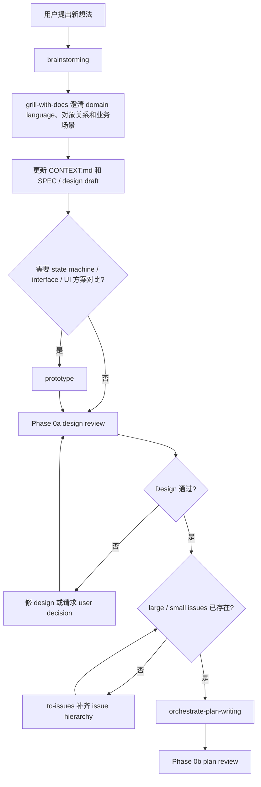
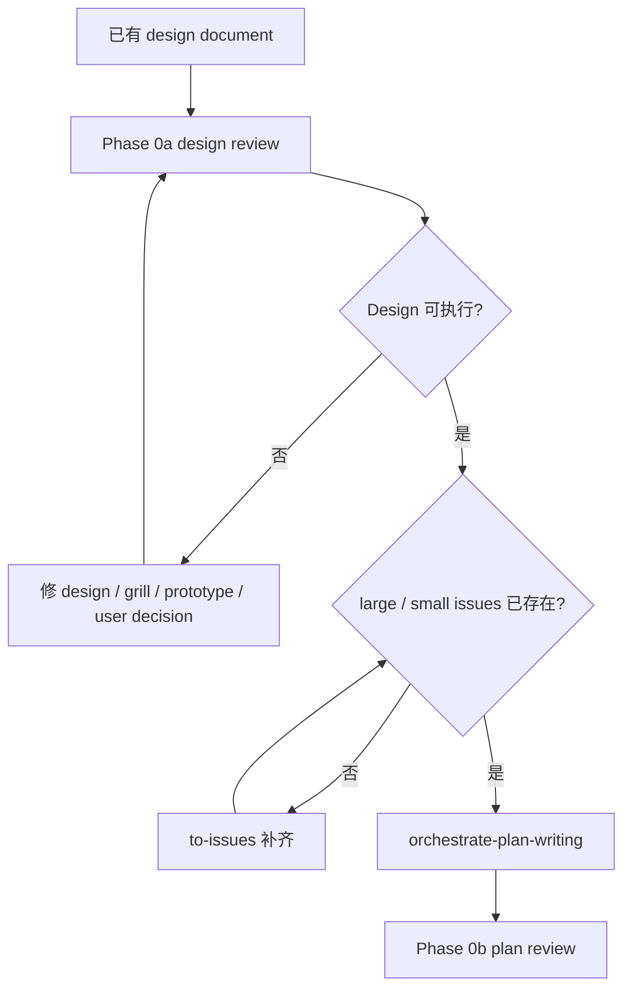
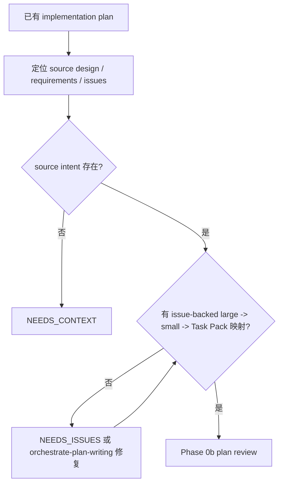
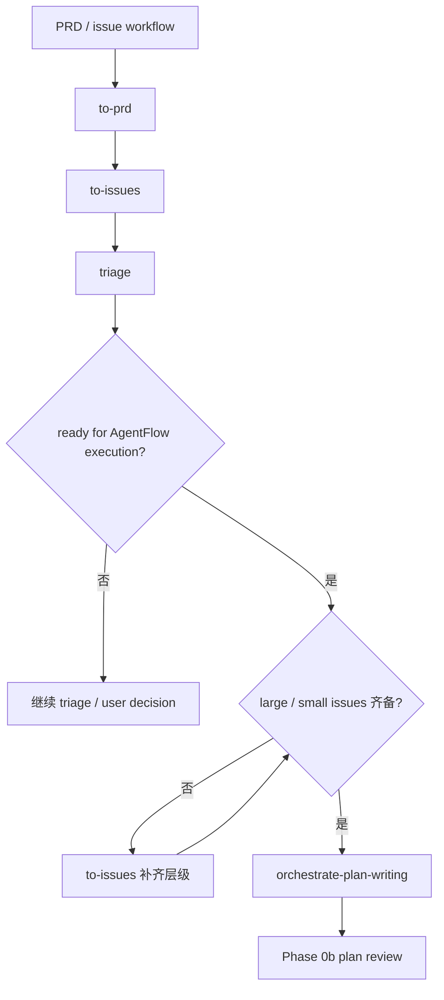

# Workflow Routing

本文件只在需要判断 Orchestrate 入口、生命周期或 upstream skill 路由时读取。

## Discovery Gate

用于新功能讨论、系统性 bug 复盘、系统性改造，或用户明确要求“讨论并沉淀上下文”的工作。

- 用 `superpowers:brainstorming` 做产品 / 方案探索，用 upstream `grill-with-docs` 约束领域语言。
- 一次只问一个问题；优先问能澄清业务意图、领域语言、对象关系、状态、边界和验收的问题。
- 如果代码或现有文档能回答问题，先检查代码 / 文档，只把剩余决策问用户。
- 对稳定术语、对象关系、角色、状态、反复出现的歧义，立即更新 `CONTEXT.md`。
- 对功能承诺、用户场景、系统行为、UI 状态、接口合同、验收标准、rollout 边界，立即更新 SPEC / design draft。
- 结束时必须产出 updated context、SPEC / design draft、open decisions、acceptance criteria、source requirements，然后进入 Phase 0a。

## Lifecycle Routes

### 新想法

### 已有设计文档

### 已有计划文档

### Issue Workflow

## Upstream Skill Routes

| 信号 | 先走 | 带回 |
| --- | --- | --- |
| bug / error / performance / wrong state | `diagnose` | feedback loop、symptom、hypotheses、bug brief、regression check |
| 系统性 bug / 改造需要新对象、状态、边界、目标方案 | `brainstorming` + `grill-with-docs` | updated `CONTEXT.md`、SPEC draft、source requirements、acceptance |
| desired behavior / term / owner / permission / billing / lifecycle 不清 | `grill-with-docs` | resolved terms、doc updates、acceptance |
| 主观 UI / UX 反馈，或 role / state / copy / hierarchy / interaction 不清 | `grill-with-docs` | target states、role、viewport、interaction、allowed deviations、visual verification |
| state machine / interface shape / UI direction 需要方案对比 | `prototype` | question、verdict、accepted decision、delete-or-absorb plan |
| bad seam / repeated repair / single-adapter interface / caller leaks implementation | `improve-codebase-architecture` | architecture finding、blocker status、seam / adapter / module direction |
| 陌生模块地图影响 pack 边界 | `zoom-out` | module map、callers、risk areas、anchors |
| durable backlog / 当前 run 无法关闭 | `triage` / `to-prd` / `to-issues` | issue / PRD / brief、labels、ready state、blocked reason |
| source design 已通过但缺少 vertical large / small issues | `to-issues` | large issues、small issues、AFK / HITL、blocked-by、acceptance |
| 新 feature 或 fix 进入实现 | `tdd` | public-behavior test slice、RED / GREEN evidence、refactor-after-GREEN |

## Feedback Route

反馈、截图、测试失败或人工验收进入代码前先分类：

- `implementation divergence`：实现偏离已批准 design / mockup / acceptance，进入 Phase A repair。
- `context ambiguity`：target state、role、copy、interaction、permission、billing、lifecycle 不清，走 `grill-with-docs`。
- `prototype question`：state machine、interface shape 或 UI 方向需要比较，走 `prototype`。
- `architecture friction`：bad seam、repeated repair、single-adapter interface，走 `improve-codebase-architecture`。
- `persistent issue`：需要跨会话跟踪，走 `triage` / `to-prd` / `to-issues`。

不能在没有 target state 和 verification 时，把主观反馈翻译成 worker patch。
