# Multi-Model Workflow

多模型工作流（Multi-Model Workflow，MMW）是一套面向软件开发 agent 团队的交付工作流。它把需求讨论、调查、设计、计划、实现、审查和集成连接起来，让一项工作可以跨 agent、跨会话、跨 worktree 持续推进。

MMW 的核心工作是管理上下文（context）。这里的上下文指 agent 当前能看到并据此判断的信息，包括用户目标、领域语言、源码、设计决定、任务边界和验收证据。MMW 会决定每个 agent 此刻应该看到什么、可以修改什么、完成后必须交回什么。

“多模型”表示同一组角色可以在不同宿主中映射到不同模型和思考档。Codex 版本完全使用 Codex 内置的 GPT 模型，不调用外部模型命令。每个角色仍然使用独立上下文和独立责任范围。

因此，MMW 主要解决四个问题：

- 新 agent 不熟悉项目，容易靠猜补齐业务含义。
- 长对话混入过时信息，容易让调查、实现和审查互相干扰。
- 多个可写 agent 同时工作，容易覆盖文件或基于不同版本修改。
- subagent 给出的结论缺少验证，容易把推测当成项目事实。

## 核心设计：让上下文可以交接

agent 不会自动继承另一个 agent 的理解。MMW 将需要长期保留的信息写入仓库和 GitHub，将一次执行需要的信息整理成明确的 task。新的 agent 即使从空白上下文开始，也能沿着路径找到所需材料。

对话只承载本轮讨论和推理。项目事实保存在领域文档、issue、spec、plan、ADR 和 Git 历史中。每个 agent 收到完成当前工作所需的最小材料，完成后再把经过验证的结果写回这些长期位置。

MMW 使用四层上下文。四层内容的生命周期不同。

| 上下文 | 回答的问题 | 保存位置 |
| --- | --- | --- |
| 领域上下文 | 这个项目中的概念是什么意思，谁拥有它，相关模块怎样协作 | `CONTEXT.md`，或 `CONTEXT-MAP.md` 与 `docs/context/` |
| 决策上下文 | 已经确认了什么，为什么这样决定，当前工作做到哪里 | ADR、issue、spec、plan、GitHub Wiki |
| 执行上下文 | 这一个 agent 要完成什么，需要读什么，不能越过什么边界 | 一份“目标、读、约束、验收”四栏 task |
| 证据上下文 | 一个结论或改动凭什么可信 | 源码位置、命令输出、测试结果、固定提交和审查记录 |

### 领域上下文让所有 agent 使用同一种语言

领域上下文保存项目特有的概念、推荐用词、需要避开的同义词和职责归属。它不保存操作步骤和临时调查结果。

小型仓库可以使用一份 `CONTEXT.md`。包含多个 bounded context 的仓库使用 `CONTEXT-MAP.md` 作为索引，再为每个业务范围建立一份 leaf。这里的 bounded context 指一套业务术语和职责保持一致的范围。Map 记录各个范围拥有的概念、职责和相互关系。

MMW 会在每个 agent 开工前判断应该读取单份领域文档，还是先读 Map 再选择本次相关的 leaf。任务进入另一个 bounded context 时，agent 会重新选择并读取相应文档。这样可以提供足够的业务含义，同时避免把整套项目资料塞进每一次对话。

长期形成的新术语和关系会回写到拥有它们的 leaf。难以回退的架构决定进入 ADR。用户说法、领域文档、ADR 和代码现状发生冲突时，agent 必须列出冲突并交给用户决定。

### 四栏 task 为一次执行裁剪上下文

主 agent 派发任务时，不会把整段聊天复制给 subagent。它会写一份四栏 task：

| 栏 | 含义 |
| --- | --- |
| 目标 | 这一次只需要回答或完成什么 |
| 读 | 必须打开的源码、领域文档、issue、spec、plan 或方法论路径 |
| 约束 | 只读还是可写，可以改哪些文件，哪些决定已经确认 |
| 验收 | 需要交回的结果，以及判断完成的具体证据 |

“读”栏主要保存路径和 issue 编号。权威内容留在原处，后续 agent 每次都读取当前版本。这样可以避免同一段要求在 prompt、issue 和文档中出现多个副本。

subagent 不继承上一轮上下文。返工、复审和下一张 ticket 都会收到一份新的四栏 task。如果材料不足，它必须返回 `needs-context` 并说明缺少什么，不能自行猜测。

例如，一个 `worker` 可以收到这样的执行上下文：目标是完成退款 ticket；“读”栏指向退款 spec、当前 ticket、对应 plan 和 `TESTING.md`；约束是只改源码与测试；验收是 ticket 中的可观察行为和测试 seam。`worker` 不需要读取需求讨论的完整聊天记录。

### 独立上下文减少角色之间的干扰

调查者只收一个可验证的问题。`worker` 只收一张 ticket。审查者只收一个审查视角和该视角需要的材料。

审查者使用干净上下文。产物作者不会在自己的上下文中审查自己的结果。对照终审可以读取 spec 和 plan；独立终审只看代码差异。MMW 通过控制材料范围，让两个视角回答不同的问题。

### 主 agent 负责把结果写回长期上下文

subagent 报告只提供候选结论。主 agent 会打开报告给出的源码位置或一手资料，并验证关键断言。验证通过的事实才会进入 spec、plan、领域文档或用户结论。

可写任务完成后，主 agent 还会验证结果分支、HEAD、基点和实际差异。验收通过后，结果才会进入当前任务分支。聊天上下文即使结束，已经确认的状态仍保留在 issue、文档、提交和分支中。

## 其余设计机制

上下文交接之外，MMW 还使用四项机制保证工作流可以长期运行。

| 机制 | 作用 |
| --- | --- |
| 技能路由 | `mmw-start` 根据用户输入选择调查、需求收敛、原型、设计、实现或分诊路径。每个技能只看当前阶段，完成后明确移交下一步。 |
| 判断与动作分层 | `mmw/skills/` 负责判断和完成判据。`mmw/cli/` 负责 Git、worktree、issue、领域文档、Wiki 和 release 等确定性动作。 |
| 写入隔离 | Codex 的调查、设计和审查使用原生 subagent。实现和原型使用独立后台 Worktree 任务及结果分支。 |
| 宿主物化 | `mmw/skills/` 只维护一套流程语义。物化器为 Codex App、Claude Code 和 Pi 生成各自的派发动作与 agent 配置。 |

`.mmw.json` 保存目标仓库自己的模型档、标签、目录和领域文档位置。技能通过 `mmw` 命令读取这些值，因此共享技能不需要写死某个项目或宿主的配置。

## 安装到 Codex

安装是一次性操作。使用者只需要授权 Codex 完成安装，不需要手动执行 MMW 的内部命令。

在任意 Codex 本地任务中发送下面的请求。把 `<本机目录>` 换成希望保存 MMW 源码的位置。

```text
请把 MMW 安装到当前 Codex。

源码仓库：https://github.com/chancheuklap/multi-model-workflow.git
源码位置：<本机目录>

请完成 Codex plugin、原生 subagent、mmw 命令和检索依赖的安装。
安装后按仓库规则完成运行时和依赖检查。
需要我登录 GitHub、确认权限或提供 Context7 密钥时再停下来问我。
最后说明安装了什么、检查是否通过、哪些能力仍不可用。
```

Codex 会负责克隆仓库、安装 plugin、安装四个原生 subagent、配置 `mmw` 命令，并检查 Serena、Graphify 和 Context7。GitHub 登录需要浏览器确认时，Codex 会暂停并提示使用者完成登录。

安装会修改 Codex 的全局 plugin 状态、`~/.codex/agents/` 和 `~/.local/bin/`。这些位置不属于目标项目。安装完成后，新建一个 Codex 任务，让新任务加载 MMW。

## 初始化目标仓库

在 Codex App 中打开目标仓库，然后向 Codex 发送：

```text
请使用 MMW 初始化当前仓库。

开始前检查初始化涉及的文件是否有未提交改动。
完成项目配置、领域上下文读取规则、测试说明骨架和 GitHub 标签初始化。
初始化后完成项目环境检查，并向我说明改了什么、创建了哪个提交、哪些检查没有通过。
这一步不要替项目创建领域模型。
```

Codex 会完成初始化和检查。使用者不需要打开终端，也不需要手动执行 MMW 命令。

### 初始化会改变什么

| 结果 | 说明 |
| --- | --- |
| `.mmw.json` | 生成项目配置；已有文件不会被覆盖 |
| `AGENTS.md` | 同步“开工前怎样选择领域上下文”的受管规则块 |
| `TESTING.md` | 仓库没有该文件时，生成待补充的测试说明骨架 |
| `.gitignore` | 加入审查、发布和结构图谱等本地派生目录 |
| GitHub 标签 | `gh` 已安装并登录时，创建缺失的工作流标签 |
| Codex 运行时 | 同步原生 subagent、`mmw` 命令和旧 bridge 清理状态 |

初始化是幂等操作。如果本轮修改了仓库配置，MMW 会创建一个 `chore(mmw): 配置多模型工作流` 提交。初始化器只提交自己修改的配置路径。

### 配置项目的领域上下文

初始化只建立领域上下文的读取合同，不会替项目编造业务模型。仓库还没有领域文档时，MMW 会正常继续工作。

当项目已经有稳定的业务术语时，可以在 Codex 中输入：

```text
使用 MMW 为这个仓库建立领域上下文。先和我确认 bounded context 的数量和边界。
```

Codex 会和使用者确认 bounded context 的数量和边界。单一业务范围默认使用 `CONTEXT.md`。多个业务范围默认使用 `CONTEXT-MAP.md` 和 `docs/context/`。ADR 默认放入 `docs/adr/`。

需要调整角色模型、GitHub 标签或文档目录时，直接告诉 Codex 目标配置。Codex 会修改 `.mmw.json` 并同步受管规则。

### 验证初始化结果

Codex 会检查项目配置、领域上下文合同、GitHub 鉴权、Codex 运行时和三个检索服务，并把检查结果翻译成可执行的结论。使用者只处理需要本人完成的登录和产品决定。

## 在 Codex 中使用

### 开始一项新工作

1. 在 Codex App 中打开已经初始化的目标仓库。
2. 从正确的父分支创建 Worktree 任务。
3. 在新任务中写明目标，并要求使用 MMW。

例如：

```text
使用 MMW 开始这项开发任务：为订单导出增加按日期筛选，并补齐测试和文档。
```

也可以直接交给 MMW 一张 issue：

```text
使用 MMW 处理 issue #123。
```

主 agent 会先读取相关领域上下文，再判断任务应进入调查、需求收敛、原型、计划、实现或分诊路径。Codex App 负责创建任务 worktree，MMW 将它绑定到 `codex/<slug>` 分支。

用户主要负责确认产品方向、难以回退的架构决定和对外发布。主 agent 负责裁剪每份 task 的上下文、派发角色、验证报告、验收结果分支和推进后续阶段。用户不需要手动选择 `worker` 或审查者。

MMW 会自行检查任务状态并绑定分支。绑定失败时，Codex 会说明原因和需要使用者处理的事项。使用者不需要运行状态命令。

### 一项工作经过哪些阶段

以一个新功能为例，MMW 会按需要完成以下工作：

1. 读取相关领域上下文，确认用户目标和当前项目语言。
2. 调查未知事实，或通过对谈和原型消除未决问题。
3. 将已确认需求写入 spec，再拆成可以独立验收的 ticket 和 plan。
4. 为每张 ticket 创建新的执行上下文，并交给独立 Worktree 任务实现。
5. 主 agent 验收结果，再让干净上下文中的审查者从不同视角检查。
6. 将验证通过的代码、决定和领域知识写回各自的长期位置。

简单任务会跳过不需要的阶段。具体路由、人工审批关卡、返工路线和 Codex Worktree 边界请看下面两张图。

## 通过两张图理解完整工作流

GitHub README 会显示两张可点击的 SVG 预览。点击图片或“打开全尺寸图”后，浏览器可以缩放查看。需要搜索节点或连续平移时，克隆仓库并直接打开交互式 HTML。

### MMW 完整工作流

[](docs/assets/mmw-workflow-overview.svg)

[打开全尺寸图](docs/assets/mmw-workflow-overview.svg)

### `mmw-wayfinder` 工作流

[](docs/assets/mmw-wayfinder-workflow.svg)

[打开全尺寸图](docs/assets/mmw-wayfinder-workflow.svg)

交互式版本：[`mmw-skill-map.html`](mmw-skill-map.html)
