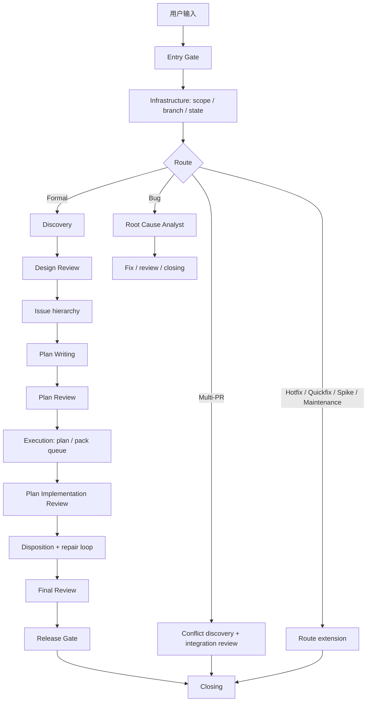

# Codex Orchestrate 架构文档

> 审计基准：`plugin/` 是 Claude Code 蓝本，`codex-orchestrate/` 是 Codex 原子级复刻源码。本文只描述 Codex 侧当前实现，不引用旧 `codex/` 运行时。
> 日期：2026-05-24。

## 1. 总体目标

Codex Orchestrate 的目标不是重新设计一套轻量 workflow，而是把 `plugin/` 中已经存在的编排能力按行为单元迁移到 Codex：

- 六个 phase skill：workflow、discovery、plan-writing、execution、final-review、multi-pr-merge；
- ad-hoc `codex-review` skill；
- 七类 custom subagent：普通 worker、高风险 worker、plan writer、root cause analyst、普通 explorer、高级 explorer、docs worker；
- hook gate：dispatch、review、budget、state、commit、push、doc edit；
- 状态系统：workflow state、execution state、dispatch envelope、pack return、review result；
- build/template 系统：统一注入 review、resume、state、voice、trust-boundary 等重复合同；
- installer：安装到 Codex user-level runtime，并做 source/cache/agent parity。

## 2. 全局流程



七条 route 都来自 Claude plugin：

| Route | Codex 行为 |
| --- | --- |
| Formal Orchestrate | Discovery → Design Review → Plan Writing → Plan Review → Execution → Final Review → Closing |
| Bug Investigation | root_cause_analyst 建立根因证据；简单修复进入 code review；深层系统问题回 Formal |
| Multi-PR Merge | PR inventory → conflict discovery → repair → integration review → dependency-ordered merge |
| Hotfix | 跳过完整计划，记录 post-push review 责任，事后必须 review |
| Quick Fix | 单 pack、单 review，不允许把复杂问题伪装成 quick fix |
| Spike | 产出 verdict / learning，不把 throwaway code 当生产交付 |
| Maintenance | 依赖、配置、文档、机械重构；review 聚焦回归和兼容 |

## 3. Source / Runtime 边界

| 层级 | 路径 | 责任 |
| --- | --- | --- |
| Claude blueprint | `plugin/` | 行为蓝本，不作为 Codex runtime |
| Codex source | `codex-orchestrate/` | Codex 原生源码真相 |
| Codex plugin manifest | `codex-orchestrate/.codex-plugin/plugin.json` | 插件元数据和 skill 入口 |
| Codex hook manifest | `codex-orchestrate/hooks/hooks.json` | plugin hook manifest |
| Hook source | `codex-orchestrate/hooks/` | hook 脚本和 `hooks/hooks.json` |
| Agent source | `codex-orchestrate/agents/*.toml` | Codex custom agent 配置 |
| Runtime state | `.codex/multi-model-workflow/` | 每次运行的状态、prompt、result、return |
| Installed cache | `~/.codex/plugins/cache/multi-model-workflow/codex-orchestrate/3.6.1/` | Codex 实际加载的 plugin cache |
| Installed agents | `~/.codex/agents/*.toml` + `~/.codex/config.toml` `[agents.<name>]` | Codex 实际可调用的 agent templates 和 role registry |

旧 `codex/` 已归档到 `archive/2026-05-24-codex-pre-atomic/codex/`，只允许做历史对照，不允许作为当前行为来源。

## 4. Agent 映射

| Claude plugin role | Codex agent type | 模型 | reasoning | sandbox | 责任 |
| --- | --- | --- | --- | --- | --- |
| `pack-executor` | `pack_executor` | `gpt-5.3-codex` | `xhigh` | `workspace-write` | 普通 Task Pack 实现和 accepted finding 修复 |
| `complex-pack-executor` | `complex_pack_executor` | `gpt-5.5` | `high` | `workspace-write` | migration、billing、permission、runtime、shared contract 等高风险 pack |
| `plan-writer` | `plan_writer` | `gpt-5.5` | `xhigh` | `workspace-write` | reviewed design + issue hierarchy → implementation plan |
| `root-cause-analyst` | `root_cause_analyst` | `gpt-5.5` | `xhigh` | `workspace-write` | 未知根因、repair loop 截断、Multi-PR systemic conflict |
| `code-explorer` | `code_explorer` | `gpt-5.3-codex` | `xhigh` | `read-only` | 小范围代码调查 |
| `complex-code-explorer` | `complex_code_explorer` | `gpt-5.5` | `high` | `read-only` | 多模块调查和迁移链路调查 |
| `docs-worker` | `docs_worker` | `gpt-5.3-codex` | `xhigh` | `workspace-write` | 低风险文档整理和机械归纳 |

Review 不做成常驻 reviewer agent。baseline review 统一走 `scripts/review/review-lane.sh` 调用原生 `codex exec review --json`，这样文档 review 和代码 review 能按不同模型路由，并且能记录 Codex 返回的 `thread_id`。

## 5. Review 路由

| Review surface | Codex lane | 模型 | reasoning |
| --- | --- | --- | --- |
| Design Review | native `codex exec review` | `gpt-5.5` | `xhigh` |
| Plan Review | native `codex exec review` | `gpt-5.5` | `xhigh` |
| Issue hierarchy / PRD / 规则文档审查 | native `codex exec review` | `gpt-5.5` | `xhigh` |
| Pack / plan implementation review | native `codex exec review` | `gpt-5.4` | `xhigh` |
| Bug / direct repair / hotfix review | native `codex exec review` | `gpt-5.4` | `xhigh` |
| Final / integration / release-risk review | native `codex exec review` | `gpt-5.4` | `xhigh` |

Claude Review 不进入 Codex runtime；不存在 supplemental Claude lane。

`gpt-5.4-mini` 不进入任何正式 lane。

Review 五步协议：

1. 写 `.codex/multi-model-workflow/review-prompts/<gate>.md`，前置 `DISPATCH_ENVELOPE`。
2. 调用 `review-lane.sh submit --lane codex --review-kind document|code --prompt-file <path> --result-file <path>`。
3. 将 job id 写入 `.job-id`；job 文件保存 `thread_id`，作为 targeted re-review 的 session continuity 依据。
4. 调用 `review-lane.sh status --job-id <id> --wait --timeout-ms 600000`。
5. 调用 `review-lane.sh fetch --job-id <id>`，结果写入 review result。

Targeted re-review 必须带 `--resume`，并且必须有 accepted disposition、exception code 或 path-A escalation 记录。`review-lane.sh` 必须找到同一 `run_id` / `review_kind` 的 completed baseline Codex review `thread_id`，再通过 `codex exec resume <thread_id>` 执行；找不到 baseline thread 时不得降级为新 review。

## 6. Dispatch / Resume

Claude plugin 中的后台 agent 和消息恢复语义在 Codex 侧拆成两层：

| 行为 | Codex 复刻方案 |
| --- | --- |
| 首次派发 worker | Codex subagent 使用 `spawn_agent({ agent_type, message })`，prompt 前置 `DISPATCH_ENVELOPE`，并记录返回的 `agent_id` |
| 写代码 pack 执行 | Worker 直接在 Coordinator 分支上工作；Plan 串行，Pack 严格串行；`worker-active` marker 让 hook 阻止 worker 修改设计/计划文档 |
| 原 worker 修复 | 读取 `agent_id` 后使用 `send_input({ target, message })`；host 关闭时先 `resume_agent({ id })` 再 `send_input` |
| host 无法恢复原 worker | 必须记录 `exception_code`、原 Pack Brief、accepted findings、prior attempts，再 replacement dispatch |
| worker return | `pack-return-v1.json` 是事实源；`SubagentStop` 做状态同步和 next-step 提示 |

所有 worker dispatch prompt 必须自足，不能只写“按 Orchestrate 做”。

## 7. State Model

| 文件 | Owner | 内容 |
| --- | --- | --- |
| `workflow-state-<run_id>.json` | coordinator + `state.sh` | route、slug、cursor、budget、review dispositions、direction check、pending post-push review、path-A escalation、mutation log |
| `execution-state-<run_id>.json` | coordinator + execution hooks | plan queue、pack queue、pack status、agent id、commit sha、worker verdict、repair round、review verdict |
| `pack-returns/<run_id>/<pack_id>.json` | worker | branch、base/head sha、changed files、verification、open items、verdict |
| `review-results/<gate>.md` | review lane | review output、findings、confidence、bias indicators |

状态写入通过 `.codex/multi-model-workflow/<run_id>.lock` 串行化。

### Ruling 1

`workflow-state` 和 `execution-state` 分离。原因是 pack-level 状态会被 worker return、commit tracker、review tracker 并发写入；把这些写入合并进单一 state 会放大竞态。

### Ruling 2

Budget 在 plan count 明确后初始化，初始化后 `review_total` 和 `effort_total` 不可变。执行阶段发现 pack count 不一致时返回 plan revision，不静默改 budget。

### Ruling 3

Codex 侧 return handler 不能依赖自由文本解析作为唯一事实源。优先读取 `pack-return-v1.json`；hook payload 只做关联证据。缺 envelope 的历史 fixture 可以跳过，但正式 dispatch 必须由 gateway 阻断。

## 8. Hook Contract

| Hook | Codex event | 责任 |
| --- | --- | --- |
| `session-start.sh` | `SessionStart` | 注入 route、runtime path、review policy、compaction recovery |
| `bash-pretool-dispatcher.sh` | `PreToolUse:Bash` | 顺序执行 push guard、commit guard、review gate、dispatch command gate |
| `edit-pretool-dispatcher.sh` | `PreToolUse:apply_patch|Edit|Write` | doc edit guard |
| `subagent-start.sh` | `SubagentStart` | 注入 state context、memory hint、dispatch envelope expectation |
| `subagent-stop.sh` | `SubagentStop` | 读取 durable return，更新 execution state，输出 NEXT |
| `track-review-budget.sh` | `PostToolUse:Bash` | review result 获取后递增 review budget |
| `track-effort-budget.sh` | subagent dispatch / return payload | 按 agent role weight 递增 effort budget |
| `cleanup-before-push.sh` | publish / closing | closing 后清理 state，hotfix post-push review 除外 |

Hook manifest 只使用 `hooks/hooks.json`。根目录不维护重复 manifest，避免 source truth 分裂。

## 9. Build System

`build/` 保留 Claude plugin 的 template/resolver 架构，但 Codex resolver 输出 Codex 原生协议：

| Template | 输出 |
| --- | --- |
| `review-dispatch.md.tmpl` | `review-lane.sh` submit/status/fetch 五步协议 |
| `sendmessage-resume.md.tmpl` | `send_input` / `resume_agent` 恢复协议 |
| `state-write.md.tmpl` | `.codex/multi-model-workflow` state 写入 |
| `control-envelope.md.tmpl` | `DISPATCH_ENVELOPE` |
| `trust-boundary.md.tmpl` | untrusted diff / reviewer evidence 约束 |
| `voice-directive.md.tmpl` | coordinator / worker / reviewer 语气和禁词 |

`build.sh --check --plugin-dir codex-orchestrate` 必须能证明生成内容没有 drift。

## 10. Installer / Runtime Parity

安装命令：

```bash
bash codex-orchestrate/installers/install.sh --user --apply
```

安装后必须验证：

```bash
bash codex-orchestrate/installers/verify-runtime-parity.sh --user
diff -qr codex-orchestrate ~/.codex/plugins/cache/multi-model-workflow/codex-orchestrate/3.6.1
for f in codex-orchestrate/agents/*.toml; do
  diff -q "$f" "$HOME/.codex/agents/$(basename "$f")"
done
python3 codex-orchestrate/installers/sync-agent-config.py verify \
  --config-file "$HOME/.codex/config.toml" \
  --source-agents-dir codex-orchestrate/agents \
  --target-agents-dir "$HOME/.codex/agents"
```

合格状态是 source、plugin cache、custom agent TOML runtime、custom agent config registry 四者一致。

Cutover 还必须在新 Codex session 中 review/trust plugin hook definitions，并看到 `SessionStart` 注入 `codex-orchestrate` runtime active。没有这一步，hook source/cache parity 只证明文件正确，不证明 hook 已被 Codex 执行。

## 11. 禁止状态

- 插件 manifest 声明空的 app / MCP 占位结构。
- runtime 文件依赖旧 `codex/` 或旧 `.agents/skills/orchestrate-*`。
- review 存在 Claude supplemental lane。
- 文档 review 和代码 review 使用同一个模型策略。
- worker dispatch 缺 `DISPATCH_ENVELOPE`。
- repair finding 不 resume 原 worker，直接静默重派。
- 用 install success 代替 behavior audit。
