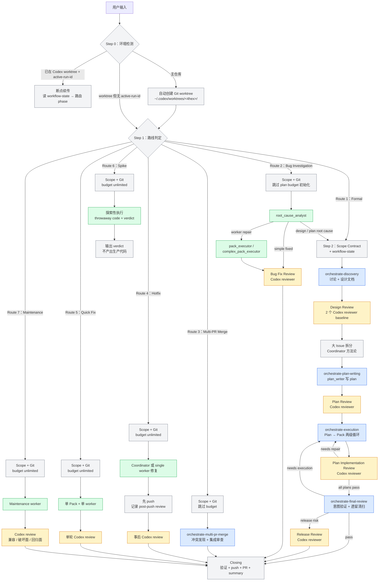
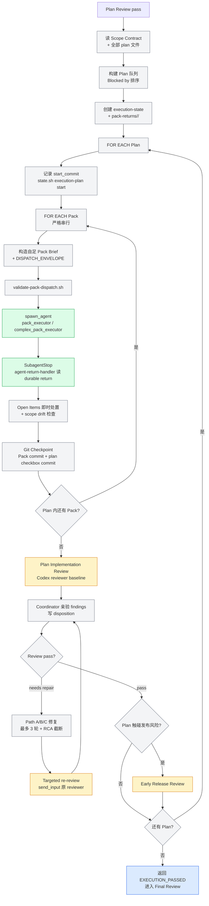
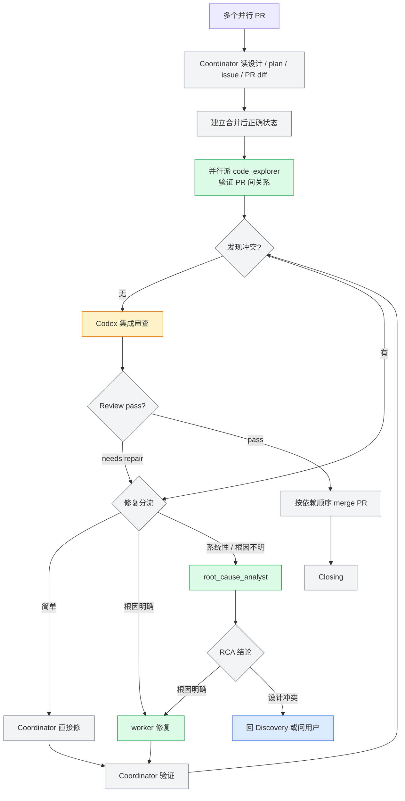
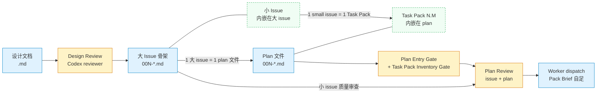

# Codex Orchestrate 架构文档（基于当前源码审计）

> **审计基准**：`codex-orchestrate/` 当前源码树（skills / agents / hooks / scripts / state-schema / build）。
> **审计日期**：2026-05-25。
> **Codex Plugin 版本**：3.6.2。
> **文档定位**：这是 Codex 原生复刻系统的架构权威文档，不是迁移日志，也不是旧机制清单。

`codex-orchestrate/` 的目标是把 `plugin/` 蓝本中的 workflow 合同保留下来，同时把运行机制替换为 Codex 原生能力：Codex plugin manifest、Codex skill、Codex TOML subagent、`spawn_agent` / `send_input` / `wait_agent`、Codex hook payload、`.codex/multi-model-workflow/` 状态目录，以及自动创建在 Codex 约定根目录下的 Git worktree。

---

## 图例

```
🟦 蓝色 = 内部 Skill（按需加载到主线程）
🟩 绿色 = Codex Subagent（独立子代理）
🟧 橙色 = Codex Reviewer（独立审查子代理）
🟪 紫色 = 外部 Skill（orchestrate 之外的独立技能）
⬜ 灰色 = Coordinator 自身逻辑（路线判定、工作树、状态、git、收尾）
🟥 红色 = 阻断 / 必须回流的问题
⬜ 虚线 = 可选路径或条件路径
```

---

## 图 1：全局流程（七条路线）



### 图 1 节点分析

| 节点 | 机制 | 做什么 | 产出 / 消费 | 状态 |
| --- | --- | --- | --- | --- |
| Environment Detection | `workflow-infrastructure.md` | 判断当前是主仓库、Codex worktree，还是断点续传 | 读 `.git` 形态和 `.codex/multi-model-workflow/active-run-id` | 正常 |
| Codex 目录下自动建 worktree | Coordinator + `git worktree add -b` | 主仓库启动时自动创建独立 Git worktree 并进入该目录 | `${CODEX_HOME:-$HOME/.codex}/worktrees/<4-hex-id>/<repo-name>`；主仓库分支不切走 | 正常 |
| Entry Gate | `orchestrate-workflow/SKILL.md` | 把输入分到 7 条路线 | 不写代码，只判定路线 | 正常 |
| Infrastructure | `workflow-infrastructure.md` | 写 Scope Contract、初始化 workflow-state、记录 active-run-id | `.codex/multi-model-workflow/scope-<run_id>.md`、`workflow-state-<run_id>.json` | 正常 |
| Discovery | `orchestrate-discovery` | 与用户讨论、维护 CONTEXT、写设计文档 | `docs/orchestrate/design/<slug>.md` | 正常 |
| Design Review | `codex_reviewer` subagent | 两个 baseline 审设计完整性和项目对齐 | `review-prompts/`、`review-agents/`、`review-results/` | 正常 |
| 大 Issue 拆分 | Coordinator 方法论 | 将设计拆成大 issue 骨架 | `docs/orchestrate/issues/<slug>/00N-*.md` | 正常 |
| Plan Writing | `plan_writer` subagent | 补小 issue 并写 implementation plan | `docs/orchestrate/plans/<slug>/00N-*.md` | 正常 |
| Plan Review | `codex_reviewer` subagent | 审 issue 质量、plan 质量、Task Pack inventory | `review-results/plan-review-*.md` | 正常 |
| Execution | `orchestrate-execution` | Plan → Pack 串行执行，worker 派发，commit，review，修复 | `execution-state-<run_id>.json`、pack commits | 正常 |
| Final Review | `orchestrate-final-review` | 验证整体意图覆盖、回归面、跨 plan 一致性和遗留尾巴 | final review results、release risk verdict | 正常 |
| Closing | `workflow-closing.md` | 最终验证、运行总结、push、PR、保留 Codex worktree | `run-summary-<run_id>.json`、PR | 正常 |

### Route 对比

| Route | 名称 | Discovery | Plan Writing | Plan Review | Execution | Final Review | Budget | 特殊行为 |
| --- | --- | --- | --- | --- | --- | --- | --- | --- |
| 1 | Formal Orchestrate | 是 | 是 | 是 | 是 | 是 | `3P+12` review + `2x` effort | 完整正式流程 |
| 2 | Bug Investigation | 否 | 否 | 否 | RCA / worker | 否 | 不初始化 plan budget | 根因不明先调查；设计级根因回流 Route 1 |
| 3 | Multi-PR Merge | 否 | 否 | 否 | 冲突修复 | 集成审查 | 不初始化 plan budget | 多 PR 冲突发现、修复、顺序合并 |
| 4 | Hotfix | 否 | 否 | 否 | 单修复 | 事后 review | unlimited | 可先 push，但必须记录 post-push review |
| 5 | Quick Fix | 否 | Coordinator 单 Pack | 否 | 单 worker | 单轮 review | unlimited | 不走三轮截断 |
| 6 | Spike | 否 | 否 | 否 | 探索性 | 否 | unlimited | throwaway code + verdict，不进入生产交付 |
| 7 | Maintenance | 否 | 否 | 否 | 是 | review 聚焦兼容 | unlimited | 依赖、配置、文档、结构性维护 |

Routes 4-7 的定义分布在两组 reference 中：

| 目录 | 责任 |
| --- | --- |
| `skills/orchestrate-workflow/references/route-extensions/` | 入口路由、phase 跳过、budget 策略 |
| `skills/orchestrate-execution/references/route-extensions/` | Pack 循环内的执行差异、commit 格式、review scope |

---

## Codex 工作树创建规则

Codex 版 workflow 必须自动创建工作树，不要求用户在 Codex App UI 中手动创建。创建位置固定在 Codex 本机约定根目录下；区别只在于目录 id 由 Coordinator 随机生成并避免碰撞。

| 规则 | 合同 |
| --- | --- |
| 目录权威 | `${CODEX_HOME:-$HOME/.codex}/worktrees/<4-hex-id>/<repo-name>` |
| 自动创建 | Coordinator 运行 `git worktree add -b "$BRANCH" "$WT_PATH" HEAD` |
| 禁止事项 | 不创建 `../worktrees`、`.worktrees`、`/tmp/<repo>`；不把 Codex workflow 状态写到自定义根目录 |
| 主仓库启动 | 自动生成 `<4-hex-id>` 和 `codex/<short-scope>` 分支名，在 Codex 根目录下创建 worktree，然后 `cd "$WT_PATH"` |
| 主仓库分支 | 禁止先在主仓库执行 `git switch -c` / `git checkout -b`；`git worktree add -b` 会在新 worktree 中创建并检出分支，主仓库当前分支不被切走 |
| 失败处理 | `git worktree add` 失败就报告真实错误并停止，不改用临时目录绕过 |
| 子代理 | worker 不再创建二级 worktree；所有 pack 在 Coordinator 当前工作分支串行执行 |
| 状态目录 | Scope、workflow-state、execution-state、pack-returns 都写在当前 Codex worktree 内的 `.codex/multi-model-workflow/` |

创建命令的规范形态：

```bash
CODEX_HOME="${CODEX_HOME:-$HOME/.codex}"
REPO_ROOT="$(git rev-parse --show-toplevel)"
REPO_NAME="$(basename "$REPO_ROOT")"
WT_ID="<random 4 hex, collision-checked>"
WT_PATH="$CODEX_HOME/worktrees/$WT_ID/$REPO_NAME"
BRANCH="codex/<short-scope>"

mkdir -p "$(dirname "$WT_PATH")"
git worktree add -b "$BRANCH" "$WT_PATH" HEAD
cd "$WT_PATH"
```

检测当前是否在 worktree 的方法仍然是 Git 事实：

```bash
[ -f "$(git rev-parse --show-toplevel)/.git" ] && echo "IN_WORKTREE" || echo "MAIN_REPO"
```

Codex worktree 中 `.git` 是文件，指向主仓库的 `.git/worktrees/`；主仓库 `.git` 是目录。这个检测只判断 Git 形态，不决定目录位置。

---

## 图 2：Execution 循环（两级：Plan → Pack）



### 图 2 节点分析

| 节点 | 机制 | 做什么 | 状态 / 文件 |
| --- | --- | --- | --- |
| 读 plan inventory | Coordinator | 从 `docs/orchestrate/plans/<slug>/` 汇总 pack、依赖、风险、合同锚点 | 只读 plan |
| 创建 execution-state | Coordinator | 初始化 Plan / Pack 状态 | `.codex/multi-model-workflow/execution-state-<run_id>.json` |
| 记录 start_commit | `state.sh execution-plan start` | 保存 Plan 代码 diff 起点 | execution-state |
| 构造 Pack Brief | Coordinator | 把 pack 任务完整嵌入 prompt，不让 worker 再读 plan | `worker-prompts/<pack-id>.md` |
| validate-pack-dispatch | 显式脚本 | 校验 envelope、budget、Direction Check、pack pending、agent_id、disposition refs | `scripts/validate-pack-dispatch.sh` |
| worker dispatch | `spawn_agent` | 派 `pack_executor` 或 `complex_pack_executor` | 返回 `agent_id` |
| record-pack-dispatch | 显式脚本 | 持久化 worker `agent_id` | execution-state |
| Durable return | worker 合同 | worker 写结构化结果 | `pack-returns/<run_id>/<pack-id>.json` |
| agent-return-handler | `SubagentStop` hook | 读取 durable return，标记 `returned`，输出 NEXT | execution-state |
| Git Checkpoint | Coordinator + hooks | pack commit、plan checkbox commit、状态更新 | `track-execution-state.sh` |
| Plan Implementation Review | `codex_reviewer` | 审该 Plan 所有 pack 的 aggregate diff | review prompt/result |
| Disposition | Coordinator | 每条 finding 亲验后写 `accepted` / `rejected` / `path-a` 等 | workflow-state |
| Repair loop | Coordinator + worker / explorer / RCA | 三路分流，最多 3 轮 | self-verification、review results |
| Release Gate | Codex reviewer | 触碰发布风险面时审 release risk | review results |

---

## 图 3：Multi-PR Merge 流程



### 图 3 节点分析

| 节点 | 机制 | 做什么 | 状态 |
| --- | --- | --- | --- |
| 全部文档读取 | Coordinator | 读大设计、大计划、issue、各 PR diff | 正常 |
| Explorer 并行验证 | `code_explorer` / `complex_code_explorer` | 找 PR 间代码、合同和意图冲突 | 正常 |
| RCA | `root_cause_analyst` | 系统性冲突根因调查 | capped |
| Integration Review | `codex_reviewer` | 合并前做跨 PR 集成审查 | 正常 |
| 顺序合并 | Coordinator | 按依赖顺序合并，不 squash | 正常 |

---

## 状态文件链

```text
Codex native worktree
  └─ .codex/multi-model-workflow/
      ├─ active-run-id
      ├─ scope-<run_id>.md                         ← Scope Contract
      ├─ workflow-state-<run_id>.json              ← route / cursor / budget / dispositions / mutations
      ├─ execution-state-<run_id>.json             ← plan / pack 状态、agent_id、commit_sha
      ├─ worker-prompts/<pack-id>.md               ← worker dispatch prompt
      ├─ pack-returns/<run_id>/<pack-id>.json      ← worker durable return
      ├─ review-prompts/<gate>.md                  ← Codex reviewer prompt
      ├─ review-agents/<gate>.agent-id             ← baseline reviewer agent_id
      ├─ review-results/<gate>.md                  ← reviewer final message
      ├─ run-summary-<run_id>.json                 ← closing 前生成的运行总结
      └─ agent-memory/<agent-name>/                ← agent 跨 session 经验
```

### 双文件状态模型

**[Ruling 2]** Codex 版保留 workflow-state + execution-state 双文件模型。

| 文件 | Owner | 内容 |
| --- | --- | --- |
| `workflow-state-<run_id>.json` | Coordinator + `scripts/state.sh` | route、cursor、budget、plan_count、review_dispositions、review_effectiveness、path_a_escalation、self_verifications、pending_direction_check、pending_post_push_reviews、execution_reflux_count、last_gate_phase、mutations |
| `execution-state-<run_id>.json` | Coordinator + dispatch/return/commit 脚本 | current_plan_id、plan status、start_commit、end_commit、pack status、agent_id、commit_sha、worker_verdict、repair_round |

分离原因：pack-level 状态会被 `agent-return-handler.sh`、`track-execution-state.sh`、dispatch 记录脚本写入；workflow-state 则承载预算、disposition 和 phase cursor。拆开能降低状态写入竞争，也让 review disposition 不被 pack-level 细节污染。

### 状态转换矩阵

`scripts/state.sh transition` 必须匹配 `state-schema/state-transition-matrix.md` 和脚本内置矩阵。当前关键转换：

| Actor | From | To | 触发 |
| --- | --- | --- | --- |
| Coordinator | workflow | discovery | 进入 Discovery |
| Coordinator | discovery | plan-writing | 设计和 issue 就绪 |
| Coordinator | plan-writing | execution | plan review 通过 |
| Coordinator | execution | final-review | 所有 plan 通过 implementation review |
| Coordinator | final-review | closed | final review / release gate 通过 |
| Coordinator | returned | repairing | accepted finding 进入修复 |
| agent-return-handler | dispatched | returned | worker durable return 被消费 |
| track-execution-state | returned | committed | pack commit 成功 |

---

## 文档产物链：`docs/orchestrate/`

状态文件跟踪 workflow 运行状态；文档产物跟踪功能本身的设计、拆分、计划和验证对象。它们是 phase 之间传递信息的正式合同，也是 Codex review 的审查对象。

### 目录结构与命名

```text
docs/orchestrate/
├── design/
│   └── <slug>.md
├── issues/
│   └── <slug>/
│       ├── 001-<large-issue-slug>.md
│       ├── 002-<large-issue-slug>.md
│       └── ...
├── plans/
│   └── <slug>/
│       ├── 001-<issue-slug>.md
│       ├── 002-<issue-slug>.md
│       └── ...
└── mockups/
    └── <slug>/
        ├── *.html / *.png / *.svg
        └── README.md
```

同一功能使用同一个 feature slug：`YYYY-MM-DD-<feature>`。slug 在 Infrastructure Setup 写入 Scope Contract 后不可中途改名。

### 图 4：文档产物流



### 四种文档产物

| 产物 | 产出者 | 消费者 | 门禁 |
| --- | --- | --- | --- |
| 设计文档 | `orchestrate-discovery` | issue splitting、plan_writer、reviewer | Design Review |
| 大 Issue 文件 | Coordinator | plan_writer | Plan Review 的 Issue Quality 角度 |
| Plan 文件 | plan_writer | orchestrate-execution | Plan Entry Gate + Task Pack Inventory Gate |
| Mockup | Discovery / prototype / frontend-design | plan_writer、worker、reviewer | Design Review + UI pack 验收 |

### 设计文档结构

```text
# <功能> 设计文档
├── 背景和问题
├── 目标结果
├── 用户场景
├── 方案设计
│   ├── 业务对象、角色和状态
│   └── 实现决策
├── 合同边界
├── 发布风险和人工门禁
├── 测试和验收
├── UI/UX 状态
├── 失败场景和异常处理
├── 不在本次范围
└── Open Decisions
```

硬规则：设计文档写业务合同和系统边界，不写 worker 指令，不写“见聊天记录”，不保留 TODO / TBD。

### Issue 文档结构

```text
# <大 Issue 标题>
├── What to build
├── Small issues
│   ├── Type: AFK / HITL
│   ├── What to build
│   ├── Acceptance criteria
│   └── Blocked by
└── Blocked by
```

大 issue = vertical slice = 一个文件；小 issue = 内嵌子节；小 issue 直接映射 Task Pack。

### Plan 文档结构

```text
# <Issue Title> Implementation Plan
├── Header
│   ├── Goal / Source design / Source issue / Execution owner / Blocked by
│   ├── Architecture / Tech stack / Quality gate
│   ├── File / Responsibility Map
│   └── 发布风险和人工门禁表
└── Task Pack 列表
    └── Task Pack N.M
        ├── Issue / Goal behavior
        ├── Owned files / responsibilities
        ├── Read first
        ├── Contract anchors / Mockup anchors
        ├── Acceptance criteria
        ├── Verification commands
        ├── Implementation tasks
        ├── Commit boundary
        ├── Risk flags
        ├── AFK / HITL
        ├── Dependencies
        └── Out of scope
```

Worker 不读 plan 文件。Coordinator 在 dispatch 前把当前 pack 的完整内容复制进 Pack Brief。

---

## 返回值路由表

### orchestrate-discovery → orchestrate-workflow

| 返回值 | Coordinator 动作 |
| --- | --- |
| `DISCOVERY_READY` | 检查 issue hierarchy；缺大 issue 时回到 Discovery 的 issue splitting |
| `DISCOVERY_NOT_NEEDED` | 已有足够清晰的 design，继续检查 issue hierarchy |
| `READY_FOR_REPAIR` | 进入 Direct Repair mini-route |
| `NEEDS_USER_DECISION` | 问用户一个业务决策，回答后回 Discovery |
| `BLOCKED` | 双层报告用户 |

### orchestrate-plan-writing → orchestrate-workflow

| 返回值 | Coordinator 动作 |
| --- | --- |
| `PLAN_CREATED` | 确认 budget 初始化后进入 execution |
| `NEEDS_DISCOVERY` | 回 Discovery |
| `NEEDS_DESIGN_REVIEW` | 回 Design Review |
| `NEEDS_ISSUES` / `NEEDS_ISSUE_SPLIT` | 大 issue 缺失回 issue splitting；小 issue 缺失由 plan_writer 修 |
| `NEEDS_TRIAGE` | 调 `triage` 后回 plan-writing |
| `NEEDS_DIAGNOSIS` | 调 `diagnose` 后回 plan-writing |
| `NEEDS_ARCHITECTURE` | 调 `improve-codebase-architecture` 后回 plan-writing |
| `NEEDS_CONTEXT` | 派 explorer 或调 `zoom-out`，补上下文后回 plan-writing |
| `NEEDS_DECISION` | 问用户一个业务决策 |
| `BLOCKED` | 双层报告用户 |

### orchestrate-execution → orchestrate-workflow

| 返回值 | Coordinator 动作 |
| --- | --- |
| `EXECUTION_PASSED` | 进入 final-review |
| `NEEDS_DISCOVERY` | 回 Discovery |
| `NEEDS_PLAN_REVISION` | 回 plan-writing |
| `NEEDS_ARCHITECTURE` | 架构判断后回 execution 或 plan-writing |
| `BLOCKED` | 双层报告用户 |

### orchestrate-final-review → orchestrate-workflow

| 返回值 | Coordinator 动作 |
| --- | --- |
| `FINAL_REVIEW_PASSED` | Closing |
| `FINAL_REVIEW_PASSED_WITH_RELEASE_RISK` | release review 已处理，进入 Closing |
| `NEEDS_EXECUTION` | 第 1 次回 execution；第 2 次 BLOCKED |
| `NEEDS_DISCOVERY` | 回 Discovery |
| `NEEDS_PLAN_REVISION` | 回 plan-writing |
| `BLOCKED` | 双层报告用户 |

### orchestrate-multi-pr-merge → orchestrate-workflow

| 返回值 | Coordinator 动作 |
| --- | --- |
| `MERGE_COMPLETE` | Closing |
| `NEEDS_DISCOVERY` | 设计 / 意图冲突，回 Discovery |
| `NEEDS_USER_DECISION` | 问用户 |
| `BLOCKED` | 双层报告用户 |

---

## 组件汇总

### 内部 Skill（6 个 workflow phase + 1 个 ad-hoc review）

| Skill | 对应节点 | 职责 |
| --- | --- | --- |
| `orchestrate-workflow` | Entry / Infrastructure / Route 2 / Route 3 / Closing | 环境检测、Codex worktree 迁移、路线判定、Scope Contract、状态初始化、bug route、多 PR route、closing |
| `orchestrate-discovery` | Discovery + Design Review + Issue splitting | 讨论、设计文档、CONTEXT 对齐、design review、大 issue 拆分 |
| `orchestrate-plan-writing` | Plan Writing + Plan Review | plan_writer 派发、小 issue 补全、plan 写作、plan review、budget 初始化 |
| `orchestrate-execution` | Execution | Plan → Pack 两级循环、worker dispatch、Git Checkpoint、Plan Implementation Review、repair、release gate |
| `orchestrate-final-review` | Final Review | 意图覆盖、回归、跨 plan 集成、代码级审查、遗留清扫、release gate |
| `orchestrate-multi-pr-merge` | Multi-PR Merge | 冲突发现、RCA、修复、Codex 集成审查、顺序合并 |
| `codex-review` | Ad-hoc review | 不进入 workflow state 的独立 Codex review lane |

### Codex Subagent（8 个 TOML agent）

| Agent | Model | Effort | Sandbox | 用途 |
| --- | --- | --- | --- | --- |
| `plan_writer` | `gpt-5.5` | `xhigh` | `workspace-write` | 从 reviewed design + issue hierarchy 写 plan |
| `pack_executor` | `gpt-5.3-codex` | `high` | `workspace-write` | 普通 Task Pack 执行和普通修复 |
| `complex_pack_executor` | `gpt-5.5` | `high` | `workspace-write` | 高风险 / 跨模块 / 账务 / 权限 / migration / runtime pack |
| `code_explorer` | `gpt-5.3-codex` | `high` | `read-only` | 小范围代码证据收集 |
| `complex_code_explorer` | `gpt-5.5` | `high` | `read-only` | 多模块或历史行为调查 |
| `root_cause_analyst` | `gpt-5.5` | `xhigh` | `workspace-write` | bug 根因、repair loop 截断、PR 冲突根因 |
| `docs_worker` | `gpt-5.3-codex` | `high` | `workspace-write` | 低风险文档整理 |
| `codex_reviewer` | `gpt-5.5` | `xhigh` | `read-only` | 独立审查设计、plan、代码、release risk、ad-hoc 输入 |

Agent 行为权威是 `agents/*.toml` 的 `developer_instructions`。`agents/persona.md` 是共享 voice/persona 参考，不是 agent 注册文件。

### Hooks（5 类事件 / 8 个 command handler）

| 事件 | Matcher | Handler | 责任 |
| --- | --- | --- | --- |
| `SessionStart` | `startup|resume|clear|compact` | `hooks/session-start.sh` | 注入 workflow override、暴露 `MMW_PLUGIN_ROOT`、提示路由规则 |
| `PreToolUse` | `Bash` | `scripts/guard-premature-push.sh` | 阻止未完成时 push / PR，阻止 squash merge |
| `PreToolUse` | `Bash` | `hooks/enforce-pack-commit.sh` | 校验 Pack commit message |
| `PreToolUse` | `Edit|Write|apply_patch` | `hooks/guard-doc-edit.sh` | 阻止 worker 修改 protected docs |
| `PostToolUse` | `Bash` | `hooks/track-execution-state.sh` | Pack commit 后更新 execution-state |
| `PostToolUse` | `Bash` | `scripts/cleanup-before-push.sh` | publish 成功后清理 workflow 状态；hotfix 可延迟 |
| `SubagentStart` | 所有 subagent | `hooks/track-effort-budget.sh` | 按 agent type 加权统计 effort budget |
| `SubagentStop` | 所有 subagent | `hooks/agent-return-handler.sh` | worker 返回后读 durable return，更新 execution-state，输出 NEXT |

### 显式 Coordinator Gate（不是 hooks）

| 脚本 | 调用时机 | 为什么不放 hook |
| --- | --- | --- |
| `scripts/validate-review-dispatch.sh` | `spawn_agent` / `send_input` Codex reviewer 前 | Codex `SubagentStart` payload 不携带完整 prompt，不能在 hook 中解析 envelope |
| `scripts/validate-pack-dispatch.sh` | `spawn_agent` worker 前 | 需要读取完整 Pack Brief、workflow-state、execution-state、disposition refs |
| `scripts/record-pack-dispatch.sh` | `spawn_agent` worker 返回后 | 需要真实返回的 `agent_id`，hook 不拥有这个上下文 |

### 外部 Skill

| Skill | 用在哪 | 产出 |
| --- | --- | --- |
| `grill-with-docs` | Discovery / domain conflict | CONTEXT 更新、术语校准、设计修正 |
| `prototype` | Discovery / spike / 技术验证 | throwaway prototype + verdict |
| `improve-codebase-architecture` | 架构摩擦、模块边界、合同拆分 | 架构分析和文档回写 |
| `zoom-out` | 模块地图、调用链不足 | 代码地图和上下文补充 |
| `triage` | issue ready state、优先级 | issue 分类和下一步 |
| `diagnose` | bug 复现、假设验证 | 根因调查和修复建议 |
| `frontend-design` | UI/UX discovery | mockup / prototype 视觉产物 |

---

## Review 派发机制

Codex 版不使用外部 `codex-companion.mjs` 或 job-id polling。所有 review 通过原生 `codex_reviewer` subagent 完成。

### Baseline review

```text
1. Coordinator 写 prompt:
   .codex/multi-model-workflow/review-prompts/<gate>.md
   prompt 以 DISPATCH_ENVELOPE 开头，agent_role = "codex_reviewer"，review_intent = "baseline"

2. Coordinator 显式校验:
   bash "${MMW_PLUGIN_ROOT}/scripts/validate-review-dispatch.sh" \
     --prompt-file ".codex/multi-model-workflow/review-prompts/<gate>.md" \
     --transport spawn_agent

3. Coordinator 派 reviewer:
   spawn_agent({ agent_type: "codex_reviewer", message: "<prompt>", model: "<phase model>", reasoning_effort: "xhigh" })

4. Coordinator 持久化 agent_id:
   .codex/multi-model-workflow/review-agents/<gate>.agent-id

5. Coordinator 等待:
   wait_agent({ targets: ["<agent_id>"], timeout_ms: 600000 })

6. Coordinator 保存结果:
   .codex/multi-model-workflow/review-results/<gate>.md

7. Coordinator 递增 review budget:
   bash "${MMW_PLUGIN_ROOT}/scripts/state.sh" budget increment-review --run-id "<run_id>"
```

### Targeted re-review

```text
1. 读取 baseline reviewer agent_id
2. 写 targeted prompt，review_intent = "targeted-re-review"，exception_code 非空，agent_id = baseline reviewer
3. validate-review-dispatch.sh --transport send_input
4. send_input({ target: "<baseline reviewer agent_id>", message: "<targeted prompt>" })
5. wait_agent(...)
6. 写 review-results/<gate>-repair-<round>.md
7. budget increment-review
```

### Review intent 规则

| Intent | Transport | 必填 |
| --- | --- | --- |
| `baseline` | `spawn_agent` | `agent_role = codex_reviewer` |
| `targeted-re-review` | `send_input` | baseline `agent_id`、`exception_code`、repair context |

### Disposition 表（全 phase 通用）

Coordinator 必须亲验每条 finding。Codex reviewer 只提供独立判断，不能直接决定代码是否修。

| Disposition | 行为 |
| --- | --- |
| `accepted` | finding 被证据确认，进入修复；必须有 evidence |
| `rejected` | finding 被证据反驳 |
| `suppress` | 低 confidence 或已知噪声，不进入修复 |
| `path-a` | Coordinator 直接修复，之后强制 targeted re-review |
| `path-b` | worker 修复，优先 `send_input` 原 worker |
| `needs-evidence` | 派 explorer 或补证后再 disposition |
| `duplicate` | 被另一条 finding 覆盖 |
| `out-of-scope` | 开外部 issue 或 durable handoff |
| `needs-evaluation` | Coordinator 继续判断 |
| `user-decision` | 需要用户业务决策 |

Confidence 分层：

| Confidence | 默认处理 |
| --- | --- |
| 1-3 | suppress，除非 Coordinator 独立验证事实成立 |
| 4-6 | 补证后再 accept / reject |
| 7-10 | 默认深入验证，事实成立则 accept |

---

## 修复截断规则

所有 review repair loop 共用同一截断模式：

```text
Round 1-2:
  Path A — Coordinator 直接修复（confidence >= 7，范围小）
           修复后 targeted re-review
           Codex 仍 needs repair → blocked_for_self_fix = true → 必须升级 Path B
  Path B — worker 修复（send_input 原 worker；没有 agent_id 时 BLOCKED）
  Path C — code_explorer / complex_code_explorer 补证
  → targeted re-review

Round 3:
  停止普通修复循环 → root_cause_analyst
  RCA fixed → targeted re-review
  RCA root cause found not fixed → worker 按 RCA 结论修
  RCA root cause in design/plan → 回流 Discovery / Plan Writing
  unable to reproduce → 外部 issue / durable handoff
  unable to determine → BLOCKED

Round 3 re-review 仍 needs repair → BLOCKED
```

Final Review → Execution 回流由 `execution_reflux_count` 限制：允许 1 次；第 2 次必须 BLOCKED。

---

## Budget 预算分配

### 双预算系统

| 预算 | 公式 | 递增位置 | 计量单位 |
| --- | --- | --- | --- |
| Review Budget | `review_total = 3P + 12` | Coordinator 在 `wait_agent` 后调用 `state.sh budget increment-review` | Codex review dispatch 次数 |
| Effort Budget | `effort_total = review_total * 2` | `track-effort-budget.sh` SubagentStart hook | 加权 subagent dispatch 次数 |

P = plan 文件数量。Formal route 在 plan-writing 确认 plan count 后初始化；Routes 4-7 使用 `unlimited`。

### Effort 权重

| Agent | 权重 |
| --- | --- |
| `pack_executor` / `complex_pack_executor` | +1 |
| `code_explorer` / `complex_code_explorer` | +1 |
| `root_cause_analyst` | +2 |

### 耗尽行为

| 阈值 | 行为 |
| --- | --- |
| `used >= 80%` | Direction Check：提示进度、剩余 pack、finding 密度和风险 |
| 下一次 dispatch 会超过 total | 停止 dispatch，请用户授权追加预算或缩小范围 |
| `used >= total` | 硬停，报告 BUDGET EXHAUSTED |

Budget 不因 phase 回流重置。Plan revision 改变 plan count 时必须回到 plan-writing 重新初始化，而不是在 execution 静默修改。

---

## Scope Contract 完整字段

```markdown
# Scope Contract: <run_id>

## Feature slug
YYYY-MM-DD-<feature>

## Source artifacts
- <用户明确提供的设计 / issue / PR / diff / 文档>

## Editable artifacts
- Design: docs/orchestrate/design/<slug>.md
- Plans: docs/orchestrate/plans/<slug>/
- Issues: docs/orchestrate/issues/<slug>/
- Mockups: docs/orchestrate/mockups/<slug>/（UI/UX 时）

## Read-only context
- <相关 ADR / 代码 / runbook / issue，只读用于判断>

## Out of scope
- <容易被 reviewer 或 worker 误纳入的相关能力>
```

Editable artifacts 是授权写入边界；Read-only context 是判断材料；Out of scope 用于防止 scope creep。

---

## 跨会话恢复

恢复不是简单从上次行号继续，而是读取状态并重新验证 source artifacts。

```bash
RUN_ID=$(cat .codex/multi-model-workflow/active-run-id)
SLUG=$(grep -A1 '^## Feature slug' ".codex/multi-model-workflow/scope-${RUN_ID}.md" | tail -1 | xargs)

git log --oneline --since="<last_gate_timestamp>" -- \
  "docs/orchestrate/design/${SLUG}.md" \
  "docs/orchestrate/plans/${SLUG}/" \
  "docs/orchestrate/issues/${SLUG}/"
```

| 条件 | 恢复动作 |
| --- | --- |
| design 在 Design Review 后变更 | 重新 Design Review |
| plan 在 Plan Review 后变更 | 重新 Plan Review |
| execution-state 有部分 pack | 按 pack status 跳过已完成项，从当前 plan/pack 继续 |
| baseline reviewer `.agent-id` 存在但无 result | `wait_agent` 等待原 reviewer |
| targeted re-review 缺 baseline `.agent-id` | BLOCKED，不创建新的 reviewer 伪装续审 |
| Final Review 已通过 | Closing |

`cursor.phase`、`cursor.reference`、`cursor.step` 服务 compaction recovery；`last_gate_phase` 和 `last_gate_timestamp` 服务 source stability。

---

## Bug Seed File 与设计级回流

`root_cause_analyst` 如果判定根因在设计或 plan，不直接让 worker 修。流程：

1. 写 `.codex/multi-model-workflow/bug-seed-<run_id>.md`
2. 把原始 bug、复现、排除假设、RCA 结论、受影响对象写成结构化输入
3. Scope Contract 将 bug seed 加入 Source artifacts
4. 回 Route 1 Discovery 或 Plan Writing

这样 bug 不是临时补丁，而是进入正式设计 / plan 合同。

---

## 架构约束

- **Codex 根目录 worktree**：Coordinator 自动运行 `git worktree add -b`，但路径只能落在 `${CODEX_HOME:-$HOME/.codex}/worktrees/<4-hex-id>/<repo-name>`。
- **渐进加载**：SKILL.md 只做路由和骨架；reference 到步骤时再读。
- **Prompt 自足**：subagent 不继承 Coordinator 上下文；dispatch prompt 必须带完整任务、验收、命令和边界。
- **Reviewer 独立**：`codex_reviewer` 是一等 subagent；Coordinator 亲验后才 disposition。
- **Prompt-sensitive gate 显式调用**：需要完整 prompt 的校验必须在 `spawn_agent` / `send_input` 前由脚本执行，不放进 SubagentStart hook。
- **Worker 串行同分支**：worker 直接在 Coordinator 当前工作分支上修改；不创建二级 worktree。
- **Worker docs 写保护**：`guard-doc-edit.sh` 阻止 worker 修改 protected docs。
- **状态写入加锁**：状态脚本使用 `scripts/lib/state-lock.sh`，tmp → rename 原子写。
- **Disposition evidence 强制**：`accepted` 没有 evidence 会被 `state.sh` 拒绝。
- **Dispatch 幂等性**：每次 dispatch 有 `idempotency_key`，重复 dispatch 被阻断。
- **Agent ID 持久化**：worker repair 和 reviewer targeted re-review 都依赖原始 `agent_id`；丢失则 BLOCKED。
- **修复三轮封顶**：普通 repair 最多两轮，第三轮 RCA，仍失败则 BLOCKED。
- **Final Review 回流守卫**：Final Review 回 execution 最多一次。
- **Git 纪律**：禁止 squash merge；未完成 workflow 阻止 publish。
- **无兼容 fallback**：不恢复旧 state path、旧 companion runner、旧 tool-name label 或双 host 入口。

---

## 设计决策

- Codex 复刻保留 `plugin/` 的 phase、route、budget、review、repair、state 合同。
- Codex review 从外部脚本 runner 改成原生 `codex_reviewer` subagent。
- `validate-review-dispatch.sh` / `validate-pack-dispatch.sh` 是显式 gate，不是 review runner。
- `SubagentStart` / `SubagentStop` hook 只消费 Codex payload 中真实存在的字段。
- `agent-return-handler.sh` 不解析原 prompt；execution-state 是 worker 返回归属的权威。
- Worker durable return 必须写 run-scoped 路径，避免跨 run 污染。
- Routes 4-7 使用 unlimited budget，但仍要有 review 或 verdict 交付。
- Bug route 不走 Final Review；root cause 指向设计时生成 bug seed 并回 Route 1。
- Closing 默认 push + PR；工作树保留给 PR 后续修订，不由 workflow 手工删除。

---

## 架构裁决

### Ruling 1：Commit Message Pack Parsing

`hooks/track-execution-state.sh` 可以从 commit message 中提取 Pack ID，因为输入已被 `hooks/enforce-pack-commit.sh` 约束。这里解析的是 commit message，不是 prompt 控制面。

### Ruling 2：Two-File State Model

workflow-state 和 execution-state 分离。workflow-state owns route / cursor / budget / dispositions；execution-state owns plan / pack / agent_id / commit_sha。Pack-level 字段不得复制进 workflow-state。

### Ruling 3：Post-Completion Hook Behavior

`agent-return-handler.sh` 是 SubagentStop 后置处理。非 worker、无 active run、无 execution-state 时 exit 0；worker durable return 缺失或无效时 exit 2 阻断后续流程。

### Ruling 4：Codex Worktree Creation Authority

工作树由 Coordinator 自动创建，不要求用户点 UI。创建命令必须是 `git worktree add -b "$BRANCH" "$WT_PATH" HEAD`，其中 `WT_PATH` 必须位于 `${CODEX_HOME:-$HOME/.codex}/worktrees/<4-hex-id>/<repo-name>`。主仓库禁止先切分支；分支创建和 checkout 发生在新 worktree 中。

### Ruling 5：Prompt Validation Boundary

Codex lifecycle hooks拿不到完整 dispatch prompt；凡是需要读 `DISPATCH_ENVELOPE` 全文的校验，都必须由 Coordinator 在 dispatch 前显式调用脚本。

---

## 与 Plugin 蓝本的关系

| 维度 | `plugin/` 蓝本 | `codex-orchestrate/` |
| --- | --- | --- |
| Manifest | `.claude-plugin/plugin.json` | `.codex-plugin/plugin.json` |
| 状态路径 | `.claude/multi-model-workflow/` | `.codex/multi-model-workflow/` |
| Agent 定义 | `agents/*.md` | `agents/*.toml` |
| Review 派发 | 外部 companion script + job-id polling | `spawn_agent` / `send_input` / `wait_agent` 原生 reviewer |
| Hook payload | Claude Code tool events | Codex plugin hook events |
| Prompt gate | 部分在 hooks 中拦截 | 显式 Coordinator script |
| 工作树 | 蓝本沿用旧 worktree 操作描述 | `git worktree add -b` 自动创建到 Codex 根目录 |
| Runtime root | `CLAUDE_PLUGIN_ROOT` | `MMW_PLUGIN_ROOT` / `${PLUGIN_ROOT}` |

同步方向：`plugin/` 是行为蓝本，`codex-orchestrate/` 是 Codex 原生源码。复刻时保留业务合同，替换 host-specific 执行机制。

---

## 构建系统

`build/` 使用 template + resolver 维护多个 Skill / agent 中的共享段落。Codex 版构建系统同时处理 Markdown skill 和 TOML agent 中的 `developer_instructions`。

### 模板

| 模板 | 用途 |
| --- | --- |
| `preamble.md.tmpl` | phase / agent 前置规则 |
| `voice-directive.md.tmpl` | 角色语气和输出纪律 |
| `review-dispatch.md.tmpl` | Codex reviewer dispatch 协议 |
| `disposition-table.md.tmpl` | disposition 表和 confidence 规则 |
| `trust-boundary.md.tmpl` | 不信任代码 diff / review output 的边界声明 |
| `sendmessage-resume.md.tmpl` | `send_input` resume 协议 |
| `control-envelope.md.tmpl` | DISPATCH_ENVELOPE 结构 |
| `state-write.md.tmpl` | `state.sh` 写入约定 |
| `decision-brief.md.tmpl` | 用户决策简报 |
| `forbidden-shortcuts.md.tmpl` | 禁止捷径 |
| `signpost.md.tmpl` | phase 路标 |

### 构建命令

```bash
bash codex-orchestrate/build/build.sh --check --plugin-dir codex-orchestrate
bash codex-orchestrate/build/build.sh --apply --plugin-dir codex-orchestrate
```

改模板后必须 `--apply` 再 `--check`。直接改生成锚点内文本会被下一次构建覆盖。

---

## 脚本（`scripts/`）

| 脚本 | 用途 |
| --- | --- |
| `state.sh` | workflow-state / execution-state 的状态机 CLI |
| `validate-review-dispatch.sh` | Codex reviewer dispatch prompt gate |
| `validate-pack-dispatch.sh` | worker dispatch prompt + state precondition gate |
| `record-pack-dispatch.sh` | 记录 worker `agent_id` |
| `guard-premature-push.sh` | 阻止未完成 publish 和 squash merge |
| `cleanup-before-push.sh` | publish 后清理 `.codex/multi-model-workflow/` |
| `learnings-jsonl.sh` | learnings append/read/trust gate |
| `pack-count-validator.sh` | plan pack 数量阈值检查 |
| `run-summary.sh` | 从 workflow-state 生成 run summary |
| `run-all-tests.sh` | 执行 build/hooks/scripts 测试 |
| `verify-maturity.sh` | 构建、测试、schema、结构和 Codex-native 合同总验证 |

### 共享库

| 库 | 用途 |
| --- | --- |
| `scripts/lib/state-lock.sh` | 目录级锁 + 原子写 |
| `scripts/lib/review-effectiveness.sh` | disposition 聚合与 reviewer 健康告警 |
| `scripts/lib/learnings-poison-detector.sh` | learnings 投毒检测 |
| `hooks/lib/parse-envelope.sh` | 从 prompt 中解析 DISPATCH_ENVELOPE |

---

## 测试套件

| 目录 | 测试数 | 覆盖范围 |
| --- | --- | --- |
| `build/tests/` | 9 | preamble、resolver、voice、confidence、review segmentation、send_input resume、review model tier、trust boundary |
| `hooks/tests/` | 5 | envelope parse、disposition refs、effort budget、idempotency replay、send_input resume |
| `scripts/tests/` | 11 | state、budget direction check、path-a re-review、learnings、pack count、run summary、review effectiveness、route keywords、trust gate、hotfix post-push |

总验证：

```bash
bash codex-orchestrate/scripts/run-all-tests.sh
bash codex-orchestrate/scripts/verify-maturity.sh
```

---

## 状态 Schema（`state-schema/`）

| 文件 | 描述 |
| --- | --- |
| `workflow-state-v1.json` | route、cursor、budget、plans、dispositions、effectiveness、path_a_escalation、self_verifications、mutations |
| `execution-state-v1.json` | plan / pack status、agent_id、commit_sha、worker_verdict、repair_round |
| `dispatch-envelope-v1.json` | dispatch envelope required / optional 字段、review_intent、exception_code、correlation_id |
| `state-transition-matrix.md` | 合法状态转换矩阵 |

---

## 编辑同步清单

- 改工作树规则 → 同步 `workflow-infrastructure.md`、`workflow-closing.md`、`agents.overrides.md`、`scripts/agents.overrides.md`、`verify-maturity.sh`、本文件。
- 改 review dispatch 协议 → 同步 `build/templates/review-dispatch.md.tmpl`、所有 generated review references、`validate-review-dispatch.sh`、`dispatch-envelope-v1.json`、本文件。
- 改 worker dispatch 协议 → 同步 `orchestrate-execution/SKILL.md`、`validate-pack-dispatch.sh`、`record-pack-dispatch.sh`、`agent-return-handler.sh`、schema、本文件。
- 改 disposition enum → 同步 `state.sh`、`validate-pack-dispatch.sh`、disposition template、所有 phase 的 disposition reference、schema、本文件。
- 改 route enum → 同步 `state.sh init`、`workflow-state-v1.json`、`session-start.sh`、route extension docs、tests、本文件。
- 改 budget 规则 → 同步 `state.sh budget`、`track-effort-budget.sh`、Direction Check reference、tests、本文件。
- 改 agent TOML → 同步 `agents/agents.overrides.md`，必要时运行 `agents/sync-agents.sh --dry-run` 验证 copyability。
- 改 build template → 运行 `build.sh --apply` 和 `build.sh --check`。
- 改 hooks manifest → 验证 `.codex-plugin/plugin.json` 仍声明 `"hooks": "./hooks.json"`，并运行 `verify-maturity.sh`。

---

## 成熟度验收标准

Codex source package 只有在以下条件同时成立时才算可用：

- `.codex-plugin/plugin.json` 指向 `skills/` 和 `hooks.json`。
- 所有 review reference 都使用 `codex_reviewer` subagent、`spawn_agent` / `send_input` / `wait_agent`。
- 所有 state path 都是 `.codex/multi-model-workflow/`。
- 工作树入口自动创建到 Codex 根目录，不出现旧 worktree 伪工具、UI-only 步骤、主仓库先切分支或自造路径。
- worker dispatch 和 review dispatch 都先跑显式校验脚本。
- `agent_id` 在 worker 和 reviewer 两条 lane 都可持久化和恢复。
- `workflow-state` / `execution-state` 通过 schema 和 `state.sh validate`。
- hooks 只使用 Codex payload 中真实存在的字段。
- 构建检查、脚本测试、hook 测试、schema 验证和 `verify-maturity.sh` 全部通过。
