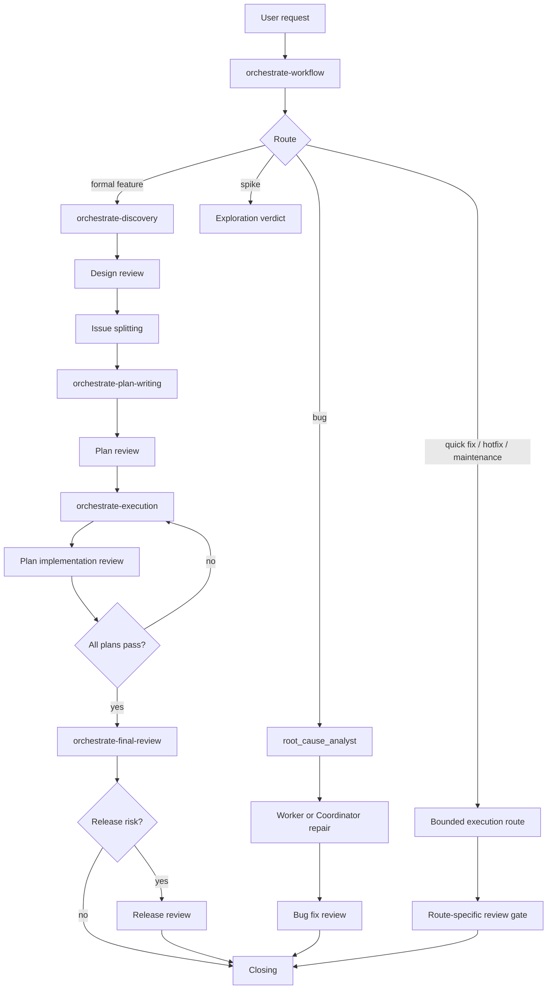

# Codex Orchestrate Architecture

> **Source baseline**: current `codex-orchestrate/` source tree.
> **Version**: 3.6.2.
> **Purpose**: document the Codex-native workflow system that is packaged by this repository.

This document describes the replicated Codex system as it exists in source. It is not a migration log and it is not a record of removed mechanisms.

## Architecture Principles

- `codex-orchestrate/` is the Codex-native source package.
- The workflow preserves the copied phase, gate, state, review, worker, and closing contracts while replacing host-specific execution mechanisms with Codex-native ones.
- Skills contain phase procedures and prompt contracts. Agent TOML files contain subagent behavior. Scripts and hooks enforce state boundaries.
- Runtime state belongs under `.codex/multi-model-workflow`.
- Review is performed by the native `codex_reviewer` subagent. There is no external review runner.
- Dispatch validation that needs the full prompt runs in explicit Coordinator scripts before `spawn_agent` or `send_input`.
- `SubagentStart` and `SubagentStop` hooks only use fields present in Codex hook payloads; they do not validate the original dispatch prompt.

## Package Layout

| Path | Role |
| --- | --- |
| `.codex-plugin/plugin.json` | Codex plugin manifest and version metadata |
| `skills/` | User-facing and workflow phase skills |
| `agents/` | Codex TOML subagent definitions and shared persona reference |
| `hooks.json` | Codex hook manifest |
| `hooks/` | Hook handlers for session, commit, state, effort, and worker-return events |
| `scripts/` | Explicit Coordinator gates, state commands, validation, and verification helpers |
| `state-schema/` | JSON schemas and transition matrix for workflow state |
| `build/` | Template and resolver system for shared Skill reference blocks |

## Skill Surface

| Skill | Responsibility |
| --- | --- |
| `orchestrate-workflow` | Entry routing, infrastructure setup, scope contract, route extensions, direct repair, closing |
| `orchestrate-discovery` | User Q&A, source design creation, design review, issue splitting |
| `orchestrate-plan-writing` | Plan writer dispatch, small issue completion, plan creation, plan review |
| `orchestrate-execution` | Plan-to-pack execution loop, worker dispatch, checkpointing, implementation review, repair routing |
| `orchestrate-final-review` | Intent verification, unresolved tail cleanup, release gate routing |
| `orchestrate-multi-pr-merge` | Multi-PR conflict discovery, integration review, merge handling |
| `codex-review` | Ad-hoc standalone review with `codex_reviewer`; does not enter workflow state |

Skills are loaded only when their workflow step needs them. Dispatch prompts sent to subagents must be self-contained; subagents do not rely on the Coordinator's local context.

## Agent Surface

| Agent | Model | Effort | Sandbox | Primary role |
| --- | --- | --- | --- | --- |
| `plan_writer` | `gpt-5.5` | `xhigh` | `workspace-write` | Write implementation plans from approved design and issue files |
| `pack_executor` | `gpt-5.3-codex` | `high` | `workspace-write` | Execute normal task packs |
| `complex_pack_executor` | `gpt-5.5` | `high` | `workspace-write` | Execute high-risk or cross-module task packs |
| `code_explorer` | `gpt-5.3-codex` | `high` | `read-only` | Gather focused evidence |
| `complex_code_explorer` | `gpt-5.5` | `high` | `read-only` | Investigate broad or multi-module evidence paths |
| `root_cause_analyst` | `gpt-5.5` | `xhigh` | `workspace-write` | Diagnose bugs and failed repair loops |
| `docs_worker` | `gpt-5.3-codex` | `high` | `workspace-write` | Perform bounded documentation cleanup |
| `codex_reviewer` | `gpt-5.5` | `xhigh` | `read-only` | Independently review code, plans, release risk, and ad-hoc inputs |

The reviewer is a first-class subagent. Review instructions live in `agents/codex_reviewer.toml` and the shared review dispatch template.

## End-to-End Flow

## Review Architecture

All orchestrated reviews use the same native subagent path:

1. Coordinator writes `.codex/multi-model-workflow/review-prompts/<gate>.md`.
2. The prompt starts with `DISPATCH_ENVELOPE` and sets `agent_role: "codex_reviewer"`.
3. Coordinator validates the prompt with `scripts/validate-review-dispatch.sh`.
4. Baseline review uses `spawn_agent` with `agent_type: "codex_reviewer"`.
5. The returned reviewer `agent_id` is persisted in `.codex/multi-model-workflow/review-agents/<gate>.agent-id`.
6. Targeted re-review uses `send_input` to the persisted reviewer agent.
7. Coordinator waits with `wait_agent`.
8. Coordinator increments review budget with `scripts/state.sh budget increment-review`.
9. Coordinator writes the reviewer final message to `.codex/multi-model-workflow/review-results/<gate>.md`.

The dispatch gate is deliberately explicit. Codex subagent lifecycle hooks do not receive the full original prompt, so prompt-envelope validation cannot live in `SubagentStart`.

### Review Intent Rules

| Intent | Transport | Required properties |
| --- | --- | --- |
| `baseline` | `spawn_agent` | `agent_role = codex_reviewer`; no existing target reviewer required |
| `targeted-re-review` | `send_input` | existing reviewer `agent_id`; nonempty `exception_code`; repair gate context |

Ad-hoc `codex-review` uses the same reviewer subagent and validation script, but stores results under `.codex/codex-review/` and does not consume workflow budget.

## Worker Dispatch Architecture

Worker dispatch also validates before subagent creation:

1. Coordinator writes the full worker prompt to `.codex/multi-model-workflow/worker-prompts/<pack-id>.md`.
2. Coordinator runs `scripts/validate-pack-dispatch.sh --prompt-file <path>`.
3. The validation script checks the `DISPATCH_ENVELOPE`, workflow state, execution state, budget, current plan, pack status, repair round, and disposition references.
4. Coordinator calls `spawn_agent` for `pack_executor` or `complex_pack_executor`.
5. Coordinator records the returned `agent_id` with `scripts/record-pack-dispatch.sh`.
6. The worker writes its durable return under `.codex/multi-model-workflow/pack-returns/<run_id>/<pack-id>.json`.
7. `hooks/agent-return-handler.sh` consumes the durable return on `SubagentStop` and updates execution state.

Repair of an already-dispatched worker uses `send_input` to the recorded `agent_id`. A missing recorded agent blocks the repair route instead of creating an unrelated replacement worker.

## Hook Responsibilities

| Event | Handler | Responsibility |
| --- | --- | --- |
| `SessionStart` | `hooks/session-start.sh` | Load behavior rules and recover active workflow state |
| `PreToolUse` | `scripts/guard-premature-push.sh` | Block publish and forbidden merge actions when workflow gates are unfinished |
| `PreToolUse` | `hooks/enforce-pack-commit.sh` | Enforce pack commit message format |
| `PreToolUse` | `hooks/guard-doc-edit.sh` | Prevent worker contexts from editing protected docs paths |
| `PostToolUse` | `hooks/track-execution-state.sh` | Update pack execution state after successful pack commits |
| `PostToolUse` | `scripts/cleanup-before-push.sh` | Clean workflow state after successful publish, with hotfix deferral |
| `SubagentStart` | `hooks/track-effort-budget.sh` | Increment effort budget from subagent type |
| `SubagentStop` | `hooks/agent-return-handler.sh` | Read worker durable return and update execution state |

Hook handlers only consume data present in their event payload. Prompt-sensitive gates live in scripts called by the Coordinator before dispatch.

## State Model

| State file | Owner | Contents |
| --- | --- | --- |
| `.codex/multi-model-workflow/workflow-state-<run_id>.json` | Coordinator and `scripts/state.sh` | route, cursor, budget, dispositions, path routing, reflux counters, review effectiveness |
| `.codex/multi-model-workflow/execution-state-<run_id>.json` | Coordinator and dispatch/return scripts | plans, current plan, plan start/end commits, pack status, pack agent ids, commit shas, worker verdicts |
| `.codex/multi-model-workflow/scope-<run_id>.md` | Coordinator | feature slug, source artifacts, editable artifacts, route scope |
| `.codex/multi-model-workflow/review-prompts/` | Coordinator | reviewer prompts with envelopes |
| `.codex/multi-model-workflow/review-agents/` | Coordinator | reviewer agent id persistence |
| `.codex/multi-model-workflow/review-results/` | Coordinator | reviewer final messages |
| `.codex/multi-model-workflow/worker-prompts/` | Coordinator | worker prompts with envelopes |
| `.codex/multi-model-workflow/pack-returns/` | Workers | durable worker return payloads |

State writes go through `scripts/state.sh` or purpose-built scripts when possible. Direct edits must preserve schema contracts in `state-schema/`.

## Execution State Requirements

Before any pack dispatch, execution state must identify the active plan boundary:

- `current_plan_id`
- `plans[N].status = "in_progress"`
- `plans[N].start_commit`
- target pack status is `pending`
- target pack has no recorded `agent_id`

`scripts/state.sh execution-plan start --run-id <run_id> --plan-id <N> --start-commit <sha>` owns this transition.

## Disposition And Repair

Coordinator is responsible for validating reviewer findings before disposition. A finding is not accepted only because a reviewer reported it.

| Disposition | Meaning |
| --- | --- |
| `accepted` | Finding is verified and enters repair |
| `rejected` | Finding is contradicted by evidence |
| `suppress` | Low-confidence finding is intentionally not pursued |
| `path-a` | Coordinator direct repair, followed by targeted re-review |
| `path-b` | Worker repair through recorded agent continuation; a separate validated pack dispatch is only valid when the workflow explicitly creates a new pack |
| `needs-evidence` | Explorer gathers evidence before disposition |
| `duplicate` | Finding is covered by another accepted item |
| `out-of-scope` | Create a durable external issue |
| `needs-evaluation` | Coordinator must classify after inspection |
| `user-decision` | User decision is required |

Repair loops are capped. When repeated re-review still finds a blocking issue, the route escalates to root-cause analysis or blocks with evidence.

## Build System

The build system keeps shared language synchronized:

| Area | Files |
| --- | --- |
| Templates | `build/templates/*.md.tmpl` |
| Resolvers | `build/resolvers/*.sh` |
| Build command | `build/build.sh --apply` |
| Drift check | `build/build.sh --check --plugin-dir codex-orchestrate` |

When a shared template changes, regenerate generated references with `build/build.sh --apply` and verify with `build/build.sh --check`.

## Verification Criteria

The Codex source package is mature only when these source-level criteria hold:

- Agent TOML files parse successfully.
- `hooks.json` is valid JSON and points to existing scripts.
- Hook and script shell files pass syntax checks.
- Build templates and generated references are in sync.
- Skill references dispatch review through `codex_reviewer`, `spawn_agent`, `send_input`, and `wait_agent`.
- Review and worker prompt gates use explicit scripts before dispatch.
- Runtime state paths use `.codex/multi-model-workflow`.
- Codex source text does not instruct maintainers to use removed review runners, removed state paths, or old tool-name labels.

Runtime installation parity is a separate installation step. It does not change the source architecture described here.
