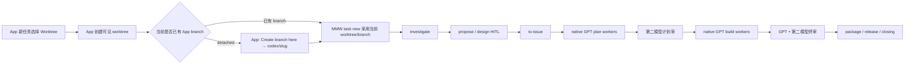

# Codex Plugin 迁移实施计划

## Plan Header

- **Goal**：新增 `codex-plugin/`，成为与 `plugin/`、`droid-plugin/`、
  `pi-plugin/` 同级的第四份单宿主镜像。
- **Business baseline**：当前 `plugin/` 的入口、阶段、HITL、审查编制、状态机、
  package/release/closing 语义。
- **Native-agent baseline**：当前 `pi-plugin/` 的“脚本 prepare/verify，主线程调用
  宿主原生 subagent”结构。
- **Codex-only delta**：plugin 安装接线、Codex hooks/skills 工具名、Codex App
  worktree/branch 入口、native subagent 调用、第二模型 CLI Adapter。
- **Second model**：只有第二审查模型走外部无头 CLI；Adapter 不绑定 Claude、
  Gemini 或其他供应商。
- **External skills**：完全沿用三份现有镜像的外部依赖边界。Codex 读取
  `~/.agents/skills`，MMW 不复制、不修改、不 vendor 这些 skills。
- **Current baseline**：`main`
  `2efefbe1668cf108ab63a85cd639da067c3c76dd`。
- **Worktree**：
  `codex/2026-07-23-codex-native-plugin-migration-plan`。
- **Evidence**：
  [三镜像与外部 Skill 边界](evidence/2026-07-23-method-skill-dependency-audit.md)；
  [Codex App Worktree 边界](evidence/2026-07-23-codex-app-worktree.md)。

## 第一屏：最终迁移结构

| 层 | 采用实现 |
| --- | --- |
| MMW 业务流程 | 复制当前 `plugin/` 的四入口、阶段图、HITL 和审闸，不重新设计。 |
| MMW skills | 仍然只有 `orchestrate`、`release-flow`、`worktree-plan`、`worktree-build`、`worktree-review`。 |
| 外部方法 skills | 与三份镜像一样保留为外部依赖；Codex 使用 `~/.agents/skills/<name>/SKILL.md`。 |
| 控制入口 | 当前 11 个 command/prompt 在 Codex 中做成 11 个薄 skill wrapper；只换宿主入口，不搬业务正文。 |
| 调查 | 主线程按 topic 调 Codex native subagents，并行收回后再调一个全新 synth subagent。 |
| 计划 | 一个大 issue 一个 native GPT plan-writer；prepare/verify 复用 `pi-plugin/scripts/worker.sh` 结构。 |
| 落地 | 一个 plan 一个 native GPT build worker 和独立 inner worktree；仍由 worker prepare/verify 管边界。 |
| GPT 审者 | 使用 Codex native subagents。 |
| 第二模型审者 | 只由 `second-review.sh` 调配置的外部 CLI；核心代码只有一个 stdin/stdout Adapter。 |
| App 主任务 worktree | 由 Codex App 创建并显示，MMW 直接采用，不再创建隐藏 outer worktree。 |
| App 主任务 branch | detached 时先使用 App 的 **Create branch here** 创建 `codex/<slug>`；MMW 只采用 App 已创建、UI 已识别的 branch。 |
| 状态 | 仍放任务 worktree 内的 `.codex/multi-model-workflow/`；不新增外部 registry、custom ref 或第二恢复系统。 |
| Hooks | 只移植三镜像已有的 SessionStart、PreToolUse 红线和 PostToolUse commit 记账；不新增 Stop、UserPromptSubmit、workspace path guard。 |

这份迁移的结构只有一句话：

> `plugin/` 提供业务语义，`pi-plugin/` 提供 native subagent 执行骨架，
> `codex-plugin/` 只补 Codex 宿主接线。

## 三份现有 Plugin 的真实共同设计

当前源码已经确认：

| 镜像 | 自带 MMW skills | Agent 接线 | 外部方法 skill 处理 |
| --- | ---: | --- | --- |
| Claude | 5 | Workflow、会话内 reviewer、外部 Codex worker | `flow.sh` 检查 `~/.claude/skills`；Codex worker 检查 `~/.agents/skills` |
| Droid | 5 | Custom Droids、Droid exec | `flow.sh` 检查 `~/.factory/skills` |
| pi | 5 | pi native subagents、agents roster | `flow.sh` 检查 `~/.agents/skills` |

三份镜像共同依赖以下外部方法 skills：

- 主线程：`tdd`、`codebase-design`、`diagnosing-bugs`、`domain-modeling`、
  `prototype`、`grilling`、`to-tickets`、`triage`、
  `improve-codebase-architecture`。
- 计划/落地工人：`tdd`、`codebase-design`、`to-tickets`。
- 路径特定能力：例如 `playwright-cli`、`frontend-design`、`impeccable`。

Codex 镜像直接复制 `pi-plugin/scripts/flow.sh` 的依赖检查，只把 host 文案改成
Codex。缺装时仍按现有合同告警；对应 reference 已规定该停下还是允许跳过。

不修改任何外部 skill 的正文、目录、安装方式、版本或行为。MMW reference 只负责
说明在本阶段何时调用它，以及 MMW 对其产物做什么适配；这正是三份现有镜像的边界。

## 用户工作流



四个开口、阶段顺序和用户控制动作保持当前行为：

- `develop`：investigate → propose → design → to-issue → plan → build →
  closing。
- `small-change`：轻确认 → build → final review → closing。
- `bug`：根因调查 → 轻确认 → TDD 修复 → final review → closing。
- `merge`：业务/设计冲突分析 → 顺序合并 → 集成审 → closing。
- HITL 仍集中在 propose/design；`approve-design` 后进入 AFK 流水线。
- `direction-given`、`wayfind`、bug/small-change 升级 develop、repair loop、
  compaction resume 全部保留。

## Codex 宿主适配

### 1. Plugin 与 skill surface

`codex-plugin/.codex-plugin/plugin.json` 只声明本镜像自己的 `skills/` 和
`hooks/hooks.json`。

公开 skill surface：

- 5 个 MMW workflow/worker/review skills。
- 11 个控制 wrappers：
  `approve-design`、`attended`、`force-validate`、`gather-context`、
  `progress`、`reassess`、`replan-remaining`、`rescope`、`side-finding`、
  `skip-current`、`unattended`。

11 个 wrappers 从当前 command/prompt 单源生成。需要用户显式触发的 wrapper 在
`agents/openai.yaml` 设置 `allow_implicit_invocation: false`。不新增通用 control
skill，不改变用户记住的动作名。

### 2. 外部 skills

Codex 与 pi 使用同一个标准目录：

```text
~/.agents/skills/<skill-name>/SKILL.md
```

实现要求：

- `mmw where` 运行现有 `mmw_warn_ext_skills`。
- 主线程 reference 点名某个外部 skill 时，直接显式调用或读取该 skill。
- 调查 topic 的 `skill` 字段原样传给对应 subagent。
- plan/build prompt 不复制外部 skill 内容，只要求工人按现有 MMW skill 的指引调用。
- 缺装告警和安装提示沿用三镜像现有文案。

### 3. App worktree 与 branch

Codex App 当前没有把任意 shell-created worktree attach 到正在运行任务的接口。
因此 Codex 镜像不运行当前 `prepare.sh` 的 `git worktree add` 主任务步骤。

`mmw task new` 改成：

1. 读取当前 Git top-level。
2. 当前是 Local checkout 时，返回 `NEEDS_APP_WORKTREE`，不写 manifest、不建 branch、
   不建 docs；用户用 App Handoff 或重新以 Worktree mode 开始。
3. 当前是 linked/App worktree，但 HEAD detached 时，返回
   `NEEDS_APP_BRANCH codex/<slug>`；用户使用 App **Create branch here**。
4. 当前 branch 已由 App 创建后，核 branch 与 slug，采用当前 worktree 和 branch。
5. 在当前 worktree 建现有 docs scaffold 和
   `.codex/multi-model-workflow/task.json`。
6. 后续 `where`、handoff、loop、review、package/release 都继续读取当前 worktree
   内状态。

不实现：

- MMW 自建 outer worktree。
- shell 自建 branch 后要求 App 猜测。
- `TASK_ROOT`、内部 `chdir`、路径代理。
- 外部 task registry。
- detached custom ref。
- origin fingerprint 或全局 workspace allowset。

plan/build inner worktrees 仍由 MMW 创建。它们是工人执行目录，不是用户导航目标，
不需要出现在 App sidebar。

### 4. Native subagent 调度

Codex plugin 不安装 `.codex/agents`，也不调用外部 Codex CLI。

复用 `pi-plugin` 的模式：

1. `mmw worker ...` 只做 prepare，生成 inner worktree、prompt、meta 和 verify 命令。
2. 主线程读取 prompt，用 Codex native `spawn_agent` 派 GPT subagent。
3. 独立任务并行派发；依赖任务按顺序派发。
4. 主线程用 native wait/follow-up 收回结果。
5. 工人结束后先运行 `mmw worker verify`，再亲验 Return Contract。
6. verify 失败时，向同一活 agent follow-up；agent 已不存在时，派一个干净修复
   agent 读取当前 inner worktree 和失败证据。
7. native agent id 只服务当前会话，不写入 task 真相源；跨会话从磁盘状态和
   inner worktree 重派。

`pi-plugin/agents-roster/*.md` 只作为角色 prompt 模板移植，不注册为 Codex custom
agents。模型使用当前 Codex GPT 主模型/子代理默认，不在 plugin 内维护 model roster。

### 5. Investigate 的结构化多 Agent Workflow

保留当前内部/外部两条调查路径，不增加第三种编排器：

1. 主线程按当前 `investigate.md` 决定方向和 topics。
2. 一个 topic 一个 native GPT subagent，并行派发。
3. 每个 topic prompt 包含：
   - 唯一 angle/question。
   - internal 的 repo/worktree 路径，或 external 的来源边界。
   - 可选外部 skill 名；subagent 读取 `~/.agents/skills/<skill>/SKILL.md`。
   - 当前 topic Return Contract。
4. 每个 topic 只取证，不选方案；internal 返回 `file:line`，external 返回 URL。
5. 主线程丢弃无 locator 或低置信 claim，并保留 dropped/skipped 留痕。
6. 全部 topic 失败时停止，不合成空报告。
7. 有效结果收齐后，派一个全新 native GPT synth subagent。
8. synth 只接收已过滤的 topic 结果，返回当前 investigating report contract。
9. 主线程亲验承重 locator 后写 `investigating.md` 并登记 spinoff。

这里直接使用 Codex 的 spawn/wait/follow-up；不移植 Claude Workflow JS，不创建
App Server，不再写一条 `mmw investigate` 状态机。

### 6. Plan 与 Build

从 `pi-plugin/scripts/worker.sh` 移植：

- plan writer 使用短命 sandbox；只允许修改目标 plan 和对应 issue 的
  `Small issues`，verify 后原子发布回任务 worktree。
- build worker 一个 plan 一个 inner worktree；按 Task Pack TDD 并提交。
- `worktree-plan`、`worktree-build` 继续是 MMW 自带 skill；内容只做 Codex 工具名、
  `AGENTS.md` 和 plugin root 定位适配。
- 工人需要 `tdd`、`codebase-design` 或 `to-tickets` 时，继续调用外部 skill。
- docs 边界、plan 边界、start SHA、pending dispatch、verify 和 receipt 沿用 pi
  现有实现。
- `.worktreeinclude` 和 App 自动 setup 只适用于 App-created outer；MMW inner
  worktree 继续按当前 worker 的项目准备合同处理，不扩展成通用 workspace manager。

### 7. Review

审查方法继续只有 `worktree-review` 一份；审者 provider 只在 dispatch 层变化。

沿用当前 Claude 镜像的审查编制并反转宿主：

| Stage | Codex 实现 |
| --- | --- |
| design | 两个独立第二模型 CLI 审者，分别负责设计内容和项目对齐。 |
| plan | 两个独立第二模型 CLI 审者，分别负责覆盖/质量和合规/交叉验证。 |
| plan-impl | 仍是机器合同门，不派模型。 |
| small-change/bug final | 一个第二模型 CLI 审者覆盖两条基线。 |
| develop final，轻档 | 一个第二模型审基线 1，一个 native GPT 审基线 2。 |
| develop final，完整档 | 两条基线各一个 native GPT 加一个第二模型，共四审。 |
| merge-impl | 一个 native GPT 加一个第二模型，覆盖现有七角度。 |

`second-review.sh` 是唯一新增 Adapter：

```text
stdin  = 完整 rendered review prompt
stdout = worktree-review Return Contract
exit 0 = 成功
非 0 / 空输出 / 超时 = 当前 review slot 失败
```

Adapter 可执行文件由用户配置。核心脚本不识别 Claude/Gemini 名称，不做 GPT
fallback；需要第二模型的 slot 失败就留在审闸。

### 8. Hooks、控制面、Package、Release、Closing

Hooks 只移植现有三类行为：

- `SessionStart`：plugin root、当前任务、最近状态和 resume 指引。
- `PreToolUse`：push、远端 PR merge、deploy 等出站红线。
- `PostToolUse`：现有 Pack commit 记账。

不新增 UserPromptSubmit receipt、Stop hook、SubagentStop schema 或文件路径守卫。

Package/release 直接移植当前脚本和 references：

- package 两次人工确认不变。
- release P1 修复工人改为 native GPT subagent。
- push/PR/deploy 仍停在人闸。
- 第二模型不参与实现。

Closing：

1. 当前 App branch 全部 Task Pack 已提交并通过终审。
2. 找到 `target_branch` 当前已存在的 clean checkout。
3. 在 target checkout 本地执行
   `git merge --no-ff <app-created-task-branch>`。
4. 运行最终验证。
5. `mmw task cleanup` 只删除 `.codex/multi-model-workflow` 任务状态，不删除 App
   worktree 或 App branch。
6. 用户继续使用 App 的 Handoff/archive/branch 管理。

target checkout 不存在、dirty 或正在 merge/rebase 时 fail loud，请用户整理；不为
这个低频分支再建 closing workspace manager。

## 目标目录

```text
codex-plugin/
├── .codex-plugin/
│   └── plugin.json
├── agents-roster/             # 只作 spawn prompt 模板，不注册 custom agents
├── build/
│   ├── fragments/
│   ├── build.sh
│   └── tests/
├── hooks/
│   ├── hooks.json
│   ├── session-triage.sh
│   ├── guard-redline.sh
│   └── record-step.sh
├── scripts/
│   ├── lib/runtime.sh
│   ├── mmw.sh
│   ├── prepare.sh
│   ├── flow.sh
│   ├── loop.sh
│   ├── note.sh
│   ├── progress.sh
│   ├── steer.sh
│   ├── worker.sh
│   ├── review.sh
│   ├── second-review.sh
│   ├── package-phase.sh
│   ├── release-flow.sh
│   └── release support files
├── skills/
│   ├── orchestrate/
│   ├── release-flow/
│   ├── worktree-plan/
│   ├── worktree-build/
│   ├── worktree-review/
│   └── 11 control wrappers
└── state-schema/
    ├── routes.json
    ├── task-manifest.schema.json
    ├── loop-state.schema.json
    ├── package-state.schema.json
    └── release-state.schema.json
```

没有以下目录或对象：

- vendored external method skills。
- `.codex/agents` 安装器。
- external task registry。
- user-action receipt schema。
- investigate state/schema subsystem。
- workspace manager、runner daemon 或 App Server。

## Task Pack 1：Plugin 壳和五个 MMW Skills

**Files**

- `codex-plugin/.codex-plugin/plugin.json`
- `.agents/plugins/marketplace.json`
- 5 个 MMW skills
- build skeleton/tests

**Work**

1. 从 `pi-plugin/skills` 复制五个 skill。
2. 只改 pi/Codex 宿主名、plugin root 定位、工具名和 `AGENTS.md`。
3. 不改阶段方法、不改外部 skill 调用、不增加方法正文。
4. 安装到本地 marketplace，确认从 plugin cache 加载。

**Acceptance**

- 安装后五个 MMW skills 可发现。
- 没有 custom agents 和 vendored method skills。
- source 与 cache 分离时仍只运行 cache 内容。

## Task Pack 2：共享流程引擎和外部 Skill Preflight

**Files**

- `scripts/lib/runtime.sh`
- `mmw.sh`、`flow.sh`、`loop.sh`、`note.sh`、`progress.sh`、`steer.sh`
- 现有五份 state schemas

**Work**

1. 从 `pi-plugin` 移植共享脚本。
2. 状态根只改为 `.codex/multi-model-workflow`。
3. 保留 routes、handoff、loop、approval、attendance、spinoff、escalate 语义。
4. `mmw_warn_ext_skills` 使用 `~/.agents/skills`，集合与 pi 完全一致。
5. 删除 pi extension/agent 注册专属分支，不新增通用 host abstraction。

**Acceptance**

- `where → handoff → review/repair/advance` 与当前流程一致。
- 外部 skills 全齐时无告警；缺装时列出准确名字和安装提示。
- 不读取其他镜像的 runtime/state。

## Task Pack 3：Codex App Worktree Adapter

**Files**

- `scripts/prepare.sh`
- `scripts/lib/runtime.sh`
- scenario references 中的 worktree setup/closing fragment
- prepare/cleanup tests

**Work**

1. `task new` 改为采用当前 App worktree/branch。
2. Local 返回 `NEEDS_APP_WORKTREE`，零写入。
3. Detached 返回 `NEEDS_APP_BRANCH codex/<slug>`，零写入。
4. App 创建 branch 后生成现有 scaffold/manifest。
5. cleanup 只清 MMW state，不删除 App worktree/branch。
6. CLI/IDE 仅接受启动前已进入的 linked worktree + branch。

**Acceptance**

- App sidebar、terminal、diff 和 task branch 始终一致。
- MMW 没有创建第二个 outer。
- 无 external registry、custom ref、`TASK_ROOT` 或路径 hook。
- App branch 可按现有 `--no-ff` 语义合入 target。

## Task Pack 4：Native Investigate

**Files**

- investigate reference
- investigate topic/synth prompt templates
- investigate tests

**Work**

1. 用 native spawn/wait/follow-up 替换 Workflow/Droid/pi workflow 调用语法。
2. 保留一 topic 一 agent、optional skill、locator、dropped、skipped、synth 和亲验。
3. 不新增 durable investigate state。

**Acceptance**

- 三 topic 真并行。
- topic 可读取已安装外部 skill。
- 一个 topic 失败只重派该 topic。
- synth 是新 context，只收到过滤后结果。

## Task Pack 5：Native Plan/Build Workers

**Files**

- `scripts/worker.sh`
- `worktree-plan`
- `worktree-build`
- plan/build references
- worker tests

**Work**

1. 从 pi worker prepare/verify 移植。
2. dispatch 输出 Codex native spawn 指引。
3. plan sandbox、build inner worktree、边界检查、verify、原子发布保持不变。
4. 去掉 pi agent registry/run-id 假设；当前会话用 native agent target，跨会话重派。

**Acceptance**

- 两个 plan writer 并行且互不覆盖。
- 两个 build workers 使用不同 inner worktrees。
- plan/build 工人继续调用外部方法 skills。
- verify 失败不得发布或合并。

## Task Pack 6：Review 与第二模型 Adapter

**Files**

- `scripts/review.sh`
- `scripts/second-review.sh`
- `worktree-review`
- reviewer prompt templates
- fake Adapter/tests

**Work**

1. 复制当前 Claude review matrix。
2. GPT slots 改 native subagent。
3. 第二模型 slots 统一走一个 CLI Adapter。
4. 保留 review trace、亲验/disposition、repair/re-review 和 clean-check。

**Acceptance**

- design/plan/small/bug/develop/merge 编制与上表一致。
- Adapter 可替换且核心没有供应商分支。
- 第二模型缺失时所需 slot fail loud，不降级 GPT。
- 审者不能修改被审 worktree。

## Task Pack 7：控制 Wrappers、Hooks、Package/Release/Closing

**Files**

- 11 control skills
- `hooks/**`
- package/release scripts/skills/references
- closing references

**Work**

1. 从当前 commands/prompts 生成 Codex wrappers。
2. 配 explicit-only policy。
3. 移植 SessionStart、redline、record-step。
4. release repair 改 native GPT。
5. closing 采用 App branch，cleanup 不接管 App worktree。

**Acceptance**

- 11 个动作名和现有语义不变。
- `approve-design`、attendance、steering、package/release gates 可运行。
- push/PR/deploy 仍需用户。
- App worktree/branch 保留给 App。

## Task Pack 8：Build、Parity 与真实 E2E

**Files**

- `codex-plugin/build/**`
- active docs/marketplace/version
- tests/E2E fixtures

**Verification**

```bash
python3 -m json.tool codex-plugin/.codex-plugin/plugin.json >/dev/null
python3 -m json.tool .agents/plugins/marketplace.json >/dev/null
find codex-plugin -name '*.sh' -print0 | xargs -0 -n1 bash -n
for t in codex-plugin/scripts/tests/test_*.sh; do bash "$t" || exit 1; done
bash codex-plugin/build/tests/test_build.sh
bash codex-plugin/build/build.sh --check
```

再跑三份现有镜像全量回归。

真实 Codex App E2E：

1. Worktree mode 创建任务。
2. App `Create branch here` 创建 `codex/<slug>`。
3. `task new` 采用当前 checkout。
4. investigate 三 topic + synth。
5. propose/design/approve。
6. 两个 issue、两个 native plan writers。
7. 两个第二模型 plan reviewers。
8. 两个 native build workers。
9. 合同门。
10. native GPT + 第二模型 final review。
11. package/release dry-run。
12. target checkout 本地 `--no-ff` merge。
13. cleanup 只清 MMW state，App worktree/branch 仍在。
14. compaction 后从当前 worktree 内 state 续跑。

另外分别跑 small-change、bug、merge 三入口。

## 明确不做

- 不修改、复制或重写任何外部方法 skill。
- 不把 Codex plugin 做成通用 agent framework。
- 不新增 App Server、MCP runner、daemon 或外部 Codex CLI worker。
- 不安装 Codex custom agents。
- 不创建 App 看不见的 outer worktree/branch。
- 不维护 detached task ref、external registry、workspace allowset 或路径代理。
- 不新建统一 Return Contract schema。
- 不重写现有 state machine、review loop、package/release/closing。

## 完成定义

- `codex-plugin/` 是第四份独立镜像。
- 仍只有五个 MMW 核心 skills；外部方法 skills 保持外部依赖。
- 四入口、全部阶段、HITL、控制面、断点恢复、package/release/closing 行为完整。
- 调查、计划、开发、修复和 GPT 审者全部使用 Codex native subagents。
- 只有第二模型使用外部 CLI，且供应商可替换。
- App 创建并识别主任务 worktree/branch；MMW 不再与 UI/cwd 分裂。
- plan/build inner worktrees 继续隔离并通过 verify。
- 清洁安装、hook、cache、compaction 和真实 E2E 全部通过。
- 第二个零上下文 Codex 在依赖 preflight 通过后，能只按 plugin 指引跑完整流程。
