# Codex 原生 Plugin 完整迁移计划

## Plan Header

- **Goal**：新增独立的 `codex-plugin/` 单宿主镜像，在不改变现有四类入口、阶段顺序、HITL 位置、控制动作、审查编制、worktree 习惯和断点恢复语义的前提下，完整迁移当前 `plugin/` 的业务能力。
- **Primary host**：Codex Desktop / CLI / IDE 当前原生 plugin、skills、hooks 和 subagent runtime。
- **Primary agents**：主线程、调查工人、调查综合工人、计划工人、开发工人、修复工人和 GPT 审者全部走 Codex 原生 GPT agent thread。
- **Second reviewer**：只有独立的第二审查模型走外部无头 CLI；核心实现只认一个供应商无关 Adapter，不绑定 Claude 或其他厂商。
- **Source of truth**：当前 `plugin/`、`pi-plugin/`、`droid-plugin/` 代码、各自 `skills/**/references`、scripts、schemas、tests；历史设计文档只作线索，不作为现状证据。
- **Method dependencies**：当前 workflow 硬依赖的方法论 skills 随 Codex plugin
  固定版本分发；任务特定的浏览器、远程 Windows 和外部服务仍作为显式环境依赖。
- **Method source baseline**：`mattpocock/skills`
  `ed37663cc5fbef691ddfecd080dff42f7e7e350d`，MIT；实现时把许可证和该来源
  写入第三方声明。
- **Current baseline**：仓库 `main` commit `2efefbe1668cf108ab63a85cd639da067c3c76dd`；Claude plugin `8.1.4`；本机 `codex-cli 0.145.0`。
- **Official capability baseline**：
  - [Subagents](https://learn.chatgpt.com/docs/agent-configuration/subagents)
  - [Build plugins](https://learn.chatgpt.com/docs/build-plugins)
  - [Build skills](https://learn.chatgpt.com/docs/build-skills)
  - [Hooks](https://learn.chatgpt.com/docs/hooks)
- **Execution owner**：Codex 主线程；实现期严格按本计划 Task Pack 执行。
- **Tech stack**：Bash、Python 3、jq、JSON Schema、Codex native subagent tools、Codex plugin hooks。
- **Branch/worktree**：`codex/2026-07-23-codex-native-plugin-migration-plan`；当前计划位于独立 worktree。
- **Final gate**：只有安装后的 Codex plugin 从 cache 运行、hooks 已 trust、真实 native agent fan-out、真实第二模型 CLI、compaction/resume 和完整 develop E2E 全部通过，才可宣告 parity。

## 第一屏：最终采用的迁移结论

| 决策 | 最终实现 |
| --- | --- |
| 是否新增独立镜像 | 是。新增 `codex-plugin/`，不修改禁区 `codex/`，不让不同宿主共享运行时状态。 |
| 主体如何派工 | Codex 主线程直接使用原生 subagent；不经过 App Server、MCP runner、外部 Codex CLI 或自建 agent daemon。 |
| 主体模型 | 使用当前 Codex GPT 主模型及其原生子代理调度；不维护一份易过期的 Codex agent model roster。 |
| 调查 | 主线程一 topic 一原生 GPT subagent，并行收回后再派一个全新 GPT synth subagent。 |
| 计划 | 一个大 issue 一个原生 GPT plan writer；沿用当前 `pi-plugin` 已验证的 plan sandbox + verify + 原子发布，而不是让多个 writer 直接并写任务 worktree。 |
| 开发 | 一个 plan 一个原生 GPT build worker、一个独立 worktree；沿用当前 `pi-plugin` 的 native prepare/verify/receipt 结构。 |
| 审查 | 按当前审查矩阵反转宿主：需要 GPT 审者的走原生 subagent，需要跨模型审者的只走外部第二模型 Adapter。 |
| 第二模型 | Adapter 的可执行文件可替换；核心不出现 Claude/Gemini/其他厂商分支。 |
| 控制入口 | 当前 11 个命令按原名字一一映射成 Codex skills；只有 Codex 被迫改变的调用前缀从 `/name` 变为显式 skill mention。 |
| 人工真实性 | 当前 6 个 `disable-model-invocation` 动作、设计批准、package 两次确认和出站动作由 `UserPromptSubmit` 一次性 receipt 保证，不能靠提示词。 |
| 状态恢复 | 继续以 task/loop/package/release/git 为真相；agent target 只留在当前活会话，跨会话重新派干净 agent。 |
| 主线程 cwd | 不要求用户手动开新 chat 或手动 Handoff。SessionStart 提供 session context；主线程所有文件工具使用绝对 task root，`mmw` 内部 chdir，并用 origin fingerprint 硬闸防止写回原 checkout。 |
| Return Contract | 保留现有结构化 Markdown/JSON 回执和父线程亲验；不新增覆盖所有角色的 SubagentStop schema 系统。 |
| Investigate 脚本 | 不新增第二条 `mmw investigate` 编排轨。原生 subagent 是唯一执行轨，只保留必要的无状态结果校验/过滤 helper。 |
| Merge 恢复 | 继续使用 merge brief + git 状态；补足 brief 必填字段，不新增独立 merge 状态机。 |
| Custom agents | 不要求安装 `.codex/agents`。Codex plugin 当前不能把 custom agents 作为 plugin 组件分发；角色方法继续由 bundled skills 提供。 |

## 用户流程与习惯保持不变

```mermaid
flowchart LR
    A["新设计 / 优化改造 / Bug / 合并"] --> B["调查"]
    B --> C["给 2-3 个方向"]
    C --> D["用户选择方向"]
    D --> E["设计讨论与预审"]
    E --> F["用户批准设计"]
    F --> G["拆 Issue"]
    G --> H["原生 GPT 并行写计划"]
    H --> I["第二模型计划审"]
    I --> J["原生 GPT 分 worktree 落地"]
    J --> K["跨计划合同门"]
    K --> L["GPT + 第二模型终审"]
    L --> M["Package / Release"]
    M --> N["Closing / 本地合并"]
```



用户仍然：

- 从同一类自然语言请求进入。
- 在 small-change 写第一行代码前确认“怎么改 + 影响面”。
- 在 bug 根因查清、写第一行修复前确认“根因 + 怎么修 + 影响面”。
- 在 propose 阶段选择方向。
- 在 design 阶段讨论并显式批准。
- 批准后默认放权，不从 plan 起逐步盯。
- 使用原有 11 个动作名控制任务。
- 在 package 阶段完成两次真实人测。
- 对 push、远端 PR merge、部署保留最终决定权。

现有路由分叉也保持：

- 用户已给明确方向时，`--direction-given` 让 propose 只落既定方向和一个最强对照，
  不重新摆 2–3 个方向。
- 大事项仍在雾里时，`--with-wayfind` 在 investigate 前保留决策地图与逐项 HITL。
- bug/small-change 发现系统性设计问题时，`task escalate --to develop` 在原 worktree
  升级，不丢已查产物。

Codex 宿主强制带来的唯一可见变化：

- Claude 的 slash command 不能由 Codex plugin 分发；对应入口改成 `$<plugin>:<action>` skill mention。
- Codex hook 当前不能主动返回 `permissionDecision:"ask"`；出站动作第一次被 deny 后，用户用一次确认消息放行该动作。

其余变化都封装在 plugin 内，不把 `session_id`、context file、agent id、worktree 绝对路径或第二模型 Adapter 参数暴露给用户操作。

## 现有能力与 Codex 原生映射

| 当前实现 | Codex 原生目标 | 迁移处理 |
| --- | --- | --- |
| `plugin/.claude-plugin/plugin.json` | `.codex-plugin/plugin.json` | 宿主 manifest 重写。 |
| `commands/*.md` | bundled skills | 一对一生成 11 个 skill wrapper。 |
| `agents/code-reviewer.md` | native subagent + `worktree-review` skill | 不复制 agent 文件，不安装 custom agent。 |
| Claude `Workflow(...)` | native subagent fan-out / wait / follow-up | 删除 Codex 镜像的 Workflow runtime。 |
| `codex exec` plan/build worker | native subagent | 删除外部 Codex backend。 |
| Claude 会话内 reviewer | native GPT subagent | 直接派干净 agent thread。 |
| 外部 Codex reviewer | 外部第二模型 reviewer | 改成供应商无关 Adapter。 |
| `.claude/multi-model-workflow` | `.codex/multi-model-workflow` | Codex 单宿主状态平面。 |
| `.claude/worktrees` | `.codex/worktrees` | Codex 单宿主 worktree 根。 |
| `EnterWorktree` | session context + 主线程绝对路径合同 + `mmw` 内部 chdir + origin guard | 用户不用手动换 chat，且原 checkout 不能被误写。 |
| Claude hook `ask` | Codex PreToolUse deny + user receipt | 两步 fail-closed。 |
| Claude `disable-model-invocation` | explicit-only skill + UserPromptSubmit receipt | 保留只有用户能触发的语义。 |
| 外部 Codex session resume | native follow-up 或基于磁盘重派 | agent thread 不进入业务真相源。 |

## 目标模块与最小 Interface

### 1. `mmw` runtime module

**Interface：**

```text
bash <installed-plugin-root>/scripts/mmw.sh --context <session-context.json> <existing-command...>
mmw context root
mmw context bind --task-root <absolute-path>
mmw context guard
```

**实现隐藏：**

- 从 context 解析 task root。
- 在分发到现有脚本前只做一次安全 `chdir`。
- 解析 plugin 版本和安装根。
- 读取/写入 task、loop、package、release 状态。
- 为 child prompt 输出绝对路径。
- 为主线程输出唯一 `TASK_ROOT`，并校验 origin checkout 没有偏离建任务时的
  HEAD + tracked/untracked fingerprint。

不再并列提供 `--repo`、`--task-root`、`--worktree` 三套全局入口。恢复时先运行
`context bind`，然后继续使用同一个 `--context` Interface。`context root` 和
`context guard` 是该 Interface 下的定位/验真动作，不形成第二套 repo 参数体系。

### 2. Native worker module

**Interface：**

```text
mmw worker plan-dispatch|plan-resume|plan-check ...
mmw worker dispatch|resume|check-docs|verify ...
```

当前 plan/build 命令名保持不变；只删除 pi backend 专属的 `note-run-id`。
`plan-dispatch` 和 `dispatch` 不再执行模型，只返回：

- agent role。
- prompt file。
- 目标 worktree。
- dispatch meta。
- native spawn 指令。
- 收回后唯一 verify 命令。

`plan-resume` 和 `resume` 生成 continuation brief；它们不承诺恢复已经消失的
native agent thread。

主线程读取回执后直接调用 Codex native subagent。内部实现优先从当前已验证的 `pi-plugin/scripts/worker.sh` 迁移：

- plan sandbox。
- input overlay。
- plan exact boundary。
- atomic plan publish。
- build worktree。
- prompt generation。
- start SHA。
- docs boundary。
- dispatch pending guard。
- verify/receipt。

只删除 pi agent registry、pi task id 和 pi runtime 路径，改为 Codex native agent thread。

### 3. Native review module

**Interface：**

```text
mmw review start --stage <stage> --source <source>
mmw review clean-check --worktree <path> --baseline <fingerprint>
```

内部实现优先复用当前 `pi-plugin/scripts/review.sh` 的：

- review brief。
- worktree fingerprint。
- clean-check。
- trace 落点。
- re-review prior trace。
- 主线程 disposition。

Codex 版只替换 reviewer roster：

- GPT slot 输出 native spawn brief。
- second-model slot 输出 Adapter request。

### 4. Second-review Adapter

这是唯一真正需要多 Adapter 的 seam。

**配置与自检：**

```text
mmw second-review configure --adapter <absolute-executable> --timeout-seconds <n>
mmw second-review doctor
```

`configure` 只登记用户选择的 Adapter；`doctor` 用临时只读 fixture 验证可执行文件、
协议、超时和 Return Contract，不发起正式工作流审查。

**Adapter Interface：**

```text
<adapter-executable> <request-json-path>
```

用户级配置：

```json
{
  "adapter_executable": "/absolute/path/to/mmw-second-review-adapter",
  "timeout_seconds": 1800
}
```

配置文件固定写入 `$PLUGIN_DATA/second-review.json`；`second-review.sh`
从 `--context` 路径向上解析当前 plugin data root，不依赖 shell 启动目录或
用户全局 Codex 配置。

Plugin 核心交付 Adapter 协议、configure/doctor、调用器、conformance tests 和
fail-closed gate。具体供应商 Adapter 是可替换部署依赖；进入正式 E2E 前必须至少
选择一个真实 Adapter 并通过 doctor，不能用 fake Adapter 宣告第二模型能力完成。

request JSON：

```json
{
  "schema_version": "1",
  "run_id": "<opaque>",
  "cwd": "/absolute/review/worktree",
  "stage": "design|plan|final|merge-impl",
  "view": "<axis-or-baseline>",
  "prompt_path": "/absolute/prompt.md",
  "output_path": "/absolute/review-output.md"
}
```

request、rendered prompt 和 `output_path` 全部位于
`$PLUGIN_DATA/review-runs/<run-id>/`，不放进被审 worktree。核心创建并校验该目录，
Adapter 只被允许写指定 output；clean-check 通过后，主线程再把原始输出落入当前
review trace。

Adapter 自己负责：

- 选择 Claude、Gemini 或其他第二模型。
- 认证。
- 无头调用。
- 供应商专属只读参数。
- 把最终结果写入 `output_path`。

核心负责：

- 把 bundled `worktree-review/SKILL.md`、当前 stage 的一份完整 method reference、
  stage/view/source、prior trace 和 Return Contract 渲染成自包含 prompt。
- 进程 timeout。
- 退出码。
- 输出非空。
- Return Contract heading 检查。
- 审前/审后 clean-check。
- adapter executable 路径和内容 hash provenance。
- rendered prompt、method 和 stage-angle fingerprint provenance。

核心不要求第二模型输出一套新 JSON；继续使用当前 `worktree-review` 的 Markdown Return Contract，减少一层转换。
Adapter 不需要读取 plugin cache 或自行寻找 skill；即使它只得到 request JSON、
`prompt_path` 和只读 review cwd，也能执行完整审查。

### 5. User-action receipt module

**Interface：**

```text
mmw user-action consume --action <name> --target <fingerprint>
```

UserPromptSubmit hook 负责生产，业务命令负责原子消费。

receipt 最小字段：

```json
{
  "session_id": "<session>",
  "turn_id": "<turn>",
  "task_slug": "<slug>",
  "action": "<action>",
  "target_fingerprint": "<fingerprint-or-command-hash>",
  "created_at": "<utc>",
  "expires_at": "<utc>",
  "consumed_at": null
}
```

receipt 只保护当前已经要求 user-only 的动作，不把所有普通阶段推进都改成 token 流程。

## Plugin 包装与运行位置

目标目录：

```text
codex-plugin/
├── .codex-plugin/plugin.json
├── skills/
├── hooks/
├── scripts/
├── state-schema/
└── build/
```

仓库 marketplace：

```text
.agents/plugins/marketplace.json
```

运行约束：

- runtime 一律使用 hook 提供的 `PLUGIN_ROOT`，它指向当前安装 cache。
- 可写 session context 和 receipts 使用 `PLUGIN_DATA`。
- task/loop/package/release 状态仍写入任务 worktree。
- 任何脚本不得向 `PLUGIN_ROOT` 写状态。
- 不扫描 `~/.codex/plugins/cache` 猜“第一份安装”。
- 安装、启用或升级后必须检查 hook trust。
- 真实验收必须从 `~/.codex/plugins/cache/<market>/<plugin>/<version>` 运行。

Codex plugin manifest 当前不注册 `commands/` 或 `agents/`。因此：

- 不在 `codex-plugin/agents/` 放不会被加载的角色文件。
- 不把 agent TOML 复制到用户 `~/.codex/agents`。
- 不要求项目写 `.codex/agents`。
- 不使用 deprecated custom prompts 伪造 slash commands。

## Skills 与 11 个控制入口

### 方法论 skills

完整迁移：

- `orchestrate`
- `release-flow`
- `worktree-plan`
- `worktree-build`
- `worktree-review`

宿主定向修改：

- `orchestrate` 使用 native subagent 术语与 native dispatch 回执。
- `worktree-plan` 读取目标 worktree 的 `AGENTS.md`/nested override，不读 `CLAUDE.md`。
- `worktree-build` 要求所有文件/命令定位到绝对 target worktree。
- `worktree-review` 忽略被审仓库自己的 AI agent 定义，审查方法只认 plugin bundled skill。
- `release-flow` 不扫描 Claude/Codex cache；只认 SessionStart 给出的安装根。

### Bundled method dependencies

Codex 镜像不能依赖作者机器碰巧安装的个人 skills。把当前主流程的七个硬方法依赖
随 plugin 分发：

- `codebase-design`
- `diagnosing-bugs`
- `domain-modeling`
- `grilling`
- `prototype`
- `tdd`
- `to-tickets`

它们从当前有明确许可证的上游版本固定导入，保留许可证、来源 commit 和
`THIRD_PARTY_NOTICES.md`。Codex references 只指向同一 installed `PLUGIN_ROOT`
下的 bundled skill，不再读 `~/.claude/skills`、`~/.agents/skills` 或用户个人
Codex skills。

导入后仍遵守本仓 skill 结构规则：`SKILL.md` 只做路由，完整方法放进该 skill
自己的一份 reference；上游正文、必要 assets 和本地适配差异都能从第三方声明
追溯。不得为了 vendor 方便把长方法论直接塞回 `SKILL.md`。

以下属于任务特定环境能力，不伪装成 plugin 自带：

- 浏览器证据采集工具。
- 图片生成工具。
- 远程 Windows 构建环境。
- 产品 API、凭据和其他外部服务。

流程只有实际选中相应路径时才做 capability preflight；缺失时留下
`needs-context/blocked` 证据。`improve-codebase-architecture` 由 bundled
`codebase-design` 覆盖；可选 `triage` 不再保留硬编码路径，缺失时沿现有提问流程
继续。

### Command-equivalent skills

| 当前动作名 | Codex skill | 是否允许隐式调用 | 是否要求 user receipt |
| --- | --- | ---: | ---: |
| `approve-design` | `approve-design` | 否 | 是 |
| `attended` | `attended` | 是 | 否 |
| `force-validate` | `force-validate` | 是 | 否 |
| `gather-context` | `gather-context` | 是 | 否 |
| `progress` | `progress` | 是 | 否 |
| `reassess` | `reassess` | 是 | 否 |
| `replan-remaining` | `replan-remaining` | 否 | 是 |
| `rescope` | `rescope` | 否 | 是 |
| `side-finding` | `side-finding` | 否 | 是 |
| `skip-current` | `skip-current` | 否 | 是 |
| `unattended` | `unattended` | 否 | 是 |

这 11 个 skill 是宿主 UX Adapter，不承载业务实现。每个 skill：

- 保留当前 command 名、描述、argument hint 和动作语义。
- 只路由到 `mmw`。
- protected skills 的 `agents/openai.yaml` 设置 `allow_implicit_invocation:false`。
- protected skills 不直接完成动作，只让 UserPromptSubmit 生成对应 receipt。
- 首次迁移以当前 11 个 command 为行为基线；迁移后由
  `codex-plugin/build/fragments/control-actions.json` 生成 11 个薄 skill，
  Codex 镜像不在构建期读取 `plugin/commands/`。
- `control-actions.json` 只列这 11 个固定动作的名称、描述、参数和保护属性，
  不扩成通用 workflow DSL。

UserPromptSubmit 必须在安装后 E2E 中证明能够从原始用户 prompt 稳定识别
`$<plugin>:<action>`。如果当前 Codex 版本没有保留稳定的显式 skill 标记，
protected skill 只能输出一次性 challenge，用户下一条确认消息再由
UserPromptSubmit 生成 receipt；不得把“skill 被发现”当成用户真实性证明。

## SessionStart、context 与主任务 worktree

### Context file

路径：

```text
$PLUGIN_DATA/sessions/<session-id>.json
```

最小内容：

```json
{
  "schema_version": "1",
  "session_id": "<session>",
  "origin_repo_path": "/absolute/origin/repo",
  "task_root": "/absolute/task/worktree-or-null",
  "updated_at": "<utc>"
}
```

### 新任务

1. SessionStart hook 获取 `session_id`、`cwd`、`model`、`PLUGIN_ROOT`、`PLUGIN_DATA`。
2. hook 创建或读取 session context。
3. hook 向主线程注入准确命令：

   ```text
   MMW=bash <PLUGIN_ROOT>/scripts/mmw.sh --context <context-path>
   ```

4. `mmw task new` 从 origin repo 创建 task worktree。
5. `task new` 更新 context 的 `task_root`。
6. `task new` 在 task manifest 写入 origin repo path、HEAD 和当前
   tracked/untracked fingerprint。
7. 后续 `mmw` 调用在 wrapper 内部切到 task root。

### 恢复

- `startup|resume|compact` 都重新读取同一 context。
- context 中 task root 存在时，SessionStart 从任务 manifest 重建进度。
- context 损坏或需要接管另一 task 时：

  ```text
  mmw context bind --task-root <absolute-task-worktree>
  ```

- `context bind` 用 task manifest 的 origin guard 恢复并复核 origin repo；路径、
  git common dir 或 baseline 对不上时 fail loud。
- context 只负责定位；阶段真相仍在任务 worktree。
- cleanup 在删除 task worktree 后删除指向它的 context。

### Coordinator task-root invariant

`mmw` 子进程 chdir 不能改变 Codex 主线程的文件工具 cwd，因此主线程和 child 使用
同一条落点合同：

1. SessionStart、`where` 和恢复回执同时给出绝对 `ORIGIN_ROOT` 与唯一可写
   `TASK_ROOT`。
2. task 绑定后，主线程重新读取 `TASK_ROOT` 下的 `AGENTS.md` 和 nested override。
3. active task 内 propose、design、to-issue、small-change、bug、package/release 和
   closing 合并前的所有主线程文件工具使用绝对 `TASK_ROOT`；shell 工具显式指定
   target workdir。
4. PreToolUse 对当前可观察的本地写工具和变更型 shell 命令解析绝对目标及 git
   common dir；active task 下写向 origin checkout 时 deny。不能观察的 hosted tool
   不宣称被这层覆盖。
5. 所有 mutating `mmw` 命令和每次 handoff 前运行 `context guard`。它复用当前
   review fingerprint 算法，核 origin HEAD、tracked binary diff、untracked path 和
   content 都与 task 创建时一致。
6. guard 发现变化时 fail loud，输出 origin status；不自动还原，以免覆盖用户并发
   修改。
7. 安装后 E2E 必须从 origin cwd 启动，让主线程分别完成文档写入、源码修改和
   commit，并证明所有变化只在 task worktree。

closing 的本地 `--no-ff` merge 是唯一计划内 origin 写入：先通过最后一次
`context guard`，再执行 merge 和 cleanup。独立 merge 场景没有 task manifest，
继续按 merge brief + git 边界运行，不套用 active-task origin guard。

### `.codex` 忽略规则

不创建 `.codex/.gitignore` 通配符。只向 Git 本地 exclude 加：

```text
.codex/multi-model-workflow/
.codex/worktrees/
```

必须保留并允许版本控制：

- `.codex/agents/`
- `.codex/config.toml`
- `.codex/rules/`
- `.codex/hooks.json`
- 项目其他 Codex 配置

## 原生 Subagent 派发通则

### 必须使用 Codex 原生能力

主线程使用当前 native agent tools：

- spawn。
- wait。
- follow-up/steer。
- interrupt/stop。
- inspect/list。

不通过 shell 启动 `codex exec`，不调用 App Server，不把任务塞进另一个 Codex thread 管理 API。

每个需要干净上下文的 researcher、writer 和 reviewer 都使用
`fork_turns:"none"`（或当前 Codex 的等价原生选项）；活 agent 的补充任务使用
follow-up，不重新复制主线程历史。一次只派到 Codex 当前可用并发槽，超出的独立
topic、plan 或 worker 继续分波次派发；并发上限只影响调度，不改变“一项工作一个
独立 agent”的业务合同。

### 模型策略

- 正式 parity E2E 在当前 Codex GPT runtime 上执行并记录实际 model provenance。
- native child 不硬编码一个随版本过期的 model slug；默认由当前 Codex 主模型、subagent defaults 和 Codex 原生调度决定。
- 对特别重要的 plan/build/review，skill 可以要求高 reasoning，但不维护 plugin 私有 model registry。
- Plugin 不按 model 字符串前缀维护“GPT allowlist”，也不在 SessionStart 做易漂移的 profile 判定。
- 第二模型只出现在 second-review Adapter。

### Role 与方法

- 调查：prompt 指明单 topic 和调查角度。
- 计划：prompt 指向 bundled `worktree-plan/SKILL.md`。
- 开发：prompt 指向 bundled `worktree-build/SKILL.md`。
- 审查：prompt 指向 bundled `worktree-review/SKILL.md`。
- 修复：继续使用 `worktree-build` 的 repair 模式或明确 mini-plan。

不安装 Codex custom agent registry；role 的稳定性来自 plugin skill 和 prompt contract。

### child cwd

当前 native spawn 不以 child `cwd` 作为依赖。每个 child prompt 必须包含：

- 目标 worktree 绝对路径。
- 该 worktree 是唯一允许写入区。
- 开工先重新读取目标 worktree 的 `AGENTS.md` 和 nested override。
- shell 命令显式使用 target workdir。
- 文件工具使用绝对路径。

真机 E2E 必须覆盖 child 修改非主 session cwd 的 worktree。

### Return Contract

不新造统一 JSON protocol。

- Investigate topic/report 保留当前 Workflow 的 JSON shape。
- Plan writer 保留 `worktree-plan` 当前 Markdown Return Contract。
- Build worker 保留 `worktree-build` 当前 Markdown Return Contract。
- Reviewer 保留 `worktree-review` 当前 Markdown Return Contract。
- Release repair 使用现有 release finding + worker Return Contract。

主线程收回后：

1. 检查 contract 必填段。
2. 不合格时优先 follow-up 原 agent 一次。
3. 仍不合格则该 slot fail。
4. 亲自验证文件、git、测试和 locator。

不注册全局 `SubagentStop` Return Contract hook，避免影响非 MMW agent，也避免维护一套与现有方法论重复的 schema。

## Investigate

### 业务合同

保留当前行为：

- 一个 topic 一个 agent。
- topic 数由真实问题决定，不设人工上限。
- internal/external 分路。
- 外部调查按需，不强制每次执行。
- 窄的单点问题由主线程直接查。
- Workflow 只取证，不替 propose 判断方向。
- attended 模式在 fan-out 前展示 topic checkpoint。
- AFK 模式直接派发。
- 主线程亲验承重事实后才写正式报告。

### 原生执行

1. 主线程从 `investigate.md` 读取路由。
2. 形成 topics。
3. 每 topic 使用干净 native GPT subagent。
4. internal topic 必须收到绝对 repo root。
5. external topic 只收到 question、angle 和允许的外部来源边界。
6. topic 返回当前 `TOPIC_SCHEMA`。
7. 主线程运行无状态 validator：
   - 必填字段。
   - finding locator。
   - confidence enum。
   - 无 locator/low confidence 移入 `dropped`。
8. 有效结果收齐后派一个全新 synth GPT agent。
9. synth 只接收过滤后的结构化结果。
10. synth 返回当前 `REPORT_SCHEMA`。
11. 主线程亲验承重 `file:line`、URL、存在性和关键计数。
12. 写 `docs/design/<slug>/investigating.md`。
13. 登记 spinoff。
14. handoff。

### 状态与失败

- 不新增 investigate run database。
- 不给每 topic 建 task.json。
- 不持久化 agent session。
- 同会话某 topic 失败只重派该 topic。
- session 中断后按现有报告和缺口重派，不恢复旧 agent id。
- 全部 topic 失败时不能 synth 空报告。
- validator/filter 是无状态 helper，不成为第二执行轨。

## Wayfind、Propose、Design 与 To-Issue

### Wayfind

- 只在 develop 创建时显式选择 `--with-wayfind`。
- phases 在 investigate 前加入 `wayfind`，其他场景拒绝该参数。
- 决策地图和一决策一文件继续写入
  `docs/design/<slug>/wayfind/`。
- 主线程使用 bundled `grilling` 与用户逐个解决 frontier；事实调研可派 native
  GPT researcher，决策不下放。
- frontier 清空且剩余雾区不挡路后 handoff 到 investigate，wayfind 目录进入
  `prev_outputs`。
- compaction/session restart 从 map、decision files 和 task manifest 恢复。

### Propose

- 主线程综合 investigating + 当前代码。
- 默认给用户 2–3 个真实方向。
- task 带 `direction_given=true` 时走现有降级：只落用户已定方向和一个最强对照，
  向用户确认一句，不重新摆方向。
- 用户选择或全部否定。
- 选择后写 `direction.md`。
- 不派 agent 替用户选择。

### Design

- 主线程与用户持续讨论。
- 小缺口主线程查。
- 成规模 evidence campaign 才并行派 GPT researcher。
- prototype/mockup 继续按当前 references。
- 设计成文后先 self-check。
- 自动跑 design pre-review。
- 预审结果只给用户参考，不替代用户批准。

### Design approval

用户显式调用 `approve-design` skill 后：

1. UserPromptSubmit hook 绑定当前 task/phase。
2. 计算当前已钉设计文档 fingerprint。
3. 写一次性 receipt。
4. 主线程运行现有 `mmw approve`。
5. `mmw approve` 原子消费 receipt。
6. 写 approval fingerprint。
7. attendance 切 AFK。
8. 进入 to-issue。

模型直接运行 `mmw approve` 没有 receipt 时必须失败。

### To-Issue

- 主线程调用现有 `to-tickets` 方法。
- 只写大 issue 骨架。
- 不发在线 tracker。
- plan writer 在探代码后补自己的 `Small issues`。
- 主线程负责跨 issue coverage。

## Plan

### 责任

- 主线程：一大 issue 一 plan 映射、跨计划合同骨架、依赖层、派发、亲验、合同回填。
- plan writer：探代码、补当前 issue 的 Small issues、写自己的 plan、自检。
- second reviewer：计划审轴 A/B。

### Native plan sandbox

直接采用当前 `pi-plugin/scripts/worker.sh` 已验证结构：

1. 每个 writer 创建短命 plan sandbox worktree。
2. overlay 设计、issue、计划落点和讨论态伴随材料。
3. native GPT writer 只在 sandbox 写。
4. verify 只允许：
   - 当前 plan 文件。
   - 当前 issue 的 `## Small issues`。
5. 其他路径变化 fail。
6. verify 通过后原子发布两个文件回 task worktree。
7. 删除 sandbox worktree 和临时 branch。

这样保留并行写计划，同时避免多个 native agent 在同一 task worktree 直接并写，也无需再设计 per-agent filesystem ACL。

### 恢复

- dispatch meta 记录 sandbox、start SHA、prompt、目标 plan/issue、status。
- 活 agent 有缺口时 follow-up。
- agent 消失时根据 sandbox 文件和 meta：
  - 产物已完整：直接 verify。
  - 有部分产物：新派 continuation writer。
  - sandbox 不完整：清理失败派发后重派。
- agent target 不写入 durable state；当前活会话直接使用 Codex tool 返回的 opaque
  target，跨会话只按 sandbox、meta、git 和产物恢复。

### Plan review

- 两个独立外部第二模型进程。
- 轴 A：覆盖与实施质量。
- 轴 B：项目合规和交叉验证。
- 两者都使用 bundled `worktree-review` plan method。
- Adapter 不可用时 plan gate fail。
- 主线程逐 finding 亲验。

## Build

### Small-change / Bug

- Small-change 在写第一行代码前向用户给“打算怎么改 + 影响面”，并用现有
  `needs-context --waiting-for` 把 task 置为 `waiting-user`。
- Bug 在根因查清后、写第一行修复前向用户给“根因 + 打算怎么修 + 影响面”，
  同样进入 `waiting-user`。
- 用户回复并接受/调整后运行 `task resume`，恢复 AFK 再动代码；compaction 或
  session restart 仍从 `status + waiting_for + note` 看见这道人闸。
- task 处于 `waiting-user` 时，PreToolUse 拒绝对 task/origin 的变更型工具，
  只放行只读检查、note 和 `task resume`，Stop hook 不能替用户确认。
- 保留主线程就地 TDD。
- 不为了“全员 subagent 化”强派 builder。
- 多步任务继续用 loop。
- 每 Pack 一个 commit。
- 最终必须进 final review。
- Bug 或 small-change 发现系统性设计问题时，先向用户说明，然后运行
  `mmw task escalate --to develop`；保留原 worktree、调查产物、artifacts、
  subtasks 和 history，按现有规则重置阶段/gate/repair 游标后进入完整 develop。

### Develop

1. 主线程从 plans 建 dependency layers。
2. `mmw worker dispatch` 为每 plan 创建/确认 build worktree。
3. 记录 start SHA、plan、issue、design、test sheet、prompt 和 dispatch meta。
4. 无依赖 worker 并行 native spawn。
5. 每 worker：
   - 只写自己的 worktree。
   - 读 design/issue/plan。
   - 逐 Pack TDD。
   - 每 Pack commit。
   - 禁改 docs。
   - 禁启动其他 agent。
   - 禁提问用户。
6. 收回后先 `mmw worker verify`。
7. 主线程再亲跑 acceptance、读 diff、审测试质量和意图。
8. 缺陷优先 follow-up 当前活 worker。
9. worker 已关闭则按现有 commits 新派 continuation worker。
10. 验收通过后 loop step done。
11. 所有 plan 完成后逐个本地 `--no-ff` 合入 task branch。
12. 每合一个运行对应测试。
13. 清 plan worktree。
14. 跑跨计划合同门。
15. 进入 final review。

### Build recovery

| 状态 | 行为 |
| --- | --- |
| step done | 跳过。 |
| pending + receipt 完整 | 主线程先验收。 |
| pending + worktree 有 Pack commits | 读取未完成 Pack，新派 continuation worker。 |
| pending + worktree 无 commit | 重新派首轮 worker。 |
| pending + worktree 不存在 | 重新 prepare。 |
| agent 仍活 | follow-up。 |

删除：

- `codex-session`
- `codex-model`
- `codex-logs`
- `codex exec resume`
- 解析外部 Codex session id 的代码

## Review

### 编制

| Stage | Native GPT | External second model | 说明 |
| --- | ---: | ---: | --- |
| design | 0 | 2 | 轴 A/B。设计作者是 GPT 主线程。 |
| plan | 0 | 2 | 轴 A/B。计划作者是 GPT plan writer。 |
| final small-change/bug | 0 | 1 | 一个外部审者覆盖两条基线。 |
| final develop 2-slot | 1 | 1 | 两条基线各一。 |
| final develop 4-slot | 2 | 2 | 每条基线各跑 GPT + second model。 |
| merge-impl | 0 | 2 | 两个独立外部集成审。 |
| plan-impl | 0 | 0 | 主线程机器核合同兑现。 |

保持当前两档 final review 成本策略；数据缺失或高风险时 fail-closed 用 4-slot。

### Native GPT reviewer

- 使用全新 native agent thread。
- 不复用 writer agent。
- prompt 指向 `worktree-review/SKILL.md`。
- 只负责一个指定 baseline。
- 按当前 Return Contract 回。
- re-review 使用新 agent，不 follow-up 原 reviewer。

### External second reviewer

- 每 slot 一个新 Adapter 进程。
- 不复用 provider session。
- stage/view/source/prior trace 明确。
- 非零、超时、空输出、Return Contract 坏全部 slot fail。
- 不自动改派 GPT。

### Read-only hard gate

直接复用当前 `pi-plugin/scripts/review.sh`：

- 审前 hash HEAD。
- hash tracked binary diff。
- hash untracked path + content。
- 审后 clean-check。

任何变化：

- review invalid。
- gate fail。
- 不自动还原。
- 输出当前 git status 供主线程判断是否为并发用户改动。

### Findings 与收敛

- 原始 findings 原样落 trace。
- 主线程逐条标 accepted/rejected/duplicate/needs-evidence/waived。
- 只有 accepted 承重项驱动 repair。
- re-review 只看 accepted 修复和修复 diff 新回归。
- 保留 repair count 和 finding fingerprint 熔断。
- `docs/reviews/<slug>-<stage>.md` 与 `docs/<slug>-final-review.md` 继续是不同产物。

## Package

完整保留：

1. base..HEAD 影响解析。
2. 未分类路径 fail。
3. 无 Windows 目标正常 DONE。
4. development-mode test 人工确认。
5. 每产品 S1 release。
6. release commit 记账。
7. HEAD 前进时旧产品重置，保持同 commit。
8. installed test 人工确认。
9. exit-check。

两次确认新增 UserPromptSubmit receipt：

- action=`package-development-mode-test`
- action=`package-installed-test`

receipt 绑定当前 package state 和 HEAD；AFK policy、主线程或 child 不能代签。

## Release

### 保留的确定性引擎

- stage table。
- adapter manifest。
- stage run。
- diagnose。
- P0/P1/P2。
- path protection。
- fix round。
- fingerprint circuit breaker。
- wall clock。
- post-fix gate。
- 远程 Windows build。
- attempt ledger。
- pause/receipt/resume。
- exit-check/close。

### P1 native repair

外部模型只能用于审查，因此任何模型修复不能藏进 `fix_executor`。

Codex 版把现有 P1 executor 分成两个内部动作：

```text
release repair-prepare --stage <stage>
release repair-verify --stage <stage>
```

流程：

1. engine 生成 P1 finding。
2. `repair-prepare` 冻结 baseline、protected paths、editable paths、finding 和 post-fix gate。
3. 主线程派一个 native GPT repair worker 到目标 worktree。
4. worker 按 finding 修复，不 commit。
5. `repair-verify` 检查路径、diff、测试和 post-fix gate。
6. 引擎按现有规则生成 commit 和 ledger。
7. 继续 drive loop。

如果产品 `fix_executor` 是纯确定性脚本，可继续执行；如果它启动模型，必须迁到 native repair 流。

不新增 release repair schema；复用现有 finding、release-state 和 build worker Return Contract。

## Closing

- 确认阶段产物齐全。
- 确认设计 approval 未 stale。
- 确认 plan/build/review/package/release gates。
- 同步必要正式文档。
- 跑 tests 和 `git diff --check`。
- 清 open items。
- 本地 `--no-ff` merge 可自主。
- push/远端 merge/部署需 outbound receipt。
- 合并后才清理 task worktree/branch。

`investigating.md` 作为讨论态正式资产提交；review trace 和 final report 按当前 ignore/交接合同处理，不把它误删为普通临时文件。

## Merge

完整保留当前流程：

1. 建 team view。
2. 写 merge brief。
3. 跨分支合同图。
4. 文件交叉矩阵。
5. 七维冲突扫描。
6. 简单/复杂/系统性/设计冲突分类。
7. 根因不明先 investigate。
8. 根因明确复杂修复派 native GPT builder。
9. 设计冲突回用户。
10. 每个 branch 本地 `--no-ff` merge。
11. 每合一个立即测试。
12. 最终 integration review。
13. cleanup。

恢复继续使用 merge brief + git：

- brief 必须记录候选 branch、base、tip、顺序、已合状态和验证结果。
- git HEAD、MERGE_HEAD、index/conflict state 是执行真相。
- 不新增 `merge-state.json`，避免与 git 和 brief 形成第三份状态。

## Hooks

| Event | 责任 | 是否新增 |
| --- | --- | ---: |
| SessionStart | 安装根、session context、任务分诊、model provenance、最近提交、note、Open Decisions、版本/时效 | 改写 |
| UserPromptSubmit | protected action receipt、package receipt、outbound receipt、用户消息恢复 attended | 新增 |
| PreToolUse | redline deny、consume outbound receipt、active-task origin target guard、`waiting-user` 写入阻断、unattended 下阻止 user-input 工具 | 改写 |
| PostToolUse | Pack commit 辅助记账；目标 worktree 从 tool input 的绝对路径/工作目录解析，不使用 session `cwd` 猜测 | 改写 |
| Stop | AFK task 仍 active 时要求继续一次；合法 waiting/blocked/done 才允许停 | 新增 |

明确不使用：

- `permissionDecision:"ask"`：Codex 当前解析但不支持，hook 会失败并继续工具。
- `PermissionRequest` 制造新批准：它只能处理 Codex 本来就准备询问的批准。
- `SubagentStop` 统一 Return Contract validator：没有必要，且可能影响非 MMW agent。
- hook transcript 作为状态源：transcript wire format 不稳定。

### Redline

第一次命中 push、远端 PR merge、真实部署：

1. PreToolUse 计算 action fingerprint。
2. 没有 receipt：deny，输出确认短语。
3. 用户提交确认短语。
4. UserPromptSubmit 写一次性 receipt。
5. 原命令重跑。
6. PreToolUse 原子消费 receipt，放行一次。

继续放行：

- 本地 `git merge --no-ff`。
- dry-run。
- read-only remote inspection。

除 Bash 外，Codex hook 能观察的 GitHub/MCP 外部写工具也要按 tool name 纳入 redline 测试；hosted tools 不在 hook coverage 时不得宣称已机械保护。

### Stop one-shot

Stop hook 必须读取当前 Codex 事件的 `stop_hook_active`：

1. active AFK task 且 `stop_hook_active=false` 时，拒绝停止一次，要求主线程继续，
   或把真实不可推进原因写成 `waiting/blocked`。
2. 同一次停止链中 `stop_hook_active=true` 时不得再次拒绝，避免 hook 自循环。
3. 如果 task 仍被错误留在 active，第二次允许停止前写结构化 violation；
   下次 SessionStart 必须把它作为未完成任务恢复，不得伪造完成。
4. attended 模式不靠 Stop hook 强行续跑。

## 状态 Schema 改动

### `task-manifest.schema.json`

新增：

- `origin_guard.repo_path`
- `origin_guard.head`
- `origin_guard.fingerprint`

调整：

- host/version 文案改 Codex。
- phase descriptions 不再写第二模型写计划。

### `loop-state.schema.json`

保留：

- plan。
- worktree。
- step status。
- commit。
- pause。

不新增 step 字段。只把 `worktree` 的描述从外部 Codex session 恢复改为 native
dispatch package 恢复；`start_sha`、`meta.json` 和 receipt 继续位于当前
pi worker 已使用的 dispatch 目录。native agent target 只存在于当前会话的工具
结果，不进入磁盘真相源。

### User receipt

新增最小 `user-action-receipt.schema.json`，只用于 hook 与受保护命令的机械校验。

### 不新增

- investigate state。
- per-topic state。
- plan/build 通用 subagent-return schema。
- merge state。
- external model session state。
- custom agent registry state。

## 目标文件结构

```text
codex-plugin/
├── .codex-plugin/
│   └── plugin.json
├── THIRD_PARTY_NOTICES.md
├── build/
│   ├── fragments/
│   │   └── control-actions.json
│   ├── build.sh
│   └── tests/
├── skills/
│   ├── orchestrate/
│   ├── release-flow/
│   ├── worktree-plan/
│   ├── worktree-build/
│   ├── worktree-review/
│   ├── codebase-design/
│   ├── diagnosing-bugs/
│   ├── domain-modeling/
│   ├── grilling/
│   ├── prototype/
│   ├── tdd/
│   ├── to-tickets/
│   ├── approve-design/
│   ├── attended/
│   ├── force-validate/
│   ├── gather-context/
│   ├── progress/
│   ├── reassess/
│   ├── replan-remaining/
│   ├── rescope/
│   ├── side-finding/
│   ├── skip-current/
│   └── unattended/
├── hooks/
│   ├── hooks.json
│   ├── session-triage.sh
│   ├── user-prompt-submit.sh
│   ├── guard-redline.sh
│   ├── record-step.sh
│   └── stop-guard.sh
├── scripts/
│   ├── mmw.sh
│   ├── flow.sh
│   ├── loop.sh
│   ├── note.sh
│   ├── prepare.sh
│   ├── progress.sh
│   ├── steer.sh
│   ├── worker.sh
│   ├── review.sh
│   ├── second-review.sh
│   ├── package-phase.sh
│   ├── release-flow.sh
│   ├── release_contracts.py
│   ├── release_script_assembler.py
│   ├── release_templates/
│   ├── tests/
│   └── lib/
│       ├── runtime.sh
│       └── investigate-result.py
├── state-schema/
│   ├── routes.json
│   ├── task-manifest.schema.json
│   ├── loop-state.schema.json
│   ├── package-state.schema.json
│   ├── release-state.schema.json
│   └── user-action-receipt.schema.json
```

## File / Responsibility Map

### Create

| Path | Responsibility |
| --- | --- |
| `codex-plugin/.codex-plugin/plugin.json` | Codex plugin manifest。 |
| `codex-plugin/skills/*` | 5 个 workflow skills + 7 个 bundled method skills + 11 个 command-equivalent wrappers。 |
| `codex-plugin/THIRD_PARTY_NOTICES.md` | Bundled method skills 的许可证、来源 commit 与更新责任。 |
| `codex-plugin/hooks/hooks.json` | Codex lifecycle wiring。 |
| `codex-plugin/hooks/user-prompt-submit.sh` | 用户动作 receipts 与 attended 恢复。 |
| `codex-plugin/hooks/stop-guard.sh` | AFK 不无状态停机。 |
| `codex-plugin/scripts/second-review.sh` | 第二模型唯一 Adapter caller。 |
| `codex-plugin/scripts/lib/investigate-result.py` | 无状态 topic/report schema 校验和 dropped 过滤。 |
| `codex-plugin/state-schema/user-action-receipt.schema.json` | 用户动作回执。 |
| `.agents/plugins/marketplace.json` | Codex repo marketplace。 |

### Port from current `plugin/`

| Source | Target responsibility |
| --- | --- |
| `plugin/scripts/flow.sh` | 阶段推进与 gate。 |
| `plugin/scripts/loop.sh` | 内层 loop。 |
| `plugin/scripts/note.sh` | note、fingerprint、approval；增加 receipt consumption。 |
| `plugin/scripts/prepare.sh` | task/worktree；去 EnterWorktree，改 context bind。 |
| `plugin/scripts/progress.sh` | 进度投影。 |
| `plugin/scripts/steer.sh` | 控制动作。 |
| `plugin/scripts/package-phase.sh` | package state；增加两个人工 receipt。 |
| `plugin/scripts/release-flow.sh` | release engine；增加 native P1 seam。 |
| `plugin/scripts/release_contracts.py` | release contracts。 |
| `plugin/scripts/release_script_assembler.py` | release script assembly。 |
| `plugin/scripts/release_templates/*` | release templates。 |
| `plugin/state-schema/*` | routes/task/loop/package/release schemas。 |
| `plugin/skills/**` | 当前 Claude 业务方法论。 |

### Port native host mechanics from current `pi-plugin/`

| Source | Reuse |
| --- | --- |
| `pi-plugin/scripts/worker.sh` | native prepare/verify、plan sandbox、atomic publish、boundary、dispatch meta。 |
| `pi-plugin/scripts/review.sh` | clean-check、review baseline、brief、trace、re-review。 |
| `pi-plugin/scripts/lib/runtime.sh` | 单宿主 runtime 形状；路径改 Codex。 |

### Do not port

| Source | Reason |
| --- | --- |
| `plugin/scripts/worker.sh` 的 `codex exec/session` backend | Codex 自己不应再启动外部 Codex。 |
| `plugin/agents/code-reviewer.md` | Plugin 不注册 Codex custom agent。 |
| `plugin/commands/*.md` runtime form | 改由 skills 分发。 |
| `plugin/workflows/*.workflow.js` runtime form | 改 native subagent。 |
| `pi-plugin/agents-roster` | Codex 不需要额外 roster/install。 |
| `pi-plugin` 的 provider/model frontmatter | Codex 使用自身 GPT runtime。 |
| `droid-plugin/droids` | Factory 专属。 |

## 当前源码需要同步纠正

1. `plugin/state-schema/routes.json` 的 plan 描述仍说第二模型写计划；目标改为 native GPT 写计划、第二模型审计划。
2. `investigating.md` 是正式设计资产；closing 不得把它当被忽略的过程产物。
3. review trace 与 final review report 是两个产物，测试分别覆盖。
4. 所有 `needs-context` 示例必须带 `--waiting-for`。
5. `release-flow/SKILL.md` 不再独立扫描 Claude cache。
6. Codex 状态 ignore 不得吞 `.codex` 全目录。
7. package 两次确认必须证明来自用户。
8. installed runtime parity 不再要求额外 Codex custom agents；应明确验证“没有 custom agent 也能完整运行”。
9. 所有 `~/.claude/skills`、`~/.agents/skills`、`CLAUDE.md`、slash command 和
   `AskUserQuestion` 引用改成 bundled Codex skill/`AGENTS.md`/当前用户输入工具。

各类方法文档的实现归属固定如下，禁止留给最后临场补：

| Task Pack | Method ownership |
| --- | --- |
| 1 | 7 个 bundled method skills。 |
| 2 | `orchestrate/SKILL.md`、四入口 scenario、phase contract、wayfind、propose、design、to-issue 与核心控制路由。 |
| 3 | 11 个 command-equivalent skills。 |
| 4 | plan/build coordinator references、`worktree-plan`、`worktree-build`。 |
| 5 | investigate references 与 result contracts。 |
| 6 | review coordinator references、`worktree-review`。 |
| 7 | attendance、redline、Stop 与 hook-facing references。 |
| 8 | package、`release-flow` 及其 references。 |
| 9 | closing、merge 及 current-truth 修正。 |
| 10 | build fragment 单源、全镜像 active docs 与安装后教程/E2E。 |

## Task Pack 1：Codex plugin 壳与 bundled method closure

**Goal behavior**：Codex 从独立 plugin 安装 cache 加载；七个硬方法依赖随包可发现，
不读取用户个人 skills。

**Owned files：**

- `codex-plugin/.codex-plugin/plugin.json`
- `.agents/plugins/marketplace.json`
- 7 个 bundled method skills
- `codex-plugin/THIRD_PARTY_NOTICES.md`
- plugin shell/build skeleton
- manifest/method dependency tests

**TDD：**

1. RED：manifest 可解析、marketplace source 指向正确目录。
2. RED：7 个 method skills 在清洁 Codex profile 中可发现。
3. RED：许可证、来源 commit 和 bundled content 都有 provenance。
4. RED：bundled skills 不读取 `~/.claude`、`~/.agents` 或个人 Codex skill 路径。
5. RED：每个 vendored `SKILL.md` 只路由到一份完整本地 reference。
6. GREEN：导入固定版本方法与最小 plugin shell。

**Acceptance：**

- Plugin 能从 cache 副本安装和发现 skills。
- 不安装 custom agents。
- 清洁 Codex profile 不依赖作者机器的 ambient skills。
- 第三方方法来源与许可证完整。

## Task Pack 2：Runtime context 与 host-neutral workflow engine

**Goal behavior**：SessionStart 能定位 plugin/current task；`where → handoff`、loop、
progress、三条路由分叉和断点恢复在 Codex 状态平面完整运行，原 checkout 受硬闸
保护。

**Owned files：**

- `codex-plugin/scripts/lib/runtime.sh`
- `codex-plugin/scripts/mmw.sh`
- `codex-plugin/scripts/prepare.sh`
- `codex-plugin/scripts/flow.sh`
- `codex-plugin/scripts/loop.sh`
- `codex-plugin/scripts/progress.sh`
- routes/task/loop schemas
- `codex-plugin/skills/orchestrate/SKILL.md`
- scenario/phase/wayfind/propose/design/to-issue references
- `codex-plugin/hooks/hooks.json`
- `codex-plugin/hooks/session-triage.sh`
- runtime/context/prepare/flow/loop/progress/mmw tests

**TDD：**

1. RED：SessionStart fixture 输入含 session/cwd/model，预期输出准确 MMW/context、
   `ORIGIN_ROOT` 和 `TASK_ROOT`。
2. RED：task new 后 context 绑定 task root，并记录 origin guard。
3. RED：`context guard` 检出 origin HEAD、tracked、untracked 任一变化。
4. RED：compact/resume 后读取同一 task。
5. RED：`context bind` 从 manifest 恢复 origin，路径/common dir/baseline 不一致
   fail loud。
6. RED：已有 `.codex/config.toml`/agents/rules 不被 ignore。
7. RED：`where/handoff/pin/spinoff`、loop 和 progress 的现有测试在 Codex runtime
   通过。
8. RED：`--direction-given` propose 降级。
9. RED：`--with-wayfind` 仅 develop 可用，产物进入 investigate `prev_outputs`。
10. RED：bug/small-change `task escalate --to develop` 保留 worktree 与已有产物。
11. RED：Coordinator references 要求所有主线程文件工具使用绝对 `TASK_ROOT`，
    并重新读取目标 worktree rules。
12. RED：Codex references 无 Claude skill path、slash command、Workflow、
    EnterWorktree 或 AskUserQuestion 调用面。
13. GREEN：port host-neutral engine，只改 runtime/path/host 文案。
14. REFACTOR：所有 phase script 只通过 runtime 解析 task root。

**Acceptance：**

- SessionStart hook trust 后真实触发。
- context 损坏 fail loud，`context bind` 可恢复。
- 主 repo 在 active task 期间与 origin guard baseline 一致。
- 主阶段循环、loop、progress 与三条路由分叉可运行。
- 不创建 `.codex/.gitignore='*'`。

## Task Pack 3：11 个控制 skills 与用户真实性

**Goal behavior**：用户保留当前动作名；protected actions 不能由模型代签。

**Owned files：**

- 11 个 command-equivalent skills。
- `codex-plugin/build/fragments/control-actions.json`
- `agents/openai.yaml` for protected skills。
- `user-prompt-submit.sh`
- `user-action-receipt.schema.json`
- `note.sh` approval consumption
- `steer.sh` protected action consumption
- hook tests

**TDD：**

1. RED：11 个动作名全部可发现。
2. RED：6 个 protected skills implicit=false。
3. RED：模型直接运行 protected mmw action 被拒。
4. RED：UserPromptSubmit 后可消费一次。
5. RED：重复消费失败。
6. RED：设计 fingerprint 变化后 approval 失败。
7. RED：安装后验证 UserPromptSubmit 是否保留显式 skill 标记。
8. RED：标记不稳定时只能走一次性 challenge，不能直接授权。
9. RED：Codex build 不读取 `plugin/commands/`。
10. GREEN：实现最小 receipt module 和固定动作生成。

**Acceptance：**

- 用户动作语义与当前 command 一致。
- 普通 progress/reassess 不需要 token。
- propose 普通对话不需要 token。
- 6 个 protected action 和设计人闸有机械证明；package 与 outbound 分别由其所属
  Task Pack 接入同一 receipt module。

## Task Pack 4：Native worker substrate

**Goal behavior**：plan/build 不再调用外部 Codex；复用 pi 当前 native prepare/verify/sandbox。

**Owned files：**

- `codex-plugin/scripts/worker.sh`
- `loop-state.schema.json`
- `worktree-plan`
- `worktree-build`
- orchestrate plan/build references
- worker tests

**TDD：**

1. RED：静态扫描不存在 `codex exec`、session id parser、codex logs。
2. RED：保留 `plan-dispatch|plan-resume|plan-check` 和
   `dispatch|resume|check-docs|verify`，删除 `note-run-id`。
3. RED：plan sandbox create/overlay/verify/publish/cleanup。
4. RED：plan 只能改 plan + issue Small issues。
5. RED：build worker 一 plan 一 worktree。
6. RED：docs violation。
7. RED：pending dispatch 不可覆盖。
8. RED：receipt 完成后 verify。
9. RED：有 commits 的 continuation 恢复。
10. GREEN：从 pi worker port 最小实现。

**Acceptance：**

- 单 plan 和多 plan。
- 两个 plan writer 真并行、互不污染。
- 两个 build worker 真并行、各自 worktree。
- native agent 不需要额外 registry。
- child 对非主 cwd worktree 的修改和 commit 真实成功。

## Task Pack 5：Native investigate

**Goal behavior**：investigate 只走 Codex native subagent，保留当前 schema、过滤、synth 和亲验。

**Owned files：**

- `orchestrate/references/investigate.md`
- `scripts/lib/investigate-result.py`
- investigate fixtures/tests
- routes current wording

**TDD：**

1. RED：internal 缺绝对 repo root。
2. RED：topic schema invalid。
3. RED：无 locator/low confidence 进入 dropped。
4. RED：全部 topic 失败不能 synth。
5. RED：report schema invalid。
6. GREEN：无状态 validator/filter。
7. 真运行：三个 topics 并行 + 一个 synth。

**Acceptance：**

- 一 topic 一 agent。
- 单 topic 失败只重派该 agent。
- 不出现 investigate durable state。
- 不出现 Workflow/App Server/外部 Codex。
- 主线程亲验后才写报告。

## Task Pack 6：Review 与第二模型 Adapter

**Goal behavior**：review 编制完整反转；GPT reviewer 原生，second reviewer 供应商无关；审者不能改变 worktree。

**Owned files：**

- `codex-plugin/scripts/review.sh`
- `codex-plugin/scripts/second-review.sh`
- `worktree-review`
- orchestrate review references
- review tests
- fake adapters
- Adapter conformance fixtures

**TDD：**

1. RED：design 0 GPT + 2 external。
2. RED：plan 0 GPT + 2 external。
3. RED：small/bug 0 GPT + 1 external。
4. RED：develop 2-slot = 1+1。
5. RED：develop 4-slot = 2+2。
6. RED：merge 0 GPT + 2 external。
7. RED：plan-impl 0 reviewer。
8. RED：clean-check 检测 tracked/untracked/HEAD 变化。
9. RED：Adapter missing/nonzero/timeout/empty/bad contract/write mutation。
10. RED：required external slot 不能 fallback GPT。
11. RED：rendered prompt 包含完整 review skill、共享方法、唯一 stage reference、
    view/source/prior trace 和 Return Contract。
12. RED：Adapter 在不能读取 plugin cache 的隔离环境中只靠 request +
    rendered prompt 完成 fixture。
13. RED：trace 记录 Adapter、prompt、method 和 angle fingerprints。
14. RED：`configure` 只接受绝对可执行文件，`doctor` 验证协议、方法消费和只读性。
15. GREEN：从 pi review port clean-check/brief，新增唯一 Adapter caller。

**Acceptance：**

- 每个 reviewer 是新 context。
- re-review 使用 prior trace。
- 外部 provider 可替换。
- 核心代码无 Claude 专属调用。
- findings 原样落盘，主线程 disposition。
- 至少一个真实外部 Adapter 通过 doctor 和正式 review E2E。

## Task Pack 7：Hooks、AFK 与出站红线

**Goal behavior**：Codex hooks 保留分诊、提交记账、红线和无人值守语义，不使用不支持的 ask。

**Owned files：**

- `hooks.json`
- `guard-redline.sh`
- `record-step.sh`
- `stop-guard.sh`
- attendance references
- hook tests

**TDD：**

1. RED：PreToolUse Bash push deny。
2. RED：本地 merge 放行。
3. RED：dry-run 放行。
4. RED：outbound receipt 只放行一次。
5. RED：MCP/GitHub 已知写工具 redline。
6. RED：active task 下可观察的文件/变更型 shell 写向 origin 被 deny，写向
   `TASK_ROOT` 放行；判定使用绝对路径 + git common dir。
7. RED：`waiting-user` 下变更型工具被 deny，只读、note 和 `task resume` 放行。
8. RED：AFK active task Stop 时继续。
9. RED：`stop_hook_active=true` 不二次拒绝，且留下 violation。
10. RED：waiting/blocked/done 可停。
11. RED：attended 模式可停。
12. RED：用户新 prompt 切回 attended。
13. RED：Pack commit 从 tool input 指向的 target worktree 读取真实 HEAD。

**Acceptance：**

- hook 未 trust 时 runtime parity fail。
- hook 输出只使用当前 Codex 支持字段。
- 不返回 `permissionDecision:"ask"`。
- 不把 PostToolUse 当父线程验收。

## Task Pack 8：Package 与 Release native repair

**Goal behavior**：package/release 全能力保留，模型修复全部 native GPT。

**Owned files：**

- `package-phase.sh`
- `release-flow.sh`
- package reference
- `release-flow` skill/references
- release contracts/templates as needed
- package/release tests

**TDD：**

1. RED：NO-PACKAGE。
2. RED：未分类路径 fail。
3. RED：development test 无 receipt，且 receipt 绑定当前 HEAD/package state。
4. RED：multi-product same commit。
5. RED：installed test 无 receipt，且不可重复消费。
6. RED：P0 stop。
7. RED：P2 deterministic derive。
8. RED：P1 repair-prepare。
9. RED：native worker 修改越界。
10. RED：repair-verify/post-fix gate/commit/ledger。
11. RED：中断 resume。

**Acceptance：**

- 没有模型型 `fix_executor` 外部 CLI。
- deterministic executor 可保留。
- package 后的新 commit 不伪装成旧 final review 已覆盖。
- Windows remote build 和 receipt 语义不变。

## Task Pack 9：Closing、Merge 与 current-truth 修正

**Goal behavior**：完整收尾和 merge，不新增重复状态机；当前文档矛盾清除。

**Owned files：**

- closing reference
- merge reference
- affected scenario references
- routes
- prepare ignore rules
- relevant tests

**TDD：**

1. RED：merge brief 必填 branch/base/tip/order/status/verification。
2. RED：simple/complex/systemic/design conflict 四路。
3. RED：逐 branch `--no-ff` + tests。
4. RED：integration review matrix。
5. RED：investigating 正式资产。
6. RED：review trace/final report 分离。
7. RED：needs-context 均有 waiting-for。

**Acceptance：**

- merge 中断后从 brief + git 恢复。
- cleanup 只在本地合并与验证后。
- outbound 仍受 receipt。
- 无 merge-state 第二账本。

## Task Pack 10：Build generation、项目文档与安装后 E2E

**Goal behavior**：Codex 镜像进入正式维护面；清洁 Codex profile 只安装本 plugin
并配置真实第二模型 Adapter 后即可跑通，不借用作者个人 skills。

**Owned files：**

- `codex-plugin/build/**`
- shared fragments and tests
- `AGENTS.md`
- `README.md`
- marketplace metadata/version
- runtime parity scripts
- E2E fixtures

**TDD：**

1. RED：Codex 内部 shared fragment 变更时 drift 被发现。
2. RED：Codex static scan 无 Claude/Droid/pi runtime 残留。
3. RED：清洁 profile 无 `~/.agents`、`~/.claude`、个人 Codex skills，七个 bundled
   methods 仍可用。
4. RED：installed cache 与 source 不同，运行仍指向 cache。
5. RED：hook trust 未完成时 parity fail。
6. RED：无需 custom agents。
7. RED：真实 develop full chain，且从 origin cwd 启动后 propose/design/to-issue
   只写 task worktree。
8. RED：`--direction-given`、`--with-wayfind` 和 bug/small-change 原地 escalate。
9. RED：small-change/bug 轻确认前写入被拒，用户回复后从原 task 继续。
10. RED：bug、small-change、merge 各自完整终审与 closing。
11. RED：compaction/resume、主 session 重启、native child 丢失重派。
12. RED：外部审者在不可读 plugin cache 的环境中仍消费自包含 method prompt。
13. GREEN：完成 current docs 和正式 E2E。

**Acceptance：**

- 四镜像 active docs 更新。
- Common behavior 变更有四镜像评估。
- `bash codex-plugin/build/build.sh --check`
- Codex scripts/tests 全绿。
- Claude、Droid、pi 原有 tests 不回归。
- 安装后真实 E2E 通过。
- origin checkout 在 active task 全程保持 baseline；只有 closing 本地 merge 改变它。

## 全量验证

### Static

```bash
python3 -m json.tool codex-plugin/.codex-plugin/plugin.json >/dev/null
python3 -m json.tool .agents/plugins/marketplace.json >/dev/null
find codex-plugin -name '*.sh' -print0 | xargs -0 -n1 bash -n
rg -n 'codex exec|codex-session|codex-logs|EnterWorktree|Workflow\\(|AskUserQuestion|~/.claude|~/.agents|CLAUDE.md|CLAUDE_PLUGIN_ROOT|DROID_PLUGIN_ROOT|MMW_HOST|/approve-design|/tdd' codex-plugin
```

期望：

- JSON 合法。
- shell syntax 通过。
- 上述宿主残留为 0；兼容环境变量只允许出现在专门测试“禁止使用”的 fixture。

### Unit/integration

```bash
for t in codex-plugin/scripts/tests/test_*.sh; do bash "$t" || exit 1; done
bash codex-plugin/build/tests/test_build.sh
bash codex-plugin/build/build.sh --check
```

### Existing mirrors

```bash
for t in plugin/scripts/tests/test_*.sh; do bash "$t" || exit 1; done
bash plugin/build/tests/test_build.sh

for t in droid-plugin/scripts/tests/test_*.sh; do bash "$t" || exit 1; done
bash droid-plugin/build/tests/test_build.sh

for t in pi-plugin/scripts/tests/test_*.sh; do bash "$t" || exit 1; done
bash pi-plugin/build/tests/test_build.sh
```

### Installed-runtime parity

必须验证：

- marketplace 安装。
- `codex plugin list` 指向正确 plugin/version。
- plugin 真实文件位于 cache。
- hook trust。
- SessionStart 输出。
- skills 可发现。
- 7 个 bundled methods 在清洁 profile 可发现。
- protected skill explicit-only。
- session context。
- coordinator target-root guard。
- native subagents。
- second reviewer Adapter。
- source checkout 改动不会被未升级的 cache 偷偷读取。
- plugin 升级后 hook hash 变化触发重新 trust。

### Real workflow E2E

至少跑：

1. Develop：
   - 3 个 investigate topics。
   - 1 synth。
   - propose/user choice。
   - design/evidence。
   - two external design reviews。
   - user approval。
   - 2 issues。
   - 2 native plan writers。
   - two external plan reviews。
   - 2 native build workers / 2 worktrees。
   - contract gate。
   - 2-slot 或 4-slot final review。
   - package/release。
   - closing。
2. Bug。
3. Small-change。
4. Merge。
5. Develop + `--direction-given`。
6. Develop + `--with-wayfind`。
7. Bug/small-change `task escalate --to develop`。
8. Small-change/bug 动手前轻确认和重启后仍等待。
9. 从 origin cwd 运行 propose/design/to-issue/small-change/bug，逐步断言 origin
   fingerprint 不变。
10. Compaction 后续跑。
11. 主 session 重启后续跑。
12. Native child 丢失后重派。
13. Second reviewer 不可用时 fail-closed。

## 明确不实现

- 不引入 Codex App Server。
- 不引入 MCP orchestration server。
- 不引入通用 multi-provider agent runner。
- 不从 Codex 再启动 `codex exec`。
- 不安装或同步 Codex custom agents。
- 不给 investigate 建 durable topic journal。
- 不给每个 native role 新建 JSON Return Contract schema。
- 不用 SubagentStop 维护第二套方法论。
- 不给 merge 建独立状态机。
- 不让四宿主共享 runtime state。
- 不硬编码 GPT 子模型 roster。
- 不把 second reviewer 绑死 Claude。
- 不在 Adapter 不可用时回退 GPT。
- 不创建 `.codex/.gitignore='*'`。
- 不要求用户手动切换 Codex chat/worktree。
- 不改变 propose/design 的用户决策位置。
- 不把 plan/build 的自主性改回逐步询问。

## 最终过度设计审计

| 检查项 | 采用结论 | 判据 |
| --- | --- | --- |
| App Server / daemon | 删除 | Codex 已原生管理 spawn/wait/follow-up；再建一层只会重复调度。 |
| 通用 Runner Interface | 删除 | 原生 GPT 与外部第二模型只有两条明确路径；只有 second reviewer 存在真实多 Adapter seam。 |
| Custom agent registry | 删除 | Plugin 不能直接分发，且 role skill 已足够；安装步骤会改变用户习惯。 |
| 外部 Codex CLI worker | 删除 | Codex 原生 subagent 已提供同一宿主的并行 agent thread。 |
| Investigate state/script 轨 | 删除 | 当前工作流要求无 durable topic state；只留无状态 validator。 |
| 全角色 JSON schema | 删除 | 现有 Markdown Return Contract 已稳定；统一 schema 是重复接口。 |
| SubagentStop validator | 删除 | 父线程已验证回执；全局 hook 难安全限定到 MMW agent。 |
| `--context` + `--repo` 双入口 | 收敛为一个 `--context` | Context 内部持有 task root；恢复用 `context bind`。 |
| Generic workflow-control skill | 删除 | 会改变原有动作名；11 个薄 skill 是更直接的 UX Adapter。 |
| plan writers 同 worktree | 改用已验证 plan sandbox | 当前 pi 代码已证明该做法；避免再设计并发归因协议。 |
| Review clean-check | 保留 | 当前 native reviewer 没有可由 plugin 分发的 child-only read-only sandbox；这是必要后置硬核。 |
| User receipt | 保留且限定范围 | 当前唯一人闸和 protected commands 必须证明用户来源；普通推进不使用。 |
| Session context | 保留且只做定位 | Codex 缺当前线程 EnterWorktree；并行 chats 不能共用一个 repo current-task pointer。 |
| Origin target guard | 保留 | `mmw` 子进程 chdir 不能改变主线程文件工具；绝对路径合同 + PreToolUse + fingerprint 是防止双 checkout 写裂的最小闭环。 |
| Bundled method skills | 保留 7 个硬依赖 | 当前 references 实际调用它们；随包固定版本比分散 bootstrap/个人环境探测更短，也才能满足零上下文。 |
| Merge state | 删除 | merge brief + git 已是充分真相；新 state 会重复。 |
| Release P1 handshake | 保留为两个内部动作 | 只有这样才能确保模型修复走 native GPT，同时继续复用 release 安全闸。 |
| Second-review Adapter | 保留一个 | 第二模型供应商确实会变化，是唯一真实外部 seam。 |

## 完成定义

满足以下所有条件才完成：

- `codex-plugin/` 是第四个正式活跃镜像。
- 四类入口和全部阶段均有 Codex 实现。
- `direction-given`、wayfind、bug/small-change 原地升级三条分叉均保留。
- small-change/bug 动手前轻确认及其 waiting/resume 语义均保留。
- 11 个控制动作均保留。
- 6 个 user-only 动作无法由模型代签。
- 7 个硬方法依赖随 plugin 分发，不读 ambient personal skills。
- 所有主要工人使用 Codex native GPT subagent。
- 只有第二审查模型使用外部 CLI。
- 第二模型供应商可替换。
- plan/build 不含外部 Codex backend。
- investigate 不含第二编排轨。
- 状态恢复不依赖 agent session。
- 用户不需要手动换 chat/worktree。
- 主线程和 child 只写 context 指定的 task worktree；origin 在 closing merge 前保持
  baseline。
- package/release/merge/closing 没有被省略。
- 安装 cache、hook trust、SessionStart、compaction 和真实 E2E 全部验证。
- 第二个零上下文 Codex 能只靠 plugin 自己跑通。
