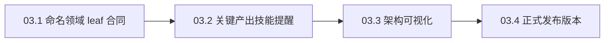

# Plan: 统一领域技能与三宿主发布内容

**Goal:** 让 MMW 正式发布命名领域 leaf、标准 Map 与权威引用合同，并让关键产出技能、三宿主产物、架构图和版本字段保持一致。
**Source spec:** `docs/specs/feat-context-doc-contracts/feat-context-doc-contracts.md`
**Source ticket:** GitHub issue `#17`
**Blocked by:** Plan 02，GitHub issue `#16`。Plan 02 又依赖 Plan 01，GitHub issue `#15`。
**Architecture:** 目标仓库 `AGENTS.md` 是主 agent 与 subagent 的共同领域规则入口。领域建模技能只维护命名 leaf、标准 Map 和权威引用格式。六个关键产出技能各保留一条规则提醒。`mmw/skills/` 继续作为技能行为的唯一事实来源，现有物化器生成 Pi、Claude Code 与 Codex 三套发布产物。架构图展示同步、检查和消费入口。正式版本统一提升到 `0.9.0`。
**Tech stack:** Markdown 技能源、Python 3 技能物化器、GitHub 风格 Markdown、Mermaid、独立 HTML 可视化、JSON manifest、ShellCheck、Git 静态检查。

## Global Constraints

- Plan 01 必须先集成，并让 `mmw/cli/mmw skills materialize --host all --check` 和 `python3 mmw/codex/runtime.py materialize --check` 同时返回 `0`。零漂移基线未成立时，不得运行写入模式的 Pi 物化。
- Plan 02 拥有领域规则种子、`context_docs.py`、init、domain 和 doctor CLI。Plan 03 只消费 Plan 02 的公开命令、输出和 marker，不复制或修改检查逻辑。
- 目标仓库 `AGENTS.md` 覆盖主 agent 与 subagent。关键产出技能只增加一句短提醒，不复制完整领域消费逻辑，也不向 subagent task 注入 leaf 路径。
- 多上下文 Map 的 `Contexts` 固定使用 `Context`、`Leaf`、`Owns` 三列表格。`Relationships` 保持非空自然语言列表。
- 多上下文 leaf 可以是 `context` 目录或其子目录中的命名 Markdown 文件。技能不得假定 leaf 文件名是 `CONTEXT.md`。
- 权威引用固定使用 `(authoritative: [显示文本](相对路径))`。目标必须是同一 Map 已登记的 leaf。
- `mmw/skills/` 是流程判据的唯一事实来源。Pi、Claude Code 与 Codex 产物只由现有物化器生成，禁止手工编辑。
- 宿主动作块由物化器整块替换。技能源和物化产物不得加入宿主二选一逻辑。
- 改技能前完整读取对应 `SKILL.md` 及其链接的 reference。有 Matt Pocock 上游对应项时，还要按根 `AGENTS.md` 读取上游方法论并核对偏离依据。
- `archive/` 和 `vendor/` 是冻结内容。本 plan 不修改 AgentFlow 仓库。
- 本仓库不保留自动化测试、测试夹具或测试套件。行为检查使用运行后清理的临时 Git 仓库，并执行根 `TESTING.md` 的全部静态检查。
- 本 plan 不执行 `git push`、远端合并、部署或正式发布。对外发布仍需用户单独批准。

## File / Responsibility Map

### 技能源与三宿主产物

| 类型 | 源或产物 | 责任 |
| --- | --- | --- |
| Modify | `mmw/skills/mmw-domain-modeling/SKILL.md` | 让领域建模流程按目标 `AGENTS.md` 选路，并使用命名 Markdown leaf。 |
| Modify | `mmw/skills/mmw-domain-modeling/CONTEXT-FORMAT.md` | 发布标准 Map 三列表格、自然语言关系和权威引用格式。 |
| Modify | `mmw/skills/mmw-prototype/SKILL.md` | 增加一条目标 `AGENTS.md` 领域规则提醒。 |
| Modify | `mmw/skills/mmw-to-tickets/SKILL.md` | 增加一条目标 `AGENTS.md` 领域规则提醒。 |
| Modify | `mmw/skills/mmw-to-plan/SKILL.md` | 增加一条目标 `AGENTS.md` 领域规则提醒。 |
| Modify | `mmw/skills/mmw-planner/SKILL.md` | 增加一条目标 `AGENTS.md` 领域规则提醒。 |
| Modify | `mmw/skills/mmw-closing/SKILL.md` | 增加一条目标 `AGENTS.md` 领域规则提醒。 |
| Modify | `mmw/skills/mmw-integrate/SKILL.md` | 增加一条目标 `AGENTS.md` 领域规则提醒。 |
| Modify | `TESTING.md` | 把三宿主技能物化检查固定登记为提交前检查，并保留 Codex runtime 物化检查。 |

下表每行的三个文件由对应的 `mmw/skills/` 相对路径生成。任务包不得手改这些文件。

| Pi 产物 | Claude Code 产物 | Codex 产物 |
| --- | --- | --- |
| `mmw/skills-pi/mmw-domain-modeling/SKILL.md` | `mmw/skills-claude-code/mmw-domain-modeling/SKILL.md` | `mmw/skills-codex/mmw-domain-modeling/SKILL.md` |
| `mmw/skills-pi/mmw-domain-modeling/CONTEXT-FORMAT.md` | `mmw/skills-claude-code/mmw-domain-modeling/CONTEXT-FORMAT.md` | `mmw/skills-codex/mmw-domain-modeling/CONTEXT-FORMAT.md` |
| `mmw/skills-pi/mmw-prototype/SKILL.md` | `mmw/skills-claude-code/mmw-prototype/SKILL.md` | `mmw/skills-codex/mmw-prototype/SKILL.md` |
| `mmw/skills-pi/mmw-to-tickets/SKILL.md` | `mmw/skills-claude-code/mmw-to-tickets/SKILL.md` | `mmw/skills-codex/mmw-to-tickets/SKILL.md` |
| `mmw/skills-pi/mmw-to-plan/SKILL.md` | `mmw/skills-claude-code/mmw-to-plan/SKILL.md` | `mmw/skills-codex/mmw-to-plan/SKILL.md` |
| `mmw/skills-pi/mmw-planner/SKILL.md` | `mmw/skills-claude-code/mmw-planner/SKILL.md` | `mmw/skills-codex/mmw-planner/SKILL.md` |
| `mmw/skills-pi/mmw-closing/SKILL.md` | `mmw/skills-claude-code/mmw-closing/SKILL.md` | `mmw/skills-codex/mmw-closing/SKILL.md` |
| `mmw/skills-pi/mmw-integrate/SKILL.md` | `mmw/skills-claude-code/mmw-integrate/SKILL.md` | `mmw/skills-codex/mmw-integrate/SKILL.md` |

### 架构图与版本登记

| 类型 | 文件 | 责任 |
| --- | --- | --- |
| Modify | `mmw-skill-map.html` | 展示领域规则同步、领域检查、目标 `AGENTS.md` 消费入口、标准 Map 和命名 leaf。 |
| Modify | `.claude-plugin/marketplace.json` | 把插件条目版本和 marketplace 顶层版本同步为 `0.9.0`。 |
| Modify | `mmw/.codex-plugin/plugin.json` | 把 Codex plugin 版本同步为 `0.9.0`。 |
| Modify | `mmw/.claude-plugin/plugin.json` | 把 Claude Code plugin 版本同步为 `0.9.0`。 |
| Modify | `mmw/package.json` | 把 Pi package 版本同步为 `0.9.0`。 |
| Test | 不创建测试文件 | 使用临时领域仓库、物化检查、JSON 校验、ShellCheck、浏览器验收和 `git diff --check`。 |

## 小块清单

### 03.1 发布命名领域 leaf 合同

- **要做什么：** 更新领域建模技能和领域格式，并物化对应的六个三宿主产物。
- **验收：** 标准 Map 使用固定三列表格；命名 leaf 和子目录 leaf 可用；权威引用指向已登记 leaf；公开领域检查接受按新格式建立的临时仓库；三宿主产物无漂移。
- **被谁阻塞：** Plan 02 已集成，Plan 01 零漂移基线已集成。
- **执行方式：** AFK。

### 03.2 发布关键产出技能提醒

- **要做什么：** 在原型、ticket、plan 编排、plan 写作、Wiki 和集成取舍六条路径各增加同一句目标 `AGENTS.md` 规则提醒，并物化对应的十八个三宿主产物。
- **验收：** 六份技能源各只新增一条提醒；没有复制消费逻辑；现有 subagent task 不增加 leaf 路径；三宿主产物无漂移。
- **被谁阻塞：** 03.1。
- **执行方式：** AFK。

### 03.3 同步架构可视化

- **要做什么：** 更新根架构图中 init、domain、doctor、目标 `AGENTS.md`、Map 和命名 leaf 的关系，并在浏览器验证两张图。
- **验收：** 第一张图能追出规则同步、合同检查和关键技能消费入口；第二张图不再暗示固定 leaf 文件名；桌面和窄屏没有新增遮挡或不可读节点。
- **被谁阻塞：** 03.2。
- **执行方式：** AFK。

### 03.4 同步正式发布版本

- **要做什么：** 把四个正式发布文件中的五个版本字段统一提升到 `0.9.0`，再执行全仓静态检查。
- **验收：** 五个字段全部等于 `0.9.0`；JSON、三宿主物化、Codex runtime、ShellCheck 和空白检查通过；不执行正式发布。
- **被谁阻塞：** 03.3。
- **执行方式：** AFK。

## Ticket 验收覆盖

| GitHub issue `#17` 验收标准 | 任务包 |
| --- | --- |
| 命名 Markdown leaf、标准 Map 表格和权威引用 | 03.1 |
| 关键技能只增加目标 `AGENTS.md` 提醒，不复制逻辑或注入 leaf 路径 | 03.2 |
| Pi、Claude Code 与 Codex 三套产物和技能源一致 | 03.1、03.2 |
| 根架构图展示规则同步、领域检查和消费入口 | 03.3 |
| 所有正式发布入口使用同一新版本 | 03.4 |

## Dependency Graph

03.1 先消费 Plan 02 的领域检查合同。03.2 在新的领域合同已经物化后追加关键入口。03.3 只展示已经完成的发布行为。03.4 最后登记完整交付物的版本。

## 发布风险与人工审批关卡

| 风险面 | 任务包 | Risk flag | 要不要提前发起审查 | 人工审批关卡由谁批准 |
| --- | --- | --- | --- | --- |
| 文档格式与 doctor 合同不一致 | 03.1 | `domain-contract`、`cross-plan-interface` | 要。审查标准 Map 和临时仓库的 `mmw domain check` 结果。 | 无。格式已由 spec 批准。 |
| 六个技能复制规则或向 task 注入路径 | 03.2 | `agent-context`、`generated-release-artifacts` | 要。审查六份源 diff 和十八份产物范围。 | 无。提醒文字和边界已由 spec 批准。 |
| 架构图遗漏入口或视觉回退 | 03.3 | `architecture-visualization` | 要。审查 Mermaid 语义和浏览器结果。 | 无。图只同步已经批准的行为。 |
| 发布入口版本不一致 | 03.4 | `release-metadata` | 要。审查五个字段和完整 JSON 校验。 | 正式发布和推送由用户另行批准；本包只登记版本。 |

### Task Pack 03.1: 发布命名领域 leaf 合同

**Ticket:** GitHub issue `#17`
**Goal behavior:** 领域建模技能发布与 Plan 02 checker 一致的标准 Map、命名 Markdown leaf 和权威引用合同，Pi、Claude Code 与 Codex 获得同一行为。
**Why this matters:** agent 需要在不假定 `CONTEXT.md` 文件名的前提下找到正确 bounded context，并让跨上下文术语只有一个权威定义。
**Owned files:** Modify 下表八个文件。六个宿主产物由物化器拥有完整字节，禁止按行手改。

| 技能源 | Pi 产物 | Claude Code 产物 | Codex 产物 |
| --- | --- | --- | --- |
| `mmw/skills/mmw-domain-modeling/SKILL.md:8` | `mmw/skills-pi/mmw-domain-modeling/SKILL.md` | `mmw/skills-claude-code/mmw-domain-modeling/SKILL.md` | `mmw/skills-codex/mmw-domain-modeling/SKILL.md` |
| `mmw/skills/mmw-domain-modeling/CONTEXT-FORMAT.md:1` | `mmw/skills-pi/mmw-domain-modeling/CONTEXT-FORMAT.md` | `mmw/skills-claude-code/mmw-domain-modeling/CONTEXT-FORMAT.md` | `mmw/skills-codex/mmw-domain-modeling/CONTEXT-FORMAT.md` |

**Verified current state:** 2026-08-05 验证到领域建模技能在 `map` 形态下要求每个上下文读取固定名 `CONTEXT.md`，示例也只使用 `ordering/CONTEXT.md` 和 `billing/CONTEXT.md`（`mmw/skills/mmw-domain-modeling/SKILL.md:12`、`mmw/skills/mmw-domain-modeling/SKILL.md:35`）。领域格式使用 Markdown 列表表达 `Contexts`，没有 `Owns` 列，也没有权威引用格式（`mmw/skills/mmw-domain-modeling/CONTEXT-FORMAT.md:32`）。物化器枚举 `mmw/skills/` 的完整文件集合，并把同一相对路径生成到三个宿主目录（`mmw/cli/lib/materialize_skills.py:333`、`mmw/cli/lib/materialize_skills.py:344`）。当前 worktree 的全宿主检查仍报告 Plan 01 已认领的四十二个既有漂移，Codex runtime 检查返回 `0`；本任务包必须等待 Plan 01 和 Plan 02 集成后重新确认零漂移基线。

**先读：** spec 的 `Implementation Decisions` 第 8 至 14 项、`Testing Decisions`、`Contract Boundaries`、`Cross-Plan Contract Anchors`；Plan 02 的 `Cross-Plan CLI Contract`；`AGENTS.md:38` 的唯一事实来源、`AGENTS.md:61` 的技能修改规则、`AGENTS.md:78` 的领域路径规则；`TESTING.md:3`、`TESTING.md:5` 与 `TESTING.md:22`；`mmw/skills/mmw-domain-modeling/SKILL.md`、`mmw/skills/mmw-domain-modeling/CONTEXT-FORMAT.md` 和 `mmw/skills/mmw-domain-modeling/ADR-FORMAT.md` 全文。

**Interfaces:**

- **Consumes:** Plan 02 的 `mmw domain sync`、`mmw domain check` 和 marker 字面量。`domain sync` 成功时按目标输出四列 TSV。`domain check` 成功时输出 `check<TAB><none|single|map><TAB><仓库相对路径或 -><TAB>valid`，失败时 stdout 为空、诊断写 stderr 并返回 `1`。
- **Produces:** 领域格式文档和领域建模流程。Map 项目区块固定含 `## Contexts` 三列表格与非空 `## Relationships` 列表；leaf 可以是 `context` 目录或其子目录中的命名 `.md` 文件；权威引用使用固定格式并指向已登记 leaf。相同相对路径的六个三宿主产物由物化器生成。

**Contract anchors:** 文件归属方是 Plan 03。Plan 02 提供两个受管 marker、同步命令和 checker；本包消费这些公开合同，不修改种子或 checker。MMW 技能源提供领域格式，Pi、Claude Code 与 Codex 产物消费同一源。后续 AgentFlow 迁移只消费正式发布内容。

**Schema / API shapes:** `Contexts` 的表头和顺序精确为 `Context`、`Leaf`、`Owns`。`Context` 是非空唯一名称。`Leaf` 整格是一个 Markdown 链接，目标相对 Map 解析，解析后位于 `mmw domain dirs` 的 `context` 目录内，并以 `.md` 结尾。`Owns` 是非空自然语言所有权说明。`Relationships` 是至少含一项的 Markdown 列表。共享术语在非权威 leaf 使用 `(authoritative: [显示文本](相对路径))`，路径相对当前 leaf 解析，并指向 `Contexts` 已登记的 leaf。领域格式只点名 `<!-- MMW-CONTEXT-MAP-RULES-START -->` 和 `<!-- MMW-CONTEXT-MAP-RULES-END -->` 的所有权；完整受管正文继续由 Plan 02 的 `mmw domain sync` 安装，不复制到技能。

**Mockup specs:** 不适用。本任务包没有界面或原型。

**Do Not Touch:** 不修改 Plan 02 的 `mmw/cli/seeds/AGENTS-domain-context.md`、`mmw/cli/seeds/CONTEXT-MAP-rules.md`、`mmw/cli/lib/context_docs.py`、`mmw/cli/lib/domain.sh`、`mmw/cli/lib/init.sh` 或 `mmw/cli/mmw`；不修改关键产出技能、其物化产物、架构图、版本字段或 AgentFlow；不手工编辑三宿主产物；不把固定 leaf 文件名重新写入 `map` 合同。

**Fixture bootstrap:** 在源仓库执行 `source_root="$(git rev-parse --show-toplevel)"` 和 `fixture_root="$(mktemp -d)"`。在 `${fixture_root}` 建隔离 Git 仓库，复制 `mmw/cli/mmw.default.json` 为 `.mmw.json`，配置仓库级 Git 用户。先提交 `.mmw.json`、已有 Map 和 leaf，使 Plan 02 的 Git 状态保护允许同步。随后在 `${fixture_root}` 运行 `MMW_HOST=codex "${source_root}/mmw/cli/mmw" domain sync`，安装 AGENTS 与 Map 受管区块。只清理本包创建的 `${fixture_root}`。

**Acceptance criteria:**

1. [ ] `map` 形态的领域建模流程要求先读 Map，再读本次相关的全部命名 leaf，不再假定 leaf 名为 `CONTEXT.md`。
2. [ ] 领域格式展示精确三列表头、至少两个命名 leaf 示例和至少一个 `context` 子目录 leaf 示例。
3. [ ] 领域格式说明 `Relationships` 是非空自然语言列表，不引入端点或所有权机器语法。
4. [ ] 领域格式展示精确的 `authoritative` 引用形状，并规定目标必须是 Map 已登记 leaf。
5. [ ] 领域格式把受管规则交给 `mmw domain sync`，不复制 Plan 02 种子的完整正文。
6. [ ] 按新格式建立的临时 `map` 仓库通过 `mmw domain check`。沿用当前 Markdown 列表格式的临时仓库返回 `invalid-context-table`。
7. [ ] Pi、Claude Code 与 Codex 的六个产物均由现有物化器生成，并与两份技能源逐字节一致。
8. [ ] `mmw/cli/mmw skills materialize --host all --check` 和 `python3 mmw/codex/runtime.py materialize --check` 均返回 `0`。
9. [ ] 本包实现 diff 只包含 Owned files 表中的八个文件，且 `git diff --check` 返回 `0`。

**Verification commands:**

- `mmw/cli/mmw skills materialize --host all --check` → Expected: 开工时返回 `0`。任何 Plan 01 漂移仍存在时停止本包。
- 在旧列表 Map fixture 运行 `MMW_HOST=codex "${source_root}/mmw/cli/mmw" domain check` → Expected: 退出码 `1`，stdout 为空，stderr 包含 Map 相对路径和 `invalid-context-table`。
- 在标准三列表格 fixture 登记 `docs/context/ordering.md` 与 `docs/context/billing/billing-language.md`，并让 Billing leaf 用 `(authoritative: [Customer](../ordering.md))` 指向 Ordering leaf；运行同一检查 → Expected: 输出 `check<TAB>map<TAB>CONTEXT-MAP.md<TAB>valid`，退出码 `0`。
- `mmw/cli/mmw skills materialize --host all` → Expected: 三个宿主目录生成成功；实现 diff 新增六个领域技能产物变化。
- `mmw/cli/mmw skills materialize --host all --check` → Expected: 退出码 `0`，不报告 `缺`、`多` 或 `异`。
- `python3 mmw/codex/runtime.py materialize --check` → Expected: 退出码 `0`，无差异输出。
- `git diff --name-only -- mmw/skills/mmw-domain-modeling mmw/skills-pi/mmw-domain-modeling mmw/skills-claude-code/mmw-domain-modeling mmw/skills-codex/mmw-domain-modeling` → Expected: 只列出 Owned files 表中的八个路径。
- `git diff --check` → Expected: 退出码 `0`，无输出。

**Browser acceptance:** 不适用。本任务包没有界面行为。

**Testing pyramid:**

| 层 | 测什么 | 数量 |
| --- | --- | ---: |
| 临时 Git 仓库行为检查 | 旧列表 Map 被拒绝；标准 Map、命名 leaf、子目录 leaf 和有效权威引用被接受。 | 2 个 fixture |
| 提交前静态检查 | 三宿主技能产物与技能源一致；Codex runtime 输入一致；diff 没有空白错误。 | 3 条命令 |
| 真实宿主验证 | 静态物化检查不声明 Pi、Claude Code 或 Codex App 的真实加载路径已经通过。 | 0 |

**Rollback:** 回滚本任务包提交会恢复旧领域格式和六个旧宿主产物，不修改 Plan 02 已安装的仓库规则或 checker。
**Complexity:** standard。改动跨两份技能源和三个宿主发布目录，并消费 Plan 02 的公开合同。
**Commit boundary:** 临时仓库检查和全部物化检查通过后，把两份技能源与六个生成产物放进一个提交。建议提交信息：`feat: publish named domain leaf contracts (#17)`。
**Risk flags:** `domain-contract`、`generated-release-artifacts`、`cross-plan-interface`。
**发布风险:** 文档与 checker 漂移会让 agent 遵循一个无法通过 doctor 的格式。标准 fixture 与物化检查必须同时通过。
**HITL 还是 AFK:** AFK。Map 列、路径边界和权威引用格式已由 spec 定死。
**Dependencies:** Plan 01 和 Plan 02 已完成、审查并集成；全宿主零漂移基线已经恢复。
**Out of scope:** Plan 02 的种子、checker 和 CLI；关键产出技能提醒；架构图；版本；AgentFlow 迁移；真实宿主运行验收。

#### Implementation tasks

- [ ] Step 1: 确认依赖基线。运行 `mmw/cli/mmw skills materialize --host all --check`、`python3 mmw/codex/runtime.py materialize --check` 和本 MMW 仓库的 `MMW_HOST=codex mmw/cli/mmw domain check`。预期三条命令返回 `0`；任一失败时停止，不用 Plan 03 物化覆盖 Plan 01 漂移。
- [ ] Step 2: 建立旧格式 red 证据。在隔离 fixture 写入当前 `Contexts` Markdown 列表、两个命名 leaf 和一条关系，运行 `domain sync` 后再运行 `domain check`。预期 checker 返回 `1` 和 `invalid-context-table`，证明当前发布格式与 Plan 02 合同不兼容。
- [ ] Step 3: 更新 `mmw-domain-modeling` 的两份技能源。Map 示例使用固定三列表格、命名 leaf、子目录 leaf、自然语言关系和固定权威引用；读取与写入流程遵守目标 `AGENTS.md`，不复制 Plan 02 种子正文。
- [ ] Step 4: 在同一 fixture 按新格式替换项目持有的 `Contexts`、`Relationships` 和 leaf 内容，保留 `domain sync` 管理的区块。运行 `domain check`，预期输出四列 `valid` 并返回 `0`。
- [ ] Step 5: 运行 `mmw/cli/mmw skills materialize --host all --check` 建立发布 red 证据。预期只报告三个宿主的六个领域技能产物为 `异`。
- [ ] Step 6: 运行 `mmw/cli/mmw skills materialize --host all` 生成六个产物，再运行全宿主检查和 Codex runtime 检查。预期两项检查都返回 `0`。
- [ ] Step 7: 检查本包 diff 只含两份源和六份产物，并确认三个宿主版本都保留对应宿主的技能引用展开，没有残留 `[[mmw-` 标记。
- [ ] Step 8: 运行 `git diff --check`。全部检查通过后，按本任务包的 Commit boundary 提交。

### Task Pack 03.2: 发布关键产出技能提醒

**Ticket:** GitHub issue `#17`
**Goal behavior:** 原型、ticket、plan 编排、plan 写作、Wiki 和集成取舍六条关键产出路径在开始时读取目标仓库 `AGENTS.md` 的领域上下文规则，且 subagent task 继续只携带原有材料，不携带 leaf 路径。
**Why this matters:** 所有关键产出需要使用同一套 canonical 术语和冲突处理规则，同时避免技能与仓库受管区块形成两份会漂移的消费逻辑。
**Owned files:** Modify 下表二十四个技能文件 / Modify `TESTING.md:5`。十八个宿主产物由物化器拥有完整字节，禁止按行手改。

| 技能源 | Pi 产物 | Claude Code 产物 | Codex 产物 |
| --- | --- | --- | --- |
| `mmw/skills/mmw-prototype/SKILL.md:6` | `mmw/skills-pi/mmw-prototype/SKILL.md` | `mmw/skills-claude-code/mmw-prototype/SKILL.md` | `mmw/skills-codex/mmw-prototype/SKILL.md` |
| `mmw/skills/mmw-to-tickets/SKILL.md:20` | `mmw/skills-pi/mmw-to-tickets/SKILL.md` | `mmw/skills-claude-code/mmw-to-tickets/SKILL.md` | `mmw/skills-codex/mmw-to-tickets/SKILL.md` |
| `mmw/skills/mmw-to-plan/SKILL.md:6` | `mmw/skills-pi/mmw-to-plan/SKILL.md` | `mmw/skills-claude-code/mmw-to-plan/SKILL.md` | `mmw/skills-codex/mmw-to-plan/SKILL.md` |
| `mmw/skills/mmw-planner/SKILL.md:7` | `mmw/skills-pi/mmw-planner/SKILL.md` | `mmw/skills-claude-code/mmw-planner/SKILL.md` | `mmw/skills-codex/mmw-planner/SKILL.md` |
| `mmw/skills/mmw-closing/SKILL.md:6` | `mmw/skills-pi/mmw-closing/SKILL.md` | `mmw/skills-claude-code/mmw-closing/SKILL.md` | `mmw/skills-codex/mmw-closing/SKILL.md` |
| `mmw/skills/mmw-integrate/SKILL.md:6` | `mmw/skills-pi/mmw-integrate/SKILL.md` | `mmw/skills-claude-code/mmw-integrate/SKILL.md` | `mmw/skills-codex/mmw-integrate/SKILL.md` |

**Verified current state:** 2026-08-05 验证到六份技能源都没有“遵守目标仓库 `AGENTS.md` 的领域上下文规则”这一条统一入口。`mmw-to-tickets` 只在拆分阶段要求领域术语和 ADR（`mmw/skills/mmw-to-tickets/SKILL.md:32`）；`mmw-to-plan` 的 `planner` task 四栏表没有 leaf 路径（`mmw/skills/mmw-to-plan/SKILL.md:47`）；`mmw-planner` 读取仓库规则以获取模块、测试与命名事实，但没有点名领域上下文受管规则（`mmw/skills/mmw-planner/SKILL.md:27`）。`mmw-prototype` 的宿主动作只准备任务 worktree（`mmw/skills/mmw-prototype/SKILL.md:63`）；`mmw-integrate` 的宿主动作只继续或清理结果 worktree（`mmw/skills/mmw-integrate/SKILL.md:44`、`mmw/skills/mmw-integrate/SKILL.md:81`）。本包开始时，03.1 已让全宿主物化检查恢复为 green。

**Root cause:** 根 `TESTING.md` 当前只固定运行 `python3 mmw/codex/runtime.py materialize --check`，没有登记 `mmw/cli/mmw skills materialize --host all --check`（`TESTING.md:5`）。Codex runtime 检查只能阻止 Codex 产物漂移，无法阻止 Pi 与 Claude Code 产物再次漂移。

**先读：** spec 的 `Implementation Decisions` 第 13 至 14 项、`Testing Decisions` 的“技能与 Codex 物化检查” seam、`Contract Boundaries` 和 `Cross-Plan Contract Anchors`；`AGENTS.md:38` 的唯一事实来源、`AGENTS.md:61` 的技能修改规则、`AGENTS.md:78` 的领域路径规则；`TESTING.md:3`、`TESTING.md:5` 与 `TESTING.md:22`。完整读取六份 Owned 技能源；另完整读取 `mmw/skills/mmw-prototype/LOGIC.md`、`UI.md`、`EVIDENCE.md`、`capture.md`，`mmw/skills/mmw-planner/references/task-pack.md`、`self-check.md`，以及 `mmw/skills/mmw-integrate/merging.md`、`rebasing.md`。

**Interfaces:**

- **Consumes:** Plan 02 安装到目标仓库 `AGENTS.md` 的受管领域规则；03.1 已发布并物化的领域格式；现有 `[[mmw-launch:planner:current]]` 和三个宿主的动作展开规则。
- **Produces:** 六份技能源各新增精确一句 ``开始前，遵守目标仓库 `AGENTS.md` 的领域上下文规则。``；相同相对路径的十八个三宿主产物。现有 task 字段、宿主动作、退出条件和本地 reference 内容保持不变。

**Contract anchors:** 目标仓库 `AGENTS.md` 受管正文由 Plan 02 提供，六个技能只消费。MMW 技能源由 Plan 03 拥有，三宿主产物由现有物化器生成。`mmw-to-plan` 提供给 `planner` 的 task 继续使用目标、读、约束、验收四栏，不新增 leaf 字段或路径。

**Schema / API shapes:** 不新增命令、类型、字段或 task 结构。六份技能使用同一句提醒。提醒不包含 `mmw domain path`、`mmw domain dirs`、Map、leaf、ADR 的选择逻辑，也不复制任何受管 marker 或正文。

**Mockup specs:** 不适用。本任务包没有界面或原型。

**Do Not Touch:** 不修改六份技能链接的 reference；不修改领域建模技能；不修改 Plan 02 的种子、模块或 CLI；不改 `mmw-to-plan` 的四栏 task；不向任何 `[[mmw-launch:…]]`、`[[mmw-launch-group:…]]` 或 `[[mmw-host-action:…]]` 动作块注入 leaf 路径；不手工编辑三宿主产物；不修改架构图、版本或 AgentFlow。

**Acceptance criteria:**

1. [ ] 六份技能源各新增且只新增一句 ``开始前，遵守目标仓库 `AGENTS.md` 的领域上下文规则。``
2. [ ] 六份技能源不复制 `map`、`single`、`none` 选路、leaf 选择、ADR 选择、冲突处理或更新边界。
3. [ ] `mmw-to-plan` 的 `planner` task 继续只有目标、读、约束、验收四栏；读栏不出现 leaf 路径。
4. [ ] 所有宿主启动块和动作块保持原语义，生成产物没有残留 `[[mmw-` 标记。
5. [ ] Pi、Claude Code 与 Codex 的十八个产物均由现有物化器生成，并与六份技能源一致。
6. [ ] 根 `TESTING.md` 的提交前检查固定包含 `mmw/cli/mmw skills materialize --host all --check`，并保留 `python3 mmw/codex/runtime.py materialize --check`。
7. [ ] `mmw/cli/mmw skills materialize --host all --check` 和 `python3 mmw/codex/runtime.py materialize --check` 均返回 `0`。
8. [ ] 本包实现 diff 只包含 Owned files 表中的二十四个技能文件和根 `TESTING.md`，且 `git diff --check` 返回 `0`。

**Verification commands:**

- `git status --short` → Expected: 开工时没有输出。Pi 物化要求任务 worktree 干净。
- `mmw/cli/mmw skills materialize --host all --check` → Expected: 开工时返回 `0`，证明 03.1 和 Plan 01 产物已经同步。
- `git diff --unified=0 -- mmw/skills/mmw-prototype/SKILL.md mmw/skills/mmw-to-tickets/SKILL.md mmw/skills/mmw-to-plan/SKILL.md mmw/skills/mmw-planner/SKILL.md mmw/skills/mmw-closing/SKILL.md mmw/skills/mmw-integrate/SKILL.md` → Expected: 六份源各只有一条相同提醒的新增行；没有删除或修改 task、宿主动作和退出条件。
- `git diff --unified=3 -- TESTING.md` → Expected: 提交前静态检查新增 `mmw/cli/mmw skills materialize --host all --check`，并保留紧随其后的 `python3 mmw/codex/runtime.py materialize --check`。
- `mmw/cli/mmw skills materialize --host all` → Expected: 三个宿主目录生成成功；实现 diff 新增十八个关键技能产物变化。
- `mmw/cli/mmw skills materialize --host all --check` → Expected: 退出码 `0`，不报告 `缺`、`多` 或 `异`。
- `python3 mmw/codex/runtime.py materialize --check` → Expected: 退出码 `0`，无差异输出。
- `git diff --name-only -- TESTING.md mmw/skills/mmw-prototype mmw/skills/mmw-to-tickets mmw/skills/mmw-to-plan mmw/skills/mmw-planner mmw/skills/mmw-closing mmw/skills/mmw-integrate mmw/skills-pi mmw/skills-claude-code mmw/skills-codex` → Expected: 只列出 Owned files 中的二十四个技能路径和根 `TESTING.md`。
- `git diff --check` → Expected: 退出码 `0`，无输出。

**Browser acceptance:** 不适用。本任务包没有界面行为。

**Testing pyramid:**

| 层 | 测什么 | 数量 |
| --- | --- | ---: |
| 源与登记 diff 范围检查 | 六个消费入口各只增加一条提醒；task 和宿主动作未改；根 `TESTING.md` 同时登记全宿主与 Codex runtime 检查。 | 2 条命令 |
| 提交前静态检查 | 三宿主技能产物与技能源一致；Codex runtime 输入一致；diff 没有空白错误。 | 3 条命令 |
| 真实宿主验证 | 静态物化检查不声明 Pi、Claude Code 或 Codex App 的真实加载路径已经通过。 | 0 |

**Rollback:** 回滚本任务包提交会移除六条提醒、十八个生成产物变化和根 `TESTING.md` 的全宿主检查登记，03.1 的领域格式继续保留。
**Complexity:** standard。每份源改动很小，但发布面跨六个技能和三个宿主目录。
**Commit boundary:** 六份源 diff 符合单行约束且全部物化检查通过后，把六份技能源、十八个生成产物与根 `TESTING.md` 放进一个提交。建议提交信息：`feat: route output skills through domain rules (#17)`。
**Risk flags:** `agent-context`、`generated-release-artifacts`、`subagent-task-boundary`。
**发布风险:** 复制消费逻辑会在目标 `AGENTS.md` 升级后漂移。向 task 注入 leaf 路径会让 subagent 绕开仓库规则。源 diff 必须保持单行。
**HITL 还是 AFK:** AFK。提醒文字和禁止注入的边界已由 spec 定死。
**Dependencies:** 03.1 已完成并提交；全宿主物化检查处于 green。
**Out of scope:** 领域格式、Plan 02 文件、技能 reference、架构图、版本、AgentFlow 迁移和真实宿主运行验收。

#### Implementation tasks

- [ ] Step 1: 确认干净基线并完整读取六份技能源及其链接的 reference。运行 `git status --short` 和全宿主物化检查；预期工作区干净且检查返回 `0`。
- [ ] Step 2: 在六份技能源的开工说明处各增加精确一句提醒。不要改动其余正文、四栏 task、启动块或宿主动作块。
- [ ] Step 3: 在根 `TESTING.md` 的提交前静态检查中登记 `mmw/cli/mmw skills materialize --host all --check`，并保留 `python3 mmw/codex/runtime.py materialize --check`。
- [ ] Step 4: 查看六份源和根 `TESTING.md` 的零上下文 diff。预期每份技能文件只有一条相同新增行；测试规则同时包含全宿主与 Codex runtime 检查。
- [ ] Step 5: 运行全宿主物化检查建立发布 red 证据。预期只报告三个宿主的十八个对应产物为 `异`。
- [ ] Step 6: 运行 `mmw/cli/mmw skills materialize --host all` 生成十八个产物。禁止手工修生成文件。
- [ ] Step 7: 重跑全宿主物化检查和 Codex runtime 检查。预期两项检查都返回 `0`，且所有产物没有残留物化 marker。
- [ ] Step 8: 检查本包 diff 只含六份源、十八份产物和根 `TESTING.md`，再运行 `git diff --check`。全部通过后，按本任务包的 Commit boundary 提交。

### Task Pack 03.3: 同步架构可视化

**Ticket:** GitHub issue `#17`
**Goal behavior:** 根架构可视化让维护者从 `mmw init` 追到目标 `AGENTS.md` 共同入口、Map 与命名 leaf，再追到 `mmw domain check`、doctor 和六个关键产出技能。
**Why this matters:** 架构图是仓库要求长期保留的当前 MMW 运行面。它必须与已经发布的领域同步和消费行为一致。
**Owned files:** Modify `mmw-skill-map.html:388`

**Verified current state:** 2026-08-05 验证到第一张图把 `mmw init` 描述为铺配置与测试骨架，没有领域规则同步（`mmw-skill-map.html:431`）。`mmw domain` 只列 `path`、`dirs` 与 `adr-next`，doctor 只写机器依赖检查（`mmw-skill-map.html:439`、`mmw-skill-map.html:442`）。领域文档节点仍写 Map 按 `CONTEXT-MAP.md` 索引，并暗示 `single` 才使用根 `CONTEXT.md`（`mmw-skill-map.html:492`）。第二张图的领域节点只写 `mmw domain path` 和追加术语，没有目标 `AGENTS.md` 共同入口或命名 leaf（`mmw-skill-map.html:801`）。第一张图使用硬编码 `linkStyle` 索引（`mmw-skill-map.html:623`），因此本包只更新现有节点和边文字，不新增或删除边。

**先读：** spec 的 `Implementation Decisions` 第 1、6、7、12、13、16 项、`Contract Boundaries` 与 `Cross-Plan Contract Anchors`；Plan 02 的 `Cross-Plan CLI Contract`；03.1 与 03.2 的提交和验收结果；`AGENTS.md:30` 的根架构图责任、`AGENTS.md:46` 的宿主边界；`TESTING.md:3`、`TESTING.md:5` 与 `TESTING.md:22`；`mmw-skill-map.html:388` 至第一张图末尾，以及 `mmw-skill-map.html:702` 至第二张图末尾。

**Interfaces:**

- **Consumes:** Plan 02 提供的 `mmw domain sync`、`mmw domain check`、doctor 领域状态和目标 `AGENTS.md` 受管规则；03.1 提供的标准 Map、命名 leaf 与权威引用；03.2 提供的六个技能消费入口。
- **Produces:** 两张 Mermaid 图中的当前架构说明。第一张图展示同步、检查、共同消费入口和六个消费者；第二张图展示 map 分支中的目标 `AGENTS.md`、Map、命名 leaf 与 ADR 归属。

**Contract anchors:** `mmw-skill-map.html` 由 Plan 03 拥有。Plan 02 是同步与检查行为的提供方，03.1 和 03.2 是发布内容的提供方，仓库维护者是可视化消费方。图只描述公开行为，不新定义命令或文件合同。

**Schema / API shapes:** 不适用。本任务包不新增接口。第一张图必须原位更新以下内容：`set` 节点点名同步 AGENTS 受管区块、已有 Map 规则和 Claude bridge；`cl4` 节点列出 `path`、`dirs`、`adr-next`、`sync`、`check`；`cl7` 节点点名领域合同检查；`dmo` 与 `ctx` 节点显示目标 `AGENTS.md` 是共同入口、Map 使用三列表格、leaf 是命名 Markdown 文件且支持权威引用；`pro`、`ttk`、`pln`、`pnr`、`clo`、`intg` 六个节点各显示开工遵守目标 `AGENTS.md` 领域规则。第二张图只更新现有 `ctx` 节点，显示共同入口、命名 leaf 和 ADR 随 map 分支进入最终目标。

**Mockup specs:** 无选中原型。保持现有暖底、冷底、双边框、圆柱、斜框与胶囊视觉语言；保持现有颜色、字体、缩放控件、两图布局和连线样式。新增文字使用现有 ` ·` 分行形式，不增加第三张图。

**Do Not Touch:** 不修改技能、CLI、manifest、版本或 AgentFlow；不改第一张图的节点标识符、边数量、边次序或 `linkStyle` 索引；不改第二张图除 `ctx` 节点以外的业务内容；不重写 HTML 中的 frame runtime、Mermaid bundle、缩放脚本或边标签布局脚本；不为了容纳文字另建架构文档。

**Acceptance criteria:**

1. [ ] 第一张图的 `mmw init` 节点展示 AGENTS 受管区块、已有 Map 规则和 Claude bridge 同步。
2. [ ] 第一张图的 `mmw domain` 节点同时列出 `path`、`dirs`、`adr-next`、`sync` 与 `check`；doctor 节点明确包含领域合同检查。
3. [ ] 第一张图把目标 `AGENTS.md` 标成主 agent 与 subagent 的共同领域消费入口，并展示 Map 三列表格、命名 Markdown leaf 和权威引用。
4. [ ] `mmw-prototype`、`mmw-to-tickets`、`mmw-to-plan`、`mmw-planner`、`mmw-closing` 与 `mmw-integrate` 六个节点都能看出开工读取目标 `AGENTS.md` 领域规则。
5. [ ] 第二张图不再暗示固定 leaf 文件名，并展示目标 `AGENTS.md`、命名 leaf 与 ADR 在 map 分支中的归属。
6. [ ] 第一张图的边数量、边次序和 `linkStyle` 索引保持不变。两张 Mermaid 图均成功渲染。
7. [ ] 在 1440×900 和 390×844 viewport 下，标题、图例、两个画布和缩放控件可见；新增节点文字没有互相遮挡；画布仍可水平滚动。
8. [ ] 本包实现 diff 只包含 `mmw-skill-map.html`，且 `git diff --check` 返回 `0`。

**Verification commands:**

- `git diff --unified=3 -- mmw-skill-map.html` → Expected: diff 只修改两张图中约定的现有节点文字；没有 runtime、脚本、节点标识符、边或 `linkStyle` 变化。
- 在仓库根启动一次性静态 HTTP 服务，并按安装的 `playwright-cli` 技能打开 `/mmw-skill-map.html` → Expected: 控制台没有 Mermaid 解析错误，两张 `.mermaid-diagram` 都生成 SVG。
- `git diff --name-only` → Expected: 本包提交前只列 `mmw-skill-map.html`。
- `git diff --check` → Expected: 退出码 `0`，无输出。

**Browser acceptance:** 主 agent 通过仓库要求的浏览器流程检查 `mmw-skill-map.html`。桌面 viewport 使用 1440×900，窄屏 viewport 使用 390×844。两种 viewport 都检查第一张图的 init、domain、doctor、共同消费入口和六个技能节点，再检查第二张图的领域节点。点击每张图的放大、缩小与实际大小按钮，确认读数变化、图仍可滚动且没有新增遮挡。浏览器走查与 `playwright-cli` 渲染检查都通过后才验收本包。

**Testing pyramid:**

| 层 | 测什么 | 数量 |
| --- | --- | ---: |
| 浏览器渲染检查 | 两张 Mermaid 图成功渲染，控制台无解析错误，缩放控件可用。 | 2 个 viewport |
| diff 范围检查 | 只改约定节点文字，不改边、样式索引或运行时。 | 1 条命令 |
| 真实宿主验证 | 本文件是独立 HTML 架构产物，不声明五个真实宿主的产品运行路径已经通过。 | 0 |

**Rollback:** 回滚本任务包提交会恢复旧架构图，不影响 03.1 和 03.2 已发布的技能行为。
**Complexity:** standard。只修改一个文件，但文件包含两张图、固定连线索引和内嵌运行时。
**Commit boundary:** 两个 viewport 的浏览器验收和静态检查通过后，单独提交 `mmw-skill-map.html`。建议提交信息：`docs: map domain context publication flow (#17)`。
**Risk flags:** `architecture-visualization`、`mermaid-layout`、`bundled-html`。
**发布风险:** 图文遗漏会让维护者继续按旧的固定 leaf 假设操作。误改连线或内嵌运行时会让整个可视化失效。
**HITL 还是 AFK:** AFK。图展示的行为和视觉语言已经由 spec 与现有文件定死；主 agent 仍需执行浏览器验收。
**Dependencies:** 03.2 已完成并提交；Plan 02 的 CLI 合同和 03.1、03.2 的最终发布内容已经可读。
**Out of scope:** 新增图表、重新设计视觉系统、修改图中其他工作流、修改 CLI、技能、版本或 AgentFlow。

#### Implementation tasks

- [ ] Step 1: 用浏览器打开当前 `mmw-skill-map.html` 建立 red 证据。确认当前第一张图缺少 `domain sync`、`domain check`、目标 `AGENTS.md` 共同入口和六个技能提醒，第二张图仍只写通用领域文档。
- [ ] Step 2: 原位更新第一张图的 `set`、`cl4`、`cl7`、`dmo`、`ctx`、`pro`、`ttk`、`pln`、`pnr`、`clo`、`intg` 节点文字。保留所有节点标识符、边和 `linkStyle`。
- [ ] Step 3: 原位更新第二张图的 `ctx` 节点文字。保留该图其他节点、边和样式不变。
- [ ] Step 4: 检查 HTML diff。预期只有约定节点的可见文案变化，没有 runtime、脚本、CSS、边或样式索引变化。
- [ ] Step 5: 使用 `playwright-cli` 渲染两张图，并由主 agent 在 1440×900 和 390×844 viewport 完成 Browser acceptance。任何 Mermaid 解析错误、文字遮挡或缩放回退都先在本包修正。
- [ ] Step 6: 运行 `git diff --check`，确认本包只改 `mmw-skill-map.html`。全部通过后，按本任务包的 Commit boundary 提交。

### Task Pack 03.4: 同步正式发布版本

**Ticket:** GitHub issue `#17`
**Goal behavior:** Codex、Claude Code marketplace、Claude Code plugin 与 Pi package 的五个正式版本字段统一声明 `0.9.0`，完整发布内容通过仓库静态检查。
**Why this matters:** 安装器和宿主需要把领域上下文合同识别为同一版 MMW，避免不同发布面报告不同版本。
**Owned files:** Modify `.claude-plugin/marketplace.json:13` / Modify `mmw/.codex-plugin/plugin.json:3` / Modify `mmw/.claude-plugin/plugin.json:3` / Modify `mmw/package.json:3`

**Verified current state:** 2026-08-05 验证到四个正式发布文件共有五个版本字段，当前全部是 `0.8.0`。根 Claude marketplace 同时持有插件条目版本和顶层版本（`.claude-plugin/marketplace.json:13`、`.claude-plugin/marketplace.json:31`）。Codex plugin、Claude Code plugin 与 Pi package 各持有一个版本字段（`mmw/.codex-plugin/plugin.json:3`、`mmw/.claude-plugin/plugin.json:3`、`mmw/package.json:3`）。根 Codex marketplace `.agents/plugins/marketplace.json` 没有版本字段，因此不进入本包 diff。

**先读：** spec 的 `Implementation Decisions` 第 16 项、`Cross-Plan Contract Anchors` 与 `Release Risk`；GitHub issue `#17` 的五条验收标准；`AGENTS.md:61` 的产品版本同步规则、`AGENTS.md:100` 的 Git 与安全边界、`AGENTS.md:105` 的提交检查；根 `TESTING.md` 全文；四个 Owned files 当前内容。

**Interfaces:**

- **Consumes:** 03.1 的领域格式与六个生成产物、03.2 的六个关键入口与十八个生成产物、03.3 的架构可视化，以及 Plan 02 已完成的同步与检查实现。
- **Produces:** `.claude-plugin/marketplace.json` 的 `plugins[0].version` 和顶层 `version`，`mmw/.codex-plugin/plugin.json` 的 `version`，`mmw/.claude-plugin/plugin.json` 的 `version`，`mmw/package.json` 的 `version`。五个值全部是字符串 `0.9.0`。

**Contract anchors:** 发布版本字段由 Plan 03 拥有。Codex App、Claude Code marketplace、Claude Code plugin 和 Pi package 分别消费对应字段。`.agents/plugins/marketplace.json` 继续只登记本地 Codex plugin 路径，不新增版本字段。后续正式发布流程消费 `0.9.0`，但本包不执行发布。

**Schema / API shapes:** 保持四份 JSON 的现有结构和字段顺序，只替换五个现有字符串值。目标映射固定如下：

| 文件 | JSON 字段 | 目标值 |
| --- | --- | --- |
| `.claude-plugin/marketplace.json` | `plugins[0].version` | `0.9.0` |
| `.claude-plugin/marketplace.json` | `version` | `0.9.0` |
| `mmw/.codex-plugin/plugin.json` | `version` | `0.9.0` |
| `mmw/.claude-plugin/plugin.json` | `version` | `0.9.0` |
| `mmw/package.json` | `version` | `0.9.0` |

**Mockup specs:** 不适用。本任务包没有界面或原型。

**Do Not Touch:** 不给 `.agents/plugins/marketplace.json` 新增版本字段；不修改 plugin 名称、路径、说明、作者、能力或依赖；不修改技能、物化产物、架构图、Plan 02 文件或 AgentFlow；不创建 Git tag；不执行 `git push`、部署或正式发布。

**Acceptance criteria:**

1. [ ] 四个 Owned files 中的五个版本字段全部等于 `0.9.0`，没有任何正式发布入口仍声明 `0.8.0`。
2. [ ] 四份 JSON 保持原有结构，除五个版本字符串外没有其他内容变化。
3. [ ] 根 `TESTING.md` 列出的七个 JSON 校验全部通过。
4. [ ] 全宿主技能物化检查和 Codex runtime 物化检查同时返回 `0`。
5. [ ] 根 `TESTING.md` 的完整 ShellCheck 与 `git diff --check` 返回 `0`。
6. [ ] 本包实现 diff 只包含四个 Owned files；没有 tag、推送、部署或正式发布动作。

**Verification commands:**

- `python3 -c 'import json; from pathlib import Path; root=json.loads(Path(".claude-plugin/marketplace.json").read_text()); values=[root["plugins"][0]["version"],root["version"],json.loads(Path("mmw/.codex-plugin/plugin.json").read_text())["version"],json.loads(Path("mmw/.claude-plugin/plugin.json").read_text())["version"],json.loads(Path("mmw/package.json").read_text())["version"]]; assert values == ["0.9.0"] * 5, values'` → Expected: 修改前以五个 `0.8.0` 的断言信息失败；修改后退出码 `0`。
- `python3 -m json.tool .agents/plugins/marketplace.json >/dev/null`、`python3 -m json.tool .claude-plugin/marketplace.json >/dev/null`、`python3 -m json.tool mmw/codex/profiles.json >/dev/null`、`python3 -m json.tool mmw/.codex-plugin/plugin.json >/dev/null`、`python3 -m json.tool mmw/.mcp-codex.json >/dev/null`、`python3 -m json.tool mmw/.claude-plugin/plugin.json >/dev/null`、`python3 -m json.tool mmw/package.json >/dev/null` → Expected: 七条命令全部返回 `0`。
- `mmw/cli/mmw skills materialize --host all --check` → Expected: 退出码 `0`，三宿主技能产物没有漂移。
- `python3 mmw/codex/runtime.py materialize --check` → Expected: 退出码 `0`，Codex plugin、agent 和技能物化输入没有漂移。
- `shellcheck --severity=warning mmw/cli/mmw mmw/cli/adapters/*.sh mmw/cli/lib/*.sh mmw/mcp/install-mcp.sh mmw/release/release-flow.sh` → Expected: 退出码 `0`，无 warning。
- `git diff --name-only` → Expected: 本包提交前只列四个 Owned files。
- `git diff --check` → Expected: 退出码 `0`，无输出。

**Browser acceptance:** 不适用。本任务包不改变界面；03.3 已独立完成架构图浏览器验收。

**Testing pyramid:**

| 层 | 测什么 | 数量 |
| --- | --- | ---: |
| 结构化版本检查 | 四个发布文件中的五个版本字段精确一致。 | 1 条命令 |
| 提交前静态检查 | 七份 JSON、三宿主技能、Codex runtime、Shell 与空白检查。 | 11 条命令 |
| 真实宿主验证 | 静态检查不声明 Codex App、Claude Code、Pi、Cursor 或 Windows 的真实发布路径已经通过。 | 0 |

**Rollback:** 回滚本任务包提交会把五个版本字段恢复为 `0.8.0`。03.1 至 03.3 的行为改动仍在仓库中，但不得以 `0.8.0` 对外发布这组新行为。
**Complexity:** cheap。只替换五个结构化字符串，但必须覆盖全部正式发布入口并执行完整检查。
**Commit boundary:** 五个版本字段和根 `TESTING.md` 的全部检查通过后，把四个 JSON 文件放进一个提交。建议提交信息：`release: bump MMW to 0.9.0`。
**Risk flags:** `release-metadata`、`cross-host-version`。
**发布风险:** 漏改任一字段会让宿主读取不同版本。版本提交完成仍不等于正式发布，推送和发布必须另过用户人工审批关卡。
**HITL 还是 AFK:** AFK。版本目标和字段集合已经明确；正式发布不在本 ticket。
**Dependencies:** 03.1、03.2 与 03.3 已完成、审查并提交。
**Out of scope:** Git tag、push、远端 release、plugin 安装、部署、真实宿主发布验收和 AgentFlow 迁移。

#### Implementation tasks

- [ ] Step 1: 确认前三个任务包已经提交且工作区干净。运行结构化版本命令建立 red 证据，预期断言显示五个当前值都是 `0.8.0`。
- [ ] Step 2: 只把四个 Owned files 中的五个现有版本字符串改为 `0.9.0`，不调整 JSON 结构或其他字段。
- [ ] Step 3: 重跑结构化版本命令和七条 JSON 校验。预期所有命令返回 `0`。
- [ ] Step 4: 运行全宿主技能物化检查和 Codex runtime 物化检查。预期两项都返回 `0`，证明版本登记没有夹带发布产物漂移。
- [ ] Step 5: 运行根 `TESTING.md` 的完整 ShellCheck 和 `git diff --check`。预期全部返回 `0`。
- [ ] Step 6: 检查本包 diff 只含四个 JSON 文件和五个字符串替换。全部通过后按 Commit boundary 提交；不要创建 tag、push 或正式发布。
