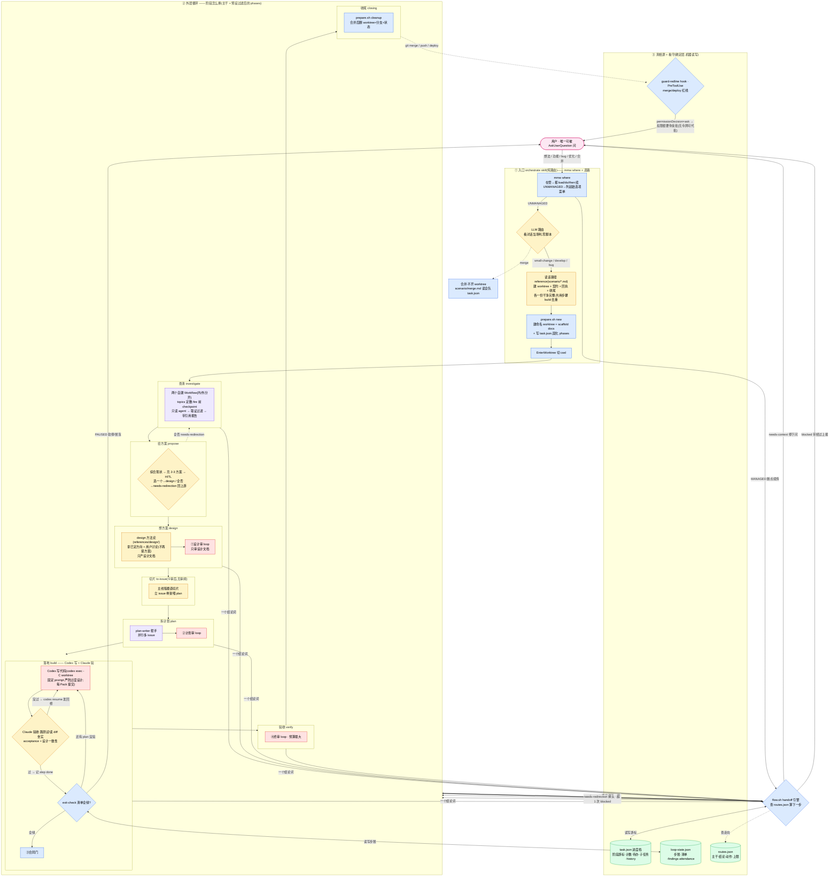
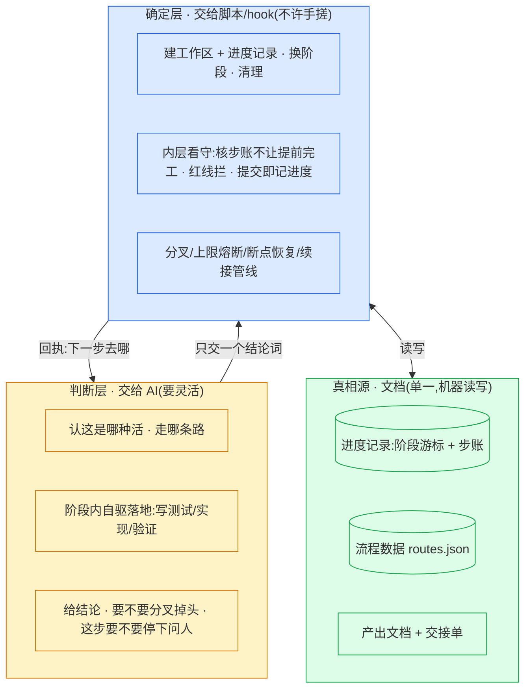
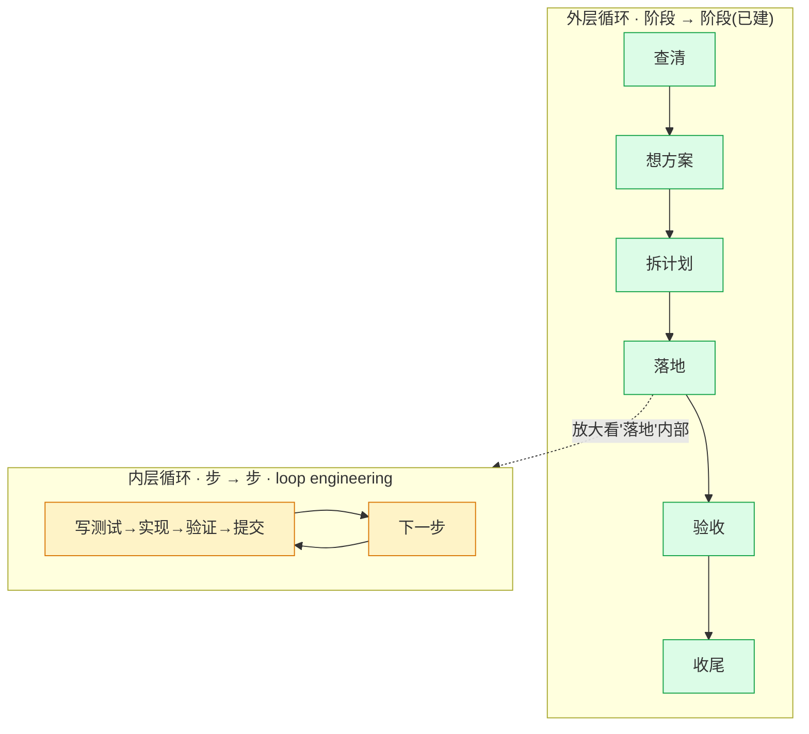
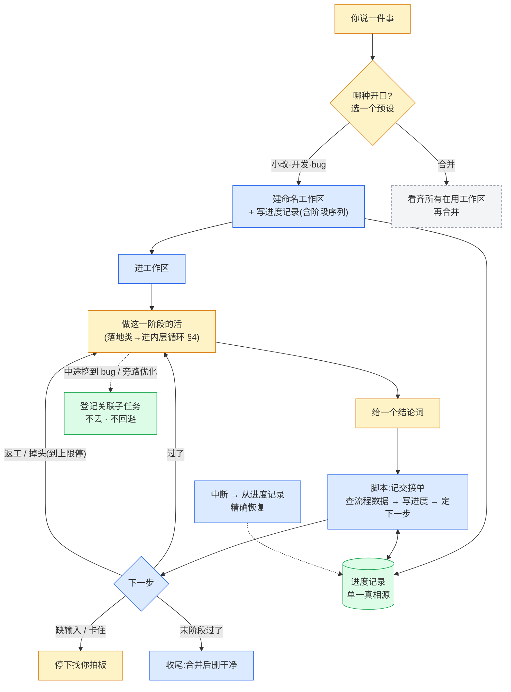
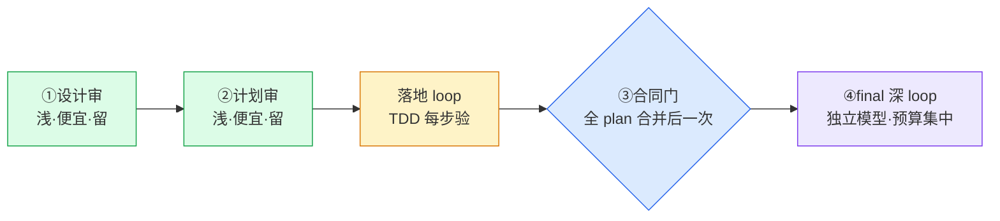
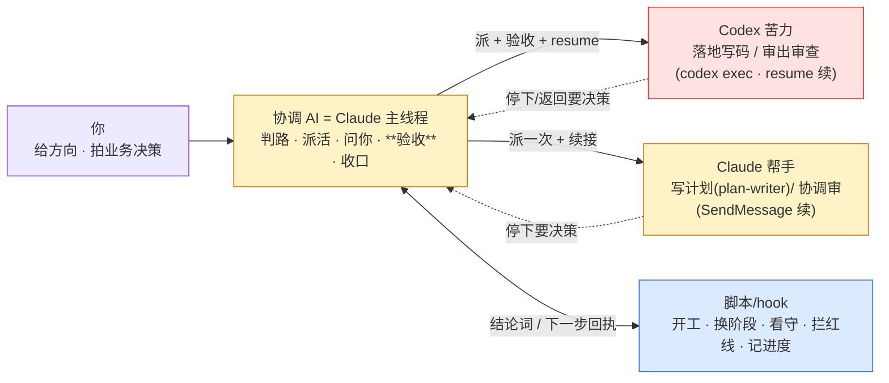
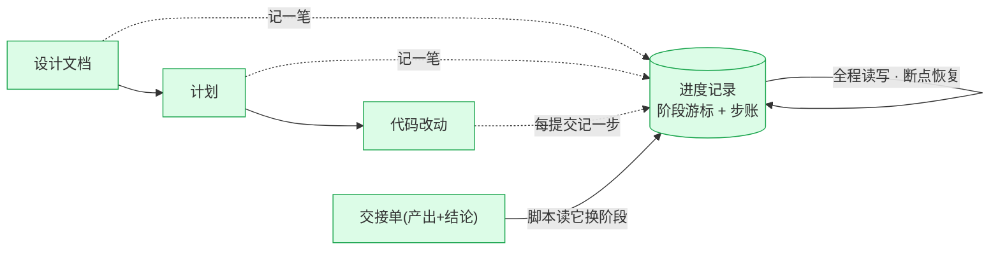
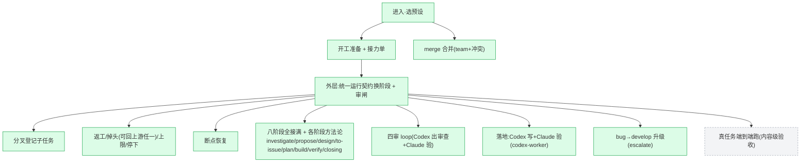
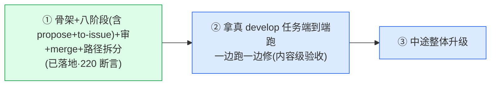

# plugin · 架构总览

> 给项目负责人看的全局图。讲清楚:谁干什么、整套怎么运转(阶段之间 + 阶段内部)、信息怎么流转、现在到哪、往哪走。
>
> **真相源**:进度记录(`task.json`)记任务全部状态;流程数据(`routes.json`)记主干阶段与结论走向。本文与它们冲突时,以这两份文件为准。本文的设计取舍已对照旧 plugin 实测、业界成熟做法、Claude Code 已核实的运行时能力(见 §10),不是凭猜。

---

## 0. 全局架构 —— 一张图把握

整套系统一张图。颜色 = 谁在干:<span>🟡 主线程(Claude Code,唯一能问你)</span> · <span>🟣 Claude 帮手(隔离上下文劳动力,SendMessage 续)</span> · <span>🔴 Codex 审者(headless,喂我们的审题)</span> · <span>🔵 脚本/hook(确定层,不手搓)</span> · <span>🟢 文档/状态(真相源)</span> · <span>🩷 用户(HITL)</span>。

三个层次:**① 入口**(断点恢复 + 路由)→ **② 外层循环**(八个阶段怎么换,design/plan 各配一个审)→ 中间 **③ 真相源 + 看守**(状态面 + hooks 兜住确定性)。build 阶段里再嵌一台**内层循环**(loop engineering 自驱落地)。



怎么读:实线粗箭头 `pass` 是阶段过、往下走的主路;细实线是返工/掉头/上报的分叉;虚线是查状态/查红线。唯一会停下来找你的两类:`needs-context`/`blocked`(外层)和内层软停/冒泡 `PAUSED`,加上发布红线 `guard-redline`。其余全自驱。下面 §1–§12 是这张图每一块的展开。

---

## 1. 三层结构 —— 整套架构的根

只有三层。**而且这三层既管"阶段之间怎么换",也管"阶段内部怎么落地"——同一条线,用在两个尺度。**



确定的事(开工、换阶段、记进度、看守循环、拦红线)全压进脚本/hook,AI 不碰;要判断的事(走哪条路、代码怎么写、这步该不该停下问你)全留 AI。两层只用"结论词进、下一步回执出"对接。

---

## 2. 两层循环 —— 整套怎么运转



- **外层**:协调者把任务一阶段接一阶段往下推。每阶段干完交一张单子,脚本据结论换阶段。(§3)
- **内层**:进了"落地"这种阶段,一个帮手**自己连跑很多步**(写测试、改代码、验证、提交),不每步回协调者。这层才是 loop engineering——在该停处把你拉进来、断了能从断点续且不重做。(§4)

内层全部的多步、暂停、修复,对外**只露一次阶段交接**;内外不互相污染。

---

## 3. 外层:阶段怎么换

颜色:🟡AI 判断 · 🔵脚本确定 · 🟢文档 · ⬜待建。



每阶段干完按五个结论分流:过了 / 要返工 / 方向错 / 缺输入 / 卡住。

---

## 4. 内层:阶段里怎么自驱落地(loop engineering)

进了"落地"这种阶段,**Codex 写代码、Claude(主线程)验收**——分两个模型:跟你对齐了设计/计划的是 Claude,让它当"落地不偏离设计"的验收闸;Codex 是并行苦力,不持有这份对齐。写者≠验者,独立性成立。(**small-change 小活例外:主线程就地做,不派 Codex。**)

```
主线程读计划 → 给每份 plan 开 worktree → 派 Codex 进去(codex exec,固定 prompt 严防过度设计/兜底/思考)
Codex 自驱:写失败测试 → 实现 → 通过 → 提交(每 Pack 一提交,带 Pack N.M);互不依赖的 plan 并行
Codex 返回 → 主线程验收:跑测试/读 diff 坐实 acceptance + 设计一致性   ← 命门,不信 Codex 自述
  过 → 记这步完成        没过 → codex exec resume 发回修(context 原封)
全 plan 验过 → ③合同门 → 合并回任务分支 → 交一次阶段交接单 → 回外层
```

**为什么不会"扫一眼就宣布完工"**:完工信号是**主线程按 plan 验收清单逐条坐实(exit-check 机器核清单全绿)**,不是 Codex 自报"我做完了"。Codex 是劳动力不是信源,它说的改了啥/测试过了,主线程自己 grep/跑去坐实。

### 自动化和 HITL 怎么融合

**唯一的硬红线 = 上线发布**(合并回主分支 / 部署云端)——不可逆的对外动作,**机器硬闸(PreToolUse 直接拦),要你亲自批,不分在场还是无人值守**。它在**收尾/merge 边界**,不在执行循环里。计费/权限/数据/用户可见合同这些,**在设计审+计划审就约定死**,执行中不再为它们停——那才是规划它们的地方。

执行循环内部只有这几种打断,一个在场开关调"软停"(Codex 停下时在最后消息说清,主线程读到后按下面处置):

| 执行中 | 什么情况 | 你在场 | 无人值守 |
|---|---|---|---|
| **软停** | 有合理默认的判断、风险中等 | 主线程停下问你 | 主线程自己拍板 **+ 留痕**,`codex resume` 续 |
| **冒泡** | 真缺输入 / 怀疑方向错 | 停下问你 | 同(needs-context / needs-redirection 太重,AFK 也停) |
| **不停** | 纯机械(Codex 写测试、让它过、提交) | 不停 | 不停 |

"在场 / 无人值守"开关**只动软停那一档**:冒泡永远停、不停永远不停、红线(merge/deploy)永远要人批。

### 停了怎么续:不白死、不重做已做的

续接路,代价不同(机制序列见落地文档 `design/loop-engineering.md` §1):

| 出口 | 何时 | 怎么续 | 代价 |
|---|---|---|---|
| 暂停问人 | 软停 / 冒泡 | 答完 `codex exec resume` 续同一会话,context 原封 | 零重读 |
| 修复 | 验收/审查给了要改的点 | `codex exec resume` 发回修 | 零重读 |

**续接不重做**靠每 Pack 一次提交(已提交的 Pack 永不重跑)+ `codex exec resume` 续同一 Codex 会话保上下文。落地载体是 Codex(不吃 SendMessage/SubagentStop);**审核 loop 的协调帮手是 Claude subagent,续接才走 SendMessage**——两套别混(§5b)。

---

## 4b. 同一台 loop 的另一组实例:四个审

loop engineering **不是落地专用**,是通用内层机器。审核也是它的实例,只是"一步"从"写一个 pack"换成"查一个维度/坐实一条 finding",verify 从"跑测试"换成"grep/读/跑去坐实 finding 真假"。**审者载体 = 无头 CLI**(①② Codex;④final Codex+Claude 双模型同 prompt。`codex exec --sandbox read-only` / `claude -p`,读已装的 `worktree-review` skill 按 stage 审——审查方法+角度在 Codex 侧,派发不给 Codex 任何 plugin 路径;**不用 `codex review`**——那走 Codex 内置提示词、绕过我们的方法论;续接走 `codex exec resume`,不走 SendMessage——见 §5b),否则自审自盲。

整套有**四个审**(`skills/second-model-review`),同一台机器(防幻觉四件套 + 每阶段两个独立视角 + 亲验处置 + Gap 路由),深浅与预算不同:

| 审 | 时机 | verify 吃什么 | loop 深度 | 预算 |
|---|---|---|---|---|
| ①设计审 | 写计划前 | grep/读仓库(有没有现成库、合同对不对) | 浅 | **留**·便宜最高杠杆(代码前抓方向/设计错) |
| ②计划审 | 写代码前 | 同上 + 覆盖/合规 | 浅 | **留**·便宜高杠杆 |
| ③落地审 | 全 plan 合并后一次 | —— | **降成便宜合同门**(只查跨 plan 合同兑现) | 低·跟 TDD 重叠、孤立看不到跨 plan |
| ④final | 全合并后 | 跑测试、读大 diff、对抗输入 | **深·按风险机器分档**(review.sh 判):develop 有 `Complexity: capable` 或 diff>阈值(默认 800 行,`REVIEW_TIER_DIFF_MAX`)或判不出数据(fail-closed)→ 双模型 2×2;develop 低风险 → 2 审者(基线1 Codex / 基线2 Claude,仍跨模型);small-change/bug → 1×Codex | **集中**·跨 plan 缝隙+兑没兑现意图+独立代码审+跨模型对账 |



预算原则:**①②便宜高杠杆要留;③降成便宜合同门(对不对已由 TDD 每步验过);重判预算集中砸④final 深 loop。**

### 退出标准 —— 一个 loop 合不合格的命门

一个 loop 最关键的是"什么时候算审完、可以退出"。**"reviewer 自己说审完了"不可信**——业界把它命名为过早完成(premature termination),还实测出 reward hacking:迭代自审里 judge 给自己打分越打越高,真实质量反而下降。所以退出靠**外部证据**,不靠自报,且必须三件套齐:

| 三件套 | 是什么 | 防什么 |
|---|---|---|
| **完成判据** | 覆盖清单全绿(查质量/正确,不是"提到了")+ 无开口 Critical/Important + **收敛**(无新高置信 finding) | 防过早宣布审完 |
| **熔断** | 修复轮上限,到顶转第三态 | 防无限打转 + 防 reward hacking(自审超 ~3 轮基本只换语法、还把分刷上去) |
| **第三态** | 不是 pass/fail 二选一,加 needs redirection(方向疑)/ needs context(缺输入)/ blocked(卡死或超限)→ 交人 | 防它在没权/没把握处硬判过 |

四个审用同一套三件套,覆盖清单和验证方式各不同:

| 审 | 完成判据(覆盖 + 怎么验) | 熔断 | 第三态 |
|---|---|---|---|
| ①设计 | 两轴过 + 方向级五问都明答(不许跳)+ 无 Critical;验=grep 仓库(现成库?调用方?合同?) | **2 轮**(`loop round next` 机器计数,到顶自动 surface) | 方向疑→交人 / 缺输入 |
| ②计划 | 两轴过 + 每个 issue 有对应 plan、每个 pack 有验收命令、引用的符号 grep 得到 + 无 Critical | 2 轮(机器计数)→ blocked | 方向疑 / blocked |
| ③落地 | 全 Pack 提交 + 声明的跨 plan 合同兑现(都可机器核);不开判断 loop | 合同不达→回落地(落地自己的 2 轮) | 合同根上错→升级 |
| ④final | 意图清单逐条坐实(不是"提到")+ 每条跨 plan 合同真接上 + 两基线过 + 无 Critical;验=真跑测试/读大 diff/对抗输入 | 1–2 轮 + 超限转根因调查/人 | 回流落地(上限1)/ 发布风险→人 |

**防过早完工靠机器抓手,不靠自觉**:覆盖清单由**主线程从设计/计划/issue 文档抽出**(落进进度记录);里头**客观项机器核**(③全 Pack 提交、②issue 数=plan 数、④意图清单每条有勾),没全绿就由看守 hook 顶回去续审——和落地 loop 防"扫一眼宣布完工"是同一个机器;**语义项要证据**(每条 finding 引 `file:line` 原文,引不出=降置信)。

---

## 5. 谁干什么



| 角色 | 干什么 | 不干什么 |
|---|---|---|
| 你 | 给方向、给真实体感、拍业务决策 | 不管机械细节 |
| 协调 AI(Claude 主线程) | 判活、派 Codex/帮手、问你、**验收(落地不偏离设计)**、收尾 | 不亲自写生产代码(小改例外) |
| Codex 苦力 | 落地写码(workspace-write)/ 审出审查(read-only);自驱、不同模型 | 不直接问用户(抛回主线程)、不改 docs、不越界 |
| Claude 帮手 | 写计划(plan-writer)、协调审(派 Codex+亲验) | 不直接问用户、不越界 |
| 脚本/hook | 开工、换阶段、看守、拦红线、记进度、续接管线 | 不做判断 |

**写审异家 = 不同模型**:设计/计划讨论用 **Claude**(跟你对齐);**落地 = Codex 写 + Claude 验**(Codex 苦力,Claude 是对齐了设计的验收闸);**审 = Codex 出审查 + Claude 验**。写者≠验者 = 独立性,这是审查/验收可信的前提。(据用户工作流 PDF 定,推翻早前"落地倾向 Claude"。)

---

## 5b. 三个载体 —— 各能干什么,别混

这 plugin 是给 **Claude Code** 写的:**主线程就是 Claude Code**。帮手分两种载体,机制不同,功能不同,角色不许混。

| 载体 | 是什么 | 能 | 不能 / 注意 | 怎么续 |
|---|---|---|---|---|
| **主线程 = Claude Code** | 协调者(这个对话) | **唯一能问用户**(AskUserQuestion);派 subagent;Bash 调 Codex;跑 hook;**就地做 small-change** | —— | —— |
| **Claude subagent** | Agent 派,独立 context,回摘要 | **写计划(plan-writer)/ 协调审(派 Codex+亲验)**;后台跑;SubagentStop 看守;自动压缩。**不是落地 worker(落地归 Codex)** | 不能问用户(抛回主线程);Explore/Plan 一次性不可续 | **SendMessage** |
| **Claude 无头 CLI** | `claude -p`,外部进程(④final 双模型审者) | ④final 审 = 与 Codex 同 prompt 读同一份 `worktree-review` skill,各审一路视角 | 不吃 SendMessage/SubagentStop;只读审查,不落地 | **claude -p --resume** |
| **Codex 无头 CLI** | codex exec,外部进程、**不同模型** | **落地写码 = `codex exec -C <worktree> --sandbox workspace-write`**(build 主力,固定 prompt 严防过度设计);审 = `codex exec --sandbox read-only`,读已装 `worktree-review` skill 按 stage 审(方法在 Codex 侧,不给 plugin 路径);`-m`/effort 分层 | **不是 Claude subagent**:经 Bash 调,不吃 SendMessage/SubagentStop/Claude hook;不能问用户。**`codex review` 绕过我们方法论 → 不用** | **codex exec resume** |

**五条硬规矩**:① 续接两套别混(Claude subagent=SendMessage,Codex=exec resume);② SubagentStop 只看守 Claude subagent(plan-writer/审协调);**build 的 Codex 落地不吃 SubagentStop,防过早完工靠主线程按 plan 验收清单 verify + exit-check 机器核**;③ 只有主线程能问用户,subagent/Codex 都抛回主线程;④ **审/落地都用 `codex exec`,不用 `codex review`**(那绕过我们方法论);⑤ small-change 主线程就地做,不派 Codex/帮手。

---

## 6. 八个核心设计

| 设计 | 是什么 | 给你解决什么 |
|---|---|---|
| 确定与判断分两层 | 机械的进脚本/hook,判断的留 AI;外层内层同一条线 | 又快又稳,AI 不空耗判断 |
| 进度记录唯一真相源 | 阶段游标 + 步账写进一份文件,机器读写 | 中断精确接上,不读错写错 |
| 工作区即工作单元 | 一任务一个命名工作区,可跨天,合并后才删 | 你在 VSCode 认得出、管得住 |
| 交接靠固定单子 | 干完交"产出+结论词",缺了当场拒收 | 根治"上一步没对齐、下一步陷修补" |
| 流程是数据不是散文 | 阶段、结论走向写成数据表 | 改流程=改数据;能分叉掉头 |
| 续接不重做 | 每步一提交(已做的跳过)+ 续同帮手 context 原封(SendMessage) | 暂停/修复都不白干,省 token |
| 验收吃测试不吃自述 | 每步先写测试再实现;看守核步账防过早完工 | 不让"扫一眼宣布做完了" |
| 该停按风险分级 | 红线机器拦 + 在场开关只动软停 | 自动化和 HITL 融合,该自动自动、该停必停 |

---

## 7. 主干 + 预设开关

只有一条主干。落地前的阶段都是可开关的前置——你怎么开口只决定默认开哪几个。新想法和优化是同一条完整主干(`develop` 预设),不分两个标签。


| 你怎么开口 | 预设 | 默认开的阶段 |
|---|---|---|
| 明确的小改 | `small-change` | 落地 → 验收 → 收尾 |
| 新想法/功能 或 要优化改进 | `develop` | 查清 → 给方案 → 想方案 → 切片 → 拆计划 → 落地 → 验收 → 收尾 |
| bug(根因不明) | `bug` | 查清 → 落地(修) → 验收 → 收尾 |
| 合并 | (merge) | 独立,不走主干 |

查清(investigate)对 `develop`、`bug` 都开(小改不开)。新想法和优化合成一个 `develop` 预设——同一条主干、同一阶段序列,不再各列一个标签。前置开关中途能翻:小改做着发现是设计问题→升级打开前置。

### 查清(investigate)的形态:两个自建 Workflow(内 / 外分开)

查清跟想方案(主线程跟你讨论)、落地(帮手自驱)都不同——它是**主线程跑自建 dynamic Workflow**(仿 deep-research)做并行专题投查。**内部仓库现状、外部成熟方案各一个 workflow,分开跑**(`investigate-internal` / `investigate-external`),不在一个脚本里用 mode 混:

- **方向分脚本**:内部 → `investigate-internal`(只读 Read/grep,locator=file:line);外部 → `investigate-external`(web/context7,locator=url)。**外部非必做**;只查内部就只跑 internal。
- **数量由 topics 定,不设上限**:一个 topic 一个 agent,按调查真实需要定几个(`parallel(topics.map(...))`),别凑废 topic 也不卡数字。
- **调查员分档**:topic agent 钉 Sonnet 5 high(机械取证,token 平衡);synthesize 继承会话模型(综合要判断)。
- **fire 前一个 checkpoint**:主线程定好 topics 先亮给用户批 / 改,再跑(不闷头烧 token)。
- **技能原生融入不摘抄**:agent 运行时 `Skill()` 加载角度 skill(codebase-design 类 / deep-research·context7)——引用名字,upstream 维护。
- **只读取证**:并行查 → 机械过滤无出处 claim(取证,非判定)→ 综合带引用报告 → **主线程亲验承重事实** → 写 CONTEXT + research 笔记 → handoff 给想方案。判定仍归 Codex(后面 ①设计审),`agent()` 只派 Claude。

详见落地规格 `design/investigate-workflow.md`。

---

## 8. 信息怎么流转

文档是接力棒;指令在文档里,不在对话里。



**接力单怎么拼(`where` 报 `prev_outputs`,下阶段照单读不自己找)**:默认读上一个开着阶段的产出;阶段在 `routes.json phase_bindings.reads` 声明跨多阶上游时按声明拼(design `reads:[investigate,propose]` → 现状报告 + 选定方向都进 `prev_outputs`;plan `reads:[design,to-issue]` → 设计文档 + issue 骨架都进)。一阶段产多件时 `produced` 可用数组。**design 只产设计文档,issue 骨架由 ①设计审后的独立阶段 to-issue 产**(审后再切片,①审只审设计文档)。在审闸里 `where` 另报 `review_source` = 当前阶刚产的待审产物,直接喂 `mmw review start --source`。

**主仓库零残留**:plugin 的一切产物都在工作树里;主仓库只落 `.claude/{worktrees,multi-model-workflow}` 两个状态目录,由 `prepare.sh new` / `review.sh start` 幂等写入 `.claude/.gitignore` 对 git 遮蔽(只影响未跟踪文件,不碰用户已跟踪的 `.claude/` 内容)——建 worktree 后主仓库 `git status` 必须干净。merge 场景(唯一在主仓库跑的路)产物(merge-brief / merge-impl 留痕)也只进状态平面,不写主仓库 `docs/`。

**git 提交白名单(唯一随分支进主线的)**:设计文档(含 `prototype/` 脚本 + `mockup/` 网页)· 计划文档 · issue 文档 · 领域文档(docs/context,跨任务积累)。其余全是过程产物,`docs/.gitignore`(自忽略,脚手架本身也不进 git)挡住,随 worktree 删:现状报告 / 审查留痕 / 终审报告 / 状态平面。

---

## 9. 现状叠在架构上



🟢 已落地并空跑验证(220 项断言:脚本 213 + build 7):入口纯路由(每条路径一份干净完整 reference,共用步骤 build 去重)· `mmw where` 自指路(冷启动列起始选项;在途报 `load`/`do`/`then`)· 开工/恢复/清理 · 接力单 · 统一运行契约 + 审闸 · 分叉/返工(可 `--to-phase`)/上限/停下 · 八阶段方法论全接(含 propose 给方案+两路出口、to-issue 审后切片、Codex 落地派发 + 四审 loop)· bug→develop 原地升级(`mmw task escalate`)· merge · 统一 CLI `mmw`。
⬜ 未验:**真 Codex 内容级端到端**(真派 Codex 落地/审、真 resume 修的产出质量)。已做(2026-07-03):一条 develop 任务全流程半真跑——投查 workflow 真跑、引擎/hook/审闸/合同门/收尾全真、Codex 用 stub 走通派发管线;挖出并修掉状态平面污染 / 子 worktree detached / 文档提交时机 / 投查仓库根四缺口。

---

## 10. 设计依据(不闭门造车)

| 源 | 贡献 |
|---|---|
| 旧 plugin 实测 | plan 级帮手自治、从已提交计数恢复、续同帮手修复、上限数据+hook 双持有、转根因调查;也挖出它的坑(手写整块状态、轮次编进文件名、魔数阈值、溢出就换帮手)——全改掉 |
| 业界成熟做法 | 状态外置+游标、"停"做成显式原语、副作用隔离出重放路径(每步一提交→续接不重做)、验收吃 ground truth + 逐项清单防过早完工、风险分级 deny-default + 自决留痕 |
| Claude Code 已核实原语 | 看守 hook 能顶回帮手续跑、续接保留完整 context、敏感操作能机器拦、帮手不能直接问用户(故 HITL 经主线程) |

---

## 11. 接下来顺序



---

## 12. 文件对照

> 运行件路径相对仓库 `plugin/`(本设计文档 + `design/` 在 `docs/plugin/`,不随 plugin 发布)。

| 能力 | 文件 |
|---|---|
| 统一 CLI(所有命令一个入口)| `scripts/mmw.sh` |
| 入口(**纯路由**:断点恢复 + 选路,随后交给该路径 reference)| `skills/orchestrate/SKILL.md` |
| 每条路径一份干净完整走法(建 worktree + 契约 + 回执 + 收尾)| `skills/orchestrate/references/scenario/{small-change,develop,bug,merge}.md` |
| 路径间共用步骤的单源 + 多文档构建(改一处跑 `build.sh --apply` 覆盖全部)| `build/fragments/*.md` · `build/build.sh`(`--check`/`--apply`)|
| 各阶段方法论 / 操作指南 | `skills/orchestrate/references/{investigate,propose,review,build,closing}.md` · `design/`(discuss=discussion → prototype=prototype-mockup → write=design-doc-template → selfcheck=design-self-check **四步走脚本游标懒加载**;切片 to-issue-skeleton)· `plan/`(orchestrate=plan-flow → write=task-pack → selfcheck=plan-self-check **三步走脚本游标懒加载**,与 design 同构)—— 八阶段方法论同住 orchestrate 体内、按路径/步骤加载,无 `Skill:` 名索引 |
| 插件接线(可安装)| `.claude-plugin/plugin.json`(清单)· `hooks/hooks.json`(4 个 hook)· `agents/plan-writer.md`(plan 阶段 fan-out)· `commands/gather-context.md`(设计问答补上下文)|
| 阶段→`load`/`do`/`then` 绑定(`mmw where` 自指路单源)| `state-schema/routes.json` 的 `phase_bindings` |
| 审题方法论(worker/reviewer 单源;Droid 读随插件发布的 `plugin/skills/`,Claude 侧外部 Codex/Claude CLI 读自己 hub 装的 `codex-skills/`→`~/.agents/skills/`)| `plugin/skills/worktree-{build,review}/` 与 `codex-skills/worktree-{build,review}/`(`SKILL.md` + `references/*`,两副本同方法论、宿主框架各异)|
| ③合同门审题 + 审核编排(Claude 侧,留 plugin)| `skills/orchestrate/references/review/{plan-impl,review}.md` |
| 开工 / 恢复 / 清理 / 全队(merge)| `scripts/prepare.sh`(new/resume/cleanup/team)|
| 交单 / 换阶段 / 审闸 / 分叉 / 接力单 / 查位置 | `scripts/flow.sh` |
| 内层 loop 引擎(steps/checklist/退出三件套)| `scripts/loop.sh` |
| 审闸一条命令 / Codex 落地派发 | `scripts/review.sh` · `scripts/codex-worker.sh` |
| 看守(SubagentStop,只守 review loop)/ 红线(PreToolUse,剥引号防误拦)/ 记进度(commit)/ 会话分诊(SessionStart:正式任务进流程、简单问答直接答、注入在飞任务清单)| `hooks/{guard-loop,guard-redline,record-step,session-triage}.sh` |
| 进度记录 / 流程数据 / loop 状态 | `state-schema/{task-manifest.schema,routes,loop-state.schema}.json` |
| 落地规格 | `design/{loop-engineering,investigate-workflow,review-loop}.md` |
| 空跑验证 | `scripts/tests/`(213 断言)|
