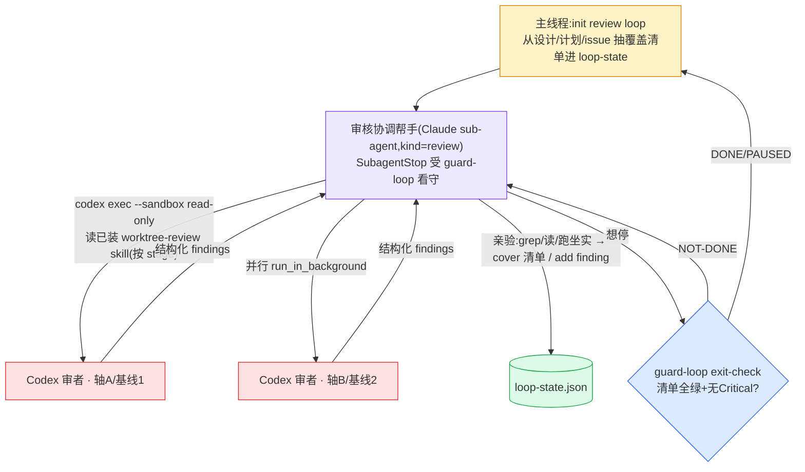

# Review 阶段 · 审核 loop 落地规格

> 四个审(①设计 ②计划 ③落地 ④final)的落地。形态 = **loop engineering 的另一组实例**(`kind=review`),同一台内层机器(看守 hook + 退出三件套),只把载体从「Claude 帮手写代码」换成「Codex 审者查证据」。
> OVERVIEW §4b 是设计,本文是落地。冲突以 OVERVIEW + 代码为准。

---

## 1. 为什么是 loop,不是一次性派审

审核最容易出的错是**过早完工**(reviewer 自报"审完了")和 **reward hacking**(自审超 ~3 轮只换语法、还把分刷高)。所以审核要的不是"派一次拿回 findings",是一台带**外部退出判据**的 loop:覆盖清单全绿 + 无开口 Critical + 收敛,缺一不退。这正是 loop engineering 已经造好的退出三件套——审核直接复用,不另造。

| loop 维度 | 落地 loop(execution) | 审核 loop(review) |
|---|---|---|
| 一步是什么 | 写一个 pack | 查一个维度 / 坐实一条 finding |
| verify 吃什么 | 跑测试 | grep/读/跑去坐实 finding 真假 |
| 看守 hook | SubagentStop exit-check | **同一个**(`guard-loop.sh`,按 `kind=review` 走) |
| 完工信号 | 步账全绿 | 覆盖清单全绿 + 无 Critical |

---

## 2. 载体:Codex 审者 + Claude 协调帮手

审者**必须**是 Codex(不同模型,否则自审自盲)。但 Codex 不是 Agent-tool 帮手、SubagentStop 看不住它。所以审核 loop 的结构是**两层**:

- **主线程**:进 review 阶段,`loop.sh init --kind review`,**从源文档抽覆盖清单**(§4b「覆盖清单由主线程抽」)写进 loop-state,再派审核协调帮手。
- **审核协调帮手**(Claude sub-agent):派 Codex、收 findings、**亲验**、cover 清单、add finding、按 Gap 路由产出 verdict。它想停时 `guard-loop` 用 `exit-check` 拦——清单没全绿/有开口 Critical 就顶回去续审。
- **Codex 审者**:`codex exec -C . --sandbox read-only - < <prompt>`,读它已装的 `worktree-review` skill 按 stage 审(审查方法+角度在 Codex 侧,**不给 Codex plugin 路径**——它读不到 Claude 的 `plugin/`;**不用 `codex review`**——那走 Codex 内置提示词绕过我们方法论);续接 `codex exec resume <id>`。每阶段两个独立视角(①②③ = 轴A+轴B;④ = 基线1+基线2),并行起、各自干净 context。**只给 Source + stage,不塞自己的问题清单**(塞 = 把 Codex 框死,跳不出去质疑地基)。

为什么协调帮手是 Claude 不是主线程:guard-loop 靠 SubagentStop 拦,主线程没有 SubagentStop。放进帮手 = 审核也吃同一台看守机器,和落地 loop 对称。帮手不能 AskUserQuestion,需要用户拍板的(方向疑)走 `surface` 冒泡回主线程,同落地 loop。

---

## 3. 四个审:深浅与预算

| 审 | 触发点 | kind | Codex verify 吃什么 | 预算 |
|---|---|---|---|---|
| ①设计审 | design handoff pass 后 | review | grep/读仓库(现成库?调用方?合同?) | **留**·便宜最高杠杆 |
| ②计划审 | plan handoff pass 后 | review | 同上 + 覆盖/合规 | **留**·便宜高杠杆 |
| ③落地审 | 每个 plan 全 Pack 提交后 | **contract-gate** | 只机器核跨 plan 合同兑现,**不开判断 loop** | 低·跟 TDD 重叠 |
| ④final | verify 阶段(全合并后) | review | 真跑测试/读大 diff/对抗输入 | **集中**·重判全砸这 |

③不是真审 loop——降成 `kind=contract-gate`:主线程列待提交 pack + 跨 plan 合同清单,机器核两个都齐就过,不派 Codex 判断。预算集中砸 ④final。

---

## 4. 退出三件套(每阶段同套,清单与验证不同)

完成判据由 `loop.sh exit-check` 机器核(`kind=review`:清单全绿 AND 无开口 Critical;`kind=contract-gate`:pack 全提交 AND 合同清单全 cover):

| 审 | 完成判据(覆盖 + 怎么验) | 熔断 | 第三态 |
|---|---|---|---|
| ① | 两轴过 + 方向级五问都明答 + 无 Critical;验=grep 仓库 | 2 轮 | 方向疑→交人 / 缺输入 |
| ② | 两轴过 + 每 issue 有 plan、每 pack 有验收命令、引用符号 grep 得到 + 无 Critical | 2 轮→blocked | 方向疑 / blocked |
| ③ | 全 Pack 提交 + 声明的跨 plan 合同兑现(全机器核) | 合同不达→回落地 | 合同根上错→升级 |
| ④ | 意图清单逐条坐实 + 每条跨 plan 合同真接上 + 两基线过 + 无 Critical;验=跑测试/读大 diff/对抗输入 | 1–2 轮→根因调查/人 | 回流落地(上限1)/ 发布风险→人 |

- **收敛**:两个 Codex 视角跑完后,追一轮没有新的高置信 finding = 收敛。收敛轮由**协调帮手自己计**(它知道自己跑到第几轮),不落 loop-state——`routes.json caps` 是外层重派的兜底上限。
- **熔断**:协调帮手自己看 `round` 到阶段上限还没收敛 → `loop.sh surface --kind needs-redirection`(或主线程 handoff `blocked`),不在 loop.sh 写死每阶段不同的轮上限(帮手知道自己是第几审,它管;`routes.json caps` 是外层重派的兜底)。
- **第三态**:不是 pass/fail 二选一。方向疑 / 缺输入 / 卡死 → `surface` 冒泡回主线程 → 主线程 `flow.sh handoff` 用对应结论词交人。

---

## 5. findings 处置 + Gap 路由(协调帮手亲验,主线程落 handoff)

协调帮手对每条 finding:**亲验**(Read/grep/跑坐实,Codex 是劳动力不是信源)→ 按置信度(8–10 多 accept/reject;5–7 补证;1–4 压制记一行)→ 处置(accepted 才往下;rejected 记反证防回审;needs-evidence 补证前不修;duplicate;out-of-scope/needs-evaluation 开 issue;user-decision 冒泡)。

accepted finding 修在哪(Gap 路由),决定主线程 handoff 用哪个结论词:

| Gap | 含义 | handoff 结论 → 去哪 |
|---|---|---|
| Implementation | 设计对、代码没做到 | `needs-repair` → 当前层小改 / build 阶段派 Codex 大改 |
| Design | 设计承诺不可实现/漏约束 | `needs-repair` → 回 design 阶段改设计 |
| Direction | 解错问题/该换框架 | `needs-redirection` → 交用户拍方向 |
| Context | 缺术语/owner/target | `needs-context` → 问用户 / domain-modeling 写回 |
| Plan | plan 与代码不一致 | `needs-repair` → 回 plan 阶段 |
| Unverifiable | 环境/账号/生产 gate 缺 | 写清证据 + manual gate owner,不算 blocker |

审题、防幻觉四件套、五问、Return Contract 全在 Codex 侧 `codex-skills/worktree-review`(`method.md` + 四 stage angle),Codex 读它已装的 skill,协调帮手 dispatch 只传 stage + Source(不给 plugin 路径),本文不复述。

---

## 6. flow 怎么触发(外层 × 内层的接缝)

审是夹在阶段之间的闸,不是独立 phase:

| 时机 | 谁起 | 怎么起 |
|---|---|---|
| design pass | flow handoff 引擎 | 触发 ①设计审 loop;审过才进 plan |
| plan pass | flow handoff 引擎 | 触发 ②计划审 loop;审过才进 build |
| 每 plan 提交 | build 阶段内 | 起 ③contract-gate |
| verify 阶段 | flow 进 verify | 起 ④final review loop(预算最大) |

审 loop 的 verdict 翻译成结论词回 flow:`pass`(审过,进下一阶段)/ `needs-repair`(有 accepted 缺陷,回对应阶段修,计 repair_count)/ `needs-redirection` / `needs-context` / `blocked`。审打回的修复 → 停在对应 phase 改 → 改完 handoff 重审,不绕过。

---

## 7. 落点

| 件 | 落到 |
|---|---|
| 审题:防幻觉四件套 + stage angle(Codex 审者读它已装的 skill,不给 plugin 路径) | `codex-skills/worktree-review/references/{method,design,plan,final,merge}.md` |
| ③合同门审题(Claude 机器核,留 plugin) | `plugin/skills/orchestrate/references/review/plan-impl.md` |
| 审核 loop 阶段 reference(指示主线程抽清单→派协调帮手→处置 verdict→handoff) | `plugin/skills/orchestrate/references/review/review.md`(与审题同住 review/ 文件夹,自包含) |
| loop 机器(init/checklist/finding/exit-check kind=review·contract-gate) | 已有 `scripts/loop.sh` + `hooks/guard-loop.sh`,无需改 |
| Codex 派发 | 协调帮手用 Bash 跑 `codex exec`,无需专用脚本 |

---

## 8. 红线(守住)

- 审者必须 Codex,绝不 Claude 审 Claude(自审自盲)。
- 完工靠 `exit-check` 机器核(清单全绿+无 Critical),不靠 reporter 自报"审完了"。
- 每条 finding 引 `file:line` 原文才采信,引不出 = 降置信;主线程/协调帮手亲验后才 accept。
- ③只机器核合同,不开 Codex 判断 loop;重判预算砸 ④。
