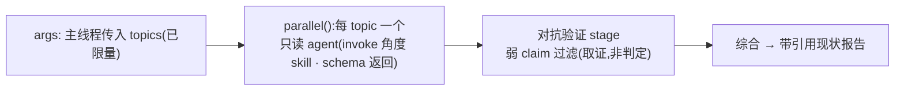

# Investigate 阶段 · 自建 Workflow 落地规格

> 设计/落地前的「查清现状」。形态 = 主线程跑**自建 dynamic Workflow**(仿 deep-research)并行专题投查;**内部仓库现状、外部成熟方案各一个 workflow,分开跑**。
> OVERVIEW 是设计,本文是落地。冲突以 OVERVIEW + 代码为准。

---

## 1. 为什么用 Workflow,不手搓 fan-out

仓库自评估(`dynamic-workflow-assessment.md`)的准入规则 4 条,investigate **全满足**,是评估点名的「最佳契合」环节:

| 准入规则 | investigate |
|---|---|
| 纯 Claude-agent 并行 fan-out | ✓ 只读投查全 Claude |
| 全程自治、无 mid-run HITL | ✓ fan-out 跑完才回主线程,问用户在之后 |
| 内部不含 Codex | ✓ Codex 是审,不在这 |
| 不依赖磁盘状态平面 | ✓ 返证据,综合后主线程才写盘 |

Workflow 工具**原生给**:`parallel()` 并行、`agent(...,{schema})` 强制结构化返回、对抗验证 stage——不重造。deep-research 是同款现成证明。

---

## 2. 内 / 外各一个 workflow,分开跑

两个方向 = 两个 workflow 脚本,各自自包含、无 mode 分支(确定逻辑焊在脚本里,主线程不手搓):

| workflow | 查什么 | locator | 角度 → 运行时 invoke 的 skill |
|---|---|---|---|
| **investigate-internal** | 现状 / 模块边界 / seam / 根因 | `file:line` | `codebase-design` · `improve-codebase-architecture` · `diagnosing-bugs` · `Explore` |
| **investigate-external**(非必做) | 现有方案 / 库 / 最佳实践 | `url` | `deep-research`(网搜)· `context7`(库文档 MCP) |

只查内部就只跑 internal;要对比外部再跑 external;两个都要先后各跑一次。

---

## 3. 技能原生融入,不摘抄

- workflow 的 `agent()` prompt **指示它运行时 `Skill({ skill: "<角度 skill>" })`** 加载方法论——**引用名字,不拷内容**。
- 好处:**upstream 原作者维护**,我们定期更新即受益,不漂移、不维护负担。
- 我们的 workflow 脚本**只编排**(拆题 / 并行 / 验证 / 综合),**不内嵌任何方法论散文**。

---

## 4. 数量由 topics 定,不卡死;fire 前一个 checkpoint

- 进 investigate,主线程判定**查哪个方向 + 哪些角度**(判断,不脚本化)。
- 把 `topics` 列表作为 args 传给对应 workflow,每项 `{ angle, question, skill? }`(方向由跑哪个脚本决定,topic 不再带 mode)。
- **一个 topic 一个 agent,无上限**:`parallel(topics.map(...))`,派几个 = 定几个,按调查真实需要,不凑废 topic 也不卡数字。
- **checkpoint**:fire 前把方向 + topics 亮给用户批 / 改,再跑——一个干净 gate,不闷头烧 token。

---

## 5. Workflow 内部流程(仿 deep-research)

- 每 agent 返回 schema 强制:`{ topic, findings:[{ claim, locator, confidence }], summary, gaps }`(locator:internal=file:line,external=url,由脚本定,topic 不带 mode)。
- 对抗验证只做**取证**(filter 弱证据);**不做审查判定**——`agent()` 只派 Claude,Claude 评 Claude 有盲区相关 + 假信心(评估红线),审仍归 Codex(后面 ①设计审 loop)。

---

## 6. 返回 + 收口(主线程)

1. Workflow 返结构化证据 + 引用报告。
2. 主线程**亲验承重事实**(grep/Read 坐实 file:line / 存在性,**子代理是劳动力不是信源**)。
3. 写 `docs/context`(领域文档,`domain-modeling` 横切维护)+ 一份 research 笔记。
4. `flow.sh handoff --conclusion pass` → design 阶段用现状报告选 A/B、扎根提问,**不再重探查**。

---

## 7. 红线(评估,守住)

- `agent()` 只派 Claude → 对抗验证当**取证**,绝不当**审查判定**。
- 只读;fan-out 期间不写状态平面(综合后主线程才写盘)。
- 同会话 resume 够用(单次 fan-out 断了重跑;阶段级 resume 靠 `manifest.phases`,在 Workflow 之外)。
- Workflow `agent()` 绕过 Agent-tool 派发门 hook——investigate 只读、本就不需那些门,无影响。

---

## 8. 落点

| 件 | 落到 |
|---|---|
| 两个 investigate workflow 脚本(只编排,内/外各一) | `plugin2/workflows/investigate-{internal,external}.workflow.js` |
| investigate 阶段 reference(指示主线程评估难度→传 topics→跑 Workflow→亲验→综合→handoff) | `plugin2/skills/orchestrate/references/investigate.md` |

investigate 阶段 reference 指示主线程「跑这个 Workflow」= 合法 Workflow opt-in(skill 指令触发)。

---

## 9. 对 routes 的后果

investigate 对 **develop + bug** 都 ON(small-change 不开)。新想法和优化合成一个 `develop` 预设(同一条完整主干、同一阶段序列),不再各列一个标签——曾经的 new-design / optimize 拆分只是无意义的复杂度。
