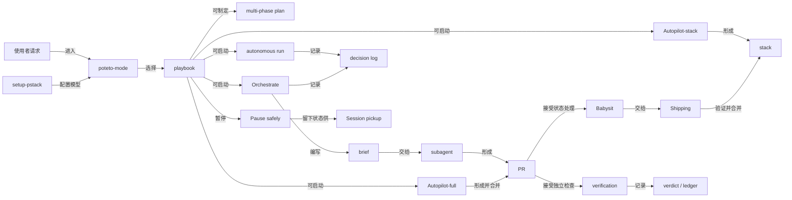

# G1-pstack-core-terms：pstack 的核心工作概念

以下只说明 `docs/research/code-landing-refs/pstack/` 快照中的用法。pstack 是装入 Cursor 的工作流插件，不是 MMW 的另一种名称。表中「MMW 近似对应」只表示解决的问题相近，不表示可以互换。

## 1. 概念地图

1. **入口与配置**：`poteto-mode` 按请求选择 `playbook`，`setup-pstack` 给不同工作角色设定模型，让使用者不用逐项指定执行步骤和模型。
2. **任务分工**：`orchestrator`、`subagent` 和 `brief` 把较大的工作分给有明确范围的执行者，并把结果交回协调者。
3. **长时与交接**：`autonomous run`、`autopilot`、`multi-phase plan`、`pause safely` 和 `session pickup` 规定持续推进、暂停与恢复的边界。
4. **验证与交付**：`verification`、`babysit`、`shipping` 和 `stack` 区分“改完了”“可合并”和“已合并”，避免把绿色 CI 当作产品已验证。
5. **专门调查与扩展**：`hillclimb`、`eval`、`forensics`、`visual parity` 处理特定证据类型；Cursor 的 `skill`、`agent`、`rule`、`automation` 是承载这些工作流的不同对象。

## 2. 术语表

| 术语（原文） | 所属组 | 一句话定义 | 它解决什么问题 / 没有它会怎样 | 在工作流哪一步出现 | 相关术语 | MMW 近似对应 | 出处 |
| --- | --- | --- | --- | --- | --- | --- | --- |
| `poteto-mode` | 入口与配置 | 使用者给出目标后，由这个 Cursor mode skill 选择 playbook、把步骤放进待办，并按步骤调用其他 skills。 | 避免使用者亲自编排每个技能；但它不是独立运行的调度服务。 | 发起任务时，且在同一对话中持续生效。 | `playbook`、`principle`、`poteto-agent` | 无。 | `docs/research/code-landing-refs/pstack/skills/poteto-mode/SKILL.md` §Poteto mode／§Playbooks；`docs/research/code-landing-refs/pstack/docs/guide/02-poteto-mode.md` §What happens to your prompt |
| `playbook` | 入口与配置 | `poteto-mode` 按任务类型选用的一份分步工作说明，规定执行、检查和报告方式。 | 同一句“修好它”在缺陷、性能、PR 状态等场景需要不同顺序；否则步骤靠 agent 临时拼凑。 | mode 匹配任务后、动手前。 | `Bug fix`、`Babysit`、`Autonomous run` | MMW `skill`（`docs/contexts/toolbox/CONTEXT.md` §The toolbox）：两者都给 agent 工作说明；pstack 的 playbook 是 `poteto-mode` 内部子路线，MMW skill 是独立安装的单位。 | `docs/research/code-landing-refs/pstack/skills/poteto-mode/SKILL.md` §Playbooks；`docs/research/code-landing-refs/pstack/docs/guide/README.md` §If you only remember one thing |
| `principle` | 入口与配置 | 一条可按情境引用的工程判断规则，`poteto-mode` 先读索引，实际应用时读相应的独立 skill 并说明它改变了哪个决定。 | 让“先证明实际有效”等要求能明确作用于决定，而非只作口号。 | 任务开始读索引，相关决定出现时应用。 | `Prove It Works`、`Sequence Work into Verifiable Units` | 无。 | `docs/research/code-landing-refs/pstack/skills/poteto-mode/SKILL.md` §Principles；`docs/research/code-landing-refs/pstack/docs/guide/08-principles.md` §Steer with principle names |
| `setup-pstack` | 入口与配置 | 一个配置 skill：检测可用模型，选择推理预算和各角色模型，写入 Cursor 的常驻 `pstack-models.mdc` rule。 | 不必在每次调用 subagent 时重新指定模型，且不能把不存在的模型名写入配置。 | 安装插件后的初次配置或调整模型时。 | `rule`、`model role` | MMW `models.json`（`docs/contexts/toolbox/CONTEXT.md` §The toolbox）：都按角色选模型；pstack 写 Cursor rule 给 Task subagent，MMW 文件配置被 runner 派出的独立 session。 | `docs/research/code-landing-refs/pstack/skills/setup-pstack/SKILL.md` §Setup pstack／§Steps |
| `orchestrator` / `coordinator` | 任务分工 | `Orchestrate` 中常驻的主对话，负责拆单位、写 brief、收结果、维护队列和合并边界，自己不写产品代码。 | 多日、多 PR 的计划若无人统一维护状态，会遗漏依赖和已完成工作。 | 项目级持续执行时。 | `brief`、`sub-coordinator`、`worker`、`frontier` | MMW `main agent`（`docs/contexts/night/CONTEXT.md` §Roles）：都管理一批 agent；MMW main agent 依 spec/ticket 事件推进 night，pstack coordinator 自己编写 brief 并维护本地 store。 | `docs/research/code-landing-refs/pstack/skills/poteto-mode/playbooks/orchestrate.md` §Orchestrate／§Roles and placement |
| `subagent` / `worker` / `verifier` | 任务分工 | 主 agent 派出的另一个 agent；worker 执行有边界的工作，verifier 用另一模型家族在需要时独立核验。 | 把大量工作并行化，同时将编写与判断分开；若共同写一处状态就会互相覆盖。 | brief 定稿后，执行或独立验证时。 | `poteto-agent`、`brief`、`swarm` | MMW `subagent`（`docs/contexts/toolbox/CONTEXT.md` §Roles）：同为会话内派生 agent；MMW 的 ticket `worker` 是 runner 开出的独立 session，不等于 pstack 这里的 subagent。 | `docs/research/code-landing-refs/pstack/skills/poteto-mode/SKILL.md` §Subagents；`docs/research/code-landing-refs/pstack/skills/poteto-mode/playbooks/orchestrate.md` §Roles and placement |
| `brief` | 任务分工 | coordinator 交给 worker 的自足任务说明，写明目标、可写范围、上下文、验收、验证方法、时间界限、禁令、报告格式和常驻约束。 | worker 不能看到兄弟任务的上下文，缺字段就会猜，范围也可能扩散。 | 每次派发或恢复 worker 前。 | `standing orders`、`unit`、`acceptance` | MMW ticket 的 `## What to build`、`## Owns`、`## Acceptance criteria`（`docs/contexts/tickets/CONTEXT.md` §Tickets／§Acceptance criteria）：都限定工作和完成证据；MMW ticket 是 tracker 上发布并流转的单位，pstack brief 是 coordinator 给 agent 的任务输入。 | `docs/research/code-landing-refs/pstack/skills/poteto-mode/playbooks/orchestrate.md` §The brief |
| `poteto-agent` | 任务分工 | pstack 提供的 Cursor agent 类型，作为子 agent 启动后先完整读取 `poteto-mode`，让委派者保持同一工作风格。 | 用一般 agent 代替会跳过这层说明，可能改变验证和报告习惯。 | `poteto-mode` 在 playbook 步骤内派生 agent 时。 | `subagent`、`poteto-mode` | 无。 | `docs/research/code-landing-refs/pstack/agents/poteto-agent.md` §Poteto subagent；`docs/research/code-landing-refs/pstack/skills/poteto-mode/SKILL.md` §Subagents |
| `Autonomous run` | 长时与交接 | 针对一项长任务设定可检查的结束条件，用 Cursor `/loop` 按事件或心跳反复推进、验证、保留有效改动。 | 使用者离开后仍能朝明确结果推进；时间到了或暂时停滞不算完成。 | 单项长任务获准持续执行时。 | `overnight`、`finish condition`、`decision log` | MMW `night`（`docs/contexts/night/CONTEXT.md` §The night）：都能在使用者不盯着时运行；MMW night 是一批已发布 tickets 的调度，pstack Autonomous run 是一项任务对一个结束谓词。 | `docs/research/code-landing-refs/pstack/skills/poteto-mode/playbooks/autonomous-run.md` §Autonomous run |
| `overnight` / `overnight contract` | 长时与交接 | 使用者离开前说清目标、可检验的完成条件、权限和卡死时如何停下，并要求保留决策记录的运行约定。 | 防止 agent 只按“工作几小时”消耗时间而没有可审计成果。 | 睡前或其他长期离线交接时。 | `Autonomous run`、`/loop`、`show-me-your-work` | MMW `night`（`docs/contexts/night/CONTEXT.md` §The night）：相同点是无人盯守；MMW 的 night 指一个 spec 批次的运行，不以夜间时段定义。 | `docs/research/code-landing-refs/pstack/docs/guide/07-overnight.md` §The overnight contract／§The morning audit |
| `/loop` | 长时与交接 | Cursor 内建的再次唤醒机制，pstack 的长任务 playbook 用它在事件或定时心跳后继续检查目标。 | agent 不必靠一次对话持续占用执行；但 `/loop` 不是 pstack skill，也不定义完成条件。 | 长任务启动后、每次下一轮前。 | `Autonomous run`、`overnight` | MMW `relay`／`watchdog`（`docs/contexts/night/CONTEXT.md` §The night）：都使停顿后的主 agent 再处理状态；MMW 根据 ticket 事件和失联情况唤醒，pstack 借 Cursor 内建 `/loop`。 | `docs/research/code-landing-refs/pstack/docs/guide/07-overnight.md` §The overnight contract；`docs/research/code-landing-refs/pstack/skills/poteto-mode/playbooks/autonomous-run.md` §Autonomous run |
| `Autopilot-full` | 长时与交接 | 多个互相独立的 PR 各有一个 owner 从开发负责到合并，root 对最终补丁逐轮组织独立 swarm 验证后才给合并许可。 | 大量独立项可并行落地，同时避免作者凭自己的证明合并。 | 使用者明确要求整个队列自动合并后。 | `swarm`、`verdict`、`Babysit` | MMW `advance`（`docs/contexts/night/CONTEXT.md` §The night's commands）：都推动已通过的工作落地；MMW 依据 ticket 事件和准则推进，pstack 在每个 PR 的当前补丁上另做 root swarm verdict。 | `docs/research/code-landing-refs/pstack/skills/poteto-mode/playbooks/autopilot-full.md` §Autopilot-full |
| `Autopilot-stack` | 长时与交接 | owner 并行完成各改动，root 验证后把 PR 接成一条以父分支为基础的线性 stack，交使用者审阅和落地，不自行合并。 | 有依赖的更改仍可有序准备，且保留使用者最后的发布决定。 | 使用者要求“stack them, don't ship”或保留合并权时。 | `stack`、`verdict`、`Autopilot-full` | 无。 | `docs/research/code-landing-refs/pstack/skills/poteto-mode/playbooks/autopilot-stack.md` §Autopilot-stack／§Choosing between the autopilots |
| `Orchestrate` | 长时与交接 | 面向多日项目的一套常驻 coordinator、brief、单位状态、收件箱和验证账本的流程，而非一项任务的循环。 | 单个 agent 会话承受不了大量并行单位及其状态；较小工作不应使用这套流程。 | 工作预计超出单会话、包含多 PR 和大量 agent 时。 | `coordinator`、`brief`、`ledger` | MMW `landing pipeline`（`docs/contexts/night/CONTEXT.md` §Dispatch）：都把多单位工作送至落地；MMW 从已发布 spec/tickets 出发，pstack coordinator 在运行中编写和管理 brief。 | `docs/research/code-landing-refs/pstack/skills/poteto-mode/playbooks/orchestrate.md` §Orchestrate／§Steps |
| `Multi-phase or multi-PR plan` | 长时与交接 | 单独产出的逐 PR 检查表，先解决未决问题，列依赖、可观察结果、unit/live/perf 验证与合并门槛；写计划的 agent 不执行它。 | 多阶段任务若没有可交接的顺序和证据，执行者会自行补全空白。 | 执行前，使用者明确批准开始后才进入执行 playbook。 | `Autopilot-full`、`Autopilot-stack`、`check-plan.mjs` | MMW `spec`／`ticket`（`docs/contexts/tickets/CONTEXT.md` §Specs／§Tickets）：都先固定范围与验收；MMW spec 是 tracker 上一批 tickets 的容器，pstack plan 是文件中的逐 PR 执行清单。 | `docs/research/code-landing-refs/pstack/skills/poteto-mode/playbooks/multi-phase-plan.md` §Multi-phase or multi-PR plan／§Verification；`docs/research/code-landing-refs/pstack/skills/poteto-mode/scripts/check-plan.mjs` `RULE`／`SUB_BLOCKS` |
| `Pause safely` | 长时与交接 | 明确暂停时完成或退出当前原子步骤、保存未提交改动和离线恢复说明，再停止启动新工作。 | 新会话不能依赖旧 agent 脑中的进度；仓库中间状态也可能丢失。 | 使用者要求暂停、离线、重启或上下文即将压缩时。 | `Session pickup`、`resume note` | MMW `suspend`（`docs/contexts/night/CONTEXT.md` §The night's commands）：都让后续可恢复；MMW suspend 处理整晚的会话、认领和 slot，pstack Pause safely 保存当前任务的本地状态。 | `docs/research/code-landing-refs/pstack/skills/poteto-mode/playbooks/pause-safely.md` §Pause safely |
| `Session pickup` | 长时与交接 | 从旧 transcript、云 agent URL 或已推分支重建已做与待做部分，再转给相应 playbook 继续。 | 避免新 agent 从零重复调查或把旧自述当成未经核验的成功。 | 接手已有在途工作时。 | `Pause safely`、`decision log` | MMW `start prompt`／ticket `event`（`docs/contexts/night/CONTEXT.md` §Dispatch；`docs/contexts/ticket-run/CONTEXT.md` §Comments on the ticket）：都给新 session 历史入口；MMW 的记录在 ticket 事件中，pstack 从 prior trail 和分支重建。 | `docs/research/code-landing-refs/pstack/skills/poteto-mode/playbooks/session-pickup.md` §Session pickup |
| `decision log` / `decisions.tsv` | 长时与交接 | 长任务每轮写下决定、理由、证据位置和结果的本地记录，可按风险需要提交以供事后审查。 | 人离开后无法只凭最终代码知道每轮为何保留或丢弃改动。 | 夜间循环、hillclimb 或大规模编排的每个检查点。 | `show-me-your-work`、`overnight` | MMW ticket `event`（`docs/contexts/ticket-run/CONTEXT.md` §Comments on the ticket）：都保留跨会话可读事实；MMW event 还驱动状态与唤醒，pstack decision log 是审计记录。 | `docs/research/code-landing-refs/pstack/docs/guide/07-overnight.md` §The morning audit；`docs/research/code-landing-refs/pstack/skills/poteto-mode/playbooks/orchestrate.md` §Store layout |
| `stack` / `stacked PR` | 验证与交付 | 一条 PR 的父分支链：最底层指向 trunk，上一层以紧邻下层分支为 base，依赖改动按从底到顶审阅和合并。 | 一个大 PR 难单独验证或回退；独立 PR 则不必组成 stack。 | 拆分多阶段改动、开 PR、babysit 和 shipping 时。 | `frontier`、`Autopilot-stack` | MMW `base branch`（`docs/contexts/night/CONTEXT.md` §Branches and integration）：都承载逐步集成；MMW tickets 汇入同一 night base branch，不以每个 ticket 的 PR 父分支串链。 | `docs/research/code-landing-refs/pstack/skills/poteto-mode/playbooks/opening-a-pr.md` §Size and stacks；`docs/research/code-landing-refs/pstack/skills/poteto-mode/playbooks/shipping.md` §Shipping |
| `frontier` / `merge frontier` | 验证与交付 | stack 中当前最低、尚未合并的 PR；只有它先解决冲突、评论和 CI，后面的合并才有意义。 | 若先修上层，底层一变就会重启或作废上层检查。 | babysit、shipping 或 Orchestrate 的持续整合时。 | `stack`、`Babysit`、`frontier.json` | MMW `frontier`（`docs/contexts/night/CONTEXT.md` §The night's commands，`advance`）：都表示下一批可推进对象；MMW 由 ticket 标签和阻塞关系计算，pstack 指 stack 中最低未合并 PR。 | `docs/research/code-landing-refs/pstack/skills/poteto-mode/playbooks/babysit.md` §Babysit；`docs/research/code-landing-refs/pstack/skills/poteto-mode/playbooks/orchestrate.md` §Stack safety |
| `Babysit` | 验证与交付 | 按指定模式处理一个 PR 或 stack 的冲突、review threads 和 CI，直到 forge 判定可合并或报告阻碍，但不替使用者发起合并。 | PR 打开后状态会变化；只看一次绿色 check 无法处理新评论和冲突。 | PR 建好后，使用者要求跟进状态或推到 merge-ready 时。 | `Bugbot`、`watch-pr`、`Shipping` | MMW `advance`（`docs/contexts/night/CONTEXT.md` §The night's commands）：都读状态并推进工作；MMW 推 ticket 落地，pstack Babysit 只把 PR 推到 merge-ready。 | `docs/research/code-landing-refs/pstack/skills/poteto-mode/playbooks/babysit.md` §Babysit；`docs/research/code-landing-refs/pstack/skills/poteto-mode/scripts/watch-pr/policy.ts` `classifyPr` |
| `Bugbot` | 验证与交付 | PR 上的自动审查者；pstack 把其评论当待核实的主张，逐条归为修复、驳回或请人决定。 | 把每条机器人评论都照单修改会产生无效代码，把全部忽略则漏掉真实缺陷。 | Babysit 的 review-thread 处理阶段。 | `bugbot-triage`、`review thread` | MMW `review finding`（`docs/contexts/ticket-run/CONTEXT.md` §Code review）：都可能指出代码问题；MMW finding 由 ticket reviewer 按轴提出，pstack Bugbot 是 PR 自动评论来源且须独立核实。 | `docs/research/code-landing-refs/pstack/skills/poteto-mode/references/bugbot-triage.md` §Decision rubric；`docs/research/code-landing-refs/pstack/skills/poteto-mode/playbooks/babysit.md` §Babysit |
| `Shipping` | 验证与交付 | 在明确要求落地后，让未写代码的 agent 对每个 PR 独立验证，只从底部合并连续已验证的 PR，并在每次合并后重新核对状态。 | 绿色 CI 不足以证明实际行为；上层通过也不能掩盖下层未验证。 | Babysit 达到 merge-ready 后，使用者要求 land/ship 时。 | `stack`、`verdict`、`patch-id` | MMW `finish`（`docs/contexts/night/CONTEXT.md` §The night's commands）：都在验收后完成集成；MMW 把已接受的 night base branch 合入 project branch，pstack 按 PR 自底向上独立合并。 | `docs/research/code-landing-refs/pstack/skills/poteto-mode/playbooks/shipping.md` §Shipping |
| `verification` / `verdict` | 验证与交付 | 针对当前产物或 PR 补丁的证据判定；实际运行结果比编译、旧 SHA 的 CI 或作者自报更有说服力。 | 没有与真实产物和当前补丁绑定的检查，就无法说明功能可用。 | 改动后、PR 合并前及长任务每轮。 | `ledger`、`live lane`、`Shipping` | MMW `acceptance criterion`／`ticket.checked`（`docs/contexts/tickets/CONTEXT.md` §Acceptance criteria；`docs/contexts/ticket-run/CONTEXT.md` §Running the criteria）：都记录可复核结果；MMW 由 ticket 的 `CHECK:` 运行，pstack 各 playbook 按真实界面、PR 和判定层组织证据。 | `docs/research/code-landing-refs/pstack/docs/guide/06-verify-and-ship.md` §State the finish condition up front；`docs/research/code-landing-refs/pstack/skills/poteto-mode/playbooks/shipping.md` §Shipping |
| `ledger` / `ledger.tsv` | 验证与交付 | `Orchestrate` store 中按 PR 号和 head SHA 记一条证据、验证者及 verdict 的表。 | PR 改过后旧 verdict 不能继续当作当前补丁的证明。 | coordinator 收到验证报告、检查能否推进 frontier 时。 | `verdict`、`frontier` | MMW `ticket.checked`（`docs/contexts/ticket-run/CONTEXT.md` §Comments on the ticket）：都把验证绑定到一次状态；MMW 是 tracker event，pstack ledger 是本地 TSV 并以 PR+SHA 为键。 | `docs/research/code-landing-refs/pstack/skills/poteto-mode/playbooks/orchestrate.md` §Verification；`docs/research/code-landing-refs/pstack/skills/poteto-mode/scripts/orch/store.ts` `LEDGER_HEADER`／`ledger.record`／`ledger.check` |
| `verification skill` | 验证与交付 | 给某个项目生成的 `.cursor/skills/verify-<app>/`，规定如何启动应用、检查健康、操作真实界面、取得证据和清理。 | agent 若无可操作应用的办法，只能拿测试或编译代替真实用户流程。 | `/setup-pstack` 的可选建议，或项目第一次需要实际验证时。 | `create-verification-skill`、`live lane` | MMW `acceptance runtime`（`docs/contexts/ui-acceptance/CONTEXT.md` §The runtime a repository answers for）：都让 agent 能运行产品；MMW 由 `.mmw/` 回答 judges，pstack 生成项目 skill 和 feature map。 | `docs/research/code-landing-refs/pstack/docs/guide/06-verify-and-ship.md` §Create a project verification skill；`docs/research/code-landing-refs/pstack/skills/setup-pstack/SKILL.md` §7. Offer a verification skill (optional) |
| `Hillclimb` | 专门调查与扩展 | 围绕一个可重复测量的指标与目标，固定测量方法，每次只尝试一个有机制解释的改动，测后保留或完全撤销。 | 连续优化若同时改多处，就不知道哪一处有效，也容易把噪声当进步。 | 一次性性能修复不足、要持续改善指标时。 | `decision.tsv`、`Perf issue` | 无。 | `docs/research/code-landing-refs/pstack/skills/poteto-mode/playbooks/hillclimb.md` §Hillclimb |
| `Eval` | 专门调查与扩展 | 以隐藏实验身份的自然任务让多个 agent 使用技能或提示变体，再由不知道模型身份的 judge 用同一标准评估输出。 | agent 知道自己在被评估时会改变行为，自述读过哪些规则也不足以证明遵循。 | 修改 skill、结构或 prompt 后、决定是否推广前。 | `candidate`、`rubric`、`judge` | 无。 | `docs/research/code-landing-refs/pstack/skills/poteto-mode/playbooks/eval.md` §Eval／§Non-negotiables for blinding |
| `Runtime forensics` | 专门调查与扩展 | 对正在运行的进程采集 profile、heap snapshot 或 trace，再用现场插桩证明症状机制，交付诊断而非修复。 | 只读源代码容易把可能原因误报为已确认原因。 | 发生实时 CPU、内存或视觉症状的调查时。 | `Trace forensics`、`Bug fix` | 无。 | `docs/research/code-landing-refs/pstack/skills/poteto-mode/playbooks/runtime-forensics.md` §Runtime forensics |
| `Trace forensics` | 专门调查与扩展 | 对已经采集好的 profile、trace、spindump 或 heap snapshot 建立可查询形式，定位热点或保留链并映射回源码，交付诊断。 | 原始大文件无法直接看出责任路径；没有配对采样时还不能把最强假说当成已证实原因。 | 收到既有性能或内存捕获文件后。 | `Runtime forensics`、`Perf issue` | 无。 | `docs/research/code-landing-refs/pstack/skills/poteto-mode/playbooks/trace-forensics.md` §Trace forensics |
| `Visual parity` | 专门调查与扩展 | 用迁移前的视觉基线和图像差异逐组件验证两个 UI 实现达到像素一致，基线不可为了通过而修改。 | 只凭肉眼难证明无偏差；不先捕获基线就无从谈“一致”。 | UI 样式迁移或实现替换前建立基线，逐组件迁移后核对。 | `image diff`、`baseline` | MMW `story parity`（`docs/contexts/ui-acceptance/CONTEXT.md` §The judges）：都比较 UI 与既定基线；MMW story parity 比对故事元素，pstack Visual parity 要求图像像素差异为零。 | `docs/research/code-landing-refs/pstack/skills/poteto-mode/playbooks/visual-parity.md` §Visual parity |
| `Worktree cleanup` | 专门调查与扩展 | 审计 worktree 的合并、未提交改动和正在使用的聊天状态，再只删除确认闲置且可清理者。 | 直接按目录年龄删除可能丢掉未提交工作或仍在用的环境。 | 本地磁盘不足或要求清理工作树时。 | `worktree-audit.sh`、`worktree` | MMW `worktree`（`docs/contexts/night/CONTEXT.md` §Places）：两者都隔离 Git 工作目录；MMW 的创建和回收由 night/ticket 流程管理，pstack 另有按证据清理的 playbook。 | `docs/research/code-landing-refs/pstack/skills/poteto-mode/playbooks/worktree-cleanup.md` §Worktree and simulator cleanup |
| Cursor plugin `skill` | 专门调查与扩展 | pstack 插件 `plugin.json` 的 `skills` 指向 `./skills/`，其中各 `SKILL.md` 提供可被 mode 调用或单独调用的任务说明。 | 把重复流程放在可引用的文件中；skill 是说明，不等于执行它的 agent。 | 插件安装后，任务匹配或使用者直接调用时。 | `poteto-mode`、`playbook` | MMW `skill`（`docs/contexts/toolbox/CONTEXT.md` §The toolbox）：都以目录和 `SKILL.md` 为单位；pstack 由 Cursor 插件声明目录，MMW 由 `skills.txt` 和安装脚本发布。 | `docs/research/code-landing-refs/pstack/.cursor-plugin/plugin.json` `skills`；`docs/research/code-landing-refs/pstack/README.md` §usage |
| Cursor plugin `agent` | 专门调查与扩展 | pstack 插件 `plugin.json` 的 `agents` 指向 `./agents/`，其中 agent 文件定义能作为 `subagent_type` 启动的特定角色。 | 委派时固定角色的先读内容与职责，而不是只给通用 agent 一句临时指令。 | 需要派生 `poteto-agent` 或 `Comment Sicko` 时。 | `subagent`、`poteto-agent` | MMW `subagent`（`docs/contexts/toolbox/CONTEXT.md` §Roles）：都在主会话内工作；MMW 通常用宿主通用 subagent，pstack 插件提供命名 agent 类型。 | `docs/research/code-landing-refs/pstack/.cursor-plugin/plugin.json` `agents`；`docs/research/code-landing-refs/pstack/agents/poteto-agent.md` §Poteto subagent |
| Cursor `rule` | 专门调查与扩展 | pstack 的 `setup-pstack` 写入 `~/.cursor/rules/pstack-models.mdc` 且设 `alwaysApply: true`，为新会话提供按角色的模型覆盖。 | 让模型偏好跨任务生效；它不是 playbook，也不是单个任务的验收标准。 | 初次设置或重配后，在后续新会话加载。 | `setup-pstack`、`model role` | MMW `models.json`（`docs/contexts/toolbox/CONTEXT.md` §The toolbox）：同为跨任务模型配置；MMW 是机器级 JSON，pstack 是 Cursor rule。 | `docs/research/code-landing-refs/pstack/skills/setup-pstack/SKILL.md` §5. Write the rule／§6. Confirm |
| Cursor `automation` | 专门调查与扩展 | pstack 附带但默认休眠的 `benny` 自动化来源，复制到目标仓库并在 Cursor Automations 中设置触发后，可先分流 Slack 问题，再复现确认的 bug。 | 外部事件发生时自动启动工作；源文件不因装插件就成为 slash skill 或自动运行。 | 单独配置 `benny` 并启用触发器后。 | `skill`、`benny` | 无。 | `docs/research/code-landing-refs/pstack/README.md` §automations；`docs/research/code-landing-refs/pstack/automations/benny/README.md` §set it up；`docs/research/code-landing-refs/pstack/automations/benny/FOR_AGENTS.md` §automation 1: triage issue reports／§automation 2: reproduce and fix confirmed bugs |

## 3. 容易误解的地方

1. **`night` 与 `overnight` 不同。** pstack 的 `overnight` 是使用者离线时给一项任务或一队列的运行约定，关键是完成条件；MMW 的 `night` 在 `docs/contexts/night/CONTEXT.md` §The night 中是一个 spec 的整批执行，可在一天中任何时间运行。出处：`docs/research/code-landing-refs/pstack/docs/guide/07-overnight.md` §The overnight contract。
2. **`Babysit` 不等于合并。** 它处理状态到 merge-ready；`Shipping` 才做独立验证和逐 PR 合并。`watch-pr` 的 `classifyPr` 也只是状态分类，不是合并命令。出处：`docs/research/code-landing-refs/pstack/skills/poteto-mode/playbooks/babysit.md` §Babysit；`docs/research/code-landing-refs/pstack/skills/poteto-mode/playbooks/shipping.md` §Shipping；`docs/research/code-landing-refs/pstack/skills/poteto-mode/scripts/watch-pr/policy.ts` `classifyPr`。
3. **`Autopilot-full` 与 `Autopilot-stack` 的最后一步相反。** 前者在明确的完全自主授权及 root 验证后让各 owner 合并；后者只交付线性 PR stack，由使用者审阅并落地。出处：`docs/research/code-landing-refs/pstack/skills/poteto-mode/playbooks/autopilot-stack.md` §Choosing between the autopilots；`docs/research/code-landing-refs/pstack/skills/poteto-mode/playbooks/autopilot-full.md` §Autopilot-full。
4. **`stack` 在这些 playbook 中不是单一工具名。** `Opening a PR` 和两个 autopilot playbook 用 `gh` 或 `origin pr` 管理父分支链，并明说不要求 `gt`；但 `Orchestrate` 的 §Stack safety 和 `orch/store.ts` 的 `graphiteFrontier` 实际依赖 `gt` 读取 stack。因此 `Orchestrate` 不能据另一份 playbook 的“不要求 gt”假定可在无 `gt` 环境运行。出处：`docs/research/code-landing-refs/pstack/skills/poteto-mode/playbooks/opening-a-pr.md` §Forge／§Size and stacks；`docs/research/code-landing-refs/pstack/skills/poteto-mode/playbooks/orchestrate.md` §Stack safety；`docs/research/code-landing-refs/pstack/skills/poteto-mode/scripts/orch/store.ts` `graphiteFrontier`。
5. **`Runtime forensics` 与 `Trace forensics` 都是诊断，不默认修复。** 前者从正在运行的现场取证并做现场验证；后者分析已存在的捕获文件，没有配对文件时要标注原因仍属假说。出处：`docs/research/code-landing-refs/pstack/skills/poteto-mode/playbooks/runtime-forensics.md` §Runtime forensics；`docs/research/code-landing-refs/pstack/skills/poteto-mode/playbooks/trace-forensics.md` §Trace forensics。
6. **`Eval` 不是运行产品的普通测试。** 它测试 skill 或 prompt 对 agent 行为的影响，候选 agent 不知道自己被比较；产品功能是否可用仍须在真实产物上验证。出处：`docs/research/code-landing-refs/pstack/skills/poteto-mode/playbooks/eval.md` §Eval；`docs/research/code-landing-refs/pstack/docs/guide/06-verify-and-ship.md` §State the finish condition up front。
7. **`rule` 与 `automation` 不等于插件里的 `skill`。** pstack manifest 只声明 `skills` 和 `agents`；`setup-pstack` 另写使用者级 `rule`，`benny` 是需要另行复制和启用的休眠 automation。出处：`docs/research/code-landing-refs/pstack/.cursor-plugin/plugin.json` `skills`／`agents`；`docs/research/code-landing-refs/pstack/skills/setup-pstack/SKILL.md` §5. Write the rule；`docs/research/code-landing-refs/pstack/README.md` §automations。

## 4. 一个具体例子

`docs/research/code-landing-refs/pstack/docs/guide/07-overnight.md` §The overnight contract 给出的真实示例是：使用者睡前要求在一个新 worktree 中把所有调用方迁到新 parser；完成条件是旧调用方为零、parser fixtures 全部通过、旧 API 已删除，并要求保留 decision log。示例还写了 `/loop until done` 和“真正卡住几小时就停止并解释”。

1. `poteto-mode` 看到离线、跨阶段的迁移，按 `docs/research/code-landing-refs/pstack/skills/poteto-mode/SKILL.md` §Playbooks 将这类工作交给 `figure-it-out` 设计阶段；`Autonomous run` 的逻辑把“完成”固定为三个可检查事实，不把“工作到早上”当完成。
2. 每轮只做一个有证据支持的改动，实际检查 fixtures 和剩余调用方；推进目标的改动提交，不推进的丢弃，并按 `docs/research/code-landing-refs/pstack/docs/guide/07-overnight.md` §What the loop does all night 记录 decision log。`/loop` 负责下一次唤醒，而不替 agent 作成功判定。
3. 使用者回来后，可按 `docs/research/code-landing-refs/pstack/docs/guide/07-overnight.md` §The morning audit 通过 `/show-me-your-work` 看决策、证据位置与需注意之处。此示例说明的是 pstack 文档规定的运行方式；本次只读调查没有实际执行该迁移。

## 5. 未读到或不确定

- **`verification ladder` 不是此快照读到的 pstack 正式术语。** `Orchestrate` 的 §Verification 把 verdict 分成 `live-ui-verified`、`unit-test-verified`、`type-check-only`、`verifier-blocked`、`verifier-failed`，`multi-phase-plan.md` 的 §Verification 则要求每个 PR 的 unit、live、perf 三类检查全通过；不能把两处自行合成一条全局“梯级”。实现 `docs/research/code-landing-refs/pstack/skills/poteto-mode/scripts/orch/store.ts` 的 `ledger.check` 只按 PR+SHA 取出已有记录，不自动保证 verdict 是通过，所以读者也不应把一次成功查询理解为“已验证”。
- **Cursor plugin `hook` 的一般机制未核实。** 在指定的 `docs/research/code-landing-refs/pstack/.cursor-plugin/plugin.json` 中只有 `skills` 和 `agents` 资源声明，没有 `hooks`；快照内也未读到 pstack 注册 hook 的配置。pstack 文本中的 “A hook pass is not proof” 只说明一次 hook 通过不能代替验证，不能从这句话推出 Cursor hook 的触发机制。出处：`docs/research/code-landing-refs/pstack/.cursor-plugin/plugin.json` `skills`／`agents`；`docs/research/code-landing-refs/pstack/skills/poteto-mode/playbooks/autopilot-full.md` §Autopilot-full。
- **未验证 Cursor 运行时实际载入与执行。** 本调查按要求没有安装插件、运行 playbook、脚本、`gt`、`gh` 或网络请求；上述行为是从快照文件与读取的实现推得，不是这台机器上的实测结果。
