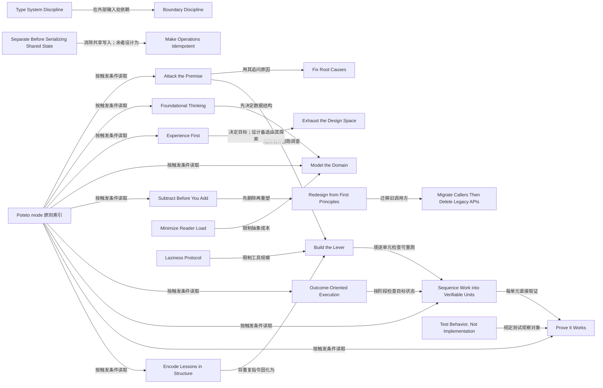

# G2-pstack-principles：pstack 的 principle-* 工程价值观

## 1. 概念地图

以下分组按 principle 约束的工作步骤重排，不是 pstack 的模块边界。pstack 自己在 `docs/research/code-landing-refs/pstack/docs/guide/08-principles.md`「The 23, briefly」和 `skills/poteto-mode/SKILL.md`「Principles」将其列为 Core、Architecture、Verification、Delegation、Meta。这里的“加载”特指 agent 阅读完整叶技能，不等于执行其中的建议：`skills/poteto-mode/SKILL.md`「Non-negotiables」「Principles」要求开始时见到触发索引，只在应用某条时读其 `SKILL.md` 全文，并在答复中说明它改变了哪项决定。23 条叶技能的 frontmatter 均为 `disable-model-invocation: true`；这表示它们不是直接调用入口，不表示全部正文常驻。`docs/guide/08-principles.md`「Steering in practice」还允许使用者说出名称来引导已有工作。

入口并非每个普通对话都常驻：`skills/poteto-mode/SKILL.md` frontmatter 的 `reminder` 只在新任务命中 playbook 或需要严格执行时建议启用；`agents/poteto-agent.md`「Poteto subagent」则明确要求这个代理先读完整入口，再按应用情况读叶技能。读过的 `skills/poteto-mode/scripts/bootstrap.ts` 只负责命令依赖安装，没有自动判断 principle 的代码；本次没找到“自动加载 23 条叶技能”的实现。[出处：上述三个文件各自所引位置。]

1. **理解与诊断。** `Attack the Premise`、`Fix Root Causes`、`Model the Domain` 要求先认清失败的前提、原因或业务状态，再选修法。
2. **目标与设计。** `Experience First`、`Exhaust the Design Space`、`Foundational Thinking`、`Redesign from First Principles` 决定目标、备选方案、基本结构及新需求如何进入旧设计。
3. **实现与改造。** `Subtract Before You Add`、`Laziness Protocol`、`Minimize Reader Load`、`Boundary Discipline`、`Type System Discipline`、`Migrate Callers Then Delete Legacy APIs`、`Outcome-Oriented Execution`、`Separate Before Serializing Shared State`、`Make Operations Idempotent` 约束代码形状、共享状态与迁移顺序。
4. **验证与交付。** `Build the Lever`、`Sequence Work into Verifiable Units`、`Test Behavior, Not Implementation`、`Prove It Works` 要求工作和证据可重复、逐单元检查，并观察真实结果。
5. **协作与持续改进。** `Guard the Context Window`、`Never Block on the Human`、`Encode Lessons in Structure` 控制信息负担、可逆工作的决策等待，以及重复错误如何沉淀成机制。

图中的箭头表示原文明确的互引或可从两条规则直接读出的配合，不表示执行器自动调度。尤其 `Experience First` 管目标、`Foundational Thinking` 管顺序，二者各自的 `SKILL.md` 明确区分；`Build the Lever` 倾向制作工具，`Laziness Protocol` 将其限制为最小工具；`Outcome-Oriented Execution` 允许有界的中间损坏，`Sequence Work into Verifiable Units` 仍要求各约定检查点可验证。这些是适用范围的配合，不是任意豁免。[出处：`skills/principle-experience-first/SKILL.md`「Experience First」；`skills/principle-build-the-lever/SKILL.md`「Balance」；`skills/principle-outcome-oriented-execution/SKILL.md`「Guardrails」；`skills/principle-sequence-verifiable-units/SKILL.md`「Execution」。]

**明确引用的分布。** `skills/poteto-mode/playbooks/refactoring.md`「2–7」连续引用 `model-the-domain`、`foundational-thinking`、`redesign-from-first-principles`、`subtract-before-you-add`、`laziness-protocol`、`migrate-callers-then-delete-legacy-apis`、`prove-it-works`、`minimize-reader-load`，并使用 `sequence-verifiable-units` 的逐步检查要求；`skills/poteto-mode/playbooks/feature.md`「4」引用 `model-the-domain`，另有 `separate-before-serializing-shared-state`、`sequence-verifiable-units` 的引用，且明确说 `Laziness Protocol` 不覆盖委托写代码的规定；`skills/poteto-mode/playbooks/worktree-cleanup.md`「1–3」引用 `build-the-lever`、`encode-lessons-in-structure`、`prove-it-works`、`guard-the-context-window`。`skills/poteto-mode/playbooks/orchestrate.md`「Worker / verifier」「preferences.md」引用 `separate-before-serializing-shared-state`、`encode-lessons-in-structure`；`skills/poteto-mode/playbooks/session-pickup.md`「1」「5」引用 `guard-the-context-window`、`prove-it-works`。其他直接引用见 `skills/poteto-mode/playbooks/` 下的 `hillclimb.md`、`multi-phase-plan.md`、`autonomous-run.md`、`trace-forensics.md`、`runtime-forensics.md`、`prototype.md`、`authoring-a-skill.md`、`bug-fix.md`、`autopilot-full.md`、`visual-parity.md`、`perf-issue.md` 各文件的步骤；它们分别把按需叶技能带入测量循环、长计划、运行、取证、原型、写技能、修错、交付或视觉工作。未把 `eval.md` 中“不让被测 agent 罗列 principles”的句子误当作某一叶技能的加载。

**其他技能中的引用。** `skills/figure-it-out/SKILL.md`「Start」先要求读 `poteto-mode` 的 principle 索引，后续阶段使用多条具体原则；`skills/architect/SKILL.md` 及 `skills/architect/references/runner-prompt.md`、`skills/arena/SKILL.md` 将设计、边界和共享状态原则带入方案比较；`skills/typescript-best-practices/SKILL.md` 引 `type-system-discipline`、`boundary-discipline`；`skills/no-comments/SKILL.md` 明说 `fix-root-causes` 和 `redesign-from-first-principles` 只指导意图、不扩张修复范围；`skills/reflect/SKILL.md` 与 `skills/show-me-your-work/SKILL.md` 引 `encode-lessons-in-structure`。`automations/benny/skills/triage-issue-reports/SKILL.md` 和 `reproduce-and-fix-issues/SKILL.md` 将共享状态、读者负担、上下文、可验证单位、根因和真实取证原则带入 issue 处理，其 `setup-benny/SKILL.md` 列了相应依赖。搜索到的非 principle 文件里，`attack-the-premise`、`experience-first`、`test-behavior-not-implementation` 只在 `poteto-mode` 索引具名，不在某个 playbook 步骤直接具名；仍可按触发条件读叶技能。[出处：以上各路径中的具名 `principle-*` 引用；`skills/poteto-mode/SKILL.md`「Principles」。]

下表逐文件列出其余 playbook 的具名引用；表内术语省去共同的 `principle-` 前缀，文件都在 `skills/poteto-mode/playbooks/` 下。引用意味着该步骤指向原则，不证明运行时已读叶技能。[出处：各行所列文件的具名原则句。]

| playbook 文件 | 引用的 principle-* |
| --- | --- |
| `hillclimb.md` | prove-it-works；build-the-lever；guard-the-context-window；separate-before-serializing-shared-state；sequence-verifiable-units；laziness-protocol |
| `multi-phase-plan.md` | never-block-on-the-human；guard-the-context-window；sequence-verifiable-units；encode-lessons-in-structure；prove-it-works |
| `autonomous-run.md` | sequence-verifiable-units |
| `trace-forensics.md`、`runtime-forensics.md` | guard-the-context-window |
| `prototype.md` | exhaust-the-design-space |
| `authoring-a-skill.md` | encode-lessons-in-structure |
| `bug-fix.md`、`perf-issue.md` | sequence-verifiable-units |
| `autopilot-full.md` | prove-it-works |
| `visual-parity.md` | separate-before-serializing-shared-state |

其他技能的具名引用也有各自用途；以下路径从快照根目录起，括号内是文件中可定位的标题或原则标识符。[出处：各行路径所指文件。]

| 其他技能文件与定位 | 引用的 principle-* |
| --- | --- |
| `skills/figure-it-out/SKILL.md`「Start」及后续 phases | prove-it-works；never-block-on-the-human；foundational-thinking；laziness-protocol；separate-before-serializing-shared-state；sequence-verifiable-units；encode-lessons-in-structure |
| `skills/architect/SKILL.md`（具名 `principle-*` 句） | exhaust-the-design-space；foundational-thinking；outcome-oriented-execution；redesign-from-first-principles；fix-root-causes；subtract-before-you-add |
| `skills/architect/references/runner-prompt.md`（具名 `principle-*` 句） | separate-before-serializing-shared-state；encode-lessons-in-structure；boundary-discipline；make-operations-idempotent；laziness-protocol；minimize-reader-load |
| `skills/arena/SKILL.md`（具名 `principle-*` 句） | separate-before-serializing-shared-state；redesign-from-first-principles；prove-it-works |
| `skills/typescript-best-practices/SKILL.md`（具名 `principle-*` 句） | type-system-discipline；boundary-discipline |
| `skills/no-comments/SKILL.md`（具名 `principle-*` 句） | fix-root-causes；redesign-from-first-principles，且不因此扩张修复范围 |
| `skills/reflect/SKILL.md`、`skills/show-me-your-work/SKILL.md`（具名 `principle-*` 句） | encode-lessons-in-structure |
| `automations/benny/skills/triage-issue-reports/SKILL.md`（具名 `principle-*` 句） | separate-before-serializing-shared-state；minimize-reader-load |
| `automations/benny/skills/reproduce-and-fix-issues/SKILL.md`（具名 `principle-*` 句） | guard-the-context-window；sequence-verifiable-units；fix-root-causes；prove-it-works |

## 2. 术语表

以下出处均以 `docs/research/code-landing-refs/pstack/` 为路径前缀；每行的 `skills/...` 或 `docs/...` 路径均指该前缀下的实际文件。MMW 路径则从本仓库根目录起。工作流列同时说明触发时刻；“按需”指 agent 根据 `skills/poteto-mode/SKILL.md`「Principles」的索引阅读叶技能，而不是所有叶技能常驻。

| 术语（原文） | 所属组 | 一句话定义 | 它解决什么问题 / 没有它会怎样 | 在工作流哪一步出现 | 相关术语 | MMW 近似对应 | 出处 |
| --- | --- | --- | --- | --- | --- | --- | --- |
| Experience First | 目标与设计 | 把最终使用者和维护者的体验定为取舍目标，宁可少做也要完成核心体验。 | 防止为工程方便增加无价值功能或交付粗糙流程。 | 产品、UX、功能范围取舍时按需读。 | Foundational Thinking；Exhaust the Design Space | 无 | `skills/principle-experience-first/SKILL.md`「Experience First」 |
| Foundational Thinking | 目标与设计 | 在写逻辑前选对类型、数据结构和共用基础，并按后续收益安排先后。 | 防止先堆功能再靠大量协调补救错误结构。 | 设计数据结构、脚手架和并发共享前按需读。 | Model the Domain；Subtract Before You Add | `mmw-v2/upstream/skills/engineering/domain-modeling/SKILL.md`「Domain Modeling」：都先明确领域模型；MMW 还把词汇和决策写进 CONTEXT/ADR，pstack 此条重数据结构与顺序。 | `skills/principle-foundational-thinking/SKILL.md`「Foundational Thinking」 |
| Model the Domain | 理解与诊断 | 用状态机、类型、表或其他符合业务规则的结构表达领域，而不是把规则散在条件分支里。 | 防止布尔值相互矛盾、规则重复和新功能继续加分支。 | 写有状态逻辑、见到跨文件形状假设时按需读；`poteto-mode` 的「Non-negotiables」规定写任何代码先命名数据形状。 | Foundational Thinking；Type System Discipline | `mmw-v2/upstream/skills/engineering/domain-modeling/SKILL.md`「Domain Modeling」：都要求清晰领域模型；MMW 侧重术语、CONTEXT 和 ADR，pstack 侧重代码中的结构。 | `skills/principle-model-the-domain/SKILL.md`「Model the Domain」；`skills/poteto-mode/SKILL.md`「Non-negotiables」 |
| Prove It Works | 验证与交付 | 对真实产物直接检查任务结果，不把编译成功、缓存或 agent 自述当作结果证据。 | 防止依据间接信号误报完成。 | 任务完成、声明成功前按需读；多个 playbook 直接引用。 | Build the Lever；Sequence Work into Verifiable Units | `mmw-v2/skills/verify-ticket/SKILL.md`「Verify ticket」：都要求留下可核查证据；MMW 执行票面 `CHECK:`／`EXPECT:` 并记事件，pstack 本条还要求直接观察真实产物。 | `skills/principle-prove-it-works/SKILL.md`「Prove It Works」「Script the check when you can」 |
| Build the Lever | 验证与交付 | 非平凡工作先做能执行或证明工作的可重跑工具，如脚本、生成器或代理共用指令。 | 手工改动难以一致地重做，也难让审阅者复核。 | 编辑、迁移、分析和检查前按需读；`worktree-cleanup` 明引。 | Laziness Protocol；Prove It Works；Encode Lessons in Structure | `mmw-v2/upstream/skills/engineering/diagnosing-bugs/SKILL.md`「Phase 1: Build a feedback loop」：都做可运行的证据工具；MMW 该技能限于故障反馈环，pstack 扩到所有非平凡工作。 | `skills/principle-build-the-lever/SKILL.md`「Build the Lever」「Pattern」；`skills/poteto-mode/playbooks/worktree-cleanup.md`「1. Snapshot and audit」 |
| Sequence Work into Verifiable Units | 验证与交付 | 把多步工作排成每一步都能检查的单位，检查通过才开始下一步，并让提交顺序保留证明。 | 防止批末才发现故障而无法定位是哪步造成。 | 扫描、迁移、连续编辑与提交堆栈时按需读。 | Prove It Works；Build the Lever；verifiable unit | `mmw-v2/upstream/skills/engineering/tdd/SKILL.md`「Rules of the loop」：都逐小步验证；MMW 的 TDD 是测试先红后绿，pstack 还管迁移和提交排序。 | `skills/principle-sequence-verifiable-units/SKILL.md`「Sequence work into verifiable units」「Execution」「Delivery」 |
| Test Behavior, Not Implementation | 验证与交付 | 从使用者调用方式运行代码，拿可观察结果同独立的具体期望值比较。 | 防止只证明函数被调用、常量未变或测试自身数据正确的无效测试。 | 编写、修改、保留测试时按需读。 | Prove It Works；literal expected value | `mmw-v2/upstream/skills/engineering/tdd/SKILL.md`「What a good test is」「Anti-patterns」：都从公开接口测行为、独立确定期望；pstack 另用“导入函数都返回 undefined”筛查弱测试。 | `skills/principle-test-behavior-not-implementation/SKILL.md`「Test Behavior, Not Implementation」「Five shapes」 |
| Fix Root Causes | 理解与诊断 | 先复现并追问故障为何发生，修正根因且检查同类位置。 | 防止用空值保护或特殊补丁掩盖真实故障。 | 报错、性能问题、重启后故障时按需读。 | Attack the Premise；Prove It Works | `mmw-v2/upstream/skills/engineering/diagnosing-bugs/SKILL.md`「Phase 1: Build a feedback loop」「Phase 5: Fix + regression test」：都先复现再修；MMW 明列反馈环、假设和回归步骤，pstack 叶技能更短。 | `skills/principle-fix-root-causes/SKILL.md`「Fix Root Causes」「Restart bugs: suspect state before code」 |
| Attack the Premise | 理解与诊断 | 同一前提下两次以上修法未过同一关口时，先统计失衡由谁承担，再质疑该前提。 | 防止在错误前提上继续叠加补偿机制。 | 重复失败后的下一次修复之前按需读。 | Fix Root Causes；Build the Lever；Laziness Protocol | `mmw-v2/skills/advisor/SKILL.md`「Advisor」：都在问题抵抗两次尝试后重看决定；MMW 引入独立意见，pstack 先要求可重跑的 actor census。 | `skills/principle-attack-the-premise/SKILL.md`「Attack the Premise」「Pattern」「Stop」 |
| Redesign from First Principles | 目标与设计 | 新要求进入现有设计时，按“从一开始就有该要求”重新推导整体形状，再增量交付。 | 防止不断外挂适配层，并漏改类型、文档或例子。 | 既有设计接受新要求时按需读。 | Attack the Premise；Foundational Thinking；Subtract Before You Add | 无 | `skills/principle-redesign-from-first-principles/SKILL.md`「Redesign From First Principles」 |
| Exhaust the Design Space | 目标与设计 | 无先例且有多种可行方案时，先做 2–3 个真正不同的原型或草图并并排比较。 | 防止因首个方案顺手而过早承诺错误体验或架构。 | 新颖交互或架构选择前按需读。 | Experience First；prototype | `mmw-v2/upstream/skills/engineering/prototype/SKILL.md`「Prototype」：都以具体试作降低设计不确定性；pstack 明定比较 2–3 种备选，MMW 原型用于回答设计问题。 | `skills/principle-exhaust-the-design-space/SKILL.md`「Exhaust the Design Space」「When it applies」 |
| Subtract Before You Add | 实现与改造 | 在新增或重塑之前先删除死代码、重复校验和无新内容的引用。 | 防止新功能叠在旧复杂性之上。 | 新增、重构、重写排步骤时按需读；`refactoring` playbook 明引。 | Laziness Protocol；Foundational Thinking | 无 | `skills/principle-subtract-before-you-add/SKILL.md`「Subtract Before You Add」「The pattern」；`skills/poteto-mode/playbooks/refactoring.md`「4. Subtract before you add」 |
| Laziness Protocol | 实现与改造 | 以最少代码和层级达到结果，优先删除、合并重复决定、避免无必要的信号传递。 | 防止“优雅”样板和深调用链提高维护成本。 | 评估重构或差异规模、想加抽象时按需读。 | Subtract Before You Add；Minimize Reader Load；Build the Lever | `mmw-v2/upstream/skills/engineering/codebase-design/SKILL.md`「Deep vs shallow」「Principles」：都拒绝仅传递调用的浅层；MMW 以接口的能力/学习成本衡量深度，pstack 还要求最小 diff。 | `skills/principle-laziness-protocol/SKILL.md`「Laziness Protocol」 |
| Minimize Reader Load | 实现与改造 | 同时减少读者必须追踪的层数和记住的隐藏可变状态。 | 防止代码行数少却仍需跨层追踪或记住大量全局状态。 | 代码难追溯、审查模块形状时按需读。 | Laziness Protocol；Guard the Context Window；Model the Domain | `mmw-v2/upstream/skills/engineering/codebase-design/SKILL.md`「Deep vs shallow」「Principles」：都压缩无价值接口和传递层；pstack 还明确计数隐藏状态这第二个轴。 | `skills/principle-minimize-reader-load/SKILL.md`「Minimize Reader Load」「The pattern」 |
| Boundary Discipline | 实现与改造 | 在 CLI、配置、网络等外部边界验证和收窄类型，内部信任已验证数据并把业务逻辑留给纯函数。 | 防止各层反复防御、框架接线里藏业务规则。 | 接入校验、错误处理、框架适配时按需读。 | Type System Discipline；Model the Domain | `mmw-v2/upstream/skills/engineering/codebase-design/SKILL.md`「Seam」「Designing for testability」：都把逻辑放在可测试接口后；MMW 的 seam 是可替换行为的位置，不等于 pstack 的输入校验边界。 | `skills/principle-boundary-discipline/SKILL.md`「Boundary Discipline」「The pattern」 |
| Type System Discipline | 实现与改造 | 用代数数据类型、带语义的基础值、穷尽匹配和权威 schema 导出类型，让错误状态无法通过编译。 | 防止矛盾字段组合、不同 ID 混用和新增变体被漏处理。 | 设计类型、函数签名或写静态类型语言时按需读。 | Boundary Discipline；Model the Domain；illegal states | 无 | `skills/principle-type-system-discipline/SKILL.md`「Type System Discipline」「The patterns」 |
| Separate Before Serializing Shared State | 实现与改造 | 多个 actor 可能写同一状态时先拆开写入目标，真要共享时才用锁、单写者或顺序阶段。 | 防止竞争条件，也避免把锁当作共享设计的默认修补。 | 并行写文件、分支、键或状态对象之前按需读；`orchestrate` playbook 明引。 | Foundational Thinking；Make Operations Idempotent | 无 | `skills/principle-separate-before-serializing-shared-state/SKILL.md`「Separate Before Serializing Shared State」「Pattern」；`skills/poteto-mode/playbooks/orchestrate.md`「Worker / verifier」 |
| Make Operations Idempotent | 实现与改造 | 让有副作用的命令在重复执行、半途崩溃后重试时仍收敛到同一正确状态。 | 防止重启和重试受残留状态左右。 | 命令、生命周期和处理循环设计时按需读。 | Separate Before Serializing Shared State；reconciliation | 无 | `skills/principle-make-operations-idempotent/SKILL.md`「Make Operations Idempotent」「The test」 |
| Migrate Callers Then Delete Legacy APIs | 实现与改造 | 新内部 API 定案后同一轮迁移所有调用者并删除旧接口。 | 防止为内部兼容长期维护两条路径。 | 没有外部兼容义务的内部 API 重构时按需读；`refactoring` playbook 明引。 | Outcome-Oriented Execution；Subtract Before You Add | 无 | `skills/principle-migrate-callers-then-delete-legacy-apis/SKILL.md`「Migrate Callers Then Delete Legacy APIs」「When this applies」；`skills/poteto-mode/playbooks/refactoring.md`「5. Move in small behavior-preserving steps」 |
| Outcome-Oriented Execution | 实现与改造 | 已计划的重写或迁移以可验证的最终架构为目标，只在声明的阶段允许可逆的中间损坏。 | 防止为每一步的平滑运行留下临时兼容债。 | 有明确阶段边界的迁移、重写时按需读。 | Sequence Work into Verifiable Units；Migrate Callers Then Delete Legacy APIs | 无 | `skills/principle-outcome-oriented-execution/SKILL.md`「Outcome-Oriented Execution」「Guardrails」 |
| Guard the Context Window | 协作与持续改进 | 将大输出和长文档交给子代理处理，主对话只保留结论，常用内容则留在就近正文。 | 防止上下文耗尽、压缩损失和判断质量下降。 | 大输出、重复阅读或并行规划时按需读；`session-pickup`、`trace-forensics` 明引。 | Minimize Reader Load；subagent | 无 | `skills/principle-guard-the-context-window/SKILL.md`「Guard the Context Window」「Pattern」；`skills/poteto-mode/playbooks/session-pickup.md`「1. Locate the prior trail」 |
| Never Block on the Human | 协作与持续改进 | 可逆工程工作由 agent 判断并完成后呈报；不可逆操作和产品方向仍交给人。 | 防止每个执行细节都等待人批准而停工。 | 想为可逆工作提“要不要做”时按需读。 | Outcome-Oriented Execution；reversible action | `mmw-v2/upstream/skills/engineering/implement/SKILL.md`「Close the ticket」：都把需人判断的事项切出、其余继续；MMW 在票面留下 `decision` 子票，pstack 叶技能强调先执行可逆事项。 | `skills/principle-never-block-on-the-human/SKILL.md`「Never Block on the Human」「Boundaries」 |
| Encode Lessons in Structure | 协作与持续改进 | 同一提醒第二次出现时优先把它改成 lint、元数据、运行检查或脚本，而非再写一遍提示。 | 防止规则仅靠读者记住而反复失效。 | 人纠正、测试失败或重复指令之后按需读；`orchestrate` 与 `worktree-cleanup` 明引。 | Build the Lever；Type System Discipline | 无 | `skills/principle-encode-lessons-in-structure/SKILL.md`「Encode Lessons in Structure」「Pattern」「Feedback loop」 |
| lever | 验证与交付 | 能执行或重查一项工作的可重跑工具文件，而非泛指任何自动化平台。 | 给审阅者同一种可重复的操作和证据。 | 非平凡工作开始前制作，逐单元检查中复用。 | Build the Lever；deterministic script | `mmw-v2/upstream/skills/engineering/diagnosing-bugs/SKILL.md`「Phase 1: Build a feedback loop」：都追求可重跑信号；MMW 该处专为诊断，不要求每项非平凡工作产出工具。 | `skills/principle-build-the-lever/SKILL.md`「Build the Lever」「Pattern」 |
| reader load | 实现与改造 | 读者为回答代码问题需跨越的层数与脑中保持的状态量。 | 比代码行数更直接地衡量是否容易维护。 | 审查、重构和命名边界时衡量。 | Minimize Reader Load；layers to trace；state to hold | `mmw-v2/upstream/skills/engineering/codebase-design/SKILL.md`「Depth」「Deep vs shallow」：都关注接口理解成本；MMW 不用同一双轴指标。 | `skills/principle-minimize-reader-load/SKILL.md`「Minimize Reader Load」 |
| verifiable unit | 验证与交付 | 一次变更连同变更前可信状态和变更后的检查所构成的小工作单位。 | 出错时能定位到当前单位，而不是整个批次。 | 扫描、迁移、连续提交的每一步。 | Sequence Work into Verifiable Units；Prove It Works | `mmw-v2/upstream/skills/engineering/tdd/SKILL.md`「Rules of the loop」：都一轮一项；MMW 该处专门是一个测试加最小实现。 | `skills/principle-sequence-verifiable-units/SKILL.md`「Execution」 |
| idempotent | 实现与改造 | 操作重复执行或崩溃后再执行，最终仍达到同一正确状态的性质。 | 使重试不依赖残留状态的偶然细节。 | 生命周期、调度和有副作用命令设计时。 | Make Operations Idempotent；reconciliation | 无 | `skills/principle-make-operations-idempotent/SKILL.md`「Make Operations Idempotent」「The test」 |
| system boundary | 实现与改造 | 原始外部数据进入系统、需要校验并转成内部类型的接口位置。 | 把错误挡在入口，减少深处重复检查。 | CLI、配置、网络、外部 API 接入时。 | Boundary Discipline；Type System Discipline | `mmw-v2/upstream/skills/engineering/codebase-design/SKILL.md`「Seam」：都界定接口位置；MMW seam 讨论替换行为，不能把两词当同义词。 | `skills/principle-boundary-discipline/SKILL.md`「The pattern」；`skills/principle-type-system-discipline/SKILL.md`「External data is untyped until parsed」 |
| Make illegal states unrepresentable | 实现与改造 | 把业务不允许的状态排除在数据类型的可构造值之外。 | 用编译期约束减少运行期矛盾和防御检查。 | 选领域状态和类型时。 | Type System Discipline；Model the Domain | 无 | `skills/principle-type-system-discipline/SKILL.md`「Make illegal states unrepresentable」；`skills/principle-model-the-domain/SKILL.md`「Model the Domain」 |
| census | 理解与诊断 | 对每个参与者分别统计失衡归属的可重跑调查。 | 看出某些 actor 是否被固定分派不对称角色，而非只看总量。 | 同前提两次失败后、第三种修法前。 | Attack the Premise；lever；Fix Root Causes | 无 | `skills/principle-attack-the-premise/SKILL.md`「Pattern」「Stop」 |

## 3. 容易误解的地方

1. `docs/guide/08-principles.md`「Steer with principle names」的“名称可引导”不等于 23 份正文一直在上下文里。`skills/poteto-mode/SKILL.md`「Principles」只常驻触发索引；应用时仍须读叶技能全篇并报出改变的决定。
2. `skills/principle-build-the-lever/SKILL.md`「Build the Lever」的 `lever` 是能重跑的具体文件；`skills/principle-encode-lessons-in-structure/SKILL.md`「Encode Lessons in Structure」是把**重复**规则变成长期机制。前者服务当前工作，后者处理反复纠正，不能互代。
3. `skills/principle-attack-the-premise/SKILL.md`「Attack the Premise」不是“从头重新设计”。它只在同一前提下至少两次失败后，先统计 actor 归属再检验事实前提；`skills/principle-redesign-from-first-principles/SKILL.md`「Redesign From First Principles」处理新需求如何纳入旧设计。
4. `skills/principle-outcome-oriented-execution/SKILL.md`「Guardrails」允许的中间损坏是计划内、限定范围、可逆且有阶段验证的迁移状态；不是免测许可。`skills/principle-sequence-verifiable-units/SKILL.md`「Execution」仍要求在约定单位处检查。
5. `skills/principle-never-block-on-the-human/SKILL.md`「Boundaries」不替人决定产品方向，也不授权不可逆动作。它反对的是可逆工程事项反复等批准。
6. `skills/principle-boundary-discipline/SKILL.md`「The pattern」的 `boundary` 是外部数据进入处；MMW 的 `mmw-v2/upstream/skills/engineering/codebase-design/SKILL.md`「Seam」是可替换行为的接口位置，同一段代码可能同时具备两种性质，但两词不是同义词。
7. `skills/principle-test-behavior-not-implementation/SKILL.md`「Test Behavior, Not Implementation」的 `undefined` 检查是发现没有观察行为的测试的反事实问题，不要求实际把所有函数改成 `undefined` 才能运行测试。

## 4. 一个具体例子

`skills/poteto-mode/playbooks/refactoring.md`「2. Name the structure」「3. Name the target shape」「4. Subtract before you add」「5. Move in small behavior-preserving steps」「6. Prove behavior」「7. Confirm the change is worth keeping」给出一次行为不变的重构路径。agent 先按 `Model the Domain` 找出旧代码缺少的业务结构：例如某状态在几个文件重复以条件分支表达，目标不是新增一层转发模块，而是让一个数据结构表达这些状态。随后按 `Subtract Before You Add` 先删死代码、一次性包装和重复校验，再按 `Migrate Callers Then Delete Legacy APIs` 在同一轮把调用方迁到新接口并删除旧路径。最后按 `Prove It Works` 对真实产物比较新旧输出或在同一界面做 smoke run，按 `Minimize Reader Load` 判断读者追踪层数和隐藏状态是否真减少。这个例子是 playbook 的规定路径，不是本次调查执行过的重构；这些规则分别在各自 `skills/principle-*/SKILL.md` 的同名标题及 `skills/poteto-mode/playbooks/refactoring.md` 上述编号步骤中出现。

## 5. 未读到或不确定

- 23 个 `skills/principle-*/` 目录在本快照中均只有 `SKILL.md`，未找到 `references/`。没有执行 pstack；因此“读取索引后每次都实际按条件读全叶技能”是文本约定，不是运行观察。[出处：`skills/poteto-mode/SKILL.md`「Principles」；各 `skills/principle-*/SKILL.md`。]
- 图中的跨 principle 配合不是依赖解析器或自动执行顺序；除叶技能显式互引及 playbook 明引外，其余仅是规则语义的合读。[出处：`skills/principle-build-the-lever/SKILL.md`「Balance」；`skills/principle-sequence-verifiable-units/SKILL.md`「Execution」；`skills/poteto-mode/playbooks/refactoring.md` 编号步骤。]
- MMW 栏的“无”只表示已读的本仓库对应材料中没有足够近的同一条原则，不声称全仓库绝不存在相似做法；本次未逐一审查全部 MMW 技能。[出处：本仓库 `mmw-v2/skills/verify-ticket/SKILL.md`「Verify ticket」、`mmw-v2/skills/advisor/SKILL.md`「Advisor」、`mmw-v2/upstream/skills/engineering/` 下表内所列技能。]
