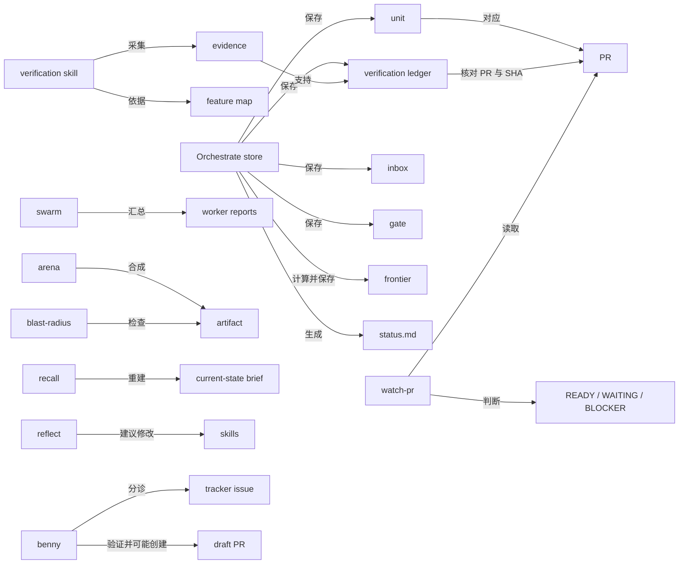

# G3-pstack-machinery-terms：pstack 的机器层概念

## 1. 概念地图

本页把术语分为五组：

1. **Orchestrate store**：把长期、多人的项目工作、验证和待决问题保存成可重新读取的事实。
2. **PR watcher**：把 GitHub 的 PR、检查和 review 信息转换成可执行的等待或阻断判断。
3. **Verification skill**：给后续 agent 一套从用户入口操作真实产品并保留证据的项目专用方法。
4. **Parallel work**：规定并行尝试、筛选、合成与影响范围检查各自的责任。
5. **Experience and automation**：从记录恢复或提取经验，以及让 Slack 报告进入受控的自动处理流程。

## 2. 术语表

| 术语（原文） | 所属组 | 一句话定义 | 它解决什么问题 / 没有它会怎样 | 在工作流哪一步出现 | 相关术语 | MMW 近似对应 | 出处 |
| --- | --- | --- | --- | --- | --- | --- | --- |
| `Orchestrate` | Orchestrate store | 一个本地、持久的项目协调方式：协调者写任务说明、处理完成通知和判断，`orch` CLI 只记账，不启动或唤醒 agent。 | 长期项目跨会话运行时，不能只靠对话记住工作。 | 项目超过一个 agent 会话可完成的范围时。 | `store`, `unit`, `inbox` | `night`，见 `docs/contexts/night/CONTEXT.md` 的 **night**：同为跨 ticket 的协调；MMW 以 tracker event 为权威，Orchestrate 以本地 store 记账。 | `docs/research/code-landing-refs/pstack/skills/poteto-mode/playbooks/orchestrate.md`，**Orchestrate**、**Roles and placement** |
| `store` | Orchestrate store | `orchestrate/<project-slug>/` 下的纯文本记录集合，由 `orch init` 初始化；CLI 读写其中的 `units.tsv`、`ledger.tsv`、`inbox/`、`gates.md`、`preferences.md`、`frontier.json` 并生成 `status.md`。 | 让协调者重启后能按事实恢复项目，而非重新猜测。 | 项目开始、每次 drain、恢复时。 | `unit`, `frontier`, `status.md` | `state directory`，见 `docs/contexts/night/CONTEXT.md` 的 **state directory**：都存本机运行数据；MMW 的 ticket 状态不在该目录而在 tracker event 中。 | `docs/research/code-landing-refs/pstack/skills/poteto-mode/scripts/orch/store.ts`，`Store`、`openStore`、`init`；同目录 `playbooks/orchestrate.md`，**Store layout** |
| `unit` / `units.tsv` | Orchestrate store | 一项被协调的工作，字段原样为 `id`, `track`, `state`, `branch`, `pr`, `sha`, `brief`；新增时 `state=pending`，其他关联字段为空。 | 让每项工作与负责人轨道、分支、PR 和说明相连，供计数和追踪。 | 写 brief 后登记，drain 时更新。 | `brief`, `ledger` | `ticket`，见 `docs/contexts/night/CONTEXT.md` 的 **landing pipeline**、**dispatch**：都划分工作；MMW ticket 在 issue tracker 并带验收条件，unit 只是本地表中一行。 | `docs/research/code-landing-refs/pstack/skills/poteto-mode/scripts/orch/store.ts`，`UNIT_HEADER`、`Unit`、`units.add`、`units.set` |
| `unit.state` | Orchestrate store | **不是枚举**：存储层接受任何非空单行值；确定由机器赋的初始值只有 `pending`（待处理），测试使用 `done`（完成），playbook 的收尾提到 `abandoned`（放弃）和 `zombie-reconciled`（迟到结果已核对）。 | 避免把示例状态误当机器强制的有限状态机。 | 新增和更新 unit 时。 | `inbox.status` | `phase`，见 `docs/contexts/night/CONTEXT.md` 的 **phase**：两者都概括进度；MMW phase 是最新 event 的名称，非任意可写字符串。 | `docs/research/code-landing-refs/pstack/skills/poteto-mode/scripts/orch/store.ts`，`Unit`、`units.add`、`units.set`；同目录 `orch.test.ts`，`composes unit add, set, get, list, and counts`；`playbooks/orchestrate.md`，**Steps** 第 7 步 |
| `brief` / `standing orders` | Orchestrate store | `brief` 是交给一个 worker 的完整任务约定；`preferences.md` 的编号 standing orders 是每次 spawn 和 resume 都要带上的项目约束。 | 新 agent 看不到协调者对话，遗漏范围或约束会造成偏离。 | spawn 前、resume 时。 | `unit`, `preferences.md` | `start prompt`，见 `docs/contexts/night/CONTEXT.md` 的 **start prompt**：都把工作说明交给新 session；MMW 从 ticket 和角色生成，pstack 协调者自行写 brief。 | `docs/research/code-landing-refs/pstack/skills/poteto-mode/playbooks/orchestrate.md`，**The brief**、**Store layout**；`scripts/orch/store.ts`，`standing.add` |
| `inbox` / `inbox pointer` | Orchestrate store | `inbox/` 每个 TSV 文件是一条完成通知指针，字段 `ts`, `agent`, `unit`, `status`, `report`；`push` 入队，`drain` 取出并清空当时的队列。 | 完成通知不打断协调者正在做的关键操作；批量处理可避免丢项。 | 子 agent 返回后及每个 drain 点。 | `unit`, `status.md` | `wake queue`，见 `docs/contexts/night/CONTEXT.md` 的 **wake queue**：都传递待处理通知；MMW relay 队列以 ack 删除，pstack `inbox drain` 批量清空。 | `docs/research/code-landing-refs/pstack/skills/poteto-mode/scripts/orch/store.ts`，`InboxPointer`、`inbox.push`、`inbox.drain`；`playbooks/orchestrate.md`，**Queue and drain** |
| `inbox.status` | Orchestrate store | **不是枚举**：`push` 只要求非空；测试用 `done`（完成）和 `failed`（失败），playbook 要协调者把 pointer 分为 `landed`（已落地）、`needs-verify`（需验证）、`failed`（失败）、`zombie`（迟到）、`noise`（无关），但这些分类没有被 CLI 强制。 | 区分消息内容与机器保证，避免据自由文本自动放行。 | `inbox push` 和 drain 分类时。 | `unit.state` | 无。 | `docs/research/code-landing-refs/pstack/skills/poteto-mode/scripts/orch/store.ts`，`PushInboxParams`、`inbox.push`；`playbooks/orchestrate.md`，**Queue and drain** |
| `verification ledger` / `ledger.tsv` | Orchestrate store | 按 `pr` 与当前 `sha` 配对的验证记录，列为 `pr`, `sha`, `verdict`, `evidence`, `verifier`, `ts`；相同配对的新记录覆盖旧记录。 | PR 改了提交后，旧验证不能证明新代码；没有这张表只能依赖记忆或 CI 绿灯。 | 验证后 `record`，落地前 `check`。 | `Verdict`, `frontier` | `CHECK:` / `EXPECT:`，见 `mmw-v2/skills/verify-ticket/SKILL.md` 的 **Verify ticket**：都要求可核验结果；MMW 按 ticket 的 criterion 运行并写 tracker event，pstack ledger 只保存 PR+SHA verdict。 | `docs/research/code-landing-refs/pstack/skills/poteto-mode/scripts/orch/store.ts`，`LEDGER_HEADER`、`ledger.record`、`ledger.check`；`playbooks/orchestrate.md`，**Verification** |
| `Verdict` | Orchestrate store | ledger 的固定五值：`live-ui-verified`＝真实 UI 已验证；`unit-test-verified`＝单元测试已验证；`type-check-only`＝只做类型检查；`verifier-blocked`＝验证被环境/条件阻住；`verifier-failed`＝验证失败。 | 让验证强度和失败原因可区分；`type-check-only` 不足以证明行为，后两者不是通过。 | `ledger record`。 | `verification ledger` | `ticket.passed`，见 `mmw-v2/skills/verify-ticket/SKILL.md` 的 **Verify ticket** 与 `docs/contexts/night/how-it-works.md` 的 **Events and holds**：都记录验收结果；MMW 是运行 criterion 后的 ticket event，pstack 是人工或 verifier 写的 PR+SHA 分级记录。 | `docs/research/code-landing-refs/pstack/skills/poteto-mode/scripts/orch/store.ts`，`Verdict`、`parseVerdict`；`playbooks/orchestrate.md`，**Verification** |
| `NOT-VERIFIED` | Orchestrate store | `ledger check` 找不到指定 PR+SHA 时的输出值，CLI 同时以退出码 2 表示未找到；它不是 ledger 可记录的 `Verdict`。 | 防止把缺失记录误解成一种已完成的验证。 | 落地前核对时。 | `verification ledger` | 无。 | `docs/research/code-landing-refs/pstack/skills/poteto-mode/scripts/orch/store.ts`，`ledger.check`、`NotFoundError`；同目录 `orch.ts`，`handleError` |
| `gate` / `gates.md` | Orchestrate store | 保存待人决定的问题，字段 `id`, `question`, `options`, `defaultAnswer`，解决后加 `answer`；`kind` 只有 `open`（未解决）与 `resolved`（已回答）。 | 产品或不可逆选择可暂停在明确问题上，同时其他 unit 继续。 | 遇到确需人判断时 `park`，回答后 `resolve`。 | `standing orders`, `status.md` | `decision` child，见 `mmw-v2/skills/dispatch/references/night.md` 的 **3. Each time something wakes you**：都承载人的决定；MMW 在 ticket 子 issue/event，pstack 在本地 Markdown。 | `docs/research/code-landing-refs/pstack/skills/poteto-mode/scripts/orch/store.ts`，`OpenGate`、`ResolvedGate`、`renderGates`、`gates.park`、`gates.resolve` |
| `frontier` / `frontier.json` | Orchestrate store | 从 Graphite `gt log`、`gt info` 和本地 branch SHA 计算的有序 PR 表，含 `generation`, `prs`, `lowestUnmerged`；可用 `--prs` 校验预期顺序。 | stack 重排或 SHA 变化时用当前拓扑判断底部待合并 PR，避免靠叙述追踪。 | `orch frontier set` 初始化及每次 merge/stack 改动后。 | `FrontierPrState`, `watch-pr frontier` | `frontier`，见 `docs/contexts/night/CONTEXT.md` 的 **advance** 和 `docs/contexts/night/how-it-works.md` 的 **Events and holds**：都指出可推进工作；MMW 根据 ticket 依赖与 event 计算，pstack `frontier.json` 根据 Graphite stack 计算。 | `docs/research/code-landing-refs/pstack/skills/poteto-mode/scripts/orch/store.ts`，`Frontier`、`frontier.set`、`resolveFrontier`；`playbooks/orchestrate.md`，**Stack safety** |
| `FrontierPrState` | Orchestrate store | `frontier.json` 每个 PR 的固定三值：`OPEN`＝尚未合并，`MERGED`＝已合并，`CLOSED`＝关闭而未被当作合并；`lowestUnmerged` 实际取第一条 `OPEN`，不是第一条 `CLOSED`。 | 明确 stack 中哪些 PR 仍可推进。 | `frontier set` 解析 `gt info` 时。 | `frontier` | 无。 | `docs/research/code-landing-refs/pstack/skills/poteto-mode/scripts/orch/store.ts`，`FrontierPrState`、`parseGtPullRequest`、`frontier.set` |
| `status.md` | Orchestrate store | `orch status` 从 units、ledger、frontier、gates 重新渲染的 **Orchestrate status** 页面，含四张表、状态计数及隐藏 `orch-summary`；CLI 另打印 counts、changed、open gates 三行。 | 让人和 agent 一眼看当前数量及上次渲染以来的派生变化，不必手工维护叙述。 | 每次 drain 后和向人报告前。 | `StatusSummary` | `dispatch.sh status`，见 `docs/contexts/night/CONTEXT.md` 的 **status**：都提供批次状态；MMW 直接从 tracker fold 读取且不保存状态页，pstack 生成本地 Markdown。 | `docs/research/code-landing-refs/pstack/skills/poteto-mode/scripts/orch/store.ts`，`statusMarkdown`、`status.render`；同目录 `orch.ts`，`statusLines` |
| `watch-pr` | PR watcher | 只读 GitHub PR watcher：读取 PR、未解决 review thread、checks 和 merge 状态，持续输出判断；不替人合并。 | 把「当前能否推进」从人工反复查看 GitHub 变为一致的判定。 | PR 提交后监看 CI/review/merge queue。 | `PrSnapshot`, `WatcherVerdict` | `relay` / `watchdog`，见 `docs/contexts/night/CONTEXT.md` 的 **relay**、**watchdog**：都观察运行状态；MMW 观察 ticket event 和 session 活性，`watch-pr` 观察 GitHub PR 的合并条件。 | `docs/research/code-landing-refs/pstack/skills/poteto-mode/scripts/watch-pr/cli.ts`，`parseArgs`、`main`；同目录 `policy.ts`，`runSimple`、`runQueued` |
| `WatchMode` | PR watcher | 固定三种：`single`＝一条 PR；`stack`＝相连 PR 集合，全部满足条件才 `READY`；`queued-stack`＝冻结底到顶 PR 队列，持续等到所有 PR 实际合并才 `COMPLETE`。 | 避免把「可合并」和「队列已全部合并」混为一谈。 | 启动 watcher 时由 CLI 选定。 | `READY`, `COMPLETE` | `open-ticket` / `night`，见 `docs/contexts/night/CONTEXT.md` 的 **open-ticket**、**night**：都区分单项和批次；MMW 跑 ticket 的落地流水线，不监看 GitHub PR stack。 | `docs/research/code-landing-refs/pstack/skills/poteto-mode/scripts/watch-pr/types.ts`，`WatchMode`；同目录 `cli.ts`，`parseArgs` |
| `PrSnapshot` | PR watcher | 一次读取的 PR 状态：`merged`＝已合并、`closed`＝未合并关闭、`open`＝仍开放且附带 threads 与 CI；开放 PR 另有 `isDraft`、`reviewDecision` 等事实。 | 让 policy 用同一张快照决策，避免只看 CI 忽略 review 或草稿状态。 | 每轮轮询。 | `CiState`, `MergeBlocker` | 无。 | `docs/research/code-landing-refs/pstack/skills/poteto-mode/scripts/watch-pr/types.ts`，`PrSnapshot`、`PullRequestFacts`；同目录 `policy.ts`，`readSnapshot` |
| `PullRequestFacts.state` / `mergeable` / `reviewDecision` | PR watcher | GitHub 原值逐个为：`state` 的 `OPEN`＝开放、`CLOSED`＝关闭、`MERGED`＝已合并；`mergeable` 的 `MERGEABLE`＝可合并、`CONFLICTING`＝冲突、`UNKNOWN`＝未定；`reviewDecision` 的 `APPROVED`＝已批准、`CHANGES_REQUESTED`＝要求修改、`REVIEW_REQUIRED`＝尚需 review、`null`＝无决定。pstack 明确阻断 `CONFLICTING` 和 `CHANGES_REQUESTED`，但不把 `REVIEW_REQUIRED` 单独当 blocker。 | 防止把 GitHub 原始事实与 pstack 最终决策等同。 | 读取 PR 事实后。 | `PrSnapshot`, `MergeBlocker` | 无。 | `docs/research/code-landing-refs/pstack/skills/poteto-mode/scripts/watch-pr/types.ts`，`PullRequestFacts`、`ReviewDecision`；同目录 `github.ts`，`parsePullRequest`；同目录 `policy.ts`，`conflictBlocker`、`gateReason` |
| `MergeStateStatus` / `RollupState` | PR watcher | 接收的 GitHub 枚举逐个为：`MergeStateStatus` 的 `BEHIND`＝落后、`BLOCKED`＝GitHub 报阻断、`CLEAN`＝干净、`CONFLICTING`＝冲突、`DIRTY`＝有冲突/脏合并、`DRAFT`＝草稿、`HAS_HOOKS`＝有 hooks、`UNKNOWN`＝未知、`UNSTABLE`＝不稳定；`RollupState` 的 `ERROR`＝错误、`EXPECTED`＝预期未完成、`FAILURE`＝失败、`PENDING`＝进行中、`SUCCESS`＝成功、`null`＝无值。pstack 对这些值只特别处理 `DIRTY`/`CONFLICTING`、以及 `BLOCKED` 配合 head `ERROR`/`FAILURE`；其余不能凭字面推断为 watcher 的 `READY`。 | 避免把平台状态直接当最终合并许可。 | 读取 GitHub PR 与 commit rollup 后。 | `GitHubMergeAssessment`, `CiState` | 无。 | `docs/research/code-landing-refs/pstack/skills/poteto-mode/scripts/watch-pr/types.ts`，`MergeStateStatus`、`RollupState`；同目录 `policy.ts`，`assessGitHubMerge`、`conflictBlocker` |
| `Check.kind` | PR watcher | 检查项固定五类：`passed`＝通过；`skipped`＝跳过；`failed`＝失败或不认识的非通过值；`pending`＝仍等待；`code-review-gate`＝名为 `Code Review Gate` 的人工批准 gate，不算普通 pending。 | 防止 watcher 因人工 gate 永久等待，并显式拒绝未知检查结果。 | 读取 `gh pr checks`，必要时回退 GraphQL rollup。 | `CiState`, `resolveChecks` | `CHECK:`，见 `mmw-v2/skills/verify-ticket/SKILL.md` 的 **Verify ticket**：都表示检查；MMW `CHECK:` 是 ticket 指定的 shell 命令，pstack `Check` 是 GitHub 返回的 PR 检查项。 | `docs/research/code-landing-refs/pstack/skills/poteto-mode/scripts/watch-pr/types.ts`，`Check`；同目录 `github.ts`，`parseFastCheck`、`pendingOrGate`、`mapRollupNode` |
| `CiState` | PR watcher | 固定四值：`ci-failing`＝至少一个失败检查；`ci-github-rejected`＝无逐项失败但 GitHub `BLOCKED` 且 head rollup `ERROR`/`FAILURE`；`ci-pending`＝有待完成检查；`ci-clean`＝无失败与 pending，且未被上述 GitHub 条件拒绝。 | 明确失败、等待和干净检查的不同动作。 | 每轮快照生成时。 | `GitHubMergeAssessment`, `Check.kind` | 无。 | `docs/research/code-landing-refs/pstack/skills/poteto-mode/scripts/watch-pr/types.ts`，`CiState`；同目录 `policy.ts`，`readSnapshot`、`assessGitHubMerge` |
| `GitHubMergeAssessment` | PR watcher | 当 `mergeStateStatus=BLOCKED` 且 head rollup 为 `ERROR` 或 `FAILURE` 才 `refused`；其他情况 `allowed`，依据标为 `merge-state` 或 `rollup`；`allowed` 不代表 watcher 已满足全部 review/CI 条件。 | GitHub 的综合 BLOCKED 信号有歧义时，防止把暂时或非 CI 的 BLOCKED 一概当成失败。 | CI 分类时。 | `CiState` | 无。 | `docs/research/code-landing-refs/pstack/skills/poteto-mode/scripts/watch-pr/types.ts`，`GitHubMergeAssessment`；同目录 `policy.ts`，`assessGitHubMerge` |
| `MergeBlocker` | PR watcher | 固定五类：`merge-conflicts`＝冲突；`review-threads`＝未解决 review thread；`failing-checks`＝失败或被 GitHub 拒绝的检查；`merge-gate`＝关闭未合并、草稿或要求修改；`status-query`＝GitHub 状态读取失败。 | 将不可继续等待的问题变为明确的终止原因和退出码。 | 每轮 policy 判断；`status-query` 在查询重试耗尽时。 | `BLOCKER`, `MergeGateReason` | `fault` / `contract` child，见 `mmw-v2/skills/dispatch/references/night.md` 的 **3. Each time something wakes you**：都把阻碍显式交给处理者；MMW 按 ticket 问题分类，watcher 按 PR 信号分类。 | `docs/research/code-landing-refs/pstack/skills/poteto-mode/scripts/watch-pr/types.ts`，`MergeBlocker`、`BlockerVerdict`；同目录 `policy.ts`，`blockerVerdict`、`statusQueryVerdict` |
| `MergeGateReason` | PR watcher | 固定三值：`closed-without-merge`＝PR 关了却未合并；`draft-pr`＝草稿且未设 `--allow-draft`；`changes-requested`＝review 要求修改。草稿且 CI pending 时，policy 先等待 CI，不立刻报草稿 blocker。 | 区分人员/流程门槛和机器检查。 | `merge-gate` 判定时。 | `MergeBlocker` | 无。 | `docs/research/code-landing-refs/pstack/skills/poteto-mode/scripts/watch-pr/types.ts`，`MergeGateReason`；同目录 `policy.ts`，`gateReason`、`gateBlocker` |
| `tier-major` stack decision | PR watcher | 在整个 stack 上先逐层查冲突、review thread、失败检查，再查 gate，最后查 pending；同一层内按底到顶顺序取首个 blocker。 | 不让下层 pending 掩盖上层已知的严重问题。 | `stack` 与 `queued-stack` 每次决策时。 | `MergeBlocker`, `WAITING` | `advance`，见 `docs/contexts/night/CONTEXT.md` 的 **advance**：都根据一组工作选择下一步；MMW 还会实际落地和启动 ticket，watcher 只判断。 | `docs/research/code-landing-refs/pstack/skills/poteto-mode/scripts/watch-pr/policy.ts`，`selectTierMajorStackDecision` |
| `frontier`（watch-pr） | PR watcher | 等待中的最底层未合并 PR；普通 stack 的 pending 要归给实际等待的 PR，queued mode 则把第一条未合并 PR 当 merge frontier，若它无 blocker 可报等待 merge queue，即使上层检查仍 pending。 | 防止把上层等待误记到下层 PR，也避免上层检查阻住下层进入队列。 | `WAITING`、`ADVANCE` 时。 | `queued-stack`, `WAITING` | `frontier`，见 `docs/contexts/night/CONTEXT.md` 的 **advance**：都标识当前可推进处；MMW 用依赖和 ticket event，watcher 用固定 PR 顺序与实时 GitHub 状态。 | `docs/research/code-landing-refs/pstack/skills/poteto-mode/scripts/watch-pr/types.ts`，`WaitingDecision` 注释；同目录 `policy.ts`，`evaluateQueue` |
| `WatcherVerdict.kind` | PR watcher | 输出事件逐个为：`QUEUE`＝已捕获冻结队列；`STATUS`＝状态快照；`WAITING`＝等待检查或 merge queue；`ADVANCE`＝队列 frontier 前进；`RETRY`＝查询暂时失败将重试；`BLOCKER`＝有阻碍并终止；`READY`＝单 PR/普通 stack 条件已齐；`COMPLETE`＝queued stack 全部已合并；`TIMEOUT`＝超时。前五类非终局，后四类终局；`--status-only` 的 `STATUS` 例外是终局。 | 为自动化和人提供稳定、可区分的下一步信号。 | watcher 输出 JSON/NDJSON 或 `--pretty` 时。 | `WatchMode`, `MergeBlocker` | MMW ticket `event`，见 `docs/contexts/night/how-it-works.md` 的 **Events and holds**：都用类型化事件传递进展；MMW event 写在 tracker，watcher verdict 写到 stdout。 | `docs/research/code-landing-refs/pstack/skills/poteto-mode/scripts/watch-pr/types.ts`，`ProgressVerdict`、`TerminalVerdict`；同目录 `policy.ts`，`runSimple`、`runQueued` |
| `QueryFailure.kind` | PR watcher | 固定五值：`json-parse`＝响应 JSON 解析失败；`missing-key`＝必需字段缺失；`command-exit`＝命令失败退出；`checks-unavailable`＝两条检查读取路径都不可用，四者可重试；`invalid-context-url`＝PR 地址无效，不重试。 | 把暂时的读取失败与输入错误分开，并限制重试。 | GitHub 查询报错时。 | `RETRY`, `status-query` | 无。 | `docs/research/code-landing-refs/pstack/skills/poteto-mode/scripts/watch-pr/types.ts`，`QueryFailure`；同目录 `policy.ts`，`pollUntilTerminal` |
| `verification skill` | Verification skill | 仓库内的 `.cursor/skills/verify-<app>/`，为一个产品写明 `Launch`, `Doctor`, `Drive`, `Evidence`, `Cleanup` 与可执行 helper，并附用户功能地图。 | 新 agent 不知道怎样启动、操作、观察真实产品；有了它可重复取得端到端证据。 | 项目缺少可脚本化的真实行为验证方法时创建。 | `feature map`, `Doctor` | `ui-acceptance`，见 `mmw-v2/skills/ui-acceptance/SKILL.md` 的 **UI acceptance**：都让自动化操作运行中产品；MMW 是通用 judges 加仓库 `.mmw/target.json`，pstack 生成每项目的控制 skill。 | `docs/research/code-landing-refs/pstack/skills/create-verification-skill/SKILL.md`，**Create a verification skill** 第 1–4 节 |
| `Doctor` | Verification skill | verification skill 的只读健康检查：确认运行的是自己启动的正确实例、版本、端口和认证，异常时先查它。 | 避免误操作用户会话或错误构建，也避免把环境错当产品 bug。 | 首次 drive 前和出现异常后。 | `Launch`, `Drive` | `lease.py`，见 `mmw-v2/skills/ui-acceptance/SKILL.md` 的 **Five rules while the product is running**：都避免碰别人的实例；MMW 由 lease 分配隔离资源，pstack Doctor 核对目标实例是否可驱动。 | `docs/research/code-landing-refs/pstack/skills/create-verification-skill/SKILL.md`，**2. Generate the skill**、**4. Prove the generated skill before handing it over** |
| `feature map` | Verification skill | `features/README.md` 加每个用户功能一份文件，列出入口、子功能、驱动命令、可见成功状态和注意事项；是维护中的验证来源。 | 一条方便的入口通过，不等于该功能的其他用户入口都可用。 | 创建时先覆盖 3–5 个主要功能，后续验证按文件执行。 | `verification skill`, `maintain-verification-skill` | `ui-acceptance` 的 `target`，见 `mmw-v2/skills/ui-acceptance/SKILL.md` 的 **UI acceptance**：都给真实产品验证提供入口；MMW target 由 `.mmw/target.json` 回答通用 judge 所需配置，pstack feature map 是逐功能的用户操作和取证手册。 | `docs/research/code-landing-refs/pstack/skills/create-verification-skill/SKILL.md`，**3. Seed the feature map**；同目录 `references/feature-map-example/README.md`，**Features** |
| `maintain-verification-skill` | Verification skill | 对现有 verification skill 的维护循环：每个 feature 一位只读 source reader，协调者逐个 live drive，确认漂移后最多一条 PR；结果是 `clean`（全覆盖且无修订）、`changed`（一条修订 PR）、`blocked`（覆盖或安全发布未完成）。 | 产品改变会令验证手册过时；只读源码检查不足以证明用户路径。 | 定期审计或功能变化后。 | `feature map`, `Doctor` | `reverify`，见 `docs/contexts/night/CONTEXT.md` 的 **dispatch.sh reverify**：都复查已有验证；MMW 重跑已落地 ticket 的 criterion，pstack 维护验证说明和 harness 本身。 | `docs/research/code-landing-refs/pstack/skills/maintain-verification-skill/SKILL.md`，**Outcomes**、**Pass** |
| `swarm` | Parallel work | 并行 N 个 worker，按任务切片覆盖、同题竞赛或混合；父 agent 等结果、核对证据并汇总成一份报告，不负责合成一个成品。 | 大范围调查或比较需要并行覆盖，却不能把原始输出直接交给用户。 | 明确完成条件与 `first pass` / `rank all` / `best-of` 规则后。 | `arena`, `PASS` / `ISSUES` / `BLOCKED` | `code-review` axes，见 `mmw-v2/upstream/skills/engineering/code-review/SKILL.md` 的 **Code review**：都可并行获取不同角度结果；MMW axes 是固定 Standards/Spec/Tests/UI 审查，swarm 的切片与竞赛形状按任务定。 | `docs/research/code-landing-refs/pstack/skills/swarm/SKILL.md`，**Swarm**、**Phase A: Frame**、**Phase C: Aggregate** |
| `arena` | Parallel work | 多个 agent 对同一任务各写独立候选，另有只读 cross-judge 评分；父 agent 逐份读完、选基础、择优吸收，再验证一个合成成品。 | 非平凡产物容易过早锁定一种方案；并行候选可比较不同形状，但仍只交付一个结果。 | 设计/产物形态尚未确定时。 | `rubric`, `cross-judge`, `graft` | `advisor`，见 `AGENTS.md` 的 **External References** 对 `advisor` 的说明：都引入第二判断；MMW advisor 只就一个决定给意见，arena 同时生成多个候选并合成产物。 | `docs/research/code-landing-refs/pstack/skills/arena/SKILL.md`，**Arena**、**Phase C: Cross-judge**、**Phase E: Graft** |
| `blast-radius` | Parallel work | 针对改动跨越 diff 的影响，找出安全性所依赖的关键事实，尽量运行真实代码证明，并区分已证风险与已排除风险；大范围改动可借 `arena` 扩充视角。 | 只列调用方或写出可信的推测，都不能证明修改不会在别处出错。 | 合并前审查高风险变化。 | `arena`, `proof` | `Tests` axis，见 `AGENTS.md` 的 **External References** 对 `TESTING.md` 和 reviewer Tests axis 的说明：都问验证是否足够；MMW 是 ticket review 的固定维度，blast-radius 专查 diff 之外的失效路径。 | `docs/research/code-landing-refs/pstack/skills/blast-radius/SKILL.md`，**Don't trust your own writeup**、**Steps** |
| `recall` | Experience and automation | 从当前 workspace 的近期 Cursor chat transcript、相关共享记录与 live git/PR/ticket 状态，重建短篇 current-state brief；默认最近 7 天，特定单一会话续接另走 `session-pickup`。 | 恢复工作时单靠当前对话可能漏掉别的会话或已经回退的修复。 | 开始或恢复工作前。 | `reflect`, `session-pickup` | 未核实。 | `docs/research/code-landing-refs/pstack/skills/recall/SKILL.md`，**Recall**、**Output contract** |
| `reflect` | Experience and automation | 在当前 transcript 上并行派 Judgment、Tooling、Divergent 三个 reviewer，再由 Synthesizer 形成 `Accepted`、`Rejected`、`Backlog`；技能文本修改需先给人批准。 | 把一次会话里可复用的教训导向已有 skill 或结构化检查，而非只留下聊天总结。 | 用户说 `reflect` 或 `/reflect` 后。 | `recall`, `skill` | `retro`，见 `docs/contexts/night/CONTEXT.md` 的 **retro**：都在完成后提取经验；MMW retro 针对一次已关闭的 spec night，pstack reflect 针对当前聊天并提出 skill 改动。 | `docs/research/code-landing-refs/pstack/skills/reflect/SKILL.md`，**Reflect**、**Process** 第 2–5 步 |
| `benny` | Experience and automation | 一组待安装的 Cursor automations：`benny-triage` 处理 Slack 顶层报告，`benny-reproduce` 等可信分诊标记后复现并可能开小范围 draft PR；仓库快照中的文件本身不自动运行。 | 把报告、去重、真实 UI 复现和有限修复接起来，同时避免重复 issue、重复修复和错误频道发帖。 | 目标仓库显式配置并启用两条 automation 后，由新顶层 Slack 报告触发。 | `triage marker`, `control adapter` | `triage` / `implement`，见 `mmw-v2/upstream/skills/engineering/triage/SKILL.md` 的 **Triage** 与 `mmw-v2/upstream/skills/engineering/implement/SKILL.md` 的 **Claim, read in, write the code**：都有分诊和实施；MMW 从 tracker ticket 出发，benny 从 Slack thread 出发且最多开 draft PR。 | `docs/research/code-landing-refs/pstack/automations/benny/README.md`，**benny**、**set it up**；同目录 `FOR_AGENTS.md`，**what i want to automate** |
| `triage marker` | Experience and automation | triage 在原 Slack thread 的唯一结尾标记：`[benny:bug]`＝确定 bug、`[benny:performance]`＝性能问题、`[benny:other]`＝其他/不确定；前两者可带 `tracker=<URL>`，repro 只信配置的 triage 身份发在原 thread 的单个标记。 | 两条 automation 可通过可审计的公开信号交接，不凭自由文本或未知 bot 身份猜测。 | triage 回帖后，repro 开始前。 | `benny` | `event`，见 `docs/contexts/night/how-it-works.md` 的 **Events and holds**：都供后续机器读取；MMW 读 ticket comment 的隐藏 JSON，benny 读 Slack 回复中的公开标记。 | `docs/research/code-landing-refs/pstack/automations/benny/skills/triage-issue-reports/SKILL.md`，**9. Post one verdict**；同目录 `../reproduce-and-fix-issues/SKILL.md`，**2. Wait for the triage contract** |
| `control adapter`（Benny） | Experience and automation | 目标应用的控制能力与 feature map，必须能启动测试环境、操作真实 UI、只读查状态、截图/录屏并清理；缺一项则 repro 阻断。 | 防止把源码阅读、单元测试或人为强制状态误报为真实复现。 | 收到可信 bug/performance marker 且通过 ownership gate 后。 | `verification skill`, `benny` | `ui-acceptance` target，见 `mmw-v2/skills/ui-acceptance/SKILL.md` 的 **UI acceptance**、**Five rules while the product is running**：都规定可驱动的产品与隔离；Benny 控制 adapter 还要求录屏与两次同症状复现。 | `docs/research/code-landing-refs/pstack/automations/benny/skills/reproduce-and-fix-issues/SKILL.md`，**5. Load and check the control adapter**、**7. Reproduce** |
| `issue-tracker adapter`（Benny） | Experience and automation | 可替换的 tracker 接口，须能搜索、读取、创建和更新 issue，并能在 Slack verdict 发送失败时撤销本次新 issue；不限定 Linear。 | 避免在未确认重复或未能把 issue 关联回来源时产生孤立工单。 | triage 去重、建单与补偿时。 | `triage marker`, `benny` | `issue tracker`，见 `AGENTS.md` 的 **External References** 中 `docs/agents/issue-tracker.md`：都保存工作项；MMW 固定以 `gh` 的 tracker 操作，Benny 通过配置适配器接 Linear/GitHub 等。 | `docs/research/code-landing-refs/pstack/automations/benny/skills/triage-issue-reports/SKILL.md`，**6. Use the issue-tracker adapter**、**7. Dedupe**、**8. Decide whether to create** |
| `check-plan.mjs` | Parallel work | 对 Poteto 多 PR plan 的 Markdown 结构做静态检查：固定章节、每 PR 九个 sub-block、十条 live lane、四条 perf 项、证据文字及排版禁则；只报问题，不证明实际运行。 | 防止计划格式漏掉验证或 review gate。 | 写完 plan 后检查。 | `verification skill` | `--lint`，见 `mmw-v2/skills/verify-ticket/references/linting.md` 的 **Linting a batch**：都在执行前检查文本；MMW lint 检查 ticket 合约，`check-plan.mjs` 检查 Poteto plan 的固定格式。 | `docs/research/code-landing-refs/pstack/skills/poteto-mode/scripts/check-plan.mjs`，`SUB_BLOCKS`、`PROGRAM_H3`、`PERF_ITEMS`、`report` |
| `worktree-audit.sh` | Parallel work | 输出 git worktree 的大小、年龄、合并/未提交/remote/PR/最近 chat 状态及建议 bucket；**并非完全无副作用**：会 `git fetch origin main`，但不会删除 worktree。bucket 逐个是 `hold-wip`＝保留有已跟踪改动；`hold-open-pr`＝保留开放 PR；`verify-recent-chat`＝最近四天有相关 chat 须核对；`safe`＝合并或有 PR 记录且无前述阻碍；`review`＝其余须人工看。 | 清理前给出保留/复查建议，避免误删仍在用的 worktree。 | worktree 清理审计时。 | `worktree` | `workspace`，见 `docs/contexts/night/CONTEXT.md` 的 **workspace**：都把 worktree 与运行上下文关联；MMW workspace 按 ticket 建档，脚本只审计现有 git worktree。 | `docs/research/code-landing-refs/pstack/skills/poteto-mode/scripts/worktree-audit.sh`，文件头 **Read-only worktree prune audit**、`case "$dirty"` |
| `bootstrap.ts` / `package.json` | Parallel work | `orch` 与 `watch-pr` 的 Bun 启动先核对 `package.json`、`bun.lock` 摘要；依赖缺失或变动时自动 `bun install --frozen-lockfile` 后重启；包依赖 `commander`，脚本定义 `test` 与 `typecheck`。 | CLI 不必人工猜缺了什么依赖；但首次调用可能安装包而非纯读取。 | 运行这两个 CLI 的入口最先发生。 | `orch`, `watch-pr` | 无。 | `docs/research/code-landing-refs/pstack/skills/poteto-mode/scripts/bootstrap.ts`，`ensureDependenciesInstalled`；同目录 `package.json`，`dependencies`、`scripts` |

## 3. 容易误解的地方

1. `docs/research/code-landing-refs/pstack/skills/poteto-mode/scripts/orch/store.ts` 的 `units.set` 与 `inbox.push` 没有状态枚举；`pending`、`done` 等只证明初始化、测试或 playbook 的用法，不能推断机器会拒绝别的状态。
2. `docs/research/code-landing-refs/pstack/skills/poteto-mode/scripts/orch/store.ts` 的 `ledger.check` 返回 `NOT-VERIFIED` 是“找不到这条 PR+SHA 记录”，不是第六种可写入的 `Verdict`；新 SHA 不会沿用旧 SHA 的记录。
3. `docs/research/code-landing-refs/pstack/skills/poteto-mode/scripts/watch-pr/policy.ts` 的 `READY` 只表示当前 watcher 的检查通过，不合并 PR；`COMPLETE` 才表示 `queued-stack` 的 PR 已全部实际合并。
4. `docs/research/code-landing-refs/pstack/skills/poteto-mode/scripts/watch-pr/github.ts` 的 `pendingOrGate` 把名为 `Code Review Gate` 的待定检查排除在普通 pending 外；这不是“自动批准人审”。
5. `docs/research/code-landing-refs/pstack/skills/poteto-mode/scripts/worktree-audit.sh` 自称 read-only prune audit，意思是不删 worktree；它仍执行 `git fetch origin main` 并暂建本地文件，因此不是严格的零副作用读取。
6. `docs/research/code-landing-refs/pstack/skills/arena/SKILL.md` 的 **Arena** 要合成并验证一个成品；`skills/swarm/SKILL.md` 的 **Swarm** 只汇总 worker 结果。二者都并行，但交付物不同。
7. `docs/research/code-landing-refs/pstack/automations/benny/README.md` 的 **benny** 是待复制、配置、提交并在 Cursor Automations editor 启用的资源包，不是安装后可直接调用的 slash skill；其中两份 `SKILL.md` 是 automation 的直接运行说明。

## 4. 一个具体例子

以下是 pstack 自带测试里的模拟资料，**不是已观察到的一次生产运行**。`docs/research/code-landing-refs/pstack/skills/poteto-mode/scripts/orch/orch.test.ts` 的 **composes unit add, set, get, list, and counts** 创建 `u1`，`track=build`、`brief=briefs/u1.md`；`units.add` 将它写成 `pending`。测试随后把它设为 `done`，关联 branch `poteto/u1`、PR `184530`、SHA `abc123`；此时按 `state=done` 和 `track=build` 查询能找到它。这里的 `unit` 记录“这项工作现在在哪里”，不自动证明 PR 通过验证。

同文件 **records, replaces, checks, and summarizes typed ledger verdicts** 先对 PR `184530` 与 SHA `abc123` 做 `ledger.check`，得到 `NOT-VERIFIED`；之后必须给这个配对写入带证据的 `Verdict`，才能在后续查到。若提交 SHA 改变，旧配对仍存在，但新 SHA 的 `check` 仍会返回 `NOT-VERIFIED`。因此 `unit`、`ledger`、`Verdict` 三者分别回答工作归属、验证对象和验证程度；`docs/research/code-landing-refs/pstack/skills/poteto-mode/playbooks/orchestrate.md` 的 **Verification** 要求落地前核对当前 PR head SHA。

## 5. 未读到或不确定

- `docs/research/code-landing-refs/pstack/skills/poteto-mode/playbooks/orchestrate.md` 的 **Store layout** 还提到 `overview.md` 和 `decisions.tsv`，但 `scripts/orch/store.ts` 的 `Store`/`init` 不创建或管理它们；这里只能确认它们是 playbook 要求的人工/其他技能记录，不能称为 `orch` CLI 的数据模型。
- `docs/research/code-landing-refs/pstack/skills/poteto-mode/scripts/orch/store.ts` 的 `units.set` 接受任意非空 `state`，未读到一个完整、受机器强制的 unit 状态转移表；`inbox.status` 同样没有强制枚举。
- `docs/research/code-landing-refs/pstack/skills/poteto-mode/scripts/orch/store.ts` 的 `statusMarkdown` 渲染的是 **Orchestrate status** 页面，不渲染 GitHub issue。Benny 新 issue 的正文只在 `automations/benny/skills/triage-issue-reports/SKILL.md` 的 **8. Decide whether to create** 列出字段；未读到一个固定机器模板。
- `docs/research/code-landing-refs/pstack/automations/benny/README.md` 的 **set it up** 描述的是安装与启用步骤；快照没有已启用的 automation 实例或真实 Slack 运行结果，因此不能断言 Benny 在某仓库已经触发过。
- `docs/research/code-landing-refs/pstack/skills/create-verification-skill/references/feature-map-example/README.md` 的 **Notes verification map** 是示范文件，不是实测产品或一次已执行的验证。
