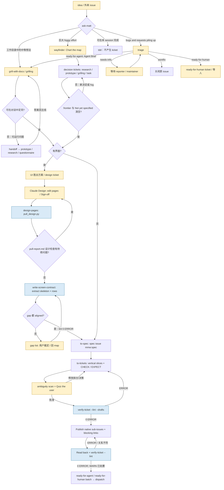

# M1-mmw-front：MMW 从想法到一批 ready 的 ticket

## 1. 在端到端中的位置

入口是用户的想法、巨大而未定型的目标、外来 issue，或需要先调查的故障；`ask-matt` 将它们分别导向 `grill-with-docs`、`wayfinder`、`triage` 等路线。出处：`mmw-v2/upstream/skills/engineering/ask-matt/SKILL.md` `## The main flow: idea → ship`、`## On-ramps`。

上游交来的是用户决定、代码库与领域词汇、既有 ADR；外来 issue 还有 reporter 的描述和评论。出处：`mmw-v2/upstream/skills/productivity/grilling/SKILL.md` `Interview the user relentlessly`；`docs/agents/domain.md` `## Before exploring, read these`；`mmw-v2/upstream/skills/engineering/triage/SKILL.md` `## Triage a specific issue or PR`。

本块出口是一张标为 `mmw:spec` 的 GitHub spec issue，以及其下由 native sub-issue 关联、带 `mmw:ticket` 与 `ready-for-agent`／`ready-for-human` label、native blocking links、经 `--lint` 读回的一批 ticket；由 `dispatch` 在 spec 上 `open`／`advance`。出处：`mmw-v2/upstream/skills/engineering/to-spec/SKILL.md` `## Process`；`mmw-v2/upstream/skills/engineering/to-tickets/SKILL.md` `### 7. Publish the tickets to the configured tracker`、`### 8. Read every ticket back`；`docs/contexts/night/CONTEXT.md` `**open**`、`**advance**`。

这段不是夜间执行本身；`CHECK:` 在这里编写和 lint，真正运行在 ticket run。出处：`mmw-v2/skills/verify-ticket/references/linting.md` `## Exit codes`；`docs/contexts/ticket-run/CONTEXT.md` `**gate-check**`。

## 2. 阶段表

| 序号 | 阶段名（原文） | 执行者 | 输入 | 产出物（文件、issue、PR、label、事件） | 门禁或退出条件 | 失败/回退/升级路径 | 出处 |
| --- | --- | --- | --- | --- | --- | --- | --- |
| 1 | Ask Matt / On-ramps | 主 agent | 想法、现有工作目录、外来 issue、巨大目标 | 路线选择 | 分清一会话可定的工作、多会话 build 与巨大 foggy effort | 小工作直接 `tdd`；难故障进 `diagnosing-bugs`；未知外部事实进 `research` | `mmw-v2/upstream/skills/engineering/ask-matt/SKILL.md` `## The main flow: idea → ship`、`## On-ramps` |
| 2A | grill-with-docs / grilling | 人＋主 agent；查事实可用通用子 agent | 中等想法、`CONTEXT-MAP.md`、相关 `CONTEXT.md` 与 ADR | 逐轮决定；必要时更新 glossary／ADR | 决策树 frontier 清空，用户确认共同理解 | 有未回答决策则下一轮；事实由 agent 查，不请用户代查 | `mmw-v2/upstream/skills/engineering/grill-with-docs/SKILL.md` 全文；`mmw-v2/upstream/skills/productivity/grilling/SKILL.md` `Interview the user relentlessly`；`docs/agents/domain.md` `## Before exploring, read these` |
| 2B | Chart the map / Work through the map | 人＋主 agent；`research` 可用通用子 agent 并行 | 巨大目标、待决定事项 | GitHub map issue：`wayfinder:map`＋`mmw:map`；子 decision tickets、blocking links、resolution comments；原型／研究资产链接 | frontier 与 `Not yet specified` 均空；有界面时 alignment ticket 也关闭；map 保持 open | 新 fog 升成 ticket；不可指定的留 `Not yet specified`；超出目的地进 `Out of scope`；每 session 最多解决一张非 research 决策票 | `mmw-v2/upstream/skills/engineering/wayfinder/SKILL.md` `## The Map`、`## Invocation`；`docs/agents/issue-tracker.md` `## Wayfinding operations` |
| 2C | Triage | 人（maintainer）＋主 agent | 外来 issue；或 `ticket.returned`／`ticket.bounced` 的 ticket | category／state label；`Agent Brief` 评论或 triage notes；必要时关闭原 issue | `needs-triage` 不能作为最终结果；四种 outcome 之一 | `needs-info` 等 reporter；冲突 state label 先请 maintainer 判；pipeline ticket 读 event trail 再决定；`ready-for-agent` 导向 spec | `mmw-v2/upstream/skills/engineering/triage/SKILL.md` `## Roles`、`## Triage a specific issue or PR`；`references/pipeline-issues.md` `## A ticket handed back`；`AGENT-BRIEF.md` `## Template` |
| 3 | handoff / prototype / research / to-questionnaire（条件分支） | 主 agent；research 用通用子 agent；UI prototype 由人选胜出方案 | 对话无法判定的可运行问题，或外部知识缺口 | `prototypes/<effort>/<issue>/<UI\|LOGIC\|EXP>/` 与 leaf `README.md`；研究 Markdown；OS 临时目录 handoff；问卷 | 原型有可观察结论；研究有一手来源；第三方答复返回后再决策 | 逻辑／实现结论回主线；UI 胜出方案继续 Claude Design；新目录／host 用 `handoff` 传递 | `mmw-v2/upstream/skills/engineering/ask-matt/SKILL.md` `## The main flow: idea → ship`、`## Standalone`；`mmw-v2/upstream/skills/engineering/prototype/SKILL.md` `## Pick a branch`、`## Rules that apply to every branch`；`mmw-v2/upstream/skills/engineering/research/SKILL.md` 全文；`mmw-v2/upstream/skills/productivity/to-questionnaire/SKILL.md` `## Document structure` |
| 4 | design-pages — edit pages / Sign-off | 人＋主 agent＋Claude Design 内 agent；Claude Design 外部服务 | UI 胜出方案或现有产品、state list、可能的 design system | Claude Design project：`CLAUDE.md`、`task.md`、`state-list.md`、`ui-ids.md`、`.dc.html` 页；用户 sign-off | 页面预览无 console error／missing file／blank render，用户说设计定稿 | 评论回 Claude Design；非用户自己的评论先征同意；缺 Claude Design MCP 的 host 停止此技能 | `mmw-v2/skills/design-pages/SKILL.md` `## Find your moment`；`references/edit-pages.md` `## Create the project`、`## Sign-off`；`references/draw.md` `## Comments`、`## When this session draws` |
| 5 | design-pages — pull | 主 agent＋`pull_design.py` 脚本 | 签署的 Claude Design project、`render_preview` URL、可选 state list／旧 contract | `prototypes/<effort>/claude-design/` design package：页与依赖、`scenes.json`、`design-manifest.json`、`README.md`、`pull-report.md`；commit | 读报告 `设计检查` 与 `改动分类`；设计问题清零后关闭 design ticket | `pull_design.py` 返回 0 不代表报告无问题；回 `edit pages` 修复再 pull；更新时按分类重跑 contract 或保持原 contract | `mmw-v2/skills/design-pages/references/pull.md` `## Steps`、`## Design problems in the report`、`## Reached from here`；`mmw-v2/skills/design-pages/scripts/pull_design.py` `run`、`write_pull_report`、`classification_lines`、`main` |
| 6 | write-screen-contract | 主 agent＋`extract_skeleton.py`／`lint_screen_contract.py` 脚本；gap 由人裁定 | design package、backend decisions、OpenAPI／现有 routing code | `docs/specs/<effort>/screen-contract.yaml`；临时 skeleton、gap list | 每页／scene 已声明，每行 `gap: aligned`，lint 零 ERROR；wayfinder 的 alignment ticket 关闭 | `design-only`／`backend-only`／无跨区 wiring 给人裁定；大量 gap 退回 map／对话；变动只改受影响 rows | `mmw-v2/skills/write-screen-contract/SKILL.md` `## Inputs`、`### 1. Declare the rendering inputs and extract the skeleton` 至 `### 7. Lint and publish`、`## Done when`；`scripts/extract_skeleton.py` `main`；`scripts/lint_screen_contract.py` `main` |
| 7 | to-spec | 主 agent；人的判断只在未对齐的界面 gap | 决策对话／已清晰 map 的 resolution comments／已分诊 issue 的 Agent Brief；设计 package 与 contract | GitHub spec issue，`mmw:spec`，从 map 来则 native sub-issue；`Problem Statement`、`Solution`、`User Stories`、`Implementation Decisions`、`Testing Decisions`、`Out of Scope`、`Sources`、`Further Notes` | 来源读全；测试 seam 与进入状态的方法已说明；界面 rows 全 aligned；map parent 读回一致 | 多 seam 且可独立落地拆成数份 spec；未对齐回 alignment；已发布 spec 改动走 `revising-a-spec.md` | `mmw-v2/upstream/skills/engineering/to-spec/SKILL.md` `## Process`、`<spec-template>`、`## Next` |
| 8 | To Tickets — draft / Quiz the user | 主 agent＋歧义扫描通用子 agent；人批准拆分 | published spec issue | tracer-bullet draft tickets；每票 `Parent`、`What to build`、`Read first`、`Seam`、`Owns`、`Acceptance criteria`；native blocking plan；worker grade | 每 AC 为可独立判断的 `CHECK:`／`EXPECT:`／`EVIDENCE: pending`；并发票 `Owns` 不重叠；用户批准颗粒度、依赖、grade、Choices | 机器不可达的反应／reach 拆成 `ready-for-human`；无测试依据回 to-spec；范围决定回 spec 修订；歧义扫描问题进 Choices | `mmw-v2/upstream/skills/engineering/to-tickets/SKILL.md` `### 3. Draft vertical slices` 至 `### 6. Quiz the user`、`<issue-template>`；`references/ambiguity-scan.md` `## Scan`、`## Questions` |
| 9 | Cutting interface tickets（条件分支） | 主 agent | screen contract 的 `pages`／`rows`、spec `Critical flows` | design-system、contract、component page、app page、acceptance、reaction 等票；story／boundary／journey／harness 的 `CHECK:` | `Read first` 标明 look 和 behaviour 两个 baseline；App 票被相关 Component 票阻塞；critical flow 有 journey `--break` | 新产品无 precedent 先切 contract ticket；缺 test reach 先建设可达机制；用户体感是 reaction ticket | `mmw-v2/upstream/skills/engineering/to-tickets/references/cutting-interface-tickets.md` `# Cutting interface tickets`、`## Criterion shapes`、各 ticket 小节；`mmw-v2/skills/ui-acceptance/SKILL.md` `## Find your moment` |
| 10 | Publish / Read every ticket back | 主 agent＋`verify-ticket.py --lint` 脚本＋GitHub | 已批准 drafts、spec issue | GitHub spec native sub-issues；`mmw:ticket`、`ready-for-agent`＋`junior-worker`／`senior-worker`，或 `ready-for-human`；native blocking links | 先 draft lint 零 ERROR；发布后 parent、数量、label、阻塞关系读回，再 batch lint 零 ERROR，WARN 有处置 | 修 draft 再发；live 票有误则修 issue／关系再 lint；lint exit 2 表示 judge 不可达，不能视为通过 | `mmw-v2/upstream/skills/engineering/to-tickets/SKILL.md` `### 7. Publish the tickets to the configured tracker`、`### 8. Read every ticket back`；`mmw-v2/skills/verify-ticket/references/linting.md` `## --drafts before publishing`、`## Exit codes` |
| 11 | dispatch handoff | 主 agent → 夜间 main agent／`dispatch` | spec issue number 与已发布票图 | 待 `check`、`open`、`advance` 的 batch；非本块产出夜间 event | ticket 全部可从 spec native 子票读出；`ready-for-agent` 才能进入夜间 frontier | 阻塞票等 blockers；`ready-for-human` 等人，不派 worker | `mmw-v2/upstream/skills/engineering/to-tickets/SKILL.md` `### 8. Read every ticket back`；`docs/contexts/night/CONTEXT.md` `**frontier**`、`**open**`、`**advance**` |

## 3. 流程图

图中 map 的界面工作实际是 design ticket 后接 alignment ticket；`M` 到 `R` 的界面支路对无 map 的 session 也适用。出处：`mmw-v2/upstream/skills/engineering/wayfinder/references/interface-and-remake.md` `## A destination with an interface`；`mmw-v2/upstream/skills/engineering/ask-matt/SKILL.md` `## The main flow: idea → ship`。

## 4. 角色、并发与隔离

- 人负责产品决定、访谈回答、UI 方案取舍与 Claude Design sign-off、contract gap、拆票 Quiz；主 agent 负责查事实、写 map/spec/tickets。`grilling` 明定事实归 agent、决定归用户；`to-spec` 不重新访谈，只综合已知事实。出处：`mmw-v2/upstream/skills/productivity/grilling/SKILL.md` `Interview the user relentlessly`；`mmw-v2/upstream/skills/engineering/to-spec/SKILL.md` 开头与 `## Process`。
- `wayfinder` 的 research ticket 可用 host 自带通用子 agent，并行写在 `research/<name>` 临时分支；其他 decision ticket 每 session 最多解决一张，多个 session 可各取一张未分配且未阻塞的票，先以 assignee claim。`to-tickets` 的 ambiguity scan 也可用同模型／同 thinking level 通用子 agent；不能用时由主 agent 执行。出处：`mmw-v2/upstream/skills/engineering/wayfinder/SKILL.md` `## Ticket Types`、`## Invocation`；`mmw-v2/upstream/skills/engineering/to-tickets/SKILL.md` `### 6. Quiz the user`。
- Claude Design 内 agent 只看项目文件及通过 GitHub connection 提供的仓库 branch/path，不看本对话；主 agent 以 `task.md` 交接工作，用户在项目内说 `开始`。有 design system 时另为独立 Claude Design project。出处：`mmw-v2/skills/design-pages/references/edit-pages.md` `## Talking to the agent inside Claude Design`；`references/design-system.md` `## Who builds it`。
- 前半段 agent 的模型／host 未在这些技能中固定；`models.json` 的四行 `junior-worker`、`senior-worker`、`reviewer`、`advisor` 是**后段 dispatched sessions** 的设置，不能误画成访谈／spec agent 的配置。前半段原型隔离在 `prototypes/<effort>/<issue>/<UI|LOGIC|EXP>/`；生产 ticket 的并发隔离由 `Owns` 不相交及 blocking links 预先保证，实际 worktree 在后段创建。出处：`docs/contexts/toolbox/CONTEXT.md` `**models.json**`、`**subagent**`；`mmw-v2/upstream/skills/engineering/prototype/SKILL.md` `## Rules that apply to every branch`；`mmw-v2/upstream/skills/engineering/to-tickets/SKILL.md` `### 5. Give each ticket its blocking edges`；`docs/contexts/night/CONTEXT.md` `**worktree**`。

## 5. 状态与恢复

- GitHub Issues 是本仓库的 tracker：map、spec、ticket、child 用 native parent–child；native dependency 表示 blocking；layer／queue／grade 是三套互不替代的 label。map 的 `Decisions so far` 仅索引，实质答案在 decision ticket resolution comment；`Not yet specified` 保存尚不能开票的 fog。出处：`docs/agents/issue-tracker.md` `# Issue tracker: GitHub`、`## Three label sets`、`## Wayfinding operations`；`mmw-v2/upstream/skills/engineering/wayfinder/SKILL.md` `## The Map`。
- 访谈结论可进入相关 `CONTEXT.md`、ADR；prototype 结论进 leaf `README.md`；跨目录／host 的 `handoff` 写 OS 临时目录并链接已有 artifact，不重复它们。会话接续时读取这些持久来源；`ask-matt` 希望访谈至拆票尽量保留一条 context，临近 smart zone 时在 phase boundary 压缩。出处：`mmw-v2/upstream/skills/engineering/domain-modeling/SKILL.md` `## During the session`；`mmw-v2/upstream/skills/engineering/prototype/SKILL.md` `## Rules that apply to every branch`；`mmw-v2/upstream/skills/productivity/handoff/SKILL.md` 全文；`mmw-v2/upstream/skills/engineering/ask-matt/SKILL.md` `### Context hygiene`、`## Phase boundaries`。
- UI 的 repo 内状态是已提交的 `prototypes/<effort>/claude-design/` package、`pull-report.md` 与 `docs/specs/<effort>/screen-contract.yaml`；设计源仍是 Claude Design，pull 会覆盖本地 package。contract row id 不重用，重拉后按 `改动分类` 路由修订。出处：`mmw-v2/skills/design-pages/references/edit-pages.md` `## Sign-off`；`references/pull.md` `## Reached from here`；`mmw-v2/skills/write-screen-contract/SKILL.md` `## Re-runs`。
- triage 中断后读 issue body、comment、label 与既有 `Triage Notes`，不重复已答问题；pipeline 回退票还需读 `ticket.checked` 与 `reviewer.reported`／`ticket.bounced` 等 event trail。前段的草稿只在临时目录；完成 publish 后以 tracker 的读回结果为准。出处：`mmw-v2/upstream/skills/engineering/triage/SKILL.md` `## Resuming a previous session`；`references/pipeline-issues.md` `## A ticket handed back`；`mmw-v2/upstream/skills/engineering/to-tickets/SKILL.md` `### 7. Publish the tickets to the configured tracker`、`### 8. Read every ticket back`。

## 6. 验证与质量门

- `to-spec` 要求决定可追溯、`Implementation Decisions` 可供 ticket 逐节引用、`Testing Decisions` 说明 seam、测试目录与 precedent、如何使状态可达；界面 spec 读取完整 contract，任何非 `aligned` row 阻止写 spec。出处：`mmw-v2/upstream/skills/engineering/to-spec/SKILL.md` `## Process`、`<spec-template>`。
- `pull_design.py` 渲染页面并写 `pull-report.md` 的 `设计检查`、`覆盖`、`改动分类`；其 `main` 仅在 `PullRefused`／异常时非零，报告中的设计问题并不令进程失败。所以必读报告，修复设计问题再关闭 design ticket。出处：`mmw-v2/skills/design-pages/scripts/pull_design.py` `design_check_lines`、`coverage_lines`、`classification_lines`、`write_pull_report`、`main`；`mmw-v2/skills/design-pages/references/pull.md` `## Steps`、`## Design problems in the report`。
- `extract_skeleton.py` 离线渲染每个 scene／viewport，取可见 `data-ui` 清单；`lint_screen_contract.py` 对 rows、page／scene 声明、OpenAPI 等报 `ERROR`／`WARN`，有 ERROR 返回 1、无 ERROR 返回 0。技能还要求用户裁定 gap 全 aligned；lint 零 ERROR 本身不足以完成。出处：`mmw-v2/skills/write-screen-contract/scripts/extract_skeleton.py` `main`；`scripts/lint_screen_contract.py` `main`；`mmw-v2/skills/write-screen-contract/SKILL.md` `## Done when`。
- `CHECK:` 从 spec `Testing Decisions` 的 layer／目录／precedent 派生，打开 precedent 复制单文件调用；`EXPECT:` 是先运行 precedent 得到的仅成功时出现的完整行。没有命令可判的事项进入 code-review、reaction／reach 票或用户 choice，不可伪造 AC。出处：`mmw-v2/upstream/skills/engineering/to-tickets/SKILL.md` `### 4. Write each acceptance criterion`。
- `verify-ticket.py --lint --drafts` 在发布前检查文本和 draft 图；发布后对 spec 运行 `--lint`，检查 native sub-issues、label／worker grade、blocking 图、AC 形状以及 interface row→judge 覆盖。`--lint` 不执行 `CHECK:`；exit 0 表示无 ERROR，exit 1 有 ERROR，exit 2 judge 不可达；WARN 必须看过并有意保留或修复。出处：`mmw-v2/skills/verify-ticket/references/linting.md` `## --drafts before publishing`、`## --lint on a batch`、`## Exit codes`。

## 7. 人的介入点

- `grilling` 每轮 frontier 的产品决定由用户回答，最后确认共同理解；wayfinder 的 destination、prototype 反应、设计取舍同样由人定。事实查找、test seam、engineering grade 初判归 agent。出处：`mmw-v2/upstream/skills/productivity/grilling/SKILL.md` `Interview the user relentlessly`；`mmw-v2/upstream/skills/engineering/wayfinder/SKILL.md` `## Invocation`；`mmw-v2/upstream/skills/engineering/to-spec/SKILL.md` `## Process`。
- Claude Design project 的 plan 需要用户批准；用户在该项目说 `开始` 并给 sign-off；`write-screen-contract` 的 gap list 是用户判断，不由 lint 代替。出处：`mmw-v2/skills/design-pages/references/edit-pages.md` `## Create the project`、`## Sign-off`；`mmw-v2/skills/write-screen-contract/SKILL.md` `### 6. Write the gap list and stop for the user`。
- `to-tickets` 的 Quiz 由用户批准 ticket 粒度、blocking、worker grade 和 Choices；`ready-for-human` 是单独的 reaction／reach 票，不把人的判定塞进 agent 票的 `Acceptance criteria`。出处：`mmw-v2/upstream/skills/engineering/to-tickets/SKILL.md` `### 4. Write each acceptance criterion`、`### 6. Quiz the user`；`references/person-ticket.md` `# Work only a person can do`。
- 外来 issue 的 triage recommendation 等 maintainer 指示；state 冲突先问 maintainer，`needs-info` 等 reporter；正常 `ready-for-agent` 票由 `to-tickets` 直接标好，不再分诊，只有 pipeline 退回 `needs-triage` 才重评。出处：`mmw-v2/upstream/skills/engineering/triage/SKILL.md` `## Roles`、`## Triage a specific issue or PR`；`mmw-v2/upstream/skills/engineering/ask-matt/SKILL.md` `## On-ramps`。

## 8. 显著机制

1. `ask-matt` 把巨大未知工程的 decision map 与一会话内可收敛的访谈分开，避免直接从 map 开工而丢失决策细节。出处：`mmw-v2/upstream/skills/engineering/ask-matt/SKILL.md` `## On-ramps`。
2. map 是索引、decision ticket resolution comment 才存答案，frontier 由 open／unblocked／unclaimed 子票形成，使多 session 能分头处理已明确的问题。出处：`mmw-v2/upstream/skills/engineering/wayfinder/SKILL.md` `## The Map`。
3. 界面使用双 baseline：design package 决定 look 和 verbatim copy，screen contract 决定 calls、shows、next、on_failure，减少视觉稿与后端决定之间的空白。出处：`mmw-v2/skills/write-screen-contract/SKILL.md` `# write-screen-contract — the screen contract between a design package and the backend`；`references/screen-contract-format.md` `## Top level`。
4. `pull-report.md` 将设计问题和改动分类分开，允许拉取脚本完成后仍要求人读报告、按类型返工或修订 contract。出处：`mmw-v2/skills/design-pages/scripts/pull_design.py` `write_pull_report`、`classification_lines`；`mmw-v2/skills/design-pages/references/pull.md` `## Steps`。
5. `to-tickets` 的 five questions 把机器比较、code-review 判断、人的 reaction、机器无法 reach 的事和产品 choice 分流，确保 AC 是可由命令裁决的事项。出处：`mmw-v2/upstream/skills/engineering/to-tickets/SKILL.md` `### 4. Write each acceptance criterion`。
6. ticket 的 `Owns` 加 native blocking links 在发布前处理同文件并发冲突；prefactor ticket 能先登记共同入口，再使后续票并行。出处：`mmw-v2/upstream/skills/engineering/to-tickets/SKILL.md` `### 5. Give each ticket its blocking edges`。
7. draft lint 与发布后 read-back lint 是两道不同门：前者查内容与规划图，后者才看 GitHub 上真实的 parent、label、blocking；交夜间流水线的是已读回的 tracker 图。出处：`mmw-v2/skills/verify-ticket/references/linting.md` `## --drafts before publishing`、`## --lint on a batch`；`mmw-v2/upstream/skills/engineering/to-tickets/SKILL.md` `### 8. Read every ticket back`。

## 9. 未读到或不确定

- 未连接 GitHub／Claude Design，不能证明当前某个真实 effort 的 map、spec、ticket 或 design package 已按上述流程存在；这里只报告仓库流程定义与所读脚本行为。出处范围：`docs/agents/issue-tracker.md` `# Issue tracker: GitHub`；`mmw-v2/skills/design-pages/references/pull.md` `## Steps`。
- 未运行任何脚本或测试；`CHECK:`、`EXPECT:` 的实际输出格式和当前 tracker 的可用性未实测。出处范围：`mmw-v2/upstream/skills/engineering/to-tickets/SKILL.md` `### 4. Write each acceptance criterion`；`mmw-v2/skills/verify-ticket/references/linting.md` `## Exit codes`。
- 未读取本机 `~/.mmw/models.json`；前半段主 agent 的具体 host／model，以及后段 worker 的当前机型值不可据此报告。配置结构可查 `docs/contexts/toolbox/CONTEXT.md` `**models.json**`。
- `ask-matt` 的主流程写 `grill-with-docs`→`to-spec`→`to-tickets`，但 `triage` 的 quick state override 容许 maintainer 指定 `ready-for-agent` 后只问是否现在进 ticket pipeline；这里未把它画成自动强制发布。出处：`mmw-v2/upstream/skills/engineering/triage/SKILL.md` `## Quick state override`。
