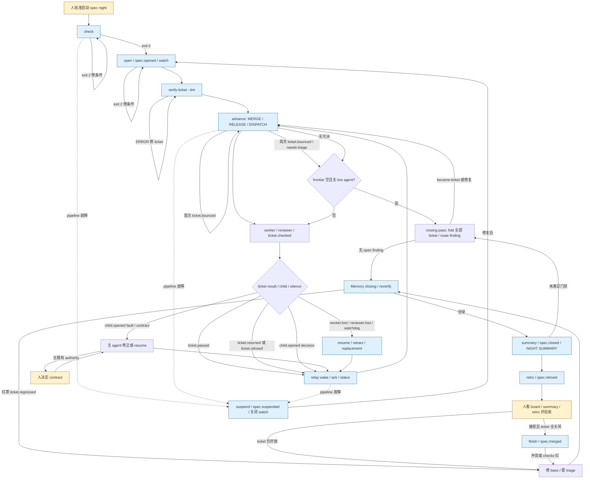

# M2-mmw-night：MMW 的过夜执行机器

## 1. 在端到端中的位置

- 入口是人批准启动一个已有 `mmw:spec` 及其已发布 ticket 的 night；主 agent 从 night's base branch 运行 `check`、`open`。出处：`mmw-v2/skills/dispatch/references/night.md` 的 `## 1. The user says the night starts`；`docs/agents/issue-tracker.md` 的 `## Three label sets`。
- 上游交付的是 spec 的 GitHub sub-issues、ticket 的 `CHECK:`、queue/grade label、依赖和 base/project branch；`--lint` 在第一轮 `advance` 前检查批次。出处：`mmw-v2/skills/dispatch/references/night.md` 的 `## 1b. Before the batch: what the batch cannot be run on`；`mmw-v2/skills/dispatch/scripts/status.py` 的 `advance_plan`；`docs/contexts/night/how-it-works.md` 的 `## Opening a night`。
- `advance` 把独立 ticket 派给 worker，把通过的提交按关闭顺序合并到 `origin/<base branch>`；closing pass 处理遗留 finding；`reverify`、`summary`、`retro` 形成早晨交付。出处：`docs/contexts/night/how-it-works.md` 的 `## How \`advance\` processes a batch`、`## Reverify and summary`；`mmw-v2/skills/dispatch/references/night.md` 的 `## 4. The closing pass`、`## 5. The night is over`。
- 人接收 `NIGHT SUMMARY`、`NIGHT RETRO` 和 task board，接受后主 agent 才能 `finish` 并入 project branch；不在这里并入 default branch。出处：`mmw-v2/skills/dispatch/references/night.md` 的 `## 5. The night is over`、`## 6. Merge the accepted night`；`docs/contexts/task-board/CONTEXT.md` 的 `## Language`。

## 2. 阶段表

| 序号 | 阶段名（原文） | 执行者 | 输入 | 产出物（文件、issue、PR、label、事件） | 门禁或退出条件 | 失败/回退/升级路径 | 出处 |
| --- | --- | --- | --- | --- | --- | --- | --- |
| 1 | `check` | 主 agent 调 `dispatch.sh` | spec、当前 base branch、`models.json` | project branch 推断、将 push 的提交数、安装/runner/grade 检查报告；不 push | 0 可 `open`；2 条件不满足 | 修 stderr 条件重跑；无效 agent row 报人。**实现提醒：**从 installed checkout 运行且 `install.sh --check` 不通过时，`check` 会调用 `install.sh` 修复，故不是纯只读命令。 | `mmw-v2/skills/dispatch/references/night.md` 的 `## 1. The user says the night starts`；`mmw-v2/skills/dispatch/scripts/dispatch.sh` 的 `check_machine`；`docs/contexts/night/how-it-works.md` 的 `## Opening a night` |
| 2 | `open` | 主 agent 调 `dispatch.sh`；relay | spec、base/project branch、调用者 session | 推进 `origin/<project>`、同步 `origin/<base>`；spec watch；`spec.opened`；task board URL | 0 watch 建立；2 拒绝 | 冲突或 relay/event 写入失败依 stderr 处理后重跑；board 启动失败不阻挡 night | `mmw-v2/skills/dispatch/scripts/dispatch.sh` 的 `open_night`；`docs/contexts/night/how-it-works.md` 的 `## Opening a night` |
| 3 | `--lint` | 主 agent 调 verify-ticket | spec 的全部 ticket | 每条 lint finding | 0 无 ERROR；1 ERROR；2 judge 不可达 | 修 ticket 的 ERROR 并重跑；tracker 不可读不等于 ticket 错误 | `mmw-v2/skills/dispatch/references/night.md` 的 `## 1b. Before the batch: what the batch cannot be run on` |
| 4 | `advance` / `start` | 主 agent 调 `dispatch.sh`；runner 启 worker | tracker frontier、`models.json` 的 worker grade、`origin/<base>` | `issue-<n>` branch/worktree、`worker.started`；已通过 ticket 的 `ticket.landed` 或 `ticket.bounced`；claim 的 `ticket.released` | 0 成功；4 有 start refusal；2 未完成的机器/读取/landing 条件 | 4/2 按 stderr 修复并重跑；merge conflict 或红 repository checks 为 bounce：第一次留队再派，第二次 `needs-triage` | `mmw-v2/skills/dispatch/scripts/dispatch.sh` 的 `advance`；`mmw-v2/skills/dispatch/references/night.md` 的 `## 2. First \`advance\``；`docs/contexts/night/how-it-works.md` 的 `## How \`advance\` processes a batch` |
| 5 | `worker` → `reviewer` → closeout | worker 自启 reviewer；reviewer 同 ticket workspace 工作；verify-ticket 关票 | ticket、base commit、`CHECK:`、diff | `reviewer.started`、`reviewer.reported`、`ticket.checked`、`ticket.passed` 或 `ticket.returned`；可能 `child.opened` | worker 的结果是 ticket event，不靠主 agent 轮询 session | reviewer/worker 丢失由 watchdog 写 lost event；fault/contract/decision 交主 agent 处理 | `docs/contexts/ticket-run/CONTEXT.md` 的 `### Roles`、`### Comments on the ticket`；`docs/contexts/night/how-it-works.md` 的 `## Results, watches and wakes` |
| 6 | `Each time something wakes you` / `status` / `advance` | relay 唤醒主 agent；主 agent ack、判定、推进 | `#<n> <event>`、`relay.recovered`、watchdog/turn-guard 消息 | wake ack；`status` 表；`resume`、`retract`、新的 landing/start | `status` 0 为完整表；2 为 tracker 未返回完整批次；`advance` 结束后若 frontier 空且无 live agent 转 closing pass | `fault` 修后 resume；`contract` 按 authority 更正或留人决定；decision worker 已取 default；runner 不可观察时 `resume` 4 表示已发送但未确认 turn | `mmw-v2/skills/dispatch/references/night.md` 的 `## 3. Each time something wakes you`、`### Exit codes of \`resume\``；`mmw-v2/skills/dispatch/SKILL.md` 的 `## On waking` |
| 7 | `The closing pass` / `route` | 主 agent | `status` 的每个 batch ticket；逐个 `events.py fold` 的 open finding | 修复提交或新 ticket；`child.closed`；Memory closing JSON | 所有 finding 都有 route；`route` 0 完成、1 重跑同命令、2 未执行 | finding 可标 `stale invalid/fixed-elsewhere`、`fixed`、`became-ticket`；新 ticket lint 后再 `advance`，循环至没有 open finding | `mmw-v2/skills/dispatch/references/night.md` 的 `## 4. The closing pass`；`mmw-v2/skills/dispatch/scripts/dispatch.sh` 的 `route_child` |
| 8 | `reverify` | 主 agent 调 `dispatch.sh`/verify-ticket | fetched `origin/<base>` 上已 landed ticket | `ticket.checked`；红票 `ticket.regressed` + `needs-triage`；绿票恢复 `ticket.recovered`；common Git dir 的 `mmw-reverify-<spec>` | 0 全绿；1 有已证实红票；2 无法判定/准备失败 | 红票先在 base 修复并 push 再重跑；未建立结果的 ticket 不当作红票 | `mmw-v2/skills/dispatch/scripts/dispatch.sh` 的 `reverify_spec`；`mmw-v2/skills/dispatch/references/night.md` 的 `## 5. The night is over` |
| 9 | `summary` | 主 agent 调 `dispatch.sh`；Nowledge Mem | 无 frontier/live hold/open finding；与最新 origin 同 commit 的全绿 reverify receipt；Memory decisions JSON | `spec.closed`；`NIGHT SUMMARY`；关闭 spec watch | 0 已发已关；1 已发已关但 relay 留存；2 未发 | 1 处理 stderr 指定 relay pid；2 修条件重跑；未 route finding 回 closing pass | `mmw-v2/skills/dispatch/scripts/dispatch.sh` 的 `summary_spec`；`mmw-v2/skills/dispatch/references/night.md` 的 `## 5. The night is over` |
| 10 | `retro` | 同一主 agent 调 retro skill | `spec.closed`、tracker events/commits/check evidence | Retro Memory；`spec.retroed result=recorded`；`NIGHT RETRO` | `finalize` 记录 receipt 后才可 `finish` | 缺少证据则记录 missing/unreadable；`finalize` 拒绝则按原因改分析重跑 | `mmw-v2/skills/retro/SKILL.md` 的 `## Gather`、`## Analyze`、`## Finalize`；`mmw-v2/skills/dispatch/scripts/dispatch.sh` 的 `finish_preflight` |
| 11 | 人验收 → `finish` | 人决定接受；主 agent 调 `dispatch.sh` | 已关闭 night、`spec.retroed result=recorded`、base/project origin branches | project branch merge/push、`spec.merged`、安全时删除 base branch | 0 合并记录；1 冲突或 checks 红且未 push；2 前置条件/其他错误 | 修后重跑；**实现还有硬门禁：**同 base branch 的相关 spec ticket 必须全关闭，不能仅凭 summary 接受状态运行 | `mmw-v2/skills/dispatch/references/night.md` 的 `## 6. Merge the accepted night`；`mmw-v2/skills/dispatch/scripts/dispatch.sh` 的 `finish_preflight`、`finish_spec` |
| 12 | `suspend`（旁支） | 主 agent 调 `dispatch.sh` | pipeline 故障、仍 held 的 ticket | 停 session、commit/push 其 branch、归还 claim/slot、`spec.suspended`、关闭 watch | 0 停止；1 stderr 列残留；2 未触碰 | 不能 stop/push 的 ticket 保留 workspace/hold/slot，不 force-push；修故障后 `open`、`advance` 恢复 | `mmw-v2/skills/dispatch/references/night.md` 的 `## Suspending the night`；`mmw-v2/skills/dispatch/scripts/dispatch.sh` 的 `suspend_night` |

## 3. 流程图

图中 `advance` 的 MERGE/RELEASE/DISPATCH 顺序、bounce 重派、空 frontier 后 closing pass 分别来自 `mmw-v2/skills/dispatch/scripts/status.py` 的 `advance_plan` 与 `mmw-v2/skills/dispatch/scripts/dispatch.sh` 的 `advance`；wake/hold 来自 `mmw-v2/skills/dispatch/scripts/relay.py` 的 `woken_by`、`mmw-v2/skills/verify-ticket/scripts/events.py` 的 `ENDS_EVERY_HOLD`；末段来自 `mmw-v2/skills/dispatch/references/night.md` 的 `## 4. The closing pass` 至 `## Suspending the night`。图中从 `finish` 失败回 `O` 是概括：冲突或红 checks 要先处理代码，开放 ticket 要先满足 `finish_preflight`，不表示一定经过 `reverify`；出处：`mmw-v2/skills/dispatch/scripts/dispatch.sh` 的 `finish_preflight`、`finish_spec`。

## 4. 角色、并发与隔离

- 主 agent 是人已启动的 session，无 `models.json` row；worker 的 `junior-worker`/`senior-worker`、`reviewer`、`advisor` 各有 `host`、`model`、`effort` row。默认值写在 `mmw-v2/skills/dispatch/hosts.json` 的 `defaults`，但机器实际选择由 `MMW_HOME/models.json` 决定；runner 是 `paseo`、`orca` 或 `herdr` 的 adapter，区别于 host。出处：`docs/contexts/night/CONTEXT.md` 的 `### Roles`；`mmw-v2/skills/dispatch/references/editing-models.md` 的 `## Change one role`、`## Change the runner`；`mmw-v2/skills/dispatch/scripts/models.py` 的 `session_rows`、`pick_runner`。
- worker 处理一个 ticket 并自启 reviewer；reviewer 与 worker 共用 ticket worktree，code-review axis 在 reviewer session 内，不是独立 session；advisor 经 `advise` 独立启动，只给第二意见。出处：`docs/contexts/ticket-run/CONTEXT.md` 的 `### Roles`；`docs/contexts/night/how-it-works.md` 的 `## Starting a session`；`docs/contexts/night/CONTEXT.md` 的 `### Dispatch`。
- `advance` 启动 frontier 的**所有** ticket，不在派发时限制 worker 数；真正运行产品时由 `lease.py` 的 slot 限制，取不到 slot 的 criteria run 写 `worker.queued`。具体 slot 上限未在本次起点材料核定。出处：`mmw-v2/skills/dispatch/scripts/dispatch.sh` 的 `advance`；`docs/contexts/night/how-it-works.md` 的 `## Starting a session`。
- ticket workspace 是主 checkout 下 `.worktrees/issue-<n>` 加其 sessions；ticket branch 为 `issue-<n>`。合并使用持久 detached `.worktrees/merge-<branch-slug>`，每个 merge target 的 `merge-<slug>.lock` 序列化；成功 push 后才归档 ticket workspace，未落地和 bounce 的保留。出处：`docs/contexts/night/CONTEXT.md` 的 `### Places`；`mmw-v2/skills/dispatch/scripts/dispatch.sh` 的 `acquire_merge_lock`、`prepare_merge_worktree`、`advance`；`docs/contexts/night/how-it-works.md` 的 `## How \`advance\` processes a batch`。
- 角色间以 ticket event 和 relay wake 传话：worker 收 reviewer result/slot freed，主 agent 收 pass/return/refusal、三类 child 和 worker lost；`resume` 是主 agent 向活 worker 发文本，runner 不可观察时 exit 4 只证明已发送。出处：`docs/contexts/night/how-it-works.md` 的 `## Results, watches and wakes`；`mmw-v2/skills/dispatch/references/night.md` 的 `### Exit codes of \`resume\``。

## 5. 状态与恢复

- GitHub issue 的 comment 首行给人看，尾部 `<!-- mmw {...} -->` 是机器 event；`events.py fold` 按 comment id 重建 ticket 状态。GitHub label/assignee 决定 queue/claim，但 label 不能结束 event hold。`ticket.passed` 也不结束 hold；`ticket.landed`、`ticket.returned`、`ticket.bounced`、`ticket.released`、`spec.suspended` 才结束全部 hold。出处：`docs/contexts/night/how-it-works.md` 的 `## Events and holds`；`mmw-v2/skills/verify-ticket/scripts/events.py` 的 `ENDS_EVERY_HOLD`、`apply`。
- `$MMW_HOME/state/<owner>__<name>/` 保存 relay/watchdog/turn-guard 本机状态而非 ticket 真值；`watches.json` 记 main-agent recipient，`queue.jsonl` 记待送 wake，ack 才删；relay 重启重新读 watched ticket 并排队恢复的 event。出处：`docs/contexts/night/CONTEXT.md` 的 `### Liveness`；`mmw-v2/skills/dispatch/scripts/relay.py` 的 `Relay`、`cmd_ack`；`docs/contexts/night/how-it-works.md` 的 `## Results, watches and wakes`。
- watchdog 每分钟检查 relay 和 silent held ticket；已停止 session 写 `worker.lost`/`reviewer.lost`，其他异常用不需 ack 的 `watchdog:` 送主 agent；turn guard 在有 held ticket 而 watchdog 不健康时尝试 arm 并挡住 main-agent turn end（Cursor 用 follow-up）。出处：`docs/contexts/night/how-it-works.md` 的 `## The watchdog and turn guard`；`mmw-v2/skills/dispatch/scripts/watchdog.py` 的 `judge`、`Watchdog`、`arm`；`mmw-v2/skills/dispatch/scripts/turn-guard.py` 的 `verdict`、`answer`、`guard`。
- worker 丢失后，`retract` 把已跟踪编辑 commit/push、归档 workspace、归还资源并写 `worker.retracted`；下一次 `start` 在 standing workspace 上恢复。`suspend` 保存已停止 ticket branch，修复后 `open`、`advance` 重开。push 冲突不 force-push，状态保留待处理。出处：`docs/contexts/night/how-it-works.md` 的 `## Interpreting a night`、`## Starting a session`；`mmw-v2/skills/dispatch/scripts/dispatch.sh` 的 `suspend_night`；`mmw-v2/skills/dispatch/references/night.md` 的 `## Suspending the night`。
- `reverify` receipt 在 common Git dir 的 `mmw-reverify-<spec>`，记录 green/red/commit；`summary` 拒绝缺失、红或落后于最新 origin 的 receipt。出处：`mmw-v2/skills/dispatch/scripts/dispatch.sh` 的 `reverify_spec`、`summary_spec`。

## 6. 验证与质量门

- 批次前 `--lint` 检查每张 ticket 的 criteria；UI 合同另用 `target_config.py --check` 检查 `.mmw/target.json`。出处：`mmw-v2/skills/dispatch/references/night.md` 的 `## 1b. Before the batch: what the batch cannot be run on`。
- worker 的 criteria 结果记录为 `ticket.checked`，reviewer 的审查结果记录为 `reviewer.reported`；closeout 才产生 `ticket.passed` 或 `ticket.returned`。出处：`docs/contexts/ticket-run/CONTEXT.md` 的 `### Comments on the ticket`、`### Running the criteria`、`### Code review`、`### Working discipline`。
- landing 仅合并 `ticket.passed.commit`；需要时运行 `.mmw/target.json` 的 `checks`，冲突或红检查写 `ticket.bounced`。`checks` key 缺失仅 stderr 说明，不构成 bounce。出处：`docs/contexts/night/how-it-works.md` 的 `## How \`advance\` processes a batch`；`mmw-v2/skills/dispatch/scripts/dispatch.sh` 的 `run_merge_checks`、`land_one_via_origin`；`AGENTS.md` 的 `<important if="you are opening a night or working one ticket inside this repository">`。
- `reverify` 在 fetched base branch 对每张已 landed ticket 重跑 criteria；只有 exit 1 且同 commit 的红 `ticket.checked` 才算 regression，不能执行、排队或不能写结果不算红。出处：`mmw-v2/skills/dispatch/scripts/dispatch.sh` 的 `reverify_spec`。
- `summary` 还要求没有可派 frontier、live hold、不可读 event、未 landing 的 passed ticket、未 route finding，并核对全绿且仍是最新 origin 的 receipt；`finish` 再要求 Retro receipt、无别的同 base open night、同 base 的 ticket 全关闭，并在 project merge 后查 repository checks。出处：`mmw-v2/skills/dispatch/scripts/status.py` 的 `closeout_problems`；`mmw-v2/skills/dispatch/scripts/dispatch.sh` 的 `summary_spec`、`finish_preflight`、`finish_spec`。

## 7. 人的介入点

- 人决定 night 启动，以及在 `NIGHT SUMMARY`、`NIGHT RETRO` 后是否接受并让主 agent `finish`；`finish` 不做 default branch release。出处：`mmw-v2/skills/dispatch/references/night.md` 的 `## 1. The user says the night starts`、`## 5. The night is over`、`## 6. Merge the accepted night`。
- `contract` 与既有 authority 冲突、会推翻用户决定或扩 spec，主 agent 把未启动的相关 ticket 转 `needs-triage` 并留问题给人；Claude Design package 也必须交有 MCP 工具的 session。`decision` child 已由 worker 采用 default，夜里不等人。出处：`mmw-v2/skills/dispatch/references/night.md` 的 `## 3. Each time something wakes you`。
- 早晨先看 board 的 The Night / ticket 状态，再看 spec 上 `NIGHT SUMMARY` 和 `NIGHT RETRO`；两条 morning query 按序是 open `needs-triage`（先 triage）和 open `ready-for-human`。出处：`docs/contexts/task-board/CONTEXT.md` 的 `### What the page shows`；`mmw-v2/skills/dispatch/references/night.md` 的 `## 5. The night is over`；`docs/agents/issue-tracker.md` 的 `## Morning queries`。
- **图中必须分开画：**`summary` 允许 triage/human/blocked 票作为 night 结果；但 `finish_preflight` 对同 base branch 尚未关闭的 ticket 返回 2。人接受报告本身不能越过这个门禁；如何解决开放票由后续 triage/验收决定。出处：`mmw-v2/skills/dispatch/scripts/status.py` 的 `closeout_problems`；`mmw-v2/skills/dispatch/scripts/dispatch.sh` 的 `finish_preflight`；`mmw-v2/skills/dispatch/references/night.md` 的 `## 6. Merge the accepted night`。
- `check`/`open`/`advance`、worker 与 reviewer 的常规工作、watchdog 恢复、closing pass 内有 authority 的修复都由 agent/脚本推进，不逐票等人；pipeline 自身出故障时主 agent 可 `suspend`。出处：`mmw-v2/skills/dispatch/references/night.md` 的 `# Running a night`、`## 3. Each time something wakes you`、`## 4. The closing pass`、`## Suspending the night`。

## 8. 显著机制

1. `status.py` 的 frontier 要求 open、`ready-for-agent`、event 可读、blocker 已解除、无人 claim 且无 hold，解决重复派发和未合并依赖抢跑。出处：`mmw-v2/skills/dispatch/scripts/status.py` 的 `frontier`、`blocker_reason`。
2. `advance` 先按 ticket 关闭顺序 landing，再 release、重新读取 frontier 后派发，使同轮刚落地的 blocker 能释放后继 ticket。出处：`mmw-v2/skills/dispatch/scripts/status.py` 的 `advance_plan`；`mmw-v2/skills/dispatch/scripts/dispatch.sh` 的 `advance`。
3. 事件 comment 是可重建的 ticket 真值，而本机 relay/watchdog 文件只保存通知与健康状态，支持 session 中断后从 tracker 恢复。出处：`docs/contexts/night/how-it-works.md` 的 `## Events and holds`；`docs/contexts/night/CONTEXT.md` 的 `### Liveness`。
4. relay 对一个 repository 复用进程但 watch 不共享 ticket，wake 只携 ticket/event 地址且需 ack，避免把暂时发送成功误当任务已处理。出处：`docs/contexts/night/how-it-works.md` 的 `## Results, watches and wakes`；`mmw-v2/skills/dispatch/scripts/relay.py` 的 `Relay`、`cmd_ack`。
5. watchdog 补上 session 死亡不会自动写 event 的缺口，turn guard 补上 watchdog 不健康时主 agent 已结束 turn 的缺口。出处：`docs/contexts/night/how-it-works.md` 的 `## The watchdog and turn guard`；`mmw-v2/skills/dispatch/scripts/turn-guard.py` 的 `guard`。
6. merge worktree 按 target branch 持久保留并用单 branch lock 串行合并，防止同一 base 的并发 push/merge 相撞。出处：`mmw-v2/skills/dispatch/scripts/dispatch.sh` 的 `acquire_merge_lock`、`prepare_merge_worktree`。
7. closing pass 不靠 wake 统计 finding，而逐票 fold，再用 `route` 记录每个 finding 的去向，防止无 wake 的 finding 在 summary 后失联。出处：`mmw-v2/skills/dispatch/references/night.md` 的 `## 4. The closing pass`；`mmw-v2/skills/dispatch/scripts/dispatch.sh` 的 `summary_spec`。
8. `AGENTS.md` 的 `## Self-hosting boundary` 把夜间控制 runtime 固定在 `~/.mmw/installed-root`，避免正在落地的新版 MMW 接管同一次 night。出处：`AGENTS.md` 的 `## Self-hosting boundary`。

## 9. 未读到或不确定

- 本次只读调查未运行脚本、未访问 GitHub 或实际 board，因此未核对某次真实 night 的 ticket 数、实际 `~/.mmw/models.json` 选择、runner 进程和早晨 board 画面；本文的行为是实现与仓库说明所述，不是一次实测。出处范围：`mmw-v2/skills/dispatch/scripts/dispatch.sh` 的 `check_machine`、`advance`；`mmw-v2/board/supervisor.py` 的 `Supervisor`；`mmw-v2/skills/dispatch/scripts/models.py` 的 `read_local_config`。
- 产品 slot 的具体两个上限由 `ui-acceptance` 的 `lease.py` header 管，本调查未读该 header，图上只画“需 slot / 排队”，不标数量。出处：`docs/contexts/night/how-it-works.md` 的 `## Starting a session`。
- `finish` 的书面 runbook 只概述“检查自身前置条件”，实现 `finish_preflight` 还要求同 base branch 相关 ticket 全部 closed；这与 `summary` 可接受开放的 triage/human/blocked 结果是阶段门禁差异，不可在图上画成 `summary` 后无条件 `finish`。出处：`mmw-v2/skills/dispatch/references/night.md` 的 `## 6. Merge the accepted night`；`mmw-v2/skills/dispatch/scripts/dispatch.sh` 的 `finish_preflight`；`mmw-v2/skills/dispatch/scripts/status.py` 的 `closeout_problems`。
