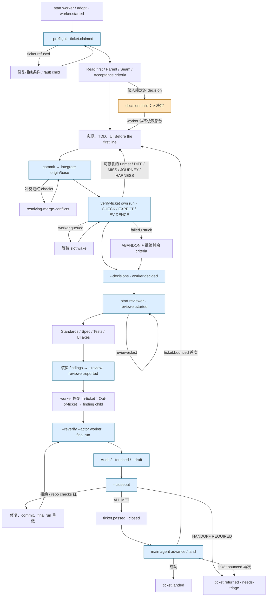

# M3-mmw-ticket：MMW 单张 ticket 的内部循环

## 1. 在端到端中的位置

入口是 `dispatch.sh start <n> worker` 启动 ticket 的 worker；自行接票则先 `adopt <n>`。worker 在 `issue-<n>` worktree 工作，入口事件是 `worker.started`；依据：`mmw-v2/skills/dispatch/SKILL.md` 的 `## Find your moment`、`mmw-v2/skills/dispatch/references/inside-a-ticket.md` 的 `# A ticket you picked up yourself`、`docs/contexts/ticket-run/CONTEXT.md` 的 `### Roles`。
上游交来完整 ticket（`What to build`、`Owns`、`Read first`、`Parent`、`Seam`、`Acceptance criteria` 的 `CHECK:`/`EXPECT:`）、spec 指定章节、baseline；UI ticket 还读取 screen contract、design package，运行产品所需答案在 `.mmw/target.json`；依据：`mmw-v2/upstream/skills/engineering/implement/SKILL.md` 的 `## Claim, read in, write the code`、`mmw-v2/skills/ui-acceptance/references/product-answers.md` 的 `## What the repository answers`。
出口之一是 `--closeout` 将 `ALL MET` ticket 关闭，写 `ticket.passed`，交给 main agent 的 `advance`/`land` 落到 base branch；另一个是 `HANDOFF REQUIRED` 将 ticket 保持 open、移至 `needs-triage`，写 `ticket.returned`；依据：`mmw-v2/skills/verify-ticket/scripts/verify-ticket.py` 的 `_run_closeout`、`mmw-v2/skills/dispatch/references/night.md` 的 `## 3. Each time something wakes you`。

## 2. 阶段表

| 序号 | 阶段名（原文） | 执行者 | 输入 | 产出物（文件、issue、PR、label、事件） | 门禁或退出条件 | 失败/回退/升级路径 | 出处 |
| --- | --- | --- | --- | --- | --- | --- | --- |
| 1 | `start <n> worker` / `adopt <n>` | main agent / worker；`dispatch.sh` | ticket、grade、base branch、`~/.mmw/models.json` | `.worktrees/issue-<n>`、`issue-<n>`、`worker.started`；relay watch | worker session 与 worktree 可识别 | start/adopt exit 2 不记录有效接票，修 stderr 所指条件 | `mmw-v2/skills/dispatch/scripts/dispatch.sh` 的 `start` 与 `adopt_ticket`；`mmw-v2/skills/dispatch/references/inside-a-ticket.md` 的 `## Exit codes` |
| 2 | `--preflight` | worker 调用 `verify-ticket.py` | ticket、branch、assignee、blocking graph、base commit | `ticket.claimed`；非 UI 判据在 base commit 的 `ticket.checked` (`baseline`) | `READY`，可认领；baseline 红不拒绝认领 | `NOT_READY` / `ticket.refused`；pipeline fault 开 `fault` child 并停 | `mmw-v2/skills/verify-ticket/scripts/verify-ticket.py` 的 `run_preflight`、`run_baseline_if_needed`；`mmw-v2/upstream/skills/engineering/implement/SKILL.md` 的 `## Claim, read in, write the code` |
| 3 | `Claim, read in, write the code` | worker | ticket 全文和 comments、open sub-issues、`Read first`、`Parent` 指定章节、context、`Seam` | 当前分支实现与提交；`Decisions I made on my own`、必要的 `Outside Owns` 理由 | 每项 ticket 行为完成；按 `Seam` 验证，运行相关类型检查及测试 | baseline/criterion 冲突开 `contract` child；产品决定开 `decision` child；pipeline 故障开 `fault` child；非必要跨 Owns 改动开 `deferred` child | `mmw-v2/upstream/skills/engineering/implement/SKILL.md` 的 `## Claim, read in, write the code`、`## Shared experience while implementing` |
| 4 | `Before the first line` / `Fix in place`（UI ticket） | worker；story judge | screen contract、design package、`scenes.json`、`.mmw/target.json` | `--render-only` 截图与 values JSON；`DIFF` / `STORY OK` | story 每个 scene 和 viewport 无 `DIFF`；外观由 reviewer 的 UI axis 看图 | design side 错则 `contract` child、受阻 criterion `ABANDON: … stuck`；其余继续 | `mmw-v2/upstream/skills/engineering/implement/references/writing-interface-code.md` 的 `## Before the first line`、`## Fix in place`、`## When the design side is the defect`；`mmw-v2/skills/ui-acceptance/references/story-parity.md` 的 `## The DIFF line` |
| 5 | `Integrate origin/<base branch>` | worker 调用 `dispatch.sh integrate` | 已提交的 `issue-<n>`、origin base branch | 合并后的 ticket commit | integrate exit 0 | exit 3 冲突就地解决，clean merge 后 checks 红也用 `resolving-merge-conflicts`；exit 2 的 pipeline fault 开 child | `mmw-v2/upstream/skills/engineering/implement/SKILL.md` 的 `## Closing steps` step 1；`mmw-v2/upstream/skills/engineering/resolving-merge-conflicts/SKILL.md` 的 steps 1–5 |
| 6 | `Run every criterion` | worker 调用 `verify-ticket.py` → gate-check / UI judges | ticket `Acceptance criteria`、`CHECK:`、`EXPECT:`、`TIMEOUT:`、当前 HEAD | 临时 `AC.md` ledger；`EVIDENCE:`；`ticket.checked` (`self`) 含结果、commit、counts、`Outside Owns:` | 每条 `CHECK` exit 0 且输出匹配 `EXPECT` 才 met；至少一次 own run 记录到 ticket | 红则修复并重跑；无产品 slot 写 `worker.queued`、worker 等 wake；无法修复记 `ABANDON: failed/stuck`；事件写失败则此次运行不算 | `mmw-v2/skills/verify-ticket/scripts/verify-ticket.py` 的 `_run_checks`、`hold_slot`；`mmw-v2/upstream-unlazy/scripts/gate-check.mjs` 的 `runCheck`、`evidenceFor`、`failureEvidenceFor`；`mmw-v2/upstream/skills/engineering/implement/SKILL.md` 的 `## Closing steps` step 1 |
| 7 | `--decisions <file>` | worker 调用 `verify-ticket.py` | 自主决定、`Outside Owns:` 理由 | 一次 `DECISIONS` comment / `worker.decided` | reviewer 开始前已发布 | comment 未写成功则重试，不以口头说明代替 | `mmw-v2/upstream/skills/engineering/implement/SKILL.md` 的 `## Closing steps` step 2；`mmw-v2/skills/verify-ticket/scripts/verify-ticket.py` 的 `run_decisions` |
| 8 | `start <n> reviewer` / `Run the axes` | worker 调用 `dispatch.sh`；reviewer session；Standards、Spec、Tests、可选 UI axis 子 agent | ticket、base commit、HEAD diff、`DECISIONS` | `reviewer.started`；四轴独立报告 | 有 story criterion 则四轴，否则三轴；reviewer 等所有 axis 返回 | `reviewer.lost` 后重启；start exit 2 按 stderr 重试一次，否则开 `fault` child | `mmw-v2/upstream/skills/engineering/code-review/references/session.md` 的 `## 1. Pin the diff`、`## 2. Run the axes`；`mmw-v2/upstream/skills/engineering/implement/SKILL.md` 的 `## Closing steps` step 3 |
| 9 | `Verify every finding` / `Sort every review finding` / `--review <file>` | reviewer；`verify-ticket.py` | axis 报告、diff 周边代码、ticket `Owns` 等 | `REVIEW <base>..<HEAD>` comment / `reviewer.reported`，分 `In-ticket` 与 `Out-of-ticket`，含 `Withdrawn` | 每项 finding 经核实并归类；`--review` exit 0 | 无法判断则标 `unverified`；被证伪写 `refuted`；空 diff 作为 review 失败上票 | `mmw-v2/upstream/skills/engineering/code-review/references/session.md` 的 `## 3. Verify every finding the axes report`、`## 4. Sort every review finding into in-ticket or out-of-ticket`、`## 5. Write one review comment on the ticket` |
| 10 | `fix round` / `--sub-issue finding` | worker | `reviewer.reported`、review comment | in-ticket 修复提交或 `refuted:`；仍成立的 out-of-ticket finding child | in-ticket 一轮处理完成；不做第二次 review | reviewer report 唤醒 worker；确认错报须给反证；超 ticket 范围开 `finding` child | `mmw-v2/upstream/skills/engineering/implement/SKILL.md` 的 `## Closing steps` step 3；`mmw-v2/skills/verify-ticket/references/sub-issues.md` 的 `# Sub-issues` |
| 11 | `--reverify --actor worker` / `Audit` / `--touched` | worker 调用 `verify-ticket.py` | 最后一次写入后的 HEAD、所有 criteria、`Read first` | `ticket.checked` (`reverify`)；`worker.touched` 给受影响 open sibling ticket | 所有 criteria 最终重跑；Audit 对上每条最新 `EVIDENCE:` 与 baseline | 最终 run 红不再修复轮，记 `ABANDON: failed`；不能由旧 run 代替 | `mmw-v2/upstream/skills/engineering/implement/SKILL.md` 的 `## Closing steps` steps 4–6；`mmw-v2/skills/verify-ticket/scripts/verify-ticket.py` 的 `_run_checks`、`run_touched` |
| 12 | `--draft` / `--closeout <draft>` | worker 调用 `verify-ticket.py` | final reverify、review、decision、abandon、`target.json` repository checks | `ALL MET` → branch push、issue closed、`ticket.passed`；`HANDOFF REQUIRED` → `needs-triage`、issue open、`ticket.returned` | draft 无 `<fill>`、counts 对、review 已处置、HEAD 与 final run 一致；passed 时 repo checks 通过 | 拒绝不改 ticket；repo checks 红修代码、重做 final run；tracker 已改而 event 缺失则同 draft 再跑补事件 | `mmw-v2/upstream/skills/engineering/implement/SKILL.md` 的 `## Closing steps` steps 7–8；`mmw-v2/skills/verify-ticket/scripts/verify-ticket.py` 的 `_run_closeout` |
| 13 | `advance` / `land`（本块出口） | main agent 调用 `dispatch.sh` | `ticket.passed` 或 `ticket.returned` | passed commit 落 base、`ticket.landed`；或 ticket 留待 triage | merge 与 repo checks 成功才 landed | landing 冲突/红 checks 写 `ticket.bounced`；night 第一次复用 standing workspace 重做，第二次 `needs-triage` | `mmw-v2/skills/dispatch/references/night.md` 的 `## 3. Each time something wakes you`；`docs/contexts/ticket-run/CONTEXT.md` 的 `### Comments on the ticket` |

## 3. 流程图

图中 `failed/stuck` 进入 `HANDOFF REQUIRED`；`decision` child 本身不强制 hand back。依据：`mmw-v2/upstream/skills/engineering/implement/SKILL.md` 的 `## Closing steps`；`mmw-v2/skills/verify-ticket/scripts/verify-ticket.py` 的 `_run_closeout`。

## 4. 角色、并发与隔离

- **worker / reviewer / axes / advisor**：worker 是 ticket session；reviewer 是 worker 启动的另一 session；Standards、Spec、Tests、UI 是 reviewer 内部可并行的 axis 子 agent，不支持子 agent 的 host 则顺序运行并先保存各自报告；advisor 是独立、更强模型的只读决策咨询 session。依据：`docs/contexts/ticket-run/CONTEXT.md` 的 `### Roles`、`### Code review`；`mmw-v2/upstream/skills/engineering/code-review/references/session.md` 的 `## 2. Run the axes`；`mmw-v2/skills/advisor/references/consulting.md` 的 `# Consulting the advisor`。
- **模型与宿主**：worker 依据 ticket 的 `*-worker` grade，reviewer 用 `reviewer` row；host/model/effort 从 `~/.mmw/models.json` 经 runner catalog 解析；advisor 也由 dispatch model 配置选择。固定型号未写在 skill 内。依据：`mmw-v2/skills/dispatch/scripts/dispatch.sh` 的 `start` 注释及 profile 解析、`mmw-v2/skills/dispatch/references/editing-models.md` 的 `# Editing models`。
- **隔离和传话**：每 ticket 的 `.worktrees/issue-<n>` 与 `issue-<n>` branch 是持久 workspace；reviewer 与 worker 用同一 ticket worktree。评论尾部 `<!-- mmw {...} -->` 是状态；relay 把 `reviewer.reported`、`worker.queued` 等 event 唤醒相关 session，agent `ack` 后继续。UI 产品运行由 `lease.py` 分配 slot/ports/data directories。依据：`mmw-v2/skills/dispatch/scripts/dispatch.sh` 的 `start` / worktree 注释；`mmw-v2/skills/dispatch/SKILL.md` 的 `## On waking`；`mmw-v2/skills/ui-acceptance/SKILL.md` 的 `## Five rules while the product is running`。
- **同时数量**：一个 review round 只有一个 reviewer，最多四个 axis 同时跑；单个 ticket 的 gate-check criteria 默认顺序执行。跨 ticket 的 worker 并发由 dispatch frontier 与 grade 管，产品运行另受 slot 限制；未在本块文件中读到一个固定全局并发数。依据：`mmw-v2/upstream/skills/engineering/implement/SKILL.md` 的 `## Closing steps` step 3；`mmw-v2/upstream/skills/engineering/code-review/references/session.md` 的 `## 2. Run the axes`；`mmw-v2/skills/verify-ticket/scripts/verify-ticket.py` 的 `lint_check_effects`、`hold_slot`。

## 5. 状态与恢复

- ticket 的持久状态是 issue comments 按 comment-id 顺序折叠的 events；`ticket.checked` 保存每次 run 的 commit、各 AC、`EVIDENCE:`、counts 等，`worker.decided`、`reviewer.reported`、`ticket.passed`/`ticket.returned` 是阶段边界。工作树和分支保存代码，临时 `AC.md` 只供 gate-check 当前 run 使用、运行后删除。依据：`mmw-v2/skills/verify-ticket/SKILL.md` 的 `# Verify ticket`；`docs/contexts/ticket-run/CONTEXT.md` 的 `### Comments on the ticket`、`### Running the criteria`；`mmw-v2/skills/verify-ticket/scripts/verify-ticket.py` 的 `_run_checks`。
- worker 醒来先重做被打断的命令，读 event 并 `ack`；`implement` 的 closing steps 按最新 `ticket.checked`、`worker.decided`、`reviewer.started`/`reported`、worker reverify 找恢复点。`reviewer.lost` 重启 reviewer；worker session 丢失则新 worker 在 standing workspace 接续，旧未提交 tracked edits 可收为 `wip(#<n>)`。依据：`mmw-v2/skills/dispatch/SKILL.md` 的 `## On waking`；`mmw-v2/upstream/skills/engineering/implement/SKILL.md` 的 `## Closing steps` resume table；`mmw-v2/skills/dispatch/references/one-ticket.md` 的 step 3。
- tracker 状态变化先于 `ticket.passed`/`ticket.returned` event；若后者写失败，原 draft 再跑会补事件，不会重做 tracker 变化；若 `ticket.checked` 写失败，该次验收不算发生。依据：`mmw-v2/skills/verify-ticket/scripts/verify-ticket.py` 的 `_run_closeout`、`_run_checks`。

## 6. 验证与质量门

- **验收执行**：`verify-ticket.py` 把票的 `Acceptance criteria` 写成临时 `AC.md`，经 gate-check 为每个 `CHECK:` 起独立 shell；exit 0 且整体输出匹配 `EXPECT:` 才勾选；通过和失败都写 `EVIDENCE:`，失败记录 exit/EXPECT/输出指纹和摘要。`--reverify` 重跑所有判据；定义变更会使旧 evidence 失效。依据：`mmw-v2/skills/verify-ticket/scripts/verify-ticket.py` 的 `_run_checks`、`write_ledger`；`mmw-v2/upstream-unlazy/scripts/gate-check.mjs` 的 `runCheck`、`evidenceFor`、`failureEvidenceFor`；`mmw-v2/merge-notes/unlazy.md` 的 `## 总原则`、`### scripts/gate-check.mjs`。
- **UI judges**：`story-parity.py` 在 design page 与 product story 的同 scene/viewport 比 `data-ui` element facts，`DIFF` 是 machine verdict，截图/pixel diff 是旁证；`boundary-check.py` 运行指定 product test 两遍，第二遍 `MMW_NEGATIVE=1` 跳过交互，首遍失败为 `MISS`、第二遍仍绿为 `GREEN WITHOUT INTERACTION`；`journey.py` 启动完整产品、执行真实路径并以断开接口/停止产品作 negative control，输出 `JOURNEY …`；`harness-guard.py` 检出将自动验收标记带进生产代码的 `HARNESS LEAK` 或 story 服务读 design page 的 `HARNESS DESIGN PAGE`。依据：`mmw-v2/skills/ui-acceptance/references/story-parity.md` 的 `## Element parity`、`## The DIFF line`；`mmw-v2/skills/ui-acceptance/scripts/boundary-check.py` 的 `main`；`mmw-v2/skills/ui-acceptance/references/journey.md` 的 `## The negative control`、`## Exit codes`；`mmw-v2/skills/ui-acceptance/references/harness-guard.md` 的 `## Exit codes`。
- **四轴 review**：Standards 对 `CODING_STANDARDS.md`、domain 词汇和 smell/删减检验；Spec 对 ticket、指定 spec、baseline、`DECISIONS`、UI screen contract 行与合并后的组合行为；Tests 只核验 `CHECK:` 指名的测试、boundary/journey 断言，不运行测试或另定覆盖率；UI 只在 story criterion 存在时看 design/product 截图里 element parity 未覆盖的问题。依据：`mmw-v2/upstream/skills/engineering/code-review/references/standards-reviewer.md` 的 `## 3. Match the diff against the standards and the smell baseline`；`spec-reviewer.md` 的 `## 2. Read the ticket and what it points at`、`## 3. What you are looking for`；`tests-reviewer.md` 的 `## 1. Build your scope from the ticket's acceptance criteria`、`## Two things this axis never reports`；`ui-reviewer.md` 的 `## 2. What you are looking for`。
- **关票门**：final reverify 必须在最后代码提交后对应 HEAD；draft 要与 criteria、review、findings、abandon、counts 一致；passed 时还运行 `.mmw/target.json` 的 repository checks 并 push branch，之后才关闭 issue 与发 `ticket.passed`。本仓 `.mmw/target.json` 无 `checks` key，故该可选门在本仓跳过；ticket 的 `CHECK:` 仍运行。依据：`mmw-v2/skills/verify-ticket/scripts/verify-ticket.py` 的 `verified_problems`、`_run_closeout`、`target_json_checks`；根 `AGENTS.md` 的 `<important if="you are opening a night or working one ticket inside this repository">`。
- **辅助质量手段**：`tdd` 只在 ticket 约定的 `Seam` 写行为测试，red→green 一条 vertical slice 一次；`diagnosing-bugs` 先建立能针对该 bug 变红的反馈命令；`code-checkers` 为新语言或缺失 checker 设 repo 级 lint/format/type gate；`exe-release` 仅在用户要求 ship/package/installer 时进入打包流程，并非关票步骤。依据：`mmw-v2/upstream/skills/engineering/tdd/SKILL.md` 的 `## Seams: where tests go`、`## Rules of the loop`；`diagnosing-bugs/SKILL.md` 的 `## Phase 1: Build a feedback loop`；`mmw-v2/skills/code-checkers/SKILL.md` 的 `# Code checkers`；`mmw-v2/skills/exe-release/SKILL.md` 的 `# Release`。

## 7. 人的介入点

- ticket/spec/baseline 都不能决定的产品选择开 `decision` child，worker 完成其余工作；main agent 或用户决定后再处理，`decision` abandon 不使其他已通过 criteria 自动变成 `HANDOFF REQUIRED`。依据：`mmw-v2/upstream/skills/engineering/implement/SKILL.md` 的 `## Claim, read in, write the code`、`## Closing steps`。
- `contract` child 涉及权威来源矛盾或缺项时，由 main agent 按 authority order 改可改来源；若会推翻用户决定或扩大 spec，留给用户，并把未开始的受影响 ticket 移 `needs-triage`。design page 来源需有 Claude Design MCP 的另一次工作。依据：`mmw-v2/skills/dispatch/references/night.md` 的 `## 3. Each time something wakes you`。
- UI 自动验收中，人工 click/浏览器授权不是 worker 临时补步：开 `fault` child 并停；产品不可达也如此。reviewer 不启动产品。依据：`mmw-v2/skills/ui-acceptance/SKILL.md` 的 `## Five rules while the product is running`。
- worker 不等人裁定工程细节、不等 reviewer 逐条答复，也不请人手动关票；reviewer report 通过 ticket event 唤醒，closeout 是确定性脚本。`exe-release` 在用户明确要求发包时才进入，最终安装实测等用户反馈；这不属于单张 ticket 的默认关票循环。依据：`mmw-v2/upstream/skills/engineering/implement/SKILL.md` 的 `## Claim, read in, write the code`、`## Closing steps`；`mmw-v2/skills/exe-release/SKILL.md` 的 `## 5. User install test`。

## 8. 显著机制

- **ticket-as-state**：每次命令重新读 ticket comments，event fold 决定恢复点，避免依赖上一 session 内存；依据：`mmw-v2/skills/verify-ticket/SKILL.md` 的 `# Verify ticket`、`docs/contexts/ticket-run/CONTEXT.md` 的 `### Comments on the ticket`。
- **先 decisions 后 review**：worker 自主决定与跨 `Owns` 理由在 reviewer 启动前成为 `DECISIONS` comment，Spec axis 逐行判断；依据：`mmw-v2/upstream/skills/engineering/implement/SKILL.md` 的 `## Closing steps` step 2；`mmw-v2/upstream/skills/engineering/code-review/references/spec-reviewer.md` 的 `## 3. What you are looking for`。
- **reviewer 验证 axis finding**：axis 独立报告后 reviewer 逐项检查实际坏结果，再分 in-ticket/out-of-ticket，防止猜测直接变修复工作；依据：`mmw-v2/upstream/skills/engineering/code-review/references/session.md` 的 `## 3. Verify every finding the axes report`、`## 4. Sort every review finding into in-ticket or out-of-ticket`。
- **验收负控**：story、boundary、journey 都检查判据在故意破坏条件下能失败，减少形式上绿色的测试；依据：`mmw-v2/skills/ui-acceptance/references/story-parity.md` 的 `## Negative controls`、`boundary-check.md` 的 `## The four-column boundary test`、`journey.md` 的 `## The negative control`。
- **失败也留 evidence**：本仓保留 unlazy gate-check 的判定引擎，但每次失败也写 `EVIDENCE:`，留下 exit、EXPECT 和输出摘要，便于解释最终 reverify 变红；依据：`mmw-v2/merge-notes/unlazy.md` 的 `### scripts/gate-check.mjs`；`mmw-v2/upstream-unlazy/scripts/gate-check.mjs` 的 `failureEvidenceFor`。
- **产品 slot lease**：运行产品的验收占独立端口与目录；无 slot 时发 `worker.queued`，relay 在归还后唤醒，不由 worker 抢端口或终止别人进程；依据：`mmw-v2/skills/verify-ticket/scripts/verify-ticket.py` 的 `hold_slot`；`mmw-v2/skills/ui-acceptance/SKILL.md` 的 `## Five rules while the product is running`。
- **closeout 原子边界**：脚本先验证 final run/review/draft，再 push、改 tracker、发事件；事件失败时可用同 draft 补发，防止 main agent 凭未完成动作落地；依据：`mmw-v2/skills/verify-ticket/scripts/verify-ticket.py` 的 `_run_closeout`。

## 9. 未读到或不确定

- 本调查没有 ticket 的实际 issue 正文、`CHECK:` 实例或运行记录；没有运行任何脚本，因此阶段结果是实现与说明文件的静态结论，非本次真实 night 的观察。
- 未追完整 `dispatch.sh` 的跨 ticket frontier、relay/watchdog 或全局并发实现；本块仅可确认同一 reviewer 的 axis 并行、一个 ticket 的 criteria 顺序及产品 slot 等待。出处边界：`mmw-v2/skills/dispatch/scripts/dispatch.sh` 的 `start` 注释；`mmw-v2/skills/verify-ticket/scripts/verify-ticket.py` 的 `hold_slot`。
- `story-parity.py` 截图、element facts 的各比较分支与 Playwright 失败细节未逐行通读；对其 verdict 使用 `mmw-v2/skills/ui-acceptance/references/story-parity.md` 的 `## Element parity`、`## Exit codes`，并以 `mmw-v2/skills/ui-acceptance/scripts/story-parity.py` 的 `run` 入口作存在性核对。
- `exe-release`、`code-checkers` 是可调用的辅助技能，不是 ticket 必经阶段；本调查未读两者每份 references 或全部 release/checker 脚本，因此不推断其执行细节。出处边界：`mmw-v2/skills/exe-release/SKILL.md` 的 `# Release`；`mmw-v2/skills/code-checkers/SKILL.md` 的 `# Code checkers`。
