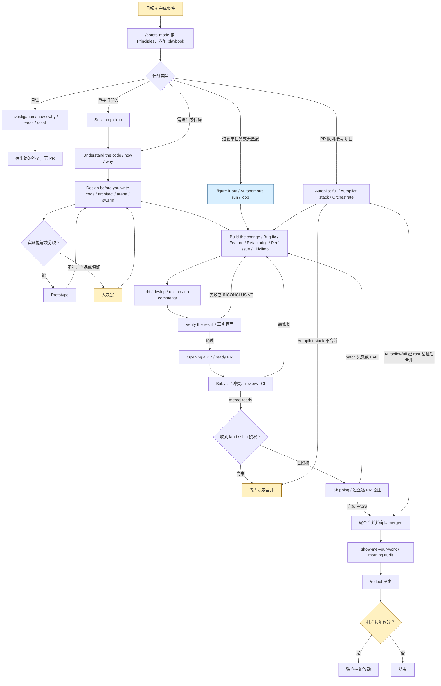

# P1-pstack-overall：pstack 整体架构与端到端主线

## 1. 在端到端中的位置

- 入口是 Cursor 聊天中的目标、可检验的完成条件和可选约束；`/poteto-mode` 按请求匹配 playbook，把步骤逐条复制进 todo，跳过的步骤也保留 `skip: <reason>`。出处：`docs/research/code-landing-refs/pstack/docs/guide/02-poteto-mode.md` 的 `## What happens to your prompt`；`docs/research/code-landing-refs/pstack/skills/poteto-mode/SKILL.md` 的 `## Playbooks`。
- 安装入口为 Cursor 的 `/add-plugin pstack`，配置入口为 `/setup-pstack`；后者写 `~/.cursor/rules/pstack-models.mdc`，新会话生效。出处：`docs/research/code-landing-refs/pstack/docs/guide/01-setup.md` 的 `## Install the plugin`、`## Pick your models`；`docs/research/code-landing-refs/pstack/skills/setup-pstack/SKILL.md` 的 `### 5. Write the rule`。
- 读问题的出口是有出处的答复，不进入 PR；代码任务通常经独立验证、ready PR、merge-ready、独立复核和逐个合并。出处：`docs/research/code-landing-refs/pstack/skills/poteto-mode/playbooks/investigation.md` 的 `### Investigation`；`docs/research/code-landing-refs/pstack/skills/poteto-mode/playbooks/opening-a-pr.md` 的 `### Opening a PR`；`docs/research/code-landing-refs/pstack/skills/poteto-mode/playbooks/shipping.md` 的 `### Shipping`。
- 长任务可改走 `Autonomous run`、`Autopilot-full`、`Autopilot-stack` 或 `Orchestrate`；回来后审阅 `show-me-your-work` 的决策记录，明确调用 `/reflect` 才会形成技能修改提案。出处：`docs/research/code-landing-refs/pstack/docs/guide/07-overnight.md` 的 `## The morning audit`、`## When the night holds a queue, not a task`；`docs/research/code-landing-refs/pstack/skills/reflect/SKILL.md` 的 `## When to invoke`。

## 2. 阶段表

| 序号 | 阶段名（原文） | 执行者 | 输入 | 产出物（文件、issue、PR、label、事件） | 门禁或退出条件 | 失败/回退/升级路径 | 出处 |
| --- | --- | --- | --- | --- | --- | --- | --- |
| 0 | Set up pstack | 人；Cursor；`setup-pstack` skill | `/add-plugin pstack`，可用模型和 reasoning budget | 插件；`~/.cursor/rules/pstack-models.mdc`；可选 `.cursor/skills/verify-<app>/` | 真实模型 slug 必须可用；新会话读取配置 | 未检测到模型则问人；没有 app 验证手段时只提供一次生成建议 | `docs/research/code-landing-refs/pstack/docs/guide/01-setup.md` 的 `# Set up pstack`；`docs/research/code-landing-refs/pstack/skills/setup-pstack/SKILL.md` 的 `### 1. Detect available models`、`### 4. Validate`、`### 7. Offer a verification skill (optional)` |
| 1 | Route work through `/poteto-mode` | 人给目标；主 agent 路由 | 目标、完成条件、上下文；`new task` 表示重匹配 | 匹配 playbook 的 todo；显式 `skip: <reason>` | 读 Principles；选一条 playbook；大/跨领域/人离开后的任务转 `figure-it-out`，长期项目转 `Orchestrate` | 无匹配走 `figure-it-out`；纯提问走 `Investigation` | `docs/research/code-landing-refs/pstack/docs/guide/02-poteto-mode.md` 的 `## What happens to your prompt`、`## Switch tasks with "new task"`；`docs/research/code-landing-refs/pstack/skills/poteto-mode/SKILL.md` 的 `## Playbooks` |
| 2 | Understand the code before changing it | 主 agent；`how` explorers；`why` investigators | 代码、历史、先前对话 | `/how` 运行流程；`/why` 原因与证据；`/teach` 综合解释；`/recall` 进度摘要；`Session pickup` 恢复点 | 非平凡修改先 `how`；读问题以有出处的答复结束 | 证据薄弱标明推断；旧任务用 `Session pickup` 对照原目标验证，不能只信自述 | `docs/research/code-landing-refs/pstack/docs/guide/03-understand.md` 的 `# Understand the code before changing it`、`## Take over prior work with Session pickup`；`docs/research/code-landing-refs/pstack/skills/poteto-mode/playbooks/investigation.md` 的 `### Investigation` |
| 3 | Design before you write code | 主 agent；`architect`、`arena`、`swarm`、`interrogate` 子 agent；必要时人 | 已知行为、数据形状、边界与产品偏好 | 竞争设计、候选实现、交叉评审、吞吐 checkpoint；可选多 PR plan | 跨函数边界调用 `architect`；有争议设计在 shipping 前 `interrogate`；实证可解的分歧先 `Prototype` | 实验不能解决的产品/偏好决策等人；`Multi-phase or multi-PR plan` 只产出计划，执行等明确 go | `docs/research/code-landing-refs/pstack/docs/guide/04-design.md` 的 `# Design before you write code`、`## How much design work does a task deserve?`；`docs/research/code-landing-refs/pstack/skills/poteto-mode/SKILL.md` 的 `## Non-negotiables`；`docs/research/code-landing-refs/pstack/skills/poteto-mode/playbooks/multi-phase-plan.md` 的 `### Multi-phase or multi-PR plan` |
| 4 | Build the change and clean the diff | 主 agent 负责计划/复核；`poteto-agent` 或专用 skill 子 agent 写代码；`Comment Sicko` 只读检查 | `Bug fix`、`Feature`、`Refactoring`、`Perf issue` 等 playbook 及可验证目标 | 工作树修改、测试/重现、分段 commits；`/deslop`、`/unslop`、`/no-comments` 的清理结果 | Bug 先重现；Feature 先命名数据形状；Refactoring 先固定行为；Perf 先量基线；提交前清理 | 假设被否定则撤销对应改动；行为改变从 Refactoring 改走 Feature；skill 本身坏了开独立 PR | `docs/research/code-landing-refs/pstack/docs/guide/05-build-and-clean.md` 的 `# Build the change and clean the diff`；`docs/research/code-landing-refs/pstack/skills/poteto-mode/playbooks/bug-fix.md` 的 `### Bug fix`；`docs/research/code-landing-refs/pstack/skills/poteto-mode/playbooks/refactoring.md` 的 `### Refactoring` |
| 5 | Verify the result and open a PR | 主 agent；项目 `verify-*` skill；控制 skill；必要时独立 reviewer | 可执行完成条件、真实应用/CLI、变更 | 运行输出、截图/录屏、性能前后值；ready PR URL 与 `## Verification` | 在真实表面证明结果；`INCONCLUSIVE` 非通过；PR 用小而有序的 commits | 验证失败返回构建；缺驱动可生成并先端到端证明 `verify-*`；不能用编译成功代替功能证据 | `docs/research/code-landing-refs/pstack/docs/guide/06-verify-and-ship.md` 的 `# Verify the result and open a PR`、`## Create a project verification skill`；`docs/research/code-landing-refs/pstack/skills/poteto-mode/playbooks/opening-a-pr.md` 的 `### Opening a PR` |
| 6 | Babysit | 主 agent/专门 babysitter；GitHub `watch-pr` 或 Origin | 已打开 PR/stack；review threads；CI；merge state | 修复 push、线程回复、merge-ready 状态 | 先冲突、再 review、再 CI；forge 确认可合并；此阶段**不合并** | 冲突交 owner rebase；真实 Bugbot 问题修复，噪声附证据驳回，安全/数据模糊项问人；CI flake 只重试一次 | `docs/research/code-landing-refs/pstack/skills/poteto-mode/playbooks/babysit.md` 的 `### Babysit`；`docs/research/code-landing-refs/pstack/skills/poteto-mode/references/bugbot-triage.md` 的 `## Decision rubric` |
| 7 | Shipping | 主 agent；每 PR 一名独立 Cursor cloud verifier；forge | merge-ready stack、当前 head/base、PR verdict | 每 PR `PASS`/`PASS+NOTES`/`FAIL`；bottom-up squash merge；已合并 PR 与 ceiling 报告 | 仅合并自底向上连续的已验证 PR；合并前核 patch-id、当前 CI 和可合并性 | 断链即停止；patch 改变重新验证；待检查可在用户要求 merge-when-ready 时只武装底部 PR；等待其实际 merged 后再下一条 | `docs/research/code-landing-refs/pstack/skills/poteto-mode/playbooks/shipping.md` 的 `### Shipping`，步骤 1–9 |
| 8 | Run work while you sleep | 主 agent；`/loop`；`figure-it-out`；owner/verifier/coordinator 子 agent | 人的目标、完成条件、授权、退出条件 | `decisions.tsv`；可选 `children.tsv`、PR 队列、验证 ledger、合并结果或未合并 stack | `Autonomous run` 单任务到谓词；`Autopilot-full` 独立 PR 到 merged；`Autopilot-stack` 只交经验证 stack；`Orchestrate` 多日项目到最终谓词 | 不前进的尝试丢弃并转向；真死路记明原因；人明确 stop 触发零写入 hold | `docs/research/code-landing-refs/pstack/docs/guide/07-overnight.md` 的 `## The overnight contract`、`## When the night holds a queue, not a task`；`docs/research/code-landing-refs/pstack/skills/poteto-mode/playbooks/autonomous-run.md` 的 `### Autonomous run`；`docs/research/code-landing-refs/pstack/skills/poteto-mode/playbooks/autopilot-full.md` 的 `### Autopilot-full` |
| 9 | The morning audit / Capture a session's lessons with `/reflect` | 人审阅；跨模型 trail reviewer；三名 reflect reviewer + synthesizer | 任务 transcript、决策日志、证据、合并结果 | `Attention` 项；`Accepted`/`Rejected`/`Backlog`；人批准后才有技能 PR/修改 | 决策日志与 transcript 对得上；`reflect` 的 Accepted 项等人批准 | 无 transcript 用摘要；一过性经验不沉淀；可机械执行的建议移入 Backlog；未批准不改 skill | `docs/research/code-landing-refs/pstack/docs/guide/07-overnight.md` 的 `## The morning audit`；`docs/research/code-landing-refs/pstack/docs/guide/09-make-it-yours.md` 的 `## Capture a session's lessons with /reflect`；`docs/research/code-landing-refs/pstack/skills/reflect/SKILL.md` 的 `### 5. Apply` |

### 路由索引

`poteto-mode/SKILL.md` 的 `## Playbooks` 把只读问题给 `Investigation`；缺陷给 `Bug fix`；新行为给 `Feature`；结构不变行为给 `Refactoring`；单次性能问题给 `Perf issue`，持续指标优化给 `Hillclimb`；运行中的症状给 `Runtime forensics`，已有 profiling 工件给 `Trace forensics`；实验决策给 `Prototype`，像素等价给 `Visual parity`；技能写作给 `Authoring or modifying a skill`，技能效果实验给 `Eval`；PR 状态给 `Babysit`，请求合并给 `Shipping`；长单任务给 `Autonomous run`，独立 PR 队列给 `Autopilot-full`，要人落地的耦合队列给 `Autopilot-stack`，跨多日项目给 `Orchestrate`；继承任务给 `Session pickup`，显式暂停给 `Pause safely`，多阶段只写计划给 `Multi-phase or multi-PR plan`，清磁盘给 `Worktree and simulator cleanup`。`Opening a PR` 是代码任务的通用收尾，但 `Investigation` 明确是例外。出处：`docs/research/code-landing-refs/pstack/skills/poteto-mode/SKILL.md` 的 `## Playbooks`；`docs/research/code-landing-refs/pstack/skills/poteto-mode/playbooks/investigation.md` 的 `### Investigation`。

## 3. 流程图

图中的 `:::script` 仅标注 Cursor 内建 `/loop` 的唤醒步骤；`/poteto-mode` 是 skill 指令驱动的 agent 路由，不是一个确定性 dispatcher 程序。`Autopilot-full` 的合并授权来自操作者给出的全自治许可和 root 的 clean verdict；`Autopilot-stack` 留给操作者落地。出处：`docs/research/code-landing-refs/pstack/skills/poteto-mode/SKILL.md` 的 `## Playbooks`；`docs/research/code-landing-refs/pstack/skills/poteto-mode/playbooks/autonomous-run.md` 的 `### Autonomous run`；`docs/research/code-landing-refs/pstack/skills/poteto-mode/playbooks/autopilot-full.md` 的 `### Autopilot-full`，步骤 4–5；`docs/research/code-landing-refs/pstack/skills/poteto-mode/playbooks/autopilot-stack.md` 的 `### Autopilot-stack`，步骤 5–8。

## 4. 角色、并发与隔离

- 插件声明 `skills: "./skills/"` 与 `agents: "./agents/"`；两个显式 agent 文件是 `poteto-agent` 和只读评论审查员 `Comment Sicko`。一般 playbook 子 agent 用 `subagent_type: "poteto-agent"`，`how`、`why`、`interrogate`、`reflect`、`swarm` 则用各自角色。出处：`docs/research/code-landing-refs/pstack/.cursor-plugin/plugin.json` 的 `skills`、`agents`；`docs/research/code-landing-refs/pstack/agents/poteto-agent.md` 的 `# Poteto subagent`；`docs/research/code-landing-refs/pstack/agents/comment-sicko.md` 的 `# Comment Sicko`；`docs/research/code-landing-refs/pstack/skills/poteto-mode/SKILL.md` 的 `## Subagents`。
- 默认模型为代码代理 `grok-4.7-xhigh-fast`，困难设计、判断和文字 `claude-opus-5-5-max`；`reflect tooling` 是 `gpt-5.6-sol-max`。`arena runners`、`architect runners`、`interrogate reviewers` 的默认列表各有 Opus/Sol/Grok 三个条目；列表长度决定 panel 大小，`swarm workers` 默认 Grok。`inherit-parent`/`auto` 是省略 Task 的 `model` 字段，不是模型 slug。出处：`docs/research/code-landing-refs/pstack/skills/setup-pstack/SKILL.md` 的 `### 3. Budget, map, and confirm`、`### 5. Write the rule`；`docs/research/code-landing-refs/pstack/skills/poteto-mode/SKILL.md` 的 `## Subagents`。
- `/arena` 是同 brief 的并行候选、异模型 judge、选 base 后 graft；`/swarm` 是独立切片/检查或预定赛道。每个并行写者必须独占 worktree/branch；`Opening a PR` 从 main worktree 开始，stack 子 PR 以父分支为 base。出处：`docs/research/code-landing-refs/pstack/docs/guide/04-design.md` 的 `## Fan out attempts with /arena`、`## Cover slices and races with /swarm`；`docs/research/code-landing-refs/pstack/skills/poteto-mode/playbooks/opening-a-pr.md` 的 `### Opening a PR` 中 `**Worktree.**`、`**Size and stacks.**`。
- `Autopilot-full` 是每 PR 一个 Cursor cloud owner，root 对每个 code-ready head 和后续改 patch 的 push 发独立 verifier swarm；独立 PR 并行、重叠写入串行。`Autopilot-stack` 由 root 独占 stack topology 写入。`Orchestrate` 是本地 coordinator、必要时每 track 一个 sub-coordinator、通常 cloud worker/verifier；大约十个在途 child 是单次 drain 的建议上限，非插件全局并发硬上限。出处：`docs/research/code-landing-refs/pstack/skills/poteto-mode/playbooks/autopilot-full.md` 的 `### Autopilot-full`，步骤 2–4；`docs/research/code-landing-refs/pstack/skills/poteto-mode/playbooks/autopilot-stack.md` 的 `### Autopilot-stack`，步骤 6；`docs/research/code-landing-refs/pstack/skills/poteto-mode/playbooks/orchestrate.md` 的 `#### Roles and placement`。
- 委派传文件路径、目标、独占范围、验收条件，不把大段文件塞入 prompt；coordinator 用完整 brief、`preferences.md` standing orders 和 `inbox/` 完成指针传递，兄弟 agent 的消息向上汇总。出处：`docs/research/code-landing-refs/pstack/skills/poteto-mode/SKILL.md` 的 `## Subagents`；`docs/research/code-landing-refs/pstack/skills/poteto-mode/playbooks/orchestrate.md` 的 `#### The brief`、`#### Queue and drain`。

## 5. 状态与恢复

- 一般会话状态由 sticky `/poteto-mode`、todo list、branch/worktree、PR 和 CI/forge 状态承载；`Session pickup` 读活跃 workspace 的 transcript、推送的 branch 和既有决策，`Pause safely` 留 `wip:` commit 与 resume note。出处：`docs/research/code-landing-refs/pstack/README.md` 的 `### just use /poteto-mode`；`docs/research/code-landing-refs/pstack/skills/poteto-mode/playbooks/session-pickup.md` 的 `### Session pickup`；`docs/research/code-landing-refs/pstack/skills/poteto-mode/playbooks/pause-safely.md` 的 `### Pause safely`。
- 长运行的 `show-me-your-work` 把时间、阶段、决定、原因、证据、结果写入本地 `decisions.tsv` 或 `.audit/<task-slug>.tsv`；默认不提交，重大任务可提交。收尾时与 transcript 对账，跨模型 reviewer 给 `Attention`。出处：`docs/research/code-landing-refs/pstack/skills/show-me-your-work/SKILL.md` 的 `## The format`、`## Where it lives`、`## Audit the log against the transcript`、`## Cross-model review of the trail`。
- `Orchestrate` 的 agent store 在 `orchestrate/<project-slug>/`：`preferences.md`、`overview.md`、`units.tsv`、`frontier.json`、`ledger.tsv`、`inbox/`、`gates.md`、`decisions.tsv`、派生的 `status.md`。`orch` CLI 只管理这些状态，不 spawn/wait/wake agent；实现把 ledger 的键定为 PR+SHA，并定义五种 verdict。出处：`docs/research/code-landing-refs/pstack/skills/poteto-mode/playbooks/orchestrate.md` 的 `#### Store layout`；`docs/research/code-landing-refs/pstack/skills/poteto-mode/scripts/orch/store.ts` 的 `LEDGER_HEADER`、`Verdict`；`docs/research/code-landing-refs/pstack/skills/poteto-mode/scripts/orch/orch.ts` 的 `ledger record`、`frontier set`、`status`。
- `Orchestrate` 在 Cursor 重启后认为本地 agent 已死、cloud 工作仍在，重新读 standing orders/units、计算 frontier、按 PR/branch 重接 cloud 工作；错误按 cap/OOM、网络、工具、未知原因分别处理，超两次重试放弃 unit 并重规划。出处：`docs/research/code-landing-refs/pstack/skills/poteto-mode/playbooks/orchestrate.md` 的 `#### Liveness and failure`。

## 6. 验证与质量门

- 通过标准是实际产物：CLI 运行真实命令，UI 走运行中的交互，迁移重放输入，性能比较 profile，存储读回写值。`INCONCLUSIVE` 不算过。出处：`docs/research/code-landing-refs/pstack/docs/guide/06-verify-and-ship.md` 的 `## State the finish condition up front`；`docs/research/code-landing-refs/pstack/skills/figure-it-out/SKILL.md` 的 `## Phase C: Run the loop`。
- `create-verification-skill` 可生成 app 本地驱动，但生成器须自己跑一轮 Launch、Doctor、Drive、Evidence、Cleanup；失败不应使用。出处：`docs/research/code-landing-refs/pstack/docs/guide/06-verify-and-ship.md` 的 `## Create a project verification skill`。
- PR 前 `deslop` 清代码、`no-comments` 让独立只读 reviewer 查评论、`technical-writing` 与 `unslop` 清文字；Bug fix 要失败再通过的复现，Refactoring 要旧/新行为 pin，Perf 要前后测量。出处：`docs/research/code-landing-refs/pstack/skills/poteto-mode/playbooks/opening-a-pr.md` 的 `**PRs.**`；`docs/research/code-landing-refs/pstack/skills/poteto-mode/playbooks/bug-fix.md` 的 `### Bug fix`；`docs/research/code-landing-refs/pstack/skills/poteto-mode/playbooks/refactoring.md` 的 `### Refactoring`；`docs/research/code-landing-refs/pstack/skills/poteto-mode/playbooks/perf-issue.md` 的 `### Perf issue`。
- `Babysit` 信 forge 的可合并状态，不把绿 check list 当判决；`Shipping` 另需作者之外的每 PR live verdict，按当前 patch-id 校验后只落地底部连续通过段。出处：`docs/research/code-landing-refs/pstack/skills/poteto-mode/playbooks/babysit.md` 的 `### Babysit`，步骤 6；`docs/research/code-landing-refs/pstack/skills/poteto-mode/playbooks/shipping.md` 的 `### Shipping`，步骤 1–3。
- `Autopilot-full` 的 root swarm 每轮查当前 SHA 的 gates、真实表面、多个 diff audit，并对照 trunk 跑回归 lane；任何改 patch 的后续 push 触发新轮，clean verdict 才能由 owner 合并。出处：`docs/research/code-landing-refs/pstack/skills/poteto-mode/playbooks/autopilot-full.md` 的 `### Autopilot-full`，步骤 4–5。

## 7. 人的介入点

- 人先给目标、完成条件、授权及不能由实验确定的产品/偏好选择；`Multi-phase or multi-PR plan` 只交计划，明确 go 才执行。出处：`docs/research/code-landing-refs/pstack/skills/poteto-mode/SKILL.md` 的 `## Non-negotiables`；`docs/research/code-landing-refs/pstack/skills/poteto-mode/playbooks/multi-phase-plan.md` 的 `### Multi-phase or multi-PR plan`，步骤 7。
- 设计默认不等待审批；人明确要求 `architect with checkpoint` 才先看设计。可观察的行为/布局/性能分歧由 `Prototype` 实验决定。出处：`docs/research/code-landing-refs/pstack/docs/guide/04-design.md` 的 `## Settle the shape with /architect`；`docs/research/code-landing-refs/pstack/skills/poteto-mode/SKILL.md` 的 `## Non-negotiables`。
- `Babysit` 到 merge-ready 即止；合并需要明确 land/ship 请求，或 `Autopilot-full` 的全自治授权加 root clean verdict。`Autopilot-stack` 永不代人落地；多 PR plan 中改变交互的 PR 须人看截图和视频再合并。出处：`docs/research/code-landing-refs/pstack/skills/poteto-mode/playbooks/babysit.md` 的 `### Babysit`，步骤 9；`docs/research/code-landing-refs/pstack/skills/poteto-mode/playbooks/autopilot-full.md` 的 `### Autopilot-full`，步骤 5；`docs/research/code-landing-refs/pstack/skills/poteto-mode/playbooks/autopilot-stack.md` 的 `### Autopilot-stack`，步骤 8；`docs/research/code-landing-refs/pstack/skills/poteto-mode/playbooks/multi-phase-plan.md` 的 `**Verification.**`。
- `poteto-mode` 的 Always pause 是共享分支 force-push、部署、删数据、客户消息；`Orchestrate` 还把关别人 PR 的关闭等不可逆操作。可逆工作、普通重试、CI flake、review triage 不等人。`Bugbot` 的高风险/模糊发现升级给人。出处：`docs/research/code-landing-refs/pstack/skills/poteto-mode/SKILL.md` 的 `## Autonomy`；`docs/research/code-landing-refs/pstack/skills/poteto-mode/playbooks/orchestrate.md` 的 `#### Escalation`；`docs/research/code-landing-refs/pstack/skills/poteto-mode/references/bugbot-triage.md` 的 `## Decision rubric`。
- `/reflect` 的 `Accepted` 建议必须先给人看、等明确批准再改 skill；`Backlog` 可自动进 devex tracker。出处：`docs/research/code-landing-refs/pstack/skills/reflect/SKILL.md` 的 `### 5. Apply`。

## 8. 显著机制

- `poteto-mode` 是 sticky mode，把 playbook 原步骤放在 todo 最前并显式记录跳步，使路由和删减可追查。出处：`docs/research/code-landing-refs/pstack/skills/poteto-mode/SKILL.md` 的 `## Playbooks`；`docs/research/code-landing-refs/pstack/docs/guide/01-setup.md` 的 `## Run your first task`。
- `setup-pstack` 按角色配置模型和预算，panel 一条模型配置对应一个子 agent，使 fan-out 数量由名单决定。出处：`docs/research/code-landing-refs/pstack/skills/setup-pstack/SKILL.md` 的 `### 3. Budget, map, and confirm`、`### 5. Write the rule`。
- `arena` 对同 brief 竞争、cross-judge、graft；`swarm` 对独立切片覆盖或按事先规则竞赛，两者分别解决设计搜索和范围覆盖。出处：`docs/research/code-landing-refs/pstack/docs/guide/04-design.md` 的 `## Fan out attempts with /arena`、`## Cover slices and races with /swarm`。
- `Babysit` 与 `Shipping` 分开：前者只消除合并阻碍，后者用独立 live verdict 和 patch-id 检查控制真正落地。出处：`docs/research/code-landing-refs/pstack/skills/poteto-mode/playbooks/babysit.md` 的 `### Babysit`；`docs/research/code-landing-refs/pstack/skills/poteto-mode/playbooks/shipping.md` 的 `### Shipping`。
- `show-me-your-work` 的 TSV 决策记录与 transcript 交叉审计，并由异模型 reviewer 指出 `Attention`，使过夜工作可复核。出处：`docs/research/code-landing-refs/pstack/skills/show-me-your-work/SKILL.md` 的 `## Audit the log against the transcript`、`## Cross-model review of the trail`。
- `Orchestrate` 将事实交给各自唯一写者、完成通知变为 inbox 指针、验证记入 PR+SHA ledger，用持久文件恢复跨日项目。出处：`docs/research/code-landing-refs/pstack/skills/poteto-mode/playbooks/orchestrate.md` 的 `#### Store layout`、`#### Queue and drain`、`#### Verification`。
- `watch-pr` 的 CLI 代码区分单 PR、connected stack、固定 queued stack，默认 JSON/NDJSON；`--status-only` 只出一次状态，这让 `Babysit` 的 check 与 drive 用不同模式。出处：`docs/research/code-landing-refs/pstack/skills/poteto-mode/scripts/watch-pr/cli.ts` 的 `parseArgs`；`docs/research/code-landing-refs/pstack/skills/poteto-mode/playbooks/babysit.md` 的 `### Babysit`，步骤 1、6。

## 9. 未读到或不确定

- 本调查按只读约束没有运行 `/add-plugin`、`/setup-pstack`、`/poteto-mode`、`watch-pr`、`orch`、测试或真实 PR 流程，因此上述是仓库快照中的规定与源码行为，不是实测成功率。`docs/research/code-landing-refs/pstack/.cursor-plugin/plugin.json` 的 `version` 是 `0.15.4`，但本调查没有核对 Cursor 实际安装或模型可用性。
- `docs/research/code-landing-refs/pstack/skills/poteto-mode/playbooks/opening-a-pr.md` 的 `### Opening a PR` 写“Invoked at the end of every other playbook”，而 `docs/research/code-landing-refs/pstack/skills/poteto-mode/playbooks/investigation.md` 的 `### Investigation` 明写“No PR”；图采用后者的明确例外。
- `docs/research/code-landing-refs/pstack/skills/poteto-mode/playbooks/orchestrate.md` 的 `#### Stack safety` 仍要求 `gt` 为 stack 权威，但 `docs/research/code-landing-refs/pstack/skills/poteto-mode/playbooks/opening-a-pr.md` 的 `**Forge.**`、`docs/research/code-landing-refs/pstack/skills/poteto-mode/playbooks/autopilot-full.md` 的 `### Autopilot-full` 写明不要求 Graphite；不同 playbook 的 stack 机制不能合并为一种。
- `docs/research/code-landing-refs/pstack/docs/guide/07-overnight.md` 的 `## The morning audit` 描述回来审阅，不代表 `/reflect` 自动在每个 PR 合并后调用；`docs/research/code-landing-refs/pstack/skills/reflect/SKILL.md` 的 `## When to invoke` 仅在用户说 reflect 时触发。
- `docs/research/code-landing-refs/pstack/skills/poteto-mode/SKILL.md` 的 `## Playbooks` 是文字指令；未读到一个将所有意图匹配规则实现为确定性代码的 router。`docs/research/code-landing-refs/pstack/skills/poteto-mode/scripts/orch/orch.ts` 与 `scripts/watch-pr/cli.ts` 各自只管理 Orchestrate 状态、PR watcher，不能据此推断路由的实测一致性。
