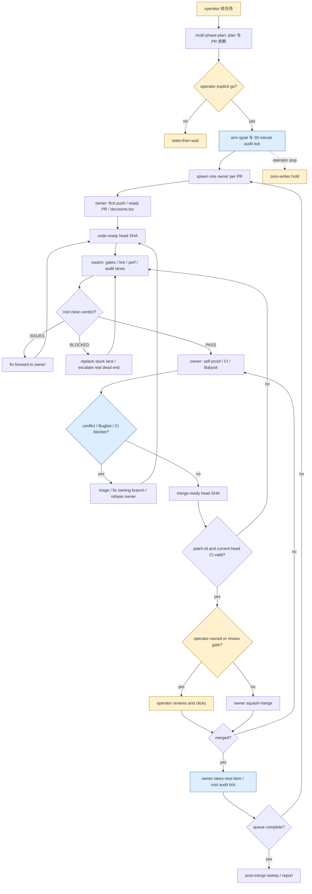

# P2-pstack-orchestration：pstack 多 agent 编排与无人值守执行

## 1. 在端到端中的位置

- `multi-phase-plan.md` 的 `### Multi-phase or multi-PR plan` 把目标、PR 依赖、每个 PR 的 unit/live/perf 证据和执行 playbook 交给 operator；只有 operator 明确 go 才进入执行。出处：`docs/research/code-landing-refs/pstack/skills/poteto-mode/playbooks/multi-phase-plan.md` 的 `### Multi-phase or multi-PR plan`。
- 大到超出单 agent 会话预算的项目由 standing coordinator 接管；单任务可由 `Autonomous run` 驱动到可检查的退出条件。出处：`docs/research/code-landing-refs/pstack/skills/poteto-mode/playbooks/orchestrate.md` 的 `### Orchestrate`、`#### Steps`；`docs/research/code-landing-refs/pstack/skills/poteto-mode/playbooks/autonomous-run.md` 的 `### Autonomous run`。
- 获得合并授权且 PR 相互独立时走 `Autopilot-full`，每个 owner 持有 build 到 merge；需 operator 审阅、工作有依赖或无合并授权时走 `Autopilot-stack`，交付线性 stack 而不合并。出处：`docs/research/code-landing-refs/pstack/skills/poteto-mode/playbooks/autopilot-stack.md` 的 `**Choosing between the autopilots.**`。
- PR 开启后由 `Babysit` 处理 Bugbot、CI 和 merge frontier，`Shipping` 才执行逐个合并；`Benny` 是另一条 Slack 报告入口，最多产出 draft PR，不进入上述自动合并授权。出处：`docs/research/code-landing-refs/pstack/skills/poteto-mode/playbooks/babysit.md` 的 `### Babysit`；`docs/research/code-landing-refs/pstack/skills/poteto-mode/playbooks/shipping.md` 的 `### Shipping`；`docs/research/code-landing-refs/pstack/automations/benny/FOR_AGENTS.md` 的 `### shared rules`。

## 2. 阶段表

| 序号 | 阶段名（原文） | 执行者 | 输入 | 产出物 | 门禁或退出条件 | 失败/回退/升级路径 | 出处 |
| --- | --- | --- | --- | --- | --- | --- | --- |
| 1 | Multi-phase or multi-PR plan | 主 agent、探索子 agent | operator 目标、代码库 | `docs/` 下计划文件，PR 顺序和证据盒 | `check-plan.mjs` 检查结构；operator 明确 go | 未解产品问题先 prototype；计划交付后停在 go | `docs/research/code-landing-refs/pstack/skills/poteto-mode/playbooks/multi-phase-plan.md` 的 `### Multi-phase or multi-PR plan`；`docs/research/code-landing-refs/pstack/skills/poteto-mode/scripts/check-plan.mjs` 的 `SUB_BLOCKS`、`PROGRAM_MARKERS` |
| 2 | Frame / Arm the program | coordinator / root、operator | 计划或大任务 | done predicate、tracks、`/goal`、合并权限 | 明确 go；单 agent 可完成则改走 `Autonomous run` | 争议拆分或单向决定先 arena；无 go 只陈述计划 | `docs/research/code-landing-refs/pstack/skills/poteto-mode/playbooks/orchestrate.md` 的 `#### Steps` 1；`docs/research/code-landing-refs/pstack/skills/poteto-mode/playbooks/autopilot-full.md` 的 1；`docs/research/code-landing-refs/pstack/skills/poteto-mode/playbooks/multi-phase-plan.md` 的 `### Arm the program` |
| 3 | Install the runtime / Pilot | coordinator、worker、verifier、脚本 `orch` | standing orders、首个 unit | `orchestrate/<project-slug>/`，`preferences.md`、`units.tsv`、`frontier.json`、首个 ledger verdict | 一个 unit 经 brief、工作、验证、stack、merge 走通；廉价同型单元可边 pilot 边扩展 | pilot 证伪 brief/验证法后修合同再扩展 | `docs/research/code-landing-refs/pstack/skills/poteto-mode/playbooks/orchestrate.md` 的 `#### Store layout`、`#### Steps` 2-3；`docs/research/code-landing-refs/pstack/skills/poteto-mode/scripts/orch/store.ts` 的 `openStore.init` |
| 4 | Spawn owners / Scale | coordinator / root、sub-coordinator、Cursor cloud worker | 每 unit 的 GOAL/SCOPE/ACCEPTANCE/VERIFY/TIMEBOX/REPORT/STANDING | 独占 branch/worktree、首推送、ready PR、`decisions.tsv`、`children.tsv` | 缺 brief 字段拒派；约 15 分钟首快照和 PR（autopilot） | 超时退回部分发现；stuck 替换；重叠工作串行 | `docs/research/code-landing-refs/pstack/skills/poteto-mode/playbooks/orchestrate.md` 的 `#### The brief`、`#### Steps` 4；`docs/research/code-landing-refs/pstack/skills/poteto-mode/playbooks/autopilot-full.md` 的 2-3 |
| 5 | Queue and drain / Audit on the wake chain | coordinator、`orch`、`/loop` | completion pointer、30 分钟 tick、frontier wake | `inbox/`、更新 `units.tsv`/`ledger.tsv`、`status.md` | 按 drain 点批量分类，再补下一波；autopilot 持续到无委派工作 | 失败按原因最多两次重派；无副作用超预期时长即替换；基础设施连续 abort 写交接并停 | `docs/research/code-landing-refs/pstack/skills/poteto-mode/playbooks/orchestrate.md` 的 `#### Queue and drain`、`#### Liveness and failure`；`docs/research/code-landing-refs/pstack/skills/poteto-mode/playbooks/autopilot-full.md` 的 6；`docs/research/code-landing-refs/pstack/skills/poteto-mode/scripts/orch/store.ts` 的 `openStore.inbox.drain` |
| 6 | Swarm-verify every round / Verification | root、不同模型 verifier、cloud swarm lanes | code-ready PR head SHA、计划验证盒 | `PASS`/`ISSUES`/`BLOCKED`、证据、`ledger.tsv` 或 root clean verdict | live real-surface 是最低门；所有必需 lanes PASS；verdict 对当前 patch 有效 | 所有已证实发现一次发 owner fix-forward；新 patch 开新 round；blocked 不计通过 | `docs/research/code-landing-refs/pstack/skills/poteto-mode/playbooks/autopilot-full.md` 的 4；`docs/research/code-landing-refs/pstack/skills/poteto-mode/playbooks/orchestrate.md` 的 `#### Verification`；`docs/research/code-landing-refs/pstack/skills/swarm/SKILL.md` 的 `## Phase C: Aggregate` |
| 7 | Opening a PR | owner / worker、forge | 已验证 commit、PR 文字 | Conventional Commit、ready PR、base-branch chain（若 stack） | `/deslop`、`/no-comments`、PR 以 open 非 draft 建立 | draft 改 ready；branch 污染则换 clean worktree | `docs/research/code-landing-refs/pstack/skills/poteto-mode/playbooks/opening-a-pr.md` 的 `### Opening a PR`、`**Readiness.**` |
| 8 | Babysit | owner 或每 stack 一个 babysitter、GitHub watcher / Origin | PR、当前 merge frontier | Bugbot thread 回复、CI 结果、GitHub `READY`/`WAITING`/`ADVANCE`/`COMPLETE` 等 | GitHub 单 PR `READY`；queued stack 无 blocker 时 `WAITING`/`merge-queue`；Origin 自身 merge-ready | conflict 报 owner/stacker；flake 只重建一次；真 Bugbot finding 用 red-first 证据在 owning PR 修；无合并授权止步 | `docs/research/code-landing-refs/pstack/skills/poteto-mode/playbooks/babysit.md` 的 1-9；`docs/research/code-landing-refs/pstack/skills/poteto-mode/scripts/watch-pr/policy.ts` 的 `classifyPr`、`evaluateQueue` |
| 9 | Shipping / Append on a clean verdict | `Autopilot-full` owner、`Autopilot-stack` root、operator 或 Shipping 主 agent | merge-ready PR、clean verdict、base/head SHA 与 patch-id | merged PR 或交 operator 的线性 stack | full 获授权时仅 owner 在 root verdict 后合并；stack 只 append；Shipping 仅从底部连续已验证段逐个落地 | patch 变化重验；CI/mergeability 重查；不满足则停在 ceiling | `docs/research/code-landing-refs/pstack/skills/poteto-mode/playbooks/autopilot-full.md` 的 5；`docs/research/code-landing-refs/pstack/skills/poteto-mode/playbooks/autopilot-stack.md` 的 5-8；`docs/research/code-landing-refs/pstack/skills/poteto-mode/playbooks/shipping.md` 的 1-9 |
| 10 | Close / Session pickup | coordinator / 接班 agent | store、PR、branch、transcript | 终态 unit 行、报告、恢复点 | 实物满足 predicate；每 landed PR 当前 head 有 verdict | 重启后按 branch/PR 接回 cloud 工作；旧记录与实物核对，未完成路由回 playbook | `docs/research/code-landing-refs/pstack/skills/poteto-mode/playbooks/orchestrate.md` 的 `#### Steps` 7、`#### Liveness and failure`；`docs/research/code-landing-refs/pstack/skills/poteto-mode/playbooks/session-pickup.md` 的 `### Session pickup` |

## 3. 流程图

以下画获合并授权的 `Autopilot-full` 一次完整运行；依赖或无合并授权的 `Autopilot-stack` 在最后一个判断改为交付 stack。出处：`docs/research/code-landing-refs/pstack/skills/poteto-mode/playbooks/autopilot-full.md` 的 1-7；`docs/research/code-landing-refs/pstack/skills/poteto-mode/playbooks/autopilot-stack.md` 的 4-8。

## 4. 角色、并发与隔离

- `Coordinator` 本地常驻、只负责 brief、队列和判断，不写代码；规模超过一个 drain 才加本地 `Sub-coordinator`，按 track 持有自己的 units，层级到 coordinator/track/worker，子协调员滚动窗口约十个。`Worker / verifier` 默认 Cursor `environment: "cloud"`，机器专有 UI、transcript、模拟器或认证才在 local；一 branch/worktree 仅一 writer，verifier 选不同 model family。出处：`docs/research/code-landing-refs/pstack/skills/poteto-mode/playbooks/orchestrate.md` 的 `#### Roles and placement`。
- `Autopilot-full` 按独立 PR 并行一个 Cursor cloud owner；每个 owner 可有子 agent，`children.tsv` 记录 ID、预期时长、状态。root 不持 PR，只负责 swarm verdict、countersign、约 30 分钟 audit；文件重叠才串行。`Autopilot-stack` 同样并行 build，但 root 是唯一 stack topology writer，owner 不能 merge/auto-merge/close。出处：`docs/research/code-landing-refs/pstack/skills/poteto-mode/playbooks/autopilot-full.md` 的 2-6；`docs/research/code-landing-refs/pstack/skills/poteto-mode/playbooks/autopilot-stack.md` 的 1-7。
- `swarm` 默认全部以一条消息启动 `generalPurpose` cloud worker，默认模型 `grok-4.7-xhigh-fast`，若 `~/.cursor/rules/pstack-models.mdc` 有 `swarm workers` 则覆盖；各 lane 独立输出，报告 `PASS`/`ISSUES`/`BLOCKED` 及 SHA、方法、证据。计划模板另明确十条 live lane 用该默认模型，但不是所有 verifier 都固定该模型。出处：`docs/research/code-landing-refs/pstack/skills/swarm/SKILL.md` 的 `## Phase A: Frame`、`## Phase B: Fan out`；`docs/research/code-landing-refs/pstack/skills/poteto-mode/playbooks/multi-phase-plan.md` 的 `**Verify, live.**`。
- `orchestrate` 的子 agent 仅经 Task tool spawn/resume/drain，CLI `orch` 只做状态记账。brief 带上游完整报告、验收、禁止项、时间盒和 `preferences.md` standing orders；兄弟不直接通信，向 coordinator 汇报。stack 每条链只许一个 stacker 操作 `gt`，每 stack 一个 babysitter。出处：`docs/research/code-landing-refs/pstack/skills/poteto-mode/playbooks/orchestrate.md` 的 `#### The brief`、`#### Stack safety`。
- `Benny` 的 coordinator 是唯一 Slack 发言者；分析子 agent 只读且不得获得 Slack 凭据或写权限，代码 worker 仅在工具隔离可证明时可写代码。它是独立自动化，不是 autopilot 的 owner。出处：`docs/research/code-landing-refs/pstack/automations/benny/skills/reproduce-and-fix-issues/SKILL.md` 的 `## Hard safety rules`、`## 12. Root-cause and implement`。

## 5. 状态与恢复

- `orchestrate/<project-slug>/` 的 `units.tsv` 存 unit/track/state/branch/PR/SHA/brief；`ledger.tsv` 存 PR+SHA verdict/evidence/verifier/time；`frontier.json` 存 generation、PR 顺序和最低未合并 PR；`inbox/` 存完成指针；`gates.md` 存 question/options/default/answer；`preferences.md` 存编号 standing orders；`status.md` 由表重算。出处：`docs/research/code-landing-refs/pstack/skills/poteto-mode/playbooks/orchestrate.md` 的 `#### Store layout`；`docs/research/code-landing-refs/pstack/skills/poteto-mode/scripts/orch/store.ts` 的 `Unit`、`LedgerEntry`、`Frontier`、`OpenGate`、`openStore.status.render`。
- `orch` 单写锁 `.orch.lock` 使用 PID；持有 PID 已死时下一次写入接管；文件以临时文件 rename 原子写。`inbox.drain` 将目录 rename 后新建，drain 时新抵达指针留待下一次。出处：`docs/research/code-landing-refs/pstack/skills/poteto-mode/scripts/orch/store.ts` 的 `acquireLock`、`atomicWrite`、`openStore.inbox.drain`。
- `frontier.set` 实现实际依赖 `gt log short --stack --reverse`、`gt info` 和本地 branch SHA；若 clone 的 gt metadata 没 PR，直接报错而不猜。**这只适合 `orchestrate` 的 Graphite stack，不能把它当作 `Autopilot-full/stack` 通用 frontier 来源**；后两者明确不要求 `gt`。出处：`docs/research/code-landing-refs/pstack/skills/poteto-mode/scripts/orch/store.ts` 的 `graphiteFrontier`、`resolveFrontier`、`openStore.frontier.set`；`docs/research/code-landing-refs/pstack/skills/poteto-mode/playbooks/autopilot-stack.md` 的 6。
- Cursor 重启后 local agent 已死而 cloud work 可能继续；重读 standing orders、`units.tsv`，重算 frontier，以 PR/branch 接回 cloud 工作，不凭 agent ID；按存档 brief 重派每 track sub-coordinator。`Session pickup` 从 active workspace 的 transcript、cloud URL 或 pushed branch 重建已完成/未完成，最后仍以实际 artifact 验证继承的说法。出处：`docs/research/code-landing-refs/pstack/skills/poteto-mode/playbooks/orchestrate.md` 的 `#### Liveness and failure`；`docs/research/code-landing-refs/pstack/skills/poteto-mode/playbooks/session-pickup.md` 的 `### Session pickup`。
- `Pause safely` 是显式暂停：完成或回退当前原子步骤、不启新工作、存 `wip:` commit、在外部文件写 resume note；“keep going/going to bed”不触发暂停。出处：`docs/research/code-landing-refs/pstack/skills/poteto-mode/playbooks/pause-safely.md` 的 `### Pause safely`。

## 6. 验证与质量门

- `check-plan.mjs` 以文本结构检查计划：固定 sub-block 顺序、十条 live lane 的 screenshot 与 pass predicate、perf 四盒、review gate、`/goal` 和 30 分钟 tick 等；**它不运行测试或证明内容真实**。出处：`docs/research/code-landing-refs/pstack/skills/poteto-mode/scripts/check-plan.mjs` 的 `SUB_BLOCKS`、`PROGRAM_MARKERS`、`for (const pr of prSections)`。
- `orchestrate` ledger verdict 为 `live-ui-verified`、`unit-test-verified`、`type-check-only`、`verifier-blocked`、`verifier-failed`；行为改变不能只用 type check，CI green 只是 verdict 输入。脚本 `ledger.check` 只按 PR+SHA 返回行，不判断该行是否 pass；因此图上通过与否须由 coordinator 解释，不能把命令退出 0 画成通过。出处：`docs/research/code-landing-refs/pstack/skills/poteto-mode/playbooks/orchestrate.md` 的 `#### Verification`；`docs/research/code-landing-refs/pstack/skills/poteto-mode/scripts/orch/store.ts` 的 `Verdict`、`openStore.ledger.check`。
- `Autopilot-full` 每次 patch-changing push 都发 gates、live、两条以上 diff audit 等独立 lanes；计划模板还规定十条 live lane 和双侧 perf。任一已证实缺陷都返 owner，root clean verdict 才能合并。`Shipping` 以当前 base-to-head `git patch-id` 校验旧 verdict，patch 变更重验；只在测试/文档/lint 配置变化时可用重复 build 判断噪声。出处：`docs/research/code-landing-refs/pstack/skills/poteto-mode/playbooks/autopilot-full.md` 的 4-5；`docs/research/code-landing-refs/pstack/skills/poteto-mode/playbooks/multi-phase-plan.md` 的 `**Verification.**`；`docs/research/code-landing-refs/pstack/skills/poteto-mode/playbooks/shipping.md` 的 1-3。
- GitHub watcher `watch-pr` 从 `gh` 读取 PR、review threads、checks 和 commit rollup；按 conflict → unresolved threads → failing checks → draft/changes requested → pending → ready 分类，输出 NDJSON 或四列表。`--queued-stack` 使用冻结的 bottom-to-top PR 列表，周期性扫全链并频繁看 frontier；`READY` 只在 simple 模式，queued 模式为 `WAITING`/`ADVANCE`/`COMPLETE`。脚本仅报告状态，不执行 merge。出处：`docs/research/code-landing-refs/pstack/skills/poteto-mode/scripts/watch-pr/github.ts` 的 `GhGitHubReader`；`docs/research/code-landing-refs/pstack/skills/poteto-mode/scripts/watch-pr/policy.ts` 的 `classifyPr`、`selectTierMajorStackDecision`、`runQueued`；`docs/research/code-landing-refs/pstack/skills/poteto-mode/scripts/watch-pr/cli.ts` 的 `parseArgs`、`main`。
- `Benny` 另设真实 UI 两次 baseline repro、媒体复核、现有 fix 的 baseline/patch 各两次、bounded fix 后 UI 两次及 blast-radius smoke；只在 before/after 证明后开 draft PR。出处：`docs/research/code-landing-refs/pstack/automations/benny/skills/reproduce-and-fix-issues/SKILL.md` 的 `## 7. Reproduce`、`## 11. Qualify a bounded fix`、`## 13. Prove the fix`、`## 14. Open a draft pull request`；`docs/research/code-landing-refs/pstack/automations/benny/skills/reproduce-and-fix-issues/references/verify-existing-fix.md` 的 `## Measure the baseline`、`## Measure the patched build`。

## 7. 人的介入点

- operator 决定是否从 plan 进入执行、哪些 PR 自己持有、是否授予合并权；`Autopilot-stack` 最终交 operator 审阅与落地。交互改变的 PR 在计划中用截图和视频等 operator review，停在 merge-ready。出处：`docs/research/code-landing-refs/pstack/skills/poteto-mode/playbooks/autopilot-full.md` 的 1、5；`docs/research/code-landing-refs/pstack/skills/poteto-mode/playbooks/autopilot-stack.md` 的 8；`docs/research/code-landing-refs/pstack/skills/poteto-mode/playbooks/multi-phase-plan.md` 的 `**Review gate.**`。
- `orchestrate` 只把不可逆动作、无法通过实验决定的产品偏好、standing order 与现实矛盾、重排后仍无路的死局写入 `gates.md` 等人；frontier 调整、restack、CI flake、review thread triage 不等人。`Babysit` 本身绝不授权合并，只有明确 merge/land/ship/merge when ready 才进入 `Shipping`。出处：`docs/research/code-landing-refs/pstack/skills/poteto-mode/playbooks/orchestrate.md` 的 `#### Escalation`；`docs/research/code-landing-refs/pstack/skills/poteto-mode/playbooks/babysit.md` 的 9。
- `Benny` 的 live automation 创建须 owner 明确要求且经 editor 审阅，启用前做 thread-safety test；运行时有人认领 fix 就停，只交 draft PR，不合并或 deploy。出处：`docs/research/code-landing-refs/pstack/automations/benny/skills/setup-benny/SKILL.md` 的 `## 7. Prepare the live automations`、`## 8. Test thread safety`；`docs/research/code-landing-refs/pstack/automations/benny/skills/reproduce-and-fix-issues/SKILL.md` 的 `## 3. Apply ownership and fix-artifact gates`、`## 14. Open a draft pull request`。
- `Worktree and simulator cleanup` 的 audit bucket 仅是建议；pinned/active chat 或 tracked WIP 需先核对/问人，再删除；clean、merged 且不使用中的 worktree 可以清理。出处：`docs/research/code-landing-refs/pstack/skills/poteto-mode/playbooks/worktree-cleanup.md` 的 `### Worktree and simulator cleanup`；`docs/research/code-landing-refs/pstack/skills/poteto-mode/scripts/worktree-audit.sh` 的 `case "$dirty"`。

## 8. 显著机制

1. `brief` 的 GOAL/SCOPE/CONTEXT/ACCEPTANCE/VERIFY/TIMEBOX/REPORT/STANDING 字段让无聊天上下文的 cloud worker 也能独立执行并按统一格式回报。出处：`docs/research/code-landing-refs/pstack/skills/poteto-mode/playbooks/orchestrate.md` 的 `#### The brief`。
2. `inbox` 把完成通知记成指针并在固定 drain 点批量处理，避免 coordinator 在关键段落中被逐条报告打断。出处：`docs/research/code-landing-refs/pstack/skills/poteto-mode/playbooks/orchestrate.md` 的 `#### Queue and drain`；`docs/research/code-landing-refs/pstack/skills/poteto-mode/scripts/orch/store.ts` 的 `openStore.inbox.push`、`openStore.inbox.drain`。
3. `ledger.tsv` 用 PR+head SHA 记录 verdict，防止 restack 后沿用旧验证；实际 `ledger.check` 仍需要上层判定 verdict 是否合格。出处：`docs/research/code-landing-refs/pstack/skills/poteto-mode/playbooks/orchestrate.md` 的 `#### Verification`；`docs/research/code-landing-refs/pstack/skills/poteto-mode/scripts/orch/store.ts` 的 `openStore.ledger.record`、`openStore.ledger.check`。
4. `Autopilot-full` 把独立 PR 分给全生命周期 owner 并行推进，root 只做 swarm clean verdict 与授权检查；`Autopilot-stack` 把拓扑写入集中给 root，避免并行 owner 同时重排 stack。出处：`docs/research/code-landing-refs/pstack/skills/poteto-mode/playbooks/autopilot-full.md` 的 2-5；`docs/research/code-landing-refs/pstack/skills/poteto-mode/playbooks/autopilot-stack.md` 的 5-7。
5. `watch-pr` 用 GitHub merge state、review threads 和 CI 构造 blocker 类别与事件 wake；`Babysit` 在 merge-ready 停，不把监视等同合并授权。出处：`docs/research/code-landing-refs/pstack/skills/poteto-mode/scripts/watch-pr/policy.ts` 的 `classifyPr`、`runQueued`；`docs/research/code-landing-refs/pstack/skills/poteto-mode/playbooks/babysit.md` 的 6、9。
6. root 的约 30 分钟 tick 只把 commit、push、PR/check 或 store report 变化算进展，超过预期时长却无副作用就替换 lane，避免过夜工作静默停滞。出处：`docs/research/code-landing-refs/pstack/skills/poteto-mode/playbooks/autopilot-full.md` 的 6；`docs/research/code-landing-refs/pstack/skills/poteto-mode/playbooks/autopilot-stack.md` 的 2。
7. `Benny` 用可信 triage marker 和固定 Slack source-thread 坐标串起两个 automation；已有 PR/commit 改走验证，缺真实复现不写 fix，最多开 draft PR。出处：`docs/research/code-landing-refs/pstack/automations/benny/skills/triage-issue-reports/SKILL.md` 的 `## 9. Post one verdict`；`docs/research/code-landing-refs/pstack/automations/benny/skills/reproduce-and-fix-issues/SKILL.md` 的 `## 1. Freeze source coordinates`、`## 2. Wait for the triage contract`、`## 3. Apply ownership and fix-artifact gates`。

## 9. 未读到或不确定

- 本次是静态只读调查，未运行 `orch`、`watch-pr`、Benny automation、测试或真实 PR 流；所述运行结果是代码与 playbook 规定，不是实测。出处范围：`docs/research/code-landing-refs/pstack/skills/poteto-mode/scripts/orch/`、`scripts/watch-pr/`、`automations/benny/`。
- `orchestrate` 的 `frontier.set` 仅从本地 `gt` 元数据计算，无法确认 Origin/GitHub PR 的 base-ref 在运行时与其一致，也未读到 `Autopilot-full/stack` 用 `orch` store 的规定；应在总图里把两类状态机制分开。出处：`docs/research/code-landing-refs/pstack/skills/poteto-mode/scripts/orch/store.ts` 的 `graphiteFrontier`、`resolveFrontier`；`docs/research/code-landing-refs/pstack/skills/poteto-mode/playbooks/autopilot-full.md` 的 2；`docs/research/code-landing-refs/pstack/skills/poteto-mode/playbooks/autopilot-stack.md` 的 6。
- `Benny` 的 live automation 配置、实际 model slug、tracker adapter、control adapter、真实运行并不在快照中；`configuration.example.yaml` 只有占位值。出处：`docs/research/code-landing-refs/pstack/automations/benny/templates/configuration.example.yaml` 的 `models`、`tracker`、`control`；`docs/research/code-landing-refs/pstack/automations/benny/README.md` 的 `## set it up`。
- `worktree-audit.sh` 虽称 read-only prune audit，但实现包含 `git fetch origin main`、`gh pr list` 和临时文件，故本次没有运行；脚本给出的 `safe` bucket 也不是删除许可。出处：`docs/research/code-landing-refs/pstack/skills/poteto-mode/scripts/worktree-audit.sh` 的开头注释、`git fetch origin main`、`case "$dirty"`；`docs/research/code-landing-refs/pstack/skills/poteto-mode/playbooks/worktree-cleanup.md` 的第 2-4 步。
- `bootstrap.ts` 在 `commander` 或 install key 缺失时自动执行 `bun install --frozen-lockfile` 并重启命令；本次未调用任何入口，因此未验证依赖可用性。出处：`docs/research/code-landing-refs/pstack/skills/poteto-mode/scripts/bootstrap.ts` 的 `ensureDependenciesInstalled`。
