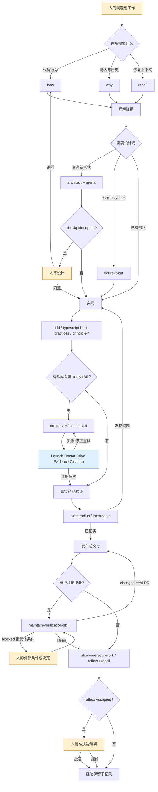

# P3-pstack-skills：pstack 非 poteto-mode 编排技能

下文出处中的 `skills/` 均指 `docs/research/code-landing-refs/pstack/skills/`；`agents/`、`.cursor-plugin/` 均指 `docs/research/code-landing-refs/pstack/` 下同名目录。引用格式为“文件路径，文件内标题或标识符”。这是一组按条件调用的技能，不是要求每次从头到尾执行的单一流水线（`skills/poteto-mode/SKILL.md`，`## Non-negotiables`；`docs/research/code-landing-refs/pstack/README.md`，`# pstack`）。

## 1. 在端到端中的位置

- 入口是人的问题或已给定的工作：`how`、`why`、`recall`、`teach` 处理理解；`architect`、`arena` 处理设计；`figure-it-out` 在无窄流程时先制定可审计流程。它们的输入分别是代码目标、历史证据、当前任务及约束（`skills/how/SKILL.md`，`# How`；`skills/why/SKILL.md`，`# Why`；`skills/recall/SKILL.md`，`# Recall`；`skills/architect/SKILL.md`，`# Architect`；`skills/figure-it-out/SKILL.md`，`# Figure it out`）。
- 设计出口交给实现者的是使用示例、类型草图、模块图与 rationale；实现阶段的 `tdd`、`typescript-best-practices`、`no-comments` 及按需 `principle-*` 约束代码或文案，不自成发布编排（`skills/architect/SKILL.md`，`## Outputs`；`skills/tdd/SKILL.md`，`# TDD Bug Fix`；`skills/typescript-best-practices/SKILL.md`，`# TypeScript best practices`；`skills/no-comments/SKILL.md`，`# No comments`）。
- 验证出口是实际运行的行为证据、风险结论或维护后的仓库专属 `.cursor/skills/verify-<app>/`；`interrogate` 只交出审查 verdict，不自动改代码（`skills/create-verification-skill/SKILL.md`，`## 4. Prove the generated skill before handing it over`；`skills/maintain-verification-skill/SKILL.md`，`## Outcomes`；`skills/interrogate/SKILL.md`，`# Interrogate`）。
- 发布后或恢复工作时，`show-me-your-work` 保存决策与证据，`reflect` 经人批准把经验路由到技能或机制，`recall` 从会话与共享记录重建当前状态；`automate-me` 则把个人工作方式写成 `-mode` 技能（`skills/show-me-your-work/SKILL.md`，`# Show me your work`；`skills/reflect/SKILL.md`，`## Process`；`skills/recall/SKILL.md`，`# Recall`；`skills/automate-me/SKILL.md`，`# Automate me`）。

## 2. 阶段表

“阶段”是本调查的放置位置，不表示所有技能必经；跨阶段技能列在首次起作用处，后文说明再次使用。`principle-*` 全部为独立的 `SKILL.md`，不应画成独立排队执行的 24 道门（`skills/poteto-mode/SKILL.md`，`## Principles`；`agents/poteto-agent.md`，`# Poteto subagent`）。

| 序号 | 阶段名（原文） | 执行者（人 / 主 agent / 子 agent（写明角色名）/ 脚本 / 外部服务） | 输入 | 产出物（文件、issue、PR、label、事件） | 门禁或退出条件 | 失败/回退/升级路径 | 出处 |
| --- | --- | --- | --- | --- | --- | --- | --- |
| 1 | 理解 | 人提出问题；主 agent；`how` 的 explorer / explainer、`why` 的 source investigator / synthesizer；`recall` 的 transcript miner；外部 MCP 证据源。技能：`how`、`why`、`recall`、`teach`、`blast-radius` 的前置调查、`bro`。 | 代码目标、问题、会话、git 史、可用 MCP。 | 代码运行模型、带置信度的动因报告、当前状态 brief、教学解释；`bro` 仅改写上一条答复。 | `how` 要读实现并标出断点；`why` 区分 Direct/Supported/Inferred/Unknown；`recall` 核对 live state。 | 证据缺口明列；`why` 无 MCP 则标 gap；`how` 探索遇断点不得猜；`recall` 目标已给完整状态则跳过挖掘。 | `skills/how/SKILL.md`，`## Step 1. Assess Complexity`、`## Output Format`；`skills/why/SKILL.md`，`## Step 3. Spawn Parallel Investigators (default posture)`、`## Output Format`；`skills/why/references/epistemics.md`，`## Confidence Tiers`；`skills/recall/SKILL.md`，`## Output contract`；`skills/teach/SKILL.md`，`# Teach`；`skills/blast-radius/SKILL.md`，`## Steps`；`skills/bro/SKILL.md`，`name: bro`。 |
| 2 | 设计 | 主 agent；`arena` candidate runners 与 readonly cross-judge；`architect` runners；必要时人决定产品方向。技能：`architect`、`arena`、`figure-it-out`、`create-verification-skill` 的验证准备；原则 `attack-the-premise`、`exhaust-the-design-space`、`experience-first`、`foundational-thinking`、`model-the-domain`、`boundary-discipline`、`type-system-discipline`、`redesign-from-first-principles`、`minimize-reader-load`、`laziness-protocol`、`subtract-before-you-add`、`separate-before-serializing-shared-state`。 | 理解结果、需求、真实调用者用法、验收谓词。 | 类型草图、签名、模块图、rationale、候选比较与 synthesis note、分阶段 playbook；验证技能的初始 `SKILL.md` 和 feature map。 | `architect` 至少两种结构不同的候选，过 `design-red-flags`；`arena` 读完每个候选并验证合成品；`figure-it-out` 先定可证伪 done。 | 候选大幅分歧则重新 frame；实现反复偏离草图则 scrap、重跑 `how` 与 `arena`；`architect` 仅在调用者要求 checkpoint 时等人签收。 | `skills/architect/SKILL.md`，`## Phase A: Ground the problem` 至 `## Outputs`；`skills/architect/references/design-red-flags.md`，`# Design red flags`；`skills/architect/references/rationale-template.md`，`## Usage (caller's view)`；`skills/arena/SKILL.md`，`## Phase A: Frame` 至 `## Outputs`；`skills/figure-it-out/SKILL.md`，`## Phase A: Frame`、`## Phase B: Design the workflow`；`skills/create-verification-skill/SKILL.md`，`## 1. Interview the repo, not the user` 至 `## 3. Seed the feature map`；`skills/poteto-mode/SKILL.md`，`## Principles`。 |
| 3 | 实现 | 主 agent / 实现者；`no-comments` 的 `Comment Sicko`；脚本或 codemod 为可重跑操作。技能：`tdd`、`typescript-best-practices`、`no-comments`、`automate-me` 的技能写入、`make-bot-ui` 的 UI/server/routine 建立；原则 `build-the-lever`、`fix-root-causes`、`make-operations-idempotent`、`migrate-callers-then-delete-legacy-apis`、`outcome-oriented-execution`、`sequence-verifiable-units`、`test-behavior-not-implementation`。 | 设计契约、bug 复现、测试路径、目标文件与仓库约定。 | 代码、先红后绿的 focused regression check、可重跑工具、`-mode` 技能；`make-bot-ui` 产生本机 UI/server 与 webhook routine。 | `tdd` 先证实失败原因再修；TypeScript 文件触发 `paths: ["**/*.ts", "**/*.tsx"]`；`no-comments` 接受范围内问题后修根因。 | 测试路径不实用则换最近的可执行检查；Comment Sicko 报告被拒可重跑一次，第二次仍不合格则 fail；`make-bot-ui` 的 routine confirm 和 sender key 必须等人。 | `skills/tdd/SKILL.md`，`## Workflow`、`## If a Failing Test Is Impractical`；`skills/typescript-best-practices/SKILL.md`，`paths`、`# TypeScript best practices`；`skills/no-comments/SKILL.md`，`## Steps`；`skills/automate-me/SKILL.md`，`### 4. Draft the skill`；`skills/make-bot-ui/SKILL.md`，`## Create the webhook routine`、`## Request the sender key`；`skills/principle-build-the-lever/SKILL.md`，`# Build the Lever`；`skills/principle-sequence-verifiable-units/SKILL.md`，`# Sequence work into verifiable units`；`skills/poteto-mode/SKILL.md`，`## Principles`。 |
| 4 | 验证 | 主 agent；`interrogate` 的 Reviewer A/B/C 与 lead reviewer；`maintain-verification-skill` 的每 feature 只读 source reader、唯一 live driver；验证脚本/浏览器/PTY/HTTP。技能：`create-verification-skill`、`maintain-verification-skill`、`interrogate`、`blast-radius`、`arena` 的 Phase F；原则 `prove-it-works`、`test-behavior-not-implementation`。 | 可运行产品、diff、验证技能与 feature map、设计 done 谓词。 | 操作与结果证据、side-effect 证据、`Act On/Consider/Noted/Dismissed` verdict、blast-radius 的安全事实/风险、维护结果 `clean/changed/blocked`。 | 生成技能必须 Launch→Doctor→Drive 一项→Evidence→Cleanup 且证据留存；维护要每 feature 源码覆盖和 live drive；不信自报。 | Doctor 因技能漂移失败则修后重试一次；不可达写明具体前提；产品坏了报告 product gap，不改产品代码；`interrogate` 不自动应用。 | `skills/create-verification-skill/SKILL.md`，`## 4. Prove the generated skill before handing it over`；`skills/maintain-verification-skill/SKILL.md`，`## Pass`、`## Outcomes`；`skills/interrogate/SKILL.md`，`## Step 3, Spawn Reviewers` 至 `## Output Format`；`skills/blast-radius/SKILL.md`，`## Don't trust your own writeup`、`## What to hand back`；`skills/arena/SKILL.md`，`## Phase F: Verify`；`skills/principle-prove-it-works/SKILL.md`，`# Prove It Works`。 |
| 5 | 发布 | 人决定不可逆/对外动作；主 agent 交付 PR 或结果；外部 GitHub、Grok Bot webhook、Tailscale（仅相应技能）。技能：`maintain-verification-skill` 的 `changed`、`automate-me` 的 land、`make-bot-ui` 的上线探测、`technical-writing`、`unslop`、`show-me-your-work` 的需提交审计轨迹。 | 已验证的更改、证据、PR 文案、用户凭据与确认（如需）。 | 一份更正 PR、个人 `-mode` 技能 PR、本机 UI URL、决策 TSV；`interrogate` verdict 本身不是 PR 门禁。 | `maintain` 仅 proven correction 可成一份 PR；`automate-me` 在 worktree commit/open PR，不直推 main；`make-bot-ui` 告知 live 前用无害 payload 探测。 | `maintain` clean/blocked 不开 PR；routine confirm、key、Tailscale 登录由人处理；webhook POST 失败落本地日志。 | `skills/maintain-verification-skill/SKILL.md`，`## Outcomes`、`## Pass`；`skills/automate-me/SKILL.md`，`### 6. Land it`；`skills/make-bot-ui/SKILL.md`，`## Host the page on this computer`、`## Put the page on the tailnet`；`skills/technical-writing/SKILL.md`，`## Voice and repo specifics`；`skills/unslop/SKILL.md`，`# Unslop`；`skills/show-me-your-work/SKILL.md`，`## Where it lives`。 |
| 6 | 反思/沉淀 | 人调用 `reflect` 并批准 Accepted 子集；主 agent；Judgment/Tooling/Divergent reviewers 与 synthesizer。技能：`reflect`、`recall`、`automate-me`、`show-me-your-work`；原则 `encode-lessons-in-structure`、`guard-the-context-window`、`never-block-on-the-human`。 | 当前 transcript、已交付结果、决策 TSV、人的纠正、共享记录。 | Accepted/Rejected/Backlog、批准后的技能编辑或 devex backlog、下次工作所用的状态 brief。 | `reflect` 在改技能前等人明确批准；结构性可强制规则移 Backlog；`show-me-your-work` 最后对照 transcript 审计。 | 无 transcript 则用 session digest；一次性问题不沉淀；`reflect` 的 Rejected 不改，Backlog 自动建项；`recall` 缺证据就标问题。 | `skills/reflect/SKILL.md`，`## Process`；`skills/reflect/references/synthesizer.md`，`## Accepted`、`## Rejected`、`## Backlog`；`skills/show-me-your-work/SKILL.md`，`## Audit the log against the transcript`；`skills/recall/SKILL.md`，`## Output contract`；`skills/automate-me/SKILL.md`，`## Flow`；`skills/principle-encode-lessons-in-structure/SKILL.md`，`# Encode Lessons in Structure`；`skills/poteto-mode/SKILL.md`，`## Principles`。 |

`principle-*` 的加载边界：插件 manifest 只注册整个 `skills/` 目录；每个 leaf 都有独立 frontmatter 且 `disable-model-invocation: true`。`poteto-mode` 的 `## Principles` 是按触发条件列出的索引，并要求“apply”前读相应 leaf；`poteto-agent` 同样要求导航到 leaf。`typescript-best-practices` 有 `paths` 自动匹配线索，不能据此推广到全部 principle。除 poteto-mode 外，`architect` 引用 `exhaust-the-design-space` 等，`arena` 引用 `separate-before-serializing-shared-state` 等，`figure-it-out` 引用 `prove-it-works` 等，`no-comments` 引用 `fix-root-causes` 等，`typescript-best-practices` 引用 `type-system-discipline`，`reflect` 引用 `encode-lessons-in-structure`；被引用不等于脚本自动执行（`.cursor-plugin/plugin.json`，`skills`；`skills/poteto-mode/SKILL.md`，`## Principles`；`agents/poteto-agent.md`，`# Poteto subagent`；各 leaf `disable-model-invocation`；`skills/architect/SKILL.md`，`## Phase B: Sketch`；`skills/arena/SKILL.md`，`## Phase A: Frame`；`skills/figure-it-out/SKILL.md`，`## Phase A: Frame`；`skills/no-comments/SKILL.md`，`## Steps`；`skills/typescript-best-practices/SKILL.md`，`# TypeScript best practices`；`skills/reflect/SKILL.md`，`### 4. Structural enforcement check`）。

## 3. 流程图

图是本块技能在端到端流程中的位置，不声称 pstack 每次调用都走全部节点。主干证据见第 2 节；分支分别由 `skills/architect/SKILL.md` 的 `## Phase C: Agree (opt-in)`、`skills/create-verification-skill/SKILL.md` 的 `## 4. Prove the generated skill before handing it over`、`skills/maintain-verification-skill/SKILL.md` 的 `## Outcomes` 和 `skills/reflect/SKILL.md` 的 `### 5. Apply` 给出。

## 4. 角色、并发与隔离

- `how` 简单问题用一名 readonly `generalPurpose` explainer；复杂问题先并发 2–4 名 explorer，再由一名 explainer 合成，默认模型分别为 `grok-4.7-xhigh-fast` 与 `claude-opus-5-5-max`（`skills/how/SKILL.md`，`## Step 1. Assess Complexity`、`## Step 2a. Explore (complex questions only)`、`## Step 3. Synthesize (complex questions only)`）。
- `why` 每个可用证据类别一名 `generalPurpose` investigator，同批并发，默认 `grok-4.7-xhigh-fast`，最后一名 synthesizer 默认 `claude-opus-5-5-max`；它们虽被告诫不写入，配置为 `readonly: false` 以保留 MCP 权限（`skills/why/SKILL.md`，`## Step 3. Spawn Parallel Investigators (default posture)`、`## Step 4. Synthesize`；`skills/why/references/investigator-prompt.md`，`## Your Assigned Source`）。
- `arena` 默认三个不同模型的候选各写独立 git worktree 或 `/tmp/arena-<slug>/candidate-<n>/`，候选完成后 readonly cross-judge 与主 agent 阅读并行；`architect` 默认同一三模型，要求至少两个结构不同候选（`skills/arena/SKILL.md`，`## Phase A: Frame` 至 `## Phase D: Pick a base`；`skills/architect/SKILL.md`，`## Phase B: Sketch`；`skills/architect/references/runner-prompt.md`，`# Architect runner prompt`）。
- `interrogate` 默认 Reviewer A/B/C 分别使用 `claude-opus-5-5-max`、`gpt-5.6-sol-max`、`grok-4.7-xhigh-fast`，均 readonly；主 agent 负责 lead judgment。`reflect` 并发 Judgment、Tooling、Divergent 三名 reviewer 后再启动一名 synthesizer；`maintain-verification-skill` 每 feature 一名 readonly source reader，但所有 live driving 归协调者串行执行（`skills/interrogate/SKILL.md`，`## Step 3, Spawn Reviewers`、`## Step 5, Lead Judgment`；`skills/reflect/SKILL.md`，`### 2. Spawn three reviewers in parallel`、`### 3. Synthesize`；`skills/maintain-verification-skill/SKILL.md`，`## Pass`）。
- `recall` 按会话片段并发快速模型子 agent，主线程只收摘要；`show-me-your-work` 结束前另请不同模型家族 reviewer 查决策轨迹；`no-comments` 使用 `Comment Sicko`，角色定义在 `agents/comment-sicko.md`，其报告由主 agent 再筛（`skills/recall/SKILL.md`，`# Recall` 第 3 步；`skills/show-me-your-work/SKILL.md`，`## Cross-model review of the trail`；`skills/no-comments/SKILL.md`，`## Steps`）。

## 5. 状态与恢复

- `architect` 把候选 sketch、rationale 与 synthesis decision 放在设计包；`arena` 留一个最终 artifact 和记录 base/grafts/rejections/dropouts/verification 的 synthesis note。两者没有本块所述的持久调度数据库（`skills/architect/SKILL.md`，`## Outputs`；`skills/architect/references/rationale-template.md`，`## Synthesis decision`；`skills/arena/SKILL.md`，`## Outputs`）。
- `figure-it-out` 用 todolist 加 `show-me-your-work` 的 TSV 作为分阶段检查点；TSV 默认 `decisions.tsv` 或 `.audit/<task-slug>.tsv`，append-only，包含 `ts/phase/decision/why/evidence/result`，大工作才提交；重启可按证据指针复查，但该技能未规定自动恢复脚本（`skills/figure-it-out/SKILL.md`，`## Start`、`## Phase D: Keep the audit trail`；`skills/show-me-your-work/SKILL.md`，`## The format`、`## Where it lives`、`## Rules`）。
- 仓库专属验证状态是 `.cursor/skills/verify-<app>/SKILL.md` 与 `features/README.md`、每 feature 文件；运行证据按生成技能的 Evidence 位置保存，Cleanup 不能删它；维护运行笔记只放 scratch，不提交（`skills/create-verification-skill/SKILL.md`，`## 2. Generate the skill` 至 `## 4. Prove the generated skill before handing it over`；`skills/maintain-verification-skill/SKILL.md`，`## Pass`；`skills/create-verification-skill/references/feature-map-example/README.md`，`## Proof and skip reporting`）。
- `recall` 从 workspace 范围的 Cursor `agent-transcripts` 与共享记录重建，再以 live git/PR/ticket 状态校验；`reflect` 无法定位 transcript 时传 session digest（`skills/recall/SKILL.md`，`# Recall` 第 2–5 步；`skills/reflect/SKILL.md`，`### 1. Locate the active transcript`）。

## 6. 验证与质量门

- `create-verification-skill` 先从仓库确认启动、驱动、观测和隔离，再给下一个 agent 写精确的 Launch/Doctor/Drive/Evidence/Cleanup；必须亲自跑一项映射功能，检查动作、结果、side effect 和 cleanup 后证据留存，否则只是 draft（`skills/create-verification-skill/SKILL.md`，`## 1. Interview the repo, not the user` 至 `## 4. Prove the generated skill before handing it over`；`skills/create-verification-skill/references/feature-map-example/README.md`，`## Feature entry contract`）。
- `maintain-verification-skill` 的 source wave 覆盖全部 feature 文件；协调者随后逐项 live drive。Doctor 在首次、意外后、每个新短会话前重查；漂移修一次后重试，harness 修复要重新 live drive；清理不丢证据；`clean/changed/blocked` 三选一（`skills/maintain-verification-skill/SKILL.md`，`## Outcomes`、`## Pass`）。
- `tdd` 要先看到目标失败再修至通过；不实用时接受针对性脚本、手工复现或浏览器检查，但不能把无法证明的 red 写成已证明。`principle-test-behavior-not-implementation` 要让测试从用户路径断言字面预期结果（`skills/tdd/SKILL.md`，`## Workflow`、`## Final Response`；`skills/principle-test-behavior-not-implementation/SKILL.md`，`# Test Behavior, Not Implementation`）。
- `blast-radius` 把“安全依赖的一个事实”尽量推进到运行真实代码或运行产品，并区分未证实与已排除风险；`interrogate` 三模型用同一 intent、rubric 和 code-quality lens，主 agent 将发现分 Act On/Consider/Noted/Dismissed，不自动修（`skills/blast-radius/SKILL.md`，`## How sure are you`、`## What to hand back`；`skills/interrogate/SKILL.md`，`## Step 3, Spawn Reviewers` 至 `## Output Format`；`skills/interrogate/references/rubric.md`，`# Review Rubric`；`skills/interrogate/references/lead-judgment.md`，`# Lead Judgment Framework`）。

## 7. 人的介入点

- `architect` 默认不等人；只有调用者明确要求 checkpoint 才在合成设计后等签收。`figure-it-out` 长时运行先展示 framing/tradeoffs；可逆工作继续推进。不可逆动作仍需人决定（`skills/architect/SKILL.md`，`## Phase C: Agree (opt-in)`；`skills/figure-it-out/SKILL.md`，`## Phase A: Frame`；`skills/principle-never-block-on-the-human/SKILL.md`，`# Never Block on the Human`）。
- `reflect` 在任何 Accepted 技能编辑前把完整 Accepted/Rejected/Backlog 给人并等明确批准；Backlog 自动进入 devex tracker。`automate-me` 就已有 `-mode` 是更新还是新建问人，草稿要给人迭代；`maintain-verification-skill` 若找到多个 verify skill 也问目标是哪一个（`skills/reflect/SKILL.md`，`### 5. Apply`；`skills/automate-me/SKILL.md`，`### 0. Check for an existing skill`、`### 5. Iterate on prose`；`skills/maintain-verification-skill/SKILL.md`，`## Pass` 第 0 步）。
- `make-bot-ui` 的 webhook routine 若有 confirm card 等人确认；sender key 用 secret-request，不收 chat 中的 key；Tailscale 首次登录由人完成。日常 POST 失败不要求人立即介入，记录本地日志（`skills/make-bot-ui/SKILL.md`，`## Create the webhook routine`、`## Request the sender key`、`## Put the page on the tailnet`、`## Host the page on this computer`）。

## 8. 显著机制

- `architect` 先用 `how`/必要时 `why` 建现状模型，再让 `arena` 产至少两种不同结构设计，以减少沿错误接口直接实现的风险（`skills/architect/SKILL.md`，`## Phase A: Ground the problem`、`## Phase B: Sketch`）。
- `why` 一类证据一名 investigator，缺失来源也进 coverage map；五级置信度阻止把代码行为写成历史动机（`skills/why/SKILL.md`，`## Step 3. Spawn Parallel Investigators (default posture)`；`skills/why/references/epistemics.md`，`## Confidence Tiers`）。
- `create-verification-skill` 产出项目内可复用的真实用户路径验证说明与 feature map，第一次只需驱动一项，但必须完成健康检查、证据和清理闭环（`skills/create-verification-skill/SKILL.md`，`## 2. Generate the skill` 至 `## 4. Prove the generated skill before handing it over`）。
- `maintain-verification-skill` 将“每个 feature 源码复核”与“所有 feature 实跑”结合，区分文档漂移、harness 缺口和产品回归，只有前两种进入其更正 PR（`skills/maintain-verification-skill/SKILL.md`，`## Pass` 第 2–6 步）。
- `arena` 候选隔离写入、跨模型判分、主 agent 全读并合成，避免并发改同一文件和只信单一候选（`skills/arena/SKILL.md`，`## Phase A: Frame` 至 `## Phase F: Verify`）。
- `show-me-your-work` 的单一 TSV 行记录决定、原因、证据指针和结果，末尾对 transcript 审计，供离开现场的人复查（`skills/show-me-your-work/SKILL.md`，`## The format`、`## Audit the log against the transcript`）。
- `reflect` 从当前 transcript 经三镜头审查与合成后将发现分 Accepted/Rejected/Backlog，再由人批准影响后续 agent 的技能改动；`recall` 则在下一次进入任务时从历史与 live state 提供状态 brief（`skills/reflect/SKILL.md`，`## Process`；`skills/recall/SKILL.md`，`## Output contract`）。
- `principle-*` 是按触发条件读取的 leaf 规则：`poteto-agent` 明令应用时读取全文，多个工作技能也显式引用；它们本身不是常驻自动执行的脚本（`agents/poteto-agent.md`，`# Poteto subagent`；`skills/poteto-mode/SKILL.md`，`## Principles`；`skills/principle-prove-it-works/SKILL.md`，`disable-model-invocation`）。

## 9. 未读到或不确定

- 指定名单中的 `grokbot` 在 `docs/research/code-landing-refs/pstack/skills/` 下没有目录或 `SKILL.md`；快照中读到的是 `skills/make-bot-ui/SKILL.md` 的 `# How to make a bot UI`，无法给 `grokbot` 定位阶段、角色或输出。
- 所有指定的现存技能 `SKILL.md` 和其 `references/` 已读；`why` 的 `references/sources/` 全部 playbook 也已读。但这次只读调查没有运行 Cursor，故无法实测 `disable-model-invocation: true` 和 `paths` 在该宿主的实际加载时机；上文区分的是快照文本的路由要求与 frontmatter 线索（`skills/typescript-best-practices/SKILL.md`，`paths`；`skills/poteto-mode/SKILL.md`，`## Principles`）。
- `make-bot-ui` 的 Grok Bot routine、secret-request 与 Tailscale 是技能描述的外部集成；本调查没有连接这些服务，不能确认实时可用性（`skills/make-bot-ui/SKILL.md`，`## Create the webhook routine` 至 `## Put the page on the tailnet`）。
- 这里未读取或执行被排除的 `swarm`、`setup-pstack` 的完整流程，也未审计 `poteto-mode` 的 playbooks/脚本；因此不能据本文件断言它们如何调用上述技能、建立 PR 门禁或恢复夜间任务。为确认 `principle-*` 的引用关系，仅读取了 `skills/poteto-mode/SKILL.md` 的 `## Non-negotiables`、`## Principles` 与其 agent wrapper `agents/poteto-agent.md`；发布细节留给其他调查块。
