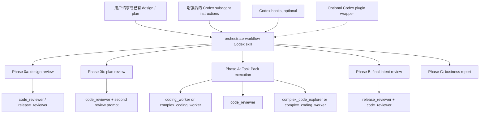
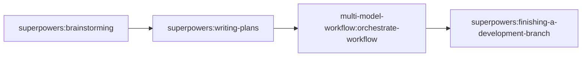

# multi-model-workflow 的 Codex 迁移设计

> **文档定位**：本文同时承担设计文档和落地计划文档的职责。前半部分保留迁移判断、能力边界和架构取舍；后半部分给出可以直接执行的文件级 implementation plan、验证命令和 AgentFlow 端到端验收标准。
>
> **For agentic workers:** REQUIRED SUB-SKILL: Use `superpowers:subagent-driven-development` or `superpowers:executing-plans` when implementing this document task-by-task. This document deliberately keeps design rationale and execution tasks in one file; implementation workers must preserve both, update checkboxes as they complete work, and use `superpowers:verification-before-completion` before claiming any stage is done.

## 落地状态（2026-05-15 修订）

V1 已按本文落地为 Codex-native workflow package：

- Codex agent instruction templates 已创建在 `codex/agents/*.toml`，稳定方法必须直接进入对应 agent TOML。`code_reviewer`、`coding_worker`、`complex_coding_worker`、`complex_code_explorer` 和 `release_reviewer` 不依赖每次 dispatch 再读取 external method reference。
- Codex workflow skill 已创建在 `.agents/skills/orchestrate-workflow/`，并通过 `codex/skills/install-orchestrate-workflow.sh --user --apply` 安装到用户层级 `/Users/cheuklapchan/.agents/skills/orchestrate-workflow/`。
- Optional hooks 已迁移到 `codex/hooks/`，并通过 `codex/hooks/install-hooks.sh --apply` 安装到用户层级 `/Users/cheuklapchan/.codex/hooks/multi-model-workflow/`；启用时使用 `[features].hooks = true`。
- AgentFlow full-lifecycle smoke 已完成，输出保存在 `/tmp/mmw-agentflow-smoke-v2.md`；该 smoke 只能证明 workflow 能做完整生命周期 dry-run，不能单独证明每个 subagent 已经掌握方法。subagent 方法掌握必须通过 `codex/smoke/method-pressure-scenarios.md` 里的 pressure scenarios 验证。
- `mattpocock/skills` 的吸收记录已移到 `codex/docs/method-adoption-reference.md`；运行时 skill 不携带外部方法 reference。

## 目的

本文定义如何把 `multi-model-workflow` 从 Claude Code plugin 迁移为 Codex-native workflow package。迁移目标不是逐文件复刻 Claude Code 的机制，而是保留这套系统的产品合同：

- main coordinator 负责 design review、plan repair、Task Pack 调度，以及需要面向用户做出的决策；
- 实现工作按 Task Pack 批量执行，而不是每个 agent 只做一个零散任务；
- design、plan、pack 和 final intent 四个层级都必须经过 review；
- 技术闭环应尽量自主关闭，只有需要业务判断时才回到用户；
- workflow 应保持可安装、可复用，并适合 AgentFlow 这类正式项目仓库。

## 设计出发点与最低要求

Codex 迁移后的版本至少要满足原 plugin 的四个设计出发点，并且应把这些出发点转成可测试的运行合同。

| 出发点 | Codex 迁移要求 |
| --- | --- |
| 正确模型、正确角色、正确工具边界 | 每个 Codex agent role 必须有明确的任务类型、模型强度、reasoning effort、工具使用边界和升级条件。简单查询和机械文档不占用高成本角色；高风险实现、release gate、复杂 root-cause 才使用更强模型。 |
| 与 Superpowers plugin 联动 | Codex 版不是替代整个 Superpowers，而是接管 Superpowers 与 AgentFlow 项目工作流不匹配的后半段：`brainstorming` 和 `writing-plans` 之后进入 `orchestrate-workflow`，并替代 `subagent-driven-development` 的执行与 review 部分。 |
| Coding Agent 自动化 | 用户不应在每个 phase 手动发命令。设计文档或计划文档出现后，orchestrator 能自动进入 Phase 0、分包、执行、review、修复和 final verification；只有业务承诺、用户体验范围或产品取舍变化时才回到用户。 |
| 更细致的多层 review | design、plan、Task Pack、final intent 都有独立 review 合同，并且要区分 spec compliance、project alignment、code quality、production risk 和 second opinion。Review 结果必须能路由到正确的修复角色。 |
| UI / UX mockup 同级落地 | 当任务包含网页 mockup、截图、HTML 原型或页面参考时，mockup 是 design / plan 同级 artifact。Phase 0、Plan Review、Task Pack、worker dispatch、Pack Review 和 Final Review 都必须覆盖 mockup path、viewport、关键 states、interaction、视觉证据和允许偏差。 |

这些不是背景说明，而是 V1 的最低验收约束。后续所有 workflow package、可选 plugin wrapper、hook port、agent instruction sync 都应服务这些约束。

## 当前 Claude 包结构

当前仓库在 `plugin/` 下提供一套 Claude Code plugin。

| 区域 | 当前文件 | 当前责任 |
| --- | --- | --- |
| Claude package metadata | `plugin/.claude-plugin/plugin.json`, `.claude-plugin/marketplace.json` | 把 `multi-model-workflow` 发布为 Claude plugin。 |
| 主 workflow skill | `plugin/skills/orchestrate-workflow/SKILL.md` | 从 design review 到 final report 负责整个 workflow。 |
| Prompt templates | `plugin/skills/orchestrate-workflow/*prompt.md` | 为 design、plan、pack 和 final review 提供专门的 review prompts。 |
| Claude subagents | `plugin/agents/pack-executor.md`, `workflow-auditor.md`, `root-cause-analyst.md` | 用 Claude tool permissions 定义实现、审计和 root-cause 角色。 |
| Hooks | `plugin/hooks/hooks.json`, `plugin/hooks/session-start.sh`, `plugin/scripts/guard-premature-push.sh` | 注入路由规则，阻止过早 push/merge/PR，并在 pack execution 之后提醒。 |

当前设计的方法论是成熟的，但实现表面强绑定 Claude：

- subagent 文件使用 Claude frontmatter 字段，例如 `tools`、`disallowedTools`、`skills`、`memory`、`maxTurns` 和 Claude model IDs；
- hook 命令依赖 `CLAUDE_PLUGIN_ROOT`；
- plan 和 final review templates 引用了 `codex:codex-rescue` 这个 Claude subagent type；
- project rules 要求 agent 读取 `CLAUDE.md`，而 Codex 使用 `AGENTS.md`，并结合 repository 和 user skill discovery。

## Codex 能力调查结论

Codex 迁移应使用当前 Codex primitives，而不是沿用更早那套轻量的 skill-only 方案。

| 能力 | 当前 Codex 事实 | 迁移含义 |
| --- | --- | --- |
| Skills | Codex skills 是可复用 workflow 的编写格式。一个 skill 是包含 `SKILL.md` 的文件夹，并可带 scripts、references、assets 和 `agents/openai.yaml`。 | 保留 `orchestrate-workflow` 作为 skill，但要按 Codex tool names、Codex project docs 和 Codex agent roles 重写说明。 |
| Plugins | Codex plugins 是可安装的分发单元，可包含 reusable skills、apps、MCP config 和 hooks。每个 plugin 使用 `.codex-plugin/plugin.json`。 | V1 不把 plugin wrapper 作为核心交付，因为本系统最关键的 subagent instruction templates 不能通过当前 plugin manifest 完整分发。Plugin 只作为后续 marketplace / hooks / MCP / app 分发层。 |
| Skill locations | Codex 会扫描 repo skills `.agents/skills` 和 user skills `$HOME/.agents/skills`。当 workflow 属于某个项目时，可用 repo skill 做 authoring 和运行入口。 | V1 的 authoring source 使用本仓库 `.agents/skills/orchestrate-workflow/`；正式日常使用通过 `codex/skills/install-orchestrate-workflow.sh --user --apply` 安装到 user skill。只有目标项目必须 vendor 自己的 workflow 时才使用 `--target-repo <repo>`。 |
| Plugin marketplaces | Codex 读取 repo marketplace `$REPO_ROOT/.agents/plugins/marketplace.json`、personal marketplace `~/.agents/plugins/marketplace.json`，也能识别 Claude-style marketplace files。已安装的 local plugins 从 Codex plugin cache 加载。 | 仓库可以保留 Claude marketplace 供 Claude 用户使用。Codex marketplace 不是 V1 必需项，只在需要安装式分发时新增。 |
| Hooks | Codex 支持通过 `hooks.json`、inline config、repo `.codex/`、user config 或 installed plugins 提供 lifecycle hooks。当前本机 CLI 提示 `[features].codex_hooks` 已 deprecated，应使用 `[features].hooks = true`。 | 只有在启用并测试 Codex hooks 后再迁移 hooks。Hook scripts 不能依赖 `CLAUDE_PLUGIN_ROOT`。 |
| Hook limits | Codex `PreToolUse` 是 guardrail，不会拦截 newer unified exec 机制下的每一条 shell 路径。 | premature-push guard 可以减少错误，但不能当成唯一执行门禁。orchestrator skill 在 merge/push 前仍必须检查 plan completion。 |
| Multi-agent | 本机已启用 Codex `multi_agent`。当前自定义 agent types 包括 `coding_worker`、`complex_coding_worker`、`code_reviewer`、`release_reviewer`、`code_explorer`、`complex_code_explorer` 和 `docs_worker`。 | 以这些角色作为第一版 Codex implementation target。V1 不创建重复的 Claude-shaped roles。 |
| Existing agent instructions | 当前 Codex agent configs 位于 `~/.codex/agents/*.toml`，其中的 `developer_instructions` 可以编辑。现有 role taxonomy 是有用的，但部分角色说明刻意保持很短。 | 把 Claude subagent 中成熟的工作方法迁移到现有 Codex role instructions。orchestrator skill 只传递 task-specific context，而不是每次重新教 agent 完整职责。 |
| Agent model config | 本机 `~/.codex/agents/*.toml` 已为不同 agent type 设置 `model`、`model_reasoning_effort` 和 `model_verbosity`。例如普通实现 worker 与 reviewer 可使用不同模型。 | 迁移必须保留“任务类型 → agent role → model profile”的路由表，用模型强度和 reasoning effort 平衡效率、费用与结果质量。 |
| Tool permissions | Claude agent frontmatter 支持 `tools` 和 `disallowedTools`。当前 Codex custom agent config 以 `developer_instructions` 和运行时工具环境为主，不能假设存在完全同构的 per-agent tool allowlist。 | V1 先用 role instruction、parent prompt ownership、read-only reviewer contract 和 smoke tests 约束工具使用；如果 Codex 后续暴露正式 per-agent tool schema，再把该 schema 加入 `codex/agents/*.toml` 模板。 |
| Custom agents | Codex config 支持 `agents.<name>.description` 和 `agents.<name>.config_file`，但公开的 plugin packaging docs 没有把 `agents/` 列为 plugin component。 | 这是 V1 不强行做 plugin 的主要原因。V1 提供 agent instruction templates 和 sync/install path，runtime route 使用现有 Codex agent types。 |

2026-05-15 的本机检查结果：

- `codex-cli 0.130.0`
- `plugins = stable true`
- `multi_agent = stable true`
- `tool_search = stable true`
- `hooks` 可用；当前 runtime 提示 deprecated config key 应从 `[features].codex_hooks` 迁到 `[features].hooks`
- 当前 user config 已启用官方 `superpowers@openai-curated` plugin

## 模型、工具边界与成本策略

原 Claude plugin 通过 agent frontmatter 同时表达模型、effort、tool permissions、skills 和 max turns。Codex 迁移不能机械复制这些字段，但必须保留同一个设计目的：让不同类型的任务进入不同强度、不同权限边界、不同成本的执行路径。

V1 的模型路由策略如下：

| 任务类型 | 默认 Codex agent type | 模型/成本策略 | 工具边界策略 |
| --- | --- | --- | --- |
| 小范围查代码、找调用链、找测试入口 | `code_explorer` | 使用较轻的 explorer profile，优先快、便宜、低上下文污染。 | 只回答问题，不改文件；prompt 明确 read-only。 |
| 多模块历史、迁移链路、架构关系调查 | `complex_code_explorer` | 使用更强 reasoning profile，因为错误结论会污染后续实现。 | 默认 read-only；输出 facts、inference、excluded paths 和 next owner。 |
| 普通代码实现、测试修复、局部重构 | `coding_worker` | 使用 coding worker profile，适合多数 Task Packs，在成本与实现能力之间取平衡。 | 只能改 parent 分配的 owned files / responsibilities，不得越界重构或 revert 他人修改。 |
| 跨模块、高风险实现、迁移、账务、权限、运行时 | `complex_coding_worker` | 使用更强模型和更高 reasoning effort，费用换正确性。 | 必须先读 formal docs / contracts / migrations；无法证明方案正确时返回 `BLOCKED`。 |
| 普通 code/spec review | `code_reviewer` | 使用强 review profile，避免低质量 review 把缺陷放进后续执行。 | 默认 read-only；发现问题只报告和路由，不编辑。 |
| 发布前、生产风险、数据/权限/账务/迁移 gate | `release_reviewer` | 使用最高风险 review profile；宁可多花成本，也不能漏 release blocker。 | 默认 read-only；关注 deploy order、rollback、compatibility 和 manual verification。 |
| 低风险文档归纳、机械整理 | `docs_worker` | 使用较轻 profile，避免让高成本实现/审核模型做机械整理。 | 只改授权文档范围；需要产品或架构判断时返回 `NEEDS_CONTEXT`。 |

Codex V1 的工具权限设计采用两层：

- 硬边界：使用 Codex 当前真实支持的 agent config 字段，即 `model`、`model_reasoning_effort`、`model_verbosity` 和 `developer_instructions`。不伪造 Claude 的 `tools` / `disallowedTools` schema。
- 软边界：在每个 agent instruction 和 orchestrator prompt 中重复 read-only、owned files、no unauthorized reverts、no direct publish、reviewer does not edit 等约束，并用 smoke tests 验证角色是否遵守。

未来如果 Codex custom agents 正式支持 per-agent tool allowlist，本设计应把该能力加入 `codex/agents/*.toml`，并把 `code_reviewer` / `release_reviewer` 设成明确 read-only，把 implementation workers 限制在需要的编辑与验证工具内。

## 目标产品形态

构建一个 Codex-native workflow package，核心分为三层；Codex plugin 只是可选第四层。



第一层是 subagent instruction foundation：

- 现有 Codex roles 保持 canonical：`coding_worker`、`complex_coding_worker`、`code_reviewer`、`release_reviewer`、`code_explorer`、`complex_code_explorer` 和 `docs_worker`；
- 位于 `~/.codex/agents/*.toml` 的 user-level instruction files 接收 Claude plugin 中稳定的角色方法；
- 本仓库应在 Codex-owned 路径中保留匹配模板，例如 `codex/agents/*.toml`，让 instruction set 可以版本化并同步到机器；
- V1 不创建名为 `pack-executor`、`workflow-auditor` 或 `root-cause-analyst` 的重复用户可见角色。

第二层是 workflow authoring layer：

- V1 直接编辑并运行 repo-local skill：`.agents/skills/orchestrate-workflow/`；
- `orchestrate-workflow` 运行时只保留 `SKILL.md`；
- 可选 `agents/openai.yaml`，用于设置 display metadata，或者在测试发现 accidental triggers 时关闭 implicit invocation。

第三层是 optional hook reinforcement：

- hooks 不是 V1 核心能力；
- 若需要本仓库级 hooks，优先使用 `.codex/hooks.json` 或 documented user hook install path；
- hooks 只强化自动路由和防误 publish，不能替代 orchestrator 的显式门禁。

第四层是 optional plugin distribution wrapper：

- 只有当 workflow package 已稳定，且需要 marketplace 安装、多仓库/多机器分发、或同时打包 hooks / MCP / apps 时，才新增 `codex-plugin/`；
- `codex-plugin/` 可以复制 `.agents/skills/orchestrate-workflow/` 作为 bundled skill，但不能替代 `codex/agents/*.toml` 的同步机制；
- 正常 V1 不创建 `.agents/plugins/marketplace.json`，避免让用户误以为安装 plugin 就已经安装了 subagent instructions。

迁移期间仓库应同时支持 Claude 和 Codex，但 Codex runtime entry 必须是单一可见的 `orchestrate-workflow` skill。正常使用时不要同时安装 repo-local skill、user-level copy 和 plugin-installed copy，因为重复的 skill names 会让 invocation 变得不明确。

如果后续新增 Codex plugin wrapper，Codex package root 不应放进现有 `plugin/` 目录。官方 Codex plugin 文档确认：如果 plugin root 中存在默认 `./hooks/hooks.json`，Codex 即使在 manifest 里省略 `hooks` 字段，也会尝试加载该 lifecycle config。当前 `plugin/hooks/hooks.json` 是 Claude hook schema，并含 `CLAUDE_PLUGIN_ROOT` 与 `SubagentStop`。因此可选 plugin wrapper 必须使用独立 `codex-plugin/` package root，避免 Codex 安装时误加载 Claude hooks。

## Superpowers 联动合同

Codex 版 `multi-model-workflow` 应作为 Superpowers 的 workflow adapter，而不是和 Superpowers 各自独立运行。它接管的是 Superpowers 原有流程中与 AgentFlow 项目工作方式不匹配的阶段。

标准链路：



职责边界：

| 阶段 | 保留 Superpowers | Codex multi-model-workflow 接管 |
| --- | --- | --- |
| 需求探索 | `superpowers:brainstorming` 负责梳理用户意图和方案方向。 | 不在 raw brainstorming 阶段抢跑。 |
| 设计与计划生成 | `superpowers:writing-plans` 负责产出 design / plan 初稿。 | design 或 plan 产出后立即进入 Phase 0 review，不等用户逐步发下一条命令。 |
| 代码落地 | 不使用 `superpowers:subagent-driven-development` 作为默认实现器。 | 使用 Task Pack batching、Codex subagent routing、pack review 和 root-cause routing 接管实现。 |
| 方法论复用 | TDD、systematic debugging、verification-before-completion、requesting/receiving-code-review 仍是角色方法来源。 | 把这些方法沉淀进 Codex agent `developer_instructions`，不依赖 Claude `Skill` tool 或 Claude frontmatter。 |
| 收尾发布 | `superpowers:finishing-a-development-branch` 仍负责 merge/PR/push 这类明确收尾流程。 | `orchestrate-workflow` 只完成实现、review、验证和业务报告；不自动 merge/push。 |

需要弥补的 Superpowers mismatch：

- 原 `subagent-driven-development` 更偏实现执行，不能覆盖 design review、plan review 和 final intent review；Codex 版必须覆盖完整 post-design workflow。
- AgentFlow 这类项目需要先按正式文档和项目规则验真，再执行代码；Codex 版 Phase 0 必须把 doc review 当成正式 gate。
- AgentFlow 的任务通常跨多个文件和测试入口；Codex 版应使用 Task Pack，而不是每个小 task 单独启动一个 subagent。
- 用户不应手动串联每个 Superpowers skill；Codex 版应在 trigger 和 SessionStart hook 可用时自动接上下一阶段。

## 外部 Engineering Skills 评估

2026-05-15 调研了 `mattpocock/skills` 的 `skills/engineering` 目录。该仓库提供的是一组小而可组合的 engineering skills，不是一个多 agent workflow orchestrator。它对本 workflow package 的主要价值是方法论补强，而不是提供可直接替换 `orchestrate-workflow` 的 runtime。

调研对象：

| Skill | 核心能力 | 对本 workflow package 的判断 |
| --- | --- | --- |
| `diagnose` | 硬问题 debugging loop：先构造 feedback loop，再 reproduce、hypothesise、instrument、fix、regression-test。 | 强烈值得吸收进 root-cause 路由和 `complex_code_explorer` / `complex_coding_worker` 指令。 |
| `tdd` | red-green-refactor，强调 vertical slice / tracer bullet，反对 horizontal slicing。 | 值得吸收进 `coding_worker` / `complex_coding_worker`。Task Pack 是调度单位，tracer bullet 是实现单位。 |
| `grill-with-docs` | 用 domain glossary 和 ADR 挑战计划，澄清术语并记录决策。 | 方法值得吸收进 Phase 0 review，但不应照搬 `CONTEXT.md` 体系。AgentFlow 应映射到 `PROJECT.md`、`ENGINEERING-RULES.md`、SPEC/ADR/GUIDE。 |
| `improve-codebase-architecture` | 发现 shallow modules，提出 deep module / interface / seam / adapter 改进。 | 值得作为 final review 后的 architecture observation，不应默认阻塞交付。 |
| `prototype` | 用 throwaway logic / UI prototype 验证 state model、数据形状或 UI 方向。 | 值得作为可选扩充 skill，只有 Phase 0 发现设计问题很难通过文档判断时触发。 |
| `zoom-out` | 要求 agent 提升抽象层级，解释模块和调用关系。 | 不需要单独纳入；应写进 `code_explorer` / `complex_code_explorer` 的行为。 |
| `to-issues` | 把 plan / PRD 切成 vertical slice issues，区分 HITL / AFK。 | 可吸收 agent brief / vertical slice 思路；暂不纳入 issue publishing workflow。 |
| `triage` | issue state machine、labels、ready-for-agent brief、out-of-scope knowledge base。 | 当前不纳入。它属于 issue tracker 管理系统，超出 post-design workflow 范围。 |
| `to-prd` | 从上下文生成 PRD 并发布到 issue tracker。 | 当前不纳入。会和现有 Superpowers `brainstorming` / `writing-plans` 及项目 SPEC 流程产生第二入口。 |
| `setup-matt-pocock-skills` | 初始化 issue tracker、triage labels 和 domain docs 配置。 | 当前不纳入。它假设 `CONTEXT.md` / `docs/agents/` 配置体系，和本项目已有规则层不完全一致。 |

### 应吸收进现有 Workflow Package 的方法

这些内容应作为优化进入现有 `orchestrate-workflow`、prompt templates 和 Codex subagent instructions，而不是新增用户可见入口：

- **Feedback loop first**：root-cause 任务在猜原因前必须先构造可运行反馈闭环。可用 failing test、HTTP script、CLI fixture、headless browser、trace replay、throwaway harness、property/fuzz loop、bisect harness、differential loop 或 HITL loop。没有反馈闭环时必须说明已尝试路径并返回 `BLOCKED` / `NEEDS_CONTEXT`。
- **Vertical-slice TDD**：Task Pack 是并行调度单位，但 worker 在 pack 内应按 tracer bullet 实现：一个行为、一条失败测试、最小实现、验证通过，再进入下一个行为。禁止把 RED 理解成“一次性写完所有测试”。
- **Domain language and decision alignment**：Phase 0 design / plan review 应检查术语、对象边界、系统责任、ADR/SPEC/GUIDE 约束。出现新概念时要明确写入正式文档；挑战既有 ADR 时必须标为架构决策，不得静默绕开。
- **Durable agent brief shape**：长期可交接的 issue / task brief 应描述 current behavior、desired behavior、key interfaces、acceptance criteria、out of scope，避免依赖易过期的 line number。Runtime Task Pack 可以带 owned files，但导出到 issue 时应转成 durable brief。
- **Architecture after-effect**：Phase B / Phase C 应轻量记录本次实现暴露出的 architecture friction，例如缺少正确 test seam、module 太 shallow、hidden coupling、mock 内部实现、final verification 只能靠手工。除非构成 release blocker，否则进入 follow-up，不阻塞当前交付。
- **Zoom-out as explorer behavior**：当主线程或 subagent 对代码区域缺少全局把握时，`code_explorer` / `complex_code_explorer` 应先给模块地图、调用关系、领域词汇和上游/下游影响，再进入局部判断。

### 精确整合合同

外部 engineering skills 不能只在文档中被“提到”。V1 必须把它们转成具体的 Codex role instructions、review prompt 条款、Task Pack planning 规则和 validation scan。

| 外部 skill | 应整合到哪里 | 具体整合内容 | 不整合的内容 |
| --- | --- | --- | --- |
| `diagnose` | `complex_code_explorer`、`complex_coding_worker`、root-cause routing prompt | 先构造 feedback loop；反馈闭环优先级为 failing test、HTTP script、CLI fixture、headless browser、trace replay、throwaway harness、property/fuzz、bisect、differential、HITL；复现用户描述的同一个问题；提出 3-5 个 falsifiable hypotheses；instrumentation 一次只改一个变量；debug logs 带唯一 `[DEBUG-...]` 前缀并在收尾 grep 清理；回归测试必须落在 correct seam；如果没有 correct seam，报告为 architecture finding；修复后重跑原始 loop。 | 不直接复制 `hitl-loop.template.sh` 到 V1，除非确实要支持 human-in-the-loop 调试脚本；如果复制，必须带 MIT notice。 |
| `tdd` | `coding_worker`、`complex_coding_worker`、pack execution prompt、pack review prompt | 测试验证 public behavior，不测 implementation details；禁止 horizontal slicing；一个 behavior 一条 tracer bullet：RED -> minimal GREEN -> next behavior；mock 只用于外部边界，默认不 mock 自己的模块；测试名和接口语言使用项目 domain vocabulary；Task Pack 是调度单位，tracer bullet 是 pack 内实现单位。 | 不照搬“每次都先向用户确认接口和测试优先级”的交互规则。AgentFlow workflow 中，用户确认应来自 design / plan / Phase 0；执行中只有业务决策变化才回到用户。 |
| `grill-with-docs` | Phase 0 design review、Phase 0 plan review、`agentflow-project-alignment.md` | 检查术语是否和项目正式语言一致；模糊词必须被替换为 canonical term；用具体业务场景挑战对象关系和边界；检查代码事实是否支持设计说法；ADR 只在 hard to reverse、surprising without context、real trade-off 三个条件都成立时建议新增。AgentFlow 映射为 `AGENTS.md`、`PROJECT.md`、`ENGINEERING-RULES.md`、SPEC/ADR/GUIDE，而不是 `CONTEXT.md`。 | 不创建 `CONTEXT.md`、`CONTEXT-MAP.md`、`docs/adr/` 这套平行真相源。AgentFlow 的术语和架构决策应进入现有正式文档体系。 |
| `improve-codebase-architecture` | Phase B final review、Phase C report、未来 architecture follow-up lane | 用 module / interface / implementation / depth / seam / adapter / leverage / locality 这组词描述架构摩擦；使用 deletion test 判断 shallow modules；architecture finding 输出 files、problem、solution、benefits；按 dependency category 判断 seam 是否真实；“one adapter = hypothetical seam, two adapters = real seam”；只有 release blocker 才阻塞当前交付，其余进入 follow-up。 | V1 不默认开启大型架构重构 lane；不在功能交付中强制并行 3+ interface design agents，除非用户明确进入 architecture follow-up。 |
| `prototype` | 未来可选 `.agents/skills/prototype-decision`、Phase 0 uncertainty route | prototype 必须先写清要回答的问题；logic prototype 用可运行 TUI / terminal app 驱动 state model，并把逻辑放在可迁移的纯 module 后面；UI prototype 默认挂在现有页面，用 `?variant=` 和 3 个结构差异明显的 variants；一条命令可运行；默认无持久化；每次 action / variant switch 展示相关 state；完成后 capture answer，并 delete or absorb。 | V1 不把 prototype 放进默认交付路径；不允许 prototype 直接晋升为 production code；不允许 real mutations 或生产持久化成为 prototype 默认行为。 |
| `zoom-out` | `code_explorer`、`complex_code_explorer`、coordinator 迷失方向时的自检 | explorer 先给模块地图、相关 callers、上游/下游、领域词汇和“这个区域怎么放进更大系统”的解释，再做局部判断。 | 不作为单独 skill 安装，避免多一个入口。 |
| `to-issues` | Task Pack planner、未来 issue-export lane | 吸收 vertical slice / tracer bullet issue 思路；Task Pack 分组时标注 AFK / HITL：AFK pack 可自动执行，HITL pack 代表需要产品/架构/人工验证决策；每个 pack 必须 demoable 或 independently verifiable；依赖关系必须显式。 | V1 不发布 GitHub issues，不引入 issue tracker labels，不把 workflow 改造成 issue management 系统。 |
| `triage` | 未来 issue-export lane、Task Pack / user-decision 边界 | 吸收 durable agent brief 结构：current behavior、desired behavior、key interfaces、acceptance criteria、out of scope。用于导出长期任务或 business decision brief 时避免 stale line numbers。 | 不引入 triage state machine、labels、AI triage disclaimer、`.out-of-scope/` knowledge base。 |
| `to-prd` | 仅作为未来 SPEC / issue-export 参考 | 可参考其 PRD 字段中 problem、solution、user stories、implementation decisions、testing decisions、out of scope 的信息形状，用于检查正式 design / plan 是否自足。 | 不把 PRD 发布到 issue tracker；不替代 Superpowers `brainstorming` / `writing-plans` 和 AgentFlow SPEC / ADR / GUIDE。 |
| `setup-matt-pocock-skills` | 不进入 runtime；只影响参考文档设计 | 它说明外部 skills 依赖 issue tracker、triage labels 和 domain docs 配置。V1 应在 `external-engineering-methods.md` 中说明这些假设如何映射到 AgentFlow：不使用 `docs/agents/`，不使用 `CONTEXT.md`，不要求 triage labels。 | 不运行该 setup skill，不创建 `docs/agents/issue-tracker.md`、`docs/agents/triage-labels.md`、`docs/agents/domain.md`。 |

### 文档和实现文件的落点

V1 实现时，外部 skill 方法应落到这些文件中：

| 本项目文件 | 必须吸收的外部 skill 内容 |
| --- | --- |
| `codex/agents/coding-worker.toml` | `tdd` 的 public behavior tests、vertical tracer bullet、no horizontal slicing、boundary-only mocks；`to-issues` 的 AFK slice awareness。 |
| `codex/agents/complex-coding-worker.toml` | `coding_worker` 的所有 TDD 规则，加 `diagnose` 的 correct seam regression test、debug instrumentation cleanup、高风险 root-cause repair。 |
| `codex/agents/complex-code-explorer.toml` | `diagnose` 的 feedback loop / hypotheses / evidence discipline；`zoom-out` 的 module map；`improve-codebase-architecture` 的 facts vs architecture friction。 |
| `codex/agents/code-reviewer.toml` | `grill-with-docs` 的 terminology / scenario challenge；`tdd` 的 behavior-test review；`to-issues` 的 vertical slice completeness。 |
| `codex/agents/release-reviewer.toml` | `improve-codebase-architecture` 的 release-risk filtering；只把 data loss、permissions、billing、rollback、migration、production dependency 作为 blockers。 |
| `.agents/skills/orchestrate-workflow/SKILL.md` | Superpowers 联动、Task Pack batching、AFK/HITL pack classification、root-cause routing、prototype-decision optional route、Phase B architecture after-effect。 |
| `codex/docs/method-adoption-reference.md` | 外部方法吸收记录、deferred skills 原因、MIT 来源边界。 |

### 可选扩充：`prototype-decision`

唯一适合在后续版本中作为新增 skill 纳入本 workflow package 的候选是 `prototype` 思路，但应改造成符合本 workflow 的 `prototype-decision`。

触发条件：

- Phase 0 review 发现 design 里的状态机、数据形状、复杂 UI、关键用户流无法只靠文档确认；
- 用户明确要求“先试一下”“做一个可玩的原型”“看看几种方案”；
- coordinator 判断直接实现生产代码会放大返工风险。

能力边界：

- logic prototype：用小型 terminal app / TUI 驱动 state model，展示每次 action 后的完整 state；
- UI prototype：在现有页面或最接近的页面上挂 `?variant=` 多方案切换，默认 3 个结构差异明显的 variants；
- prototype 必须明确标记为 throwaway，不接生产持久化，不作为最终实现直接发布；
- prototype 回答完问题后，结果应被吸收到 design / plan / implementation decision，prototype shell 删除或明确归档。

纳入方式：

- V1 不把它放进默认 `orchestrate-workflow` 路径；
- Stage 5 之后评估是否新增 `.agents/skills/prototype-decision/SKILL.md`；如果后续存在 plugin wrapper，再同步进 `codex-plugin/skills/`。
- `orchestrate-workflow` 只在 Phase 0 确认设计不确定性时调用它；
- README 必须说明该 skill 是决策辅助，不是交付路径。

### 暂缓纳入的外部 Skills

以下能力有价值，但不应进入当前 V1：

- `triage`、`to-issues`、`to-prd` 属于 issue tracker / product management 系统。如果现在纳入，会把本 workflow package 从 post-design workflow orchestrator 扩张成第二套项目管理工具。
- `setup-matt-pocock-skills` 会引入 `CONTEXT.md`、`docs/agents/`、triage labels 等平行配置。AgentFlow 类项目已有 `AGENTS.md`、`PROJECT.md`、`ENGINEERING-RULES.md`、SPEC/ADR/GUIDE 体系，迁移时应做概念映射，不应直接引入第二套配置真相源。
- `grill-with-docs` 和 `tdd` 不应作为重复 skill 安装进 package。它们的方法应进入 Phase 0 prompts 和 worker instructions，避免和 Superpowers 现有 `brainstorming` / `writing-plans` / `test-driven-development` 出现重复入口。

### 许可证与来源边界

`mattpocock/skills` 使用 MIT License。可以参考、修改和分发，但如果后续复制较多原文、模板或脚本，必须在 workflow package 文档或相应文件中保留 copyright / license notice。当前设计建议优先吸收方法和结构，不直接复制整段原文或完整 skill。

## 功能映射

| Claude concept | Codex V1 mapping | 说明 |
| --- | --- | --- |
| `multi-model-workflow:orchestrate-workflow` skill | Repo-local Codex skill `.agents/skills/orchestrate-workflow` | 为 Codex 重写 trigger description。保留相同 phase model。后续可选 plugin wrapper 只复制这一 skill 作为分发入口。 |
| `Agent tool` new subagent | 使用所选 `agent_type` 调用 `spawn_agent` | main coordinator 只在任务独立、且不是 immediate blocker 时 spawn。 |
| `SendMessage` to same agent | 对返回的 agent id 调用 `send_input` | 只用于同一个 pack 的 review repair，且 context continuity 重要的情况。 |
| `pack-executor` | 默认 `coding_worker`；跨模块或高风险 packs 用 `complex_coding_worker` | Prompt 提供 pack-executor contract、TDD expectations 和 changed file ownership。 |
| `workflow-auditor` | `code_reviewer`；final 或 production-risk reviews 用 `release_reviewer` | Prompt 提供 read-only audit contract。Codex role config 负责 reviewer behavior。 |
| `root-cause-analyst` | 诊断用 `complex_code_explorer`，修复用 `complex_coding_worker`；如果诊断和修复紧密耦合，则直接用一个 `complex_coding_worker` | 保留 unknown-root-cause investigation 和 known review fixes 的区别。 |
| `codex:codex-rescue` second opinion | 使用独立 prompt 和不读取第一次 review 输出的第二次 `code_reviewer` 或 `release_reviewer` 调用 | 不能假设 Codex 存在 Claude-side `codex:codex-rescue` agent type。second-opinion 的价值来自独立 framing。 |
| Claude `CLAUDE.md` project loading | Codex `AGENTS.md`，并在存在时结合 `PROJECT.md` / `ENGINEERING-RULES.md` | Prompts 应写“read the active project instructions”，并点名 `AGENTS.md`，不能只写 `CLAUDE.md`。 |
| Claude hook `SessionStart` routing injection | Codex `SessionStart` hook 或更强的 skill trigger text | 因为本机当前禁用了 hooks，所以 skill description 必须在没有 hooks 时也足够清楚。 |
| Claude hook `PreToolUse/Bash` premature push guard | Codex `PreToolUse` hook 加 orchestrator self-check | Hook 有帮助，但不是完整 enforcement。 |
| Claude hook `SubagentStop` reminder | V1 不要求 hook | sequence reminder 应放在 orchestrator skill 内。后续可评估 Stop/PostToolUse hook 是否有用。 |

## Subagent 指令迁移

最关键的迁移不是 plugin packaging，而是用 Claude plugin 中成熟的角色合同补强现有 Codex subagent instructions。

Codex 已经有合适的角色分类。当前缺口是部分 `developer_instructions` 太薄，如果每次都靠 parent prompt 携带大量说明，行为很难稳定复现 Claude plugin 的效果。稳定的角色行为应进入 Codex agent config。orchestrator skill 之后只负责传入每次运行的上下文：phase、pack text、design/plan paths、owned files、review findings 和 verification commands。

### 原则：保留 Codex Roles，迁入 Claude Methods

V1 不创建名为 `pack-executor`、`workflow-auditor` 或 `root-cause-analyst` 的新角色。这些名字是有价值的迁移来源，但如果直接变成 Codex runtime roles，会和 Codex 现有 role taxonomy 重复。canonical runtime mapping 如下：

| Claude method source | Codex instruction target | 需要迁入的稳定行为 |
| --- | --- | --- |
| `pack-executor` | `coding_worker` | Task Pack execution、已知 review finding 的修复、TDD discipline、three-strike failure protocol、status codes、file ownership、禁止 unauthorized reverts。 |
| `pack-executor` | `complex_coding_worker` | 同样的 implementation contract，再加跨模块、migration、billing、auth、runtime、contract 和 release-risk judgment。 |
| `workflow-auditor` | `code_reviewer` | Read-only review stance、confidence filtering、基于证据的 findings、先审 spec compliance 再审 code quality、routing recommendations、禁止 style-only blockers。 |
| `workflow-auditor` | `release_reviewer` | Phase B 和 release-gate review，覆盖 production、data、permission、billing、migration、compatibility、deployment order、rollback 和 manual verification risk。 |
| `root-cause-analyst` | `complex_code_explorer` | Unknown-root-cause investigation、reproducible evidence、falsifiable hypotheses、excluded paths、禁止 file edits。 |
| `root-cause-analyst` | `complex_coding_worker` | 当 diagnosis 和 repair 紧密耦合时进入 root-cause fix mode，并带 systematic debugging 和 explicit stop conditions。 |

Claude-only frontmatter fields 不是迁移合同的一部分：

- 不把 Claude `tools` 或 `disallowedTools` fields 复制进 Codex instructions；
- 不复制 Claude model ids；
- 不把 Claude `memory`、`maxTurns` 或 `skills` fields 当成 Codex 支持的同构 schema；
- 不依赖 Claude `Skill` tool invocation model。

### `coding_worker` 指令补充

`coding_worker` instructions 应补充普通 Task Pack execution contract：

- worker 可能收到的是 Task Pack，而不是整项 feature；
- worker 只拥有 parent 明确分配的 files 和 responsibilities；
- worker 不得 revert 或 overwrite 其他 agents 或用户的 edits；
- 每项任务在可行时使用 TDD：先写出或定位 failing test，再实现最小 passing change，最后运行 focused verification；
- 对 known review findings 不盲从，必须先验证 finding 是否成立；
- valid finding 优先修 Critical issues，再修 Important issues；
- invalid finding 要返回证据，而不是做防御式修改；
- 连续三次失败后，每次都必须改变方法，然后返回 `BLOCKED`，并记录三次 attempts；
- worker 只返回一个 status：`DONE`、`DONE_WITH_CONCERNS`、`NEEDS_CONTEXT` 或 `BLOCKED`；
- final report 包含 changed files、tests run、results、deviations 和 residual risk。

### `complex_coding_worker` 指令补充

`complex_coding_worker` instructions 应继承 `coding_worker` contract，并增加高风险行为：

- 编辑前读取相关 formal docs、contracts、migrations、tests 和 current code；
- 当任务涉及 architecture-sensitive 内容时，先说明理解到的 boundary、dependencies 和 risk；
- database migrations、billing、auth、permissions、runtime、gateway behavior、browser takeover、cross-service contracts 和 release gates 默认视为高风险；
- 如果 design 或 plan 在技术上不成立，返回 `BLOCKED`，不要打 temporary patch；
- final report 中包含 compatibility impact、migration/deploy notes、rollback concerns 和 manual verification gaps。

### `code_reviewer` 指令补充

`code_reviewer` instructions 应迁入 `workflow-auditor` discipline：

- 默认 read-only review，除非 parent 明确要求修复；
- 审查实际 code、docs、tests 和 command output，不信任 implementer reports；
- findings first，按 severity 排序；
- 每条 finding 必须包含 severity、confidence、file/line 或最小 locator、evidence、why it matters 和 concrete remediation；
- confidence 低于 80 的问题不得成为 blocking finding，除非是 security issue；
- 如果提供了 plan 或 pack，先审 spec compliance，再看 code quality；
- 不把 style preferences、pre-existing unrelated debt 或 linter-discoverable noise 作为 workflow blockers；
- 必要时提供 routing guidance：`needs coding_worker`、`needs complex_coding_worker`、`needs complex_code_explorer` 或 `needs user decision`；
- 如果没有 blocking findings，要明确说明 remaining test gaps 和 residual risk。

### `release_reviewer` 指令补充

`release_reviewer` instructions 应成为 final workflow audit 和 production gate 的 Codex 等价物：

- 用于 Phase B、large diffs、database migrations、billing、permissions、runtime、deployment、rollback 和 cross-service contracts；
- 按 design intent 验证 implementation，不只看 changed lines；
- 检查 migration order、deploy order、compatibility、rollback path、operational docs 和 manual validation steps；
- data loss、permission bypass、billing inconsistency、irreversible migration、broken rollback 和 unverified production dependency 都是 release blockers；
- 即使没有 blockers，也要列出 local proof 之外仍需 manual 或 online verification 的事项。

### `complex_code_explorer` 指令补充

`complex_code_explorer` instructions 应吸收 `root-cause-analyst` 中的调查部分：

- 默认只调查，不编辑文件；
- 遵循 Reproduce -> Investigate -> Evidence -> Conclusion；
- 每个 hypothesis 必须 falsifiable，并且不能重复前一个 hypothesis；
- 连续三个 hypothesis 无证据支持后，停止扩大搜索，报告 excluded paths；
- 分清 facts 和 inference；
- 返回 likely fix owner 和 minimal next step，例如高风险修复交给 `complex_coding_worker`，局部修复交给 `coding_worker`。

### 可选 `docs_worker` 补充

只有当 parent 明确委派低风险机械文档编辑时，`docs_worker` 才吸收 Phase 0 document-repair support role：

- 保留 formal decisions 和 scope；
- 只在授权文档范围内修复 placeholders、contradictions、stale paths 和 unclear acceptance criteria；
- 需要 product 或 architecture decision 时返回 `NEEDS_CONTEXT`。

### Source of Truth 和同步

这些增强指令的 durable source of truth 应在本仓库版本化，然后同步到用户的 Codex config。

推荐 source layout：

```text
multi-model-workflow/
  codex/
    agents/
      coding-worker.toml
      complex-coding-worker.toml
      code-reviewer.toml
      release-reviewer.toml
      complex-code-explorer.toml
      docs-worker.toml
    sync-agents.sh
```

sync script 应做到：

- 只复制 Codex-owned agent templates 到 `~/.codex/agents/`；
- 不碰 unrelated local custom agents；
- 除非用户明确要求，否则保留当前 `~/.codex/config.toml` 中的 role names；
- 验证每个被引用的 `config_file` 都存在；
- 可行时运行一个小的 `codex exec` 或等价 fresh-process discovery check。

## Codex Workflow Package 结构

V1 不强行做 Codex plugin。核心 package 应由 repo-local skill、agent templates、sync scripts 和 validation 组成。这样能直接覆盖真正影响 workflow 成败的能力：skill routing 和 subagent instructions。

```text
multi-model-workflow/
  .agents/
    skills/
      orchestrate-workflow/
        SKILL.md
  codex/
    docs/
      method-adoption-reference.md
  plugin/
    .claude-plugin/
      plugin.json
    skills/
      orchestrate-workflow/
        SKILL.md
    hooks/
      hooks.json
      session-start.sh
    scripts/
      guard-premature-push.sh
  codex/
    agents/
      coding-worker.toml
      complex-coding-worker.toml
      code-reviewer.toml
      release-reviewer.toml
      complex-code-explorer.toml
      docs-worker.toml
      validate-agents.py
    sync-agents.sh
```

如果后续需要 Codex plugin wrapper，单独新增 `codex-plugin/`，并从 `.agents/skills/orchestrate-workflow/` 同步 skill 内容：

```text
multi-model-workflow/
  codex-plugin/                    # optional, not V1 core
    .codex-plugin/
      plugin.json
    skills/
      orchestrate-workflow/
        SKILL.md
        references/
    hooks/                         # optional; only after hook port passes
      hooks.json
      session-start.sh
    scripts/
      guard-premature-push.sh
  .agents/
    plugins/
      marketplace.json             # optional marketplace entry
```

Optional `codex-plugin/.codex-plugin/plugin.json` 应只在 Stage 5 之后创建，示例：

```json
{
  "name": "multi-model-workflow",
  "version": "0.7.0",
  "description": "Optional Codex plugin wrapper for the multi-model workflow package.",
  "skills": "./skills/",
  "interface": {
    "displayName": "Multi Model Workflow",
    "shortDescription": "Task Pack execution and review orchestration for Codex.",
    "developerName": "Cheuk Lap Chan",
    "category": "Productivity",
    "capabilities": ["Read", "Write"]
  }
}
```

初始 optional plugin build 必须省略 `hooks`，并且 `codex-plugin/` 下面不得存在 `hooks/hooks.json`。直到 hook scripts 完成迁移并通过测试后，才允许创建 `codex-plugin/hooks/hooks.json` 并在 manifest 中加入 `"hooks": "./hooks/hooks.json"`。如果 manifest 保留 `hooks`，安装说明必须写明需要启用 `[features].hooks = true`。

## Orchestrator Skill 合同

Codex `orchestrate-workflow` skill 应保留 phase model，但要改写执行说明。

### Trigger Contract

skill 应在这些场景触发：

- `docs/superpowers/specs/` 下已经存在或刚产出 design document；
- `docs/superpowers/plans/` 下已经存在或刚产出 plan；
- 用户要求 execute、review、audit、continue、advance 或 complete 某个 design/plan；
- workflow run 在 compaction 或 interruption 后 resume。

这些场景不应触发：

- design 尚未存在前的 raw brainstorming；
- 从零写第一版 design 或 plan；
- 单次很小的 code edit，完整 workflow 明显重于任务本身；
- 用户只想要 findings 的简单 code review。

### Main Session Responsibilities

main session 负责：

- 定位 design 和 plan；
- 在 Phase 0 修补 design 和 plan documents；
- 选择 Task Pack boundaries；
- 判断 packs 是否真正独立；
- 只在 subagent work 可以并行，或 context isolation 有实际帮助时 spawn subagents；
- 整合 subagent results；
- 更新 plan checkboxes；
- 运行 final verification；
- 用业务语言与用户沟通。

这一点对 Codex 很重要，因为 subagents 默认不会继承全部 context，除非明确 fork 或在 prompt 中提供。coordinator 每次都必须传入相关 documents、task text、constraints 和 acceptance criteria。

### Agent Routing Contract

| 工作项 | Codex agent type | Prompt obligations |
| --- | --- | --- |
| 普通 implementation pack | `coding_worker` | 只拥有列出的 files/tasks。可行时使用 TDD。不 revert 其他修改。报告 changed files 和 tests。 |
| 跨模块或高风险 pack | `complex_coding_worker` | 同上，并说明 migration、auth、billing、runtime 或 contract risks。 |
| Design 和 plan audit | `code_reviewer` | findings first。验证 paths 和 claims。不编辑。 |
| Final release 或 production-risk audit | `release_reviewer` | 聚焦 data、compatibility、migrations、deploy order、rollback 和 manual verification。 |
| 小范围代码查询 | `code_explorer` | 回答一个具体、有限的问题。 |
| Unknown root-cause investigation | 如果 diagnosis 可分离，先用 `complex_code_explorer`；如果 diagnosis 和 fix 紧密耦合，用 `complex_coding_worker` | 使用 systematic debugging。返回 evidence、excluded hypotheses 和 fix path。 |

当前 Claude agent markdown files 不应直接复制为 Codex agent configs。它们应被提炼出稳定角色行为，重写进 Codex `developer_instructions`，再由 orchestrator 通过普通 Codex agent routing 引用。

## Hook 设计

Hooks 应被视为 reinforcement layer，而不是 workflow 的核心。

### SessionStart

Codex 支持 `SessionStart` hooks，并且 plain stdout 可以增加 developer context。当前 `session-start.sh` 可以按概念迁移，但必须：

- 移除 `CLAUDE_PLUGIN_ROOT`；
- 输出 Codex wording；
- 说明 `orchestrate-workflow` 负责 post-design workflow；
- 保持 non-blocking，并以 `0` 退出。

因为本机今天禁用了 hook support，同样的 routing rules 也必须存在于 skill description。

### Premature Push Guard

当前 `guard-premature-push.sh` 可以迁移成 Codex `PreToolUse` hook。它应解析 `tool_input.command`，检查最新 active plan，并在仍有 unchecked tasks 时阻止 `git push`、`git merge` 和 `gh pr create`。

这个 guard 还必须承认 Codex 限制：

- `PreToolUse` 不会拦截所有 shell route；
- command guard 不能替代 final verification；
- orchestrator 在 final report 之前，以及调用任何 finish 或 publish workflow 之前，必须显式检查 unchecked tasks。

### SubagentStop

Codex 公开 hook docs 没有列出 `SubagentStop`。V1 不迁移这个 hook。sequence reminder 应属于 orchestrator skill。

## 自动化边界与循环控制

Codex 版的自动化目标是减少用户在技术阶段反复发命令，而不是让 agent 绕过业务判断或发布门禁。

自动推进规则：

- design doc 已存在或刚产出时，直接进入 Phase 0a；
- plan 已存在或刚产出时，直接进入 Phase 0b 或后续对应 phase；
- Phase 0 review 发现技术性文档问题时，main session 直接修复并复审；
- Task Pack implementation、pack review、review-fix、root-cause investigation 和 final intent verification 都由 orchestrator 自动调度；
- 只有当问题会改变产品承诺、用户体验范围、业务规则、发布策略或用户可见取舍时，才暂停询问用户。

循环上限从原 Claude plugin 迁移为 Codex 运行合同：

| 循环 | 上限 | 超限后的处理 |
| --- | --- | --- |
| Phase 0a design review -> main session 修复 | 2 轮 | 用业务语言说明哪个设计点无法确认，并要求产品决策。 |
| Phase 0b plan review -> main session 修复 | 2 轮 | 用业务语言说明哪个计划点无法确认，并要求产品决策。 |
| Phase A pack review -> worker 修复 | 每个 pack 3 轮 | 报告具体功能点和三轮修复记录，再决定拆 pack、改设计、或交给 root-cause route。 |
| Phase B intent gap -> worker 修复 | 每个 gap 2 轮 | 报告哪个设计承诺没有闭合，区分实现缺陷和设计缺陷。 |
| Phase B 总调度 | 15 次 | 汇报当前完成度、剩余风险和需要用户决定的事项。 |

这些上限不是降低质量，而是防止 agent 在错误假设里无限循环。每次超限都必须输出已经验证过的事实、失败路径和下一步决策点。

## Workflow 设计

### Phase 0a: Design Review

如果 design doc 已存在，coordinator 读取它，并派出两个独立 review：

- 使用 `code_reviewer` 做 content and logic review；
- 当涉及 architecture、billing、permissions、migrations 或 deployment 时，使用 `code_reviewer` 或 `release_reviewer` 做 project alignment and feasibility review。

coordinator 直接修复文档问题。只有需要改变产品承诺这类 business decision 时才问用户。

### Phase 0b: Plan Review

coordinator 读取 plan，并派出：

- coverage and task quality review；
- compliance and reference verification review；
- 使用独立 prompt 做 second-opinion review。

旧的 `codex:codex-rescue` template 改为 `plan-review-second-opinion-prompt.md`。它不应再提 Claude agent types。

### Setup: Task Pack Planning

coordinator 按以下维度把未勾选 plan tasks 分组为 packs：

- shared files；
- dependency order；
- section boundaries；
- risk level；
- expected test scope。

独立 packs 可以并行。触碰同一批 files、migrations、auth、billing、runtime 或 shared contracts 的 packs 应串行，除非边界已经被证明清楚。

### Phase A: Task Pack Execution

每个 pack：

1. 使用完整 task text、owned files、acceptance criteria、project rules，以及不得 revert others' changes 的指令，spawn `coding_worker` 或 `complex_coding_worker`；
2. 只有当下一条 critical path 依赖该结果时才 wait；
3. 用 `code_reviewer` review 已完成的 pack；
4. 当 context continuity 重要时，把 review fixes 发回同一个 agent id；
5. 只有在问题尚未 localized 时才使用 root-cause routing。

### Phase B: Final Intent Verification

所有 packs 通过后：

- end to end 验证 design intent，而不只是 individual task completion；
- 运行相关 tests 和 commands；
- 如果 diff 触碰 deploy、database、permissions、billing、runtime 或 cross-service contracts，使用 `release_reviewer` 做最终 production risk review；
- 使用独立 second-opinion `code_reviewer` prompt 检查 implementation risks。

### Phase C: Business Report

报告内容包括：

- 当前已完成的 product capability；
- review loops 中修复了什么；
- 运行了哪些 validation；
- 仍未解决、或需要 manual/product decision 的事项。

不要自动 merge 或 auto-push。finishing 仍是另一个显式 workflow。

## AgentFlow 端到端模拟检查

本 workflow package 是否真的能帮助 AgentFlow 完成一次完整开发、维护或优化任务，不能只看它有没有 `skill`、`agent templates` 和 prompts。必须按真实 AgentFlow 任务从入口到收尾推演：用户提出目标，Superpowers 产出或补齐 design/plan，`orchestrate-workflow` 做 Phase 0 review，Task Pack 分派给合适 Codex roles，pack review 和 root-cause route 自动修复，最后用 AgentFlow 真实测试入口和业务语言收尾。

### 入口分类

| 用户任务类型 | 进入 workflow 前的入口 | `orchestrate-workflow` 接管点 | 不应发生的行为 |
| --- | --- | --- | --- |
| 新功能或较大体验改造 | `superpowers:brainstorming` 梳理产品目标，`superpowers:writing-plans` 产出 design / plan。 | design 或 plan 已存在后，立即进入 Phase 0a / Phase 0b。 | 不让用户手动串每一阶段；不跳过 Phase 0 文档验真直接派 worker。 |
| 已有 design / plan 的继续实施 | 直接定位现有 `docs/superpowers/specs/` 和 `docs/superpowers/plans/`。 | 从 plan 当前勾选状态进入 Phase 0b、Phase A 或 resume 对应阶段。 | 不重新发明计划；不因为 compaction / interruption 重头开始。 |
| 维护 bug / 线上或本地故障 | `superpowers:systematic-debugging` 或 `diagnose` 方法先形成反馈闭环和最小 bug brief；如果影响跨模块、账务、权限、迁移或 runtime，再补正式 plan。 | 有 reproduction、hypotheses、acceptance criteria 和验证命令后进入 root-cause route 或 Task Pack execution。 | 不在没有反馈闭环时猜修复；不把用户描述当成已验证根因。 |
| 优化 / 架构债 / 代码质量专项 | 若范围小，按普通任务处理；若影响模块边界、接口或测试 seam，先形成短 design / plan 或 architecture follow-up brief。 | Phase 0 挑战目标、边界和非目标；Phase B / Phase C 记录 architecture after-effect。 | 不把非 release blocker 的架构观察塞进当前交付；不把优化任务无边界扩大成重构项目。 |
| 极小的一次性修改 | 主线程直接完成，按项目规则跑相关验证。 | 不触发完整 workflow。 | 不为了流程而派子代理、写 plan 或启动高成本 reviewer。 |

这个入口分类解决一个关键边界：`orchestrate-workflow` 本身仍然是 post-design workflow adapter，不替代 raw brainstorming / from-scratch planning；但整套迁移系统端到端工作时，必须能通过 Superpowers 和 diagnosis lane 把 feature、maintenance、optimization 三类任务都接进同一套 execution / review / verification 后半段。

### 模拟一：Compass Rules 页面改造

真实 AgentFlow 例子可用 `docs/superpowers/plans/2026-05-10-compass-rules-redesign.md`。该计划是典型 UI + backend endpoint + tests 的产品体验任务。

端到端推演：

1. Coordinator 读取 `AGENTS.md`、`PROJECT.md`、`ENGINEERING-RULES.md`，再读取目标 plan 和关联 mockup / source anchors。mockup 与 design / plan 同级处理，不作为可选灵感图。
2. Phase 0b 派 `code_reviewer` 做 coverage / compliance / second-opinion review，重点核：mockup 是否存在、目标 viewport / 页面 states / interaction 是否明确、endpoint 是否真实、Pydantic contract 是否需要 `schema_version`、HTMX / Jinja / permission state 是否符合 AgentFlow Console 规则。
3. Task Pack 分组不能按“测试、前端、后端”横切，而应按可独立验证的 vertical slices，例如：
   - backend contract + rename endpoint + endpoint tests；
   - sidebar / detail view markup + DOM contract tests + mockup screenshot 对齐；
   - drawer JS state flow + source-copy / active preset / permission tests + mockup interaction 对齐；
   - final browser / VM visual verification，覆盖 mockup 的关键 viewport 和状态。
4. 普通 packs 用 `coding_worker`；若触碰 `src/shared/contracts`、Local Agent runtime 或权限状态，则 prompt 中要求先读对应 `AGENTS.override.md`，并由 `code_reviewer` 复核合同与测试。
5. Pack review 发现 bug 时优先发回同一个 worker 修复；如果 drawer / HTMX 行为无法从测试定位，进入 `complex_code_explorer` 的 feedback-loop-first 调查。
6. Phase B 用真实证据验收：focused pytest、mockup path check、DOM key scan、browser screenshot、responsive viewport check、必要时 VM / browser 页面验证。
7. Phase C 给项目负责人报告用户可见变化、管理/非管理路径、已跑测试和仍需人工点看的 UI 状态。

结论：该场景可端到端跑通。文档中的 Task Pack、vertical-slice TDD、AgentFlow project alignment、pack review 和 final intent review 能覆盖这个任务。需要特别守住的是不要把 UI 工作横向切成“先全写模板、再全写 JS、最后补测试”，否则会违背迁入的 `tdd` / `to-issues` 方法。

### 模拟二：视频审核 Phase Worker 事务边界 bug

真实 AgentFlow 例子可用 `docs/superpowers/specs/2026-05-08-phase-worker-transaction-boundary-design.md` 与 `docs/superpowers/plans/2026-05-08-phase-worker-transaction-boundary.md`。这是维护类高风险任务，涉及本地 SQLite、runtime worker、reclaim、settlement outbox、release-gate。

端到端推演：

1. Coordinator 先读取 AgentFlow 必读三件套和 `src/local_agent/AGENTS.override.md`、`tests/AGENTS.override.md`、`scripts/testing/AGENTS.override.md`。
2. Phase 0a / 0b 必须使用 `release_reviewer` 或强 `code_reviewer`，因为任务触碰 runtime、并发、账务 outbox、release-gate 和本地用户可见稳定性。
3. 如果现场仍未复现，root-cause route 先由 `complex_code_explorer` 建 feedback loop：failing load test、日志片段、SQLite lock reproduction、hypotheses、excluded paths；不能直接进入修复。
4. Task Pack 不能盲目并行，因为多个 tasks 共享 `src/local_agent/video_review_worker.py` 和同一状态机。正确调度是按依赖串行或半串行：
   - baseline failing test / load harness；
   - claim token 和短事务主链；
   - stale phase reclaim 与失败传播；
   - pool config / observability；
   - projection isolation；
   - release-gate 和 settlement idempotency。
5. 实现默认用 `complex_coding_worker`，因为这里需要 formal docs first、no temporary patch、compatibility/deploy/rollback notes。
6. Pack review 用 `code_reviewer` 检查 stale-write、double-settle、double-finalize、test helper 是否镜像真实约束；final review 用 `release_reviewer` 检查 migration/deploy/order/manual validation。
7. Phase B 不能只看单测，要用计划里的 load / integration / release-gate 命令加 AgentFlow VM 测试 SOP 判断“用户点视频审核后能看到进度并且不锁库”。

结论：该场景可以被文档里的高风险路由覆盖，但要求 Stage 7 smoke 显式验证“串行 pack / 高风险 reviewer / root-cause feedback loop / release-gate evidence”这条链。只做 Phase 0 planning dry-run 不足以证明维护类任务真的端到端成立。

### 模拟三：架构优化或工作流优化

优化类任务通常没有立即可见的产品按钮，但会影响 AgentFlow 长期维护成本，例如“某个模块太浅、测试 seam 不对、plan 里反复出现虚构 fixture”。这类任务应按外部 `improve-codebase-architecture` 和 `grill-with-docs` 的方法被吸收到 review 与 follow-up，而不是默认变成大型重构。

端到端推演：

1. Phase 0 先判断优化目标属于 bug 修复、开发体验、架构边界还是文档/计划质量。
2. 若优化会改变模块责任或正式规则，必须先写短 design / plan，并映射到 `PROJECT.md`、`ENGINEERING-RULES.md`、相关 `AGENTS.override.md`。
3. Explorer 先 zoom out：模块地图、caller/callee、上游/下游、domain vocabulary、facts vs inference。
4. Worker 只拿一个清楚的 vertical slice；reviewer 用 deletion test、seam、adapter、locality 判断优化是否真实降低复杂度。
5. Phase C 把非阻塞 architecture friction 写成 follow-up，不让它吞掉当前交付。

结论：文档已经具备优化类任务的方法来源，但 Stage 2 prompts 必须把 “architecture finding 输出 files / problem / solution / benefits，并区分 release blocker vs follow-up” 写成硬要求，否则优化建议容易停在抽象评论。

### 本轮模拟发现的文档缺口

端到端链路总体成立，但实现文档需要补强三点：

1. **Stage 7 smoke 不能只做 Phase 0 dry-run**：Phase 0 能证明 reviewer 能读文档，但不能证明 Task Pack execution、review repair、root-cause route 和 final intent review 能串起来。Stage 7 应改成 full-lifecycle dry-run，不编辑代码，但输出完整调度、pack 串并行策略、review/fix loop 和验证计划。
2. **AgentFlow sample path 不能硬编码不存在文件**：smoke prompt 必须先用 `rg --files` 从真实 `docs/superpowers/specs/` 和 `docs/superpowers/plans/` 中选择现有 design / plan，或使用文档中明确存在的示例。不能写一个当前仓库不存在的 `2026-05-15-agentflow-codex-skill-migration-design.md`。
3. **维护 bug 的无 plan 入口需要写清楚**：完整系统可以通过 `systematic-debugging` / `diagnose` 先形成 feedback loop 和 bug brief，再进入 `orchestrate-workflow`；否则“维护任务”会被误解成必须先有人手写完整 design / plan。

## 迁移计划

### Stage 1: Codex Subagent Instruction Foundation

创建版本化的 Codex agent templates，同时保留当前 active role names：

- 为每个 `codex/agents/*.toml` 明确写入 `model`、`model_reasoning_effort`、`model_verbosity` 和 `developer_instructions`；
- 按“轻量查询 / 普通实现 / 高风险实现 / 普通 review / release review / 机械文档”分别设定模型强度和 routing policy；
- 基于当前 `coding_worker` config，加上 Task Pack 和 review-fix contract，写出 `codex/agents/coding-worker.toml`；
- 基于当前 `complex_coding_worker` config，加上高风险 implementation rules，写出 `codex/agents/complex-coding-worker.toml`；
- 基于当前 `code_reviewer` config，加上 workflow-auditor review discipline，写出 `codex/agents/code-reviewer.toml`；
- 基于当前 `release_reviewer` config，加上 final intent 和 production-gate review rules，写出 `codex/agents/release-reviewer.toml`；
- 基于当前 `complex_code_explorer` config，加上 unknown-root-cause investigation rules，写出 `codex/agents/complex-code-explorer.toml`；
- 可选写出 `codex/agents/docs-worker.toml`，支持低风险 Phase 0 document repair；
- 把外部 engineering skills 中值得吸收的方法写入对应 agent instructions：feedback-loop-first diagnosis、vertical-slice TDD、zoom-out map、architecture after-effect；
- 增加 sync script，更新 `~/.codex/agents/*.toml`，但不触碰 unrelated user agents。

Validation：

- 检查 `~/.codex/config.toml`，确认每个 configured `agents.<name>.config_file` 都指向存在的文件；
- 检查每个 agent template 的 model profile 是否符合模型/成本策略；
- 对 `coding_worker`、`code_reviewer` 和 `complex_code_explorer` 运行 minimal subagent spawn smoke test；
- 确认返回行为符合新的 status、review、tool-boundary 和 investigation contracts。

### Stage 2: Codex Skill Authoring Surface

创建 repo-local Codex-compatible skill，同时保留 Claude package：

- 按 Codex tool 和 agent names 重写 `SKILL.md`；
- 写清楚 Superpowers 联动链路：`brainstorming` / `writing-plans` 之后由 `orchestrate-workflow` 接管，替代 `subagent-driven-development` 的执行与 review；
- 写清楚外部 engineering skills 的采用边界：吸收方法，不直接安装整套 `mattpocock/skills`；
- 把 prompt templates 移到 `references/`，或者清楚更新路径；
- 重命名 Codex second-opinion prompts，避免引用 `codex:codex-rescue`；
- 把所有 project-doc wording 从只写 `CLAUDE.md` 改成 `AGENTS.md`，并在存在时结合 linked project docs；
- 在 Phase 0 prompts 中加入 domain language、ADR/SPEC/GUIDE alignment 和 durable agent brief 检查；
- 如果行为已经沉淀到 Codex agent instructions，就从 orchestrator 中移除完整重复的 subagent job descriptions；
- 写入 Codex 版循环上限和自动推进边界，避免每个 phase 都需要用户命令；
- 只有需要 display metadata 或 implicit-invocation policy 时才添加 `agents/openai.yaml`。

Validation：

- 从仓库运行 fresh Codex skill discovery check；
- 确认 Codex-visible `orchestrate-workflow` 只有一个；
- 在一个小型已有 design 和 plan 上 dry-run skill，不编辑 production code。

### Stage 3: Workflow Package Install and Documentation

增加 V1 核心安装与使用说明：

- `.agents/skills/orchestrate-workflow/SKILL.md`；
- `codex/agents/sync-agents.sh`；
- `codex/agents/validate-agents.py`；
- README 中增加 Codex workflow package installation 和 usage 章节。

Validation：

- 从仓库根运行 fresh Codex skill discovery check；
- 确认 repo-local `orchestrate-workflow` 可见；
- 确认 `~/.codex/agents/*.toml` 已通过 sync script 安装或 dry-run 显示正确目标。

### Stage 4: Hook Port

在 skill 不依赖 hooks 也能工作之后再迁移 hooks：

- 把 `hooks/hooks.json` 重写为 Codex schema 和 command paths；
- 迁移 `session-start.sh` wording；
- 把 `guard-premature-push.sh` 迁移到 Codex hook input；
- 文档说明用户必须启用 `[features].hooks = true`。

Validation：

- 测试 `SessionStart` 能增加 context；
- 测试当 plan tasks 未勾选时，`PreToolUse` 能阻止模拟 `git push`；
- 测试所有 tasks 已勾选时不会误拦截。

### Stage 5: Optional Plugin Wrapper and Agent Optimization

V1 通过增强后的现有 Codex agent types 工作后，再判断是否值得增加额外 custom Codex agent roles。

不要让 V1 被 plugin wrapper 阻塞，因为当前 Codex plugin packaging docs 没有把 `agents/` 定义为 bundled plugin component。若未来 Codex plugin docs 增加 agent packaging，版本化的 `codex/agents/*.toml` templates 可以成为迁移来源。

只有在以下任一条件成立时，才新增 `codex-plugin/`：

- 需要把 workflow package 分发到多个仓库、多个机器或多个 agent 环境；
- hooks 已经通过 Stage 4，并需要和 skill 一起安装；
- 后续加入 MCP / apps / connectors，需要一个统一 install surface；
- 需要 marketplace metadata、默认 prompt 或团队 curated plugin list。

Stage 5 还应评估是否新增可选 `prototype-decision` skill：

- 仅在 Phase 0 发现 design uncertainty 时调用；
- 支持 logic prototype 和 UI prototype 两类；
- prototype 必须标记为 throwaway，并在决策完成后删除、归档或吸收到正式设计；
- 不把 issue triage、PRD publishing、full issue tracker workflow 纳入当前 workflow package，除非后续单独设计 issue-export 模块。

## 详细落地计划

**Goal:** 把 `multi-model-workflow` 迁移成可安装、可验证、可在 AgentFlow 开发中端到端运行的 Codex-native workflow package，同时保留现有 Claude package。V1 不强行做 Codex plugin；plugin wrapper 只作为后续可选分发层。

**Architecture:** Claude package 留在 `plugin/`；Codex skill 放在 `.agents/skills/orchestrate-workflow/`；Codex subagent instruction templates 放在 `codex/agents/`；optional plugin wrapper 后续才放进 `codex-plugin/`；AgentFlow smoke 只使用真实 AgentFlow docs、rules、spec/plan 结构和 Codex agent roles。

**Tech Stack:** Codex CLI `0.130.0`、Codex Skills、Codex custom agents via `~/.codex/config.toml`、Superpowers plugin、optional Codex Plugins、shell/Python validation scripts、Markdown docs。

### 0. 施工前基线确认

- [x] 记录当前分支、diff 和未提交文件：`git status --short --branch`。
- [x] 确认本仓库没有需要同步的 `AGENTS.override.md` / `agents.overrides.md`：`find . -maxdepth 4 \( -name 'AGENTS.override.md' -o -name 'agents.overrides.md' \) -print`。如果后续新增目录包含 override 文件，相关 task 必须同步更新。
- [x] 重新跑 Codex runtime 基线：
  - `codex --version`
  - `codex features list`
  - `sed -n '1,260p' ~/.codex/config.toml`
  - `find ~/.codex/agents -maxdepth 1 -type f -name '*.toml' -print`
- [x] 重新核官方 docs 中的三条事实，并把证据更新到本文“证据来源”：
  - `https://developers.openai.com/codex/skills`
  - `https://developers.openai.com/codex/plugins/build`
  - `https://developers.openai.com/codex/hooks`
- [x] 重新核 `mattpocock/skills` external reference：
  - `git clone --depth 1 https://github.com/mattpocock/skills.git /tmp/mattpocock-skills`，如果目录已存在则 `git -C /tmp/mattpocock-skills fetch --depth 1 origin main && git -C /tmp/mattpocock-skills checkout FETCH_HEAD`。
  - 记录 `git -C /tmp/mattpocock-skills rev-parse --short HEAD`。
  - 只读取 `skills/engineering` 下的 `diagnose`、`tdd`、`grill-with-docs`、`improve-codebase-architecture`、`prototype`、`zoom-out`、`triage`、`to-issues`、`to-prd`、`setup-matt-pocock-skills`。
- [x] 重新核 AgentFlow 工作流证据：
  - 读取 `/Users/cheuklapchan/agentflow/AGENTS.md`、`PROJECT.md`、`ENGINEERING-RULES.md`。
  - 使用 `rg --files /Users/cheuklapchan/agentflow/docs/superpowers/specs /Users/cheuklapchan/agentflow/docs/superpowers/plans` 选择当前真实存在的一组 design / plan。推荐优先选一个普通 UI/endpoint 任务和一个高风险 runtime / billing / migration 任务，确认真实 doc layout 仍是 `docs/superpowers/specs/` + `docs/superpowers/plans/`。

### 1. Codex Subagent Instruction Foundation

- [x] 新建 `codex/agents/coding-worker.toml`，保留当前本机 `coding_worker` 的 model profile，并补入：
  - Task Pack execution contract；
  - owned files / responsibilities；
  - no unauthorized revert；
  - vertical-slice TDD；
  - review finding verification；
  - `DONE` / `DONE_WITH_CONCERNS` / `NEEDS_CONTEXT` / `BLOCKED` status contract；
  - final report fields: changed files、tests run、deviations、residual risk。
- [x] 新建 `codex/agents/complex-coding-worker.toml`，继承 `coding-worker` 行为，并补入：
  - formal docs first；
  - migrations、billing、auth、permissions、runtime、gateway、browser takeover、cross-service contract risk；
  - no temporary patch；
  - compatibility impact、deploy notes、rollback concerns、manual verification gaps。
- [x] 新建 `codex/agents/code-reviewer.toml`，补入 `workflow-auditor` discipline：
  - read-only by default；
  - findings first；
  - confidence threshold；
  - spec compliance before code quality；
  - routing guidance；
  - no style-only blockers；
  - no trust in implementer self-report without code/test evidence。
- [x] 新建 `codex/agents/release-reviewer.toml`，补入 final intent / production gate：
  - data loss、permission bypass、billing inconsistency、irreversible migration、broken rollback、unverified production dependency as blockers；
  - deployment order、migration order、compatibility、rollback、manual validation；
  - large diff 和 cross-service contract review。
- [x] 新建 `codex/agents/complex-code-explorer.toml`，补入 root-cause investigation：
  - read-only；
  - Reproduce -> Investigate -> Evidence -> Conclusion；
  - falsifiable hypotheses；
  - feedback-loop-first；
  - facts vs inference；
  - excluded paths；
  - likely fix owner。
- [x] 新建 `codex/agents/docs-worker.toml`，只覆盖低风险机械文档整理：
  - preserve formal decisions；
  - fix stale references、unclear acceptance、placeholder、contradiction；
  - business/architecture uncertainty returns `NEEDS_CONTEXT`。
- [x] 新建 `codex/agents/README.md`，写清楚：
  - 这些文件是 source of truth；
  - runtime 通过 `~/.codex/agents/*.toml` 加载；
  - 不创建 `pack-executor`、`workflow-auditor`、`root-cause-analyst` runtime roles；
  - 外部 engineering skills 只吸收方法，不安装整套 repo。
- [x] 新建 `codex/agents/sync-agents.sh`：
  - `set -euo pipefail`；
  - 从脚本所在目录复制 `*.toml` 到 `~/.codex/agents/`；
  - 不改 `~/.codex/config.toml`；
  - 输出被复制文件清单；
  - 用 Python `tomllib` 解析每个 template；
  - 检查 `model`、`model_reasoning_effort`、`model_verbosity`、`developer_instructions` 字段存在。
- [x] 增加验证脚本 `codex/agents/validate-agents.py`：
  - 解析 `codex/agents/*.toml`；
  - 检查没有 Claude-only frontmatter fields：`tools`、`disallowedTools`、`skills`、`memory`、`maxTurns`；
  - 检查 reviewer instructions 含 read-only；
  - 检查 worker instructions 含 status contract；
  - 检查 explorer instructions 含 read-only 和 feedback-loop-first。

Validation:

```bash
python3 codex/agents/validate-agents.py
bash codex/agents/sync-agents.sh --dry-run
```

`--dry-run` 如果实现成本过高，可以改成默认打印目标并要求显式 `--apply` 才复制。最终不能静默覆盖用户机器上的 unrelated custom agents。

### 2. Codex Skill Authoring Surface

- [x] 新建 `.agents/skills/orchestrate-workflow/SKILL.md`，不要复用 Claude `plugin/skills/orchestrate-workflow/SKILL.md` 原文。Codex 版必须写清：
  - Trigger contract；
  - Superpowers chain：`brainstorming` -> `writing-plans` -> `orchestrate-workflow` -> `finishing-a-development-branch`；
  - 替代 `superpowers:subagent-driven-development` 的范围；
  - `spawn_agent` / `send_input` / `wait_agent` / `close_agent` 的使用条件；
  - custom `agent_type` routing；
  - same-agent review repair；
  - main session 直接修 Phase 0 docs；
  - loop limits；
  - user only for business decisions；
  - no auto merge / push / PR。
- [x] 旧 prompt templates 不进入 Codex runtime skill；其有效内容已压入 `codex/agents/*.toml` 和 `.agents/skills/orchestrate-workflow/SKILL.md`。
- [x] 迁移规则：
  - `codex:codex-rescue` 全部改为 independent second-opinion reviewer；
  - `Agent tool` 改为 `spawn_agent`；
  - `SendMessage` 改为 `send_input`；
  - `workflow-auditor` 改为 `code_reviewer` / `release_reviewer`；
  - `pack-executor` 改为 `coding_worker` / `complex_coding_worker`；
  - `root-cause-analyst` 改为 `complex_code_explorer` / `complex_coding_worker`；
  - `CLAUDE.md` 改为 active project instructions：Codex 先读 `AGENTS.md`，AgentFlow 再读 `PROJECT.md` 和 `ENGINEERING-RULES.md`；
  - 保留 `AGENTS.override.md` 同步检查；
  - 加入 AgentFlow `PROJECT.md` 中的 local-first、cloud-authority、billing four-state、LINEAGE、data authority；
  - 加入 `ENGINEERING-RULES.md` 中的 DDD/BDD/CDD/TDD、contract wall、single source of truth、testing route；
  - 加入 external engineering skills 的方法：feedback-loop-first、vertical-slice TDD、domain language / ADR alignment、architecture after-effect。
- [x] 新建 `codex/docs/method-adoption-reference.md`：
  - 记录从 `mattpocock/skills` 吸收的方法；
  - 说明不纳入 `triage` / `to-prd` / `to-issues` / `setup-matt-pocock-skills` 的原因；
  - 记录 MIT license boundary。
- [x] 不在 V1 新增 `prototype-decision` skill；只在 `SKILL.md` 中写 future optional route。

Validation:

```bash
rg -n "codex:codex-rescue|CLAUDE_PLUGIN_ROOT|SubagentStop|subagent_type:|Agent tool|SendMessage|CLAUDE.md" .agents/skills/orchestrate-workflow
rg -n "spawn_agent|send_input|code_reviewer|release_reviewer|coding_worker|complex_coding_worker|complex_code_explorer" .agents/skills/orchestrate-workflow/SKILL.md
rg -n "AGENTS.md|PROJECT.md|ENGINEERING-RULES.md|AGENTS.override.md" .agents/skills/orchestrate-workflow
```

第一条命令在 `.agents/skills/orchestrate-workflow/` 下应无结果，除非是在 “Claude compatibility note” 这种明确说明历史来源的段落中。

### 3. Workflow Package Install and Documentation

- [x] README 增加 Codex workflow package 安装章节：
  - 运行 `codex/agents/sync-agents.sh --apply` 同步 subagent instructions；
  - 使用 repo-local `.agents/skills/orchestrate-workflow/` 作为 V1 skill 入口；
  - 使用 `codex/skills/install-orchestrate-workflow.sh --user --apply` 把 workflow skill 安装到用户层级，供 AgentFlow 等项目日常复用；
  - 说明 `--target-repo <repo>` 只适合目标项目必须 vendor 自己 workflow 的场景，不应与 user-level 或 plugin-installed 同名 skill 同时存在；
  - 说明 V1 不需要安装 Codex plugin；
  - 说明 plugin wrapper 只有在跨仓库/跨机器分发、hooks/MCP/apps 打包时才需要；
  - 说明不要同时保留 repo-local skill、user skill copy 和 plugin-installed copy。
- [x] 新增 `codex/skills/install-orchestrate-workflow.sh`：
  - 支持 `--target-repo <repo>` 安装到目标仓库 `.agents/skills/orchestrate-workflow/`；
  - 支持 `--user` 安装到 `${AGENTS_HOME:-$HOME/.agents}/skills/orchestrate-workflow/`；
  - 默认 `--dry-run`，只有 `--apply` 写入；
  - 目标已存在且不同内容时先备份为 `.bak-<timestamp>`；
  - 不编辑 `~/.codex/config.toml` 或目标项目规则文件。
- [x] README 保留 Claude installation，明确 Claude package 仍在 `plugin/`。
- [x] 新增或更新 `docs/` 中的 install note，说明 Codex V1 的实际安装顺序：
  - sync agents；
  - reload / restart Codex；
  - from any trusted target repo use user-level `orchestrate-workflow`；
  - optional hooks disabled by default。
- [x] 确认 V1 不创建 `codex-plugin/` 和 `.agents/plugins/marketplace.json`，除非明确进入 optional plugin wrapper stage：

```bash
test ! -e codex-plugin/.codex-plugin/plugin.json
test ! -e .agents/plugins/marketplace.json
```

Validation:

```bash
test -f .agents/skills/orchestrate-workflow/SKILL.md
test -f codex/agents/sync-agents.sh
test -f codex/agents/validate-agents.py
test -f codex/skills/install-orchestrate-workflow.sh
rg -n "Codex workflow package|sync-agents|orchestrate-workflow|plugin wrapper" README.md plugin/README.md docs || true
```

如果未来进入 optional plugin wrapper stage，再追加 marketplace JSON validation 和 plugin install smoke，不把它作为 V1 完成门槛。

### 4. Superpowers 联动实现

- [x] 在 Codex `SKILL.md` description 中写入触发条件：
  - design doc exists / just produced；
  - plan exists / just produced；
  - `superpowers:writing-plans` just completed；
  - execute / review / continue / advance / 落地 / 推进 / 走流程；
  - resume mid-workflow。
- [x] 在 Codex `SKILL.md` 禁止场景写清：
  - raw brainstorming；
  - from-scratch design/plan writing；
  - tiny one-off edit；
  - simple code review only。
- [x] 在 Phase 0a 写清：design review 由 `code_reviewer` 或 `release_reviewer` 并行完成，main session 直接修文档。
- [x] 在 Phase 0b 写清：coverage、compliance、second-opinion 三类 review；如果 plan 不存在，main session 使用 `superpowers:writing-plans` 产出 plan，再回到 Phase 0b。
- [x] 在 Phase A 写清：Task Pack batching 替代 one task per subagent；只有清楚独立的 packs 才并行；review repair 用 `send_input` 发回同一个 agent id。
- [x] 在 Phase B 写清：final intent review 必须用真实 verification evidence，不接受 implementer self-report。
- [x] 在 Phase C 写清：业务报告后停止，不进入 merge/push/PR；收尾交给 `superpowers:finishing-a-development-branch`。
- [x] 在 README 写一段“和 Superpowers 的关系”，明确不是替代 Superpowers 全部，只接管 post-design workflow。

Validation:

```bash
rg -n "superpowers:brainstorming|superpowers:writing-plans|superpowers:finishing-a-development-branch|subagent-driven-development" .agents/skills/orchestrate-workflow plugin/README.md docs
rg -n "Phase 0a|Phase 0b|Phase A|Phase B|Phase C" .agents/skills/orchestrate-workflow/SKILL.md
```

### 5. External Engineering Skills Absorption

- [x] 在 `codex/agents/complex-code-explorer.toml` 和 `complex-coding-worker.toml` 中落入 `diagnose` 方法：
  - feedback loop before hypothesis；
  - reproduce before fix；
  - hypotheses must be falsifiable；
  - instrumentation changes must be removed or justified；
  - regression test at the right behavior boundary。
- [x] 在 `coding-worker.toml` 和 `complex-coding-worker.toml` 中落入 `tdd` 方法：
  - vertical-slice tracer bullet；
  - no horizontal slicing；
  - public behavior tests；
  - no mock internals unless unavoidable。
- [x] 在 Phase 0 prompt 中落入 `grill-with-docs` 方法：
  - domain language；
  - ADR/SPEC/GUIDE alignment；
  - challenge unowned concepts；
  - do not create `CONTEXT.md`。
- [x] 在 Phase B / Phase C prompt 中落入 `improve-codebase-architecture` 方法：
  - architecture friction is recorded；
  - not a blocker unless it creates release risk；
  - follow-up wording must name module/interface/test seam。
- [x] 在 explorer instructions 中落入 `zoom-out` 方法：
  - module map；
  - caller/callee；
  - upstream/downstream；
  - facts vs inference。
- [x] 在 `codex/docs/method-adoption-reference.md` 中明确 deferred skills：
  - `triage`
  - `to-issues`
  - `to-prd`
  - `setup-matt-pocock-skills`
  - full `prototype` skill；仅保留 future `prototype-decision` 设计。
- [x] 如果复制任何超过短句级别的原文或模板，新增 license note；如果只吸收方法，用 reference note 说明 source + MIT。

Validation:

```bash
rg -n "feedback loop|falsifiable|vertical-slice|tracer|domain language|ADR|architecture friction|CONTEXT.md|triage|to-prd|to-issues|MIT" codex .agents/skills/orchestrate-workflow
rg -n "correct seam|AFK|HITL|deletion test|seam|adapter|public behavior|boundary-only mocks|prototype-decision" codex .agents/skills/orchestrate-workflow
```

### 6. Hook Port 作为后续增强

V1 不要求 hooks。Hook 迁移必须在 skill 无 hooks 也能端到端工作之后执行。

- [x] 选择 hook install surface：repo-local `.codex/hooks.json`、user `~/.codex/hooks.json`，或后续 optional `codex-plugin/hooks/hooks.json`。V1 默认不安装。
- [x] 新建 hook JSON 时使用 Codex schema，不使用 Claude schema。
- [x] 新建 `codex/hooks/session-start.sh`，只输出 non-blocking context，不依赖 `CLAUDE_PLUGIN_ROOT`。
- [x] 新建 `codex/hooks/guard-premature-push.sh`，解析 Codex hook stdin JSON：
  - `tool_input.command`
  - `cwd`
  - `hook_event_name`
  - `tool_name`
- [x] 新建 `codex/hooks/install-hooks.sh`，把 hook scripts 安装到 `/Users/cheuklapchan/.codex/hooks/multi-model-workflow/`，并生成使用绝对脚本路径的 `/Users/cheuklapchan/.codex/hooks.json`。
- [x] guard 只拦截 clear publish commands：`git push`、`git merge`、`gh pr create`；不拦截 read-only git commands。
- [x] guard 在 active plan 有 unchecked tasks 时阻止 publish；没有 active plan 或 tasks 全勾选时不阻止。
- [x] README 明确用户需设置 `[features].hooks = true`，且 hooks 是 reinforcement，不是核心 workflow。

Validation:

```bash
python3 -m json.tool .codex/hooks.json >/dev/null
printf '{"hook_event_name":"PreToolUse","cwd":"%s","tool_name":"Bash","tool_input":{"command":"git push"}}\n' "$PWD" | bash codex/hooks/guard-premature-push.sh
printf '{"hook_event_name":"SessionStart","cwd":"%s","source":"startup"}\n' "$PWD" | bash codex/hooks/session-start.sh
```

Hook validation 不能替代 workflow validation，因为 Codex docs 明确 `PreToolUse` 是 guardrail，不保证拦截所有 shell route。

### 7. AgentFlow 端到端 Smoke

目标不是让 smoke 修改 AgentFlow 正式代码，而是证明迁移后的 workflow package 能在 AgentFlow 的真实文档、真实规则、真实目录结构中完成 post-design workflow 的关键动作。Smoke 必须覆盖完整生命周期 dry-run：Phase 0 review、Task Pack planning、agent routing、pack review / repair loop、root-cause route、final intent verification 和 Phase C report shape。只验证 Phase 0 不足以证明端到端成立。

- [x] 准备一个只读 smoke prompt 文件 `codex/smoke/agentflow-full-lifecycle-dry-run-prompt.md`：
  - cwd: `/Users/cheuklapchan/agentflow`
  - 不硬编码不存在的示例路径；prompt 内先要求用 `rg --files docs/superpowers/specs docs/superpowers/plans` 选择当前真实存在的一组 design / plan；
  - 至少覆盖一个普通 UI / endpoint 任务，以及一个 runtime / billing / migration / browser takeover 这类高风险任务；如果当前仓库只有一组可用文档，也必须说明取样限制；
  - 要求只执行 full-lifecycle planning dry-run，不编辑代码；
  - 要求输出将会调度哪些 agent types、为什么、会读哪些 docs、如何分 pack、哪些 pack 串行、哪些 pack 可并行、review finding 如何发回同一 agent、何时进入 root-cause route、最终会跑哪些 verification。
- [x] 使用 AgentFlow 真实 docs 验证 reviewer prompt：
  - `AGENTS.md`
  - `PROJECT.md`
  - `ENGINEERING-RULES.md`
  - 目标 `docs/superpowers/specs/*.md`
  - 目标 `docs/superpowers/plans/*.md`
- [x] 在正式安装时，把 skill 安装进用户层级 skills，避免 Codex 从 `/Users/cheuklapchan/agentflow` 等其他仓库启动时发现不到本仓库的 authoring copy：

```bash
bash codex/skills/install-orchestrate-workflow.sh --user --dry-run
bash codex/skills/install-orchestrate-workflow.sh --user --apply
(cd /Users/cheuklapchan/agentflow && codex debug prompt-input 'test') | rg -n "orchestrate-workflow|Available skills"
```

如果目标项目必须把 workflow 固定在仓库内，可改用 `--target-repo <repo> --apply`；但 target repo copy 与 user-level copy 不能同时作为同一会话的可见 skill 来源。
- [x] 运行 fresh Codex dry run：

```bash
codex exec --ephemeral --cd /Users/cheuklapchan/agentflow --sandbox read-only --output-last-message /tmp/mmw-agentflow-smoke.md "$(cat /Users/cheuklapchan/multi-model-workflow/codex/smoke/agentflow-full-lifecycle-dry-run-prompt.md)"
```

- [x] Smoke 输出必须证明：
  - 识别 `AGENTS.md`、`PROJECT.md`、`ENGINEERING-RULES.md` 为 AgentFlow 必读；
  - 不再提 `CLAUDE.md` 为 Codex 唯一规则入口；
  - 对 AgentFlow P0/P1/P2/P5、local-first、cloud-authority、contract wall、billing four-state、LINEAGE 有 review awareness；
  - 能把 plan tasks 按 shared files / dependency / risk level 分成 Task Packs；
  - 能把高风险 Gateway/billing/migration/runtime/browser takeover 任务路由到 `complex_coding_worker` 或 `release_reviewer`；
  - 能识别维护 bug 的无 plan 入口：先通过 feedback loop / bug brief / reproduction 进入 root-cause route，再决定是否补正式 plan；
  - 能区分串行 packs 和可并行 packs，尤其是共享 `src/local_agent/*`、migrations、contracts、billing state、runtime scheduler 的任务不能错误并行；
  - 能说明 pack review finding 如何通过 `send_input` 回到同一个 worker，以及何时升级到 `complex_code_explorer` / `complex_coding_worker`；
  - 能给出 AgentFlow final verification plan，包括 focused pytest、release-gate、VM remote smoke 或 manual validation 的适用条件；
  - 不要求用户逐 phase 发命令；
  - 不尝试 merge/push/PR。
- [x] 如果 smoke 输出出现 unsupported routing、虚构文件、忽略 AgentFlow docs、或把 tiny task 错派高成本 agent，回到 Stage 1/2 修 instructions。

### 8. 最终仓库验证

- [x] JSON / TOML / shell validation：

```bash
python3 codex/agents/validate-agents.py
bash -n codex/agents/sync-agents.sh
bash -n codex/skills/install-orchestrate-workflow.sh
bash -n codex/hooks/install-hooks.sh
find codex .agents/skills/orchestrate-workflow -type f -name '*.sh' -print -exec bash -n {} \;
```

- [x] Unsupported wording scan：

```bash
rg -n "codex:codex-rescue|CLAUDE_PLUGIN_ROOT|SubagentStop|subagent_type:|disallowedTools|maxTurns|Skill tool" codex .agents/skills/orchestrate-workflow
```

- [x] Superpowers linkage scan：

```bash
rg -n "superpowers:brainstorming|superpowers:writing-plans|orchestrate-workflow|superpowers:finishing-a-development-branch" .agents/skills/orchestrate-workflow plugin/README.md docs
```

- [x] AgentFlow alignment scan：

```bash
rg -n "AGENTS.md|PROJECT.md|ENGINEERING-RULES.md|AGENTS.override.md|contract wall|LINEAGE|billing|local-first|cloud-authority" .agents/skills/orchestrate-workflow codex
```

- [x] External skills absorption scan：

```bash
rg -n "feedback loop|vertical-slice|tracer|domain language|architecture friction|prototype-decision|triage|to-prd|to-issues|MIT" codex .agents/skills/orchestrate-workflow
```

- [x] Git diff review：

```bash
git diff --stat
git diff -- docs/superpowers/specs/2026-05-15-codex-migration-design.md codex .agents plugin/README.md
```

### 9. 完成判定

本计划完成时，应该能回答并证明确认以下问题：

- [x] Codex V1 核心不依赖 plugin wrapper，不会误加载 Claude hooks。
- [x] Codex-visible workflow skill 使用单一入口；本机正式使用 user-level `/Users/cheuklapchan/.agents/skills/orchestrate-workflow/`，仓库 `.agents/skills/orchestrate-workflow/` 是 source。
- [x] Codex agent templates 已把 Claude subagent 成熟 instructions 转为 Codex roles，而不是复制 Claude frontmatter。
- [x] Superpowers 的 `brainstorming`、`writing-plans`、`finishing-a-development-branch` 被保留；post-design implementation/review 由 `orchestrate-workflow` 接管。
- [x] `mattpocock/skills` 的可用方法已从“方法名引用”修正为 role-level 可执行合同：reviewer/worker/explorer/release reviewer instructions 直接包含步骤、判断标准、停止条件和输出要求；不适合的 issue/PRD/triage workflow 没有进入 V1。
- [x] AgentFlow smoke 用真实 docs 证明该 workflow package 能服务 AgentFlow 的完整生命周期 dry-run；subagent 方法行为另由 pressure scenarios 验证。
- [x] V1 即使不开 hooks 也能工作；hooks 只作为后续 reinforcement。

## 验收标准

迁移 ready 的标准：

- Codex 从预期来源看到且只看到一个 `orchestrate-workflow` skill；
- V1 核心运行形态是 repo-local skill + synced Codex agent templates，不要求安装 Codex plugin；
- 如果后续创建 plugin wrapper，它必须使用独立 `codex-plugin/` root，不能让 Codex 自动加载现有 Claude `plugin/hooks/hooks.json`；
- 每个 Codex subagent template 都有明确 model profile、reasoning effort、任务边界和成本/质量取舍说明；
- 普通任务不会默认路由到最高成本角色，高风险实现和 release gate 不会降级到轻量角色；
- 工具权限无法同构迁移的限制被明确记录，并通过 read-only / owned-files / no-publish 等 role contracts 和 smoke tests 做 V1 约束；
- 现有 Codex subagent instructions 已用 Claude role contracts 增强，并且没有创建重复的 Claude-shaped runtime roles；
- `coding_worker`、`complex_coding_worker`、`code_reviewer`、`release_reviewer` 和 `complex_code_explorer` 通过 role-method pressure scenarios；
- Superpowers 联动链路清楚：`brainstorming` 和 `writing-plans` 仍保留，post-design workflow 由 `orchestrate-workflow` 接管，并替代 `subagent-driven-development`；
- skill 能从 design doc、plan doc 或 resume request 启动；
- workflow 能在不要求用户逐 phase 发命令的情况下推进 Phase 0、Task Pack execution、pack review、review-fix 和 final intent verification；
- review / fix 循环有明确上限，超限时返回事实、失败路径和业务决策点；
- Phase 0 design 和 plan reviews 能用 Codex reviewer roles 运行；
- UI / UX mockup 能作为同级 artifact 被读取、分包、实现和 review；没有 browser / screenshot / DOM / manual checklist 等 mockup 对齐证据时，UI / UX 任务不得判完成；
- Phase 0 review 能检查项目术语、ADR/SPEC/GUIDE alignment、new concept ownership 和 durable acceptance criteria；
- Task Packs 能路由到 Codex worker roles，并带有清楚 ownership 且没有 conflicting write sets；
- workers 使用 vertical-slice TDD，不把一个 Task Pack 变成一次性横向写完所有 tests 和 implementation；
- root-cause 路由要求先构造 feedback loop，再进入 hypotheses 和 instrumentation；
- final intent review 使用 Codex reviewer roles 和真实 verification evidence；
- Phase C 能报告 architecture after-effect，但非 release blocker 的架构观察不阻塞当前交付；
- README 清楚区分 Claude installation 和 Codex installation；
- README 明确 Codex V1 是 workflow package 安装，不是必须的 plugin install；
- hook behavior 被标记为 optional，除非 `[features].hooks = true` 已启用并测试；
- prompt 中不再引用 unsupported Claude-only agent types 或 environment variables；
- 第三方 skill 来源、MIT license 和“吸收方法、不整套复制”的边界写清楚；
- 没有留下重复的 repo-local、global 和 plugin-installed Codex skill entry。

## 风险与决策

| 风险 | 决策 |
| --- | --- |
| Codex plugin wrapper 造成“安装了 plugin 就等于安装了 subagent instructions”的错觉 | V1 不以 plugin 为核心交付；先交付 repo-local skill、agent templates、sync scripts 和 validation。 |
| Codex 默认加载 plugin root 下的 `hooks/hooks.json`，误读 Claude hook schema | V1 不创建 plugin wrapper。若后续创建，必须使用独立 `codex-plugin/` package root，并且不创建 `codex-plugin/hooks/hooks.json`，直到 hook port 通过。 |
| repo-local skill、user skill、plugin-installed skill 同名导致 invocation 混乱 | V1 使用 repo-local skill。复制到 user skill 或安装 optional plugin wrapper 前，必须禁用其他同名入口。 |
| Hooks 造成虚假的安全感 | 把 hooks 视为 reinforcement。coordinator 仍显式检查 plan state 和 verification state。 |
| 现有 Claude agent files 容易被直接复制 | 不复制 Claude frontmatter 或 tool schemas。把稳定角色行为转换进现有 Codex agent `developer_instructions`。 |
| 两套 role taxonomy 让 dispatch 混乱 | 保持 Codex role names 为 canonical。`pack-executor`、`workflow-auditor` 和 `root-cause-analyst` 是 migration sources，不是 V1 runtime role names。 |
| second-opinion review 失去模型多样性 | 通过分离 reviewer prompts 和 separate subagent context 保留独立性。只有当 active environment 提供受支持 route 时，才增加 model/provider variation。 |
| Subagents 漏读 project rules | 每个 spawned prompt 都必须包含 project-doc loading step 和具体 task documents。coordinator 仍负责最终整合。 |
| UI / UX mockup 被当成“灵感参考”而不是交付合同 | mockup path、viewport、关键 states、interaction、允许偏差和 visual verification evidence 必须进入 dispatch prompt、Pack Review 和 Final Review。 |
| 直接引入 `mattpocock/skills` 造成重复入口 | V1 只吸收方法论，不安装整套 external skills；新增 skill 只考虑 `prototype-decision`，并保持 optional。 |
| `CONTEXT.md` / `docs/agents/` 与项目正式文档体系冲突 | 不引入第二套配置真相源。把 domain glossary / ADR 思路映射到 `AGENTS.md`、`PROJECT.md`、`ENGINEERING-RULES.md`、SPEC/ADR/GUIDE。 |
| issue triage / PRD / issue export 扩大 plugin 范围 | 暂缓纳入 `triage`、`to-prd`、`to-issues` 的完整 workflow，只吸收 durable agent brief 和 vertical slice 概念。 |
| prototype 代码遗留成生产垃圾 | `prototype-decision` 必须要求 throwaway 标记、非生产持久化、结论回写，以及删除/归档规则。 |

## 证据来源

- Local repository inspection: `/Users/cheuklapchan/multi-model-workflow`
- Local Codex config and features: `codex-cli 0.130.0`, `codex features list`, `~/.codex/config.toml`
- OpenAI Codex Agent Skills docs: `https://developers.openai.com/codex/skills`
- OpenAI Codex Build Plugins docs: `https://developers.openai.com/codex/plugins/build`，特别是 `.codex-plugin/plugin.json`、marketplace path rules、default `hooks/hooks.json` loading behavior
- OpenAI Codex Hooks docs: `https://developers.openai.com/codex/hooks`，特别是 `[features].hooks`、Codex hook events、PreToolUse guardrail limits
- OpenAI Codex migration review note: `https://developers.openai.com/codex/migrate#what-to-review-after-import`
- External engineering skills reference: `https://github.com/mattpocock/skills/tree/main/skills/engineering`, local clone commit `e74f006`
- AgentFlow project rules reference: `/Users/cheuklapchan/agentflow/AGENTS.md`, `/Users/cheuklapchan/agentflow/PROJECT.md`, `/Users/cheuklapchan/agentflow/ENGINEERING-RULES.md`
