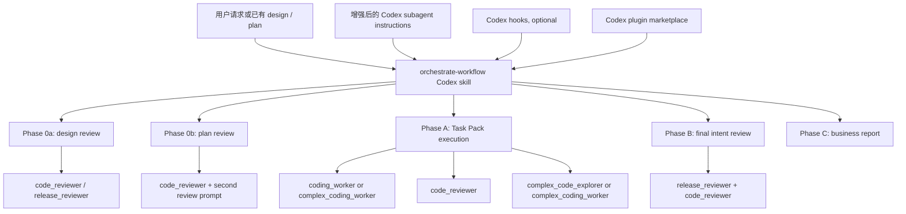
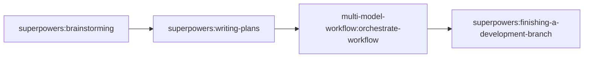

# multi-model-workflow 的 Codex 迁移设计

## 目的

本文定义如何把 `multi-model-workflow` 从 Claude Code plugin 迁移为 Codex-native workflow package。迁移目标不是逐文件复刻 Claude Code 的机制，而是保留这套系统的产品合同：

- main coordinator 负责 design review、plan repair、Task Pack 调度，以及需要面向用户做出的决策；
- 实现工作按 Task Pack 批量执行，而不是每个 agent 只做一个零散任务；
- design、plan、pack 和 final intent 四个层级都必须经过 review；
- 技术闭环应尽量自主关闭，只有需要业务判断时才回到用户；
- workflow 应保持可安装、可复用，并适合 AgentFlow 这类正式项目仓库。

## 设计出发点与最低要求

Codex 迁移后的版本至少要满足原 plugin 的四个设计出发点，并且应把这些出发点转成可测试的运行合同。

| 出发点 | Codex 迁移要求 |
| --- | --- |
| 正确模型、正确角色、正确工具边界 | 每个 Codex agent role 必须有明确的任务类型、模型强度、reasoning effort、工具使用边界和升级条件。简单查询和机械文档不占用高成本角色；高风险实现、release gate、复杂 root-cause 才使用更强模型。 |
| 与 Superpowers plugin 联动 | Codex 版不是替代整个 Superpowers，而是接管 Superpowers 与 AgentFlow 项目工作流不匹配的后半段：`brainstorming` 和 `writing-plans` 之后进入 `orchestrate-workflow`，并替代 `subagent-driven-development` 的执行与 review 部分。 |
| Coding Agent 自动化 | 用户不应在每个 phase 手动发命令。设计文档或计划文档出现后，orchestrator 能自动进入 Phase 0、分包、执行、review、修复和 final verification；只有业务承诺、用户体验范围或产品取舍变化时才回到用户。 |
| 更细致的多层 review | design、plan、Task Pack、final intent 都有独立 review 合同，并且要区分 spec compliance、project alignment、code quality、production risk 和 second opinion。Review 结果必须能路由到正确的修复角色。 |

这四项不是背景说明，而是 V1 的最低验收约束。后续所有 plugin packaging、hook port、agent instruction sync 都应服务这四项。

## 当前 Claude 包结构

当前仓库在 `plugin/` 下提供一套 Claude Code plugin。

| 区域 | 当前文件 | 当前责任 |
| --- | --- | --- |
| Claude package metadata | `plugin/.claude-plugin/plugin.json`, `.claude-plugin/marketplace.json` | 把 `multi-model-workflow` 发布为 Claude plugin。 |
| 主 workflow skill | `plugin/skills/orchestrate-workflow/SKILL.md` | 从 design review 到 final report 负责整个 workflow。 |
| Prompt templates | `plugin/skills/orchestrate-workflow/*prompt.md` | 为 design、plan、pack 和 final review 提供专门的 review prompts。 |
| Claude subagents | `plugin/agents/pack-executor.md`, `workflow-auditor.md`, `root-cause-analyst.md` | 用 Claude tool permissions 定义实现、审计和 root-cause 角色。 |
| Hooks | `plugin/hooks/hooks.json`, `plugin/hooks/session-start.sh`, `plugin/scripts/guard-premature-push.sh` | 注入路由规则，阻止过早 push/merge/PR，并在 pack execution 之后提醒。 |

当前设计的方法论是成熟的，但实现表面强绑定 Claude：

- subagent 文件使用 Claude frontmatter 字段，例如 `tools`、`disallowedTools`、`skills`、`memory`、`maxTurns` 和 Claude model IDs；
- hook 命令依赖 `CLAUDE_PLUGIN_ROOT`；
- plan 和 final review templates 引用了 `codex:codex-rescue` 这个 Claude subagent type；
- project rules 要求 agent 读取 `CLAUDE.md`，而 Codex 使用 `AGENTS.md`，并结合 repository 和 user skill discovery。

## Codex 能力调查结论

Codex 迁移应使用当前 Codex primitives，而不是沿用更早那套轻量的 skill-only 方案。

| 能力 | 当前 Codex 事实 | 迁移含义 |
| --- | --- | --- |
| Skills | Codex skills 是可复用 workflow 的编写格式。一个 skill 是包含 `SKILL.md` 的文件夹，并可带 scripts、references、assets 和 `agents/openai.yaml`。 | 保留 `orchestrate-workflow` 作为 skill，但要按 Codex tool names、Codex project docs 和 Codex agent roles 重写说明。 |
| Plugins | Codex plugins 是可安装的分发单元，可包含 reusable skills、apps、MCP config 和 hooks。每个 plugin 使用 `.codex-plugin/plugin.json`。 | 新增 Codex plugin package，不把 global user skills 当成最终分发表面。 |
| Skill locations | Codex 会扫描 repo skills `.agents/skills` 和 user skills `$HOME/.agents/skills`。当 workflow 属于某个项目时，应优先使用 repo skill。 | 开发期间先按 repo-local skill 测试。分发时通过 `.agents/plugins/marketplace.json` 或 personal marketplace 暴露 plugin。 |
| Plugin marketplaces | Codex 读取 repo marketplace `$REPO_ROOT/.agents/plugins/marketplace.json`、personal marketplace `~/.agents/plugins/marketplace.json`，也能识别 Claude-style marketplace files。已安装的 local plugins 从 Codex plugin cache 加载。 | 仓库可以保留 Claude marketplace 供 Claude 用户使用，但 Codex 需要自己的 `.agents/plugins/marketplace.json`。 |
| Hooks | Codex 支持通过 `hooks.json`、inline config、repo `.codex/`、user config 或 installed plugins 提供 lifecycle hooks。Hooks 需要 `[features].codex_hooks = true`。 | 只有在启用并测试 Codex hooks 后再迁移 hooks。Hook scripts 不能依赖 `CLAUDE_PLUGIN_ROOT`。 |
| Hook limits | Codex `PreToolUse` 是 guardrail，不会拦截 newer unified exec 机制下的每一条 shell 路径。 | premature-push guard 可以减少错误，但不能当成唯一执行门禁。orchestrator skill 在 merge/push 前仍必须检查 plan completion。 |
| Multi-agent | 本机已启用 Codex `multi_agent`。当前自定义 agent types 包括 `coding_worker`、`complex_coding_worker`、`code_reviewer`、`release_reviewer`、`code_explorer`、`complex_code_explorer` 和 `docs_worker`。 | 以这些角色作为第一版 Codex implementation target。V1 不创建重复的 Claude-shaped roles。 |
| Existing agent instructions | 当前 Codex agent configs 位于 `~/.codex/agents/*.toml`，其中的 `developer_instructions` 可以编辑。现有 role taxonomy 是有用的，但部分角色说明刻意保持很短。 | 把 Claude subagent 中成熟的工作方法迁移到现有 Codex role instructions。orchestrator skill 只传递 task-specific context，而不是每次重新教 agent 完整职责。 |
| Agent model config | 本机 `~/.codex/agents/*.toml` 已为不同 agent type 设置 `model`、`model_reasoning_effort` 和 `model_verbosity`。例如普通实现 worker 与 reviewer 可使用不同模型。 | 迁移必须保留“任务类型 → agent role → model profile”的路由表，用模型强度和 reasoning effort 平衡效率、费用与结果质量。 |
| Tool permissions | Claude agent frontmatter 支持 `tools` 和 `disallowedTools`。当前 Codex custom agent config 以 `developer_instructions` 和运行时工具环境为主，不能假设存在完全同构的 per-agent tool allowlist。 | V1 先用 role instruction、parent prompt ownership、read-only reviewer contract 和 smoke tests 约束工具使用；如果 Codex 后续暴露正式 per-agent tool schema，再把该 schema 加入 `codex/agents/*.toml` 模板。 |
| Custom agents | Codex config 支持 `agents.<name>.description` 和 `agents.<name>.config_file`，但公开的 plugin packaging docs 没有把 `agents/` 列为 plugin component。 | 把 plugin-packaged subagent definitions 视为后续能力。V1 提供 agent instruction templates 和 sync/install path，runtime route 使用现有 Codex agent types。 |

2026-05-15 的本机检查结果：

- `codex-cli 0.130.0`
- `plugins = stable true`
- `multi_agent = stable true`
- `tool_search = stable true`
- `hooks` 可用，但本机 config 通过 `[features].codex_hooks = false` 禁用了 hooks
- 当前 user config 已启用官方 `superpowers@openai-curated` plugin

## 模型、工具边界与成本策略

原 Claude plugin 通过 agent frontmatter 同时表达模型、effort、tool permissions、skills 和 max turns。Codex 迁移不能机械复制这些字段，但必须保留同一个设计目的：让不同类型的任务进入不同强度、不同权限边界、不同成本的执行路径。

V1 的模型路由策略如下：

| 任务类型 | 默认 Codex agent type | 模型/成本策略 | 工具边界策略 |
| --- | --- | --- | --- |
| 小范围查代码、找调用链、找测试入口 | `code_explorer` | 使用较轻的 explorer profile，优先快、便宜、低上下文污染。 | 只回答问题，不改文件；prompt 明确 read-only。 |
| 多模块历史、迁移链路、架构关系调查 | `complex_code_explorer` | 使用更强 reasoning profile，因为错误结论会污染后续实现。 | 默认 read-only；输出 facts、inference、excluded paths 和 next owner。 |
| 普通代码实现、测试修复、局部重构 | `coding_worker` | 使用 coding worker profile，适合多数 Task Packs，在成本与实现能力之间取平衡。 | 只能改 parent 分配的 owned files / responsibilities，不得越界重构或 revert 他人修改。 |
| 跨模块、高风险实现、迁移、账务、权限、运行时 | `complex_coding_worker` | 使用更强模型和更高 reasoning effort，费用换正确性。 | 必须先读 formal docs / contracts / migrations；无法证明方案正确时返回 `BLOCKED`。 |
| 普通 code/spec review | `code_reviewer` | 使用强 review profile，避免低质量 review 把缺陷放进后续执行。 | 默认 read-only；发现问题只报告和路由，不编辑。 |
| 发布前、生产风险、数据/权限/账务/迁移 gate | `release_reviewer` | 使用最高风险 review profile；宁可多花成本，也不能漏 release blocker。 | 默认 read-only；关注 deploy order、rollback、compatibility 和 manual verification。 |
| 低风险文档归纳、机械整理 | `docs_worker` | 使用较轻 profile，避免让高成本实现/审核模型做机械整理。 | 只改授权文档范围；需要产品或架构判断时返回 `NEEDS_CONTEXT`。 |

Codex V1 的工具权限设计采用两层：

- 硬边界：使用 Codex 当前真实支持的 agent config 字段，即 `model`、`model_reasoning_effort`、`model_verbosity` 和 `developer_instructions`。不伪造 Claude 的 `tools` / `disallowedTools` schema。
- 软边界：在每个 agent instruction 和 orchestrator prompt 中重复 read-only、owned files、no unauthorized reverts、no direct publish、reviewer does not edit 等约束，并用 smoke tests 验证角色是否遵守。

未来如果 Codex custom agents 正式支持 per-agent tool allowlist，本设计应把该能力加入 `codex/agents/*.toml`，并把 `code_reviewer` / `release_reviewer` 设成明确 read-only，把 implementation workers 限制在需要的编辑与验证工具内。

## 目标产品形态

构建一个 Codex-native package，分为三层。



第一层是 subagent instruction foundation：

- 现有 Codex roles 保持 canonical：`coding_worker`、`complex_coding_worker`、`code_reviewer`、`release_reviewer`、`code_explorer`、`complex_code_explorer` 和 `docs_worker`；
- 位于 `~/.codex/agents/*.toml` 的 user-level instruction files 接收 Claude plugin 中稳定的角色方法；
- 本仓库应在 Codex-owned 路径中保留匹配模板，例如 `codex/agents/*.toml`，让 instruction set 可以版本化并同步到机器；
- V1 不创建名为 `pack-executor`、`workflow-auditor` 或 `root-cause-analyst` 的重复用户可见角色。

第二层是 workflow authoring layer：

- 开发期间使用 repo-local `.agents/skills/orchestrate-workflow/`；
- 原 prompt templates 移到 `references/`，或者继续放在 `SKILL.md` 旁边，但 skill instructions 必须明确从 skill directory 解析路径；
- 可选 `agents/openai.yaml`，用于设置 display metadata，或者在测试发现 accidental triggers 时关闭 implicit invocation。

第三层是 distribution layer：

- `plugin/.codex-plugin/plugin.json`；
- `plugin/skills/orchestrate-workflow/`；
- 可选 `plugin/hooks/hooks.json`；
- 根目录 `.agents/plugins/marketplace.json` 暴露 local Codex plugin。

迁移期间仓库应同时支持 Claude 和 Codex，但 Codex runtime entry 必须是单一可见的 `orchestrate-workflow` skill。正常使用时不要同时安装 raw user skill 和 installed plugin copy，因为重复的 skill names 会让 invocation 变得不明确。

## Superpowers 联动合同

Codex 版 `multi-model-workflow` 应作为 Superpowers 的 workflow adapter，而不是和 Superpowers 各自独立运行。它接管的是 Superpowers 原有流程中与 AgentFlow 项目工作方式不匹配的阶段。

标准链路：



职责边界：

| 阶段 | 保留 Superpowers | Codex multi-model-workflow 接管 |
| --- | --- | --- |
| 需求探索 | `superpowers:brainstorming` 负责梳理用户意图和方案方向。 | 不在 raw brainstorming 阶段抢跑。 |
| 设计与计划生成 | `superpowers:writing-plans` 负责产出 design / plan 初稿。 | design 或 plan 产出后立即进入 Phase 0 review，不等用户逐步发下一条命令。 |
| 代码落地 | 不使用 `superpowers:subagent-driven-development` 作为默认实现器。 | 使用 Task Pack batching、Codex subagent routing、pack review 和 root-cause routing 接管实现。 |
| 方法论复用 | TDD、systematic debugging、verification-before-completion、requesting/receiving-code-review 仍是角色方法来源。 | 把这些方法沉淀进 Codex agent `developer_instructions`，不依赖 Claude `Skill` tool 或 Claude frontmatter。 |
| 收尾发布 | `superpowers:finishing-a-development-branch` 仍负责 merge/PR/push 这类明确收尾流程。 | `orchestrate-workflow` 只完成实现、review、验证和业务报告；不自动 merge/push。 |

需要弥补的 Superpowers mismatch：

- 原 `subagent-driven-development` 更偏实现执行，不能覆盖 design review、plan review 和 final intent review；Codex 版必须覆盖完整 post-design workflow。
- AgentFlow 这类项目需要先按正式文档和项目规则验真，再执行代码；Codex 版 Phase 0 必须把 doc review 当成正式 gate。
- AgentFlow 的任务通常跨多个文件和测试入口；Codex 版应使用 Task Pack，而不是每个小 task 单独启动一个 subagent。
- 用户不应手动串联每个 Superpowers skill；Codex 版应在 trigger 和 SessionStart hook 可用时自动接上下一阶段。

## 功能映射

| Claude concept | Codex V1 mapping | 说明 |
| --- | --- | --- |
| `multi-model-workflow:orchestrate-workflow` skill | Codex plugin skill `orchestrate-workflow` | 为 Codex 重写 trigger description。保留相同 phase model。 |
| `Agent tool` new subagent | 使用所选 `agent_type` 调用 `spawn_agent` | main coordinator 只在任务独立、且不是 immediate blocker 时 spawn。 |
| `SendMessage` to same agent | 对返回的 agent id 调用 `send_input` | 只用于同一个 pack 的 review repair，且 context continuity 重要的情况。 |
| `pack-executor` | 默认 `coding_worker`；跨模块或高风险 packs 用 `complex_coding_worker` | Prompt 提供 pack-executor contract、TDD expectations 和 changed file ownership。 |
| `workflow-auditor` | `code_reviewer`；final 或 production-risk reviews 用 `release_reviewer` | Prompt 提供 read-only audit contract。Codex role config 负责 reviewer behavior。 |
| `root-cause-analyst` | 诊断用 `complex_code_explorer`，修复用 `complex_coding_worker`；如果诊断和修复紧密耦合，则直接用一个 `complex_coding_worker` | 保留 unknown-root-cause investigation 和 known review fixes 的区别。 |
| `codex:codex-rescue` second opinion | 使用独立 prompt 和不读取第一次 review 输出的第二次 `code_reviewer` 或 `release_reviewer` 调用 | 不能假设 Codex 存在 Claude-side `codex:codex-rescue` agent type。second-opinion 的价值来自独立 framing。 |
| Claude `CLAUDE.md` project loading | Codex `AGENTS.md`，并在存在时结合 `PROJECT.md` / `ENGINEERING-RULES.md` | Prompts 应写“read the active project instructions”，并点名 `AGENTS.md`，不能只写 `CLAUDE.md`。 |
| Claude hook `SessionStart` routing injection | Codex `SessionStart` hook 或更强的 skill trigger text | 因为本机当前禁用了 hooks，所以 skill description 必须在没有 hooks 时也足够清楚。 |
| Claude hook `PreToolUse/Bash` premature push guard | Codex `PreToolUse` hook 加 orchestrator self-check | Hook 有帮助，但不是完整 enforcement。 |
| Claude hook `SubagentStop` reminder | V1 不要求 hook | sequence reminder 应放在 orchestrator skill 内。后续可评估 Stop/PostToolUse hook 是否有用。 |

## Subagent 指令迁移

最关键的迁移不是 plugin packaging，而是用 Claude plugin 中成熟的角色合同补强现有 Codex subagent instructions。

Codex 已经有合适的角色分类。当前缺口是部分 `developer_instructions` 太薄，如果每次都靠 parent prompt 携带大量说明，行为很难稳定复现 Claude plugin 的效果。稳定的角色行为应进入 Codex agent config。orchestrator skill 之后只负责传入每次运行的上下文：phase、pack text、design/plan paths、owned files、review findings 和 verification commands。

### 原则：保留 Codex Roles，迁入 Claude Methods

V1 不创建名为 `pack-executor`、`workflow-auditor` 或 `root-cause-analyst` 的新角色。这些名字是有价值的迁移来源，但如果直接变成 Codex runtime roles，会和 Codex 现有 role taxonomy 重复。canonical runtime mapping 如下：

| Claude method source | Codex instruction target | 需要迁入的稳定行为 |
| --- | --- | --- |
| `pack-executor` | `coding_worker` | Task Pack execution、已知 review finding 的修复、TDD discipline、three-strike failure protocol、status codes、file ownership、禁止 unauthorized reverts。 |
| `pack-executor` | `complex_coding_worker` | 同样的 implementation contract，再加跨模块、migration、billing、auth、runtime、contract 和 release-risk judgment。 |
| `workflow-auditor` | `code_reviewer` | Read-only review stance、confidence filtering、基于证据的 findings、先审 spec compliance 再审 code quality、routing recommendations、禁止 style-only blockers。 |
| `workflow-auditor` | `release_reviewer` | Phase B 和 release-gate review，覆盖 production、data、permission、billing、migration、compatibility、deployment order、rollback 和 manual verification risk。 |
| `root-cause-analyst` | `complex_code_explorer` | Unknown-root-cause investigation、reproducible evidence、falsifiable hypotheses、excluded paths、禁止 file edits。 |
| `root-cause-analyst` | `complex_coding_worker` | 当 diagnosis 和 repair 紧密耦合时进入 root-cause fix mode，并带 systematic debugging 和 explicit stop conditions。 |

Claude-only frontmatter fields 不是迁移合同的一部分：

- 不把 Claude `tools` 或 `disallowedTools` fields 复制进 Codex instructions；
- 不复制 Claude model ids；
- 不把 Claude `memory`、`maxTurns` 或 `skills` fields 当成 Codex 支持的同构 schema；
- 不依赖 Claude `Skill` tool invocation model。

### `coding_worker` 指令补充

`coding_worker` instructions 应补充普通 Task Pack execution contract：

- worker 可能收到的是 Task Pack，而不是整项 feature；
- worker 只拥有 parent 明确分配的 files 和 responsibilities；
- worker 不得 revert 或 overwrite 其他 agents 或用户的 edits；
- 每项任务在可行时使用 TDD：先写出或定位 failing test，再实现最小 passing change，最后运行 focused verification；
- 对 known review findings 不盲从，必须先验证 finding 是否成立；
- valid finding 优先修 Critical issues，再修 Important issues；
- invalid finding 要返回证据，而不是做防御式修改；
- 连续三次失败后，每次都必须改变方法，然后返回 `BLOCKED`，并记录三次 attempts；
- worker 只返回一个 status：`DONE`、`DONE_WITH_CONCERNS`、`NEEDS_CONTEXT` 或 `BLOCKED`；
- final report 包含 changed files、tests run、results、deviations 和 residual risk。

### `complex_coding_worker` 指令补充

`complex_coding_worker` instructions 应继承 `coding_worker` contract，并增加高风险行为：

- 编辑前读取相关 formal docs、contracts、migrations、tests 和 current code；
- 当任务涉及 architecture-sensitive 内容时，先说明理解到的 boundary、dependencies 和 risk；
- database migrations、billing、auth、permissions、runtime、gateway behavior、browser takeover、cross-service contracts 和 release gates 默认视为高风险；
- 如果 design 或 plan 在技术上不成立，返回 `BLOCKED`，不要打 temporary patch；
- final report 中包含 compatibility impact、migration/deploy notes、rollback concerns 和 manual verification gaps。

### `code_reviewer` 指令补充

`code_reviewer` instructions 应迁入 `workflow-auditor` discipline：

- 默认 read-only review，除非 parent 明确要求修复；
- 审查实际 code、docs、tests 和 command output，不信任 implementer reports；
- findings first，按 severity 排序；
- 每条 finding 必须包含 severity、confidence、file/line 或最小 locator、evidence、why it matters 和 concrete remediation；
- confidence 低于 80 的问题不得成为 blocking finding，除非是 security issue；
- 如果提供了 plan 或 pack，先审 spec compliance，再看 code quality；
- 不把 style preferences、pre-existing unrelated debt 或 linter-discoverable noise 作为 workflow blockers；
- 必要时提供 routing guidance：`needs coding_worker`、`needs complex_coding_worker`、`needs complex_code_explorer` 或 `needs user decision`；
- 如果没有 blocking findings，要明确说明 remaining test gaps 和 residual risk。

### `release_reviewer` 指令补充

`release_reviewer` instructions 应成为 final workflow audit 和 production gate 的 Codex 等价物：

- 用于 Phase B、large diffs、database migrations、billing、permissions、runtime、deployment、rollback 和 cross-service contracts；
- 按 design intent 验证 implementation，不只看 changed lines；
- 检查 migration order、deploy order、compatibility、rollback path、operational docs 和 manual validation steps；
- data loss、permission bypass、billing inconsistency、irreversible migration、broken rollback 和 unverified production dependency 都是 release blockers；
- 即使没有 blockers，也要列出 local proof 之外仍需 manual 或 online verification 的事项。

### `complex_code_explorer` 指令补充

`complex_code_explorer` instructions 应吸收 `root-cause-analyst` 中的调查部分：

- 默认只调查，不编辑文件；
- 遵循 Reproduce -> Investigate -> Evidence -> Conclusion；
- 每个 hypothesis 必须 falsifiable，并且不能重复前一个 hypothesis；
- 连续三个 hypothesis 无证据支持后，停止扩大搜索，报告 excluded paths；
- 分清 facts 和 inference；
- 返回 likely fix owner 和 minimal next step，例如高风险修复交给 `complex_coding_worker`，局部修复交给 `coding_worker`。

### 可选 `docs_worker` 补充

只有当 parent 明确委派低风险机械文档编辑时，`docs_worker` 才吸收 Phase 0 document-repair support role：

- 保留 formal decisions 和 scope；
- 只在授权文档范围内修复 placeholders、contradictions、stale paths 和 unclear acceptance criteria；
- 需要 product 或 architecture decision 时返回 `NEEDS_CONTEXT`。

### Source of Truth 和同步

这些增强指令的 durable source of truth 应在本仓库版本化，然后同步到用户的 Codex config。

推荐 source layout：

```text
multi-model-workflow/
  codex/
    agents/
      coding-worker.toml
      complex-coding-worker.toml
      code-reviewer.toml
      release-reviewer.toml
      complex-code-explorer.toml
      docs-worker.toml
    sync-agents.sh
```

sync script 应做到：

- 只复制 Codex-owned agent templates 到 `~/.codex/agents/`；
- 不碰 unrelated local custom agents；
- 除非用户明确要求，否则保留当前 `~/.codex/config.toml` 中的 role names；
- 验证每个被引用的 `config_file` 都存在；
- 可行时运行一个小的 `codex exec` 或等价 fresh-process discovery check。

## Codex Plugin 结构

Codex package 应放在现有 Claude package metadata 旁边，而不是覆盖它。

```text
multi-model-workflow/
  .agents/
    plugins/
      marketplace.json
  plugin/
    .claude-plugin/
      plugin.json
    .codex-plugin/
      plugin.json
    skills/
      orchestrate-workflow/
        SKILL.md
        references/
          design-review-content-prompt.md
          design-review-alignment-prompt.md
          plan-review-coverage-prompt.md
          plan-review-compliance-prompt.md
          plan-review-second-opinion-prompt.md
          pack-review-prompt.md
          final-intent-review-prompt.md
          final-review-second-opinion-prompt.md
    hooks/
      hooks.json
      session-start.sh
    scripts/
      guard-premature-push.sh
  codex/
    agents/
      coding-worker.toml
      complex-coding-worker.toml
      code-reviewer.toml
      release-reviewer.toml
      complex-code-explorer.toml
      docs-worker.toml
    sync-agents.sh
```

`plugin/.codex-plugin/plugin.json` 应标识 Codex package，并指向相关 components：

```json
{
  "name": "multi-model-workflow",
  "version": "0.7.0",
  "description": "Codex-native workflow orchestration for Task Packs, review loops, and final intent verification.",
  "skills": "./skills/",
  "hooks": "./hooks/hooks.json",
  "interface": {
    "displayName": "Multi Model Workflow",
    "shortDescription": "Task Pack execution and review orchestration for Codex.",
    "developerName": "Cheuk Lap Chan",
    "category": "Productivity",
    "capabilities": ["Read", "Write"],
    "defaultPrompt": [
      "Use orchestrate-workflow to review and execute this design.",
      "Use orchestrate-workflow to continue the active Superpowers plan."
    ]
  }
}
```

初始 Codex build 可以先省略 `hooks`，直到 hook scripts 完成迁移并通过测试。如果 manifest 保留 `hooks`，安装说明必须写明需要启用 `[features].codex_hooks = true`。

## Orchestrator Skill 合同

Codex `orchestrate-workflow` skill 应保留 phase model，但要改写执行说明。

### Trigger Contract

skill 应在这些场景触发：

- `docs/superpowers/specs/` 下已经存在或刚产出 design document；
- `docs/superpowers/plans/` 下已经存在或刚产出 plan；
- 用户要求 execute、review、audit、continue、advance 或 complete 某个 design/plan；
- workflow run 在 compaction 或 interruption 后 resume。

这些场景不应触发：

- design 尚未存在前的 raw brainstorming；
- 从零写第一版 design 或 plan；
- 单次很小的 code edit，完整 workflow 明显重于任务本身；
- 用户只想要 findings 的简单 code review。

### Main Session Responsibilities

main session 负责：

- 定位 design 和 plan；
- 在 Phase 0 修补 design 和 plan documents；
- 选择 Task Pack boundaries；
- 判断 packs 是否真正独立；
- 只在 subagent work 可以并行，或 context isolation 有实际帮助时 spawn subagents；
- 整合 subagent results；
- 更新 plan checkboxes；
- 运行 final verification；
- 用业务语言与用户沟通。

这一点对 Codex 很重要，因为 subagents 默认不会继承全部 context，除非明确 fork 或在 prompt 中提供。coordinator 每次都必须传入相关 documents、task text、constraints 和 acceptance criteria。

### Agent Routing Contract

| 工作项 | Codex agent type | Prompt obligations |
| --- | --- | --- |
| 普通 implementation pack | `coding_worker` | 只拥有列出的 files/tasks。可行时使用 TDD。不 revert 其他修改。报告 changed files 和 tests。 |
| 跨模块或高风险 pack | `complex_coding_worker` | 同上，并说明 migration、auth、billing、runtime 或 contract risks。 |
| Design 和 plan audit | `code_reviewer` | findings first。验证 paths 和 claims。不编辑。 |
| Final release 或 production-risk audit | `release_reviewer` | 聚焦 data、compatibility、migrations、deploy order、rollback 和 manual verification。 |
| 小范围代码查询 | `code_explorer` | 回答一个具体、有限的问题。 |
| Unknown root-cause investigation | 如果 diagnosis 可分离，先用 `complex_code_explorer`；如果 diagnosis 和 fix 紧密耦合，用 `complex_coding_worker` | 使用 systematic debugging。返回 evidence、excluded hypotheses 和 fix path。 |

当前 Claude agent markdown files 不应直接复制为 Codex agent configs。它们应被提炼出稳定角色行为，重写进 Codex `developer_instructions`，再由 orchestrator 通过普通 Codex agent routing 引用。

## Hook 设计

Hooks 应被视为 reinforcement layer，而不是 workflow 的核心。

### SessionStart

Codex 支持 `SessionStart` hooks，并且 plain stdout 可以增加 developer context。当前 `session-start.sh` 可以按概念迁移，但必须：

- 移除 `CLAUDE_PLUGIN_ROOT`；
- 输出 Codex wording；
- 说明 `orchestrate-workflow` 负责 post-design workflow；
- 保持 non-blocking，并以 `0` 退出。

因为本机今天禁用了 hook support，同样的 routing rules 也必须存在于 skill description。

### Premature Push Guard

当前 `guard-premature-push.sh` 可以迁移成 Codex `PreToolUse` hook。它应解析 `tool_input.command`，检查最新 active plan，并在仍有 unchecked tasks 时阻止 `git push`、`git merge` 和 `gh pr create`。

这个 guard 还必须承认 Codex 限制：

- `PreToolUse` 不会拦截所有 shell route；
- command guard 不能替代 final verification；
- orchestrator 在 final report 之前，以及调用任何 finish 或 publish workflow 之前，必须显式检查 unchecked tasks。

### SubagentStop

Codex 公开 hook docs 没有列出 `SubagentStop`。V1 不迁移这个 hook。sequence reminder 应属于 orchestrator skill。

## 自动化边界与循环控制

Codex 版的自动化目标是减少用户在技术阶段反复发命令，而不是让 agent 绕过业务判断或发布门禁。

自动推进规则：

- design doc 已存在或刚产出时，直接进入 Phase 0a；
- plan 已存在或刚产出时，直接进入 Phase 0b 或后续对应 phase；
- Phase 0 review 发现技术性文档问题时，main session 直接修复并复审；
- Task Pack implementation、pack review、review-fix、root-cause investigation 和 final intent verification 都由 orchestrator 自动调度；
- 只有当问题会改变产品承诺、用户体验范围、业务规则、发布策略或用户可见取舍时，才暂停询问用户。

循环上限从原 Claude plugin 迁移为 Codex 运行合同：

| 循环 | 上限 | 超限后的处理 |
| --- | --- | --- |
| Phase 0a design review -> main session 修复 | 2 轮 | 用业务语言说明哪个设计点无法确认，并要求产品决策。 |
| Phase 0b plan review -> main session 修复 | 2 轮 | 用业务语言说明哪个计划点无法确认，并要求产品决策。 |
| Phase A pack review -> worker 修复 | 每个 pack 3 轮 | 报告具体功能点和三轮修复记录，再决定拆 pack、改设计、或交给 root-cause route。 |
| Phase B intent gap -> worker 修复 | 每个 gap 2 轮 | 报告哪个设计承诺没有闭合，区分实现缺陷和设计缺陷。 |
| Phase B 总调度 | 15 次 | 汇报当前完成度、剩余风险和需要用户决定的事项。 |

这些上限不是降低质量，而是防止 agent 在错误假设里无限循环。每次超限都必须输出已经验证过的事实、失败路径和下一步决策点。

## Workflow 设计

### Phase 0a: Design Review

如果 design doc 已存在，coordinator 读取它，并派出两个独立 review：

- 使用 `code_reviewer` 做 content and logic review；
- 当涉及 architecture、billing、permissions、migrations 或 deployment 时，使用 `code_reviewer` 或 `release_reviewer` 做 project alignment and feasibility review。

coordinator 直接修复文档问题。只有需要改变产品承诺这类 business decision 时才问用户。

### Phase 0b: Plan Review

coordinator 读取 plan，并派出：

- coverage and task quality review；
- compliance and reference verification review；
- 使用独立 prompt 做 second-opinion review。

旧的 `codex:codex-rescue` template 改为 `plan-review-second-opinion-prompt.md`。它不应再提 Claude agent types。

### Setup: Task Pack Planning

coordinator 按以下维度把未勾选 plan tasks 分组为 packs：

- shared files；
- dependency order；
- section boundaries；
- risk level；
- expected test scope。

独立 packs 可以并行。触碰同一批 files、migrations、auth、billing、runtime 或 shared contracts 的 packs 应串行，除非边界已经被证明清楚。

### Phase A: Task Pack Execution

每个 pack：

1. 使用完整 task text、owned files、acceptance criteria、project rules，以及不得 revert others' changes 的指令，spawn `coding_worker` 或 `complex_coding_worker`；
2. 只有当下一条 critical path 依赖该结果时才 wait；
3. 用 `code_reviewer` review 已完成的 pack；
4. 当 context continuity 重要时，把 review fixes 发回同一个 agent id；
5. 只有在问题尚未 localized 时才使用 root-cause routing。

### Phase B: Final Intent Verification

所有 packs 通过后：

- end to end 验证 design intent，而不只是 individual task completion；
- 运行相关 tests 和 commands；
- 如果 diff 触碰 deploy、database、permissions、billing、runtime 或 cross-service contracts，使用 `release_reviewer` 做最终 production risk review；
- 使用独立 second-opinion `code_reviewer` prompt 检查 implementation risks。

### Phase C: Business Report

报告内容包括：

- 当前已完成的 product capability；
- review loops 中修复了什么；
- 运行了哪些 validation；
- 仍未解决、或需要 manual/product decision 的事项。

不要自动 merge 或 auto-push。finishing 仍是另一个显式 workflow。

## 迁移计划

### Stage 1: Codex Subagent Instruction Foundation

创建版本化的 Codex agent templates，同时保留当前 active role names：

- 为每个 `codex/agents/*.toml` 明确写入 `model`、`model_reasoning_effort`、`model_verbosity` 和 `developer_instructions`；
- 按“轻量查询 / 普通实现 / 高风险实现 / 普通 review / release review / 机械文档”分别设定模型强度和 routing policy；
- 基于当前 `coding_worker` config，加上 Task Pack 和 review-fix contract，写出 `codex/agents/coding-worker.toml`；
- 基于当前 `complex_coding_worker` config，加上高风险 implementation rules，写出 `codex/agents/complex-coding-worker.toml`；
- 基于当前 `code_reviewer` config，加上 workflow-auditor review discipline，写出 `codex/agents/code-reviewer.toml`；
- 基于当前 `release_reviewer` config，加上 final intent 和 production-gate review rules，写出 `codex/agents/release-reviewer.toml`；
- 基于当前 `complex_code_explorer` config，加上 unknown-root-cause investigation rules，写出 `codex/agents/complex-code-explorer.toml`；
- 可选写出 `codex/agents/docs-worker.toml`，支持低风险 Phase 0 document repair；
- 增加 sync script，更新 `~/.codex/agents/*.toml`，但不触碰 unrelated user agents。

Validation：

- 检查 `~/.codex/config.toml`，确认每个 configured `agents.<name>.config_file` 都指向存在的文件；
- 检查每个 agent template 的 model profile 是否符合模型/成本策略；
- 对 `coding_worker`、`code_reviewer` 和 `complex_code_explorer` 运行 minimal subagent spawn smoke test；
- 确认返回行为符合新的 status、review、tool-boundary 和 investigation contracts。

### Stage 2: Codex Authoring Surface

创建 Codex-compatible skill，同时保留 Claude package：

- 按 Codex tool 和 agent names 重写 `SKILL.md`；
- 写清楚 Superpowers 联动链路：`brainstorming` / `writing-plans` 之后由 `orchestrate-workflow` 接管，替代 `subagent-driven-development` 的执行与 review；
- 把 prompt templates 移到 `references/`，或者清楚更新路径；
- 重命名 Codex second-opinion prompts，避免引用 `codex:codex-rescue`；
- 把所有 project-doc wording 从只写 `CLAUDE.md` 改成 `AGENTS.md`，并在存在时结合 linked project docs；
- 如果行为已经沉淀到 Codex agent instructions，就从 orchestrator 中移除完整重复的 subagent job descriptions；
- 写入 Codex 版循环上限和自动推进边界，避免每个 phase 都需要用户命令；
- 只有需要 display metadata 或 implicit-invocation policy 时才添加 `agents/openai.yaml`。

Validation：

- 从仓库运行 fresh Codex skill discovery check；
- 确认 Codex-visible `orchestrate-workflow` 只有一个；
- 在一个小型已有 design 和 plan 上 dry-run skill，不编辑 production code。

### Stage 3: Codex Plugin Package

增加 Codex distribution files：

- `plugin/.codex-plugin/plugin.json`；
- 根目录 `.agents/plugins/marketplace.json`；
- README 中增加 Codex installation 和 usage 章节。

Validation：

- 从 local marketplace 安装；
- 验证 installed plugin 出现在 Codex plugin state；
- restart Codex 或使用 fresh process，并确认从 trusted repo 能看到 skill。

### Stage 4: Hook Port

在 skill 不依赖 hooks 也能工作之后再迁移 hooks：

- 把 `hooks/hooks.json` 重写为 Codex schema 和 command paths；
- 迁移 `session-start.sh` wording；
- 把 `guard-premature-push.sh` 迁移到 Codex hook input；
- 文档说明用户必须启用 `[features].codex_hooks = true`。

Validation：

- 测试 `SessionStart` 能增加 context；
- 测试当 plan tasks 未勾选时，`PreToolUse` 能阻止模拟 `git push`；
- 测试所有 tasks 已勾选时不会误拦截。

### Stage 5: Agent Optimization

V1 通过增强后的现有 Codex agent types 工作后，再判断是否值得增加额外 custom Codex agent roles。

不要让 V1 被 plugin-packaged custom agents 阻塞，因为当前 Codex plugin packaging docs 没有把 `agents/` 定义为 bundled plugin component。若未来 Codex plugin docs 增加 agent packaging，版本化的 `codex/agents/*.toml` templates 可以成为迁移来源。

## 验收标准

迁移 ready 的标准：

- Codex 从预期来源看到且只看到一个 `orchestrate-workflow` skill；
- 每个 Codex subagent template 都有明确 model profile、reasoning effort、任务边界和成本/质量取舍说明；
- 普通任务不会默认路由到最高成本角色，高风险实现和 release gate 不会降级到轻量角色；
- 工具权限无法同构迁移的限制被明确记录，并通过 read-only / owned-files / no-publish 等 role contracts 和 smoke tests 做 V1 约束；
- 现有 Codex subagent instructions 已用 Claude role contracts 增强，并且没有创建重复的 Claude-shaped runtime roles；
- `coding_worker`、`complex_coding_worker`、`code_reviewer`、`release_reviewer` 和 `complex_code_explorer` 通过 basic behavior smoke tests；
- Superpowers 联动链路清楚：`brainstorming` 和 `writing-plans` 仍保留，post-design workflow 由 `orchestrate-workflow` 接管，并替代 `subagent-driven-development`；
- skill 能从 design doc、plan doc 或 resume request 启动；
- workflow 能在不要求用户逐 phase 发命令的情况下推进 Phase 0、Task Pack execution、pack review、review-fix 和 final intent verification；
- review / fix 循环有明确上限，超限时返回事实、失败路径和业务决策点；
- Phase 0 design 和 plan reviews 能用 Codex reviewer roles 运行；
- Task Packs 能路由到 Codex worker roles，并带有清楚 ownership 且没有 conflicting write sets；
- final intent review 使用 Codex reviewer roles 和真实 verification evidence；
- README 清楚区分 Claude installation 和 Codex installation；
- hook behavior 被标记为 optional，除非 `[features].codex_hooks = true` 已启用并测试；
- prompt 中不再引用 unsupported Claude-only agent types 或 environment variables；
- 没有留下重复的 global 和 plugin-installed Codex skill entry。

## 风险与决策

| 风险 | 决策 |
| --- | --- |
| local authoring 加 plugin install 后出现重复 skill entries | 开发时使用 repo-local skill；测试 installed plugin 前禁用或移除 repo-local copy。 |
| Hooks 造成虚假的安全感 | 把 hooks 视为 reinforcement。coordinator 仍显式检查 plan state 和 verification state。 |
| 现有 Claude agent files 容易被直接复制 | 不复制 Claude frontmatter 或 tool schemas。把稳定角色行为转换进现有 Codex agent `developer_instructions`。 |
| 两套 role taxonomy 让 dispatch 混乱 | 保持 Codex role names 为 canonical。`pack-executor`、`workflow-auditor` 和 `root-cause-analyst` 是 migration sources，不是 V1 runtime role names。 |
| second-opinion review 失去模型多样性 | 通过分离 reviewer prompts 和 separate subagent context 保留独立性。只有当 active environment 提供受支持 route 时，才增加 model/provider variation。 |
| Subagents 漏读 project rules | 每个 spawned prompt 都必须包含 project-doc loading step 和具体 task documents。coordinator 仍负责最终整合。 |

## 证据来源

- Local repository inspection: `/Users/cheuklapchan/multi-model-workflow`
- Local Codex config and features: `codex-cli 0.130.0`, `codex features list`, `~/.codex/config.toml`
- OpenAI Codex Agent Skills docs: `https://developers.openai.com/codex/skills`
- OpenAI Codex Build Plugins docs: `https://developers.openai.com/codex/plugins/build`
- OpenAI Codex Hooks docs: `https://developers.openai.com/codex/hooks`
- OpenAI Codex migration review note: `https://developers.openai.com/codex/migrate#what-to-review-after-import`
