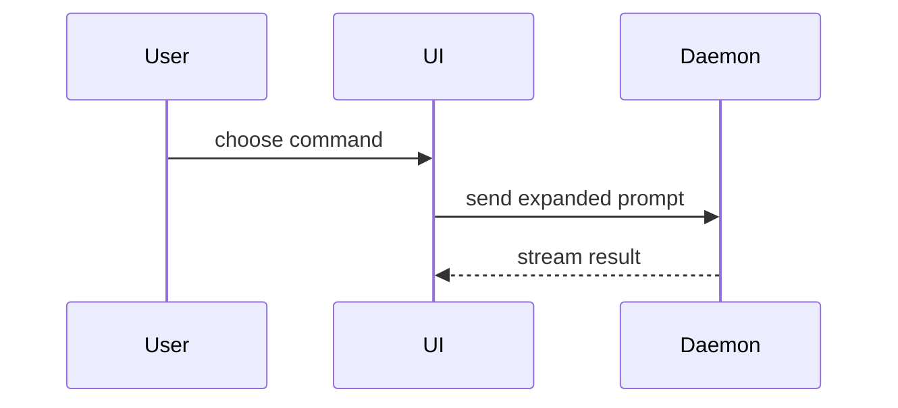

# Re-pitch it visually

The `visual` branch of [`wait-what`](SKILL.md). Same job as the prose re-pitch — make the thing that did not land land — with one HTML page carrying the explanation.

Explain what was already said. The material is the message the user just stopped you on, not a fresh investigation.

## Put the page where the user is looking

Show the page in the richest surface this session has:

- **You hold a tool that renders HTML for the user** — a visual panel, canvas, artifact, or site surface. Use it. The page appears beside the conversation and the user reads it without leaving.
- **Plain CLI only** — write the file to a temporary location outside the working tree, open it with this machine's file-opening command, and give the user the path in your reply.

## Views

Skip the preamble and keep prose brief. Pick the smallest view that makes the key point clear. Every view below goes on the page.

- Show logic or an algorithm as pseudocode:

```text
on(save)
  if content is unchanged
    return cached result
  write new content
  return fresh result
```

- Show runtime control flow as a call tree:

```text
submitForm
  createSession
    persistPrompt
    launchAgent
  navigateToSession
```

- Show UI structure as a component tree, including state and module boundaries that matter:

```tsx
<SessionPage> (apps/example/src/routes/session.tsx)
  useSessionEvents()
  <SessionToolbar>
    <RunSkillButton> (packages/ui)
```

- Show file responsibility or a broad refactor as a shallow file tree:

```text
src/
├── commands/       # parses user actions
├── sessions/       # owns session state
└── transport/      # sends API requests
```

- Show component interaction, control flow, or data flow with Mermaid:



- Use `diff` when the point is what changes and the surrounding shape already exists. Match the diff shape to the topic.

For a component change:

```diff
 <SessionPage>
   useSessionEvents()
   <SessionToolbar>
+    <RunSkillButton />
   <SessionTimeline>
+    <SkillResultCard />
```

For a file-layout change:

```diff
 src/
 ├── commands/
+│   └── show-me.ts       # expands the slash command
 ├── sessions/
-└── transport.ts
+└── transport/
+    ├── client.ts
+    └── stream.ts
```

For a call-tree or call-stack change:

```diff
 submitForm
   createSession
     persistPrompt
+    expandSkillMention
     launchAgent
-  navigateToSession
+  navigateToSession
+    subscribeToEvents
```

For a state or control-flow change:

```diff
 on(save)
-  write content
+  if content is unchanged
+    return cached result
+  write new content
+  invalidate cache
```

- Show the whole block when most of it is new, when omitted context would hide ownership or order, or when the user needs a copyable target shape:

```ts
function expandSkill(command: string): string {
  const skillName = command.slice(1)
  return `use the ${skillName} skill`
}
```

- The page carrying these is itself the visual: a diagram, an infographic, or a short slide deck, whichever fits the point. A visual UI, a layout, or a state comparison is drawn on it directly. Match the product's colors, type, spacing, and components; use real labels and data; support desktop and mobile.

### guidance

Place each visual next to the short text it supports. Keep only the calls, files, props, states, and boundaries needed to answer the user's current question or the options to resolve the current discussion point.

You may use one of these, you may use several, it is unlikely you will use all of them. Use your judgement and don't overwhelm the user.
