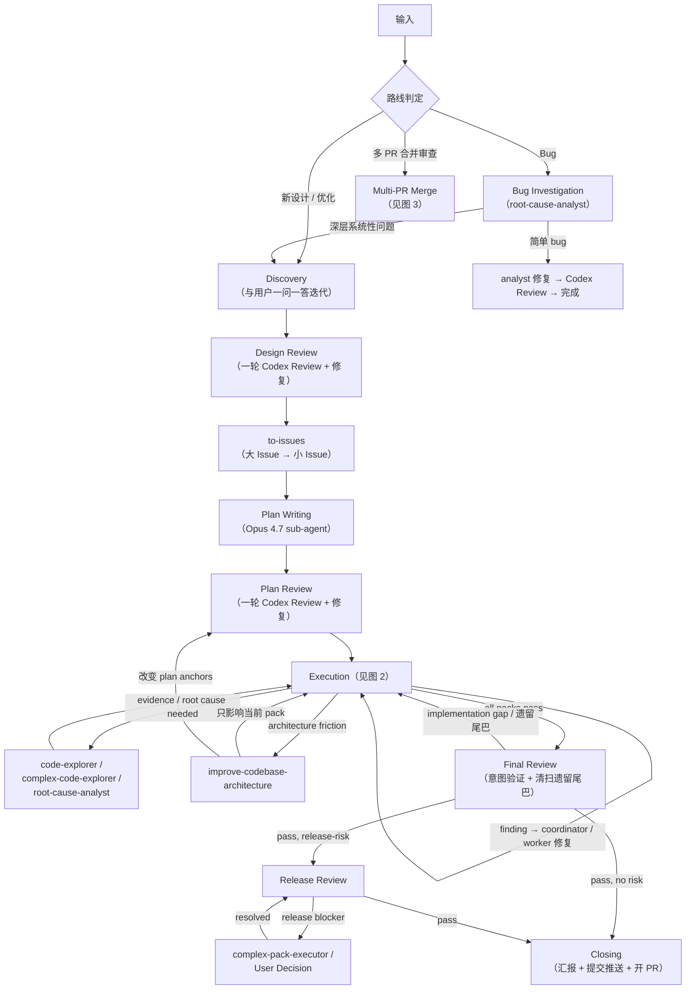
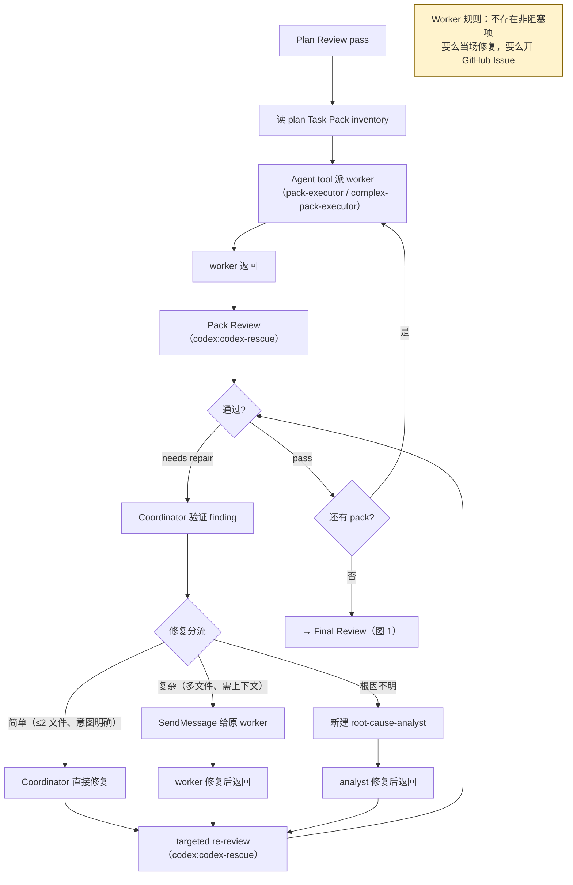
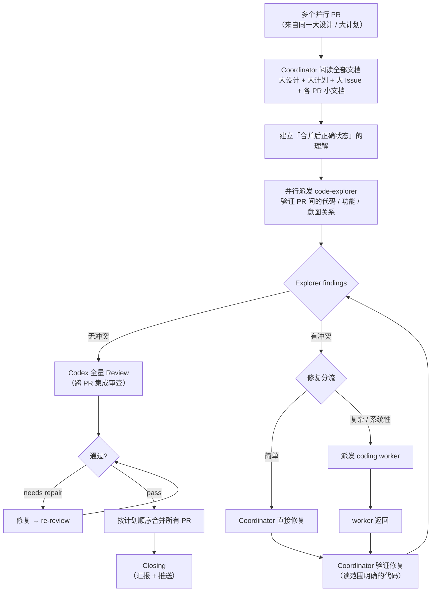

# Orchestrate Workflow Architecture Draft

来源：commit 774f7fe + 对齐讨论

## 图 1：全局流程（三条路线）

```mermaid
flowchart TD
    A["输入"] --> B{"路线判定"}

    %% 路线 1：新设计 / 优化
    B -->|"新设计 / 优化"| C["Discovery\n（与用户一问一答迭代）"]

    %% 路线 2：Bug
    B -->|"Bug"| BUG["Bug Investigation\n（root-cause-analyst）"]
    BUG -->|"简单 bug"| DR["analyst 修复 → Codex Review → 完成"]
    BUG -->|"深层系统性问题"| C

    %% 路线 3：多 PR 合并
    B -->|"多 PR 合并审查"| MPR["Multi-PR Merge\n（见图 3）"]

    %% 文档阶段（线性，不回流）
    C --> D["Design Review\n（一轮 Codex Review + 修复）"]
    D --> E["to-issues\n（大 Issue → 小 Issue）"]

    %% 以下 per issue，同一 session 内完成
    E --> F["Plan Writing\n（Opus 4.7 sub-agent）"]
    F --> G["Plan Review\n（一轮 Codex Review + 修复）"]

    %% 执行阶段（内循环）
    G --> H["Execution（见图 2）"]
    H -->|"finding → coordinator / worker 修复"| H
    H -->|"evidence / root cause needed"| P["code-explorer /\ncomplex-code-explorer /\nroot-cause-analyst"]
    P --> H
    H -->|"architecture friction"| Q["improve-codebase-\narchitecture"]
    Q -->|"只影响当前 pack"| H
    Q -->|"改变 plan anchors"| G
    H -->|"all packs pass"| I["Final Review\n（意图验证 + 清扫遗留尾巴）"]
    I -->|"implementation gap / 遗留尾巴"| H
    I -->|"pass, release-risk"| J["Release Review"]
    I -->|"pass, no risk"| K
    J -->|"release blocker"| N["complex-pack-executor /\nUser Decision"]
    N -->|"resolved"| J
    J -->|"pass"| K
    K["Closing\n（汇报 + 提交推送 + 开 PR）"]
```

## 图 2：Execution 循环

```mermaid
flowchart TD
    A["Plan Review pass"] --> B["读 plan Task Pack inventory"]
    B --> C["Agent tool 派 worker\n（pack-executor / complex-pack-executor）"]
    C --> D["worker 返回"]
    D --> E["Pack Review（codex:codex-rescue）"]
    E --> F{"通过?"}
    F -->|"needs repair"| V["Coordinator 验证 finding"]
    V --> T{"修复分流"}
    T -->|"简单（≤2 文件、意图明确）"| S["Coordinator 直接修复"]
    T -->|"复杂（多文件、需上下文）"| R["SendMessage 给原 worker"]
    T -->|"根因不明"| RCA["新建 root-cause-analyst"]
    S --> RE["targeted re-review（codex:codex-rescue）"]
    R --> D2["worker 修复后返回"]
    D2 --> RE
    RCA --> D3["analyst 修复后返回"]
    D3 --> RE
    RE --> F
    F -->|"pass"| J{"还有 pack?"}
    J -->|"是"| C
    J -->|"否"| K["→ Final Review（图 1）"]

    style RULE fill:#fff3cd,stroke:#856404
    RULE["Worker 规则：不存在非阻塞项\n要么当场修复，要么开 GitHub Issue"]
```

## 图 3：Multi-PR Merge 流程

```mermaid
flowchart TD
    A["多个并行 PR\n（来自同一大设计 / 大计划）"] --> B["Coordinator 阅读全部文档\n大设计 + 大计划 + 大 Issue + 各 PR 小文档"]
    B --> C["建立「合并后正确状态」的理解"]
    C --> D["并行派发 code-explorer\n验证 PR 间的代码 / 功能 / 意图关系"]
    D --> E{"Explorer findings"}
    E -->|"无冲突"| K["Codex 全量 Review\n（跨 PR 集成审查）"]
    E -->|"有冲突"| F{"修复分流"}
    F -->|"简单"| G["Coordinator 直接修复"]
    F -->|"复杂 / 系统性"| H["派发 coding worker"]
    H --> J["worker 返回"]
    G --> V["Coordinator 验证修复\n（读范围明确的代码）"]
    J --> V
    V --> E
    K --> L{"通过?"}
    L -->|"needs repair"| M["修复 → re-review"]
    M --> L
    L -->|"pass"| N["按计划顺序合并所有 PR"]
    N --> O["Closing\n（汇报 + 推送）"]
```
