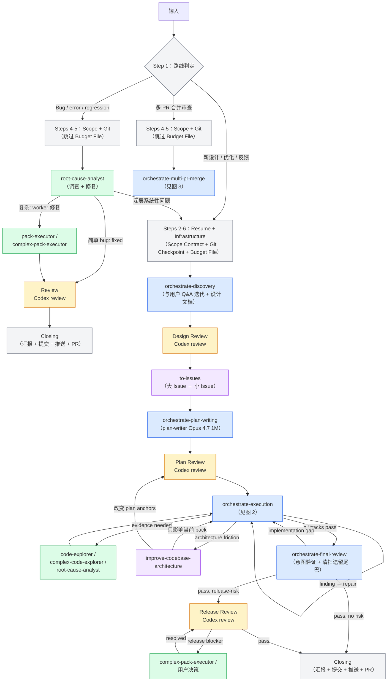
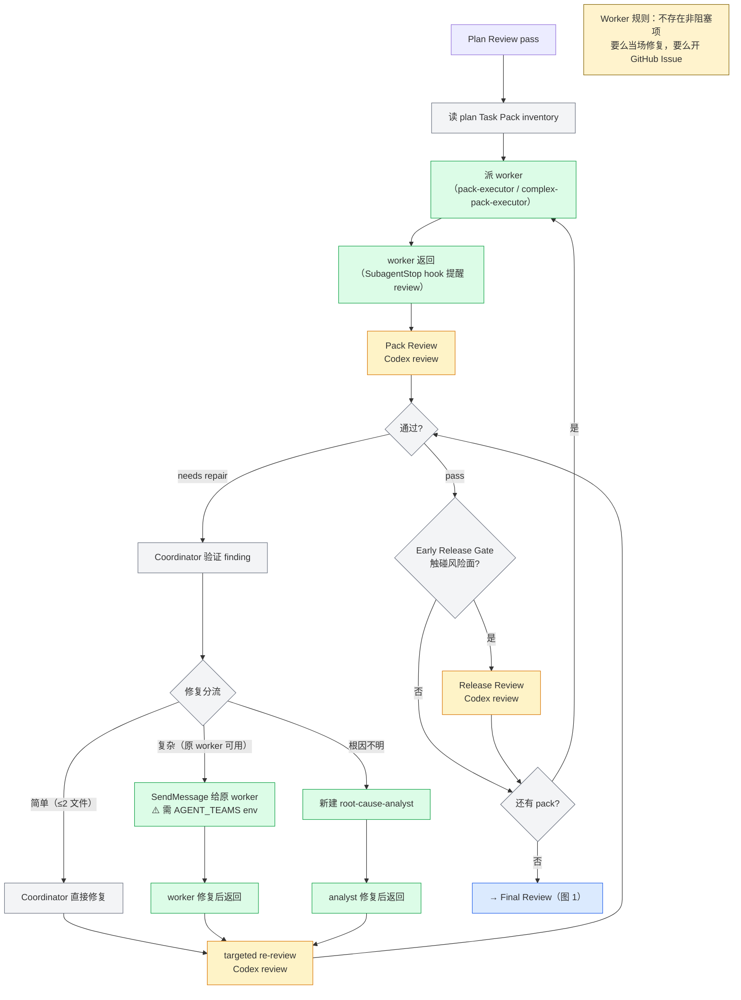
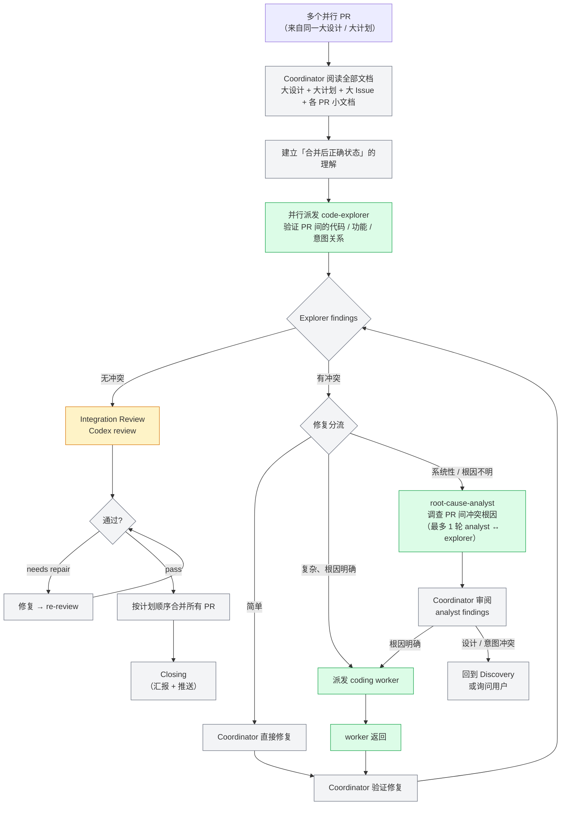

# Plugin V2 架构文档（基于 2026-05-20 审计）

> **审计基准**：`plugin-v2/` 目录下的实际代码（skills/ agents/ hooks/）。
> **审计日期**：2026-05-20，基于 commit 5d8d9f7。
> **上一次 E2E 审计**：`plugin-v2/E2E-AUDIT-REPORT.md`（2026-05-19）。

## 图例

```
🟦 蓝色 = 内部 Skill（按需加载到主线程）
🟩 绿色 = Sub-Agent（独立子进程，不消耗主线程上下文）
🟧 橙色 = 外部 Review（跨模型独立审查）
🟪 紫色 = 外部 Skill（orchestrate 之外的独立技能）
⬜ 灰色 = Coordinator 自身逻辑（路线判定、修复分流、git 操作等）
🟥 红色 = 断点 / 矛盾（需修复后流程才通畅）
⬜ 虚线 = 路径存在但机制缺失或矛盾
```

---

## 图 1：全局流程（三条路线）



### 图 1 节点分析

| 节点 | 机制 | 做什么 | 状态 |
|------|------|--------|------|
| 路线判定 | Coordinator 自身逻辑 | 判断输入属于三条路线中的哪一条 | ✅ 正常 |
| Steps 2-6 Infrastructure | Coordinator 逻辑（`workflow-infrastructure.md`） | Cross-Conversation Resume + Scope Contract + Git Checkpoint + Budget File 创建 | ✅ 正常 |
| Discovery | Skill：`orchestrate-discovery` | 与用户 Q&A 迭代 + grill-with-docs 同步维护 CONTEXT.md + 产出设计文档 | ✅ 正常 |
| Design Review | Coordinator + **外部 Review** | 两个 baseline review（Design Content + Project Alignment），按 `各 dispatch 模板内联的 Codex review 派发步骤` 派发 | ✅ 正常 |
| to-issues | 外部 Skill | 设计文档拆分为大 Issue → 小 Issue | ✅ 正常 |
| Plan Writing | Skill：`orchestrate-plan-writing` | 前置确认 + 派 plan-writer agent + Budget 赋值（`2N+12`） | ✅ 正常 |
| Plan Review | Coordinator + **外部 Review** | Plan Entry Gate + Task Pack Inventory Gate → 派外部 review | ✅ 正常 |
| Execution | Skill：`orchestrate-execution` | 图 2 的 pack 循环 | ✅ 正常（review 节点除外） |
| Final Review | Skill：`orchestrate-final-review` | 意图验证 + 清扫遗留尾巴 + Release Gate | ✅ 正常（review 节点除外） |
| Release Review | Coordinator + **外部 Review** | 发布风险审查，仅触碰风险面时进入 | ✅ 正常 |
| Bug Investigation | Sub-Agent：root-cause-analyst | 调查 bug 根因，判定简单/深层 | ✅ 正常 |
| Bug Fix Review | **外部 Review** | 按 `各 dispatch 模板内联的 Codex review 派发步骤` 派发 Codex review | ✅ 正常 |
| Closing | Coordinator 自身逻辑 | 汇报 + 提交 + 推送 + 开 PR | ✅ 正常 |

---

## 图 2：Execution 循环



### 图 2 节点分析

| 节点 | 机制 | 做什么 | 状态 |
|------|------|--------|------|
| 读 Task Pack inventory | Coordinator 逻辑 | 读取所有 plan 文档中的 Task Pack 列表 | ✅ 正常 |
| 派 worker | Sub-Agent：`pack-executor`（普通）/ `complex-pack-executor`（高风险） | Agent tool 派发 coding worker，保存 agentId | ✅ 正常 |
| SubagentStop 提醒 | Hook：`SubagentStop` on `pack-executor\|complex-pack-executor` | 提醒 Coordinator 派发 review | ✅ 正常 |
| Pack Review | **外部 Review** | 按 `各 dispatch 模板内联的 Codex review 派发步骤` 派发 | ✅ 正常 |
| Coordinator 验证 finding | Coordinator 逻辑 | 主线程评估 finding 是否成立 | ✅ 正常 |
| 修复分流 | Coordinator 逻辑 | 简单/复杂/根因不明三路分流 | ✅ 正常 |
| SendMessage 给原 worker | SendMessage（需 `CLAUDE_CODE_EXPERIMENTAL_AGENT_TEAMS`） | 复杂修复发回原 worker 保持上下文 | ⚠️ env 未设置时静默降级 |
| targeted re-review | **外部 Review** | 只审查修复变更 | ✅ 正常 |
| Early Release Gate | Coordinator + **外部 Review** | Pack 触碰风险面时触发 release review | ✅ 正常 |

---

## 图 3：Multi-PR Merge 流程



### 图 3 节点分析

| 节点 | 机制 | 做什么 | 状态 |
|------|------|--------|------|
| Coordinator 阅读全部文档 | Coordinator 逻辑 | 读大设计 + 大计划 + 各 PR 小文档，建立全局理解 | ✅ 正常 |
| 并行派发 code-explorer | Sub-Agent：`code-explorer` / `complex-code-explorer` | 并行探索各 PR 代码，发现冲突 | ✅ 正常 |
| 修复分流 | Coordinator 逻辑 | 简单/复杂/系统性三路分流 | ✅ 正常 |
| root-cause-analyst 调查 | Sub-Agent：root-cause-analyst | 系统性冲突根因调查（capped at 1 轮 analyst ↔ explorer） | ✅ 正常 |
| Integration Review | **外部 Review** | 跨 PR 集成审查 | ✅ 正常 |
| 按计划顺序合并 PR | Coordinator 逻辑 | git 操作 | ✅ 正常 |

---

## 状态文件链

```
orchestrate-workflow Step 4
  └─ .claude/multi-model-workflow/scope-<run_id>.md        ← Scope Contract
orchestrate-workflow Step 6
  ├─ .claude/multi-model-workflow/budget-<run_id>.json      ← Budget File（Route 1 only）
  └─ .claude/multi-model-workflow/active-run-id             ← Active Run ID
orchestrate-plan-writing Step 12a
  └─ budget-<run_id>.json: budget_total = 2N + 12           ← Budget 赋值（不可变）
每次 review 完成
  └─ budget-<run_id>.json: budget_used += 1                 ← Budget 消耗
每个 phase verdict 后
  └─ budget-<run_id>.json: last_gate_phase + timestamp      ← Phase 标记
Review 派发时
  ├─ .claude/multi-model-workflow/review-prompts/<gate>.md  ← Review prompt
  └─ .claude/multi-model-workflow/review-results/<gate>.md  ← Review result
Closing 前（cleanup-before-push.sh）
  └─ 清除 active-run-id + scope + budget + review temp files
```

---

## 返回值路由表

### orchestrate-discovery → orchestrate-workflow

| 返回值 | Coordinator 动作 |
|--------|-----------------|
| `DISCOVERY_READY` | 检查 issue hierarchy → 有则进 plan-writing；无则先调 `to-issues` |
| `DISCOVERY_NOT_NEEDED` | 同上 |
| `READY_FOR_REPAIR` | 进入 Direct Repair mini-route → Closing |
| `NEEDS_USER_DECISION` | 询问用户 → 重新进入 discovery |
| `BLOCKED` | 报告用户 |

### orchestrate-plan-writing → orchestrate-workflow

| 返回值 | Coordinator 动作 |
|--------|-----------------|
| `PLAN_CREATED` | 确认 budget file → 进入 execution |
| `NEEDS_DISCOVERY` | 回到 discovery |
| `NEEDS_DESIGN_REVIEW` | 回到 design review |
| `NEEDS_ISSUES` / `NEEDS_TRIAGE` | 调用 to-issues / triage |
| `NEEDS_DIAGNOSIS` / `NEEDS_ARCHITECTURE` / `NEEDS_CONTEXT` | 调用对应外部 skill |
| `NEEDS_DECISION` | 询问用户 |
| `BLOCKED` | 报告用户 |

### orchestrate-execution → orchestrate-workflow

| 返回值 | Coordinator 动作 |
|--------|-----------------|
| `EXECUTION_PASSED` | 进入 final-review |
| `NEEDS_DISCOVERY` | 回到 discovery |
| `NEEDS_PLAN_REVISION` | 回到 plan-writing |
| `NEEDS_ARCHITECTURE` | 调用 improve-codebase-architecture → 回到 execution 或 plan-writing |
| `BLOCKED` | 报告用户 |

### orchestrate-final-review → orchestrate-workflow

| 返回值 | Coordinator 动作 |
|--------|-----------------|
| `FINAL_REVIEW_PASSED` | Closing |
| `FINAL_REVIEW_PASSED_WITH_RELEASE_RISK` | Closing（release review 已在内部处理） |
| `NEEDS_EXECUTION` | 回到 execution（**最多 1 次**；第 2 次 → BLOCKED） |
| `NEEDS_DISCOVERY` | 回到 discovery |
| `NEEDS_PLAN_REVISION` | 回到 plan-writing |
| `BLOCKED` | 报告用户 |

### orchestrate-multi-pr-merge → orchestrate-workflow

| 返回值 | Coordinator 动作 |
|--------|-----------------|
| `MERGE_COMPLETE` | Closing |
| `NEEDS_DISCOVERY` | analyst 发现设计/意图冲突 → 回到 discovery |
| `NEEDS_USER_DECISION` | 询问用户 |
| `BLOCKED` | 报告用户 |

---

## 组件汇总

### 内部 Skill（6 个，按需加载到主线程）

| Skill | 对应节点 | 职责 |
|-------|---------|------|
| `orchestrate-workflow` | 路线判定 + Infrastructure + Bug 路线 + Direct Repair + Closing | 入口路由、Scope Contract、Git Checkpoint、Budget File、Bug 路线调度、Direct Repair mini-route、Closing |
| `orchestrate-discovery` | Discovery + Design Review + to-issues 过渡 | Q&A 迭代 + grill-with-docs + 设计文档 + Design Review + to-issues 检查/调用 |
| `orchestrate-plan-writing` | Plan Writing + Plan Review | 前置确认 + plan-writer dispatch + Budget 赋值 + Plan Review + Git Checkpoint |
| `orchestrate-execution` | Execution（图 2） | Pack 循环：派 worker → Pack Review → 修复分流 → Early Release Gate → 循环释放 |
| `orchestrate-final-review` | Final Review + Release Gate | 意图验证 + 清扫遗留尾巴 + Final Release Gate + 业务汇报 |
| `orchestrate-multi-pr-merge` | Multi-PR Merge（图 3） | 冲突发现 → 根因调查 → 修复 → 集成审查 → 合并 |

Skill 命名空间：`multi-model-workflow:orchestrate-*`（全限定名，通过 `Skill({ skill: "..." })` 调用）。

### Sub-Agent（7 个）

| Agent | 模型 | 用在哪 | `skills:` 自动加载 | 体内 Skill tool 调用 |
|-------|------|--------|-------------------|---------------------|
| `plan-writer` | Opus 4.7 (1M) | Plan Writing | — | `improve-codebase-architecture` |
| `pack-executor` | Sonnet | Execution 普通 pack / Bug worker | `tdd` | `diagnose`, `prototype` |
| `complex-pack-executor` | Opus 4.7 | Execution 高风险 pack / Release blocker | `tdd` | `diagnose`, `improve-codebase-architecture`, `prototype` |
| `code-explorer` | Sonnet | Execution 证据收集 / Multi-PR 代码探索 | — | — |
| `complex-code-explorer` | Opus 4.7 | 多模块调查 | — | — |
| `root-cause-analyst` | Opus 4.7 (1M), maxTurns: 40 | Bug Investigation / Execution RCA / Multi-PR 冲突调查 | `diagnose`, `tdd` | — |
| `docs-worker` | Sonnet, maxTurns: 20 | 文档清理（Closing 阶段可选） | `grill-with-docs` | — |

**注意**：
- Plugin-v2 **没有 `code-reviewer` 和 `release-reviewer` agent**。所有 review 通过 `各 dispatch 模板内联的 Codex review 派发步骤` 直接调用 codex 插件的 `codex-companion.mjs` 派发。
- `skills:` 自动加载 = frontmatter 声明，agent 启动时自动预加载。体内 Skill tool 调用 = agent body 中通过 `Skill({ skill: "..." })` 按需调用，不预加载。
- `plan-writer` frontmatter 无 `skills:` 字段，`improve-codebase-architecture` 在 body 中按需调用。
- `docs-worker` frontmatter 只声明 `grill-with-docs`，**`triage` 未在 frontmatter 中声明**（与原 draft 不一致）。

### Hooks（5 个）

| 事件 | Matcher | 做什么 | 状态 |
|------|---------|--------|------|
| `SessionStart` | `startup\|clear\|compact` | `session-start.sh`：注入行为覆盖规则 | ✅ 正常 |
| `PreToolUse` | `Bash` | `guard-premature-push.sh`：阻止未完成时 push/PR | ✅ 正常 |
| `PreToolUse` | `Bash` | `cleanup-before-push.sh`：push 前清理 `.claude/multi-model-workflow/` | ✅ 正常 |
| `SubagentStop` | `pack-executor\|complex-pack-executor` | 提醒 Coordinator 按 各 dispatch 模板内联的 Codex review 派发步骤 派发 review | ✅ 正常 |

### 外部 Skill

#### Coordinator 按需调用（主线程 Skill tool）

| Skill | 用在哪 | 产出 |
|-------|--------|------|
| `grill-with-docs` | Discovery：术语对齐，同步维护 CONTEXT.md | 更新 CONTEXT.md |
| `prototype` | Discovery：状态/UI 方向验证 | throwaway 原型 + verdict |
| `to-issues` | Design Review 通过后 | vertical issues |
| `improve-codebase-architecture` | Execution 中 architecture friction / Discovery 中架构分析 | 架构分析 + 建议 |
| `zoom-out` | 任何阶段需要代码地图 | 模块地图 + 调用链 |
| `triage` | Issue 管理 | issue 分类 |
| `diagnose` | Bug 路线或 Execution 中需要重现/假设 | 反馈循环 + 假设 |

#### Agent-Bound（frontmatter `skills:` 自动加载）

| Skill | 自动加载到 |
|-------|-----------|
| `tdd` | pack-executor, complex-pack-executor, root-cause-analyst |
| `diagnose` | root-cause-analyst |
| `grill-with-docs` | docs-worker |

其他 skill（`improve-codebase-architecture`、`prototype`、`triage`、`zoom-out`）**不在任何 agent frontmatter 的 `skills:` 中**——agent body 中通过 `Skill({ skill: "..." })` 按需调用。

#### 外部 Plugin（可选）

| Plugin Skill | 用在哪 |
|-------------|--------|
| `frontend-design` | Discovery：UI 项目的高品质前端原型 |

---

## 断点与已知问题

### 🔴 Critical（流程不通畅）

#### B1：Review Budget 追踪改为 Coordinator 手动（已修复指令矛盾）

**已修复**：本次审计修正了 `session-start.sh`、`bug-investigation-route.md`、`workflow-direct-repair.md`、`final-review-repair.md` 中残留的旧 review 派发指令，统一到 `各 dispatch 模板内联的 Codex review 派发步骤` 机制。

**Review 派发机制**：所有 review 节点统一通过 Bash 直接调用 codex 插件的 `codex-companion.mjs`（位于 `~/.claude/plugins/marketplaces/openai-codex/plugins/codex/scripts/`），按 `各 dispatch 模板内联的 Codex review 派发步骤` Step 1-4 执行。

**剩余关注点**：
- Review budget 现在由 Coordinator 手动更新 `budget_used` 和 `dispatches` 数组（`各 dispatch 模板内联的 Codex review 派发步骤` 明确要求）。原有的 SubagentStop 自动追踪 hook 已移除。如果 Coordinator 遗忘手动更新，budget 数据会不准确。
- `codex-companion.mjs` 的路径查找依赖 `find ~/.claude/plugins -path "*/codex/scripts/codex-companion.mjs"`。codex 插件更新或卸载后路径可能变化。

#### B3：SendMessage 静默降级

**症状**：`CLAUDE_CODE_EXPERIMENTAL_AGENT_TEAMS` 未设置时，所有 `SendMessage` 路径（worker repair、plan-writer repair、Final Review repair）静默降级为新建 agent，丢失原 worker 上下文。

**来源**：E2E 审计 S2。`session-start.sh` 检查此 env var 并警告，但 SKILL.md 内无降级处理说明。

### 🟡 Medium（不影响主路径但有隐患）

#### M1：`needs context` 整体 verdict 无处理路径

Codex reviewer 可能返回 overall verdict = `needs context`，但所有 Disposition 表只处理 per-finding dispositions。整体 `needs context` 悬空。（E2E 审计 S5，Route 2 Step 17 已修，其他 review 节点未修。）

#### M2：Release Gate "独立预算"描述误导

Release Gate 声称有"独立预算"，实际 2 个 dispatch slot 已包含在全局 `2N+12` 中。（E2E 审计 S1）

#### M3：Cross-Conversation Resume budget 判断

Design Review 阶段的 per-phase allowance check 用全局 `budget_used` 而非 phase-local 计数器，跨 session 恢复时可能错误阻断。（E2E 审计 S4）

#### M4：Budget 公式偏紧

`2N+12`（N = Task Pack 总数）在有 repair 的真实运行中很快耗尽。1 次 Plan Review repair + 1 次 Pack Review repair + 1 次 Final Review repair = 21/22 dispatches，2 个 pack 失败就超限。（E2E 审计 M4）

#### M5：Final Review ↔ Execution 回流无显式循环上限

Budget 是隐式上限，但 `NEEDS_EXECUTION` 回流仅标注"最多 1 次"在 orchestrate-workflow 层面——如果 budget 允许，orchestrate-final-review 内部没有独立计数。（E2E 审计 M9）

#### M6：Disposition 表 / Repair 路由 / Forbidden Shortcuts 大量重复

4x Disposition 表、3x repair 路由、2x Forbidden Shortcuts。更新其一遗忘其他会导致标准不一致。（E2E 审计 M1-M3）

#### M7：Bug 路线无 budget 机制

Route 2 跳过 Budget File 创建。如果 bug 调查触发多轮 review，没有任何预算约束。（E2E 审计 R2-M2）

#### M8：Bug → Discovery 种子信息依赖会话上下文

Bug 调查升级为 Formal Orchestrate 时，root cause 信息通过会话上下文传递，compaction 可能丢失。（E2E 审计 R2-M1）

#### M9：Multi-PR 递归冲突无全局深度限制

修复一个 PR 间冲突可能引入新冲突，形成修复链。无全局 depth cap。（E2E 审计 R3-M1）

### ℹ️ Info（设计选择，已知但可接受）

- **Cognitive load**：Coordinator 需读 ~6 SKILL.md + ~25 reference files ≈ 4000 行指令。E2E 审计指出 M1-M3 重复是主要原因。
- **`${CLAUDE_PLUGIN_ROOT}` 在 sub-agent 中可能不解析**：E2E 审计 R3-M2，影响 Multi-PR 路线。
- **TDD strict 无 escape valve**：trivial tasks（constants、README、CSS）无法跳过 TDD 要求。`agents.overrides.md` 标注 v0.8.3 修复但未见对应代码变更。

---

## 对齐结论记录

以下是架构讨论中确认的设计决策。标注 ✅ = 当前仍然成立，⚠️ = 需要更新，❌ = 已过时。

### 1. 只有三条路线，不是六条 ✅

新设计/优化、Bug、多 PR 合并审查。Answer-only / One-shot Review / User Decision / Direct Repair 不是独立路线。

### 2. Bug 和新设计本质上是同一种任务 ✅

简单 bug → analyst 修复 + review → Closing。深层 bug → 汇入 Route 1。

### 3. Bug 路线不走 Final Review ✅

已验证：plugin-v2 的 `bug-investigation-route.md` 明确 Step 17 → Closing，Step 18 → Closing。

### 4. 不再用 Phase A/B/C 命名 ✅

改用描述性名称：Discovery、Design Review、Plan Review、Execution、Final Review、Closing。

### 5. 文档阶段是线性的，不回流 ✅

Discovery → Design Review → to-issues → Plan Writing → Plan Review，各一轮 review + 修复，不循环。回流/内循环只在 Execution 阶段。

### 6. to-issues 的拆分逻辑 ✅

设计文档 → 大 Issue → 小 Issue。依赖外部 skill。

### 7. Plan Writing 是独立的 Sub-Agent ✅

plan-writer 用 Opus 4.7 (1M)，不自动加载 SKILL.md（`agents.overrides.md` 确认）。

### 8. per issue 开 session，同一 session 内完成 ✅

Plan Writing → Plan Review → Execution → Final Review → Closing 在同一 session 内。

### 9. Final Review 的两个职责 ✅

意图验证 + 清扫遗留尾巴。plugin-v2 还加了 Release Gate（条件触发）。

### 10. Coding Worker 规则：不存在"非阻塞项" ✅

要么当场修复，要么开 GitHub Issue。

### 11. Closing 应该积极主动 ✅

提交 + 推送 + 开 PR 自动执行。`guard-premature-push.sh` hook 确保只在所有 task 完成后才放行。

### 12. Release Review 只做一次，在 Final Review 之后 ⚠️ 需更新

**当前实际**：Release Review 可能做 **两次**——Execution 阶段有 Early Release Gate（按 pack 触碰风险面触发），Final Review 阶段有 Final Release Gate。两次合计最多 2 个 dispatch，在全局 `2N+12` 预算内。

### 13. 三种 Agent 角色的本质区别 ✅

Explorer（广泛发现）、Coordinator（派发 + 把关 + 明确范围的代码修改）、Coding Worker（按设计计划落地）。

### 14. Multi-PR Merge 的关键细节 ✅

冲突是 PR 间的。功能/意图冲突最难。Coordinator 读文档建立方向，Explorer 做代码验证。系统性冲突先 analyst 调查再修。修复后 Coordinator 验证。PR 并行分析。新增：analyst ↔ explorer 循环 capped at 1 轮。

### 15. 外部 Skill 体系 ⚠️ 需更新

**Agent-Bound 实际状态**（基于 `plugin-v2/agents/*.md` frontmatter `skills:` 字段）：

| Skill | frontmatter 自动加载 | body 中 Skill tool 按需调用 |
|-------|---------------------|---------------------------|
| `tdd` | pack-executor, complex-pack-executor, root-cause-analyst | — |
| `diagnose` | root-cause-analyst | pack-executor, complex-pack-executor |
| `grill-with-docs` | docs-worker | — |
| `improve-codebase-architecture` | — | complex-pack-executor, plan-writer |
| `prototype` | — | pack-executor, complex-pack-executor |
| `triage` | — | — （docs-worker body 未提及，frontmatter 未声明） |
| `zoom-out` | — | — （无 agent 绑定，仅 Coordinator 调用） |

**与原 draft 差异**：`prototype` 从未进入 frontmatter autoload（只是 body 调用）；`triage` 从 docs-worker frontmatter 中消失；`diagnose` 只有 root-cause-analyst 自动加载，其他 agent 按需调用。

**Coordinator-Invoked** 不变：grill-with-docs、prototype、to-issues、improve-codebase-architecture、zoom-out、triage、diagnose。

### 16. Review 机制（新增） ✅

Plugin-v2 没有 `code-reviewer` / `release-reviewer` agent。所有 review 统一通过 `各 dispatch 模板内联的 Codex review 派发步骤` 定义的机制派发：Coordinator 直接 Bash 调用 codex 插件的 `codex-companion.mjs`（`task` → `status --wait` → `result`），review prompt 写入 `.claude/multi-model-workflow/review-prompts/<gate>.md`，结果保存到 `review-results/<gate>.md`。Budget 由 Coordinator 每次 review 完成后手动更新。

### 17. 与 Codex Runtime 的关系（新增）

Plugin-v2 和 `.agents/skills/`（Codex runtime）是**两套并行代码**，30+ 文件已不同步。关键差异：

| 维度 | Plugin V2 | Codex Runtime |
|------|-----------|---------------|
| Skill 调用语法 | `Skill({ skill: "multi-model-workflow:..." })` | 裸名 `orchestrate-*` |
| 状态文件路径 | `.claude/multi-model-workflow/` | `.codex/multi-model-workflow/` |
| 分支命名 | `work/<scope>` | `codex/<scope>` |
| Review 派发 | `各 dispatch 模板内联的 Codex review 派发步骤`（codex-companion.mjs 不存在） | `codex/reviewers/claude-subscription-review.sh` |
| Agent 命名 | `plan-writer`（连字符） | `plan_writer`（下划线） |
| Worker 隔离 | `isolation: "worktree"` | disjoint write sets |
| Reviewer agents | 无 | `code_reviewer` + `release_reviewer`（TOML） |
| SubagentStop hooks | 有（track budget） | 无（Codex CLI 自带返回值） |

`.agents/skills/` 已领先 plugin-v2 若干 bug 修复 commit。同步方向是单向的：`.agents/skills/` → 外部 repo（通过 `install-orchestrate-runtime.sh`），没有 plugin-v2 ↔ .agents 的双向同步脚本。
